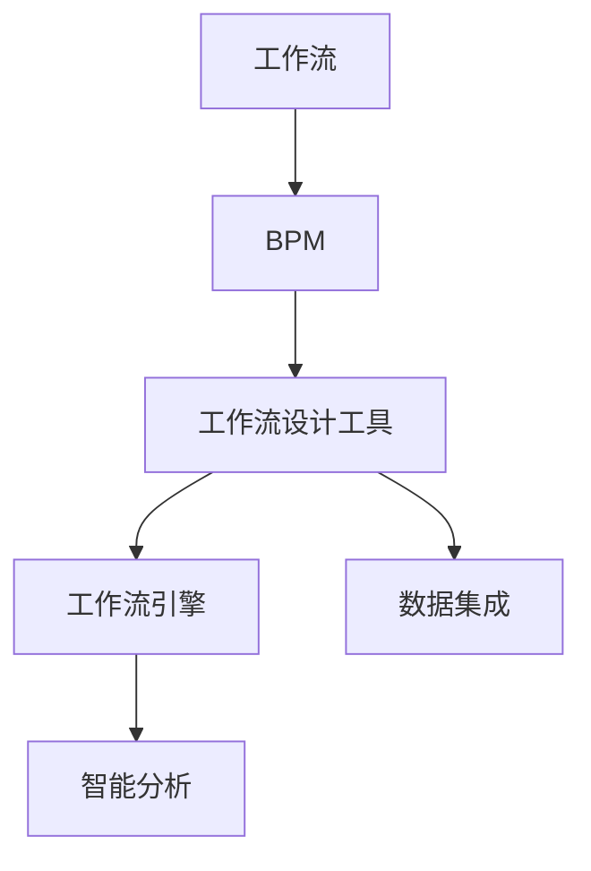
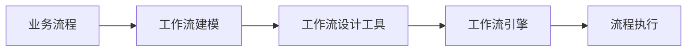
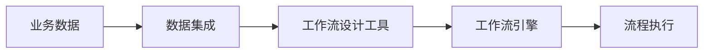
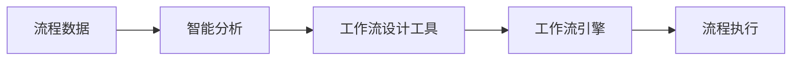
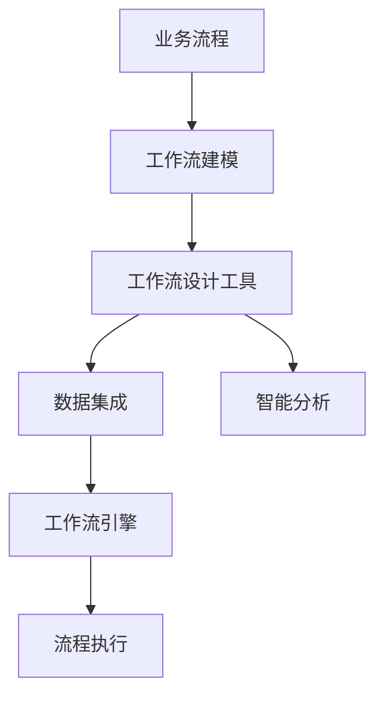

                 

## 1. 背景介绍

### 1.1 问题由来
随着企业数字化转型的加速，工作流管理已成为提升生产效率、优化业务流程的重要手段。传统的流程管理方式依赖纸质文件和人工记录，效率低下、易于出错，已经无法满足现代企业的业务需求。而工作流可视化设计工具，通过将流程建模为图形界面，简化了流程理解和操作，提升了工作效率和准确性。

工作流可视化设计工具，最初主要应用于BPM（Business Process Management）领域，但随着企业信息化建设的深入，其应用场景不断扩展，已经渗透到项目管理、运营管理、供应链管理等多个业务领域。

### 1.2 问题核心关键点
工作流可视化设计工具的核心在于如何高效地将业务流程转化为图形界面，并提供简单易用的操作界面，使得流程的创建、修改、监控和优化变得更为高效。其关键点包括：

- **流程建模**：将业务流程抽象为流程模型，并用图形界面展示。
- **操作界面**：提供可视化操作界面，使得用户可以直观地进行流程配置和管理。
- **数据集成**：实现流程与其他系统（如ERP、CRM、OA等）的数据对接，确保流程执行的实时性和准确性。
- **智能分析**：通过数据分析，优化流程，提升业务效率。

### 1.3 问题研究意义
工作流可视化设计工具在提升企业信息化水平、优化业务流程、提高工作效率和准确性等方面具有重要意义：

1. **提升效率**：通过图形界面简化流程管理，减少了人工操作的错误和复杂度。
2. **优化流程**：提供数据分析功能，帮助企业发现和改进业务流程中的瓶颈和问题。
3. **数据集成**：实现流程与其他系统的对接，避免了数据孤岛，提升了业务决策的实时性。
4. **智能分析**：通过数据分析，提升业务洞察力，支持更精准的业务决策。
5. **标准化管理**：统一流程管理标准，确保业务流程的一致性和可控性。

## 2. 核心概念与联系

### 2.1 核心概念概述

为更好地理解工作流可视化设计工具的核心概念，本节将介绍几个关键概念：

- **工作流（Workflow）**：一组协同完成特定任务的步骤和过程，其中每一步由一个或多个活动组成。
- **业务流程建模（BPM）**：使用图形化工具，将业务流程建模为图形界面，用于流程管理和优化。
- **工作流设计工具（Workflow Design Tool）**：提供可视化界面，用于创建、修改和优化业务流程。
- **工作流引擎（Workflow Engine）**：根据定义好的流程模型执行任务，确保流程的可靠性和高效性。
- **数据集成（Data Integration）**：实现不同系统之间的数据交换和同步，支持流程执行的数据支持。
- **智能分析（Intelligent Analysis）**：通过对流程数据进行分析，发现流程中的问题并提出优化建议。

这些核心概念之间的逻辑关系可以通过以下Mermaid流程图来展示：



这个流程图展示了几组关键概念之间的关系：

1. 工作流作为业务流程的基本单位，通过BPM建模为图形界面。
2. 工作流设计工具提供可视化界面，用于创建和修改工作流。
3. 工作流引擎根据定义好的工作流执行任务，确保流程的可靠性和高效性。
4. 数据集成实现不同系统之间的数据交换和同步，支持流程执行的数据支持。
5. 智能分析通过对流程数据进行分析，发现流程中的问题并提出优化建议。

### 2.2 概念间的关系

这些核心概念之间存在着紧密的联系，形成了工作流可视化设计工具的完整生态系统。下面我们通过几个Mermaid流程图来展示这些概念之间的关系。

#### 2.2.1 工作流建模与设计工具的关系



这个流程图展示了业务流程如何通过工作流建模转化为图形界面，再通过工作流设计工具进行修改和优化，最后由工作流引擎执行任务的过程。

#### 2.2.2 数据集成与工作流设计工具的关系



这个流程图展示了数据集成如何实现不同系统之间的数据交换和同步，为工作流设计工具提供数据支持，最终由工作流引擎执行任务。

#### 2.2.3 智能分析与工作流设计工具的关系



这个流程图展示了智能分析如何通过对流程数据进行分析，发现流程中的问题并提出优化建议，最终由工作流设计工具进行修改和优化。

### 2.3 核心概念的整体架构

最后，我们用一个综合的流程图来展示这些核心概念在工作流可视化设计工具中的整体架构：



这个综合流程图展示了从业务流程建模到流程执行的完整过程，每个环节相互关联，形成了一个完整的业务流程管理系统。

## 3. 核心算法原理 & 具体操作步骤
### 3.1 算法原理概述

工作流可视化设计工具的核心算法原理主要包括以下几个方面：

1. **流程建模算法**：将业务流程抽象为图形界面，并设计对应的算法。
2. **操作界面设计**：提供可视化操作界面，简化流程配置和管理。
3. **数据集成算法**：实现不同系统之间的数据交换和同步，支持流程执行的数据支持。
4. **智能分析算法**：通过对流程数据进行分析，发现流程中的问题并提出优化建议。

这些算法共同构成了工作流可视化设计工具的计算基础，使得流程的管理和优化变得高效、准确。

### 3.2 算法步骤详解

下面将详细介绍工作流可视化设计工具的算法步骤：

**Step 1: 流程建模**

1. **需求分析**：与业务部门沟通，明确业务流程的需求和目标。
2. **流程建模**：根据需求，使用工作流设计工具创建流程图，并设计相应的活动和流程节点。
3. **流程验证**：对模型进行验证，确保流程逻辑的正确性和完整性。

**Step 2: 操作界面设计**

1. **界面设计**：根据流程模型，设计操作界面，包括活动、节点、角色等元素。
2. **界面测试**：对操作界面进行测试，确保界面的功能和用户体验。
3. **界面部署**：将界面部署到服务器，并实现与现有系统的集成。

**Step 3: 数据集成**

1. **数据提取**：从现有系统中提取数据，并清洗和整理。
2. **数据转换**：根据业务需求，设计数据转换规则，实现数据格式的一致性。
3. **数据同步**：通过API或ETL工具，实现不同系统之间的数据同步。

**Step 4: 智能分析**

1. **数据收集**：从流程执行中收集数据，包括活动执行时间、资源使用情况等。
2. **数据分析**：使用数据分析工具，对数据进行统计和分析，发现流程中的问题。
3. **流程优化**：根据分析结果，提出优化建议，并反馈到流程设计工具中进行修改和优化。

### 3.3 算法优缺点

工作流可视化设计工具的算法具有以下优点：

1. **图形化界面**：图形界面简化了流程理解和管理，减少了人工操作的复杂度。
2. **实时数据集成**：通过数据集成，实现不同系统之间的数据同步，提升了业务决策的实时性。
3. **智能分析支持**：通过智能分析，发现流程中的问题并提出优化建议，提升了业务效率和准确性。

同时，也存在一些缺点：

1. **初期投入高**：需要大量的前期沟通和建模工作，初期投入成本较高。
2. **技术门槛高**：需要对流程建模和数据集成等技术有较高的要求，技术门槛较高。
3. **灵活性不足**：一旦流程建模完成，修改和优化会比较困难，灵活性不足。

### 3.4 算法应用领域

工作流可视化设计工具已经广泛应用于以下几个领域：

- **项目管理**：通过工作流管理，提高项目管理效率，确保项目按时完成。
- **运营管理**：通过流程优化，提升运营效率，降低运营成本。
- **供应链管理**：通过流程管理，优化供应链流程，提升供应链效率。
- **客户服务管理**：通过流程管理，提高客户服务质量，提升客户满意度。

## 4. 数学模型和公式 & 详细讲解  
### 4.1 数学模型构建

在工作流可视化设计工具中，常用的数学模型包括流程建模、操作界面设计、数据集成和智能分析等。这里以流程建模和操作界面设计为例，构建相应的数学模型。

**流程建模模型**

流程建模涉及流程活动、流程节点、流程路径等元素。设流程模型为 $G=(V,E)$，其中 $V$ 表示流程节点集合，$E$ 表示流程边集合。每个流程节点 $v_i \in V$ 可以表示为一个有向图节点，包含活动、数据、状态等属性。

**操作界面设计模型**

操作界面设计涉及界面元素、操作路径等元素。设操作界面为 $I=(P,T)$，其中 $P$ 表示界面元素集合，$T$ 表示操作路径集合。每个界面元素 $p_i \in P$ 可以表示为一个图形节点，包含操作类型、操作参数等属性。

### 4.2 公式推导过程

**流程建模的数学模型**

设流程模型 $G=(V,E)$，其中 $V=\{v_1, v_2, ..., v_n\}$ 为流程节点集合，$E=\{e_1, e_2, ..., e_m\}$ 为流程边集合。流程建模的数学模型可以表示为：

$$
G=(V,E)
$$

其中，$v_i \in V$ 表示第 $i$ 个流程节点，$e_j \in E$ 表示第 $j$ 个流程边。

**操作界面设计的数学模型**

设操作界面 $I=(P,T)$，其中 $P=\{p_1, p_2, ..., p_k\}$ 为界面元素集合，$T=\{t_1, t_2, ..., t_l\}$ 为操作路径集合。操作界面设计的数学模型可以表示为：

$$
I=(P,T)
$$

其中，$p_i \in P$ 表示第 $i$ 个界面元素，$t_j \in T$ 表示第 $j$ 个操作路径。

### 4.3 案例分析与讲解

**案例1：项目管理流程建模**

项目管理流程建模可以表示为有向无环图（DAG）。设项目管理流程包含 $n$ 个任务节点，$m$ 个任务依赖边。每个任务节点表示一个具体的任务，包含任务名称、任务描述、任务类型等属性。任务依赖边表示任务之间的依赖关系。

流程建模的数学模型可以表示为：

$$
G=(V,E)
$$

其中，$V=\{v_1, v_2, ..., v_n\}$ 为任务节点集合，$E=\{e_1, e_2, ..., e_m\}$ 为任务依赖边集合。

**案例2：操作界面设计**

操作界面设计可以表示为有向无环图（DAG）。设操作界面包含 $k$ 个操作节点，$l$ 个操作依赖边。每个操作节点表示一个具体的操作，包含操作名称、操作描述、操作类型等属性。操作依赖边表示操作之间的依赖关系。

操作界面设计的数学模型可以表示为：

$$
I=(P,T)
$$

其中，$P=\{p_1, p_2, ..., p_k\}$ 为操作节点集合，$T=\{t_1, t_2, ..., t_l\}$ 为操作依赖边集合。

## 5. 项目实践：代码实例和详细解释说明
### 5.1 开发环境搭建

在进行工作流可视化设计工具的实践前，我们需要准备好开发环境。以下是使用Python进行Flask开发的环境配置流程：

1. 安装Anaconda：从官网下载并安装Anaconda，用于创建独立的Python环境。

2. 创建并激活虚拟环境：
```bash
conda create -n flask-env python=3.8 
conda activate flask-env
```

3. 安装Flask：根据版本需求，从官网获取对应的安装命令。例如：
```bash
conda install flask
```

4. 安装Flask扩展：安装需要的扩展库，如WTForms、SQLAlchemy等。

5. 安装Flask-Babel：用于国际化支持，可以自动翻译用户界面。

完成上述步骤后，即可在`flask-env`环境中开始工作流可视化设计工具的开发。

### 5.2 源代码详细实现

下面以一个简单的工作流管理工具为例，给出使用Flask实现的工作流设计和管理界面。

首先，定义Flask应用程序和数据库连接：

```python
from flask import Flask, render_template, request
from flask_sqlalchemy import SQLAlchemy
from flask_wtf import FlaskForm
from wtforms import StringField, SubmitField, IntegerField

app = Flask(__name__)
app.config['SQLALCHEMY_DATABASE_URI'] = 'sqlite:///example.db'
db = SQLAlchemy(app)

class Task(db.Model):
    id = db.Column(db.Integer, primary_key=True)
    name = db.Column(db.String(128), nullable=False)
    description = db.Column(db.Text, nullable=True)
    type = db.Column(db.String(128), nullable=False)

class TaskForm(FlaskForm):
    name = StringField('Task Name', nullable=False)
    description = StringField('Task Description', nullable=True)
    type = StringField('Task Type', nullable=False)
    submit = SubmitField('Submit')
```

然后，定义Flask视图函数：

```python
@app.route('/')
def index():
    tasks = Task.query.all()
    return render_template('index.html', tasks=tasks)

@app.route('/add', methods=['GET', 'POST'])
def add_task():
    form = TaskForm()
    if form.validate_on_submit():
        task = Task(name=form.name.data, description=form.description.data, type=form.type.data)
        db.session.add(task)
        db.session.commit()
        return redirect('/')
    return render_template('add.html', form=form)

@app.route('/delete/<int:id>')
def delete_task(id):
    task = Task.query.get_or_404(id)
    db.session.delete(task)
    db.session.commit()
    return redirect('/')
```

最后，定义Flask模板和样式：

```html
<!-- index.html -->
<h1>Task List</h1>
<ul>
    
        <li>
            {{ task.name }} - {{ task.description }} - {{ task.type }}
            <form action="/delete/{{ task.id }}" method="POST">
                <input type="submit" value="Delete">
            </form>
        </li>
    
</ul>
<a href="/add">Add Task</a>

<!-- add.html -->
<h1>Add Task</h1>
<form method="POST">
    {{ form.hidden_tag() }}
    {{ form.name.label }} {{ form.name() }}
    {{ form.description.label }} {{ form.description() }}
    {{ form.type.label }} {{ form.type() }}
    {{ form.submit() }}
</form>
```

以上是一个简单的工作流管理工具的Flask实现。开发者可以根据具体需求，进一步扩展其功能和应用场景。

### 5.3 代码解读与分析

让我们再详细解读一下关键代码的实现细节：

**Flask应用程序和数据库连接**：
- `app.config['SQLALCHEMY_DATABASE_URI']`：配置数据库连接地址。
- `db = SQLAlchemy(app)`：初始化SQLAlchemy对象，用于数据库操作。

**Flask视图函数**：
- `@app.route('/')`：定义Flask视图函数，映射到根路径。
- `index()`：展示所有任务列表，并允许用户添加或删除任务。
- `@app.route('/add', methods=['GET', 'POST'])`：定义Flask视图函数，映射到添加任务页面。
- `add_task()`：展示添加任务表单，并处理提交请求。
- `@app.route('/delete/<int:id>')`：定义Flask视图函数，映射到删除任务路径。
- `delete_task(id)`：根据任务ID，从数据库中删除任务记录。

**Flask模板和样式**：
- `{{ form.hidden_tag() }}`：添加表单隐藏的CSRF令牌，防止表单提交被篡改。
- `{{ form.name() }}`：展示任务名称输入框。
- `{{ form.description() }}`：展示任务描述文本域。
- `{{ form.type() }}`：展示任务类型输入框。
- `{{ form.submit() }}`：展示提交按钮。

**数据模型**：
- `Task(db.Model)`：定义数据库模型，包含ID、名称、描述、类型等属性。
- `name = db.Column(db.String(128), nullable=False)`：定义名称字段，最大长度为128，不允许为空。
- `description = db.Column(db.Text, nullable=True)`：定义描述字段，允许为空。
- `type = db.Column(db.String(128), nullable=False)`：定义类型字段，最大长度为128，不允许为空。

通过Flask框架，可以快速构建工作流管理工具，并在其基础上进行扩展和优化。同时，Flask的灵活性和易用性，使得开发者可以快速迭代开发，满足不同的业务需求。

## 6. 实际应用场景
### 6.1 项目规划与流程管理

在工作流可视化设计工具的实际应用中，项目规划与流程管理是一个典型的场景。项目经理可以通过工作流可视化工具，创建和管理项目任务，确保项目按时完成。

具体实现步骤如下：

1. **需求分析**：与项目团队沟通，明确项目需求和目标。
2. **流程建模**：使用工作流设计工具，创建项目任务节点和依赖关系，并设置任务类型和描述。
3. **操作界面设计**：设计项目任务的操作界面，包括任务提交、任务分配、任务监控等操作。
4. **数据集成**：将项目任务与项目管理系统的其他模块（如资源管理、进度管理等）集成，确保数据的一致性和实时性。
5. **智能分析**：通过数据分析，发现项目中的瓶颈和问题，并提出优化建议。

**案例1：项目任务管理**

设项目任务管理包含 $n$ 个任务节点，$m$ 个任务依赖边。每个任务节点表示一个具体的项目任务，包含任务名称、任务描述、任务类型等属性。任务依赖边表示任务之间的依赖关系。

项目任务管理的实现步骤如下：

1. **需求分析**：与项目团队沟通，明确项目需求和目标。
2. **流程建模**：使用工作流设计工具，创建项目任务节点和依赖关系，并设置任务类型和描述。
3. **操作界面设计**：设计项目任务的操作界面，包括任务提交、任务分配、任务监控等操作。
4. **数据集成**：将项目任务与项目管理系统的其他模块（如资源管理、进度管理等）集成，确保数据的一致性和实时性。
5. **智能分析**：通过数据分析，发现项目中的瓶颈和问题，并提出优化建议。

**案例2：项目管理工具**

设项目管理工具包含 $k$ 个操作节点，$l$ 个操作依赖边。每个操作节点表示一个具体的操作，包含操作名称、操作描述、操作类型等属性。操作依赖边表示操作之间的依赖关系。

项目管理工具的实现步骤如下：

1. **需求分析**：与项目团队沟通，明确项目管理需求和目标。
2. **操作界面设计**：设计项目管理工具的操作界面，包括任务提交、任务分配、任务监控等操作。
3. **数据集成**：将项目管理工具与项目管理系统的其他模块（如资源管理、进度管理等）集成，确保数据的一致性和实时性。
4. **智能分析**：通过数据分析，发现项目管理中的瓶颈和问题，并提出优化建议。

### 6.2 运营管理与流程优化

运营管理与流程优化是工作流可视化设计工具的另一个重要应用场景。通过流程优化，运营管理部门可以提升运营效率，降低运营成本。

具体实现步骤如下：

1. **需求分析**：与运营管理部门沟通，明确运营需求和目标。
2. **流程建模**：使用工作流设计工具，创建运营流程节点和依赖关系，并设置流程类型和描述。
3. **操作界面设计**：设计运营流程的操作界面，包括流程提交、流程监控、流程优化等操作。
4. **数据集成**：将运营流程与运营管理系统的其他模块（如订单管理、库存管理等）集成，确保数据的一致性和实时性。
5. **智能分析**：通过数据分析，发现运营中的瓶颈和问题，并提出优化建议。

**案例1：物流流程优化**

设物流流程优化包含 $n$ 个物流节点，$m$ 个物流依赖边。每个物流节点表示一个具体的物流任务，包含任务名称、任务描述、任务类型等属性。物流依赖边表示物流任务之间的依赖关系。

物流流程优化的实现步骤如下：

1. **需求分析**：与物流管理部门沟通，明确物流需求和目标。
2. **流程建模**：使用工作流设计工具，创建物流流程节点和依赖关系，并设置流程类型和描述。
3. **操作界面设计**：设计物流流程的操作界面，包括流程提交、流程监控、流程优化等操作。
4. **数据集成**：将物流流程与物流管理系统的其他模块（如订单管理、库存管理等）集成，确保数据的一致性和实时性。
5. **智能分析**：通过数据分析，发现物流中的瓶颈和问题，并提出优化建议。

**案例2：供应链流程优化**

设供应链流程优化包含 $k$ 个供应链节点，$l$ 个供应链依赖边。每个供应链节点表示一个具体的供应链任务，包含任务名称、任务描述、任务类型等属性。供应链依赖边表示供应链任务之间的依赖关系。

供应链流程优化的实现步骤如下：

1. **需求分析**：与供应链管理部门沟通，明确供应链需求和目标。
2. **流程建模**：使用工作流设计工具，创建供应链流程节点和依赖关系，并设置流程类型和描述。
3. **操作界面设计**：设计供应链流程的操作界面，包括流程提交、流程监控、流程优化等操作。
4. **数据集成**：将供应链流程与供应链管理系统的其他模块（如订单管理、库存管理等）集成，确保数据的一致性和实时性。
5. **智能分析**：通过数据分析，发现供应链中的瓶颈和问题，并提出优化建议。

### 6.3 客户服务管理与流程管理

客户服务管理是工作流可视化设计工具的另一个重要应用场景。通过流程优化，客户服务部门可以提升服务质量，提高客户满意度。

具体实现步骤如下：

1. **需求分析**：与客户服务部门沟通，明确客户服务需求和目标。
2. **流程建模**：使用工作流设计工具，创建客户服务流程节点和依赖关系，并设置流程类型和描述。
3. **操作界面设计**：设计客户服务流程的操作界面，包括客户服务提交、客户服务监控、客户服务优化等操作。
4. **数据集成**：将客户服务流程与客户服务系统的其他模块（如客户投诉、客户反馈等）集成，确保数据的一致性和实时性。
5. **智能分析**：通过数据分析，发现客户服务中的瓶颈和问题，并提出优化建议。

**案例1：客户服务流程管理**

设客户服务流程管理包含 $n$ 个客户服务节点，$m$ 个客户服务依赖边。每个客户服务节点表示一个具体的客户服务任务，包含任务名称、任务描述、任务类型等属性。客户服务依赖边表示客户服务任务之间的依赖关系。

客户服务流程管理的实现步骤如下：

1. **需求分析**：与客户服务部门沟通，明确客户服务需求和目标。
2. **流程建模**：使用工作流设计工具，创建客户服务流程节点和依赖关系，并设置流程类型和描述。
3. **操作界面设计**：设计客户服务流程的操作界面，包括客户服务提交、客户服务监控、客户服务优化等操作。
4. **数据集成**：将客户服务流程与客户服务系统的其他模块（如客户投诉、客户反馈等）集成，确保数据的一致性和实时性。
5. **智能分析**：通过数据分析，发现客户服务中的瓶颈和问题，并提出优化建议。

**案例2：客户服务工具**

设客户服务工具包含 $k$ 个客户服务节点，$l$ 个客户服务依赖边。每个客户服务节点表示一个具体的客户服务操作，包含操作名称、操作描述、操作类型等属性。客户服务依赖边表示客户服务操作之间的依赖关系。

客户服务工具的实现步骤如下：

1. **需求分析**：与客户服务部门沟通，明确客户服务需求和目标。
2. **操作界面设计**：设计客户服务工具的操作界面，包括客户服务提交、客户服务监控、客户服务优化等操作。
3. **数据集成**：将客户服务工具与客户服务系统的其他模块（如客户投诉、客户反馈等）集成，确保数据的一致性和实时性。
4. **智能分析**：通过数据分析，发现客户服务中的瓶颈和问题，并提出优化建议。

## 7. 工具和资源推荐
### 7.1 学习资源推荐

为了帮助开发者系统掌握工作流可视化设计工具的理论基础和实践技巧，这里推荐一些优质的

