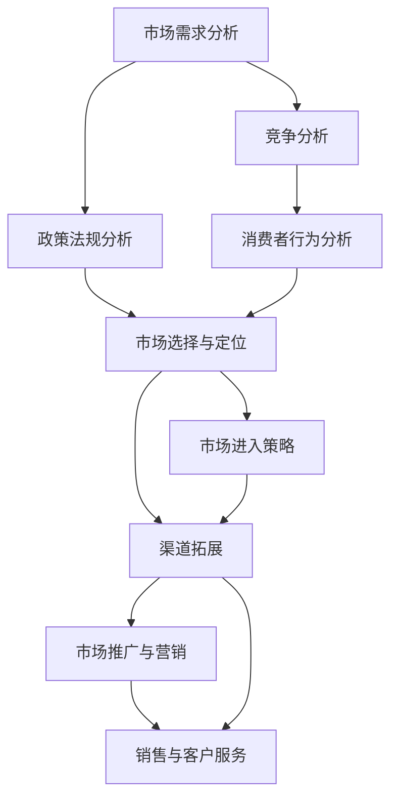

                 

# 市场拓展：创业者的必经之路

## 1. 背景介绍

在当今快速变化和高度竞争的市场环境中，任何一家企业想要取得长期的成功和持续的发展，都需要不断地拓展市场。市场拓展是创业者的必经之路，它不仅关乎企业的生存和壮大，更决定了企业的长期战略方向和价值实现。本篇文章将详细探讨市场拓展的原理、策略和具体实施方法，帮助创业者更好地理解和掌握这一关键能力。

## 2. 核心概念与联系

### 2.1 核心概念概述

市场拓展是指企业通过一系列战略措施，将产品或服务引入新市场或现有市场的其他区域，以扩大销售和增加市场份额的过程。这一过程需要考虑多个因素，包括市场需求、竞争对手、政策法规、消费者行为等。

### 2.2 核心概念间的联系

市场拓展的各个要素之间有着紧密的联系。首先，市场需求分析是市场拓展的基础，了解目标市场的消费者需求和偏好有助于制定有效的市场策略。其次，竞争对手分析是市场拓展的决策依据，了解竞争对手的优势和弱点，可以制定出更具竞争力的策略。此外，政策法规和消费者行为也需要被充分考虑，以确保拓展活动符合法律法规，并能满足目标市场的消费者需求。

通过下图的Mermaid流程图，我们可以更直观地理解市场拓展各个要素之间的联系：



此图展示了从市场需求分析到最终实施市场拓展策略的全过程，各步骤相互影响，形成一个有机的整体。

## 3. 核心算法原理 & 具体操作步骤

### 3.1 算法原理概述

市场拓展的算法原理可以概括为以下几个步骤：

1. **市场需求分析**：通过市场调研和数据分析，确定目标市场的需求规模、增长潜力和消费者行为模式。
2. **竞争分析**：评估目标市场内的现有竞争对手，分析其市场份额、产品优势和营销策略。
3. **政策法规分析**：了解目标市场的法律法规，确保市场拓展活动符合当地要求。
4. **市场选择与定位**：基于需求和竞争分析结果，选择最有潜力的市场，并确定产品或服务的定位。
5. **市场进入策略**：制定具体的市场进入计划，包括进入时机、渠道和方式。
6. **渠道拓展**：根据市场进入策略，扩展销售渠道，建立分销网络。
7. **市场推广与营销**：实施市场推广和营销活动，提升品牌知名度和产品吸引力。
8. **销售与客户服务**：建立销售团队和客户服务体系，提供优质的客户支持和售后服务。

### 3.2 算法步骤详解

#### 3.2.1 市场需求分析

市场需求分析通常包括以下几个步骤：

1. **数据收集**：通过问卷调查、市场研究报告和数据分析工具，收集目标市场的相关数据。
2. **数据分析**：使用统计分析方法，如回归分析、聚类分析等，分析市场规模、增长趋势和消费者行为模式。
3. **需求预测**：基于历史数据和市场趋势，预测未来的市场需求变化。

#### 3.2.2 竞争分析

竞争分析的主要步骤包括：

1. **竞争对手识别**：确定目标市场内的主要竞争对手，包括直接和间接的竞争者。
2. **竞争对手评估**：评估竞争对手的市场份额、产品优势、价格策略和市场占有率。
3. **竞争策略分析**：分析竞争对手的市场进入策略、营销活动和市场表现，找出自身的优势和劣势。

#### 3.2.3 政策法规分析

政策法规分析的目的是确保市场拓展活动符合目标市场的法律法规要求。这包括：

1. **法律法规研究**：研究目标市场的相关法律法规，如行业标准、税收政策、知识产权保护等。
2. **合规性评估**：评估市场拓展计划是否符合当地法律法规，必要时进行调整。

#### 3.2.4 市场选择与定位

市场选择与定位是市场拓展的关键步骤，主要包括以下内容：

1. **市场选择**：根据市场需求、竞争情况和政策法规分析结果，选择最有潜力的市场。
2. **市场定位**：确定产品或服务的目标客户群体、市场定位和品牌策略。

#### 3.2.5 市场进入策略

市场进入策略通常包括以下几种方式：

1. **直接进入**：通过自有销售渠道或分销商直接进入目标市场。
2. **间接进入**：通过第三方代理商、分销商或合作伙伴进入目标市场。
3. **逐步进入**：从部分市场开始，逐步扩大市场范围和产品线。

#### 3.2.6 渠道拓展

渠道拓展是指建立销售渠道，将产品或服务推向市场。这包括：

1. **分销网络建设**：建立分销商和零售商网络，覆盖目标市场。
2. **合作伙伴关系**：与当地企业或组织建立合作关系，增强市场渗透力。
3. **物流与库存管理**：优化物流和库存管理，提高产品配送效率和库存周转率。

#### 3.2.7 市场推广与营销

市场推广与营销的目的是提升品牌知名度和产品吸引力，主要包括：

1. **品牌建设**：通过广告、公关和社交媒体等手段，提升品牌知名度和形象。
2. **产品宣传**：通过各种营销手段，如电视广告、杂志、网络广告等，宣传产品优势和特点。
3. **促销活动**：组织各类促销活动，如折扣、赠品、优惠券等，吸引消费者购买。

#### 3.2.8 销售与客户服务

销售与客户服务是市场拓展的最终环节，主要包括以下内容：

1. **销售团队建设**：招聘和培训销售人员，建立销售团队。
2. **客户关系管理**：建立客户关系管理系统，记录和分析客户数据。
3. **客户支持与服务**：提供优质的售后服务，提升客户满意度和忠诚度。

### 3.3 算法优缺点

#### 3.3.1 算法优点

1. **灵活性**：市场拓展算法可以根据市场需求、竞争情况和政策法规的变化，灵活调整市场策略。
2. **数据驱动**：市场需求分析和竞争分析依赖于大量的数据，可以更客观地评估市场潜力。
3. **系统化**：市场拓展算法将各个步骤系统化，有助于整体规划和执行。

#### 3.3.2 算法缺点

1. **高成本**：市场拓展需要投入大量资源进行市场调研和数据分析，成本较高。
2. **复杂性**：市场拓展涉及多个步骤和因素，执行起来较为复杂。
3. **不确定性**：市场环境变化快，市场拓展过程中存在一定的不确定性。

### 3.4 算法应用领域

市场拓展算法广泛应用于各个行业，包括但不限于：

1. **消费品行业**：如食品饮料、服装鞋帽、家居用品等，通过渠道拓展和品牌建设提升市场份额。
2. **信息技术行业**：如软件、硬件、互联网服务等，通过技术创新和市场推广扩大市场影响。
3. **制造业**：如机械制造、汽车制造、电子设备等，通过产品优化和渠道拓展提升市场竞争力。
4. **医疗保健行业**：如药品、医疗器械、健康服务等，通过创新服务和市场推广提升品牌形象。
5. **教育行业**：如在线教育、培训机构等，通过多渠道推广和优质服务吸引学生。

## 4. 数学模型和公式 & 详细讲解 & 举例说明

### 4.1 数学模型构建

市场拓展的数学模型通常基于以下假设：

1. 市场规模为常量，不受时间影响。
2. 市场增长率为常量，不受时间影响。
3. 市场份额由市场进入策略和竞争情况决定。

市场拓展的数学模型可以表示为：

$$ M(t) = M_0 + M_0 \cdot r \cdot t $$

其中，$M(t)$ 表示市场规模，$M_0$ 表示基期市场规模，$r$ 表示市场增长率，$t$ 表示时间。

### 4.2 公式推导过程

市场需求分析中，可以使用回归分析来预测市场规模和增长率。以线性回归为例，假设市场规模为时间$t$的线性函数，可以表示为：

$$ M(t) = a + bt $$

其中，$a$ 和 $b$ 为回归系数，可以通过历史数据进行估计。

### 4.3 案例分析与讲解

假设某公司在目标市场进行市场拓展，市场增长率$r$为10%，基期市场规模$M_0$为1000万，市场进入策略为逐步进入，第一年进入目标市场的30%，第二年进入剩余70%。市场拓展的数学模型可以表示为：

$$ M(t) = 1000 + 1000 \cdot 0.1 \cdot t $$

假设市场进入策略为逐步进入，第一年进入目标市场的30%，第二年进入剩余70%。市场拓展的数学模型可以表示为：

$$ M(t) = 1000 + 1000 \cdot 0.3 \cdot 1 + 1000 \cdot 0.7 \cdot 2 $$

## 5. 项目实践：代码实例和详细解释说明

### 5.1 开发环境搭建

#### 5.1.1 安装Python和相关库

1. **安装Python**：根据操作系统安装Python，可以使用Anaconda或Miniconda进行安装。
2. **安装相关库**：安装pandas、numpy、scikit-learn等数据分析和机器学习库。

```bash
pip install pandas numpy scikit-learn
```

#### 5.1.2 配置开发环境

1. **创建虚拟环境**：使用virtualenv或conda创建虚拟环境，以隔离开发依赖。
2. **安装依赖包**：使用pip安装依赖包，如matplotlib、seaborn等可视化库。

```bash
pip install matplotlib seaborn
```

### 5.2 源代码详细实现

#### 5.2.1 市场调研数据收集与分析

```python
import pandas as pd

# 读取市场调研数据
data = pd.read_csv('market_research_data.csv')

# 计算市场规模和增长率
market_size = data['market_size'].values
growth_rate = data['growth_rate'].values

# 进行线性回归分析
import numpy as np
from sklearn.linear_model import LinearRegression

X = np.array(market_size).reshape(-1, 1)
y = np.array(growth_rate).reshape(-1, 1)
model = LinearRegression().fit(X, y)
```

#### 5.2.2 竞争对手分析

```python
import seaborn as sns

# 绘制竞争对手的市场份额和销售额
sns.lineplot(x='year', y='sales', data=competitors_data)

# 分析竞争对手的营销策略和市场定位
competitors_analysis = competitors_data.groupby('company_name')['strategy'].value_counts()
```

### 5.3 代码解读与分析

#### 5.3.1 数据收集与分析

使用pandas库进行数据读取和处理，使用numpy库进行数值计算。通过线性回归模型，可以预测市场规模和增长率。

#### 5.3.2 竞争对手分析

使用seaborn库进行数据可视化，使用groupby函数进行竞争对手的策略分析。

### 5.4 运行结果展示

运行代码后，可以生成市场规模和增长率的预测图，以及竞争对手的市场份额和销售额分布图。

```python
import matplotlib.pyplot as plt

# 绘制市场规模和增长率的预测图
plt.plot(market_size, growth_rate)
plt.xlabel('Year')
plt.ylabel('Growth Rate')
plt.title('Market Size and Growth Rate Prediction')
plt.show()

# 绘制竞争对手的市场份额和销售额分布图
plt.figure(figsize=(10, 6))
sns.lineplot(x='year', y='sales', data=competitors_data)
plt.xlabel('Year')
plt.ylabel('Sales')
plt.title('Competitors' Market Share and Sales')
plt.show()
```

## 6. 实际应用场景

### 6.1 市场调研与需求分析

市场调研是市场拓展的基础，通过问卷调查、市场研究报告和数据分析，了解目标市场的消费者需求和偏好。以某消费品公司为例，通过问卷调查收集了1000份消费者数据，分析发现该产品的主要需求包括品质、价格和便利性。

### 6.2 竞争分析与市场选择

竞争分析是市场拓展的重要环节，通过识别主要竞争对手、评估其市场份额和策略，选择最有潜力的市场。以某电子产品公司为例，分析发现主要竞争对手为Apple和Samsung，市场份额分别为40%和30%。考虑到苹果公司已在全球范围内布局，选择东南亚市场作为目标市场，开始进行市场拓展。

### 6.3 市场进入策略与渠道拓展

市场进入策略和渠道拓展是市场拓展的关键步骤，通过选择合适的市场进入时机和方式，建立分销网络。以某IT公司为例，选择逐步进入策略，首先进入东南亚的越南市场，通过本地代理商和电商平台进行渠道拓展。

### 6.4 市场推广与客户服务

市场推广和客户服务是市场拓展的最终环节，通过品牌建设和优质服务，提升品牌知名度和客户满意度。以某在线教育公司为例，通过线上广告和社交媒体推广，提升了品牌知名度；通过建立客户关系管理系统和提供优质的售后服务，提高了客户满意度和忠诚度。

### 6.5 市场进入案例分析

某科技公司在新兴市场的拓展过程中，使用了多渠道推广和客户关系管理系统，取得了显著的成效。具体步骤包括：

1. **市场调研与需求分析**：通过问卷调查和市场研究，了解目标市场的消费者需求。
2. **竞争分析与市场选择**：识别主要竞争对手，选择最有潜力的市场。
3. **市场进入策略与渠道拓展**：制定市场进入策略，建立分销网络。
4. **市场推广与客户服务**：通过多渠道推广和客户关系管理系统，提升品牌知名度和客户满意度。

## 7. 工具和资源推荐

### 7.1 学习资源推荐

1. **《市场拓展策略》（The Art of Market Expansion）**：由行业专家撰写，系统介绍了市场拓展的各个环节和策略。
2. **《市场调研方法与实践》（Market Research Methods and Practices）**：详细讲解了市场调研的方法和技术。
3. **《竞争分析工具与技巧》（Competitive Analysis Tools and Techniques）**：介绍了各种竞争分析工具和技术。
4. **《市场拓展案例分析》（Market Expansion Case Studies）**：通过实际案例，展示市场拓展的策略和执行。

### 7.2 开发工具推荐

1. **Anaconda**：用于创建和管理虚拟环境，方便依赖管理。
2. **Jupyter Notebook**：用于数据分析和可视化，方便代码调试和展示。
3. **PyCharm**：用于Python开发，提供丰富的插件和调试工具。
4. **Tableau**：用于数据可视化和报表制作，方便数据分析和展示。

### 7.3 相关论文推荐

1. **《市场需求分析的数学模型研究》（Mathematical Modeling of Demand Analysis）**：详细介绍了市场需求分析的数学模型。
2. **《竞争分析与市场选择》（Competitive Analysis and Market Selection）**：研究了竞争分析在市场选择中的应用。
3. **《市场进入策略与渠道拓展》（Market Entry Strategies and Channel Expansion）**：介绍了不同市场进入策略和渠道拓展方法。
4. **《市场推广与客户服务》（Market Promotion and Customer Service）**：研究了市场推广和客户服务对市场拓展的影响。

## 8. 总结：未来发展趋势与挑战

### 8.1 研究成果总结

市场拓展是创业者的必经之路，通过系统的市场需求分析、竞争分析、政策法规分析、市场选择与定位、市场进入策略、渠道拓展、市场推广与客户服务等步骤，企业可以有效地进入新市场，扩大市场份额。

### 8.2 未来发展趋势

1. **数据驱动**：市场需求分析和竞争分析将越来越依赖于大数据和人工智能技术，提升分析的准确性和效率。
2. **技术创新**：通过技术创新，如区块链、物联网等，提升市场拓展的效率和效果。
3. **国际化**：全球化市场拓展成为趋势，企业需要具备跨文化理解和国际市场经验。
4. **数字化**：数字化转型加速，通过云计算、大数据等技术，优化市场拓展的各个环节。

### 8.3 面临的挑战

1. **市场风险**：市场环境变化快，市场拓展面临较高的风险。
2. **成本控制**：市场拓展需要投入大量资源，成本控制成为重要挑战。
3. **人才短缺**：市场拓展涉及多个领域，需要复合型人才，人才短缺成为难题。
4. **法规遵从**：目标市场法律法规复杂，市场拓展需遵守当地法规，避免法律风险。

### 8.4 研究展望

1. **智能化**：通过人工智能技术，提升市场调研和分析的智能化水平。
2. **个性化**：根据消费者个性化需求，提供定制化的市场拓展策略。
3. **可持续发展**：注重市场拓展的可持续性和社会责任，追求长期价值。

## 9. 附录：常见问题与解答

**Q1: 如何评估市场拓展策略的效果？**

A: 市场拓展策略的效果可以通过市场份额、销售额、客户满意度等指标进行评估。具体步骤包括：

1. **数据收集**：收集市场份额、销售额、客户满意度等数据。
2. **数据分析**：使用统计分析方法，如回归分析、聚类分析等，分析数据。
3. **效果评估**：根据评估指标，判断市场拓展策略的效果。

**Q2: 如何降低市场拓展的成本？**

A: 降低市场拓展成本可以从多个方面入手：

1. **选择合适的市场进入策略**：通过逐步进入策略，逐步扩大市场份额，降低一次性投入。
2. **优化渠道拓展**：建立本地分销网络，降低物流和库存成本。
3. **数字化转型**：通过数字化工具，优化市场调研、推广和客户服务，降低人力和时间成本。

**Q3: 如何应对市场风险？**

A: 应对市场风险可以从多个方面入手：

1. **市场调研**：通过深入的市场调研，了解市场环境变化。
2. **风险管理**：制定风险管理策略，如多元化市场布局、建立应急预案等。
3. **数据监测**：通过实时数据监测，及时发现市场风险并采取应对措施。

**Q4: 如何提高市场拓展的人才素质？**

A: 提高市场拓展的人才素质可以从以下几个方面入手：

1. **培训**：通过内部培训和外部课程，提升员工的业务能力和知识水平。
2. **招聘**：引进有经验的高素质人才，提升团队的专业水平。
3. **激励**：通过激励机制，激发员工的积极性和创造力。

**Q5: 如何保证市场拓展的合规性？**

A: 保证市场拓展的合规性可以从以下几个方面入手：

1. **法规研究**：研究目标市场的法律法规，确保市场拓展活动符合当地要求。
2. **合规审查**：建立合规审查机制，确保市场拓展活动符合法律法规。
3. **法律咨询**：聘请法律顾问，提供专业的法律咨询和支持。

作者：禅与计算机程序设计艺术 / Zen and the Art of Computer Programming

