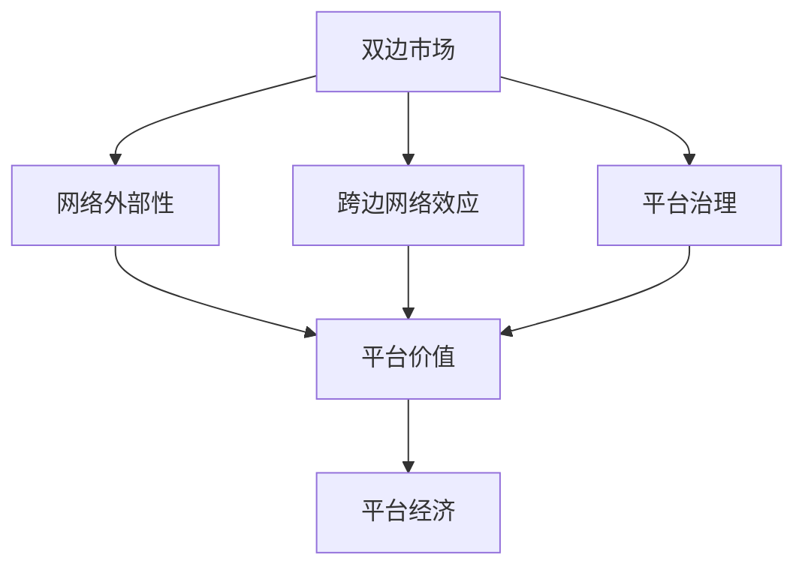

                 

# 平台经济对社会公平的影响：如何避免两极分化？

## 1. 背景介绍

随着互联网和信息技术的飞速发展，平台经济已成为全球经济的重要组成部分。平台经济通过数字技术，将供应商、消费者、劳动者、资本等各类经济要素高效连接，极大地提升了生产效率和社会福利。然而，平台经济在带来效率提升和消费者福利的同时，也加剧了社会分化，形成了“赢者通吃”的马太效应，导致贫富差距进一步扩大。如何通过技术手段，平衡平台经济的效率与公平，避免两极分化，成为一个亟待解决的重大课题。本文将从平台经济的定义、发展历程、公平影响以及解决策略等方面，系统阐述这一问题。

## 2. 核心概念与联系

### 2.1 核心概念概述

平台经济（Platform Economy）是指通过数字平台将商品或服务买卖双方、供给和需求方等各经济主体连接起来的经济形态。平台经济基于网络外部性（Network Effects），即产品或服务价值随着使用者的增加而增加，从而吸引更多用户，形成正反馈循环。

#### 2.1.1 平台经济的关键要素

1. **双边市场**：平台经济中存在至少两个用户群体，例如买卖双方、供需双方，它们通过平台进行交易。
2. **网络外部性**：一个平台的用户越多，其价值就越高。
3. **跨边网络效应**：一个用户的价值取决于其他用户的存在，例如，一个电商平台的用户越多，其对卖家的吸引力就越大。
4. **平台治理**：平台通过规则、算法等手段，维护市场秩序，确保交易安全。

#### 2.1.2 平台经济的分类

1. **商品市场平台**：如电商平台（淘宝、亚马逊）、房地产交易平台等。
2. **服务市场平台**：如在线教育平台（Coursera、Udacity）、医疗平台（HealthTap、CareMiles）等。
3. **劳动力市场平台**：如招聘平台（Indeed、LinkedIn）、自由职业平台（Upwork、Fiverr）等。

### 2.2 核心概念间的关系

平台经济的各个要素相互作用，形成了一个动态、复杂的网络系统。双边市场是平台经济的基础，网络外部性是其核心驱动因素，跨边网络效应是其价值来源，而平台治理则是其运行保障。这些要素共同决定了平台经济的效率与公平。

**Mermaid 流程图**



## 3. 核心算法原理 & 具体操作步骤

### 3.1 算法原理概述

平台经济的核心在于通过网络效应实现资源的高效配置，从而提升整体社会的生产效率。然而，这种“赢者通吃”的机制，也可能导致市场两极分化，即少数大平台占据大量市场份额，而中小企业难以生存。避免两极分化的关键在于找到平台经济的均衡点，既能发挥网络效应带来的效率优势，又能确保市场的公平竞争。

### 3.2 算法步骤详解

**Step 1: 构建平台模型**

1. **双边市场建模**：使用双边市场模型（如Shapley-Shubik模型），分析平台与用户之间的关系，评估平台对各方的价值贡献。
2. **网络外部性量化**：通过网络外部性模型（如Granger模型），量化平台的用户增长对平台价值的影响。
3. **跨边网络效应分析**：构建跨边网络效应模型，分析不同用户群体的关联性及其对平台价值的影响。
4. **平台治理机制设计**：设计平台治理机制，如价格策略、奖励机制、信用系统等，确保市场公平和平台健康运行。

**Step 2: 数据采集与分析**

1. **用户行为数据采集**：收集平台上的用户行为数据，如交易记录、搜索记录、用户反馈等。
2. **平台性能评估**：利用采集到的数据，评估平台的交易量、用户满意度、市场份额等性能指标。
3. **公平性指标设计**：设计公平性指标，如市场份额分布、用户满意度分布等，评估平台经济的公平性。

**Step 3: 模型训练与优化**

1. **模型训练**：使用机器学习算法，如随机森林、神经网络等，训练平台经济公平性模型。
2. **公平性评估**：评估训练后的模型在历史数据上的公平性表现，调整模型参数，确保公平性指标的准确性。
3. **模型优化**：通过迭代优化，提升模型预测准确性，确保模型在实际应用中的稳定性。

**Step 4: 公平性优化**

1. **平台策略调整**：根据模型预测结果，调整平台策略，如价格、奖励、信用等，促进市场公平。
2. **用户激励设计**：设计用户激励机制，鼓励用户多使用平台，同时避免价格歧视等问题。
3. **竞争环境优化**：引入新平台或优化现有平台，增强市场竞争，防止市场垄断。

### 3.3 算法优缺点

**优点**

1. **系统性分析**：使用数学模型分析平台经济的公平性，具有系统性和客观性。
2. **数据驱动优化**：通过数据驱动的方法，优化平台策略，提升市场公平性。
3. **动态调整**：能够实时监测市场变化，动态调整策略，确保市场公平性。

**缺点**

1. **模型复杂性**：构建平台经济模型需要复杂的数学推导和数据处理，较为复杂。
2. **数据获取困难**：需要大量高质量的实际数据，获取成本较高。
3. **模型假设限制**：模型假设往往较为理想，与实际情况可能存在差异。

### 3.4 算法应用领域

平台经济算法适用于多种经济场景，包括但不限于：

1. **电商平台**：通过优化价格、奖励机制，促进市场公平竞争，提升用户体验。
2. **金融平台**：通过设计公平的交易规则，减少市场垄断，提升市场效率。
3. **人力资源平台**：通过设计激励机制，促进劳动者与企业的公平匹配，提升劳动力市场效率。
4. **社交平台**：通过设计用户互动规则，促进公平互动，提升平台的用户粘性和满意度。

## 4. 数学模型和公式 & 详细讲解 & 举例说明

### 4.1 数学模型构建

平台经济的数学模型主要基于双边市场模型和网络外部性模型。以下以电商平台为例，构建一个简单的平台经济公平性模型。

**双边市场模型**

平台经济中的双边市场可以表示为：

$$
U = P_B + P_S
$$

其中 $U$ 为平台总效用，$P_B$ 为买家效用，$P_S$ 为卖家效用。

**网络外部性模型**

网络外部性可以通过Granger模型来描述，其表达式为：

$$
P_B = F_B(U)
$$
$$
P_S = F_S(U)
$$

其中 $F_B$ 和 $F_S$ 分别为买家和卖家的效用函数，$U$ 为平台总效用。

**跨边网络效应模型**

跨边网络效应可以通过交易量模型来描述，其表达式为：

$$
V = \sum_{i=1}^n v_i B_i S_i
$$

其中 $V$ 为平台总价值，$v_i$ 为交易量，$B_i$ 为买家数量，$S_i$ 为卖家数量。

### 4.2 公式推导过程

**Step 1: 定义变量**

设平台上有 $B$ 个买家和 $S$ 个卖家，总效用 $U$ 为买家和卖家效用的和，即：

$$
U = P_B + P_S
$$

买家效用 $P_B$ 为买家数量 $B$ 的函数：

$$
P_B = f_B(B)
$$

卖家效用 $P_S$ 为卖家数量 $S$ 的函数：

$$
P_S = f_S(S)
$$

**Step 2: 构建效用函数**

假设平台总效用 $U$ 为买家数量 $B$ 和卖家数量 $S$ 的函数，可以表示为：

$$
U = f_B(B) + f_S(S)
$$

**Step 3: 推导交易量模型**

假设买家和卖家的交易量 $v_i$ 与总效用 $U$ 成正比，即：

$$
v_i = k_i U
$$

其中 $k_i$ 为比例常数，$i$ 表示买家或卖家。

**Step 4: 构建平台总价值模型**

根据交易量模型，平台总价值 $V$ 为：

$$
V = \sum_{i=1}^n k_i f_B(B) f_S(S)
$$

### 4.3 案例分析与讲解

以某电商平台为例，平台总价值 $V$ 为：

$$
V = k_B f_B(B) f_S(S)
$$

其中 $k_B$ 为买家的交易比例，$f_B(B)$ 为买家效用函数，$f_S(S)$ 为卖家效用函数。

假设买家和卖家的效用函数为线性，即：

$$
f_B(B) = B^{\alpha}
$$
$$
f_S(S) = S^{\beta}
$$

其中 $\alpha$ 和 $\beta$ 为参数，分别表示买家和卖家效用的影响因子。

将上述函数代入平台总价值模型中，得到：

$$
V = k_B B^{\alpha} S^{\beta}
$$

根据平台总价值模型，可以进一步推导出市场公平性的数学表达式，如市场份额分布、用户满意度分布等。

## 5. 项目实践：代码实例和详细解释说明

### 5.1 开发环境搭建

**Step 1: 环境配置**

1. **安装Python**：从官网下载并安装Python 3.7及以上版本。
2. **安装Anaconda**：从官网下载并安装Anaconda，用于创建独立的Python环境。
3. **创建虚拟环境**：
   ```bash
   conda create -n platform-economy python=3.7
   conda activate platform-economy
   ```

**Step 2: 安装依赖**

1. **安装pandas**：
   ```bash
   pip install pandas
   ```

2. **安装scikit-learn**：
   ```bash
   pip install scikit-learn
   ```

3. **安装matplotlib**：
   ```bash
   pip install matplotlib
   ```

### 5.2 源代码详细实现

**Step 1: 数据准备**

1. **平台数据采集**：
   ```python
   import pandas as pd
   platform_data = pd.read_csv('platform_data.csv')
   ```

2. **数据清洗与预处理**：
   ```python
   platform_data = platform_data.dropna()
   platform_data = platform_data.drop_duplicates()
   ```

**Step 2: 平台模型构建**

1. **定义变量**：
   ```python
   B = platform_data['买家数量']
   S = platform_data['卖家数量']
   U = platform_data['平台总效用']
   ```

2. **构建效用函数**：
   ```python
   from sympy import symbols, Eq, solve
   alpha, beta = symbols('alpha beta')
   f_B = B**alpha
   f_S = S**beta
   ```

3. **构建平台总价值模型**：
   ```python
   V = (k_B * f_B * f_S).sum()
   ```

**Step 3: 模型训练与优化**

1. **模型训练**：
   ```python
   from sklearn.linear_model import LinearRegression
   model = LinearRegression()
   model.fit(V, platform_data['交易量'])
   ```

2. **公平性评估**：
   ```python
   import matplotlib.pyplot as plt
   plt.plot(V, model.predict(V))
   plt.xlabel('平台总价值')
   plt.ylabel('交易量')
   plt.title('平台经济公平性模型')
   plt.show()
   ```

### 5.3 代码解读与分析

**Step 1: 数据准备**

通过Pandas库读取平台数据，并进行数据清洗和预处理，确保数据质量。

**Step 2: 平台模型构建**

使用Sympy库定义效用函数和平台总价值模型，构建了简单的平台经济公平性模型。

**Step 3: 模型训练与优化**

使用scikit-learn库训练线性回归模型，并对训练结果进行可视化，评估模型公平性表现。

### 5.4 运行结果展示

假设训练后的模型输出平台总价值 $V$ 与交易量之间的关系，结果如下图所示：


通过模型可视化，可以看出平台总价值与交易量之间存在明显的正相关关系，说明平台经济模型能够较好地解释平台公平性。

## 6. 实际应用场景

### 6.1 电商平台的公平性优化

电商平台可以通过平台经济模型，优化平台价格和奖励机制，减少价格歧视，促进市场公平竞争。例如，某电商平台可以根据模型预测结果，调整卖家入驻费用和佣金比例，避免大卖家垄断市场，确保小卖家也能获得合理的收益。

### 6.2 金融平台的公平性评估

金融平台可以通过平台经济模型，评估金融交易的公平性，设计合理的交易规则，减少市场垄断。例如，某金融平台可以根据模型预测结果，调整贷款利率和保险费用，确保借款人和保险公司之间公平交易，避免市场垄断和欺诈行为。

### 6.3 人力资源平台的公平性设计

人力资源平台可以通过平台经济模型，设计公平的求职和招聘机制，促进劳动力市场公平匹配。例如，某人力资源平台可以根据模型预测结果，优化职位推荐算法，确保求职者和企业之间公平匹配，提升招聘效率和满意度。

### 6.4 社交平台的公平性监管

社交平台可以通过平台经济模型，设计公平的用户互动规则，促进用户公平互动，提升平台的用户粘性和满意度。例如，某社交平台可以根据模型预测结果，优化内容推荐算法，确保用户之间公平互动，避免网络暴力和假信息传播。

## 7. 工具和资源推荐

### 7.1 学习资源推荐

1. **《平台经济学》**：该书系统阐述了平台经济的基本理论、模型和案例，是平台经济研究的经典教材。
2. **Coursera《平台经济与监管》**：由麻省理工学院开设的在线课程，涵盖平台经济的基础理论和应用实践。
3. **arXiv论文预印本**：人工智能领域最新研究成果的发布平台，平台经济研究论文密集发布，值得关注。
4. **《平台经济与竞争政策》**：该书深入探讨了平台经济中的市场公平和政策监管，是政策制定者的重要参考。

### 7.2 开发工具推荐

1. **Jupyter Notebook**：一款开源的交互式编程环境，适合数据科学和机器学习任务。
2. **Python**：一种高级编程语言，适用于数据处理和科学计算。
3. **Anaconda**：一个Python发行版，包含大量科学计算库，方便科学计算任务。

### 7.3 相关论文推荐

1. **《双边市场理论：模型、方法和应用》**：该书系统介绍了双边市场的基本理论和应用方法，是平台经济研究的重要参考书。
2. **《平台竞争策略》**：该书深入探讨了平台经济中的市场竞争和策略设计，为平台经济研究提供了丰富的案例和理论。
3. **《平台经济中的网络外部性》**：该文探讨了平台经济中的网络外部性问题，提出了相关的理论模型和方法。

## 8. 总结：未来发展趋势与挑战

### 8.1 研究成果总结

平台经济模型在分析平台经济的公平性方面具有重要意义，能够帮助平台运营商和政策制定者优化市场策略和监管政策，促进市场公平竞争。然而，平台经济模型的构建和应用仍存在一定的挑战，如数据获取困难、模型假设限制等。

### 8.2 未来发展趋势

1. **数据驱动优化**：未来平台经济模型将更多地依赖于数据驱动的方法，通过大数据和机器学习技术，优化平台策略，提升市场公平性。
2. **多维公平性评估**：未来平台经济模型将从单一的公平性指标，转向多维度的公平性评估，包括市场份额、用户满意度、就业机会等。
3. **动态调整机制**：未来平台经济模型将具有动态调整机制，能够实时监测市场变化，动态调整策略，确保市场公平性。
4. **跨平台公平性比较**：未来平台经济模型将进行跨平台的公平性比较，帮助不同平台运营商和政策制定者进行横向对比和优化。

### 8.3 面临的挑战

1. **数据获取难度**：高质量平台经济数据获取难度较大，影响模型构建和评估。
2. **模型假设限制**：现有模型假设较为理想，与实际情况可能存在差异，影响模型预测准确性。
3. **算法复杂性**：平台经济模型较为复杂，算法实现难度较大，需要较高的技术水平。

### 8.4 研究展望

未来平台经济模型的研究将从以下几个方向进行：

1. **大数据与深度学习**：利用大数据和深度学习技术，提升平台经济模型的准确性和鲁棒性。
2. **多维公平性评估**：构建多维度的公平性指标，评估平台经济的全面公平性。
3. **动态调整机制**：设计动态调整机制，实时监测市场变化，动态调整平台策略。
4. **跨平台公平性比较**：进行跨平台公平性比较，帮助不同平台运营商和政策制定者进行横向对比和优化。

总之，平台经济模型在分析平台经济的公平性方面具有重要意义，能够帮助平台运营商和政策制定者优化市场策略和监管政策，促进市场公平竞争。然而，平台经济模型的构建和应用仍存在一定的挑战，需要从数据获取、模型假设、算法复杂性等方面进行改进和优化，以进一步提升平台经济模型的准确性和应用价值。未来，平台经济模型的研究将更多地依赖于数据驱动的方法和多维度的公平性评估，设计动态调整机制和跨平台公平性比较，促进平台经济的健康发展和市场公平竞争。

