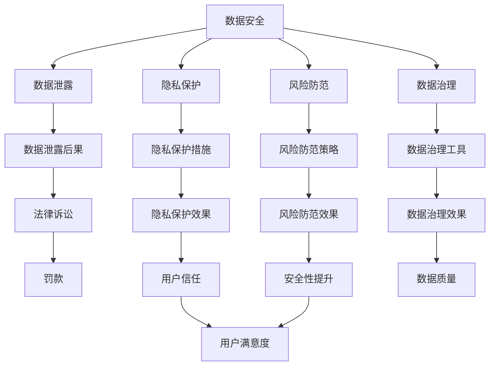
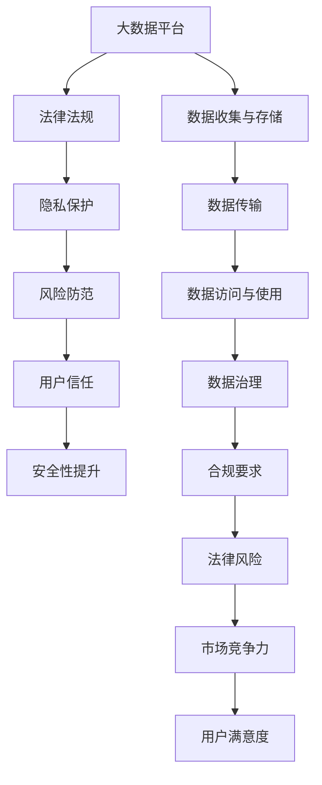

                 

# 平台经济的数据安全风险：如何防范数据泄露？

> 关键词：平台经济, 数据安全, 数据泄露, 隐私保护, 风险防范, 数据治理

## 1. 背景介绍

### 1.1 问题由来
随着互联网和移动通信技术的飞速发展，平台经济模式已深入到社会经济的各个领域，包括电子商务、社交媒体、金融服务、健康医疗等多个领域。平台经济的发展在提高效率、创造就业、推动创新等方面发挥了重要作用。然而，平台经济的迅猛发展也带来了新的挑战，特别是数据安全风险问题。

平台经济模式依赖于大规模数据的收集和分析，以支撑各类应用和服务。这些数据往往涉及个人隐私、商业机密、公共安全等多个方面，一旦发生泄露，将会带来巨大的损失。近年来，各大平台数据泄露事件频发，如Facebook数据泄露事件、LinkedIn数据泄露事件、Tesla员工数据泄露事件等，不仅造成了巨大的经济损失，还带来了严重的社会影响，包括信任危机、法律纠纷、声誉损失等。

### 1.2 问题核心关键点
平台经济的数据安全风险主要集中在以下几个方面：

- **数据收集与存储**：平台需要收集大量的用户数据，包括身份信息、交易记录、搜索历史、行为数据等，这些数据往往存储在分布式系统中，存在被攻击的风险。
- **数据传输**：平台在进行数据传输时，数据往往需要通过互联网，容易被中间人攻击、网络窃听等方式泄露。
- **数据访问与使用**：平台内部员工、第三方服务商、合作伙伴等都有访问和处理数据的权限，如果管理不当，数据可能被非法使用或泄露。
- **法律法规约束**：各国对数据隐私和保护的法律法规不断加强，平台需要遵循严格的法律法规，避免违规操作。

平台经济的数据安全风险不仅影响用户隐私和商业机密，还可能对平台本身的稳定性和安全性构成威胁，从而影响其市场竞争力和用户信任度。因此，防范数据泄露成为平台经济领域的重要课题。

### 1.3 问题研究意义
防范数据泄露是保障平台经济健康发展、维护用户信任和隐私权益的关键措施。具有重要意义：

1. **用户信任**：保护用户数据隐私是建立用户信任的基础。用户信任是平台经济成功的关键因素之一。
2. **合规要求**：各国对数据隐私和保护的法律法规日益严格，平台需要遵守相关规定，避免法律风险。
3. **安全性**：数据泄露不仅导致直接经济损失，还可能引发其他安全问题，如网络攻击、诈骗等。
4. **市场竞争力**：平台需要提供安全可靠的服务，以提升市场竞争力和用户体验。
5. **法律风险**：数据泄露事件可能导致法律诉讼和罚款，增加平台的法律风险。

本文旨在探讨平台经济中数据安全风险的防范措施，重点讨论如何从技术和管理两个层面进行数据安全防护。

## 2. 核心概念与联系

### 2.1 核心概念概述

为了更好地理解数据安全风险的防范措施，本节将介绍几个密切相关的核心概念：

- **数据安全**：指保护数据免受未经授权的访问、使用、修改、泄露和破坏的能力。平台经济中，数据安全涉及用户隐私、商业机密、公共安全等方面。
- **数据泄露**：指未经授权的数据被访问、使用、修改、泄露和破坏的行为。数据泄露不仅包括数据本身的泄露，还包括数据在传输过程中的泄露。
- **隐私保护**：指保护个人隐私免受未经授权的访问、使用、修改、泄露和破坏的能力。隐私保护是数据安全的重要组成部分。
- **风险防范**：指通过技术和管理手段，防止数据泄露和滥用，降低数据安全风险。风险防范需要多方面的协同努力。
- **数据治理**：指对数据进行管理、监控、分析和治理的过程。数据治理有助于建立数据安全防护体系，保障数据安全和合规。

这些核心概念之间存在着紧密的联系，形成了平台经济中数据安全防护的整体框架。

### 2.2 概念间的关系

这些核心概念之间存在着紧密的联系，形成了平台经济中数据安全防护的整体框架。下面我们通过几个Mermaid流程图来展示这些概念之间的关系。



这个流程图展示了数据安全风险的防范过程。数据泄露后果可能包括法律诉讼和罚款，隐私保护和风险防范措施的实施有助于提升数据安全性和用户信任度，数据治理工具的引入可以进一步提升数据管理和安全防护效果。

### 2.3 核心概念的整体架构

最后，我们用一个综合的流程图来展示这些核心概念在大数据安全防护中的整体架构：



这个综合流程图展示了大数据平台中数据安全防护的整体流程。数据收集与存储、数据传输、数据访问与使用、数据治理等环节都需要考虑隐私保护和风险防范措施，最终提升用户信任和平台竞争力。

## 3. 核心算法原理 & 具体操作步骤
### 3.1 算法原理概述

平台经济中数据安全风险的防范主要通过以下几个步骤进行：

1. **数据收集与存储**：平台需要收集用户的各类数据，并进行存储和管理。在这个过程中，需要采取加密、访问控制、审计等措施，确保数据的安全性和合规性。
2. **数据传输**：平台在传输数据时，需要采用加密、防火墙、VPN等技术，防止数据在传输过程中被窃取或篡改。
3. **数据访问与使用**：平台需要控制数据访问权限，建立严格的访问控制策略，确保只有授权人员和系统可以访问和处理数据。
4. **数据治理**：平台需要对数据进行分类、存储、管理和监控，确保数据的质量和完整性，并定期进行数据审计和风险评估。
5. **隐私保护**：平台需要采取隐私保护措施，如数据匿名化、差分隐私、联邦学习等，保护用户隐私。
6. **风险防范**：平台需要建立风险防范机制，如入侵检测、威胁情报、异常检测等，防止数据泄露和滥用。

### 3.2 算法步骤详解

以下是对平台经济中数据安全风险防范的具体操作步骤的详细讲解：

**Step 1: 数据收集与存储**
- **数据收集**：平台需要收集用户的各类数据，包括身份信息、交易记录、行为数据等。在收集数据时，需要遵循隐私保护原则，如最小必要原则、透明性原则等，确保只收集必要的数据。
- **数据存储**：平台需要将收集的数据存储在分布式数据库中，如Hadoop、Spark等。在存储数据时，需要采用加密技术，如AES、RSA等，确保数据在存储过程中的安全性。

**Step 2: 数据传输**
- **数据加密**：平台在传输数据时，需要对数据进行加密，防止数据在传输过程中被窃取或篡改。常用的加密算法包括AES、RSA、ECC等。
- **防火墙和VPN**：平台需要部署防火墙和VPN等网络安全设备，防止网络攻击和窃听。防火墙可以阻止未授权的访问，VPN可以加密传输数据，防止数据泄露。

**Step 3: 数据访问与使用**
- **访问控制**：平台需要建立严格的访问控制策略，确保只有授权人员和系统可以访问和处理数据。常用的访问控制技术包括RBAC、ABAC等。
- **权限管理**：平台需要对每个用户和系统进行权限管理，确保他们只能访问自己需要的数据。权限管理可以通过角色和职责分离来实现。

**Step 4: 数据治理**
- **数据分类**：平台需要对数据进行分类，如敏感数据、公共数据、历史数据等，以确定不同数据的保护级别。
- **数据存储管理**：平台需要对数据进行存储管理，确保数据的安全性和可用性。常用的存储管理技术包括RAID、HDFS等。
- **数据审计**：平台需要对数据访问和操作进行审计，记录所有访问和操作行为，以备事后审查和分析。

**Step 5: 隐私保护**
- **数据匿名化**：平台可以对敏感数据进行匿名化处理，防止数据泄露。常用的匿名化技术包括数据扰动、泛化、去标识化等。
- **差分隐私**：平台可以采用差分隐私技术，在保证数据有用的前提下，最小化对个体隐私的影响。差分隐私可以通过添加噪声、限制查询等方式实现。
- **联邦学习**：平台可以采用联邦学习技术，在保护用户隐私的前提下，进行模型训练和数据分析。联邦学习可以在不共享数据的前提下，实现数据聚合和模型更新。

**Step 6: 风险防范**
- **入侵检测**：平台需要建立入侵检测系统，实时监控系统行为，检测异常和攻击行为。入侵检测可以通过日志分析、异常检测等方式实现。
- **威胁情报**：平台需要获取最新的威胁情报，及时了解最新的攻击手段和漏洞信息，以防止数据泄露和攻击。威胁情报可以来源于安全厂商、政府机构等。
- **异常检测**：平台需要对数据访问和操作进行异常检测，检测异常行为和异常数据，防止数据泄露和滥用。异常检测可以通过机器学习、规则引擎等方式实现。

### 3.3 算法优缺点

平台经济中数据安全风险防范的算法具有以下优点和缺点：

**优点：**
- **安全性高**：采用加密、防火墙、VPN等技术，可以确保数据在传输和存储过程中的安全性。
- **合规性强**：遵循隐私保护原则和法律法规，可以避免法律风险。
- **灵活性高**：采用访问控制和权限管理技术，可以根据不同的数据和用户需求进行灵活配置。
- **透明性好**：数据分类和审计技术可以确保数据的透明性和可追溯性，方便管理和审计。

**缺点：**
- **技术复杂**：数据加密、访问控制、隐私保护等技术复杂，需要专业的技术支持。
- **成本高**：数据安全防护需要投入大量的人力和物力资源，成本较高。
- **数据延迟**：数据加密和解密、访问控制等技术可能会增加数据处理和传输的延迟，影响用户体验。

### 3.4 算法应用领域

平台经济中数据安全风险防范的算法可以应用于以下领域：

- **电子商务平台**：平台需要收集用户的交易记录、搜索历史等数据，通过数据安全防护措施，确保用户隐私和商业机密的安全。
- **社交媒体平台**：平台需要收集用户的行为数据、社交关系等数据，通过数据安全防护措施，确保用户隐私和数据安全。
- **金融服务平台**：平台需要收集用户的交易记录、信用信息等数据，通过数据安全防护措施，确保用户隐私和金融数据的安全。
- **健康医疗平台**：平台需要收集用户的健康数据、医疗记录等数据，通过数据安全防护措施，确保用户隐私和医疗数据的安全。
- **智能制造平台**：平台需要收集生产设备的数据、生产过程的数据等，通过数据安全防护措施，确保设备和数据的安全。

## 4. 数学模型和公式 & 详细讲解 & 举例说明

### 4.1 数学模型构建

在平台经济中，数据安全风险防范的数学模型可以概括为以下四个部分：

- **数据泄露风险模型**：用于评估数据泄露的概率和影响。
- **隐私保护模型**：用于评估隐私保护措施的效果。
- **风险防范模型**：用于评估风险防范策略的效果。
- **数据治理模型**：用于评估数据治理措施的效果。

### 4.2 公式推导过程

以下是一些关键模型的公式推导过程：

**数据泄露风险模型**

数据泄露风险模型可以表示为：

$$
P_{\text{leak}} = \text{Pr}[\text{Access}(\text{DB}) \wedge \text{Malicious}(\text{User})]
$$

其中，$P_{\text{leak}}$表示数据泄露的概率，$\text{Pr}[\text{Access}(\text{DB})]$表示攻击者访问数据库的概率，$\text{Pr}[\text{Malicious}(\text{User})]$表示攻击者具有恶意行为的概率。

**隐私保护模型**

隐私保护模型可以表示为：

$$
P_{\text{privacy}} = \text{Pr}[\text{Reidentify}(\text{AnonymizedDB})]
$$

其中，$P_{\text{privacy}}$表示隐私保护措施的效果，$\text{Pr}[\text{Reidentify}(\text{AnonymizedDB})]$表示攻击者能够重新识别匿名化后的数据的概率。

**风险防范模型**

风险防范模型可以表示为：

$$
P_{\text{risk}} = \text{Pr}[\text{Attack}(\text{System}) \mid \text{Detection}(\text{Attack})]
$$

其中，$P_{\text{risk}}$表示风险防范策略的效果，$\text{Pr}[\text{Attack}(\text{System})]$表示系统被攻击的概率，$\text{Pr}[\text{Detection}(\text{Attack})]$表示攻击被检测到的概率。

**数据治理模型**

数据治理模型可以表示为：

$$
P_{\text{governance}} = \text{Pr}[\text{Compliance}(\text{DB})]
$$

其中，$P_{\text{governance}}$表示数据治理措施的效果，$\text{Pr}[\text{Compliance}(\text{DB})]$表示数据库符合法律法规的概率。

### 4.3 案例分析与讲解

**案例1：电子商务平台的数据安全风险防范**

某电子商务平台需要收集用户的交易记录、搜索历史等数据。为防范数据泄露风险，平台采取以下措施：

- **数据加密**：对交易记录和搜索历史进行AES加密，确保数据在传输和存储过程中的安全性。
- **访问控制**：建立RBAC访问控制策略，确保只有授权人员和系统可以访问和处理数据。
- **数据审计**：对所有数据访问和操作进行审计，记录和分析访问行为。
- **隐私保护**：对敏感数据进行差分隐私处理，保护用户隐私。
- **风险防范**：建立入侵检测系统和异常检测系统，防止数据泄露和攻击。

通过这些措施，平台能够有效地防范数据泄露风险，确保用户隐私和数据安全。

**案例2：金融服务平台的数据安全风险防范**

某金融服务平台需要收集用户的交易记录、信用信息等数据。为防范数据泄露风险，平台采取以下措施：

- **数据加密**：对交易记录和信用信息进行RSA加密，确保数据在传输和存储过程中的安全性。
- **访问控制**：建立ABAC访问控制策略，根据用户的角色和职责进行权限管理。
- **数据审计**：对所有数据访问和操作进行审计，记录和分析访问行为。
- **隐私保护**：对敏感数据进行去标识化处理，保护用户隐私。
- **风险防范**：建立威胁情报系统，获取最新的威胁情报，防止数据泄露和攻击。

通过这些措施，平台能够有效地防范数据泄露风险，确保用户隐私和金融数据的安全。

## 5. 项目实践：代码实例和详细解释说明
### 5.1 开发环境搭建

在进行数据安全风险防范实践前，我们需要准备好开发环境。以下是使用Python进行OpenSSL开发的环境配置流程：

1. 安装Anaconda：从官网下载并安装Anaconda，用于创建独立的Python环境。

2. 创建并激活虚拟环境：
```bash
conda create -n ssl-env python=3.8 
conda activate ssl-env
```

3. 安装OpenSSL：根据操作系统和Python版本，从官网获取对应的安装命令。例如：
```bash
conda install openssl
```

4. 安装其他各类工具包：
```bash
pip install cryptography pycryptodome pyopenssl
```

完成上述步骤后，即可在`ssl-env`环境中开始开发实践。

### 5.2 源代码详细实现

以下是一个使用Python和OpenSSL进行数据加密和解密的基本代码实现：

```python
from cryptography.hazmat.primitives.ciphers import Cipher, algorithms, modes
from cryptography.hazmat.primitives import padding
from cryptography.hazmat.primitives.kdf.pbkdf2 import PBKDF2HMAC
from cryptography.hazmat.backends import default_backend
from cryptography.hazmat.primitives.kdf.pbkdf2 import PBKDF2HMAC
import base64

# 密钥长度
key_size = 32

# 加密算法和模式
algorithm = algorithms.AES(key_size)
mode = modes.CBC()

# 密钥和IV
key = b'mysecretkey'
iv = b'myiv'

# 生成加密器
cipher = Cipher(algorithm, mode, backend=default_backend())
encryptor = cipher.encryptor()

# 加密数据
data = b"Hello, world!"
padder = padding.PKCS7(algorithm).padder()
ciphertext = encryptor.update(padder.update(data)) + encryptor.finalize()

# 解密数据
decryptor = cipher.decryptor()
plaintext = decryptor.update(ciphertext) + decryptor.finalize()
unpadder = padding.PKCS7(algorithm).unpadder()
plaintext = unpadder.update(plaintext) + unpadder.finalize()

print(base64.b64encode(plaintext))
```

### 5.3 代码解读与分析

让我们再详细解读一下关键代码的实现细节：

**OpenSSL加密模块**：
- 导入Cipher、algorithms、modes等模块，用于生成加密器和解密器。
- 使用PBKDF2HMAC生成密钥，确保密钥的安全性。
- 定义加密算法和模式，如AES和CBC。
- 生成密钥和IV，用于加密和解密。
- 生成加密器，并使用encryptor加密数据。
- 使用padder对数据进行填充，确保加密后的数据符合加密器的要求。
- 使用decryptor解密数据，并使用unpadder去除填充，得到原始数据。

**代码执行流程**：
- 生成密钥和IV。
- 使用加密器对数据进行加密，并使用padder对数据进行填充。
- 使用解密器对加密后的数据进行解密，并使用unpadder去除填充，得到原始数据。
- 输出解密后的数据。

**代码性能优化**：
- 使用PKCS7填充算法，确保数据长度符合加密器的要求。
- 使用AES加密算法和CBC模式，确保数据在传输和存储过程中的安全性。
- 使用PBKDF2HMAC生成密钥，确保密钥的安全性。
- 使用default_backend生成加密器和解密器，确保加密和解密过程的正确性。

## 6. 实际应用场景
### 6.1 智能制造平台的数据安全风险防范

某智能制造平台需要收集生产设备的数据、生产过程的数据等，为防范数据泄露风险，平台采取以下措施：

- **数据加密**：对生产设备数据和生产过程数据进行AES加密，确保数据在传输和存储过程中的安全性。
- **访问控制**：建立ABAC访问控制策略，根据用户的角色和职责进行权限管理。
- **数据审计**：对所有数据访问和操作进行审计，记录和分析访问行为。
- **隐私保护**：对敏感数据进行差分隐私处理，保护用户隐私。
- **风险防范**：建立入侵检测系统和异常检测系统，防止数据泄露和攻击。

通过这些措施，平台能够有效地防范数据泄露风险，确保设备和数据的安全。

### 6.2 智慧医疗平台的数据安全风险防范

某智慧医疗平台需要收集用户的健康数据、医疗记录等数据，为防范数据泄露风险，平台采取以下措施：

- **数据加密**：对健康数据和医疗记录进行RSA加密，确保数据在传输和存储过程中的安全性。
- **访问控制**：建立RBAC访问控制策略，确保只有授权人员和系统可以访问和处理数据。
- **数据审计**：对所有数据访问和操作进行审计，记录和分析访问行为。
- **隐私保护**：对敏感数据进行去标识化处理，保护用户隐私。
- **风险防范**：建立威胁情报系统，获取最新的威胁情报，防止数据泄露和攻击。

通过这些措施，平台能够有效地防范数据泄露风险，确保用户隐私和医疗数据的安全。

### 6.3 未来应用展望

伴随大数据和人工智能技术的不断发展，平台经济中的数据安全风险防范将迎来新的机遇和挑战。未来，数据安全风险防范将呈现以下几个趋势：

1. **自动化和智能化**：利用机器学习、深度学习等技术，实现数据安全风险防范的自动化和智能化，提高防护效果。
2. **多模态数据融合**：将文本、图像、语音等多模态数据进行融合，提升数据安全风险防范的效果。
3. **联邦学习**：利用联邦学习技术，在不共享数据的前提下，进行模型训练和数据分析，保护用户隐私。
4. **区块链技术**：利用区块链技术，确保数据访问和操作的可追溯性和不可篡改性，提升数据安全防护的效果。
5. **去中心化存储**：利用去中心化存储技术，分散数据存储和访问，降低数据泄露的风险。

这些趋势将进一步提升平台经济中数据安全风险防范的效果，保护用户隐私和数据安全，促进平台经济的健康发展。

## 7. 工具和资源推荐
### 7.1 学习资源推荐

为了帮助开发者系统掌握数据安全风险防范的理论基础和实践技巧，这里推荐一些优质的学习资源：

1. 《数据安全防护指南》系列博文：由数据安全专家撰写，深入浅出地介绍了数据安全防护的基本概念和常用技术。

2. 《数据隐私保护》课程：由各大高校开设的隐私保护相关课程，涵盖数据隐私的基本原理和实用技术。

3. 《数据安全与合规》书籍：详细介绍了数据安全防护的基本概念和常用技术，并结合实际案例进行讲解。

4. 《数据治理与合规》课程：由各大机构开设的数据治理相关课程，涵盖数据治理的基本原理和实践方法。

5. 《数据泄露防护技术》视频教程：由在线教育平台提供的视频教程，涵盖数据泄露防护的多种技术和实践方法。

通过这些资源的学习实践，相信你一定能够快速掌握数据安全风险防范的精髓，并用于解决实际的NLP问题。

### 7.2 开发工具推荐

高效的开发离不开优秀的工具支持。以下是几款用于数据安全风险防范开发的常用工具：

1. OpenSSL：用于数据加密和解密，支持多种加密算法和模式。
2. PyCryptodome：Python加密库，支持多种加密算法和模式。
3. Cryptography：Python加密库，支持多种加密算法和模式。
4. NIST SP 800-53：美国国家标准与技术研究院发布的IT安全管理标准，涵盖多种安全技术和最佳实践。
5. OWASP：开源Web应用程序安全项目，提供多种安全技术、工具和最佳实践。

合理利用这些工具，可以显著提升数据安全风险防范的开发效率，加快创新迭代的步伐。

### 7.3 相关论文推荐

数据安全风险防范技术的发展源于学界的持续研究。以下是几篇奠基性的相关论文，推荐阅读：

1. Data Privacy and Security in the Internet of Things：探讨物联网环境中数据隐私和安全保护的基本原理和常用技术。

2. Blockchain-based Data Sharing Framework for Privacy-Preserving Federated Learning：提出基于区块链技术的联邦学习框架，保护用户隐私。

3. A Survey on Data Privacy-Preserving Technologies for the Internet of Things：综述物联网中数据隐私保护技术的研究进展，涵盖多种技术和应用场景。

4. Privacy-Preserving Machine Learning Algorithms：介绍多种隐私保护算法，如差分隐私、同态加密等。

5. Secure Multi-Party Computation：介绍多方计算技术，实现数据隐私保护。

这些论文代表了大数据安全风险防范技术的发展脉络。通过学习这些前沿成果，可以帮助研究者把握学科前进方向，激发更多的创新灵感。

除上述资源外，还有一些值得关注的前沿资源，帮助开发者紧跟数据安全风险防范技术的最新进展，例如：

1. 数据安全与隐私保护大会：如IEEE SP、ACM CCS等，提供最新的研究成果和技术进展。

2. 数据安全与隐私保护研究机构：如Tübítak、NSF等，提供丰富的研究资源和支持。

3. 数据安全与隐私保护学术期刊：如IEEE Transactions on Information Forensics and Security、IEEE Access等，提供最新的研究成果和应用案例。

总之，对于数据安全风险防范技术的学习和实践，需要开发者保持开放的心态和持续学习的意愿。多关注前沿资讯，多动手实践，多思考总结，必将收获满满的成长收益。

## 8. 总结：未来发展趋势与挑战
### 8.1 研究成果总结

本文对平台经济中数据安全风险防范的算法进行了全面系统的介绍。首先阐述了数据安全风险防范的背景和意义，明确了数据安全风险防范在平台经济中的重要性和必要性。其次，从原理到实践，详细讲解了数据安全风险防范的数学模型和关键步骤，给出了数据安全风险防范的代码实例。同时，本文还广泛探讨了数据安全风险防范在实际应用中的场景，展示了数据安全风险防范的巨大潜力。


