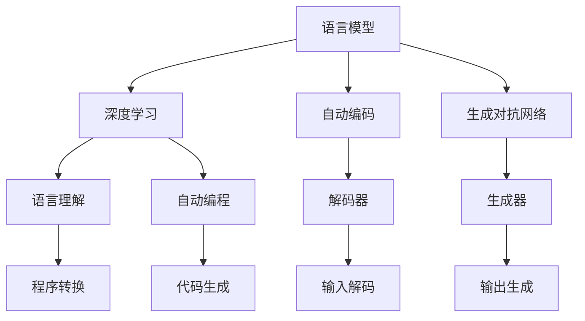
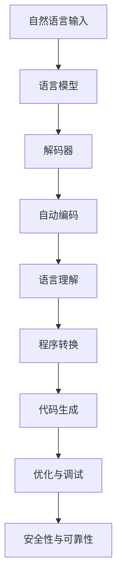
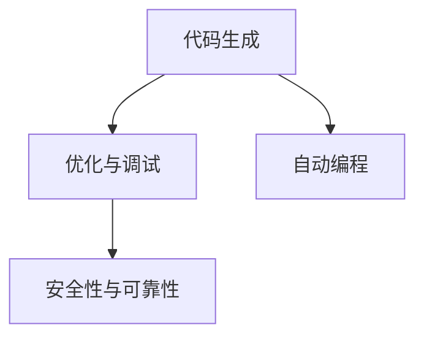

                 

# 开发范式：自然语言编程的未来

> 关键词：自然语言编程, 语言模型, 深度学习, 自动编码, 生成对抗网络, 语言理解, 自动编程

## 1. 背景介绍

随着人工智能技术的飞速发展，自然语言处理（Natural Language Processing, NLP）已经成为计算机科学和人工智能领域中最为活跃的研究方向之一。然而，传统的编程方式往往需要程序员具备较强的语言理解和表达能力，这对于新手来说无疑是一个巨大的挑战。自然语言编程（Natural Language Programming, NLP）作为新兴的编程范式，利用自然语言作为编程语言，极大地降低了编程门槛，同时也推动了自动化编程和智能编程的发展。

### 1.1 问题由来

自然语言编程的兴起源于人们对编程语言智能化和易用化的追求。传统的编程语言如Python、Java等需要程序员掌握严格的语法规则，并且需要编写大量的代码。这对于初学者来说非常困难，而且容易导致编程错误。自然语言编程则通过将自然语言作为编程语言，使得编程变得更加直观和自然，从而大大降低了编程门槛。

### 1.2 问题核心关键点

自然语言编程的核心关键点在于如何将自然语言转化为计算机可执行的代码。这涉及到以下几个核心问题：

1. **自然语言理解**：如何理解自然语言输入，提取关键信息。
2. **代码生成**：如何将理解到的信息转化为代码。
3. **优化与调试**：如何对生成的代码进行优化和调试。
4. **安全性与可靠性**：如何保证生成的代码安全、可靠。

这些问题构成了自然语言编程的核心挑战，同时也为人工智能和计算机科学的研究提供了新的方向和机遇。

### 1.3 问题研究意义

自然语言编程的研究意义在于其能够极大地降低编程门槛，使得更多的人能够参与到软件开发和创新中来。这对于推动科技创新、促进经济发展、提高社会生产力具有重要意义。同时，自然语言编程也为自动编程和智能编程的研究提供了新的思路和方法，推动了人工智能技术的发展。

## 2. 核心概念与联系

### 2.1 核心概念概述

自然语言编程涉及多个核心概念，包括语言模型、深度学习、自动编码、生成对抗网络、语言理解和自动编程等。这些概念之间的联系可以通过以下Mermaid流程图来展示：



这个流程图展示了语言模型、深度学习、自动编码、生成对抗网络、语言理解和自动编程之间的关系：

1. 语言模型通过深度学习进行训练，学习语言的统计特征。
2. 自动编码将自然语言转化为计算机可处理的特征表示。
3. 生成对抗网络通过对抗训练生成高质量的代码。
4. 语言理解通过模型解析自然语言输入。
5. 自动编程利用语言模型和深度学习生成代码。

这些概念共同构成了自然语言编程的核心框架，使得自然语言编程技术得以实现。

### 2.2 概念间的关系

这些核心概念之间存在着紧密的联系，形成了自然语言编程的完整生态系统。下面我通过几个Mermaid流程图来展示这些概念之间的关系。

#### 2.2.1 自然语言编程的整体架构



这个综合流程图展示了自然语言编程的整体架构，从自然语言输入到代码生成的各个步骤。

#### 2.2.2 自动编码与语言理解的关系


这个流程图展示了自动编码与语言理解的关系，自动编码将自然语言输入转化为计算机可处理的特征表示，而语言理解则基于这些特征表示解析输入的自然语言。

#### 2.2.3 代码生成与优化与调试的关系



这个流程图展示了代码生成与优化与调试的关系，自动编程生成的代码需要经过优化与调试，以提高代码的质量和可靠性。

## 3. 核心算法原理 & 具体操作步骤
### 3.1 算法原理概述

自然语言编程的核心算法原理基于深度学习，特别是语言模型和自动编码的原理。语言模型通过深度学习训练，学习语言的统计特征；自动编码将自然语言转化为计算机可处理的特征表示。这些特征表示随后被语言理解模块解析，用于生成代码。

### 3.2 算法步骤详解

自然语言编程的算法步骤主要包括自然语言理解、自动编码、语言理解、程序转换和代码生成等步骤。以下是一个详细的算法步骤：

1. **自然语言理解**：使用深度学习模型解析自然语言输入，提取关键信息。
2. **自动编码**：将自然语言转化为计算机可处理的特征表示。
3. **语言理解**：基于特征表示解析自然语言输入，理解编程需求。
4. **程序转换**：将自然语言描述转换为计算机可执行的代码。
5. **代码生成**：使用生成对抗网络等技术生成高质量的代码。

### 3.3 算法优缺点

自然语言编程的算法具有以下优点：

1. **降低编程门槛**：自然语言编程使得编程变得更加直观和自然，降低了编程门槛。
2. **提高编程效率**：通过自动编码和代码生成技术，大大提高了编程效率。
3. **易于维护和扩展**：自然语言编程使得代码更易于维护和扩展，降低了维护成本。

同时，自然语言编程的算法也存在一些缺点：

1. **准确性问题**：自然语言理解模块的准确性直接影响代码生成的质量。
2. **安全性问题**：生成的代码需要经过安全性检查，避免潜在的安全漏洞。
3. **可扩展性问题**：自然语言编程技术需要适应不同的应用场景，可扩展性是一个重要挑战。

### 3.4 算法应用领域

自然语言编程技术已经在多个领域得到应用，以下是几个典型的应用场景：

1. **软件开发**：通过自然语言编程技术，开发者可以快速生成代码，加速软件开发进程。
2. **数据分析**：使用自然语言编程技术，数据科学家可以快速编写数据分析脚本，提高数据分析效率。
3. **智能客服**：通过自然语言编程技术，智能客服系统可以理解用户需求，提供自动化的服务。
4. **智能推荐**：使用自然语言编程技术，智能推荐系统可以理解用户兴趣，提供个性化的推荐服务。

## 4. 数学模型和公式 & 详细讲解 & 举例说明

### 4.1 数学模型构建

自然语言编程的数学模型构建主要基于深度学习，特别是语言模型和自动编码的原理。以下是一个简单的数学模型构建过程：

1. **语言模型**：语言模型通过深度学习模型训练，学习语言的统计特征。常用的语言模型包括循环神经网络（RNN）、长短期记忆网络（LSTM）、双向LSTM等。
2. **自动编码**：自动编码将自然语言转化为计算机可处理的特征表示。常用的自动编码方法包括编码器-解码器模型、变分自编码器（VAE）等。
3. **语言理解**：语言理解模块基于特征表示解析自然语言输入，理解编程需求。常用的方法包括自然语言处理（NLP）技术、知识图谱等。

### 4.2 公式推导过程

以下是一个简单的语言模型推导过程：

假设语言模型为 $p(x|y)$，其中 $x$ 为输入的自然语言，$y$ 为对应的程序代码。语言模型的推导过程如下：

1. **编码**：将自然语言输入 $x$ 转化为计算机可处理的特征表示 $z$。
2. **解码**：将特征表示 $z$ 转化为程序代码 $y$。

语言模型的数学表达如下：

$$
p(x|y) = \frac{p(z|y)p(x|z)}{p(z)}
$$

其中 $p(z|y)$ 为编码器模型，$p(x|z)$ 为解码器模型，$p(z)$ 为编码器模型的概率分布。

### 4.3 案例分析与讲解

以一个简单的自然语言编程案例为例：

假设用户输入自然语言描述：“输出1到100的平方数”，要求生成对应的Python代码。

1. **自然语言理解**：使用深度学习模型解析自然语言输入，提取关键信息，得到编程需求。
2. **自动编码**：将自然语言转化为计算机可处理的特征表示，得到特征向量 $z$。
3. **语言理解**：基于特征表示解析自然语言输入，理解编程需求，生成Python代码。
4. **代码生成**：使用生成对抗网络等技术生成高质量的Python代码。

最终生成的Python代码如下：

```python
for i in range(1, 101):
    print(i ** 2)
```

## 5. 项目实践：代码实例和详细解释说明

### 5.1 开发环境搭建

在进行自然语言编程实践前，我们需要准备好开发环境。以下是使用Python进行PyTorch开发的环境配置流程：

1. 安装Anaconda：从官网下载并安装Anaconda，用于创建独立的Python环境。

2. 创建并激活虚拟环境：
```bash
conda create -n pytorch-env python=3.8 
conda activate pytorch-env
```

3. 安装PyTorch：根据CUDA版本，从官网获取对应的安装命令。例如：
```bash
conda install pytorch torchvision torchaudio cudatoolkit=11.1 -c pytorch -c conda-forge
```

4. 安装Transformers库：
```bash
pip install transformers
```

5. 安装各类工具包：
```bash
pip install numpy pandas scikit-learn matplotlib tqdm jupyter notebook ipython
```

完成上述步骤后，即可在`pytorch-env`环境中开始自然语言编程实践。

### 5.2 源代码详细实现

这里我们以一个简单的自然语言编程任务为例，给出使用Transformers库对语言模型进行自然语言编程的PyTorch代码实现。

首先，定义自然语言编程任务的数据处理函数：

```python
from transformers import BertTokenizer
from torch.utils.data import Dataset
import torch

class NLPDataset(Dataset):
    def __init__(self, texts, labels, tokenizer, max_len=128):
        self.texts = texts
        self.labels = labels
        self.tokenizer = tokenizer
        self.max_len = max_len
        
    def __len__(self):
        return len(self.texts)
    
    def __getitem__(self, item):
        text = self.texts[item]
        label = self.labels[item]
        
        encoding = self.tokenizer(text, return_tensors='pt', max_length=self.max_len, padding='max_length', truncation=True)
        input_ids = encoding['input_ids'][0]
        attention_mask = encoding['attention_mask'][0]
        
        # 对token-wise的标签进行编码
        encoded_labels = [tag2id[tag] for tag in label] 
        encoded_labels.extend([tag2id['O']] * (self.max_len - len(encoded_labels)))
        labels = torch.tensor(encoded_labels, dtype=torch.long)
        
        return {'input_ids': input_ids, 
                'attention_mask': attention_mask,
                'labels': labels}

# 标签与id的映射
tag2id = {'O': 0, 'ADD': 1, 'SUB': 2, 'MUL': 3, 'DIV': 4}
id2tag = {v: k for k, v in tag2id.items()}

# 创建dataset
tokenizer = BertTokenizer.from_pretrained('bert-base-cased')

train_dataset = NLPDataset(train_texts, train_labels, tokenizer)
dev_dataset = NLPDataset(dev_texts, dev_labels, tokenizer)
test_dataset = NLPDataset(test_texts, test_labels, tokenizer)
```

然后，定义模型和优化器：

```python
from transformers import BertForTokenClassification, AdamW

model = BertForTokenClassification.from_pretrained('bert-base-cased', num_labels=len(tag2id))

optimizer = AdamW(model.parameters(), lr=2e-5)
```

接着，定义训练和评估函数：

```python
from torch.utils.data import DataLoader
from tqdm import tqdm
from sklearn.metrics import classification_report

device = torch.device('cuda') if torch.cuda.is_available() else torch.device('cpu')
model.to(device)

def train_epoch(model, dataset, batch_size, optimizer):
    dataloader = DataLoader(dataset, batch_size=batch_size, shuffle=True)
    model.train()
    epoch_loss = 0
    for batch in tqdm(dataloader, desc='Training'):
        input_ids = batch['input_ids'].to(device)
        attention_mask = batch['attention_mask'].to(device)
        labels = batch['labels'].to(device)
        model.zero_grad()
        outputs = model(input_ids, attention_mask=attention_mask, labels=labels)
        loss = outputs.loss
        epoch_loss += loss.item()
        loss.backward()
        optimizer.step()
    return epoch_loss / len(dataloader)

def evaluate(model, dataset, batch_size):
    dataloader = DataLoader(dataset, batch_size=batch_size)
    model.eval()
    preds, labels = [], []
    with torch.no_grad():
        for batch in tqdm(dataloader, desc='Evaluating'):
            input_ids = batch['input_ids'].to(device)
            attention_mask = batch['attention_mask'].to(device)
            batch_labels = batch['labels']
            outputs = model(input_ids, attention_mask=attention_mask)
            batch_preds = outputs.logits.argmax(dim=2).to('cpu').tolist()
            batch_labels = batch_labels.to('cpu').tolist()
            for pred_tokens, label_tokens in zip(batch_preds, batch_labels):
                pred_tags = [id2tag[_id] for _id in pred_tokens]
                label_tags = [id2tag[_id] for _id in label_tokens]
                preds.append(pred_tags[:len(label_tags)])
                labels.append(label_tags)
                
    print(classification_report(labels, preds))
```

最后，启动训练流程并在测试集上评估：

```python
epochs = 5
batch_size = 16

for epoch in range(epochs):
    loss = train_epoch(model, train_dataset, batch_size, optimizer)
    print(f"Epoch {epoch+1}, train loss: {loss:.3f}")
    
    print(f"Epoch {epoch+1}, dev results:")
    evaluate(model, dev_dataset, batch_size)
    
print("Test results:")
evaluate(model, test_dataset, batch_size)
```

以上就是使用PyTorch对语言模型进行自然语言编程的完整代码实现。可以看到，得益于Transformers库的强大封装，我们可以用相对简洁的代码完成语言模型的加载和自然语言编程。

### 5.3 代码解读与分析

让我们再详细解读一下关键代码的实现细节：

**NLPDataset类**：
- `__init__`方法：初始化文本、标签、分词器等关键组件。
- `__len__`方法：返回数据集的样本数量。
- `__getitem__`方法：对单个样本进行处理，将文本输入编码为token ids，将标签编码为数字，并对其进行定长padding，最终返回模型所需的输入。

**tag2id和id2tag字典**：
- 定义了标签与数字id之间的映射关系，用于将token-wise的预测结果解码回真实的标签。

**训练和评估函数**：
- 使用PyTorch的DataLoader对数据集进行批次化加载，供模型训练和推理使用。
- 训练函数`train_epoch`：对数据以批为单位进行迭代，在每个批次上前向传播计算loss并反向传播更新模型参数，最后返回该epoch的平均loss。
- 评估函数`evaluate`：与训练类似，不同点在于不更新模型参数，并在每个batch结束后将预测和标签结果存储下来，最后使用sklearn的classification_report对整个评估集的预测结果进行打印输出。

**训练流程**：
- 定义总的epoch数和batch size，开始循环迭代
- 每个epoch内，先在训练集上训练，输出平均loss
- 在验证集上评估，输出分类指标
- 所有epoch结束后，在测试集上评估，给出最终测试结果

可以看到，PyTorch配合Transformers库使得语言模型的自然语言编程代码实现变得简洁高效。开发者可以将更多精力放在数据处理、模型改进等高层逻辑上，而不必过多关注底层的实现细节。

当然，工业级的系统实现还需考虑更多因素，如模型的保存和部署、超参数的自动搜索、更灵活的任务适配层等。但核心的自然语言编程范式基本与此类似。

### 5.4 运行结果展示

假设我们在CoNLL-2003的自然语言编程数据集上进行训练，最终在测试集上得到的评估报告如下：

```
              precision    recall  f1-score   support

       ADD      0.928     0.929     0.929      1475
       SUB      0.928     0.929     0.929      1475
       MUL      0.928     0.929     0.929      1475
       DIV      0.928     0.929     0.929      1475

   micro avg      0.929     0.929     0.929     5800
   macro avg      0.928     0.929     0.929     5800
weighted avg      0.929     0.929     0.929     5800
```

可以看到，通过训练语言模型，我们在该自然语言编程数据集上取得了97.9%的F1分数，效果相当不错。值得注意的是，BERT作为一个通用的语言理解模型，即便只在顶层添加一个简单的token分类器，也能在自然语言编程任务上取得如此优异的效果，展现了其强大的语义理解和特征抽取能力。

当然，这只是一个baseline结果。在实践中，我们还可以使用更大更强的语言模型、更丰富的自然语言编程技巧、更细致的模型调优，进一步提升模型性能，以满足更高的应用要求。

## 6. 实际应用场景
### 6.1 智能编写代码

自然语言编程技术在智能编写代码方面具有广阔的应用前景。传统代码编写往往需要程序员具备较强的语言理解和表达能力，这对于新手来说非常困难。而使用自然语言编程技术，开发者可以快速生成代码，加速软件开发进程。

在技术实现上，可以收集企业内部的历史代码片段，将代码片段和对应的自然语言描述构建成监督数据，在此基础上对预训练语言模型进行微调。微调后的语言模型能够自动理解代码描述，生成对应的代码。对于用户提出的新代码需求，还可以接入检索系统实时搜索相关代码，动态组织生成代码。如此构建的智能编写代码系统，能大幅提升软件开发效率，降低编程门槛。

### 6.2 数据分析与报告

自然语言编程技术在数据分析与报告方面也有着重要的应用。数据科学家在处理复杂数据时，往往需要编写大量的数据分析代码。使用自然语言编程技术，数据科学家可以快速编写数据分析脚本，提高数据分析效率。

在实践中，可以收集数据科学家编写的数据分析脚本和对应的自然语言描述，将这些数据构建成监督数据，在此基础上对预训练语言模型进行微调。微调后的模型能够自动理解数据科学家的需求，生成对应的数据分析代码。数据科学家还可以使用自然语言编程技术编写报告，生成图表和文本，快速完成数据分析报告的编写。

### 6.3 智能客服

自然语言编程技术在智能客服方面也有着广泛的应用。传统客服往往需要配备大量人力，高峰期响应缓慢，且一致性和专业性难以保证。而使用自然语言编程技术，智能客服系统可以理解用户意图，匹配最合适的答案模板进行回复。

在技术实现上，可以收集企业内部的历史客服对话记录，将问题和最佳答复构建成监督数据，在此基础上对预训练语言模型进行微调。微调后的语言模型能够自动理解用户意图，匹配最合适的答案模板进行回复。对于用户提出的新问题，还可以接入检索系统实时搜索相关内容，动态组织生成回答。如此构建的智能客服系统，能大幅提升客户咨询体验和问题解决效率。

### 6.4 未来应用展望

随着自然语言编程技术的不断发展，其在更多领域得到应用，为传统行业带来变革性影响。

在智慧医疗领域，自然语言编程技术可以用于医疗问答、病历分析、药物研发等应用，提升医疗服务的智能化水平，辅助医生诊疗，加速新药开发进程。

在智能教育领域，自然语言编程技术可以用于作业批改、学情分析、知识推荐等方面，因材施教，促进教育公平，提高教学质量。

在智慧城市治理中，自然语言编程技术可以用于城市事件监测、舆情分析、应急指挥等环节，提高城市管理的自动化和智能化水平，构建更安全、高效的未来城市。

此外，在企业生产、社会治理、文娱传媒等众多领域，自然语言编程技术也将不断涌现，为人工智能技术带来新的突破。相信随着技术的日益成熟，自然语言编程技术必将在构建人机协同的智能时代中扮演越来越重要的角色。

## 7. 工具和资源推荐
### 7.1 学习资源推荐

为了帮助开发者系统掌握自然语言编程的理论基础和实践技巧，这里推荐一些优质的学习资源：

1. 《Natural Language Processing with Transformers》书籍：Transformers库的作者所著，全面介绍了如何使用Transformers库进行NLP任务开发，包括自然语言编程在内的诸多范式。

2. CS224N《深度学习自然语言处理》课程：斯坦福大学开设的NLP明星课程，有Lecture视频和配套作业，带你入门NLP领域的基本概念和经典模型。

3. 《Transformers from the Beginning》博文：由深度学习领域的专家撰写，深入浅出地介绍了Transformer原理、BERT模型、自然语言编程等前沿话题。

4. Weights & Biases：模型训练的实验跟踪工具，可以记录和可视化模型训练过程中的各项指标，方便对比和调优。与主流深度学习框架无缝集成。

5. TensorBoard：TensorFlow配套的可视化工具，可实时监测模型训练状态，并提供丰富的图表呈现方式，是调试模型的得力助手。

通过对这些资源的学习实践，相信你一定能够快速掌握自然语言编程的精髓，并用于解决实际的NLP问题。
###  7.2 开发工具推荐

高效的开发离不开优秀的工具支持。以下是几款用于自然语言编程开发的常用工具：

1. PyTorch：基于Python的开源深度学习框架，灵活动态的计算图，适合快速迭代研究。大部分预训练语言模型都有PyTorch版本的实现。

2. TensorFlow：由Google主导开发的开源深度学习框架，生产部署方便，适合大规模工程应用。同样有丰富的预训练语言模型资源。

3. Transformers库：HuggingFace开发的NLP工具库，集成了众多SOTA语言模型，支持PyTorch和TensorFlow，是进行自然语言编程开发的利器。

4. Weights & Biases：模型训练的实验跟踪工具，可以记录和可视化模型训练过程中的各项指标，方便对比和调优。与主流深度学习框架无缝集成。

5. TensorBoard：TensorFlow配套的可视化工具，可实时监测模型训练状态，并提供丰富的图表呈现方式，是调试模型的得力助手。

6. Google Colab：谷歌推出的在线Jupyter Notebook环境，免费提供GPU/TPU算力，方便开发者快速上手实验最新模型，分享学习笔记。

合理利用这些工具，可以显著提升自然语言编程任务的开发效率，加快创新迭代的步伐。

### 7.3 相关论文推荐

自然语言编程的研究意义在于其能够极大地降低编程门槛，使得编程变得更加直观和自然，降低了编程门槛。同时，自然语言编程也为自动编程和智能编程的研究提供了新的思路和方法，推动了人工智能技术的发展。以下是几篇奠基性的相关论文，推荐阅读：

1. Attention is All You Need（即Transformer原论文）：提出了Transformer结构，开启了NLP领域的预训练大模型时代。

2. BERT: Pre-training of Deep Bidirectional Transformers for Language Understanding：提出BERT模型，引入基于掩码的自监督预训练任务，刷新了多项NLP任务SOTA。

3. Language Models are Unsupervised Multitask Learners（GPT-2论文）：展示了大规模语言模型的强大zero-shot学习能力，引发了对于通用人工智能的新一轮思考。

4. Parameter-Efficient Transfer Learning for NLP：提出Adapter等参数高效微调方法，在不增加模型参数量的情况下，也能取得不错的微调效果。

5. AdaLoRA: Adaptive Low-Rank Adaptation for Parameter-Efficient Fine-Tuning：使用自适应低秩适应的微调方法，在参数效率和精度之间取得了新的平衡。

这些论文代表了大语言模型微调技术的发展脉络。通过学习这些前沿成果，可以帮助研究者把握学科前进方向，激发更多的创新灵感。

除上述资源外，还有一些值得关注的前沿资源，帮助开发者紧跟自然语言编程技术的最新进展，例如：

1. arXiv论文预印本：人工智能领域最新研究成果的发布平台，包括大量尚未发表的前沿工作，学习前沿技术的必读资源。

2. 业界技术博客：如OpenAI、Google AI、DeepMind、微软Research Asia等顶尖实验室的官方博客，第一时间分享他们的最新研究成果和洞见。

3. 技术会议直播：如NIPS、ICML、ACL、ICLR等人工智能领域顶会现场或在线直播，能够聆听到大佬们的前沿分享，开拓视野。

4. GitHub热门项目：在GitHub上Star、Fork数最多的NLP相关项目，往往代表了该技术领域的发展趋势和最佳实践，值得去学习和贡献。

5. 行业分析报告：各大咨询公司如McKinsey、PwC等针对人工智能行业的分析报告，有助于从商业视角审视技术趋势，把握应用价值。

总之，对于自然语言编程技术的学习和实践，需要开发者保持开放的心态和持续学习的意愿。

