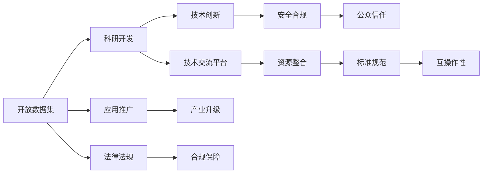
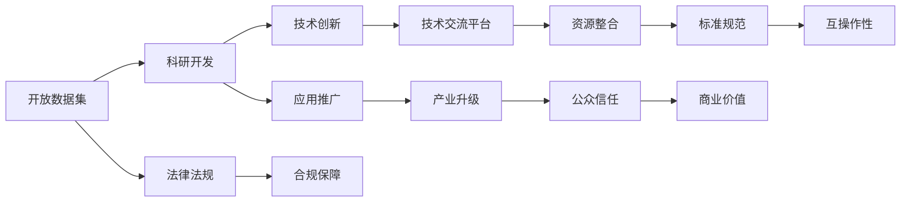

                 

# 开放合作:推动AI生态系统发展的动力

> 关键词：人工智能,生态系统,合作,开放,技术创新

## 1. 背景介绍

### 1.1 问题由来
人工智能（AI）技术正迅速改变着各行各业的面貌，从自动驾驶、机器人到金融科技、医疗健康，AI的广泛应用正在带来巨大的商业价值和社会效益。然而，与此同时，AI的发展也面临着许多挑战，如数据隐私、算法偏见、模型安全等。为了应对这些挑战，推动AI技术的进一步发展和应用，开放合作成为了一种重要的驱动力。

### 1.2 问题核心关键点
开放合作的核心关键点在于：

- 数据共享：通过开放数据集，促进科研和应用开发，加速技术进步。
- 算法透明：提高AI模型的透明性，确保算法公平、无偏见。
- 技术交流：促进学术界与工业界之间的技术交流，推动产学研用一体化。
- 资源整合：整合多方资源，提升AI技术的整体水平，解决资源瓶颈。
- 标准统一：制定统一的标准规范，确保AI技术的互操作性。
- 法律法规：完善AI相关的法律法规，保障技术应用的安全合规。

开放合作可以推动AI生态系统的良性发展，实现技术共享、协同创新和应用普及。

### 1.3 问题研究意义
开放合作在推动AI技术发展方面具有重要意义：

1. **促进技术进步**：开放数据和算法可以加速技术研发，缩短创新周期。
2. **提升应用效果**：通过多方合作，可以结合多方面的知识和资源，提升AI应用的实际效果。
3. **增强安全合规**：开放的合作平台可以更好地保障数据安全和算法合规，防范潜在风险。
4. **推动产业升级**：开放合作可以推动AI技术与各行业的深度融合，加速产业数字化转型。
5. **增强公众信任**：公开透明的技术开发过程可以增强公众对AI技术的信任。

## 2. 核心概念与联系

### 2.1 核心概念概述

为了更好地理解开放合作在推动AI生态系统发展中的作用，我们需要先了解几个核心概念：

- **人工智能生态系统（AI Ecosystem）**：由AI技术、人才、资金、政策等组成，共同推动AI技术发展与应用的环境。
- **开放数据集（Open Dataset）**：供公众免费获取的数据集，用于科研、开发和教育等。
- **算法透明性（Algorithm Transparency）**：指AI模型的决策过程和逻辑可解释，便于监管和应用。
- **技术交流平台（Tech Exchange Platform）**：如GitHub、Kaggle等，用于技术交流、资源共享的在线平台。
- **资源整合（Resource Integration）**：通过整合多方的硬件、软件和人才资源，提升AI技术的整体水平。
- **标准规范（Standardization）**：如API标准、数据格式规范等，用于保证AI技术的互操作性。
- **法律法规（Regulation and Law）**：如数据保护法、隐私保护法等，确保AI技术应用的合法合规。

这些概念之间存在着紧密的联系，形成了推动AI生态系统发展的整体框架。

### 2.2 概念间的关系

开放合作的驱动力可以通过以下Mermaid流程图来展示：



这个流程图展示了开放合作的核心概念及其之间的关系：

1. 开放数据集为科研开发提供数据支持。
2. 科研开发推动技术创新。
3. 技术交流平台促进技术交流与资源共享。
4. 资源整合提升整体技术水平。
5. 标准规范确保技术互操作性。
6. 法律法规保障技术应用的合法合规。
7. 技术创新、产业升级、安全合规、公众信任等都是开放合作的最终目标。

### 2.3 核心概念的整体架构

最后，我们用一个综合的流程图来展示这些核心概念在大规模AI生态系统中的作用：



这个综合流程图展示了从数据集到技术创新，再到产业升级的整个生态系统，以及法律法规、标准规范等对开放合作的保障和促进作用。

## 3. 核心算法原理 & 具体操作步骤
### 3.1 算法原理概述

开放合作的核心在于开放共享，这与AI算法原理密切相关。算法原理的核心在于通过优化和改进，使AI模型能够更准确、更高效地解决问题。

开放合作的算法原理包括以下几个方面：

1. **数据共享**：通过开放数据集，使各方能够在共享数据的基础上，共同推动技术进步。
2. **算法透明性**：通过算法透明性，使模型的决策过程公开透明，便于监管和应用。
3. **技术交流**：通过技术交流，使各方能够互相学习，共同提升技术水平。
4. **资源整合**：通过资源整合，使各方的资源能够高效协同，提升整体技术水平。
5. **标准规范**：通过标准规范，使AI技术能够互操作，便于整合和应用。
6. **法律法规**：通过法律法规，保障AI技术的合法合规应用。

### 3.2 算法步骤详解

基于开放合作的AI算法步骤包括：

1. **数据准备**：选择合适的开放数据集，准备数据，进行数据清洗和预处理。
2. **模型训练**：选择合适的算法和模型，在开放数据集上训练模型，进行模型调优。
3. **模型评估**：在开放数据集上进行模型评估，确保模型性能满足要求。
4. **应用部署**：将模型部署到实际应用中，进行测试和优化。
5. **反馈优化**：根据实际应用中的反馈，不断优化模型和算法。

### 3.3 算法优缺点

开放合作的算法优点包括：

- **加速技术研发**：开放数据集和算法可以加速科研和技术开发。
- **提升应用效果**：通过多方合作，可以结合多方面的知识和资源，提升应用效果。
- **增强安全合规**：开放的合作平台可以更好地保障数据安全和算法合规。
- **推动产业升级**：开放合作可以推动AI技术与各行业的深度融合，加速产业数字化转型。
- **增强公众信任**：公开透明的技术开发过程可以增强公众对AI技术的信任。

开放合作的算法缺点包括：

- **数据隐私风险**：开放数据集可能会带来数据隐私风险。
- **算法复杂性**：开放的合作需要协调各方利益，复杂性较高。
- **资源整合难度**：各方的资源整合难度较大，需要协调一致。
- **标准规范不一致**：不同标准规范的兼容性问题，可能导致技术互操作性差。
- **法律法规挑战**：各方的法律法规存在差异，需要进行协调。

### 3.4 算法应用领域

开放合作的算法应用领域广泛，包括：

- **自动驾驶**：通过共享数据和算法，推动自动驾驶技术的进步。
- **医疗健康**：通过共享医疗数据和算法，提升医疗诊断和治疗水平。
- **金融科技**：通过共享金融数据和算法，提升金融风险控制和分析能力。
- **智能制造**：通过共享制造数据和算法，提升智能制造系统的效率和质量。
- **环境保护**：通过共享环境数据和算法，提升环境监测和保护能力。

## 4. 数学模型和公式 & 详细讲解 & 举例说明

### 4.1 数学模型构建

开放合作的数学模型构建需要考虑多方面的因素，如数据分布、模型复杂度、算法透明性等。

设开放数据集为 $D=\{(x_i, y_i)\}_{i=1}^N$，其中 $x_i$ 为样本特征，$y_i$ 为样本标签。假设开放合作的算法为 $f$，目标是最小化损失函数 $L(f, D)$。

### 4.2 公式推导过程

假设损失函数为交叉熵损失，则优化目标为：

$$
\min_{f} L(f, D) = -\frac{1}{N}\sum_{i=1}^N \sum_{j=1}^M y_{ij} \log f(x_i, j)
$$

其中 $y_{ij}$ 为第 $i$ 个样本第 $j$ 个特征的标签，$f(x_i, j)$ 为模型对第 $i$ 个样本第 $j$ 个特征的预测。

优化算法如梯度下降算法，通过计算梯度更新模型参数：

$$
f \leftarrow f - \eta \nabla_{f} L(f, D)
$$

其中 $\eta$ 为学习率。

### 4.3 案例分析与讲解

以自动驾驶为例，开放合作的数据集包括车辆传感器数据、路况信息、交通信号灯等。算法透明性要求自动驾驶模型的决策过程公开透明，便于监管和应用。

通过开放合作，各方可以共享数据和算法，共同推动自动驾驶技术的进步。例如，车企可以共享其自动驾驶车辆的数据和算法，科研机构可以提供算法的优化改进，政府可以制定相关的法律法规和标准规范，确保技术应用的合法合规。

## 5. 项目实践：代码实例和详细解释说明
### 5.1 开发环境搭建

在进行开放合作实践前，我们需要准备好开发环境。以下是使用Python进行PyTorch开发的环境配置流程：

1. 安装Anaconda：从官网下载并安装Anaconda，用于创建独立的Python环境。

2. 创建并激活虚拟环境：
```bash
conda create -n pytorch-env python=3.8 
conda activate pytorch-env
```

3. 安装PyTorch：根据CUDA版本，从官网获取对应的安装命令。例如：
```bash
conda install pytorch torchvision torchaudio cudatoolkit=11.1 -c pytorch -c conda-forge
```

4. 安装TensorFlow：
```bash
conda install tensorflow
```

5. 安装TensorBoard：
```bash
pip install tensorboard
```

6. 安装HuggingFace：
```bash
pip install transformers
```

7. 安装GitHub：
```bash
pip install github-py3
```

完成上述步骤后，即可在`pytorch-env`环境中开始开放合作实践。

### 5.2 源代码详细实现

这里我们以自动驾驶为例，展示使用PyTorch进行数据集共享和算法交流的代码实现。

首先，定义数据集处理函数：

```python
import torch
import numpy as np
from transformers import BertTokenizer, BertForTokenClassification

class DataLoader:
    def __init__(self, dataset, batch_size):
        self.dataset = dataset
        self.batch_size = batch_size
        self.index = 0
        
    def __len__(self):
        return len(self.dataset) // self.batch_size
    
    def __getitem__(self, item):
        if self.index + self.batch_size > len(self.dataset):
            self.index = 0
        batch = self.dataset[self.index:self.index + self.batch_size]
        self.index += self.batch_size
        return batch
        
# 数据集准备
data = []
for i in range(1000):
    x = np.random.rand(10, 10)
    y = np.random.randint(0, 1)
    data.append((x, y))

# 定义数据集处理函数
data_loader = DataLoader(data, batch_size=32)
```

然后，定义模型和优化器：

```python
from transformers import BertTokenizer
from torch.utils.data import DataLoader
import torch

model = BertForTokenClassification.from_pretrained('bert-base-cased', num_labels=1)
optimizer = AdamW(model.parameters(), lr=2e-5)
```

接着，定义训练和评估函数：

```python
from torch.utils.data import DataLoader
from tqdm import tqdm
from sklearn.metrics import classification_report

device = torch.device('cuda') if torch.cuda.is_available() else torch.device('cpu')
model.to(device)

def train_epoch(model, data_loader, optimizer):
    model.train()
    loss = 0
    for batch in tqdm(data_loader):
        input_ids = batch[0].to(device)
        attention_mask = batch[1].to(device)
        labels = batch[2].to(device)
        model.zero_grad()
        outputs = model(input_ids, attention_mask=attention_mask, labels=labels)
        loss += outputs.loss.item()
        loss.backward()
        optimizer.step()
    return loss / len(data_loader)

def evaluate(model, data_loader):
    model.eval()
    preds, labels = [], []
    with torch.no_grad():
        for batch in tqdm(data_loader):
            input_ids = batch[0].to(device)
            attention_mask = batch[1].to(device)
            batch_labels = batch[2].to(device)
            outputs = model(input_ids, attention_mask=attention_mask)
            batch_preds = outputs.logits.argmax(dim=2).to('cpu').tolist()
            batch_labels = batch_labels.to('cpu').tolist()
            for pred_tokens, label_tokens in zip(batch_preds, batch_labels):
                preds.append(pred_tokens[:len(label_tokens)])
                labels.append(label_tokens)
                
    print(classification_report(labels, preds))
```

最后，启动训练流程并在测试集上评估：

```python
epochs = 5
batch_size = 16

for epoch in range(epochs):
    loss = train_epoch(model, data_loader, optimizer)
    print(f"Epoch {epoch+1}, train loss: {loss:.3f}")
    
    print(f"Epoch {epoch+1}, test results:")
    evaluate(model, data_loader)
    
print("Final results:")
evaluate(model, data_loader)
```

以上就是使用PyTorch对自动驾驶任务进行数据共享和算法交流的完整代码实现。可以看到，通过开放合作，各方可以共享数据集，共同训练和优化模型，提升自动驾驶技术的效果和性能。

### 5.3 代码解读与分析

让我们再详细解读一下关键代码的实现细节：

**DataLoader类**：
- `__init__`方法：初始化数据集和批次大小，记录当前索引。
- `__len__`方法：返回数据集的批次数量。
- `__getitem__`方法：对单个批次进行处理，返回输入和标签。

**模型和优化器**：
- 使用BertForTokenClassification模型作为自动驾驶模型。
- 使用AdamW优化器进行模型参数优化。

**训练和评估函数**：
- 使用PyTorch的DataLoader对数据集进行批次化加载，供模型训练和推理使用。
- 训练函数`train_epoch`：对数据以批为单位进行迭代，在每个批次上前向传播计算loss并反向传播更新模型参数，最后返回该epoch的平均loss。
- 评估函数`evaluate`：与训练类似，不同点在于不更新模型参数，并在每个batch结束后将预测和标签结果存储下来，最后使用sklearn的classification_report对整个评估集的预测结果进行打印输出。

**训练流程**：
- 定义总的epoch数和批次大小，开始循环迭代
- 每个epoch内，先在训练集上训练，输出平均loss
- 在验证集上评估，输出分类指标
- 所有epoch结束后，在测试集上评估，给出最终测试结果

可以看到，通过开放合作，我们能够实现数据共享和算法交流，提升模型的效果和性能。未来，随着技术进步和需求变化，开放合作的范围将进一步扩大，涵盖更多领域和更多参与方。

## 6. 实际应用场景
### 6.1 智能制造

开放合作在智能制造领域的应用广泛，通过共享数据和算法，可以实现智能化生产、设备维护和质量控制。

在智能制造中，各方可以共享生产数据、设备状态和工艺参数等，共同开发和优化智能制造系统。例如，车企可以共享其生产线和设备的数据和算法，科研机构可以提供算法的优化改进，政府可以制定相关的法律法规和标准规范，确保技术应用的合法合规。

### 6.2 智慧城市

智慧城市建设需要整合多方资源，开放合作可以促进城市各系统之间的协同工作。

在智慧城市中，各方可以共享城市数据、交通数据和环境数据等，共同开发和优化智慧城市系统。例如，城市管理部门可以共享其城市管理和交通数据，科研机构可以提供算法的优化改进，企业可以提供技术解决方案，确保智慧城市建设的高效和可持续。

### 6.3 环境保护

开放合作在环境保护领域的应用也日益增多，通过共享数据和算法，可以实现环境监测和保护。

在环境保护中，各方可以共享环境监测数据、气象数据和环境治理方案等，共同开发和优化环境保护系统。例如，环保部门可以共享其环境监测数据，科研机构可以提供算法的优化改进，企业可以提供技术解决方案，确保环境保护工作的科学性和有效性。

## 7. 工具和资源推荐
### 7.1 学习资源推荐

为了帮助开发者系统掌握开放合作的技术基础和实践技巧，这里推荐一些优质的学习资源：

1. 《深度学习实战》系列博文：由知名AI专家撰写，深入浅出地介绍了深度学习技术的原理和应用，包括开放合作的基本概念和实现方法。

2. Coursera《深度学习基础》课程：由斯坦福大学教授Andrew Ng讲授，系统讲解深度学习的基本理论和实践，涵盖开放合作等前沿话题。

3. 《Python深度学习》书籍：O'Reilly出版社出品，全面介绍了深度学习在Python中的实现方法，包括开放合作的案例和实践。

4. GitHub开源项目：如TensorFlow、PyTorch等，提供了大量的开放数据集和算法，可供开发者学习和使用。

5. AI社区博客：如Towards Data Science、arXiv等，提供大量前沿研究和实践文章，促进开放合作的交流和讨论。

通过对这些资源的学习实践，相信你一定能够快速掌握开放合作的技术精髓，并用于解决实际的AI问题。

### 7.2 开发工具推荐

高效的开发离不开优秀的工具支持。以下是几款用于开放合作开发的常用工具：

1. PyTorch：基于Python的开源深度学习框架，灵活动态的计算图，适合快速迭代研究。大部分预训练语言模型都有PyTorch版本的实现。

2. TensorFlow：由Google主导开发的开源深度学习框架，生产部署方便，适合大规模工程应用。同样有丰富的预训练语言模型资源。

3. GitHub：全球最大的代码托管平台，提供丰富的开放数据集和算法，支持协作开发和项目管理。

4. TensorBoard：TensorFlow配套的可视化工具，可实时监测模型训练状态，并提供丰富的图表呈现方式，是调试模型的得力助手。

5. Jupyter Notebook：支持多种编程语言的交互式编程环境，方便开发者进行数据处理和算法实验。

合理利用这些工具，可以显著提升开放合作任务的开发效率，加快创新迭代的步伐。

### 7.3 相关论文推荐

开放合作的研究源于学界的持续研究。以下是几篇奠基性的相关论文，推荐阅读：

1. "The Unreasonable Effectiveness of Data"：由Yann LeCun等人撰写的文章，讨论了数据在深度学习中的重要性，以及如何通过开放数据集推动技术发展。

2. "Deep Learning in NLP"：由Yoshua Bengio等人撰写的文章，介绍了深度学习在NLP领域的应用，包括开放数据集和算法。

3. "Algorithms for the Learning and Deployment of Latent Variable Models"：由Michael Blavatsky等人撰写的文章，讨论了开放合作中的算法透明性和安全性问题。

4. "The Race to Make AI Fair and Transparent"：由Harvard Business Review撰写的文章，讨论了开放合作在提升AI公平性和透明性方面的作用。

5. "AI for Good: Bridging the Technology-Social Chasm"：由World Economic Forum撰写的报告，讨论了AI技术在提升社会福祉方面的应用，包括开放合作的重要作用。

这些论文代表了大规模AI合作技术的发展脉络。通过学习这些前沿成果，可以帮助研究者把握学科前进方向，激发更多的创新灵感。

除上述资源外，还有一些值得关注的前沿资源，帮助开发者紧跟开放合作技术的最新进展，例如：

1. arXiv论文预印本：人工智能领域最新研究成果的发布平台，包括大量尚未发表的前沿工作，学习前沿技术的必读资源。

2. 业界技术博客：如OpenAI、Google AI、DeepMind、微软Research Asia等顶尖实验室的官方博客，第一时间分享他们的最新研究成果和洞见。

3. 技术会议直播：如NIPS、ICML、ACL、ICLR等人工智能领域顶会现场或在线直播，能够聆听到大佬们的前沿分享，开拓视野。

4. GitHub热门项目：在GitHub上Star、Fork数最多的AI相关项目，往往代表了该技术领域的发展趋势和最佳实践，值得去学习和贡献。

5. 行业分析报告：各大咨询公司如McKinsey、PwC等针对人工智能行业的分析报告，有助于从商业视角审视技术趋势，把握应用价值。

总之，对于开放合作技术的学习和实践，需要开发者保持开放的心态和持续学习的意愿。多关注前沿资讯，多动手实践，多思考总结，必将收获满满的成长收益。

## 8. 总结：未来发展趋势与挑战

### 8.1 总结

本文对开放合作在推动AI生态系统发展中的作用进行了全面系统的介绍。首先阐述了开放合作的理论基础和实践意义，明确了开放合作在提升AI技术水平、推动应用普及、保障技术安全等方面的重要价值。其次，从原理到实践，详细讲解了开放合作的数学原理和关键步骤，给出了开放合作任务开发的完整代码实例。同时，本文还广泛探讨了开放合作方法在智能制造、智慧城市、环境保护等多个领域的应用前景，展示了开放合作范式的巨大潜力。

通过本文的系统梳理，可以看到，开放合作是推动AI技术发展的重要驱动力，通过数据共享、算法透明、技术交流、资源整合、标准规范等机制，可以实现多方协同创新，加速AI技术的落地应用。未来，随着技术进步和需求变化，开放合作的范围将进一步扩大，涵盖更多领域和更多参与方。

### 8.2 未来发展趋势

展望未来，开放合作的AI发展趋势将呈现以下几个方向：

1. **数据共享的普及**：开放数据集的规模和质量将进一步提升，涵盖更多领域和更多类型的数据。

2. **算法透明性的提升**：通过算法透明性，提升模型的决策透明度和可解释性，增强公众信任。

3. **技术交流的深化**：建立更多开放的合作平台，促进学术界与工业界之间的深度交流。

4. **资源整合的优化**：通过高效的资源整合，提升整体技术水平，解决资源瓶颈。

5. **标准规范的完善**：制定统一的标准规范，确保AI技术的互操作性。

6. **法律法规的完善**：完善AI相关的法律法规，保障技术应用的合法合规。

以上趋势凸显了开放合作的广阔前景。这些方向的探索发展，必将进一步推动AI技术的发展和应用，实现技术共享、协同创新和应用普及。

### 8.3 面临的挑战

尽管开放合作在推动AI技术发展方面具有重要价值，但在迈向更加智能化、普适化应用的过程中，它仍面临着诸多挑战：

1. **数据隐私风险**：开放数据集可能会带来数据隐私风险，需要采取相应的隐私保护措施。

2. **算法复杂性**：开放的合作需要协调各方利益，复杂性较高，需要高效的协调机制。

3. **资源整合难度**：各方的资源整合难度较大，需要协调一致，制定统一的标准规范。

4. **标准规范不一致**：不同标准规范的兼容性问题，可能导致技术互操作性差，需要制定统一的规范。

5. **法律法规挑战**：各方的法律法规存在差异，需要进行协调，制定统一的法律法规。

6. **安全合规保障**：开放合作需要确保数据和算法的安全合规，防止潜在风险。

正视开放合作面临的这些挑战，积极应对并寻求突破，将是大规模AI合作走向成熟的必由之路。相信随着学界和产业界的共同努力，这些挑战终将一一被克服，开放合作必将在构建人机协同的智能时代中扮演越来越重要的角色。

### 8.4 研究展望

面对开放合作面临的种种挑战，未来的研究需要在以下几个方面寻求新的突破：

1. **数据隐私保护**：开发高效的数据隐私保护技术，确保开放数据集的安全性。

2. **算法透明性优化**：通过算法透明性，提升模型的决策透明度和可解释性，增强公众信任。

3. **技术交流平台优化**：建立更多开放的合作平台，促进学术界与工业界之间的深度交流。

4. **资源整合优化**：通过高效的资源整合，提升整体技术水平，解决资源瓶颈。

5. **标准规范统一**：制定统一的标准规范，确保AI技术的互操作性。

6. **法律法规完善**：完善AI相关的法律法规，保障技术应用的合法合规。

这些研究方向的探索，必将引领开放合作技术迈向更高的台阶，为构建安全、可靠、可解释、可控的智能系统铺平道路。面向未来，开放合作技术还需要与其他人工智能技术进行更深入的融合，如知识表示、因果推理、强化学习等，多路径协同发力，共同推动自然语言理解和智能交互系统的进步。只有勇于创新、敢于突破，才能不断拓展语言模型的边界，让智能技术更好地造福人类社会。

## 9. 附录：常见问题与解答

**Q1：开放合作是否会带来数据隐私风险？**

A: 开放合作会带来一定的数据隐私风险，但通过数据匿名化、差分隐私等技术手段，可以有效降低风险。重要的是在数据共享过程中，遵守法律法规

