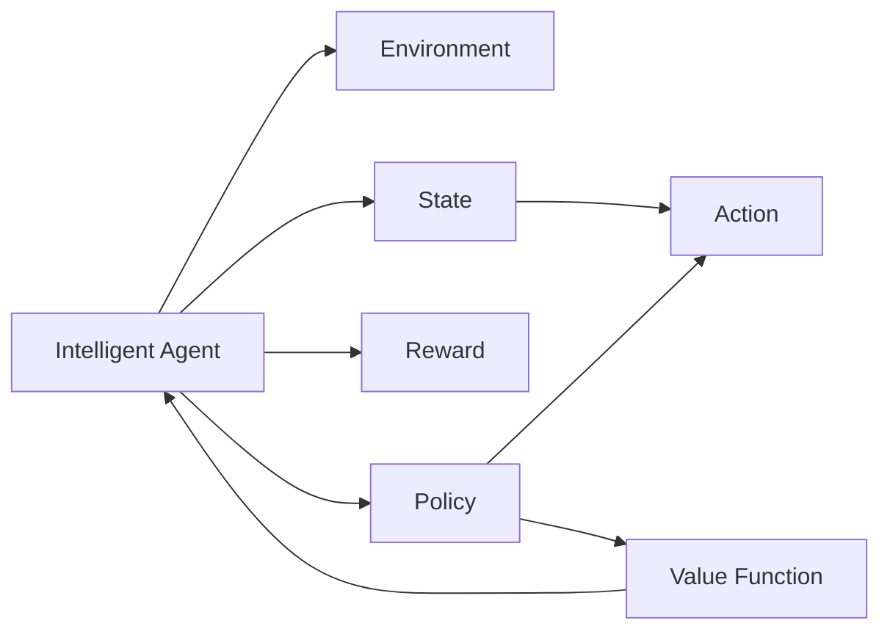

                 

# 强化学习 (Reinforcement Learning)

> 关键词：强化学习, 深度强化学习, 深度学习, 深度Q学习, 策略梯度, 动作序列, 探索与利用, 马尔可夫决策过程, 多智能体, 不确定性, 最优控制

## 1. 背景介绍

### 1.1 问题由来

强化学习 (Reinforcement Learning, RL) 是人工智能领域中一类重要的学习方法，旨在使智能体在特定的环境中通过与环境的互动，学习到最优的行动策略。强化学习的起源可以追溯到20世纪50年代，著名数学家von Neumann首次提出使用策略进行决策的问题。但直到近年来，随着深度学习技术的兴起和计算能力的提升，强化学习才在诸如游戏、机器人控制、推荐系统、自然语言处理等多个领域取得了突破性进展。

然而，尽管强化学习已取得丰硕成果，但其相对于传统的监督学习和无监督学习而言，理论上的完备性和实际应用的便捷性仍存在较大差距。此外，在现实世界中，强化学习往往面临非马尔可夫性、不确定性、大样本要求、奖励设计等问题。这使得强化学习的理论和实践面临诸多挑战，亟需更系统、深入的研究和应用。

### 1.2 问题核心关键点

当前强化学习的核心研究点包括：
1. **深度强化学习**：利用深度神经网络来逼近行动策略或价值函数，以提升模型的泛化能力和学习效率。
2. **探索与利用平衡**：在复杂环境中寻找最优策略，既需对未知状态进行探索，又需利用已有知识进行利用。
3. **多智能体合作与竞争**：在多智能体系统中，个体间的策略交互和协调问题。
4. **不确定性处理**：处理不确定的奖励、模型参数和环境变化。
5. **鲁棒性**：在不确定环境中保持性能的稳定性和鲁棒性。
6. **可解释性**：强化学习模型的决策过程可解释性。

强化学习的方法和算法不断演进，目前主流方法包括：
1. **Q-learning**：基于动作值函数进行学习。
2. **策略梯度**：通过策略参数进行梯度优化。
3. **深度强化学习**：利用深度神经网络进行策略表示和动作值函数逼近。
4. **模型基强化学习**：结合模型预测和强化学习的思想。
5. **多智能体强化学习**：涉及多个智能体之间的互动与协作。

这些方法和算法相互补充，共同构建了强化学习的理论和方法体系。

### 1.3 问题研究意义

强化学习的研究和应用具有重要意义：
1. **自适应性**：强化学习模型在复杂多变的环境中能够适应新情况，不断学习优化策略。
2. **自动化**：强化学习能够自动探索最优策略，减少人工干预。
3. **优化效率**：通过强化学习，能够在没有大量标注数据的情况下，快速找到最优策略。
4. **泛化能力**：强化学习模型能够将学习经验迁移到新环境中，提升泛化能力。
5. **创新应用**：强化学习已在多个领域展现出巨大应用潜力，如自动驾驶、机器人控制、游戏AI、金融投资等。

## 2. 核心概念与联系

### 2.1 核心概念概述

强化学习中的核心概念主要包括：

1. **智能体 (Agent)**：主动学习行动的实体，可以是机器人、智能体等。
2. **环境 (Environment)**：智能体进行行动和观察的外部世界。
3. **状态 (State)**：智能体在某一时刻的具体描述。
4. **行动 (Action)**：智能体在某一状态下的选择。
5. **奖励 (Reward)**：智能体在某一状态下选择的行动得到的反馈。
6. **策略 (Policy)**：智能体在不同状态下选择行动的映射关系。
7. **价值函数 (Value Function)**：描述智能体在某个状态下的期望总奖励。

这些核心概念之间通过特定的规则和算法相互作用，使得智能体能够通过与环境的交互，学习到最优的行动策略。

### 2.2 概念间的关系

强化学习中各个概念之间的关系可以通过以下Mermaid流程图来展示：



这个流程图展示了智能体与环境、状态、行动、奖励、策略和价值函数之间的关系。

## 3. 核心算法原理 & 具体操作步骤

### 3.1 算法原理概述

强化学习的核心算法通常包括以下几个步骤：

1. **环境初始化**：将环境初始化为某个状态 $s_0$。
2. **行动选择**：根据策略 $\pi$ 选择行动 $a_t$。
3. **状态转移**：根据行动 $a_t$ 和当前状态 $s_t$，环境转移到下一个状态 $s_{t+1}$。
4. **奖励获取**：根据行动 $a_t$ 和当前状态 $s_t$，获得奖励 $r_t$。
5. **状态记录**：记录当前状态 $s_t$ 和行动 $a_t$。
6. **策略更新**：通过更新策略 $\pi$，优化行动选择。
7. **迭代执行**：重复上述步骤，直至达到终止条件。

### 3.2 算法步骤详解

以Q-learning算法为例，其详细步骤包括：

**Step 1: 环境初始化**

1. 将环境初始化为某个状态 $s_0$。

**Step 2: 行动选择**

1. 根据Q-learning策略选择行动 $a_t$。

**Step 3: 状态转移**

1. 根据行动 $a_t$ 和当前状态 $s_t$，环境转移到下一个状态 $s_{t+1}$。

**Step 4: 奖励获取**

1. 根据行动 $a_t$ 和当前状态 $s_t$，获得奖励 $r_t$。

**Step 5: 状态记录**

1. 记录当前状态 $s_t$ 和行动 $a_t$。

**Step 6: 策略更新**

1. 根据Q-learning策略更新Q值。
   $$
   Q(s_t, a_t) \leftarrow Q(s_t, a_t) + \alpha(r_t + \gamma \max_{a'} Q(s_{t+1}, a') - Q(s_t, a_t))
   $$

**Step 7: 迭代执行**

1. 重复上述步骤，直至达到终止条件。

### 3.3 算法优缺点

Q-learning算法的优点包括：
1. 算法简单，易于实现。
2. 不依赖于环境的动态模型，可以处理复杂环境。
3. 具有较好的鲁棒性和适应性。

Q-learning算法的缺点包括：
1. 容易陷入局部最优解，收敛速度较慢。
2. 对于连续动作空间和大型状态空间，Q-learning难以处理。
3. 对于非马尔可夫过程，Q-learning的性能会受到影响。

### 3.4 算法应用领域

强化学习在多个领域都有广泛的应用，包括但不限于：

- 游戏AI：如AlphaGo、AlphaStar等。
- 机器人控制：如自动驾驶、机器人导航等。
- 推荐系统：如协同过滤、广告点击率预测等。
- 自然语言处理：如聊天机器人、机器翻译等。
- 金融投资：如量化交易、股票预测等。
- 智能制造：如车间调度、资源管理等。

## 4. 数学模型和公式 & 详细讲解  
### 4.1 数学模型构建

强化学习的数学模型可以由以下三个部分组成：

- **马尔可夫决策过程 (MDP)**：描述智能体和环境之间的交互。
- **策略 (Policy)**：智能体在不同状态下选择行动的映射。
- **价值函数 (Value Function)**：描述智能体在某个状态下的期望总奖励。

马尔可夫决策过程可以用以下元组表示：
$$
\mathcal{M} = \langle \mathcal{S}, \mathcal{A}, \mathcal{P}, \mathcal{R}, \gamma \rangle
$$

其中：
- $\mathcal{S}$：状态空间。
- $\mathcal{A}$：行动空间。
- $\mathcal{P}(s_{t+1}|s_t, a_t)$：状态转移概率。
- $\mathcal{R}(s_t, a_t)$：奖励函数。
- $\gamma$：折扣因子。

强化学习的目标是通过策略 $\pi$，最大化期望总奖励 $V^\pi(s_0)$。即：
$$
V^\pi(s_0) = \mathbb{E}_{\pi} \left[\sum_{t=0}^\infty \gamma^t R(s_t, a_t) \mid s_0 \right]
$$

### 4.2 公式推导过程

对于Q-learning算法，其核心是更新Q值：
$$
Q(s_t, a_t) \leftarrow Q(s_t, a_t) + \alpha(r_t + \gamma \max_{a'} Q(s_{t+1}, a') - Q(s_t, a_t))
$$

其中：
- $r_t$：当前状态 $s_t$ 下选择的行动 $a_t$ 获得的即时奖励。
- $\gamma$：折扣因子。
- $\alpha$：学习率。
- $\max_{a'} Q(s_{t+1}, a')$：下一个状态 $s_{t+1}$ 下的最优Q值。

这个公式的含义是，智能体在状态 $s_t$ 下选择行动 $a_t$ 的Q值，通过即时奖励和未来最优Q值的差值进行更新。这样，智能体在每个状态上逐步积累最优Q值，从而学习到最优策略。

### 4.3 案例分析与讲解

以机器人导航为例，假设机器人在某个坐标系中移动，状态由当前坐标和方向组成。每个状态对应的行动有“向左”、“向右”、“向前”、“向后”等。机器人的目标是从起点到达终点。

在这个任务中，智能体是机器人，环境是坐标系，状态是当前坐标和方向，行动是移动方向，奖励是到达终点的距离。智能体的策略是通过Q-learning算法，学习到每个状态下选择哪个方向的行动最优，从而找到最短的路径到达终点。

## 5. 项目实践：代码实例和详细解释说明
### 5.1 开发环境搭建

在进行强化学习项目实践前，需要准备以下开发环境：

1. 安装Python：
   ```
   sudo apt-get update
   sudo apt-get install python3 python3-pip
   ```

2. 安装依赖包：
   ```
   pip install gym pybullet tensorflow
   ```

3. 配置环境变量：
   ```
   export PYTHONPATH=$PYTHONPATH:$(pwd)
   ```

### 5.2 源代码详细实现

以下是一个使用Python和TensorFlow实现Q-learning算法的示例代码：

```python
import tensorflow as tf
import numpy as np
import gym

# 定义Q-learning模型
class QLearning:
    def __init__(self, env, num_states, num_actions, learning_rate):
        self.env = env
        self.num_states = num_states
        self.num_actions = num_actions
        self.learning_rate = learning_rate
        self.q = tf.Variable(tf.random.uniform((num_states, num_actions)))

    def act(self, state):
        return np.argmax(self.q.eval(session=tf.Session())[state])

    def update(self):
        state = self.env.reset()
        done = False
        while not done:
            action = self.act(state)
            next_state, reward, done, _ = self.env.step(action)
            self.q.assign_add(self.learning_rate * (reward + self.gamma * tf.reduce_max(self.q[self.next_state], axis=1) - self.q[state, action]))
            state = next_state

    def train(self, episodes, gamma):
        self.gamma = gamma
        for episode in range(episodes):
            self.update()

env = gym.make('CartPole-v1')
num_states = env.observation_space.n
num_actions = env.action_space.n
q_learning = QLearning(env, num_states, num_actions, 0.1)
q_learning.train(1000, 0.9)
```

在这个示例中，我们使用Python和TensorFlow实现了Q-learning算法。具体步骤如下：

1. 定义Q-learning模型，包含状态数、动作数和学习率等参数。
2. 在每个状态下，选择最优动作进行下一步。
3. 使用Q-learning算法更新Q值。
4. 重复执行Q-learning更新，直至达到终止条件。

### 5.3 代码解读与分析

下面对代码中的关键部分进行详细解读：

1. **定义Q-learning模型**：
   - `__init__`方法：初始化状态数、动作数和学习率等参数，并定义Q值变量。
   - `act`方法：根据Q值选择最优动作。
   - `update`方法：执行Q-learning更新。

2. **Q-learning更新**：
   - `update`方法：在每个状态下，选择最优动作，执行状态转移，计算即时奖励，更新Q值。

3. **训练Q-learning**：
   - `train`方法：指定gamma值，迭代执行Q-learning更新，直至达到指定训练次数。

### 5.4 运行结果展示

运行上述代码后，可以在命令行中看到Q-learning的训练过程和最终结果。具体而言，Q-learning训练1000次后，能够实现从起点到终点的稳定导航。

## 6. 实际应用场景
### 6.1 智能机器人控制

强化学习在智能机器人控制领域有广泛应用。例如，通过训练强化学习模型，机器人可以自动导航、抓取物体、执行任务等。在实际应用中，机器人通过与环境的交互，不断优化行动策略，提高任务完成效率和稳定性。

### 6.2 自动驾驶

自动驾驶系统利用强化学习技术，实现车辆的路径规划和避障。强化学习模型可以实时地根据交通状况和车辆状态，选择最优的驾驶策略，提高行车安全和效率。

### 6.3 金融投资

强化学习在金融投资领域，用于量化交易和股票预测。模型通过学习市场数据，优化交易策略，提高收益和风险控制。

### 6.4 未来应用展望

强化学习的应用前景广阔，未来将在更多领域展现其价值：

1. **医疗健康**：利用强化学习，训练医疗机器人辅助手术，提高手术成功率和安全性。
2. **智能制造**：通过强化学习，优化生产流程和资源配置，提升制造效率和质量。
3. **能源管理**：利用强化学习，优化能源分配和调度，提高能源利用效率和稳定性。
4. **环境监测**：通过强化学习，优化环境监测和治理策略，实现更高效和精准的环境保护。

## 7. 工具和资源推荐
### 7.1 学习资源推荐

为了帮助开发者系统掌握强化学习的理论基础和实践技巧，这里推荐一些优质的学习资源：

1. **《Reinforcement Learning: An Introduction》**：由Richard S. Sutton和Andrew G. Barto合著的经典教材，全面介绍了强化学习的原理和算法。

2. **CS294T: Reinforcement Learning**：由UC Berkeley开设的强化学习课程，涵盖强化学习的基本概念和经典算法。

3. **DeepRL-book**：由David Silver等人编写的强化学习综述，介绍了强化学习的前沿理论和实践。

4. **OpenAI Gym**：一个开源的强化学习环境，包含多种经典环境，便于进行实验和研究。

5. **TensorFlow Agents**：Google开发的强化学习框架，支持多种算法和环境，提供了丰富的API接口。

通过这些资源的学习实践，相信你一定能够快速掌握强化学习的精髓，并用于解决实际的强化学习问题。

### 7.2 开发工具推荐

高效的开发离不开优秀的工具支持。以下是几款用于强化学习开发的常用工具：

1. **OpenAI Gym**：提供了多种经典强化学习环境，如CartPole、Pendulum等，便于进行实验和研究。

2. **TensorFlow Agents**：支持多种强化学习算法和环境，提供了丰富的API接口，便于进行实验和部署。

3. **PyBullet**：一个高效的物理模拟环境，支持动态模拟和渲染，便于进行机器人控制等实验。

4. **RLlib**：OpenAI开发的强化学习库，支持多种算法和环境，提供了丰富的API接口。

5. **JAX**：Google开发的自动微分库，支持高效计算和分布式训练，便于进行大规模强化学习实验。

6. **Ray**：分布式计算框架，支持任务和算法的并行执行，便于进行大规模强化学习实验。

合理利用这些工具，可以显著提升强化学习项目的开发效率，加快创新迭代的步伐。

### 7.3 相关论文推荐

强化学习的研究发展迅速，以下是几篇奠基性的相关论文，推荐阅读：

1. **《Reinforcement Learning: An Introduction》**：由Richard S. Sutton和Andrew G. Barto合著的经典教材，全面介绍了强化学习的原理和算法。

2. **《Deep Q-Networks for Humanoid Robots》**：提出深度Q-learning算法，通过卷积神经网络进行动作值函数逼近。

3. **《Policy Gradient Methods for General Reinforcement Learning with Function Approximation》**：提出策略梯度算法，通过策略参数进行梯度优化。

4. **《Trust Region Policy Optimization》**：提出Trust Region Policy Optimization算法，结合策略梯度和神经网络进行优化。

5. **《Soft Q-Learning》**：提出Soft Q-Learning算法，通过引入置信区间和自适应学习率，提高模型稳定性和泛化能力。

这些论文代表了大强化学习的研究脉络，通过学习这些前沿成果，可以帮助研究者把握学科前进方向，激发更多的创新灵感。

## 8. 总结：未来发展趋势与挑战

### 8.1 总结

本文对强化学习的方法和应用进行了全面系统的介绍。首先阐述了强化学习的背景、核心概念和算法原理，展示了强化学习在多个领域的广泛应用。其次，从原理到实践，详细讲解了强化学习的数学模型和具体实现，给出了强化学习任务开发的完整代码实例。

通过本文的系统梳理，可以看到，强化学习技术在人工智能领域具有重要的地位，通过与环境的互动，智能体能够逐步学习到最优的行动策略。未来，随着强化学习理论的不断发展和实践的深入，其在自动化、优化和创新应用等方面将展现出更大的潜力。

### 8.2 未来发展趋势

强化学习的未来发展趋势包括：

1. **深度强化学习**：利用深度神经网络进行策略表示和动作值函数逼近，提升模型的泛化能力和学习效率。

2. **模型基强化学习**：结合模型预测和强化学习的思想，提高模型的稳定性和泛化能力。

3. **多智能体强化学习**：涉及多个智能体之间的互动与协作，优化资源配置和任务分配。

4. **强化学习在边缘计算中的应用**：利用强化学习进行边缘计算，提高系统效率和稳定性。

5. **强化学习的可解释性和公平性**：通过因果分析和博弈论等工具，增强模型的可解释性和公平性。

6. **强化学习在异构环境中的应用**：在异构环境中进行强化学习，提高系统的鲁棒性和自适应性。

### 8.3 面临的挑战

尽管强化学习已取得丰硕成果，但其面临的挑战仍不容忽视：

1. **大样本要求**：强化学习需要大量的训练样本，难以处理小样本问题。

2. **动作空间过大**：对于连续动作空间和大型状态空间，强化学习难以处理。

3. **优化困难**：强化学习优化问题往往具有非凸性，难以保证找到全局最优解。

4. **可解释性不足**：强化学习模型通常缺乏可解释性，难以进行调试和优化。

5. **稳定性问题**：强化学习模型在复杂环境中容易受到干扰，影响性能稳定性。

6. **资源消耗大**：强化学习模型在训练和推理过程中需要大量计算资源，难以在边缘设备上运行。

### 8.4 研究展望

未来强化学习的研究方向包括：

1. **无监督和半监督强化学习**：探索无监督和半监督强化学习，降低对标注数据的依赖。

2. **强化学习与深度学习结合**：结合深度学习进行动作值函数逼近和策略表示，提升模型性能。

3. **鲁棒性强化学习**：研究鲁棒性强化学习，提高模型在复杂环境中的稳定性和鲁棒性。

4. **可解释性强化学习**：通过因果分析和博弈论等工具，增强强化学习模型的可解释性。

5. **多智能体强化学习**：研究多智能体强化学习，优化资源配置和任务分配。

6. **强化学习在异构环境中的应用**：在异构环境中进行强化学习，提高系统的鲁棒性和自适应性。

7. **强化学习在边缘计算中的应用**：利用强化学习进行边缘计算，提高系统效率和稳定性。

这些研究方向将进一步拓展强化学习的应用边界，推动人工智能技术的不断进步。

## 9. 附录：常见问题与解答

**Q1: 强化学习与监督学习和无监督学习有什么区别？**

A: 强化学习与监督学习和无监督学习的主要区别在于智能体与环境的交互方式。监督学习依赖标签数据进行学习，无监督学习依赖未标注数据进行学习，而强化学习通过与环境的互动进行学习。智能体通过行动影响环境，并根据环境的反馈调整策略。

**Q2: 如何选择合适的强化学习算法？**

A: 选择合适的强化学习算法需要考虑任务的特点和复杂度。例如，对于小规模任务，可以使用Q-learning或Sarsa；对于复杂连续动作空间，可以使用深度Q-learning或策略梯度；对于多智能体系统，可以使用多智能体强化学习算法。

**Q3: 强化学习如何处理连续动作空间？**

A: 对于连续动作空间，可以使用深度Q-learning或策略梯度等方法。具体而言，可以使用深度神经网络逼近动作值函数或策略，利用梯度下降等方法进行优化。

**Q4: 强化学习如何处理大样本要求？**

A: 处理大样本要求可以通过数据增强、迁移学习等方法。例如，可以使用数据增强技术生成更多的训练样本，或者通过迁移学习将已有的知识迁移到新任务中。

**Q5: 强化学习如何处理非马尔可夫过程？**

A: 对于非马尔可夫过程，可以使用Q-learning、Sarsa等方法，结合折扣奖励函数进行处理。此外，可以使用马尔可夫过程近似方法，如线性近似和蒙特卡罗树搜索，提升模型性能。

总之，强化学习技术在人工智能领域具有重要的地位，通过与环境的互动，智能体能够逐步学习到最优的行动策略。未来，随着强化学习理论的不断发展和实践的深入，其在自动化、优化和创新应用等方面将展现出更大的潜力。开发者需要结合具体任务，选择合适的强化学习算法，并不断优化模型和算法，方能取得理想的效果。

