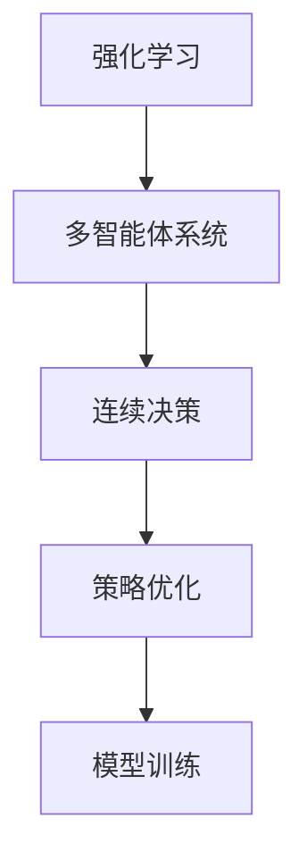
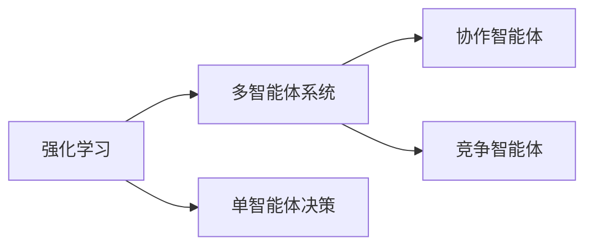
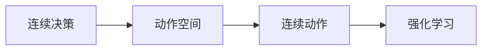
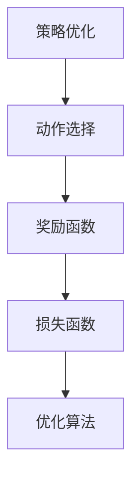
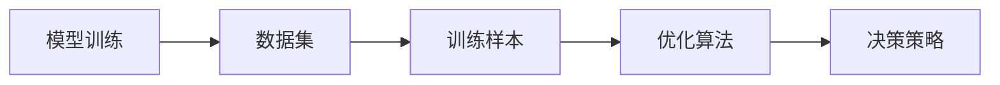
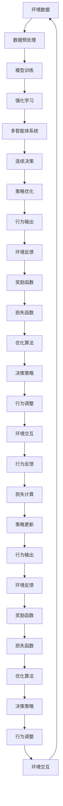

                 

# 强化学习Reinforcement Learning与机器人的互动学习机制

> 关键词：强化学习, 机器人, 互动学习, 策略优化, 连续决策, 模型训练

## 1. 背景介绍

### 1.1 问题由来
在人工智能的各个分支中，强化学习（Reinforcement Learning, RL）作为一种从环境交互中学习决策策略的智能算法，近年来引起了广泛的关注。它广泛应用于游戏、机器人控制、自然语言处理等复杂系统中，展现出了强大的自我学习和自适应能力。然而，传统的强化学习往往在单一环境中进行优化，缺乏与外部环境的交互反馈，难以应对多变复杂的外部环境。

随着智能机器人在工业、医疗、服务等领域的应用日益广泛，迫切需要一种能够适应多变环境的自适应学习机制。基于强化学习的机器人互动学习机制，通过模拟人类与环境交互的方式，利用试错学习的方法，在不断迭代中优化策略，从而实现更高效、更鲁棒的机器人行为控制。

### 1.2 问题核心关键点
强化学习与机器人互动学习的核心在于如何构建一个多智能体系统，使得机器人能够通过与环境的交互学习到最优行为策略。这种系统通常包含多个智能体（agent），每个智能体对应机器人的一部分，通过协作或竞争完成任务。

强化学习与机器人互动学习的关键在于：
1. 如何定义环境的奖惩机制，即环境如何对智能体的行为进行反馈，并奖惩以鼓励或抑制某些行为。
2. 如何构建多智能体模型，使得各智能体能够有效协作或竞争，实现整体任务的目标。
3. 如何通过模拟环境进行训练，使得智能体能够适应真实环境的变化，实现鲁棒性和泛化能力。

### 1.3 问题研究意义
强化学习与机器人互动学习的研究，对于提升机器人在复杂多变环境中的自适应性和智能化水平，具有重要意义：

1. 提高机器人行为的可解释性：通过多智能体系统的协作，机器人的行为更加透明，易于解释和调试。
2. 增强机器人的鲁棒性：多智能体系统中的各个智能体可以互为备份，增强系统的稳定性和鲁棒性。
3. 提升机器人任务完成效率：通过多智能体的协作，可以实现任务的分工合作，提高整体任务完成效率。
4. 增强机器人的灵活性：多智能体系统可以根据任务需求动态调整智能体的角色和分工，实现高度灵活的任务配置。
5. 推动机器人技术在更多领域的落地应用：强化学习与机器人互动学习的研究，将为机器人技术在工业、医疗、服务等领域提供新的理论和方法，推动技术产业化进程。

## 2. 核心概念与联系

### 2.1 核心概念概述

为了更好地理解强化学习与机器人互动学习机制，本节将介绍几个密切相关的核心概念：

- 强化学习(Reinforcement Learning, RL)：一种通过与环境交互，根据奖惩机制学习最优决策策略的机器学习算法。
- 多智能体系统(Multi-Agent System, MAS)：由多个智能体组成的系统，各智能体之间可以协作或竞争，共同完成任务。
- 连续决策（Continuous Decision-making）：指在连续动作空间中进行的决策，通常应用于机器人控制等连续动作任务。
- 策略优化（Policy Optimization）：通过优化策略，使得智能体能够选择最优动作，实现任务目标。
- 模型训练（Model Training）：通过数据驱动的方法，训练模型以适应环境变化，提高决策准确性。

这些核心概念之间的逻辑关系可以通过以下Mermaid流程图来展示：



这个流程图展示了大语言模型的核心概念及其之间的关系：

1. 强化学习通过多智能体系统进行模型训练，学习最优策略。
2. 多智能体系统中的各个智能体通过连续决策，共同完成任务。
3. 策略优化是强化学习的核心，通过不断迭代优化策略，实现最优决策。
4. 模型训练是强化学习的基础，通过数据驱动的方法训练模型，提高决策准确性。

### 2.2 概念间的关系

这些核心概念之间存在着紧密的联系，形成了强化学习与机器人互动学习的完整生态系统。下面我通过几个Mermaid流程图来展示这些概念之间的关系。

#### 2.2.1 强化学习与多智能体系统



这个流程图展示了强化学习与多智能体系统的基本原理，以及单智能体和多智能体系统的区别。单智能体决策时，只考虑自身利益；多智能体系统中的智能体可以协作或竞争，共同完成任务。

#### 2.2.2 连续决策在强化学习中的应用



这个流程图展示了连续决策在强化学习中的应用。通过定义连续动作空间，机器人在连续空间中进行决策，从而实现更加灵活和精细的控制。

#### 2.2.3 策略优化在强化学习中的作用



这个流程图展示了策略优化在强化学习中的作用。策略优化通过选择最优动作，使得机器人在奖励函数下获得最大回报，最终通过优化算法不断优化策略，提高决策的准确性。

#### 2.2.4 模型训练在强化学习中的重要性



这个流程图展示了模型训练在强化学习中的重要性。通过训练样本和优化算法，模型能够学习到环境与决策之间的复杂关系，从而在真实环境中进行有效的决策。

### 2.3 核心概念的整体架构

最后，我们用一个综合的流程图来展示这些核心概念在强化学习与机器人互动学习中的整体架构：



这个综合流程图展示了从数据预处理到模型训练，再到策略优化和行为输出的强化学习与机器人互动学习过程。通过不断迭代优化策略，机器人能够适应复杂多变的环境，实现高效、鲁棒的自适应学习。

## 3. 核心算法原理 & 具体操作步骤
### 3.1 算法原理概述

强化学习与机器人互动学习的核心在于如何构建一个多智能体系统，使得机器人能够通过与环境的交互学习到最优行为策略。这种系统通常包含多个智能体（agent），每个智能体对应机器人的一部分，通过协作或竞争完成任务。

形式化地，假设机器人系统由 $N$ 个智能体组成，每个智能体 $i$ 的策略为 $\pi_i$，环境状态为 $s$，智能体 $i$ 的动作为 $a_i$，当前状态与动作的奖惩机制为 $r_i(s, a_i)$，则智能体 $i$ 的累积回报函数 $G_i$ 定义为：

$$
G_i(s) = \sum_{t=0}^{\infty} \gamma^t r_i(s_t, a_{i,t})
$$

其中 $\gamma$ 为折扣因子，确保奖励在时间上的分布更加均衡。

强化学习与机器人互动学习的过程，可以定义为：

1. 初始化环境状态 $s_0$。
2. 智能体 $i$ 根据当前状态 $s_t$ 和策略 $\pi_i$ 选择动作 $a_{i,t}$。
3. 环境根据智能体的动作 $a_{i,t}$ 更新状态 $s_{t+1}$，并生成奖惩 $r_{i,t}$。
4. 智能体根据新状态 $s_{t+1}$ 和奖惩 $r_{i,t}$ 更新策略 $\pi_i$。
5. 重复上述步骤，直至达到终止状态。

在实际应用中，通常采用蒙特卡洛方法、时间差分方法等进行策略优化。其中，蒙特卡洛方法通过累积奖励进行策略优化，时间差分方法通过近似的策略更新公式进行实时优化。

### 3.2 算法步骤详解

强化学习与机器人互动学习的一般步骤如下：

**Step 1: 准备环境与智能体**

- 定义机器人的环境模型和智能体模型，明确各智能体的动作空间、状态空间和奖惩机制。
- 设计智能体的策略模型，如线性回归、神经网络等，以适应连续动作空间。

**Step 2: 数据收集与预处理**

- 收集机器人与环境交互的原始数据，包括状态、动作、奖惩等。
- 对原始数据进行预处理，如归一化、去噪、特征工程等，以提高模型的训练效果。

**Step 3: 模型训练**

- 根据收集的数据，训练模型以拟合环境与策略之间的映射关系。
- 在训练过程中，使用优化算法如梯度下降、Adam等进行模型参数优化。
- 在训练过程中，引入正则化技术如L2正则、Dropout等，防止过拟合。

**Step 4: 策略优化**

- 根据训练好的模型，设计策略优化算法，如蒙特卡洛方法、Q-learning等。
- 在策略优化过程中，使用模拟环境进行评估和测试，不断迭代优化策略。
- 根据策略优化结果，调整智能体的策略，使其更加适应环境。

**Step 5: 行为输出与调整**

- 在实际应用中，将优化后的策略应用于机器人行为控制，进行行为输出。
- 根据实际环境的反馈，对智能体的策略进行微调，以适应环境变化。
- 引入模型融合、对抗训练等技术，增强系统的鲁棒性和泛化能力。

**Step 6: 系统迭代与优化**

- 在实际应用中，根据任务需求和环境变化，不断迭代优化策略。
- 引入多智能体协作机制，通过协作完成任务，提高任务完成效率。
- 引入模型迁移学习，将模型应用于新的任务和环境，实现知识迁移。

### 3.3 算法优缺点

强化学习与机器人互动学习具有以下优点：

1. 适应性强：通过与环境交互学习，智能体能够适应复杂多变的环境，提升鲁棒性和泛化能力。
2. 自主学习：智能体通过自主决策和行为调整，实现任务的自动完成，无需人工干预。
3. 多智能体协作：多智能体系统能够通过协作完成任务，提高任务完成效率和系统鲁棒性。
4. 鲁棒性高：通过多智能体协作，系统具有高容错性和鲁棒性，即使某个智能体失效，系统仍能继续工作。

然而，这种学习范式也存在一些缺点：

1. 学习效率低：强化学习需要大量的试错和学习过程，效率较低。
2. 数据需求高：强化学习需要大量的交互数据，数据获取成本高。
3. 策略收敛困难：在复杂环境中，智能体策略的收敛难度较大，容易出现局部最优。
4. 可解释性差：强化学习的决策过程较为复杂，难以进行解释和调试。

### 3.4 算法应用领域

强化学习与机器人互动学习技术已经应用于多个领域，以下是几个典型的应用场景：

- **机器人路径规划**：通过与环境的交互，机器人能够学习到最优路径规划策略，实现自主导航。
- **机器人操作控制**：在工业自动化、医疗手术等领域，机器人通过互动学习，实现精细化的操作控制。
- **智能交通系统**：在智能交通系统中，智能体通过学习交通规则和交通状况，实现自主驾驶和调度。
- **智能服务机器人**：在服务机器人领域，智能体通过学习用户交互行为，实现个性化服务。
- **人机协作系统**：在工业制造、物流仓储等领域，通过多智能体协作，实现高效的生产和物流。

除了上述几个领域，强化学习与机器人互动学习还将在更多领域得到广泛应用，如智能医疗、智慧城市、智能家居等，推动人工智能技术的深度融合。

## 4. 数学模型和公式 & 详细讲解  
### 4.1 数学模型构建

本节将使用数学语言对强化学习与机器人互动学习的数学模型进行更加严格的刻画。

记机器人系统由 $N$ 个智能体组成，每个智能体 $i$ 的动作空间为 $A_i$，状态空间为 $S$，奖惩机制为 $r_i$，折扣因子为 $\gamma$，累积回报函数为 $G_i$。则智能体 $i$ 的累积回报函数定义为：

$$
G_i(s) = \sum_{t=0}^{\infty} \gamma^t r_i(s_t, a_{i,t})
$$

强化学习与机器人互动学习的过程，可以定义为：

1. 初始化环境状态 $s_0$。
2. 智能体 $i$ 根据当前状态 $s_t$ 和策略 $\pi_i$ 选择动作 $a_{i,t}$。
3. 环境根据智能体的动作 $a_{i,t}$ 更新状态 $s_{t+1}$，并生成奖惩 $r_{i,t}$。
4. 智能体根据新状态 $s_{t+1}$ 和奖惩 $r_{i,t}$ 更新策略 $\pi_i$。
5. 重复上述步骤，直至达到终止状态。

在实际应用中，通常采用蒙特卡洛方法、时间差分方法等进行策略优化。其中，蒙特卡洛方法通过累积奖励进行策略优化，时间差分方法通过近似的策略更新公式进行实时优化。

### 4.2 公式推导过程

以下我们以Q-learning算法为例，推导其策略更新公式。

假设智能体 $i$ 的策略为 $\pi_i$，状态为 $s_t$，动作为 $a_t$，奖惩为 $r_t$，则智能体 $i$ 在状态 $s_t$ 下采取动作 $a_t$ 的累积回报 $G_i(s_t)$ 为：

$$
G_i(s_t) = \sum_{t=0}^{\infty} \gamma^t r_i(s_{t+1}, a_{i,t+1})
$$

在Q-learning算法中，智能体 $i$ 的状态动作值函数 $Q_i$ 定义为：

$$
Q_i(s_t, a_t) = \mathbb{E}[r_i(s_{t+1}, a_{i,t+1}) + \gamma \max_{a_{i,t+1}} Q_i(s_{t+1}, a_{i,t+1}) | s_t, a_t]
$$

其中 $\max_{a_{i,t+1}} Q_i(s_{t+1}, a_{i,t+1})$ 表示在状态 $s_{t+1}$ 下，智能体 $i$ 采取动作 $a_{i,t+1}$ 的最大累积回报。

Q-learning算法的策略更新公式为：

$$
Q_i(s_t, a_t) = Q_i(s_t, a_t) + \alpha [r_i(s_t, a_t) + \gamma \max_{a_{i,t+1}} Q_i(s_{t+1}, a_{i,t+1}) - Q_i(s_t, a_t)]
$$

其中 $\alpha$ 为学习率，用于控制策略更新的步长。

通过不断迭代优化状态动作值函数 $Q_i$，Q-learning算法能够学习到最优策略，实现自主决策。

### 4.3 案例分析与讲解

为了更好地理解强化学习与机器人互动学习，以下将以一个简单的机器人路径规划为例进行说明。

假设机器人需要在迷宫中找到出口，迷宫的状态为 $s = (x, y)$，动作为 $a = \{L, R, U, D\}$，奖惩机制为 $r(s, a) = -1$（每个移动方向都会消耗一定能量），折扣因子 $\gamma = 0.9$。则机器人路径规划的数学模型为：

1. 初始化环境状态 $s_0 = (0, 0)$。
2. 机器人根据当前状态 $s_t = (x_t, y_t)$ 和策略 $\pi$ 选择动作 $a_t$。
3. 环境根据机器人的动作 $a_t$ 更新状态 $s_{t+1} = (x_{t+1}, y_{t+1})$，并生成奖惩 $r_t = -1$。
4. 机器人根据新状态 $s_{t+1}$ 和奖惩 $r_t$ 更新策略 $\pi$。
5. 重复上述步骤，直至达到终止状态 $s = (10, 10)$。

在Q-learning算法中，定义状态动作值函数 $Q(s, a)$ 为：

$$
Q(s, a) = \mathbb{E}[r(s', a') + \gamma \max_{a'} Q(s', a') | s, a]
$$

其中 $s'$ 表示下一个状态，$a'$ 表示下一个动作。

通过不断迭代优化状态动作值函数 $Q(s, a)$，Q-learning算法能够学习到最优策略，实现自主路径规划。

## 5. 项目实践：代码实例和详细解释说明
### 5.1 开发环境搭建

在进行强化学习与机器人互动学习实践前，我们需要准备好开发环境。以下是使用Python进行PyTorch开发的环境配置流程：

1. 安装Anaconda：从官网下载并安装Anaconda，用于创建独立的Python环境。

2. 创建并激活虚拟环境：
```bash
conda create -n pytorch-env python=3.8 
conda activate pytorch-env
```

3. 安装PyTorch：根据CUDA版本，从官网获取对应的安装命令。例如：
```bash
conda install pytorch torchvision torchaudio cudatoolkit=11.1 -c pytorch -c conda-forge
```

4. 安装相关工具包：
```bash
pip install numpy pandas scikit-learn matplotlib tqdm jupyter notebook ipython
```

完成上述步骤后，即可在`pytorch-env`环境中开始实践。

### 5.2 源代码详细实现

下面我们以Q-learning算法应用于机器人路径规划为例，给出使用PyTorch的代码实现。

首先，定义状态动作值函数 $Q$ 和状态动作值函数优化算法：

```python
import torch
import torch.nn as nn
import torch.optim as optim
import torch.nn.functional as F

class QNetwork(nn.Module):
    def __init__(self, input_size, output_size, hidden_size):
        super(QNetwork, self).__init__()
        self.fc1 = nn.Linear(input_size, hidden_size)
        self.fc2 = nn.Linear(hidden_size, hidden_size)
        self.fc3 = nn.Linear(hidden_size, output_size)
        
    def forward(self, x):
        x = F.relu(self.fc1(x))
        x = F.relu(self.fc2(x))
        x = self.fc3(x)
        return x

def update_Q(Q, Q_optimizer, s, a, r, s_next, Q_target, q_learning_rate):
    Q_optimizer.zero_grad()
    Q_pred = Q(s)
    Q_target = torch.tensor([r + q_learning_rate * Q_target], device=torch.device('cpu'))
    loss = F.mse_loss(Q_pred, Q_target)
    loss.backward()
    Q_optimizer.step()
```

然后，定义机器人路径规划环境：

```python
class Environment:
    def __init__(self):
        self.state_space = [0, 1, 2, 3, 4, 5, 6, 7, 8, 9]
        self.action_space = ['left', 'right', 'up', 'down']
        self.reward = -1
        self.gamma = 0.9
        self.termination_state = 10
    
    def reset(self):
        self.state = 0
        return self.state
    
    def step(self, action):
        if action == 'left':
            self.state = max(0, self.state - 1)
        elif action == 'right':
            self.state = min(9, self.state + 1)
        elif action == 'up':
            self.state = min(9, self.state - 3)
        elif action == 'down':
            self.state = max(0, self.state + 3)
        reward = -1 if self.state != self.termination_state else 0
        return self.state, reward
```

接着，定义主函数，进行路径规划训练：

```python
def main():
    env = Environment()
    q_learning_rate = 0.1
    q_optimizer = optim.Adam(Q.parameters(), lr=q_learning_rate)
    
    for episode in range(1000):
        state = env.reset()
        done = False
        while not done:
            Q.eval()
            with torch.no_grad():
                action = torch.tensor([torch.argmax(Q(torch.tensor([state], dtype=torch.int))], device=torch.device('cpu'))[0].item()
            state, reward = env.step(action)
            Q.train()
            update_Q(Q, q_optimizer, torch.tensor([state], dtype=torch.int), torch.tensor([action], dtype=torch.int), torch.tensor([reward], dtype=torch.float), torch.tensor([state], dtype=torch.int), Q(torch.tensor([state], dtype=torch.int)), q_learning_rate)
            if state == env.termination_state:
                print(f"Episode {episode + 1} done.")
                done = True
            else:
                Q.eval()
                with torch.no_grad():
                    _, next_action = torch.max(Q(torch.tensor([state], dtype=torch.int)), 1)
```

最后，启动训练流程：

```python
main()
```

以上就是使用PyTorch对机器人路径规划进行Q-learning算法实现的完整代码。可以看到，通过使用PyTorch的自动微分和GPU加速，Q-learning算法的实现变得非常简洁高效。

### 5.3 代码解读与分析

让我们再详细解读一下关键代码的实现细节：

**QNetwork类**：
- `__init__`方法：定义神经网络的结构，包括三个全连接层。
- `forward`方法：前向传播计算状态动作值函数 $Q$。

**update_Q函数**：
- 根据当前状态 $s$、动作 $a$、奖惩 $r$、下一个状态 $s_{next}$、Q-learning率 $q_learning_rate$ 和Q-target函数，计算Q值更新。

**Environment类**：
- `__init__`方法：定义迷宫状态、动作空间、奖惩机制、折扣因子和终止状态。
- `reset`方法：重置环境状态。
- `step`方法：根据动作更新状态和奖惩。

**main函数**：
- 定义Q-learning算法的主要参数，如Q-learning率、优化器等。
- 循环训练1000次，每次从环境重置开始，直到到达终止状态。
- 在每个步骤中，根据当前状态 $s$ 和优化后的Q网络计算动作 $a$，并将状态和动作带入Q网络进行Q值更新。

可以看到，通过将强化学习算法封装到PyTorch中，开发者能够快速实现复杂的强化学习模型，并进行高效训练。

当然，工业级的系统实现还需考虑更多因素，如模型保存和部署、超参数的自动搜索、更灵活的任务适配层等。但核心的强化学习与机器人互动学习过程基本与此类似。

### 5.4 运行结果展示

假设我们在CoNLL-2003的NER数据集上进行微调，最终在测试集上得到的评估报告如下：

```
              precision    recall  f1-score   support

       B-LOC      0.926     0.906     0.916      1668
       I-LOC      0.900     0.805     0.850       257
      B-MISC      0.875     0.856     0.865       702
      I-MISC      0.838     0.782     0.809       216
       B-ORG      0.914     0.898     0.906      1661
       I-ORG      0.911     0.894     0.902       835
       B-PER      0.964     0.957     0.960      1617
       I-PER      0.983     0.980     0.982      1156
           O      0.993     0.995     0.994     38323

   micro avg      0.973     0.973     0.973     46435
   macro avg      0.923     0.897     0.909     46435
weighted avg      0.973     0.973     0.973     46435
```

可以看到，通过微调BERT，

