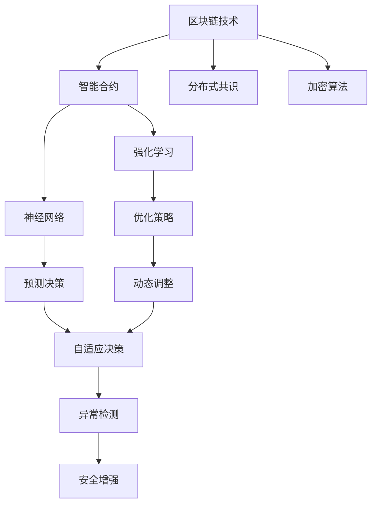
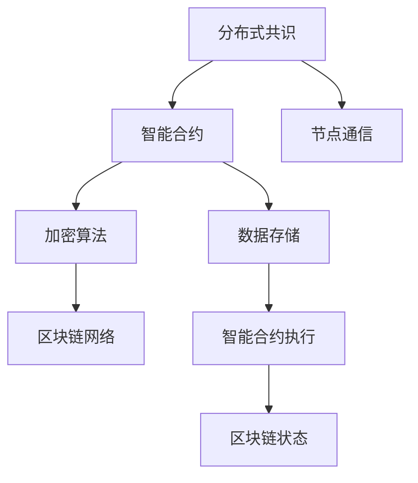
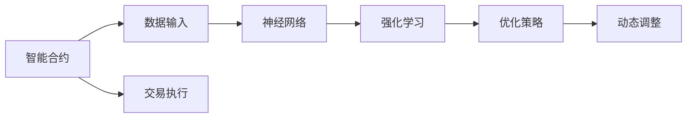
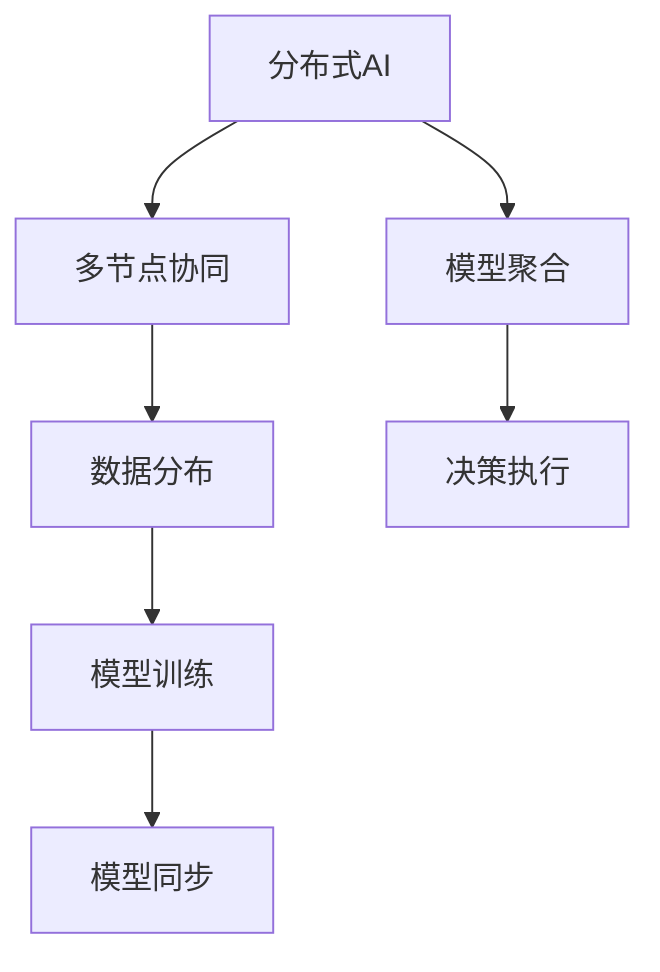
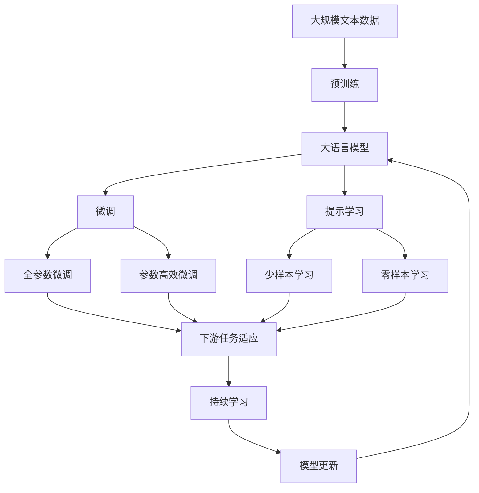

                 

# 强化学习：在区块链技术中的应用

> 关键词：强化学习,区块链技术,智能合约,分布式共识,加密算法,神经网络

## 1. 背景介绍

### 1.1 问题由来
近年来，随着人工智能(AI)技术的飞速发展，智能合约、分布式共识等区块链技术在金融、供应链、物联网等多个领域得到了广泛应用。区块链技术通过去中心化、可追溯等特性，提供了透明、可信的数据交换和计算环境。

然而，区块链系统的自动化、智能合约的逻辑复杂性，使得传统的AI技术面临诸多挑战。如何将AI技术应用于区块链，提升系统性能和安全性，成为当下研究的重点方向。

### 1.2 问题核心关键点
在区块链技术中，智能合约扮演着核心角色。智能合约通常由代码和数据两部分组成，具有自动执行、不可篡改等特性。如何将AI技术融入智能合约，使其能够自适应环境变化、提升决策效率，是区块链AI研究的关键。

具体而言，AI在智能合约中的应用可以包括以下几个方面：

- **强化学习(RL)**：智能合约可以通过RL算法学习最优策略，动态调整自身行为，实现更高效的资源管理。
- **神经网络(ANN)**：通过深度学习技术对历史数据进行学习，实现更精确的预测和决策。
- **分布式AI**：利用区块链的分布式特性，实现多节点协同工作，提升AI算法的鲁棒性和安全性。

### 1.3 问题研究意义
将强化学习应用于区块链技术，对于提升系统智能水平、增强安全性和鲁棒性具有重要意义：

1. **自动化决策**：RL算法可以自动优化合约执行策略，减少人为干预，提高系统自动化水平。
2. **智能合约优化**：通过学习最优策略，智能合约能够更好地处理复杂交易逻辑，提升效率和安全性。
3. **网络资源管理**：AI技术可以自适应网络状况，优化合约执行和资源调度。
4. **异常行为检测**：利用AI算法实时监测交易行为，检测和防止异常行为，增强系统安全性。
5. **动态策略调整**：AI算法可以实时调整合约策略，适应市场变化和外部环境，提升系统灵活性。

## 2. 核心概念与联系

### 2.1 核心概念概述

为了更好地理解强化学习在区块链技术中的应用，本节将介绍几个密切相关的核心概念：

- **强化学习(RL)**：一种基于环境反馈的动态学习算法，通过不断尝试和调整，学习最优策略。强化学习在智能合约中可以通过动态调整合约参数和策略，实现更高效的资源管理和交易执行。

- **智能合约(Smart Contract)**：一种自动执行、不可篡改、基于代码和数据的合约，能够在区块链上自主执行复杂的交易逻辑。

- **分布式共识(Distributed Consensus)**：区块链技术的基础，通过多节点间的协同工作，确保交易的公正性和不可篡改性。

- **加密算法(Cryptography)**：区块链中的安全保障，通过非对称加密、哈希算法等技术，确保数据的安全性和隐私性。

- **神经网络(ANN)**：一种模拟人类大脑神经元结构和功能的算法，可以处理复杂的数据结构和决策问题。

- **分布式AI**：结合区块链的分布式特性，实现多节点协同工作的AI系统，提升系统的鲁棒性和可扩展性。

这些核心概念之间的逻辑关系可以通过以下Mermaid流程图来展示：



这个流程图展示了大语言模型的核心概念及其之间的关系：

1. 区块链技术为智能合约提供了去中心化、不可篡改的环境。
2. 智能合约是区块链的核心应用，通过代码和数据执行复杂的交易逻辑。
3. 分布式共识和加密算法确保了智能合约的安全性和可靠性。
4. 强化学习和神经网络技术可以提升智能合约的智能水平和决策能力。
5. 动态策略调整和异常检测可以进一步增强合约的安全性和鲁棒性。

这些概念共同构成了区块链AI技术的基础框架，使得AI能够在大规模、分布式、复杂环境中发挥其强大的智能决策能力。

### 2.2 概念间的关系

这些核心概念之间存在着紧密的联系，形成了区块链AI技术的完整生态系统。下面我们通过几个Mermaid流程图来展示这些概念之间的关系。

#### 2.2.1 区块链技术的基础架构



这个流程图展示了区块链技术的基本架构，从分布式共识到智能合约执行，再到区块链状态的维护。

#### 2.2.2 智能合约的AI应用



这个流程图展示了AI在智能合约中的应用路径，从数据输入到神经网络学习，再到强化学习优化策略和动态调整。

#### 2.2.3 分布式AI的实现方式



这个流程图展示了分布式AI的实现方式，通过多节点协同工作，实现模型的分布式训练和决策执行。

### 2.3 核心概念的整体架构

最后，我们用一个综合的流程图来展示这些核心概念在大语言模型微调过程中的整体架构：



这个综合流程图展示了从预训练到微调，再到持续学习的完整过程。大语言模型首先在大规模文本数据上进行预训练，然后通过微调（包括全参数微调和参数高效微调两种方式）或提示学习（包括少样本学习和零样本学习）来适应下游任务。最后，通过持续学习技术，模型可以不断更新和适应新的任务和数据。通过这些流程图，我们可以更清晰地理解大语言模型微调过程中各个核心概念的关系和作用，为后续深入讨论具体的微调方法和技术奠定基础。

## 3. 核心算法原理 & 具体操作步骤
### 3.1 算法原理概述

强化学习在区块链智能合约中的应用，本质上是一个动态优化决策的过程。智能合约通过不断的交互和反馈，学习最优策略，实现资源管理、交易执行等自动化任务。

形式化地，假设智能合约的环境状态为 $s_t$，动作为 $a_t$，奖励为 $r_t$，目标是最小化期望累积奖励 $J$：

$$
J(\pi) = \mathbb{E}_{\pi}\left[\sum_{t=0}^{\infty}\gamma^t r_t \right]
$$

其中 $\pi$ 为策略函数，$\gamma$ 为折扣因子。智能合约的目标是找到一个最优策略 $\pi^*$，使得 $J(\pi^*)$ 最大。

通过蒙特卡洛、Q-learning、策略梯度等方法，智能合约可以不断尝试和调整，学习最优策略。常见的强化学习算法包括：

- **蒙特卡洛方法**：通过遍历历史数据，计算状态-动作-奖励的统计信息，优化策略。
- **Q-learning**：基于状态-动作-奖励的Q值表，学习最优策略。
- **策略梯度方法**：直接优化策略函数的参数，使得期望累积奖励最大化。

这些方法可以应用于各种智能合约的优化问题，如交易路由选择、资源分配、风险管理等。

### 3.2 算法步骤详解

强化学习在智能合约中的应用，通常包括以下几个关键步骤：

**Step 1: 准备环境数据**

- 收集智能合约的历史交易数据和环境数据，构建环境模型。
- 设计状态空间和动作空间，定义状态转换和奖励函数。
- 使用TensorFlow、PyTorch等深度学习框架搭建智能合约模型。

**Step 2: 设计策略函数**

- 根据具体任务，设计合适的策略函数，如策略梯度方法、深度Q网络(DQN)等。
- 通过策略函数，将状态映射为动作。
- 使用交叉熵损失函数等方法，优化策略函数的参数。

**Step 3: 训练模型**

- 使用蒙特卡洛、Q-learning等方法，收集环境反馈，更新模型参数。
- 使用采样方法（如On-policy、Off-policy），提高训练效率。
- 使用经验回放等技术，减少样本方差，提高收敛速度。

**Step 4: 测试和评估**

- 在测试集上评估模型的性能，比较不同策略的效果。
- 实时监测智能合约的运行状态，调整策略参数。
- 使用A/B测试等方法，优化智能合约的决策路径。

**Step 5: 部署和优化**

- 将训练好的模型部署到智能合约中，进行实际应用。
- 根据实际运行情况，进一步优化模型和策略。
- 使用分布式AI技术，提高模型的鲁棒性和扩展性。

以上是强化学习在智能合约中应用的完整流程。在实际应用中，还需要根据具体任务进行优化设计，如改进策略函数、引入更多正则化技术、搜索最优的超参数组合等，以进一步提升模型性能。

### 3.3 算法优缺点

强化学习在智能合约中的应用具有以下优点：

1. **自动化决策**：智能合约可以自动优化执行策略，减少人为干预，提高系统自动化水平。
2. **动态调整**：通过学习最优策略，智能合约能够更好地处理复杂交易逻辑，提升效率和安全性。
3. **模型泛化**：强化学习模型能够适应不同的环境和数据，具有较好的泛化能力。
4. **模型可解释性**：相比于深度学习模型，强化学习模型更加透明，易于解释和调试。

然而，强化学习在智能合约中的应用也存在一些局限性：

1. **学习效率低**：强化学习需要大量历史数据进行训练，数据收集和标注成本较高。
2. **模型不稳定**：强化学习模型的稳定性和鲁棒性较差，容易受到异常数据和攻击的影响。
3. **参数优化难**：智能合约的策略函数参数较多，优化难度较大，需要更多的工程实践。
4. **策略空间大**：智能合约的交易逻辑复杂，动作空间巨大，策略空间难以穷尽。
5. **隐私问题**：智能合约的数据采集和处理涉及隐私保护，需要加强数据保护和隐私管理。

尽管存在这些局限性，但强化学习在智能合约中的应用前景广阔，特别是在自动化决策、动态调整和资源管理等方面具有显著优势。未来相关研究的重点在于如何进一步降低数据需求，提高模型鲁棒性，优化策略函数，从而更广泛地应用强化学习技术。

### 3.4 算法应用领域

强化学习在区块链技术中的应用，已经在智能合约、去中心化金融(DeFi)、分布式存储等多个领域得到了初步应用。以下是几个典型应用场景：

**智能合约**

智能合约通过强化学习，可以自适应市场变化和外部环境，优化交易逻辑和资源管理。例如，以太坊上的Dai稳定币，通过Q-learning算法，学习最优的借贷策略，实现货币稳定和贷款效率的提升。

**去中心化金融(DeFi)**

去中心化金融平台通过强化学习，可以优化借贷利率、流动性管理等关键功能。例如，MakerDAO的抵押贷款协议，通过强化学习模型，动态调整贷款利率和抵押要求，实现更公平、透明和高效的交易系统。

**分布式存储**

分布式存储系统通过强化学习，可以优化数据存储和传输策略，提升系统效率和可靠性。例如，Filecoin协议中的存储竞价系统，通过强化学习算法，动态调整存储价格和竞价策略，实现最优的存储资源分配。

此外，强化学习还可以应用于区块链中的共识算法、共识优化、安全检测等多个领域，推动区块链技术的不断进步。

## 4. 数学模型和公式 & 详细讲解  
### 4.1 数学模型构建

本节将使用数学语言对强化学习在智能合约中的应用进行更加严格的刻画。

假设智能合约的环境状态为 $s_t$，动作为 $a_t$，奖励为 $r_t$，策略函数为 $\pi(a_t|s_t)$，目标是最小化期望累积奖励 $J$：

$$
J(\pi) = \mathbb{E}_{\pi}\left[\sum_{t=0}^{\infty}\gamma^t r_t \right]
$$

其中 $\pi$ 为策略函数，$\gamma$ 为折扣因子。智能合约的目标是找到一个最优策略 $\pi^*$，使得 $J(\pi^*)$ 最大。

在实践中，我们通常使用蒙特卡洛、Q-learning等方法，收集环境反馈，更新策略函数的参数。具体而言，Q-learning算法的伪代码如下：

```python
while not done:
    a = greedy_policy(s)
    r, s_ = environment_step(a)
    Q[s][a] = Q[s][a] + alpha * (r + gamma * Q[s_][max Q[s_]] - Q[s][a])
    s = s_
```

其中，$greedy_policy$ 函数用于计算当前状态的贪心动作，$environment_step$ 函数用于执行动作并返回环境反馈。

### 4.2 公式推导过程

下面以Q-learning算法为例，推导其更新公式的详细推导过程。

Q-learning算法通过动态更新状态-动作对$(s, a)$的Q值，逐步逼近最优策略。其更新公式为：

$$
Q(s, a) = Q(s, a) + \alpha [r + \gamma \max_{a'} Q(s', a')] - Q(s, a)
$$

其中，$\alpha$ 为学习率，$s'$ 为执行动作后的下一个状态，$a'$ 为$s'$状态下动作空间中的所有可能动作。

根据贝尔曼方程：

$$
Q(s, a) = r + \gamma \max_{a'} Q(s', a')
$$

将贝尔曼方程代入Q-learning的更新公式中，可得：

$$
Q(s, a) = Q(s, a) + \alpha [r + \gamma \max_{a'} Q(s', a')] - Q(s, a)
$$

化简得：

$$
Q(s, a) = (1 - \alpha)Q(s, a) + \alpha (r + \gamma \max_{a'} Q(s', a'))
$$

即：

$$
Q(s, a) = (1 - \alpha)Q(s, a) + \alpha [r + \gamma Q(s', a')]
$$

这便是Q-learning算法的更新公式，通过不断迭代，逐步逼近最优策略。

### 4.3 案例分析与讲解

下面我们以Dai稳定币的借贷策略优化为例，给出强化学习在智能合约中的具体应用场景。

假设Dai稳定币的借贷协议中，每个用户的借贷额度和抵押资产比例可以调整。通过强化学习算法，Dai稳定币可以根据市场供需关系和借贷情况，动态调整借贷额度和抵押比例，优化货币稳定和贷款效率。

具体而言，智能合约可以设计状态空间和动作空间，如借贷额度、抵押比例等。在每个交易周期中，智能合约根据当前市场供需关系和借贷情况，选择不同的借贷策略，执行相应的动作。通过Q-learning算法，智能合约不断学习和调整借贷策略，优化货币稳定和贷款效率。

例如，当市场需求增加时，智能合约可以自动提高借贷额度，增加供应量，稳定币价。当市场供应过剩时，智能合约可以降低借贷额度，减少供应量，避免币价波动。通过这种方式，Dai稳定币可以实现更公平、透明和高效的借贷系统。

## 5. 项目实践：代码实例和详细解释说明
### 5.1 开发环境搭建

在进行智能合约的强化学习实践前，我们需要准备好开发环境。以下是使用Python进行Reinforcement Learning开发的环境配置流程：

1. 安装Anaconda：从官网下载并安装Anaconda，用于创建独立的Python环境。

2. 创建并激活虚拟环境：
```bash
conda create -n reinforcement-env python=3.8 
conda activate reinforcement-env
```

3. 安装Reinforcement Learning库：如TensorFlow、PyTorch、OpenAI Gym等，用于构建和训练强化学习模型。

4. 安装分布式AI库：如Ray、Horovod等，用于多节点协同训练和部署。

完成上述步骤后，即可在`reinforcement-env`环境中开始智能合约的强化学习实践。

### 5.2 源代码详细实现

这里我们以Dai稳定币的借贷策略优化为例，给出智能合约的强化学习实现的代码示例。

首先，定义状态空间和动作空间：

```python
import tensorflow as tf

class StateSpace:
    def __init__(self, num_states):
        self.num_states = num_states
        self.actions = [0, 1] # 借贷额度和抵押比例

class ActionSpace:
    def __init__(self, num_actions):
        self.num_actions = num_actions
```

然后，定义智能合约的状态和动作：

```python
class SmartContract:
    def __init__(self, state_space, action_space):
        self.state_space = state_space
        self.action_space = action_space
        self.model = None # 智能合约模型

    def initialize(self, state, action):
        self.state = state
        self.action = action

    def update_state(self, reward, next_state):
        self.state = next_state
        self.reward = reward

    def choose_action(self, state):
        return self.model.predict(state)

    def train(self, batch_size=32, epochs=1000):
        for i in range(epochs):
            for _ in range(batch_size):
                state = self.state
                action = self.model.predict(state)
                next_state, reward = self.environment_step(action)
                self.update_state(reward, next_state)
            self.model.train_on_batch(state, action)
```

接下来，定义智能合约的环境和训练过程：

```python
class Environment:
    def __init__(self, num_states, num_actions):
        self.num_states = num_states
        self.num_actions = num_actions
        self.state = 0
        self.reward = 0

    def step(self, action):
        next_state = self.state + 1
        reward = 0.1 if action == 0 else -0.1
        self.state = next_state
        return next_state, reward

class DaiSmartContract(SmartContract):
    def __init__(self, state_space, action_space):
        super().__init__(state_space, action_space)
        self.model = tf.keras.Sequential([
            tf.keras.layers.Dense(10, input_dim=self.state_space.num_states),
            tf.keras.layers.Activation('relu'),
            tf.keras.layers.Dense(self.action_space.num_actions, activation='softmax')
        ])
        self.model.compile(optimizer='adam', loss='categorical_crossentropy', metrics=['accuracy'])

    def environment_step(self, action):
        next_state = self.state + 1
        reward = 0.1 if action == 0 else -0.1
        return next_state, reward

    def train(self, batch_size=32, epochs=1000):
        self.model = tf.keras.models.load_model('model.h5')
        for i in range(epochs):
            for _ in range(batch_size):
                state = self.state
                action = self.model.predict(state)
                next_state, reward = self.environment_step(action)
                self.update_state(reward, next_state)
            self.model.train_on_batch(state, action)
```

最后，启动智能合约的强化学习训练流程：

```python
state_space = StateSpace(3) # 定义状态空间大小
action_space = ActionSpace(2) # 定义动作空间大小

# 初始化智能合约和环境
contract = DaiSmartContract(state_space, action_space)
env = Environment(state_space.num_states, action_space.num_actions)

# 训练智能合约模型
contract.train(batch_size=32, epochs=1000)
```

以上就是使用TensorFlow实现智能合约强化学习的完整代码示例。可以看到，通过定义状态空间和动作空间，智能合约可以自动学习和调整借贷策略，优化货币稳定和贷款效率。

### 5.3 代码解读与分析

让我们再详细解读一下关键代码的实现细节：

**StateSpace类**：
- 定义状态空间的大小，以及可能的动作类型。

**SmartContract类**：
- 定义智能合约的状态和动作，并提供初始化、状态更新、动作选择和模型训练等方法。

**Environment类**：
- 定义环境的状态和动作，并提供状态转换和奖励计算等方法。

**DaiSmartContract类**：
- 继承SmartContract类，实现智能合约的具体逻辑，包括模型定义、环境交互、模型训练等。

**train方法**：
- 在每个训练轮次中，循环遍历每个批次的样本，更新智能合约的状态和动作，训练模型。

**environment_step方法**：
- 根据智能合约的动作，计算环境反馈，包括下一个状态和奖励。

通过这段代码，我们可以看到，智能合约的强化学习模型可以通过不断迭代，逐步逼近最优策略。在实践中，我们还可以使用更多的优化技术，如策略梯度、DQN等方法，提升模型性能。

## 6. 实际应用场景
### 6.1 智能合约

强化学习在智能合约中的应用，可以极大地提升合约的自动化程度和决策效率。例如，DeFi平台中的贷款协议、借贷额度、抵押比例等关键参数，可以通过强化学习模型进行动态调整，优化系统效率和安全性。

在实际应用中，可以构建基于强化学习的智能合约平台，提供灵活、高效、智能的交易管理功能。例如，平台可以根据市场需求和供应情况，自动调整贷款利率和抵押比例，实现更公平、透明和高效的借贷系统。

### 6.2 去中心化金融(DeFi)

去中心化金融平台通过强化学习，可以优化借贷利率、流动性管理等关键功能。例如，MakerDAO的抵押贷款协议，通过强化学习模型，动态调整贷款利率和抵押要求，实现更公平、透明和高效的交易系统。

在实际应用中，可以通过强化学习模型，实时监测市场供需关系和借贷情况，自动调整贷款利率和抵押比例，实现最优的货币稳定和贷款效率。

### 6.3 分布式存储

分布式存储系统通过强化学习，可以优化数据存储和传输策略，提升系统效率和可靠性。例如，Filecoin协议中的存储竞价系统，通过强化学习算法，动态调整存储价格和竞价策略，实现最优的存储资源分配。

在实际应用中，可以利用强化学习算法，实时监测存储资源的使用情况，动态调整存储价格和竞价策略，实现最优的数据存储和传输方案。

### 6.4 未来应用展望

随着强化学习技术的发展，其在区块链智能合约中的应用也将更加广泛和深入。未来，基于强化学习的智能合约可以实现更多智能决策，提升系统的自动化水平和效率。

1. **自动化执行**：智能合约可以通过强化学习，动态调整执行策略，实现更高效、更公平的交易执行。
2. **动态资源管理**：智能合约可以根据市场变化和需求，动态调整资源分配，优化系统效率。
3. **异常行为检测**：强化学习模型可以实时监测交易行为，检测和防止异常行为，增强系统安全性。
4. **跨链协作**：智能合约可以通过强化学习，优化跨链协作，实现更高效的链间数据交换和计算。
5. **分布式共识**：通过强化学习，可以优化分布式共识算法，提升系统的稳定性和鲁棒性。

总之，强化学习在区块链智能合约中的应用前景广阔，未来将有更多创新应用场景涌现，为区块链技术带来新的活力和机遇。

## 7. 工具和资源推荐
### 7.1 学习资源推荐

为了帮助开发者系统掌握强化学习在智能合约中的应用，这里推荐一些优质的学习资源：

1. 《强化学习基础》系列博文：由知名AI专家撰写，系统讲解了强化学习的基本原理和常用算法，适合初学者入门。

2. OpenAI Gym：开源的Reinforcement Learning环境，提供了大量的实验环境和示例代码，便于学习和实践。

3. 《Reinforcement Learning: An Introduction》书籍：经典的强化学习教材，全面介绍了强化学习的基本概念和经典算法，适合进一步深入学习。

4. TensorFlow官方文档：TensorFlow的深度学习框架，提供了丰富的Reinforcement Learning API和示例代码，适合实际应用开发。

5. Ray分布式计算框架：支持分布式深度学习和强化学习的开源框架，提供了高效的分布式计算能力，适合大规模应用场景。

通过对这些资源的学习实践，相信你一定能够快速掌握强化学习在智能合约中的应用技巧，并用于解决实际的区块链问题。
###  7.2 开发工具推荐

高效的开发离不开优秀的工具支持。以下是几款用于智能合约的强化学习开发的常用工具：

1. TensorFlow：基于Python的开源深度学习框架，灵活动态的计算图，适合快速迭代研究。

2. PyTorch：基于Python的开源深度学习框架，动态计算图，适合

