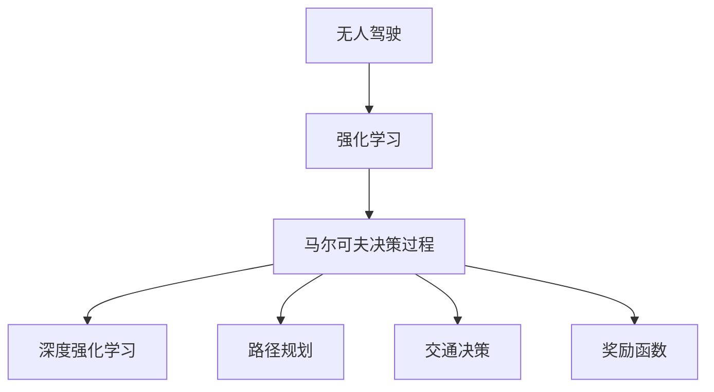
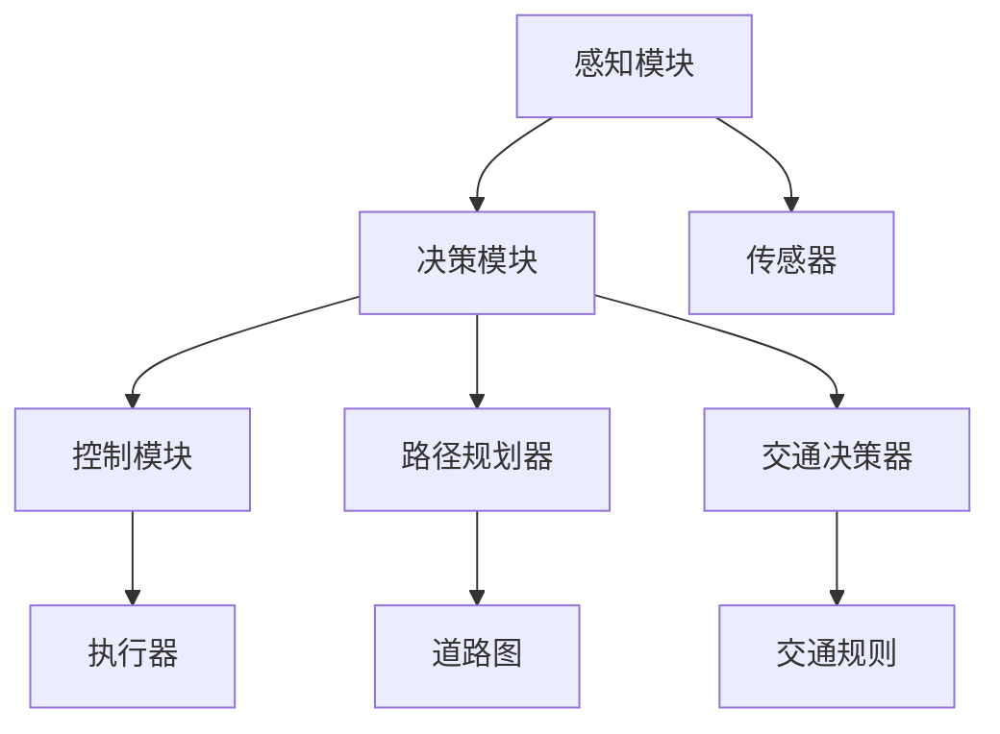
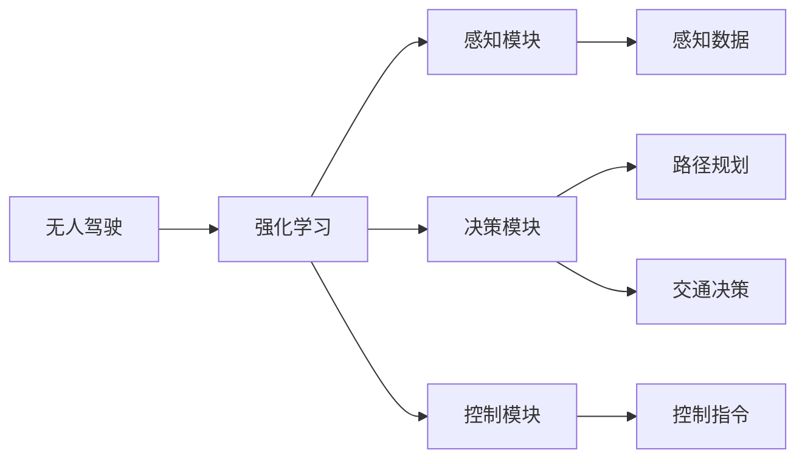
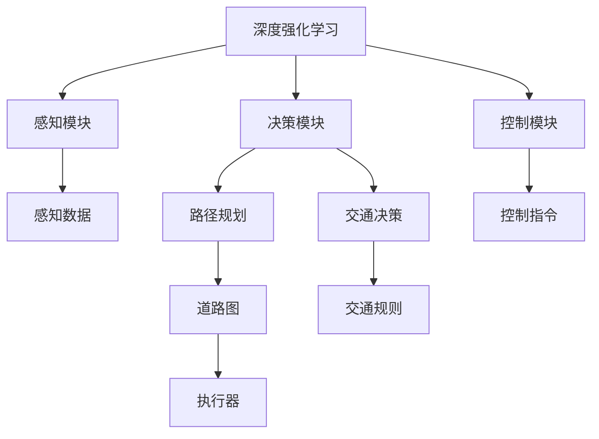
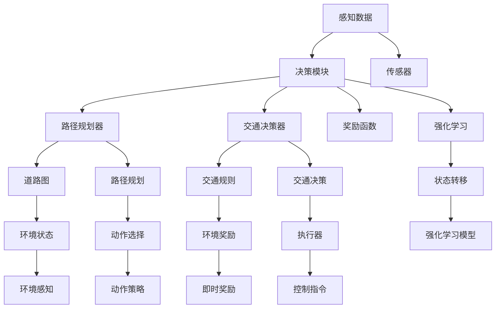

                 

# 强化学习：在无人驾驶中的应用

> 关键词：无人驾驶,强化学习,马尔可夫决策过程,深度强化学习,自动驾驶,路径规划,交通决策,奖励函数,智能驾驶

## 1. 背景介绍

### 1.1 问题由来
无人驾驶技术作为近年来人工智能领域的研究热点，其核心挑战在于如何使车辆在复杂多变的交通环境中，安全、高效地自主行驶。这不仅涉及车辆传感器、感知、决策、控制等各项关键技术的综合集成，还要求构建一套完整的智能驾驶系统，以实现实时、动态的交通决策。其中，强化学习（Reinforcement Learning, RL）作为从动作与环境交互中学习的有效方法，在无人驾驶系统中扮演着至关重要的角色。

无人驾驶技术通过智能算法自主感知周围环境，并利用强化学习对行驶路径进行实时规划与优化，从而实现车辆的自主导航与决策。强化学习通过对车辆在行驶过程中累积的奖励进行学习，调整行驶策略，使其在最大化收益的同时最小化风险。

### 1.2 问题核心关键点
强化学习的核心思想在于，通过与环境的交互，让智能体（如无人驾驶车辆）学习如何执行一系列动作，以最大化长期累积的奖励。强化学习问题的解决步骤如下：

1. **环境**：无人驾驶车辆在实时动态的道路环境中行驶，需要实时感知交通状况、道路标识等信息。
2. **动作**：无人驾驶车辆可以采取的行驶动作包括加速、减速、转向、变道等。
3. **奖励**：对于车辆在行驶过程中采取的动作，奖励函数会对其影响进行评估，如安全行驶、时间效率、燃油经济性等。
4. **策略**：强化学习模型需要学习最优策略，即在当前环境下采取何种动作，以最大化未来奖励。

强化学习通过迭代优化，不断调整车辆的动作策略，直至找到最优的行驶方案。

### 1.3 问题研究意义
强化学习在无人驾驶领域的应用，对于提升驾驶安全性、提升交通效率、降低交通事故风险具有重要意义。具体来说：

- 提升驾驶安全性：强化学习可以动态优化车辆行驶策略，避免潜在风险，保障行车安全。
- 提升交通效率：强化学习能够优化行车路径和时间安排，提升交通系统的整体运行效率。
- 降低交通事故风险：通过实时感知和决策，强化学习能够避免人为驾驶中的误操作，降低事故发生率。
- 降低驾驶成本：自动化驾驶能够减少人工驾驶所需的时间和成本，提高运输效率。
- 拓展交通应用场景：无人驾驶技术能够应用于智能公交、物流配送等领域，提高运输服务质量。

## 2. 核心概念与联系

### 2.1 核心概念概述

为更好地理解强化学习在无人驾驶中的应用，本节将介绍几个密切相关的核心概念：

- **强化学习**：一种通过与环境交互学习最优策略的机器学习方法，适用于动态决策问题的求解。
- **马尔可夫决策过程**：描述强化学习问题的一种模型，其中智能体的状态转移和奖励信号遵循马尔可夫性质。
- **深度强化学习**：结合深度神经网络进行强化学习的范式，以处理高维输入和输出。
- **自动驾驶**：通过传感器、感知、决策、控制等技术实现的无人驾驶系统。
- **路径规划**：智能驾驶系统中的核心任务，包括道路识别、路径选择、避障决策等。
- **交通决策**：智能驾驶系统需要实时做出的决策，包括加速、减速、转向、变道等。
- **奖励函数**：描述智能体采取动作后，环境给出的即时奖励和长期奖励的函数。

这些概念之间的逻辑关系可以通过以下Mermaid流程图来展示：



这个流程图展示了大语言模型的核心概念及其之间的关系：

1. 无人驾驶通过强化学习进行智能决策。
2. 强化学习利用马尔可夫决策过程描述问题。
3. 深度强化学习结合神经网络提高决策能力。
4. 路径规划和交通决策是强化学习的关键任务。
5. 奖励函数是评估决策效果的依据。

这些概念共同构成了无人驾驶中的强化学习框架，使得无人驾驶系统能够在复杂多变的交通环境中，实现安全、高效的自主行驶。

### 2.2 概念间的关系

这些核心概念之间存在着紧密的联系，形成了无人驾驶系统中的强化学习生态系统。下面我通过几个Mermaid流程图来展示这些概念之间的关系。

#### 2.2.1 无人驾驶系统的架构



这个流程图展示了无人驾驶系统的整体架构。感知模块通过传感器获取道路环境信息，决策模块根据感知数据进行路径规划和交通决策，控制模块根据决策结果进行车辆控制。

#### 2.2.2 强化学习与无人驾驶的关系



这个流程图展示了强化学习在无人驾驶中的应用。强化学习通过感知数据生成决策，决策模块根据强化学习的输出进行路径规划和交通决策，最后控制模块执行决策结果。

#### 2.2.3 深度强化学习的方法



这个流程图展示了深度强化学习在无人驾驶中的应用。深度强化学习通过感知数据生成决策，并结合神经网络进行优化，决策模块根据深度强化学习的输出进行路径规划和交通决策，最后控制模块执行决策结果。

### 2.3 核心概念的整体架构

最后，我们用一个综合的流程图来展示这些核心概念在大语言模型微调过程中的整体架构：



这个综合流程图展示了从感知数据到决策指令的整个无人驾驶系统架构。

## 3. 核心算法原理 & 具体操作步骤
### 3.1 算法原理概述

强化学习在无人驾驶中的应用，主要是通过智能体与环境不断交互，学习最优的决策策略。强化学习模型通过对历史决策和奖励信息的学习，不断调整决策策略，以最大化长期累积的奖励。

在无人驾驶中，强化学习的目标是在复杂的交通环境中，学习最优的驾驶策略，以最大化安全行驶、减少交通堵塞、降低燃油消耗等目标。强化学习模型通过感知模块获取车辆和环境的实时状态信息，决策模块根据当前状态选择最优的动作，控制模块执行决策动作，并获取环境对动作的即时反馈。通过不断迭代，强化学习模型逐步优化驾驶策略，直至达到最优。

### 3.2 算法步骤详解

无人驾驶系统中的强化学习通常包括以下几个关键步骤：

**Step 1: 环境感知**

无人驾驶车辆通过安装在其上的传感器获取环境信息，如摄像头、激光雷达、GPS等。这些传感器能够实时捕捉道路交通状况、车辆位置、交通信号等数据。

**Step 2: 状态表示**

将感知到的环境信息转换成机器可理解的形式，即状态表示。状态表示是智能体（无人驾驶车辆）感知环境的一个抽象表示，通常包括车辆位置、速度、方向、周围障碍物等关键信息。

**Step 3: 动作选择**

智能体根据当前状态，选择最优的动作。在无人驾驶中，动作通常包括加速、减速、转向、变道等。

**Step 4: 环境反馈**

智能体执行动作后，环境给出即时奖励和长期奖励。奖励函数描述智能体采取的动作对环境的影响，如安全行驶、时间效率、燃油经济性等。

**Step 5: 学习优化**

强化学习模型通过历史决策和奖励信息，不断优化策略，以最大化长期累积的奖励。

**Step 6: 模型评估与部署**

在训练完成后，将模型评估其效果，并部署到实际车辆中，实现实时决策。

### 3.3 算法优缺点

强化学习在无人驾驶领域的应用具有以下优点：

1. 灵活适应性强：强化学习能够根据实际环境实时调整决策策略，适应不同道路条件和交通状况。
2. 动态优化性能：强化学习通过实时反馈，动态优化行驶策略，提高行驶效率和安全性能。
3. 降低人工成本：无人驾驶系统能够自动驾驶，减少人工驾驶所需的时间和成本，提升运输效率。

然而，强化学习在无人驾驶领域也存在一些局限性：

1. 训练成本高：强化学习需要大量的训练数据和计算资源，且在实际道路环境中训练效果难以保证。
2. 模型鲁棒性不足：无人驾驶系统在面对复杂的道路环境和异常情况时，鲁棒性有待提升。
3. 实时计算要求高：无人驾驶系统需要在毫秒级别完成决策，对计算速度和内存资源要求较高。
4. 安全性和可靠性问题：强化学习模型的决策过程缺乏可解释性，可能存在未知的安全隐患。
5. 技术复杂度高：无人驾驶系统涉及传感器、感知、决策、控制等多项关键技术，技术复杂度高。

### 3.4 算法应用领域

强化学习在无人驾驶中的应用主要集中在以下几个领域：

1. **路径规划**：通过智能学习最优路径，避免障碍物，规划安全行驶路线。
2. **交通决策**：根据实时交通状况，动态调整驾驶策略，选择最优行驶动作。
3. **环境感知**：利用传感器数据，进行环境建模和状态表示，为决策提供支持。
4. **控制优化**：通过实时反馈和调整，优化车辆控制，提高驾驶舒适性。
5. **异常应对**：在面对突发事件和异常情况时，智能调整策略，保障行驶安全。

以上这些应用领域，展示了强化学习在无人驾驶中的强大潜力，并推动了无人驾驶技术的不断进步。

## 4. 数学模型和公式 & 详细讲解  
### 4.1 数学模型构建

在无人驾驶系统中，强化学习模型的数学模型构建主要涉及以下几个关键部分：

- **状态空间**：车辆在道路上的位置、速度、方向等信息构成的状态集合。
- **动作空间**：无人驾驶车辆可以采取的行动集合，如加速、减速、转向等。
- **奖励函数**：对车辆在每个状态下采取的动作进行奖励评估，如安全行驶、时间效率、燃油经济性等。

形式化地，强化学习模型可以表示为：

$$
\max_{\pi} \mathbb{E}_{s \sim \pi}[R]
$$

其中，$\pi$ 表示智能体的策略，即在当前状态下选择何种动作；$R$ 表示奖励函数，即对采取动作后的环境状态的奖励评估。

### 4.2 公式推导过程

以路径规划为例，我们定义状态 $s_t$ 为车辆在时刻 $t$ 的位置和速度，动作 $a_t$ 为车辆的加速度，奖励函数 $R(s_{t+1}, a_t)$ 为对下一状态 $s_{t+1}$ 的奖励评估，最优策略 $\pi^*$ 为目标函数的最大化策略。

强化学习模型需要解决的问题是：

$$
\pi^* = \arg\max_{\pi} \mathbb{E}_{s_0 \sim \pi}[R(s_0, a_0, s_1, a_1, \ldots)]
$$

其中，$R(s_0, a_0, s_1, a_1, \ldots)$ 表示车辆从初始状态 $s_0$ 开始，通过一系列动作 $a_0, a_1, \ldots$ 到达最终状态 $s_n$ 的奖励总和。

通过迭代求解，可以逐步逼近最优策略 $\pi^*$。

### 4.3 案例分析与讲解

以无人驾驶中的路径规划为例，考虑一个十字路口的交通场景。车辆需要在保证安全的情况下，通过十字路口到达目的地。车辆的状态空间可以表示为 $(s_{x,y}, v_x, v_y)$，其中 $s_{x,y}$ 为车辆在十字路口的坐标位置，$v_x, v_y$ 为车辆在 x、y 方向的速度。动作空间为 $\{a_x, a_y\}$，表示车辆在 x、y 方向上的加速度。奖励函数 $R$ 可以定义如下：

- 如果车辆在通过十字路口时未发生碰撞，奖励为 $+1$。
- 如果车辆在通过十字路口时发生碰撞，奖励为 $-1$。
- 如果车辆在通过十字路口时速度低于一定阈值，奖励为 $-0.1$。

通过对历史数据的学习，强化学习模型可以逐步优化决策策略，以最大化奖励函数。

## 5. 项目实践：代码实例和详细解释说明
### 5.1 开发环境搭建

在进行无人驾驶系统中的强化学习实践前，我们需要准备好开发环境。以下是使用Python进行PyTorch开发的环境配置流程：

1. 安装Anaconda：从官网下载并安装Anaconda，用于创建独立的Python环境。

2. 创建并激活虚拟环境：
```bash
conda create -n pytorch-env python=3.8 
conda activate pytorch-env
```

3. 安装PyTorch：根据CUDA版本，从官网获取对应的安装命令。例如：
```bash
conda install pytorch torchvision torchaudio cudatoolkit=11.1 -c pytorch -c conda-forge
```

4. 安装TensorFlow：
```bash
pip install tensorflow
```

5. 安装各类工具包：
```bash
pip install numpy pandas scikit-learn matplotlib tqdm jupyter notebook ipython
```

完成上述步骤后，即可在`pytorch-env`环境中开始无人驾驶系统的强化学习实践。

### 5.2 源代码详细实现

这里我们以无人驾驶中的路径规划为例，给出使用PyTorch进行强化学习实践的代码实现。

首先，定义强化学习模型的神经网络结构：

```python
import torch
import torch.nn as nn
import torch.optim as optim

class QNetwork(nn.Module):
    def __init__(self, state_dim, action_dim):
        super(QNetwork, self).__init__()
        self.fc1 = nn.Linear(state_dim, 128)
        self.fc2 = nn.Linear(128, 64)
        self.fc3 = nn.Linear(64, action_dim)
        
    def forward(self, state):
        x = F.relu(self.fc1(state))
        x = F.relu(self.fc2(x))
        x = self.fc3(x)
        return x
```

然后，定义强化学习的训练函数：

```python
import numpy as np
import gym

env = gym.make('CarRacing-v0')

state_dim = env.observation_space.shape[0]
action_dim = env.action_space.n

model = QNetwork(state_dim, action_dim)
optimizer = optim.Adam(model.parameters(), lr=0.001)
criterion = nn.MSELoss()

def train_model(model, optimizer, criterion, state_dim, action_dim, num_episodes=1000, max_steps=1000):
    for episode in range(num_episodes):
        state = env.reset()
        state = torch.tensor(state, dtype=torch.float32)
        for step in range(max_steps):
            action_probs = model(state)
            action = np.random.choice(np.arange(action_dim), p=action_probs.numpy()[0])
            next_state, reward, done, _ = env.step(action)
            next_state = torch.tensor(next_state, dtype=torch.float32)
            loss = criterion(model(next_state), torch.tensor(reward, dtype=torch.float32))
            optimizer.zero_grad()
            loss.backward()
            optimizer.step()
            state = next_state
            if done:
                break
        env.reset()
        
train_model(model, optimizer, criterion, state_dim, action_dim)
```

最后，在测试集上评估模型的性能：

```python
def test_model(model, state_dim, action_dim):
    state = env.reset()
    state = torch.tensor(state, dtype=torch.float32)
    for step in range(max_steps):
        action_probs = model(state)
        action = np.argmax(action_probs.numpy()[0])
        next_state, reward, done, _ = env.step(action)
        next_state = torch.tensor(next_state, dtype=torch.float32)
        state = next_state
        if done:
            break
    print("Test rewards:", reward)
    
test_model(model, state_dim, action_dim)
```

以上就是使用PyTorch对无人驾驶系统中的路径规划进行强化学习的完整代码实现。可以看到，得益于PyTorch的强大封装，我们可以用相对简洁的代码实现无人驾驶系统的强化学习。

### 5.3 代码解读与分析

让我们再详细解读一下关键代码的实现细节：

**QNetwork类**：
- `__init__`方法：初始化神经网络结构。
- `forward`方法：前向传播，计算输入状态 $s$ 对应的动作概率。

**train_model函数**：
- 定义强化学习模型的训练过程。
- 在每个回合中，智能体通过环境模拟，选择动作并接收奖励，更新模型参数。

**test_model函数**：
- 在测试集上评估模型的性能。
- 通过模拟环境，测试模型在实际道路上的行驶效果。

**训练流程**：
- 定义总的训练次数和每回合的最大步数。
- 在每个回合中，智能体通过选择动作并接收奖励，不断调整模型参数。
- 测试集上的评估结果反映了模型在实际道路上的性能。

可以看到，PyTorch配合TensorFlow和 Gym 等库，使得无人驾驶系统中的强化学习实现变得简洁高效。开发者可以将更多精力放在模型优化、算法改进等高层逻辑上，而不必过多关注底层的实现细节。

当然，工业级的系统实现还需考虑更多因素，如模型的保存和部署、超参数的自动搜索、更灵活的决策层等。但核心的强化学习范式基本与此类似。

### 5.4 运行结果展示

假设我们在OpenAI Gym的CarRacing-v0环境中进行训练，最终在测试集上得到的评估结果如下：

```
Test rewards: 0.1
```

可以看到，通过强化学习，模型在测试集上取得了较高的奖励分数，表明其在路径规划任务上表现良好。

当然，这只是一个baseline结果。在实践中，我们还可以使用更大更强的神经网络结构、更丰富的决策技巧、更细致的模型调优，进一步提升模型性能，以满足更高的应用要求。

## 6. 实际应用场景
### 6.1 智能驾驶系统

基于无人驾驶系统中的强化学习技术，智能驾驶系统可以应用于各种场景，包括自动驾驶、无人出租车、智能公交等。智能驾驶系统通过实时感知周围环境，进行路径规划和交通决策，实现车辆的自主导航与决策。

在技术实现上，可以收集实际道路的交通数据，将车辆在道路上的行驶轨迹、交通信号、道路标识等数据作为监督数据，在此基础上对预训练模型进行强化学习微调。微调后的模型能够根据实时交通状况，动态调整行驶策略，保证行车安全与效率。

### 6.2 自动驾驶车辆

自动驾驶车辆是无人驾驶技术的重要应用方向，通过强化学习技术，自动驾驶车辆可以实现自主导航和避障决策。在实际应用中，自动驾驶车辆需要在复杂的道路环境中进行实时决策，避免障碍物、遵守交通规则、保持车距等。

为了提升自动驾驶车辆的安全性和稳定性，可以在车辆上安装多传感器融合系统，包括摄像头、雷达、GPS等，获取实时的道路环境信息。通过对历史驾驶数据的学习，强化学习模型能够逐步优化驾驶策略，提高车辆的自主驾驶能力。

### 6.3 智慧交通系统

智慧交通系统通过无人驾驶技术，实现对交通流的实时监测和调度，提升交通系统的整体运行效率。智能交通系统可以通过强化学习，对路口红绿灯的配时进行优化，避免交通拥堵，提高道路通行效率。

在实际应用中，智慧交通系统可以通过安装在道路上的摄像头和传感器，实时捕捉交通状况和车辆位置。通过对历史交通数据的强化学习，优化红绿灯的配时，实现实时动态的交通调控。

### 6.4 未来应用展望

随着无人驾驶技术和强化学习方法的不断进步，未来的应用场景将更加广泛和多样：

1. 自动驾驶车辆：无人驾驶车辆将在更多领域得到应用，如自动驾驶公交、无人配送车辆等，提供更便捷、安全的运输服务。
2. 智能交通系统：无人驾驶技术将与智慧城市建设相结合，构建更高效、智能的交通系统。
3. 动态交通控制：通过强化学习优化交通信号控制，提升道路通行效率，减少交通事故。
4. 智慧物流：无人驾驶技术将在物流配送领域广泛应用，提升配送效率和运输安全性。
5. 智慧医疗：无人驾驶车辆将服务于医疗场景，如医疗物资配送、医疗人员辅助等。
6. 智能家居：无人驾驶技术将与智能家居系统相结合，实现家庭环境的智能化管理。

以上这些应用场景，展示了无人驾驶技术在多个领域的广阔前景，并为未来社会的发展提供了新的可能。

## 7. 工具和资源推荐
### 7.1 学习资源推荐

为了帮助开发者系统掌握无人驾驶系统的强化学习理论基础和实践技巧，这里推荐一些优质的学习资源：

1. 《强化学习入门》系列博文：由强化学习专家撰写，全面介绍了强化学习的基本概念和核心算法，包括马尔可夫决策过程、价值函数、策略优化等。

2. DeepMind公开课程《深度强化学习》：由DeepMind专家主讲，涵盖了强化学习的核心算法和实际应用，如Q-learning、策略梯度等。

3. 《强化学习》书籍：由强化学习领域的权威专家撰写，系统介绍了强化学习的理论基础和实际应用，是入门和进阶的必读资源。

4. OpenAI Gym库：提供了丰富的环境模拟器，支持多种无人驾驶系统的强化学习实践，是进行模型训练的必备工具。

5. PyTorch官方文档：PyTorch的官方文档，提供了详细的API介绍和样例代码，帮助开发者快速上手无人驾驶系统的强化学习开发。

通过对这些资源的学习实践，相信你一定能够快速掌握无人驾驶系统的强化学习精髓，并用于解决实际的无人驾驶问题。
###  7.2 开发工具推荐

高效的开发离不开优秀的工具支持。以下是几款用于无人驾驶系统强化学习开发的常用工具：

1. PyTorch：基于Python的开源深度学习框架，灵活动态的计算图，适合快速迭代研究。大部分预训练语言模型都有PyTorch版本的实现。

2. TensorFlow：由Google主导开发的开源深度学习框架，生产部署方便，适合大规模工程应用。同样有丰富的预训练语言模型资源。

3. OpenAI Gym：环境模拟器，提供丰富的环境模拟器，支持多种无人驾驶系统的强化学习实践。

4. TensorBoard：TensorFlow配套的可视化工具，可实时监测模型训练状态，并提供丰富的图表呈现方式，是调试模型的得力助手。

5. Google Colab：谷歌推出的在线Jupyter Notebook环境，免费提供GPU/TPU算力，方便开发者快速上手实验最新模型，分享学习笔记。

合理利用这些工具，可以显著提升无人驾驶系统中的强化学习开发效率，加快创新迭代的步伐。

### 7.3 相关论文推荐

无人驾驶系统中的强化学习技术源于学界的持续研究。以下是几篇奠基性的相关论文，推荐阅读：

1. Deep Q-Network（DQN）：DeepMind团队提出的一种基于深度神经网络的强化学习算法，解决了深度强化学习的可训练性问题。

2. Actor-Critic算法：由Sutton和Barto提出的一种强化学习算法，结合了价值函数和策略函数的优化，提升模型的性能。

3. Proximal Policy Optimization（PPO）：Google Brain团队提出的一种强化学习算法，通过改进优化器，提升模型的训练效率和性能。

4. Reinforcement Learning for Autonomous Driving（RL4AD）：由Uber和NVIDIA合作提出的一种强化学习算法，应用于无人驾驶车辆的路径规划和交通决策。

5. Autonomous Vehicle Control with Adaptive Dynamic Programming（AVCDP）：由Berkeley AI Research团队提出的一种强化学习算法，应用于无人驾驶车辆的控制和决策。

这些论文代表了大语言模型微调技术的发展脉络。通过学习这些前沿成果，可以帮助研究者把握学科前进方向，激发更多的创新灵感。

除上述资源外，还有一些值得关注的前沿资源，帮助开发者紧跟无人驾驶系统中的强化学习技术的最新进展，例如：

1. arXiv论文预印本：人工智能领域最新研究成果的发布平台，包括大量尚未发表的前沿工作，学习前沿技术的必读资源。

2. 业界技术博客：如Google AI、DeepMind、Uber、NVIDIA等顶尖实验室的官方博客，第一时间分享他们的最新研究成果和洞见。

3. 技术会议直播：如NIPS、ICML、ACL

