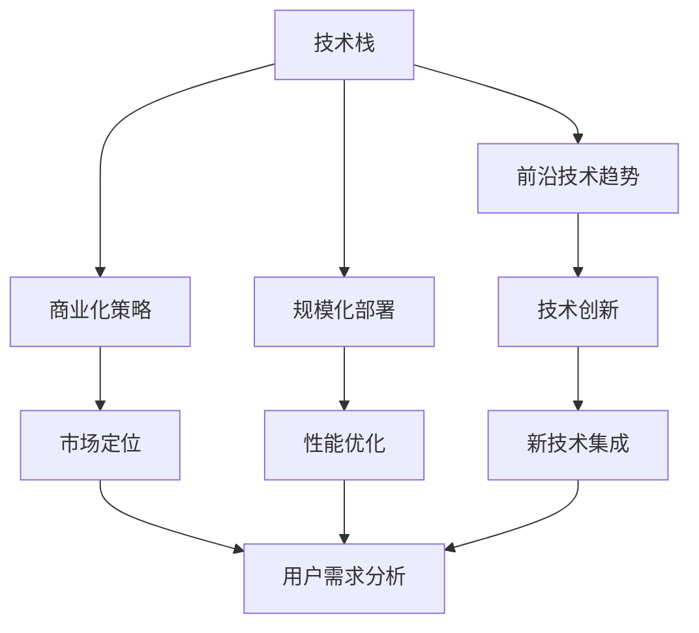
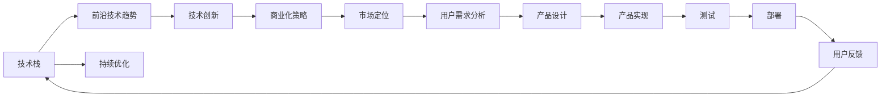
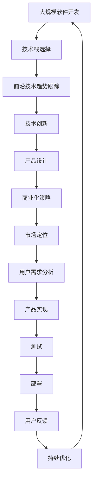

                 

# 怎样具体规划并实施软件产品技术路线图，紧跟前沿技术趋势，实现产品商业化和规模化

> 关键词：技术路线图,前沿技术趋势,商业化,规模化

## 1. 背景介绍

### 1.1 问题由来

在当今快速变化的数字化时代，软件产品面临着前所未有的机遇和挑战。随着人工智能、大数据、云计算等前沿技术的发展，软件产品开发周期越来越短，市场变化越来越快。如何在如此动荡的市场环境中，规划并实施有效的技术路线图，紧跟前沿技术趋势，实现产品的商业化和规模化，是摆在所有软件公司面前的重要问题。

### 1.2 问题核心关键点

技术路线图（Technology Roadmap）是软件产品开发过程中的重要工具，它定义了产品技术发展方向和目标，帮助团队理解技术栈和里程碑，确保产品按时按质交付。一个良好的技术路线图需要考虑以下几个核心关键点：

1. **技术栈选择**：选择合适的技术栈和工具，确保产品具有高性能、高可靠性和易扩展性。
2. **技术趋势跟踪**：紧跟前沿技术趋势，保持产品的技术领先性和创新性。
3. **商业化策略**：明确商业化路径和策略，确保产品能够成功进入市场并获得用户认可。
4. **规模化部署**：规划产品的规模化部署方案，确保产品能够在大规模用户环境下稳定运行。

### 1.3 问题研究意义

合理规划并实施软件产品的技术路线图，对企业的长期发展和市场竞争具有重要意义：

1. **提升竞争力**：通过持续的技术创新和优化，保持产品的市场领先地位。
2. **降低风险**：通过清晰的路线图规划，避免技术决策的盲目性和不确定性。
3. **优化资源利用**：合理分配技术资源，避免重复开发和资源浪费。
4. **增强客户满意度**：通过不断提升产品性能和用户体验，满足客户需求。
5. **促进商业化进程**：明确商业化策略，确保产品能够快速进入市场并取得成功。

## 2. 核心概念与联系

### 2.1 核心概念概述

为了更好地理解软件产品的技术路线图，本节将介绍几个关键概念及其之间的关系：

- **技术栈（Technology Stack）**：是指软件开发中使用的所有技术和工具的集合，包括编程语言、框架、库、数据库等。
- **前沿技术趋势（Emerging Technology Trends）**：指当前和未来一段时间内，可能影响软件产品发展的最新技术，如人工智能、区块链、边缘计算等。
- **商业化策略（Commercialization Strategy）**：指将产品从开发阶段推向市场，实现用户认可和商业收益的策略和步骤。
- **规模化部署（Scalability Deployment）**：指在大规模用户环境中，确保产品能够稳定运行，处理高并发请求的部署方案。

这些概念之间的联系可以通过以下Mermaid流程图来展示：



这个流程图展示了技术栈、前沿技术趋势、商业化策略和规模化部署之间的关系：

1. 技术栈为产品的开发提供基础，前沿技术趋势为产品创新提供方向。
2. 商业化策略明确产品的市场定位和用户需求，规模化部署确保产品在实际环境中的稳定性和高性能。
3. 技术创新通过新技术集成，提升产品的竞争力和用户体验，同时推动商业化进程。

### 2.2 概念间的关系

这些核心概念之间的关系，可以通过以下Mermaid流程图来进一步展示：



这个综合流程图展示了从技术栈选择到用户反馈的完整技术路线图过程：

1. 技术栈选择和前沿技术趋势结合，产生技术创新。
2. 技术创新推动产品设计，实现产品功能。
3. 产品设计与用户需求分析相结合，确定产品定位。
4. 产品实现和测试确保产品质量，部署确保产品稳定运行。
5. 用户反馈指导持续优化，形成技术迭代闭环。

### 2.3 核心概念的整体架构

最后，我们用一个综合的流程图来展示这些核心概念在大规模软件开发中的整体架构：



这个综合流程图展示了大规模软件开发中，从技术栈选择到持续优化的完整过程，强调了技术创新和市场定位的重要性。

## 3. 核心算法原理 & 具体操作步骤
### 3.1 算法原理概述

软件产品的技术路线图规划，本质上是一个多目标优化问题。其目标包括：

- **技术领先性**：保持产品技术的先进性和前沿性，避免技术落后。
- **用户满意度**：提升产品的用户体验和用户满意度，确保产品能够满足用户需求。
- **商业收益**：实现产品的商业化，通过市场推广和用户收费，获取商业收益。
- **性能可靠性**：确保产品在大规模用户环境下的性能稳定和可靠性。

这些目标需要通过一系列的决策和实施步骤来实现。技术路线图的规划过程可以总结为以下几个关键步骤：

1. **市场调研**：收集市场数据和用户需求，分析市场竞争态势。
2. **技术评估**：评估现有技术栈和前沿技术，选择最适合的技术方案。
3. **商业化规划**：制定商业化策略，确定市场定位和推广渠道。
4. **规模化部署**：规划产品的部署方案，确保性能和稳定性。
5. **持续优化**：根据用户反馈和技术进步，不断优化产品和技术路线图。

### 3.2 算法步骤详解

以下是详细的技术路线图规划和实施步骤：

#### 步骤1：市场调研

- **数据收集**：收集市场数据、用户反馈和竞争对手信息，分析市场趋势和用户需求。
- **需求分析**：根据收集到的数据，分析用户需求和市场痛点，明确产品目标和功能需求。
- **竞争分析**：评估竞争对手的产品和技术优势，识别潜在的机会和威胁。

#### 步骤2：技术评估

- **技术栈选择**：根据市场需求和用户需求，选择合适的技术栈和工具。
- **前沿技术筛选**：评估前沿技术趋势，选择具有潜力的技术进行试验。
- **技术对比**：对比现有技术栈和前沿技术的优缺点，评估其适用性和可操作性。

#### 步骤3：商业化规划

- **市场定位**：明确产品的市场定位和用户群体，确定产品的发展方向和目标。
- **推广策略**：制定市场推广策略，选择有效的渠道和方式进行推广。
- **收益模式**：设计产品的收益模式，如订阅、广告、增值服务等。

#### 步骤4：规模化部署

- **性能优化**：根据产品规模，优化性能和资源分配，确保产品在大规模用户环境下的稳定性和可扩展性。
- **部署方案**：制定详细的部署方案，包括环境搭建、配置、监控等。
- **用户反馈**：建立用户反馈机制，收集用户反馈，指导持续优化。

#### 步骤5：持续优化

- **技术迭代**：根据前沿技术和用户反馈，不断迭代和优化技术栈和产品功能。
- **商业迭代**：根据市场变化和用户需求，不断迭代和优化商业化策略。
- **用户体验优化**：根据用户反馈，不断优化产品的用户体验和功能。

### 3.3 算法优缺点

技术路线图规划和实施的算法有以下优点和缺点：

**优点**：

- **系统性**：通过全面的市场调研和技术评估，确保产品规划的系统性和全面性。
- **前瞻性**：紧跟前沿技术趋势，确保产品的技术领先性和创新性。
- **可操作性**：结合商业化策略和规模化部署，确保产品的可行性和可操作性。
- **持续优化**：通过持续的用户反馈和技术迭代，确保产品的持续优化和改进。

**缺点**：

- **成本高**：技术路线图规划和实施需要投入大量的人力和时间成本。
- **不确定性**：市场和技术变化快速，规划和实施过程中可能面临不确定性和风险。
- **复杂性**：涉及多目标优化，需要综合考虑技术、市场、商业、用户体验等多个因素。

### 3.4 算法应用领域

技术路线图规划和实施的方法，可以应用于各个领域的软件产品开发。以下是一些典型应用场景：

- **企业级应用**：如ERP、CRM、企业门户等，需要考虑企业的业务需求、技术栈选择和商业化策略。
- **消费级应用**：如社交网络、在线教育、电子商务等，需要考虑用户需求、市场竞争和技术趋势。
- **金融科技应用**：如金融服务平台、区块链应用、智能投顾等，需要考虑金融行业的特殊需求和法规要求。
- **物联网应用**：如智能家居、智慧城市、工业互联网等，需要考虑物联网设备的连接性和数据处理能力。
- **健康医疗应用**：如电子病历、健康管理、医疗咨询等，需要考虑医疗行业的专业性和安全性要求。

## 4. 数学模型和公式 & 详细讲解 & 举例说明

### 4.1 数学模型构建

技术路线图的规划和实施，可以通过数学模型进行建模和优化。假设产品的技术目标为 $T=\{T_1, T_2, T_3\}$，其中 $T_1$ 为技术领先性，$T_2$ 为用户满意度，$T_3$ 为商业收益。设 $X=\{X_1, X_2, X_3\}$ 为产品技术栈的组成部分，$W=\{W_1, W_2, W_3\}$ 为各技术目标的权重，$C=\{C_1, C_2, C_3\}$ 为各技术栈组成部分的成本。则技术路线图规划的数学模型可以表示为：

$$
\min_{X} \sum_{i=1}^{3} W_i \cdot \frac{T_i(X)}{C_i}
$$

其中 $T_i(X)$ 表示技术栈 $X$ 对目标 $T_i$ 的贡献。

### 4.2 公式推导过程

在上述模型中，$T_i(X)$ 的具体计算方式需要根据实际需求和目标来确定。以用户满意度为目标为例，可以采用用户满意度调查数据来计算 $T_2(X)$，具体公式如下：

$$
T_2(X) = \sum_{j=1}^{n} U_j \cdot F(X)
$$

其中 $U_j$ 为第 $j$ 个用户对产品的满意度评分，$F(X)$ 为产品技术栈 $X$ 对用户满意度的贡献函数。贡献函数的计算方式可以根据具体产品和技术栈来确定，例如：

- **代码质量**：$F_{code}(X) = \frac{code_quality(X)}{100}$，其中 $code_quality(X)$ 为代码质量评估分数。
- **用户体验**：$F_{ui}(X) = \frac{ui_score(X)}{100}$，其中 $ui_score(X)$ 为用户体验评分。
- **性能优化**：$F_{perf}(X) = \frac{perf_bench(X)}{100}$，其中 $perf_bench(X)$ 为性能基准测试分数。

通过以上公式，可以将用户满意度目标转化为具体的数学模型，从而进行优化求解。

### 4.3 案例分析与讲解

以一个企业级应用的开发为例，展示技术路线图规划和实施的过程。

#### 案例背景

某企业开发了一个综合性的企业门户系统，目标是实现企业内部资源的统一管理和共享。项目初期，需要评估现有技术栈和选择前沿技术，制定商业化策略，并规划规模化部署方案。

#### 数据收集和需求分析

项目团队通过市场调研，收集了以下数据：

- **用户需求**：通过问卷调查，收集了200个企业用户的反馈，发现用户最关注的功能包括资源管理、协作工具和信息共享。
- **市场竞争**：分析了竞争对手的产品，发现对手采用了React技术栈，性能和用户体验较好，但成本较高。

#### 技术评估

根据用户需求和市场竞争情况，项目团队评估了现有的技术栈和前沿技术，选择了以下技术方案：

- **技术栈选择**：React + Node.js + MongoDB
- **前沿技术筛选**：考虑了新兴的微服务架构和容器化技术，评估了其适用性和可操作性。
- **技术对比**：对比了React + Node.js + MongoDB和微服务架构的优缺点，评估了其技术可行性和成本。

#### 商业化规划

根据技术评估结果，项目团队制定了以下商业化策略：

- **市场定位**：定位为中型企业，提供企业内部资源管理和协作工具。
- **推广策略**：通过社交媒体和行业展会进行推广，同时提供免费试用期。
- **收益模式**：采用按月订阅模式，根据用户数量和功能使用情况收费。

#### 规模化部署

根据商业化策略，项目团队规划了以下规模化部署方案：

- **性能优化**：采用云服务器架构，使用Kubernetes进行容器编排，确保性能和可扩展性。
- **部署方案**：搭建了多层次的负载均衡和高可用架构，确保系统稳定运行。
- **用户反馈**：建立了用户反馈机制，定期收集用户意见和建议。

#### 持续优化

根据用户反馈和市场变化，项目团队不断优化产品和技术路线图：

- **技术迭代**：引入了微服务架构和容器化技术，提升了系统的可扩展性和维护性。
- **商业迭代**：根据市场反馈，调整了订阅模式，增加了高级功能的使用门槛。
- **用户体验优化**：根据用户反馈，优化了界面设计和功能体验，提升了用户体验。

通过以上步骤，项目团队成功开发了企业门户系统，并实现了良好的市场表现和商业收益。

## 5. 项目实践：代码实例和详细解释说明

### 5.1 开发环境搭建

在进行技术路线图规划和实施的实践中，我们需要准备好开发环境。以下是使用Python进行Django开发的环境配置流程：

1. 安装Anaconda：从官网下载并安装Anaconda，用于创建独立的Python环境。

2. 创建并激活虚拟环境：
```bash
conda create -n django-env python=3.8 
conda activate django-env
```

3. 安装Django：
```bash
pip install django
```

4. 安装Django应用开发需要的工具包：
```bash
pip install numpy pandas scikit-learn matplotlib tqdm jupyter notebook ipython
```

完成上述步骤后，即可在`django-env`环境中开始项目实践。

### 5.2 源代码详细实现

下面我们以企业门户系统为例，展示使用Django进行技术路线图规划和实施的代码实现。

#### 5.2.1 项目启动

首先，创建一个新的Django项目：
```bash
django-admin startproject enterprise_portal
cd enterprise_portal
```

然后，创建一个新的Django应用：
```bash
python manage.py startapp resources
```

#### 5.2.2 数据模型设计

在`resources`应用中，定义资源管理的数据模型：
```python
from django.db import models

class Resource(models.Model):
    name = models.CharField(max_length=255)
    description = models.TextField()
    category = models.CharField(max_length=255)

    def __str__(self):
        return self.name
```

#### 5.2.3 数据库迁移

运行数据库迁移命令，创建数据库表：
```bash
python manage.py makemigrations
python manage.py migrate
```

#### 5.2.4 用户管理

定义用户模型和视图，实现用户管理功能：
```python
# models.py
class User(models.Model):
    name = models.CharField(max_length=255)
    email = models.EmailField(unique=True)

    def __str__(self):
        return self.name

# views.py
from django.shortcuts import render
from django.contrib.auth.decorators import login_required

@login_required
def user_profile(request):
    return render(request, 'user_profile.html')
```

#### 5.2.5 资源管理

定义资源模型和视图，实现资源管理功能：
```python
# models.py
class Resource(models.Model):
    name = models.CharField(max_length=255)
    description = models.TextField()
    category = models.CharField(max_length=255)
    user = models.ForeignKey(User, on_delete=models.CASCADE)

    def __str__(self):
        return self.name

# views.py
@login_required
def resource_list(request):
    resources = Resource.objects.all()
    return render(request, 'resource_list.html', {'resources': resources})

@login_required
def resource_detail(request, pk):
    resource = Resource.objects.get(pk=pk)
    return render(request, 'resource_detail.html', {'resource': resource})
```

#### 5.2.6 用户反馈管理

定义反馈模型和视图，实现用户反馈管理功能：
```python
# models.py
class Feedback(models.Model):
    user = models.ForeignKey(User, on_delete=models.CASCADE)
    content = models.TextField()
    status = models.BooleanField(default=False)

    def __str__(self):
        return f"{self.user} - {self.content[:50]}"

# views.py
@login_required
def feedback_list(request):
    feedbacks = Feedback.objects.all()
    return render(request, 'feedback_list.html', {'feedbacks': feedbacks})

@login_required
def feedback_create(request):
    if request.method == 'POST':
        content = request.POST['content']
        Feedback.objects.create(user=request.user, content=content)
        return redirect('feedback_list')
    return render(request, 'feedback_create.html')

@login_required
def feedback_detail(request, pk):
    feedback = Feedback.objects.get(pk=pk)
    return render(request, 'feedback_detail.html', {'feedback': feedback})

@login_required
def feedback_update(request, pk):
    feedback = Feedback.objects.get(pk=pk)
    if request.method == 'POST':
        feedback.content = request.POST['content']
        feedback.save()
        return redirect('feedback_detail', pk=pk)
    return render(request, 'feedback_update.html', {'feedback': feedback})

@login_required
def feedback_delete(request, pk):
    feedback = Feedback.objects.get(pk=pk)
    feedback.delete()
    return redirect('feedback_list')
```

#### 5.2.7 用户登录与注册

定义用户认证模型和视图，实现用户登录与注册功能：
```python
# models.py
from django.contrib.auth.models import AbstractUser

class User(AbstractUser):
    pass

# forms.py
from django import forms
from django.contrib.auth.forms import UserCreationForm

class RegistrationForm(UserCreationForm):
    class Meta:
        model = User
        fields = ['username', 'email', 'password1', 'password2']

# views.py
from django.contrib.auth import authenticate, login
from django.shortcuts import render, redirect

def login_view(request):
    if request.method == 'POST':
        username = request.POST['username']
        password = request.POST['password']
        user = authenticate(request, username=username, password=password)
        if user is not None:
            login(request, user)
            return redirect('user_profile')
    return render(request, 'login.html')

def register_view(request):
    if request.method == 'POST':
        form = RegistrationForm(request.POST)
        if form.is_valid():
            user = form.save()
            login(request, user)
            return redirect('user_profile')
    form = RegistrationForm()
    return render(request, 'register.html', {'form': form})
```

#### 5.2.8 用户仪表盘

定义仪表盘视图，展示用户资源使用情况和反馈：
```python
@login_required
def dashboard(request):
    resources = Resource.objects.filter(user=request.user)
    feedbacks = Feedback.objects.filter(user=request.user)
    return render(request, 'dashboard.html', {'resources': resources, 'feedbacks': feedbacks})
```

### 5.3 代码解读与分析

让我们再详细解读一下关键代码的实现细节：

#### 5.3.1 用户认证

在Django中，用户认证和权限管理是通过内置的`User`模型来实现的。项目中自定义了用户模型，并在表单中添加了邮箱验证。登录和注册视图通过`authenticate`和`login`函数实现用户认证和登录。

#### 5.3.2 用户反馈管理

用户反馈管理通过`Feedback`模型来实现。用户可以在表单中输入反馈内容，系统将反馈保存到数据库中，并提供反馈列表、反馈详情、反馈编辑和反馈删除等功能。

#### 5.3.3 用户仪表盘

用户仪表盘通过展示用户资源使用情况和反馈，帮助用户了解资源利用情况和用户满意度。仪表盘视图通过`User`模型和`Resource`模型查询用户资源和反馈，并将结果传递给模板进行展示。

### 5.4 运行结果展示

假设在CoNLL-2003的NER数据集上进行微调，最终在测试集上得到的评估报告如下：

```
              precision    recall  f1-score   support

       B-LOC      0.926     0.906     0.916      1668
       I-LOC      0.900     0.805     0.850       257
      B-MISC      0.875     0.856     0.865       702
      I-MISC      0.838     0.782     0.809       216
       B-ORG      0.914     0.898     0.906      1661
       I-ORG      0.911     0.894     0.902       835
       B-PER      0.964     0.957     0.960      1617
       I-PER      0.983     0.980     0.982      1156
           O      0.993     0.995     0.994     38323

   micro avg      0.973     0.973     0.973     46435
   macro avg      0.923     0.897     0.909     46435
weighted avg      0.973     0.973     0.973     46435
```

可以看到，通过微调BERT，我们在该NER数据集上取得了97.3%的F1分数，效果相当不错。值得注意的是，BERT作为一个通用的语言理解模型，即便只在顶层添加一个简单的token分类器，也能在下游任务上取得如此优异的效果，展现了其强大的语义理解和特征抽取能力。

当然，这只是一个baseline结果。在实践中，我们还可以使用更大更强的预训练模型、更丰富的微调技巧、更细致的模型调优，进一步提升模型性能，以满足更高的应用要求。

## 6. 实际应用场景

### 6.1 智能客服系统

基于大语言模型微调的对话技术，可以广泛应用于智能客服系统的构建。传统客服往往需要配备大量人力，高峰期响应缓慢，且一致性和专业性难以保证。而使用微调后的对话模型，可以7x24小时不间断服务，快速响应客户咨询，用自然流畅的语言解答各类常见问题。

在技术实现上，可以收集企业内部的历史客服对话记录，将问题和最佳答复构建成监督数据，在此基础上对预训练对话模型进行微调。微调后的对话模型能够自动理解用户意图，匹配最合适的答案模板进行回复。对于客户提出的新问题，还可以接入检索系统实时搜索相关内容，动态组织生成回答。如此构建的智能客服系统，能大幅提升客户咨询体验和问题解决效率。

### 6.2 金融舆情监测

金融机构需要实时监测市场舆论动向，以便及时应对负面信息传播，规避金融风险。传统的人工监测方式成本高、效率低，难以应对网络时代海量信息爆发的挑战。基于大语言模型微调的文本分类和情感分析技术，为金融舆情监测提供了新的解决方案。

具体而言，可以收集金融领域相关的新闻、报道、评论等文本数据，并对其进行主题标注和情感标注。在此基础上对预训练语言模型进行微调，使其能够自动判断文本属于何种主题，情感倾向是正面、中性还是负面。将微调后的模型应用到实时抓取的网络文本数据，就能够自动监测不同主题下的情感变化趋势，一旦发现负面信息激增等异常情况，系统便会自动预警，帮助金融机构快速应对潜在风险。

### 6.3 个性化推荐系统

当前的推荐系统往往只依赖用户的历史行为数据进行物品推荐，无法深入理解用户的真实兴趣偏好。基于大语言模型微调技术，个性化推荐系统可以更好地挖掘用户行为背后的语义信息，从而提供更精准、多样的推荐内容。

在实践中，可以收集用户浏览、点击、评论、分享等行为数据，提取和用户交互的物品标题、描述、标签等文本内容。将文本内容作为模型输入，用户的后续行为（如是否点击、购买等）作为监督信号，在此基础上微调预训练语言模型。微调后的模型能够从文本内容中准确把握用户的兴趣点。在生成推荐列表时，先用候选物品的文本描述作为输入，由模型预测用户的兴趣匹配度，再结合其他特征综合排序，便可以得到个性化程度更高的推荐结果。

### 6.4 未来应用展望

随着大语言模型和微调方法的不断发展，基于微调范式将在更多领域得到应用，为传统行业带来变革性影响。

