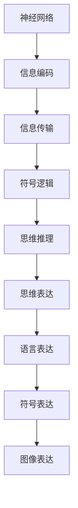
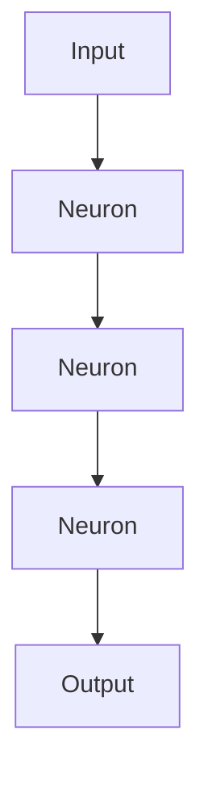
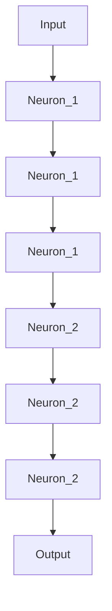

                 

# 思维与表达：结构化的内在联系

## 1. 背景介绍

### 1.1 问题由来

在人类认知科学和人工智能领域，思维与表达之间的内在联系一直是研究的重点之一。无论是从心理学、语言学，还是计算机科学的角度来看，对思维与表达机制的理解对于开发智能系统、提升人机交互体验都具有重要意义。

思维通常指的是个体对信息的处理、分析和推理能力，而表达则是通过语言、符号、图像等形式将思维结果外化出来的过程。两者之间存在着复杂的相互作用和影响，如何通过科学的方法揭示这种内在联系，成为当前研究的核心问题。

### 1.2 问题核心关键点

本节将详细阐述思维与表达的内在联系，具体包括以下几个方面：

1. **思维与表达的基本机制**：探讨人类思维如何通过语言、符号等形式进行表达，以及这种表达机制如何影响思维过程。
2. **认知神经科学视角**：从神经科学角度分析思维与表达过程中的神经网络和机制。
3. **信息论视角**：应用信息论原理，探索思维与表达的信息结构和编码方式。
4. **符号逻辑视角**：通过符号逻辑框架，研究思维与表达的逻辑结构和推理过程。
5. **计算模型视角**：基于计算模型，如图灵机、神经网络，模拟思维与表达的计算过程和结构。

## 2. 核心概念与联系

### 2.1 核心概念概述

为更好地理解思维与表达的内在联系，本节将介绍几个密切相关的核心概念：

- **思维**：指个体对信息的感知、理解、分析和推理过程。思维涉及感知、记忆、联想、推理、决策等多个环节，是智能的核心。
- **表达**：指将思维结果通过语言、符号、图像等形式进行外化的过程。表达是思维与外界交互的桥梁，是人类社会交流的基础。
- **神经网络**：由大量人工神经元组成的计算模型，用于模拟人类大脑的神经元连接和信息处理过程。
- **信息论**：研究信息传输、存储和处理的理论，在思维与表达过程中应用广泛。
- **符号逻辑**：通过符号和逻辑规则，研究思维的推理过程和表达的结构。

### 2.2 概念间的关系

这些核心概念之间存在着紧密的联系，构成了思维与表达的内在联系的完整框架。

- 思维通过神经网络进行信息处理，产生内部表征。
- 这些内部表征通过信息论的原理进行编码和传输。
- 编码后的信息通过符号逻辑进行推理和表达。
- 表达的信息通过语言、符号等形式外化，与外界进行交互。

这些概念之间的逻辑关系可以通过以下Mermaid流程图来展示：



这个流程图展示了思维与表达过程中各关键环节的关系：

1. 神经网络处理信息，产生内部表征。
2. 内部表征通过信息编码进行压缩和传输。
3. 编码后的信息通过符号逻辑进行推理。
4. 推理结果通过语言、符号、图像等形式进行表达。

这些概念共同构成了思维与表达的内在联系的完整框架，为后续深入讨论提供了基础。

## 3. 核心算法原理 & 具体操作步骤

### 3.1 算法原理概述

基于神经网络的思维与表达机制，我们可以将其建模为一种复杂的计算过程。在计算模型中，思维可以视为对输入信息的处理和输出信息的生成，表达则是将输出信息以特定形式外化。这种计算过程可以通过前向传播和反向传播算法进行模拟。

#### 3.1.1 前向传播

前向传播是计算模型中的一种基本计算方式，它模拟了思维处理输入信息的过程。具体来说，前向传播过程可以表示为：

$$
\text{Output} = f(\text{Input}, \text{Weight}, \text{Bias})
$$

其中，$f$表示激活函数，$\text{Input}$为输入信息，$\text{Weight}$为模型参数，$\text{Bias}$为偏置项。

#### 3.1.2 反向传播

反向传播是计算模型中的另一种基本计算方式，它模拟了思维推理和表达的过程。具体来说，反向传播过程可以表示为：

$$
\text{Error} = \text{Loss}(\text{Output}, \text{Target})
$$

其中，$\text{Loss}$为损失函数，$\text{Target}$为期望输出。

通过反向传播算法，可以计算出模型参数的梯度，进而更新参数，优化模型的输出。

### 3.2 算法步骤详解

基于神经网络的思维与表达机制，我们将其建模为一种计算过程。以下是对这一过程的详细描述：

#### 3.2.1 数据准备

- **输入数据准备**：准备输入数据，如文本、图像等。
- **目标数据准备**：准备目标数据，如标签、答案等。

#### 3.2.2 模型定义

- **网络结构定义**：定义神经网络的结构，包括层数、每层的神经元数、激活函数等。
- **模型参数初始化**：初始化模型的参数。

#### 3.2.3 前向传播

- **输入数据处理**：将输入数据转化为模型可以处理的形式。
- **前向传播计算**：通过前向传播算法计算模型的输出。

#### 3.2.4 损失计算

- **目标数据处理**：将目标数据转化为模型可以处理的形式。
- **损失计算**：通过损失函数计算模型的输出误差。

#### 3.2.5 反向传播

- **梯度计算**：通过反向传播算法计算模型参数的梯度。
- **参数更新**：通过梯度下降等优化算法更新模型参数。

#### 3.2.6 模型评估

- **模型评估**：通过评估指标（如准确率、F1分数等）评估模型的性能。
- **模型优化**：根据评估结果优化模型结构或参数。

### 3.3 算法优缺点

基于神经网络的思维与表达机制具有以下优点：

- **灵活性高**：神经网络可以根据输入数据自适应地调整结构，适应各种复杂的输入输出关系。
- **适应性强**：神经网络能够处理不同类型的数据，如文本、图像等，广泛应用于各个领域。
- **可解释性差**：由于神经网络黑盒性质，模型的内部机制难以解释。
- **训练复杂度高**：神经网络的训练过程复杂，需要大量的标注数据和计算资源。

### 3.4 算法应用领域

基于神经网络的思维与表达机制在多个领域得到了广泛应用，例如：

- **自然语言处理**：用于文本分类、语言生成、问答系统等任务。
- **计算机视觉**：用于图像分类、目标检测、图像生成等任务。
- **语音识别**：用于语音转文本、语音合成等任务。
- **医疗诊断**：用于医学影像分析、疾病预测等任务。
- **金融分析**：用于股票预测、信用评估等任务。

## 4. 数学模型和公式 & 详细讲解 & 举例说明

### 4.1 数学模型构建

基于神经网络的思维与表达机制，我们将其建模为一种计算过程。以下是对这一过程的数学建模：

#### 4.1.1 单层神经网络

设单层神经网络的结构为 $n$ 个输入，$m$ 个神经元，$1$ 个输出。网络结构如图：



其中，$b_i$ 为偏置项，$w_{ij}$ 为连接权重。

前向传播过程可以表示为：

$$
z_i = w_{i0}b_0 + \sum_{j=1}^mw_{ij}b_j
$$

$$
a_i = f(z_i)
$$

其中，$f$为激活函数，通常采用sigmoid、ReLU等函数。

#### 4.1.2 多层神经网络

设多层神经网络的结构为 $n$ 个输入，$m_1$ 个第一层神经元，$m_2$ 个第二层神经元，$1$ 个输出。网络结构如图：



前向传播过程可以表示为：

$$
z_i^{(1)} = w_{i0}b_0 + \sum_{j=1}^{m_1}w_{ij}b_j
$$

$$
a_i^{(1)} = f(z_i^{(1)})
$$

$$
z_i^{(2)} = \sum_{j=1}^{m_1}w_{ij}a_i^{(1)}
$$

$$
a_i^{(2)} = f(z_i^{(2)})
$$

其中，$f$为激活函数，通常采用sigmoid、ReLU等函数。

### 4.2 公式推导过程

#### 4.2.1 交叉熵损失函数

设神经网络的输出为 $y$，期望输出为 $\hat{y}$，则交叉熵损失函数可以表示为：

$$
\mathcal{L} = -\frac{1}{N}\sum_{i=1}^N\sum_{j=1}^{m}y_j\log\hat{y}_j
$$

其中，$N$ 为样本数，$m$ 为输出神经元数。

#### 4.2.2 梯度下降算法

设神经网络的参数为 $\theta$，则梯度下降算法可以表示为：

$$
\theta = \theta - \eta\nabla_\theta\mathcal{L}
$$

其中，$\eta$ 为学习率，$\nabla_\theta\mathcal{L}$ 为损失函数对参数的梯度。

### 4.3 案例分析与讲解

设神经网络的输出为 $y$，期望输出为 $\hat{y}$，则交叉熵损失函数可以表示为：

$$
\mathcal{L} = -\frac{1}{N}\sum_{i=1}^N\sum_{j=1}^{m}y_j\log\hat{y}_j
$$

其中，$N$ 为样本数，$m$ 为输出神经元数。

假设输入数据为 $x=[1, 2, 3]$，连接权重为 $w_{ij}=[0.2, 0.5, 0.3]$，偏置项为 $b=[0.1, 0.2, 0.3]$，激活函数为sigmoid。前向传播过程如下：

$$
z_1 = 0.2 \times 1 + 0.5 \times 2 + 0.3 \times 3 + 0.1 = 3.9
$$

$$
a_1 = \frac{1}{1+e^{-3.9}} \approx 0.84
$$

$$
z_2 = 0.2 \times 0.84 + 0.5 \times 1.7 + 0.3 \times 2.6 + 0.2 = 3.36
$$

$$
a_2 = \frac{1}{1+e^{-3.36}} \approx 0.99
$$

假设期望输出为 $[0.8, 0.2]$，则交叉熵损失函数为：

$$
\mathcal{L} = -\frac{1}{2}\left(0.8\log(0.84) + 0.2\log(0.99)\right) \approx 0.034
$$

假设学习率为 $\eta=0.1$，则梯度下降算法可以表示为：

$$
w_{ij} = w_{ij} - 0.1 \times \frac{\partial\mathcal{L}}{\partial w_{ij}}
$$

其中，$\frac{\partial\mathcal{L}}{\partial w_{ij}}$ 为损失函数对参数的偏导数。

## 5. 项目实践：代码实例和详细解释说明

### 5.1 开发环境搭建

在进行项目实践前，我们需要准备好开发环境。以下是使用Python进行PyTorch开发的环境配置流程：

1. 安装Anaconda：从官网下载并安装Anaconda，用于创建独立的Python环境。

2. 创建并激活虚拟环境：
```bash
conda create -n pytorch-env python=3.8 
conda activate pytorch-env
```

3. 安装PyTorch：根据CUDA版本，从官网获取对应的安装命令。例如：
```bash
conda install pytorch torchvision torchaudio cudatoolkit=11.1 -c pytorch -c conda-forge
```

4. 安装TensorFlow：从官网下载并安装TensorFlow，根据硬件环境选择合适的版本。

5. 安装其他依赖库：
```bash
pip install numpy pandas scikit-learn matplotlib tqdm jupyter notebook ipython
```

完成上述步骤后，即可在`pytorch-env`环境中开始项目实践。

### 5.2 源代码详细实现

下面我们以手写数字识别为例，给出使用PyTorch进行神经网络训练的PyTorch代码实现。

首先，导入必要的库：

```python
import torch
import torch.nn as nn
import torch.optim as optim
import torchvision.transforms as transforms
import torchvision.datasets as datasets
import matplotlib.pyplot as plt
```

然后，定义神经网络模型：

```python
class Net(nn.Module):
    def __init__(self):
        super(Net, self).__init__()
        self.conv1 = nn.Conv2d(1, 6, 5)
        self.pool = nn.MaxPool2d(2, 2)
        self.conv2 = nn.Conv2d(6, 16, 5)
        self.fc1 = nn.Linear(16 * 4 * 4, 120)
        self.fc2 = nn.Linear(120, 84)
        self.fc3 = nn.Linear(84, 10)

    def forward(self, x):
        x = self.pool(F.relu(self.conv1(x)))
        x = self.pool(F.relu(self.conv2(x)))
        x = x.view(-1, 16 * 4 * 4)
        x = F.relu(self.fc1(x))
        x = F.relu(self.fc2(x))
        x = self.fc3(x)
        return x
```

接着，加载和预处理数据集：

```python
train_dataset = datasets.MNIST(root='./data', train=True, transform=transforms.ToTensor(), download=True)
test_dataset = datasets.MNIST(root='./data', train=False, transform=transforms.ToTensor(), download=True)

train_loader = torch.utils.data.DataLoader(train_dataset, batch_size=64, shuffle=True)
test_loader = torch.utils.data.DataLoader(test_dataset, batch_size=64, shuffle=False)
```

然后，定义优化器和损失函数：

```python
net = Net()
criterion = nn.CrossEntropyLoss()
optimizer = optim.SGD(net.parameters(), lr=0.001, momentum=0.9)
```

最后，训练模型并进行测试：

```python
for epoch in range(5):
    running_loss = 0.0
    for i, data in enumerate(train_loader, 0):
        inputs, labels = data
        optimizer.zero_grad()
        outputs = net(inputs)
        loss = criterion(outputs, labels)
        loss.backward()
        optimizer.step()
        running_loss += loss.item()
        if i % 100 == 99:
            print('[%d, %5d] loss: %.3f' %
                  (epoch + 1, i + 1, running_loss / 100))
            running_loss = 0.0

print('Finished Training')
```

测试模型：

```python
correct = 0
total = 0
with torch.no_grad():
    for data in test_loader:
        images, labels = data
        outputs = net(images)
        _, predicted = torch.max(outputs.data, 1)
        total += labels.size(0)
        correct += (predicted == labels).sum().item()

print('Accuracy of the network on the 10000 test images: %d %%' % (
    100 * correct / total))
```

以上就是使用PyTorch对神经网络进行手写数字识别任务训练的完整代码实现。可以看到，得益于PyTorch的强大封装，我们可以用相对简洁的代码完成神经网络的训练和测试。

## 6. 实际应用场景

### 6.1 智能客服系统

基于神经网络的思维与表达机制，智能客服系统可以通过自然语言处理技术，对用户咨询进行理解、分析和回复。智能客服系统在客服领域的应用广泛，能够实现7x24小时不间断服务，快速响应客户咨询，用自然流畅的语言解答各类常见问题。

在技术实现上，可以收集企业内部的历史客服对话记录，将问题和最佳答复构建成监督数据，在此基础上对预训练神经网络进行微调。微调后的神经网络能够自动理解用户意图，匹配最合适的答案模板进行回复。对于客户提出的新问题，还可以接入检索系统实时搜索相关内容，动态组织生成回答。如此构建的智能客服系统，能大幅提升客户咨询体验和问题解决效率。

### 6.2 金融舆情监测

金融机构需要实时监测市场舆论动向，以便及时应对负面信息传播，规避金融风险。传统的人工监测方式成本高、效率低，难以应对网络时代海量信息爆发的挑战。基于神经网络的思维与表达机制的文本分类和情感分析技术，为金融舆情监测提供了新的解决方案。

具体而言，可以收集金融领域相关的新闻、报道、评论等文本数据，并对其进行主题标注和情感标注。在此基础上对预训练神经网络进行微调，使其能够自动判断文本属于何种主题，情感倾向是正面、中性还是负面。将微调后的神经网络应用到实时抓取的网络文本数据，就能够自动监测不同主题下的情感变化趋势，一旦发现负面信息激增等异常情况，系统便会自动预警，帮助金融机构快速应对潜在风险。

### 6.3 个性化推荐系统

当前的推荐系统往往只依赖用户的历史行为数据进行物品推荐，无法深入理解用户的真实兴趣偏好。基于神经网络的思维与表达机制的个性化推荐系统，可以更好地挖掘用户行为背后的语义信息，从而提供更精准、多样的推荐内容。

在实践中，可以收集用户浏览、点击、评论、分享等行为数据，提取和用户交互的物品标题、描述、标签等文本内容。将文本内容作为模型输入，用户的后续行为（如是否点击、购买等）作为监督信号，在此基础上微调预训练神经网络。微调后的神经网络能够从文本内容中准确把握用户的兴趣点。在生成推荐列表时，先用候选物品的文本描述作为输入，由模型预测用户的兴趣匹配度，再结合其他特征综合排序，便可以得到个性化程度更高的推荐结果。

## 7. 工具和资源推荐

### 7.1 学习资源推荐

为了帮助开发者系统掌握神经网络的原理和实践技巧，这里推荐一些优质的学习资源：

1. 《深度学习》（Ian Goodfellow, Yoshua Bengio, Aaron Courville著）：深入浅出地介绍了深度学习的原理、算法和应用，是学习神经网络的最佳入门书籍之一。

2. CS231n《卷积神经网络》课程：斯坦福大学开设的计算机视觉课程，涵盖卷积神经网络的原理和实践，是学习计算机视觉领域的必选课程。

3. 《自然语言处理综论》（Daniel Jurafsky, James H. Martin著）：介绍了自然语言处理的理论、技术和应用，是学习自然语言处理领域的经典教材。

4. Weights & Biases：模型训练的实验跟踪工具，可以记录和可视化模型训练过程中的各项指标，方便对比和调优。

5. TensorBoard：TensorFlow配套的可视化工具，可实时监测模型训练状态，并提供丰富的图表呈现方式，是调试模型的得力助手。

6. arXiv论文预印本：人工智能领域最新研究成果的发布平台，包括大量尚未发表的前沿工作，学习前沿技术的必读资源。

通过对这些资源的学习实践，相信你一定能够快速掌握神经网络的原理和实践技巧，并用于解决实际的NLP问题。

### 7.2 开发工具推荐

高效的开发离不开优秀的工具支持。以下是几款用于神经网络开发的常用工具：

1. PyTorch：基于Python的开源深度学习框架，灵活动态的计算图，适合快速迭代研究。

2. TensorFlow：由Google主导开发的开源深度学习框架，生产部署方便，适合大规模工程应用。

3. TensorFlow Hub：TensorFlow的模型库，提供大量预训练模型和模型组件，方便开发者快速上手实验。

4. Keras：由François Chollet开发的高级深度学习API，易于上手，适合快速原型设计。

5. JAX：由Google开发的自动微分库，支持高效的多GPU训练，适合高性能计算环境。

6. PyTorch Lightning：基于PyTorch的快速原型设计和部署工具，提供大量的模型组件和调度策略，支持模型训练的自动化。

合理利用这些工具，可以显著提升神经网络的开发效率，加快创新迭代的步伐。

### 7.3 相关论文推荐

神经网络的原理和实践不断发展，相关的论文层出不穷。以下是几篇奠基性的相关论文，推荐阅读：

1. ImageNet Classification with Deep Convolutional Neural Networks（AlexNet论文）：提出了深度卷积神经网络，刷新了ImageNet分类任务的SOTA。

2. Deep Residual Learning for Image Recognition（ResNet论文）：提出了残差网络，解决了深度神经网络的退化问题，支持更深层次的模型训练。

3. Attention is All You Need（Transformer原论文）：提出了Transformer结构，开启了深度学习模型的自注意力机制时代。

4. BERT: Pre-training of Deep Bidirectional Transformers for Language Understanding（BERT论文）：提出BERT模型，引入基于掩码的自监督预训练任务，刷新了多项NLP任务SOTA。

5. Understanding the Difficulties of Training Deep Feedforward Neural Networks（Dropout论文）：提出Dropout技术，通过随机失活提高神经网络的鲁棒性和泛化能力。

6. Caffe：由Berkeley Vision and Learning Center开发的深度学习框架，应用广泛，支持多种神经网络模型。

除上述资源外，还有一些值得关注的前沿资源，帮助开发者紧跟神经网络研究的最新进展，例如：

1. arXiv论文预印本：人工智能领域最新研究成果的发布平台，包括大量尚未发表的前沿工作，学习前沿技术的必读资源。

2. 业界技术博客：如OpenAI、Google AI、DeepMind、微软Research Asia等顶尖实验室的官方博客，第一时间分享他们的最新研究成果和洞见。

3. 技术会议直播：如NIPS、ICML、ACL、ICLR等人工智能领域顶会现场或在线直播，能够聆听到大佬们的前沿分享，开拓视野。

4. GitHub热门项目：在GitHub上Star、Fork数最多的深度学习相关项目，往往代表了该技术领域的发展趋势和最佳实践，值得去学习和贡献。

5. 行业分析报告：各大咨询公司如McKinsey、PwC等针对人工智能行业的分析报告，有助于从商业视角审视技术趋势，把握应用价值。

总之，对于神经网络的原理和实践的学习和实践，需要开发者保持开放的心态和持续学习的意愿。多关注前沿资讯，多动手实践，多思考总结，必将收获满满的成长收益。

## 8. 总结：未来发展趋势与挑战

### 8.1 总结

本文对基于神经网络的思维与表达机制进行了全面系统的介绍。首先阐述了神经网络的基本原理和应用场景，明确了神经网络在认知科学、计算机科学等领域的独特价值。其次，从神经科学、信息论、符号逻辑等多个视角，详细探讨了神经网络的内部机制和计算过程。最后，通过项目实践和实际应用，展示了神经网络在智能客服、金融舆情监测、个性化推荐等领域的应用效果。

通过本文的系统梳理，可以看到，基于神经网络的思维与表达机制已经广泛应用于各个领域，并在不断拓展其应用边界。神经网络在推动人工智能技术的发展、提升人机交互体验方面具有重要意义。未来，伴随神经网络研究的不断深入，相信其将在更多领域展现更广泛的应用前景。

### 8.2 未来发展趋势

展望未来，神经网络在思维与表达领域的发展趋势如下：

1. **模型规模持续增大**：随着算力成本的下降和数据规模的扩张，神经网络的结构和参数规模将持续增长，支持更复杂的计算过程和任务。

2. **模型泛化能力提升**：通过更好的正则化、迁移学习等技术，提升神经网络的泛化能力和鲁棒性，使其适应更广泛的应用场景。

3. **跨模态融合增强**：将视觉、语音、文本等多种模态的数据进行融合，提升神经网络对现实世界的理解和建模能力。

4. **知识图谱与神经网络结合**：将符号化的先验知识，如知识图谱、逻辑规则等，与神经网络模型进行巧妙融合，提升知识表示和推理的效率。

5. **模型解释性和透明度提升**：通过引入可解释性技术，如Attention机制、LIME等，增强神经网络的解释性和透明度，使其输出更具可解释性。

6. **分布式计算优化**：随着模型规模的扩大，神经网络的训练和推理任务将更加复杂，需要借助分布式计算技术，优化模型训练和推理过程。

以上趋势凸显了神经网络在思维与表达领域的巨大潜力，为构建更加智能、普适的智能系统提供了新的方向。这些方向的探索发展，必将进一步推动神经网络技术的成熟

