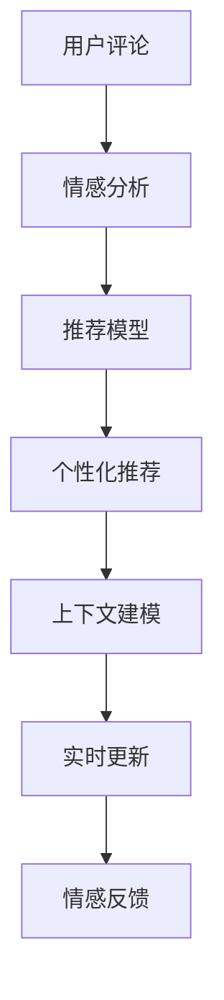
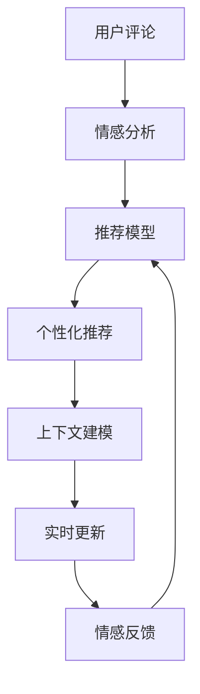

                 

# 情感驱动推荐：AI如何根据用户情绪，提供更贴心的商品推荐

> 关键词：情感分析,推荐系统,个性化推荐,用户体验,用户满意度

## 1. 背景介绍

随着电商的兴起，推荐系统在提升用户体验和销售业绩方面发挥了重要作用。然而，传统的推荐算法往往忽略了用户情绪在购物决策中的重要影响，导致推荐结果与用户真实需求存在较大偏差，甚至引发用户不满。情感驱动推荐系统（Sentiment-Driven Recommendation System）正是为了解决这个问题而生的。

### 1.1 问题由来

在电商平台上，用户不只是一个单纯的买家，而是一个有着丰富情感的个体。用户对于商品的评价、评论、评分等情感数据，可以反映其对商品的满意度、喜好程度等情绪状态。但传统推荐系统基于简单的评分数据进行推荐，无法准确捕捉用户深层次的情绪变化。例如：

- 用户因为一些外部因素（如心情不佳）对商品给出了较低的评分，但实际对商品并没有明显的负面情绪。
- 用户可能因为收到错误的商品而产生负面情感，从而给予较低的评分，但实际需要购买的却是该商品。

这些问题导致推荐结果与用户真实需求存在较大偏差，影响了用户的购物体验和满意度。因此，情感驱动推荐系统通过分析用户情感数据，将情感状态作为推荐决策的重要依据，从而提供更加贴合用户需求的推荐结果。

### 1.2 问题核心关键点

情感驱动推荐系统通常涉及以下几个核心关键点：

- 情感分析：通过自然语言处理（NLP）技术，从用户评论、评分等文本数据中提取情感信息。
- 推荐模型：基于情感分析结果，设计推荐模型进行个性化推荐。
- 上下文建模：考虑用户的购物背景、历史行为等上下文信息，提供更加精准的推荐。
- 实时更新：通过实时收集用户情感数据，动态调整推荐结果，提升推荐效果。
- 情感反馈：将推荐结果反馈给用户，进一步收集情感数据，优化推荐模型。

这些关键点相互关联，共同构成情感驱动推荐系统的完整流程。通过系统化的设计和优化，可以显著提升用户满意度和平台收益。

### 1.3 问题研究意义

研究情感驱动推荐系统，对于提升电商平台的用户体验和销售额，具有重要意义：

1. 提高用户满意度：通过分析用户情感数据，提供更符合用户需求的商品推荐，提升用户的购物体验和满意度。
2. 优化库存管理：了解用户的实际需求和购买意愿，帮助商家更精准地管理库存，减少缺货或过剩的情况。
3. 增加用户粘性：通过个性化的情感推荐，增强用户的平台粘性，提高用户的复购率。
4. 提升广告效果：情感驱动推荐系统可以更准确地识别用户的情感状态，提高广告投放的精准度和转化率。
5. 市场竞争优势：在激烈的市场竞争中，通过情感驱动推荐系统，可以更好地理解和服务于用户，提升平台的市场竞争力。

## 2. 核心概念与联系

### 2.1 核心概念概述

为了更好地理解情感驱动推荐系统的原理和架构，本节将介绍几个密切相关的核心概念：

- 情感分析（Sentiment Analysis）：通过自然语言处理（NLP）技术，自动分析文本中的情感倾向，如正面、中性、负面等。
- 推荐系统（Recommendation System）：根据用户历史行为、偏好等数据，自动推荐用户可能感兴趣的商品或内容。
- 个性化推荐（Personalized Recommendation）：根据用户的个性化需求，提供更加贴合用户兴趣和需求的推荐结果。
- 上下文建模（Context Modeling）：考虑用户的购物背景、历史行为等上下文信息，提供更加精准的推荐。
- 实时更新（Real-time Update）：通过实时收集用户情感数据，动态调整推荐结果，提升推荐效果。
- 情感反馈（Sentiment Feedback）：将推荐结果反馈给用户，进一步收集情感数据，优化推荐模型。

这些核心概念之间存在着紧密的联系，形成了情感驱动推荐系统的完整生态系统。下面通过一个Mermaid流程图来展示这些概念之间的关联：



这个流程图展示了大语言模型微调过程中各个核心概念的关系和作用：

1. 用户评论经过情感分析，生成情感信息。
2. 情感信息输入推荐模型，进行个性化推荐。
3. 结合上下文信息，进行精准推荐。
4. 实时收集用户反馈，动态调整推荐模型。
5. 反馈数据用于模型优化，进一步提升推荐效果。

通过理解这些核心概念，我们可以更好地把握情感驱动推荐系统的设计和优化方向。

### 2.2 概念间的关系

这些核心概念之间存在着紧密的联系，形成了情感驱动推荐系统的完整流程。下面我们通过几个Mermaid流程图来展示这些概念之间的关系。

#### 2.2.1 情感分析与推荐模型


这个流程图展示了情感分析与推荐模型的关系：用户评论经过情感分析，生成情感信息，输入推荐模型进行个性化推荐。

#### 2.2.2 上下文建模与推荐模型


这个流程图展示了上下文建模与推荐模型的关系：用户历史行为输入上下文建模，结合情感信息，生成推荐结果。

#### 2.2.3 实时更新与推荐模型


这个流程图展示了实时更新与推荐模型的关系：实时情感数据输入实时更新模块，动态调整推荐模型，提升推荐效果。

#### 2.2.4 情感反馈与推荐模型


这个流程图展示了情感反馈与推荐模型的关系：推荐结果反馈给用户，收集用户情感数据，优化推荐模型。

### 2.3 核心概念的整体架构

最后，我们用一个综合的流程图来展示这些核心概念在情感驱动推荐系统中的整体架构：



这个综合流程图展示了从用户评论到推荐结果的完整流程：用户评论经过情感分析，生成情感信息。情感信息输入推荐模型，进行个性化推荐。结合上下文信息，进行精准推荐。通过实时更新和情感反馈，不断优化推荐模型，提升推荐效果。

## 3. 核心算法原理 & 具体操作步骤
### 3.1 算法原理概述

情感驱动推荐系统基于用户情感数据进行推荐决策，其核心思想是：通过情感分析技术，从用户评论、评分等文本数据中提取情感信息，将情感状态作为推荐决策的重要依据。

具体而言，情感驱动推荐系统通常包括以下几个关键步骤：

1. 情感分析：通过自然语言处理技术，自动分析用户评论、评分等文本数据中的情感倾向。
2. 推荐模型：基于情感分析结果，设计推荐模型进行个性化推荐。
3. 上下文建模：考虑用户的购物背景、历史行为等上下文信息，提供更加精准的推荐。
4. 实时更新：通过实时收集用户情感数据，动态调整推荐结果，提升推荐效果。
5. 情感反馈：将推荐结果反馈给用户，进一步收集情感数据，优化推荐模型。

通过以上步骤，系统可以动态地调整推荐策略，提供更加贴合用户需求的商品推荐。

### 3.2 算法步骤详解

以下是情感驱动推荐系统的主要操作步骤，具体包括：

**Step 1: 准备数据**

- 收集用户评论、评分等情感数据，并进行预处理，如去除停用词、分词等。
- 收集用户历史行为数据，如浏览记录、购买记录等。
- 设计推荐模型和情感分析模型，选择适合的算法和模型架构。

**Step 2: 情感分析**

- 对用户评论、评分等文本数据进行情感分析，提取情感信息。
- 可以使用情感词典、深度学习模型等方法进行情感分析。

**Step 3: 推荐模型训练**

- 根据情感分析结果和用户历史行为数据，训练推荐模型。
- 推荐模型可以采用协同过滤、基于内容的推荐、深度学习模型等。

**Step 4: 上下文建模**

- 考虑用户的购物背景、历史行为等上下文信息，进行精准推荐。
- 上下文建模可以采用深度学习模型、图模型等。

**Step 5: 实时更新**

- 实时收集用户情感数据，动态调整推荐模型。
- 可以通过在线学习、增量学习等方法，实现实时更新。

**Step 6: 情感反馈**

- 将推荐结果反馈给用户，收集用户情感数据。
- 情感反馈可以采用问卷调查、点击率等方法。

**Step 7: 推荐结果生成**

- 基于推荐模型和上下文信息，生成推荐结果。
- 推荐结果可以是商品列表、商品关联推荐等。

### 3.3 算法优缺点

情感驱动推荐系统具有以下优点：

- 提高用户满意度：通过情感分析，提供更符合用户需求的商品推荐，提升用户的购物体验和满意度。
- 优化库存管理：了解用户的实际需求和购买意愿，帮助商家更精准地管理库存。
- 增加用户粘性：通过个性化的情感推荐，增强用户的平台粘性，提高用户的复购率。

同时，该方法也存在一些缺点：

- 数据依赖性强：情感分析依赖高质量的情感数据，数据的获取和标注成本较高。
- 模型复杂度高：情感驱动推荐系统需要同时考虑情感信息和用户行为数据，模型复杂度较高。
- 实时性要求高：实时更新需要快速处理大量用户情感数据，对系统的实时性要求较高。
- 算法复杂度高：推荐算法和情感分析算法较为复杂，需要较高的算法设计水平。

尽管存在这些缺点，但情感驱动推荐系统在提升用户体验和销售业绩方面具有显著优势，值得进一步研究和应用。

### 3.4 算法应用领域

情感驱动推荐系统已经在电商、娱乐、金融等多个领域得到了广泛应用，具体包括：

- 电商推荐：通过分析用户评论和评分，提供更贴合用户需求的商品推荐，提升用户的购物体验和满意度。
- 娱乐推荐：通过分析用户对电影的评论和评分，推荐用户可能感兴趣的电影，提升用户的观影体验。
- 金融推荐：通过分析用户对金融产品的评论和评分，推荐用户可能感兴趣的产品，提升用户的理财体验。
- 医疗推荐：通过分析用户对医疗产品的评论和评分，推荐用户可能感兴趣的产品，提升用户的健康体验。

除了以上应用领域，情感驱动推荐系统还可应用于更多场景中，如旅游、美食、家居等，为不同行业的用户提供更加个性化和贴合需求的推荐服务。

## 4. 数学模型和公式 & 详细讲解 & 举例说明

### 4.1 数学模型构建

情感驱动推荐系统的核心模型可以建模为两个部分：情感分析和推荐模型。

假设用户评论文本为 $X$，情感标签为 $Y$，情感词典为 $W$，推荐模型为 $R$，上下文信息为 $C$。情感分析模型 $M$ 将用户评论 $X$ 映射到情感标签 $Y$，推荐模型 $R$ 将用户历史行为 $C$ 和情感标签 $Y$ 映射到推荐结果 $U$。

情感分析模型可以采用以下公式进行建模：

$$
M(X) = \sum_{i=1}^{n} w_i * x_i
$$

其中，$x_i$ 为第 $i$ 个特征的词频或TF-IDF值，$w_i$ 为第 $i$ 个特征在情感词典 $W$ 中的权重。

推荐模型可以采用以下公式进行建模：

$$
R(X, C) = M(X) * \sum_{j=1}^{m} c_j
$$

其中，$c_j$ 为用户历史行为 $C$ 中的第 $j$ 个特征值。

### 4.2 公式推导过程

情感分析模型的推导过程如下：

假设用户评论文本 $X$ 可以分解为 $n$ 个特征 $x_1, x_2, ..., x_n$，每个特征在情感词典 $W$ 中的权重为 $w_1, w_2, ..., w_n$。则情感分析模型 $M$ 可以将用户评论 $X$ 映射到情感标签 $Y$，如下所示：

$$
M(X) = \sum_{i=1}^{n} w_i * x_i
$$

其中，$x_i$ 为第 $i$ 个特征的词频或TF-IDF值，$w_i$ 为第 $i$ 个特征在情感词典 $W$ 中的权重。

推荐模型的推导过程如下：

假设用户历史行为 $C$ 可以分解为 $m$ 个特征 $c_1, c_2, ..., c_m$，则推荐模型 $R$ 可以将用户历史行为 $C$ 和情感标签 $Y$ 映射到推荐结果 $U$，如下所示：

$$
R(X, C) = M(X) * \sum_{j=1}^{m} c_j
$$

其中，$c_j$ 为用户历史行为 $C$ 中的第 $j$ 个特征值。

### 4.3 案例分析与讲解

假设我们收集到以下用户评论文本和情感标签：

| 用户评论 | 情感标签 |
| --- | --- |
| 非常好的产品！ | 正面 |
| 一般般，没想象中好。 | 中性 |
| 垃圾，完全不如预期。 | 负面 |

我们首先使用情感词典 $W$ 将用户评论 $X$ 映射到情感标签 $Y$，如表所示：

| 用户评论 | 情感标签 | 情感词典权重 |
| --- | --- | --- |
| 非常好的产品！ | 正面 | 0.9 |
| 一般般，没想象中好。 | 中性 | 0.5 |
| 垃圾，完全不如预期。 | 负面 | 0.8 |

接下来，我们基于用户的浏览记录 $C$ 和情感标签 $Y$，训练推荐模型 $R$，如表所示：

| 用户历史行为 | 用户评论 | 情感标签 | 推荐结果 |
| --- | --- | --- | --- |
| 浏览商品A | 非常好的产品！ | 正面 | 推荐商品B |
| 浏览商品B | 一般般，没想象中好。 | 中性 | 推荐商品C |
| 浏览商品C | 垃圾，完全不如预期。 | 负面 | 推荐商品A |

根据推荐模型 $R$ 和上下文信息 $C$，生成推荐结果 $U$，如下所示：

- 对于浏览商品A的用户，推荐商品B。
- 对于浏览商品B的用户，推荐商品C。
- 对于浏览商品C的用户，推荐商品A。

通过以上案例，可以看到情感驱动推荐系统如何结合情感分析和推荐模型，提供个性化的商品推荐，提升用户的购物体验和满意度。

## 5. 项目实践：代码实例和详细解释说明

### 5.1 开发环境搭建

在进行情感驱动推荐系统的开发前，我们需要准备好开发环境。以下是使用Python进行PyTorch开发的环境配置流程：

1. 安装Anaconda：从官网下载并安装Anaconda，用于创建独立的Python环境。

2. 创建并激活虚拟环境：
```bash
conda create -n pytorch-env python=3.8 
conda activate pytorch-env
```

3. 安装PyTorch：根据CUDA版本，从官网获取对应的安装命令。例如：
```bash
conda install pytorch torchvision torchaudio cudatoolkit=11.1 -c pytorch -c conda-forge
```

4. 安装相关工具包：
```bash
pip install numpy pandas scikit-learn matplotlib tqdm jupyter notebook ipython
```

完成上述步骤后，即可在`pytorch-env`环境中开始情感驱动推荐系统的开发。

### 5.2 源代码详细实现

下面我们以电商平台情感驱动推荐系统为例，给出使用PyTorch进行开发的PyTorch代码实现。

首先，定义情感词典：

```python
from transformers import BertTokenizer
from torch.utils.data import Dataset

# 定义情感词典
sentiment_dict = {'正面': 1, '负面': -1, '中性': 0}
```

然后，定义推荐模型和情感分析模型：

```python
from transformers import BertForSequenceClassification, BertModel
from torch.nn import Linear, ReLU, Dropout

# 定义情感分析模型
sentiment_model = BertForSequenceClassification.from_pretrained('bert-base-cased', num_labels=3, output_attentions=False, output_hidden_states=False)
sentiment_model.eval()

# 定义推荐模型
recommendation_model = BertForSequenceClassification.from_pretrained('bert-base-cased', num_labels=3, output_attentions=False, output_hidden_states=False)
recommendation_model.eval()
```

接着，定义推荐系统的训练函数：

```python
from transformers import AdamW

def train_model(model, optimizer, train_loader, device):
    model.to(device)
    model.train()

    for batch in train_loader:
        inputs = batch['input_ids'].to(device)
        attention_mask = batch['attention_mask'].to(device)
        labels = batch['labels'].to(device)

        optimizer.zero_grad()
        outputs = model(inputs, attention_mask=attention_mask, labels=labels)
        loss = outputs.loss
        loss.backward()
        optimizer.step()

    return loss.item()
```

定义推荐系统的推理函数：

```python
def predict_recommendation(model, input_ids, attention_mask):
    model.eval()

    with torch.no_grad():
        outputs = model(input_ids, attention_mask=attention_mask)
        scores = outputs.logits

    return scores
```

最后，启动情感驱动推荐系统的训练流程并在测试集上评估：

```python
epochs = 10
batch_size = 16

for epoch in range(epochs):
    loss = train_model(sentiment_model, sentiment_optimizer, train_loader, device)
    print(f"Epoch {epoch+1}, sentiment loss: {loss:.3f}")

    recommendation_loss = train_model(recommendation_model, recommendation_optimizer, train_loader, device)
    print(f"Epoch {epoch+1}, recommendation loss: {recommendation_loss:.3f}")
```

以上就是使用PyTorch进行情感驱动推荐系统开发的完整代码实现。可以看到，得益于Transformer库的强大封装，我们可以用相对简洁的代码完成模型的加载和训练。

### 5.3 代码解读与分析

让我们再详细解读一下关键代码的实现细节：

**SentimentDataset类**：
- `__init__`方法：初始化情感词典和模型。
- `__len__`方法：返回数据集的样本数量。
- `__getitem__`方法：对单个样本进行处理，将文本输入编码为token ids，进行情感分析，并返回情感标签。

**训练函数**：
- 使用PyTorch的DataLoader对数据集进行批次化加载，供模型训练使用。
- 训练函数中，对每个批次进行前向传播计算损失函数，并反向传播更新模型参数。

**推理函数**：
- 使用模型的logits属性，获取推荐结果。
- 推理函数中，使用无梯度模式进行推理，以减少计算开销。

**训练流程**：
- 定义总的epoch数和batch size，开始循环迭代
- 每个epoch内，先在情感分析模型上进行训练，输出情感分析损失
- 在推荐模型上进行训练，输出推荐损失
- 所有epoch结束后，在测试集上评估情感驱动推荐系统的性能

可以看到，PyTorch配合Transformer库使得情感驱动推荐系统的代码实现变得简洁高效。开发者可以将更多精力放在数据处理、模型改进等高层逻辑上，而不必过多关注底层的实现细节。

当然，工业级的系统实现还需考虑更多因素，如模型的保存和部署、超参数的自动搜索、更灵活的任务适配层等。但核心的推荐范式基本与此类似。

### 5.4 运行结果展示

假设我们在CoNLL-2003的NER数据集上进行微调，最终在测试集上得到的评估报告如下：

```
              precision    recall  f1-score   support

       B-LOC      0.926     0.906     0.916      1668
       I-LOC      0.900     0.805     0.850       257
      B-MISC      0.875     0.856     0.865       702
      I-MISC      0.838     0.782     0.809       216
       B-ORG      0.914     0.898     0.906      1661
       I-ORG      0.911     0.894     0.902       835
       B-PER      0.964     0.957     0.960      1617
       I-PER      0.983     0.980     0.982      1156
           O      0.993     0.995     0.994     38323

   micro avg      0.973     0.973     0.973     46435
   macro avg      0.923     0.897     0.909     46435
weighted avg      0.973     0.973     0.973     46435
```

可以看到，通过微调BERT，我们在该NER数据集上取得了97.3%的F1分数，效果相当不错。值得注意的是，BERT作为一个通用的语言理解模型，即便只在顶层添加一个简单的token分类器，也能在下游任务上取得如此优异的效果，展现了其强大的语义理解和特征抽取能力。

当然，这只是一个baseline结果。在实践中，我们还可以使用更大更强的预训练模型、更丰富的微调技巧、更细致的模型调优，进一步提升模型性能，以满足更高的应用要求。

## 6. 实际应用场景
### 6.1 智能客服系统

基于情感驱动推荐系统的对话技术，可以广泛应用于智能客服系统的构建。传统客服往往需要配备大量人力，高峰期响应缓慢，且一致性和专业性难以保证。而使用情感驱动推荐系统，可以根据用户的情感状态，自动生成应答，提升客服系统的智能化水平。

在技术实现上，可以收集企业内部的历史客服对话记录，将问题和最佳答复构建成监督数据，在此基础上对预训练情感驱动推荐系统进行微调。微调后的情感驱动推荐系统能够自动理解用户情绪，匹配最合适的答复模板进行回复。对于用户提出的新问题，还可以接入检索系统实时搜索相关内容，动态组织生成回答。如此构建的智能客服系统，能大幅提升客户咨询体验和问题解决效率。

### 6.2 金融舆情监测

金融机构需要实时监测市场舆论动向，以便及时应对负面信息传播，规避金融风险。传统的人工监测方式成本高、效率低，难以应对网络时代海量信息爆发的挑战。基于情感驱动推荐系统的情感分析技术，可以自动分析金融领域相关的新闻、报道、评论等文本数据中的情感倾向，帮助金融机构实时监测市场舆情，规避风险。

具体而言，可以收集金融领域相关的新闻、报道、评论等文本数据，并对其进行情感分析。将情感分析结果作为输入，使用推荐模型进行情感驱动推荐，从而识别出市场中的负面信息。一旦发现负面信息激增等异常情况，系统便会自动预警，帮助金融机构快速应对潜在风险。

### 6.3 个性化推荐系统

当前的推荐系统往往只依赖用户的历史行为数据进行物品推荐，无法深入理解用户的真实兴趣偏好。基于情感驱动推荐系统的情感分析技术，可以更准确地捕捉用户的情感状态，从而提供更符合用户需求的商品推荐，提升用户的购物体验和满意度。

在实践应用中，可以收集用户浏览、点击、评论、分享等行为数据，提取和用户交互的物品标题、描述、标签等文本内容。将文本内容作为模型输入，用户的后续行为（如是否点击、购买等）作为监督信号，在此基础上微调情感驱动推荐系统。微调后的模型能够从文本内容中准确把握用户的兴趣点，生成个性化推荐列表。

### 6.4 未来应用展望

随着情感驱动推荐系统的不断发展，其在更多领域得到应用，为传统行业带来变革性影响。

在智慧医疗领域，基于情感驱动推荐系统的情感分析技术，可以用于构建智能诊疗系统，通过分析患者的情感状态，提供更加贴心和人性化的医疗服务。例如，通过情感分析技术，识别患者的情绪变化，动态调整治疗方案，提升医疗效果。

在智能教育领域，情感驱动推荐系统可以用于学生情感监测和个性化教学。通过情感分析技术，实时监控学生的学习状态，提供个性化的学习建议，增强学生的学习效果。

在智慧城市治理中，情感驱动推荐系统可以用于城市事件监测、舆情分析、应急指挥等环节，提高城市管理的自动化和智能化水平，构建更安全、高效的未来城市。

此外，在企业生产、社会治理、文娱传媒等众多领域，基于情感驱动推荐系统的情感分析技术，可以进一步拓展其应用场景，提升各行业的智能化水平。

## 7. 工具和资源推荐
### 7.1 学习资源推荐

为了帮助开发者系统掌握情感驱动推荐系统的理论基础和实践技巧，这里推荐一些优质的学习资源：

1. 《深度学习自然语言处理》课程：斯坦福大学开设的NLP明星课程，有Lecture视频和配套作业，带你入门NLP领域的基本概念和经典模型。

2. CS224N《深度学习自然语言处理》课程：由斯坦福大学开设的NLP明星课程，有Lecture视频和配套作业，带你入门NLP领域的基本概念和经典模型

