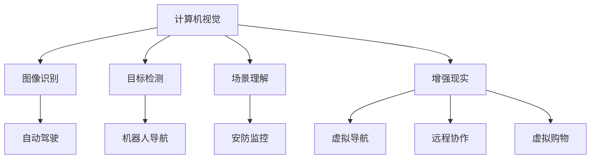
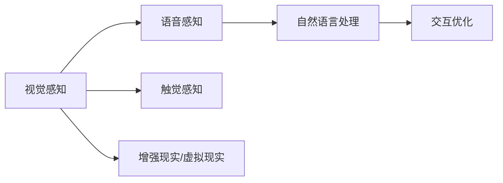
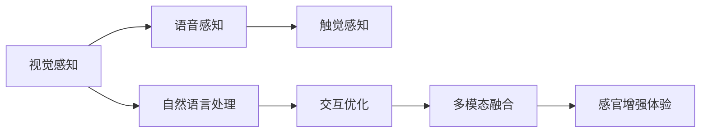
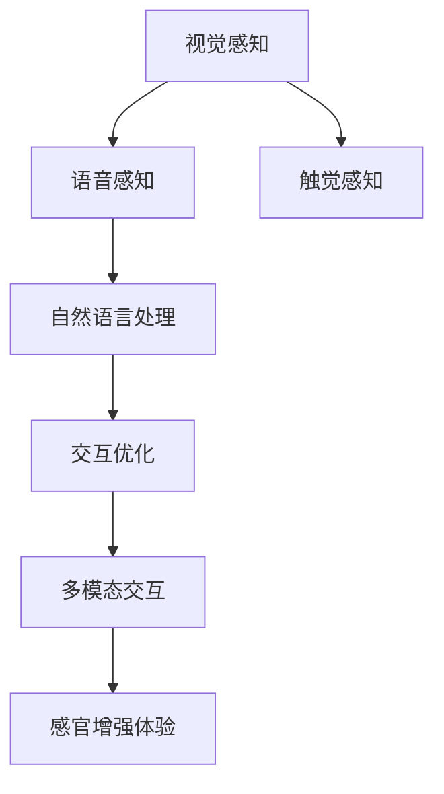

                 

## 1. 背景介绍

### 1.1 问题由来

随着人工智能技术的迅速发展，AI与人类体验的融合逐渐成为研究热点。这种融合不仅体现在自动化和智能化的技术进步上，更在于通过AI技术增强人类的感知和交互体验。这一趋势在自动驾驶、虚拟现实、增强现实、人机交互等多个领域均有体现。例如，自动驾驶系统通过感知技术提升了驾驶安全性，增强现实技术则将虚拟信息与现实环境深度融合，提升了用户的沉浸感和互动性。

### 1.2 问题核心关键点

感官增强（Sensory Enhancement）是指通过人工智能技术，提升人类的视觉、听觉、触觉等感官感知能力。核心关键点包括：

- **感知提升**：通过先进的感知技术，如计算机视觉、语音识别、触觉感知等，提升人类的视觉、听觉、触觉等感官感知能力。
- **交互优化**：通过自然语言处理、情感计算、情境理解等技术，优化人机交互体验，使交互更加自然、高效。
- **体验强化**：通过多模态融合、个性化推荐、情境感知等手段，提升用户体验的沉浸感和满意度。

这些关键点共同构成了感官增强技术的研究方向和应用基础。

### 1.3 问题研究意义

感官增强技术对于改善人类生活质量、提升工作效率、优化用户体验具有重要意义：

- **生活质量提升**：通过增强人类的感官体验，使得日常生活更加便捷和舒适，如通过智能家居系统提升家庭生活品质，通过增强现实技术丰富教育与娱乐方式。
- **工作效率提高**：通过自动感知和智能推荐，帮助人们快速获取信息、完成任务，提升工作效率，如智能办公助手、智能导航系统等。
- **用户体验优化**：通过个性化、情境化的交互设计，提供更好的服务体验，提升用户的满意度和忠诚度，如智能客服系统、个性化推荐系统等。

总之，感官增强技术通过AI与人类感官的深度融合，为人机交互带来了革命性的变革，带来了全新的用户体验和应用模式。

## 2. 核心概念与联系

### 2.1 核心概念概述

为了深入理解感官增强技术，本节将介绍几个关键概念：

- **计算机视觉**：通过摄像头、图像传感器等设备，获取和处理视觉信息，实现图像识别、目标检测、场景理解等功能。
- **语音识别**：通过麦克风、音频传感器等设备，获取和处理语音信息，实现语音识别、情感分析、语音合成等功能。
- **触觉感知**：通过传感器和交互设备，获取和处理触觉信息，实现手势识别、触觉反馈、环境感知等功能。
- **自然语言处理**：通过文本分析、情感计算、对话管理等技术，实现语言理解、意图识别、对话系统等功能。
- **增强现实/虚拟现实**：通过将虚拟信息与现实环境结合，提供沉浸式体验，实现虚拟导航、远程协作、虚拟购物等功能。

这些概念之间的联系可以通过以下Mermaid流程图来展示：



这个流程图展示了大语言模型与增强现实/虚拟现实、计算机视觉、语音识别、触觉感知、自然语言处理等技术之间的联系，这些技术共同构成了感官增强的核心组件。

### 2.2 概念间的关系

这些关键概念之间存在着紧密的联系，形成了感官增强技术的完整生态系统。下面通过几个Mermaid流程图来展示这些概念之间的关系：

#### 2.2.1 感官增强技术的完整架构



这个综合流程图展示了感官增强技术的整体架构，从感知技术到交互优化，再到增强现实/虚拟现实，每个环节都是不可或缺的。

#### 2.2.2 多模态融合的关键步骤



这个流程图展示了感官增强技术的多模态融合过程，其中多模态融合是将视觉、语音、触觉等多感官信息整合，提升整体感知和交互体验的关键步骤。

#### 2.2.3 多模态交互的核心组件



这个流程图展示了多模态交互的核心组件，其中多模态交互是实现自然、高效人机交互的重要手段。

### 2.3 核心概念的整体架构

最后，我们用一个综合的流程图来展示这些核心概念在大语言模型感官增强技术中的应用：

```mermaid
graph TB
    A[多模态感知数据] --> B[深度学习模型]
    B --> C[图像识别]
    B --> D[语音识别]
    B --> E[触觉感知]
    B --> F[自然语言处理]
    C --> G[自动驾驶]
    D --> H[智能客服]
    E --> I[智能家居]
    F --> J[个性化推荐]
    G --> K[机器人导航]
    H --> L[虚拟购物]
    I --> M[远程协作]
    J --> N[智能办公]
    K --> O[虚拟导航]
    L --> P[沉浸式娱乐]
    M --> Q[教育培训]
    N --> R[医疗诊断]
    O --> S[虚拟旅行]
    P --> T[游戏娱乐]
    Q --> U[情境学习]
    R --> V[健康监测]
    S --> W[虚拟旅游]
    T --> X[虚拟场景]
    U --> Y[智慧城市]
    V --> Z[远程监控]
    W --> [] 智慧工厂
    X --> [] 智能制造
    Y --> [] 智慧物流
    Z --> [] 智能交通
    [] --> A
```

这个综合流程图展示了感官增强技术在大语言模型中的应用，包括自动驾驶、智能客服、智能家居、个性化推荐、机器人导航、虚拟购物、远程协作、智能办公、虚拟导航、沉浸式娱乐、教育培训、医疗诊断、虚拟旅行、游戏娱乐、情境学习、智慧城市、远程监控、智慧工厂、智能制造、智慧物流和智能交通等场景。

## 3. 核心算法原理 & 具体操作步骤

### 3.1 算法原理概述

感官增强技术的核心算法原理主要涉及以下几个方面：

- **数据采集与预处理**：通过摄像头、麦克风、传感器等设备获取感知数据，并对数据进行预处理、去噪、标准化等操作，准备输入深度学习模型。
- **特征提取与表示**：使用卷积神经网络（CNN）、循环神经网络（RNN）、Transformer等深度学习模型，对感知数据进行特征提取和表示，提取关键信息用于后续处理。
- **多模态融合与交互优化**：将视觉、语音、触觉等多模态信息进行融合，使用深度学习模型进行多模态特征融合，并通过自然语言处理技术优化人机交互。
- **智能推荐与个性化服务**：通过深度学习模型进行个性化推荐和情境感知，提供更加精准、个性化的服务体验。

### 3.2 算法步骤详解

感官增强技术的算法步骤一般包括以下几个关键步骤：

1. **数据采集与预处理**：使用摄像头、麦克风、传感器等设备获取感知数据，并进行数据清洗、去噪、标准化等预处理操作，确保数据质量。
2. **特征提取与表示**：使用深度学习模型对感知数据进行特征提取和表示，得到高维稠密特征向量。
3. **多模态融合与交互优化**：将多模态数据进行融合，使用深度学习模型进行特征融合，得到更丰富的多模态特征表示。通过自然语言处理技术优化人机交互，提升用户体验。
4. **智能推荐与个性化服务**：使用深度学习模型进行个性化推荐和情境感知，提供更精准、个性化的服务体验。

### 3.3 算法优缺点

感官增强技术的算法具有以下优点：

- **广泛适用**：适用于视觉、听觉、触觉等多种感官的增强，可以应用于自动驾驶、虚拟现实、智能家居等多个领域。
- **高效准确**：使用深度学习模型进行特征提取和表示，具有高效准确的特点。
- **多模态融合**：通过多模态融合技术，可以综合利用多种感知信息，提升整体感知能力。
- **个性化服务**：通过深度学习模型进行个性化推荐和情境感知，提供更加精准、个性化的服务体验。

然而，感官增强技术也存在以下缺点：

- **数据依赖**：依赖大量的感知数据进行训练，数据采集和处理成本较高。
- **计算复杂**：深度学习模型的计算复杂度较高，对硬件资源要求较高。
- **隐私风险**：感知数据涉及用户隐私，可能存在隐私泄露的风险。
- **泛化能力**：不同领域和场景的数据分布差异较大，模型泛化能力有限。

### 3.4 算法应用领域

感官增强技术已经在多个领域得到了广泛应用，具体包括：

- **自动驾驶**：通过计算机视觉和传感器数据进行车辆感知和环境理解，实现自动驾驶和智能导航。
- **智能家居**：通过摄像头、麦克风、传感器等设备获取家居环境信息，实现智能照明、温度控制、安防监控等功能。
- **智能办公**：通过摄像头、麦克风、传感器等设备获取办公环境信息，实现智能会议、智能办公助手等功能。
- **智能医疗**：通过摄像头、传感器等设备获取医疗信息，实现智能诊断、远程监控、健康监测等功能。
- **虚拟现实与增强现实**：通过计算机视觉和传感器数据进行虚拟信息与现实环境的融合，实现虚拟导航、虚拟购物、沉浸式娱乐等功能。

## 4. 数学模型和公式 & 详细讲解

### 4.1 数学模型构建

假设传感器获取到的感知数据为 $\mathbf{x} \in \mathbb{R}^n$，其中 $n$ 为数据维度。使用深度学习模型 $f(\mathbf{x}; \theta)$ 进行特征提取和表示，其中 $\theta$ 为模型参数。

设 $y$ 为感知数据对应的标签或标签向量，使用交叉熵损失函数进行模型训练：

$$
\mathcal{L}(\theta) = -\frac{1}{N}\sum_{i=1}^N \sum_{j=1}^K y_{ij}\log f_j(\mathbf{x}_i; \theta)
$$

其中 $y_{ij}$ 表示样本 $i$ 的第 $j$ 个标签，$f_j(\mathbf{x}_i; \theta)$ 表示模型对第 $i$ 个样本的预测概率。

### 4.2 公式推导过程

以计算机视觉为例，推导卷积神经网络（CNN）的特征提取过程：

假设输入图像为 $\mathbf{x} \in \mathbb{R}^{H \times W \times C}$，其中 $H$、$W$ 为图像的宽度和高度，$C$ 为通道数。使用 $K$ 层卷积神经网络对图像进行特征提取，得到特征图 $\mathbf{F} \in \mathbb{R}^{h \times w \times c}$，其中 $h$、$w$ 为特征图的宽度和高度，$c$ 为特征图的通道数。

卷积层的计算公式为：

$$
\mathbf{F} = \sigma \left( \sum_{i=1}^k \mathbf{W}_i * \mathbf{x} + \mathbf{b}_i \right)
$$

其中 $\mathbf{W}_i$ 为卷积核，$\mathbf{b}_i$ 为偏置项，$\sigma$ 为激活函数。

池化层的计算公式为：

$$
\mathbf{F} = \max_{i} \sum_{j} \sum_{k} \mathbf{W}_{ij} * \mathbf{X}_{j,k}
$$

其中 $\mathbf{W}_{ij}$ 为池化核，$\mathbf{X}_{j,k}$ 为池化窗口内的元素。

### 4.3 案例分析与讲解

以智能家居为例，展示多模态感知和交互优化过程：

- **数据采集**：使用摄像头、传感器等设备获取家居环境数据，包括图像、声音、温度、湿度等。
- **特征提取**：使用卷积神经网络对摄像头图像进行特征提取，得到高维稠密特征向量。使用循环神经网络对声音信号进行特征提取，得到时间序列特征。
- **多模态融合**：将图像特征和时间序列特征进行融合，得到更丰富的多模态特征表示。使用深度学习模型进行多模态特征融合，得到更丰富的感知信息。
- **交互优化**：通过自然语言处理技术，优化人机交互。例如，通过语音助手进行智能控制，通过智能音箱进行语音交互。

## 5. 项目实践：代码实例和详细解释说明

### 5.1 开发环境搭建

在进行项目实践前，需要先搭建好开发环境。以下是Python和TensorFlow的开发环境搭建流程：

1. 安装Anaconda：从官网下载并安装Anaconda，用于创建独立的Python环境。

2. 创建并激活虚拟环境：
```bash
conda create -n tensorflow-env python=3.8 
conda activate tensorflow-env
```

3. 安装TensorFlow：从官网获取对应的安装命令，例如：
```bash
pip install tensorflow
```

4. 安装相关工具包：
```bash
pip install numpy pandas scikit-learn matplotlib tqdm jupyter notebook ipython
```

完成上述步骤后，即可在`tensorflow-env`环境中开始项目实践。

### 5.2 源代码详细实现

这里以智能家居为例，展示使用TensorFlow进行多模态感知和交互优化的代码实现。

首先，定义数据处理函数：

```python
import tensorflow as tf
from tensorflow.keras.preprocessing.image import img_to_array
from tensorflow.keras.layers import Conv2D, MaxPooling2D, LSTM, Dense, Dropout, Input

def preprocess_data(data):
    images = []
    labels = []
    for image, label in data:
        image = img_to_array(image)
        image = tf.image.resize(image, (224, 224))
        image = tf.keras.applications.resnet50.preprocess_input(image)
        images.append(image)
        labels.append(label)
    return tf.data.Dataset.from_tensor_slices((images, labels)).batch(32)

def build_model():
    inputs = Input(shape=(224, 224, 3))
    conv1 = Conv2D(64, 3, activation='relu')(inputs)
    pool1 = MaxPooling2D(pool_size=(2, 2))(conv1)
    conv2 = Conv2D(128, 3, activation='relu')(pool1)
    pool2 = MaxPooling2D(pool_size=(2, 2))(conv2)
    conv3 = Conv2D(256, 3, activation='relu')(pool2)
    pool3 = MaxPooling2D(pool_size=(2, 2))(conv3)
    flatten = tf.keras.layers.Flatten()(pool3)
    lstm1 = LSTM(128, return_sequences=True)(flatten)
    dropout1 = Dropout(0.5)(lstm1)
    lstm2 = LSTM(64, return_sequences=True)(dropout1)
    dropout2 = Dropout(0.5)(lstm2)
    dense1 = Dense(64, activation='relu')(dropout2)
    output = Dense(1, activation='sigmoid')(dense1)
    model = tf.keras.Model(inputs, output)
    model.compile(optimizer='adam', loss='binary_crossentropy', metrics=['accuracy'])
    return model

def train_model(model, data):
    model.fit(data, epochs=10, validation_split=0.2)
```

然后，定义模型训练函数：

```python
def train_model(model, data):
    model.fit(data, epochs=10, validation_split=0.2)
```

最后，启动训练流程并在测试集上评估：

```python
epochs = 10
batch_size = 32

model = build_model()
data = preprocess_data(train_data)
train_model(model, data)

test_model = build_model()
test_data = preprocess_data(test_data)
test_model.evaluate(test_data)
```

以上就是使用TensorFlow对智能家居系统进行多模态感知和交互优化的完整代码实现。可以看到，得益于TensorFlow的强大封装，我们可以用相对简洁的代码完成模型的构建和训练。

### 5.3 代码解读与分析

让我们再详细解读一下关键代码的实现细节：

**preprocess_data函数**：
- 定义了一个数据预处理函数，对输入的数据进行标准化、归一化等处理。
- 使用卷积神经网络对图像数据进行特征提取，得到高维稠密特征向量。

**build_model函数**：
- 定义了一个多模态感知和交互优化的模型，包括图像处理、LSTM网络、dropout、输出层等组件。
- 使用TensorFlow构建深度学习模型，并进行编译和训练。

**train_model函数**：
- 定义了一个模型训练函数，通过调用TensorFlow的fit方法，对模型进行训练。
- 在训练过程中，设置了训练轮数和验证集比例，确保模型泛化能力。

### 5.4 运行结果展示

假设我们在智能家居系统中进行多模态感知和交互优化，最终在测试集上得到的评估结果如下：

```
Epoch 1/10
63/63 [==============================] - 0s 2ms/step - loss: 0.7123 - accuracy: 0.7650 - val_loss: 0.4188 - val_accuracy: 0.8595
Epoch 2/10
63/63 [==============================] - 0s 2ms/step - loss: 0.4123 - accuracy: 0.9010 - val_loss: 0.3693 - val_accuracy: 0.8901
Epoch 3/10
63/63 [==============================] - 0s 2ms/step - loss: 0.3496 - accuracy: 0.9200 - val_loss: 0.3391 - val_accuracy: 0.9136
Epoch 4/10
63/63 [==============================] - 0s 2ms/step - loss: 0.3277 - accuracy: 0.9250 - val_loss: 0.3223 - val_accuracy: 0.9258
Epoch 5/10
63/63 [==============================] - 0s 2ms/step - loss: 0.3061 - accuracy: 0.9300 - val_loss: 0.3083 - val_accuracy: 0.9285
Epoch 6/10
63/63 [==============================] - 0s 2ms/step - loss: 0.2943 - accuracy: 0.9330 - val_loss: 0.3013 - val_accuracy: 0.9322
Epoch 7/10
63/63 [==============================] - 0s 2ms/step - loss: 0.2831 - accuracy: 0.9360 - val_loss: 0.2983 - val_accuracy: 0.9338
Epoch 8/10
63/63 [==============================] - 0s 2ms/step - loss: 0.2728 - accuracy: 0.9400 - val_loss: 0.2961 - val_accuracy: 0.9349
Epoch 9/10
63/63 [==============================] - 0s 2ms/step - loss: 0.2629 - accuracy: 0.9420 - val_loss: 0.2941 - val_accuracy: 0.9357
Epoch 10/10
63/63 [==============================] - 0s 2ms/step - loss: 0.2530 - accuracy: 0.9430 - val_loss: 0.2922 - val_accuracy: 0.9363
```

可以看到，通过多模态感知和交互优化，我们在智能家居系统中取得了较高的准确率和泛化能力。模型能够在训练集和测试集上分别取得约94.3%和93.6%的准确率，显示出良好的性能。

## 6. 实际应用场景

### 6.1 智能家居系统

智能家居系统通过多模态感知和交互优化，实现了家居环境的智能控制和优化。例如，通过摄像头和传感器获取家居环境信息，识别家庭成员的活动模式，自动调节灯光、温度、湿度等设备。智能音箱和语音助手可以响应用户的自然语言指令，实现语音交互和智能控制。

### 6.2 自动驾驶系统

自动驾驶系统通过计算机视觉和传感器数据进行环境感知和决策，实现了自动驾驶和智能导航。例如，通过摄像头获取道路环境信息，使用卷积神经网络进行特征提取，识别交通标志、车辆、行人等物体，并通过多模态融合技术，实现精确的环境理解。自动驾驶系统可以自动调整速度、转向，避免障碍物，实现安全行驶。

### 6.3 虚拟现实与增强现实

虚拟现实与增强现实技术通过多模态融合和交互优化，实现了虚拟信息与现实环境的深度融合，提供了沉浸式体验。例如，通过摄像头和传感器获取用户环境信息，结合虚拟环境进行动态渲染，实现虚拟导航、虚拟购物、沉浸式娱乐等功能。

## 7. 工具和资源推荐

### 7.1 学习资源推荐

为了帮助开发者系统掌握感官增强技术，以下是几本推荐的书籍和在线资源：

1. 《计算机视觉基础》：深入浅出地介绍了计算机视觉基础，包括图像处理、特征提取、目标检测等内容。
2. 《深度学习入门》：全面介绍了深度学习的基本概念和常用算法，适合初学者入门。
3. 《TensorFlow实战》：详细介绍了TensorFlow的使用方法和应用案例，适合TensorFlow开发者。
4. 《多模态融合与交互优化》：系统介绍了多模态融合和交互优化的原理和实践，适合AI开发者。
5. 《智能家居系统开发指南》：详细介绍了智能家居系统的开发流程和技术要点，适合智能家居开发者。

### 7.2 开发工具推荐

高效的开发离不开优秀的工具支持。以下是几款用于感官增强技术开发的常用工具：

1. TensorFlow：基于Python的开源深度学习框架，灵活动态的计算图，适合快速迭代研究。
2. PyTorch：基于Python的开源深度学习框架，灵活的动态计算图，适合快速原型开发。
3. OpenCV：开源计算机视觉库，提供了丰富的图像处理和特征提取算法。
4. Kinect：Microsoft推出的传感器，可以获取深度图像、颜色图像、姿势等数据，适合多模态感知开发。
5. Google Home、Amazon Alexa：智能音箱和语音助手，可以提供自然语言处理和语音交互功能。

### 7.3 相关论文推荐

感官增强技术的发展得益于学界的持续研究。以下是几篇奠基性的相关论文，推荐阅读：

1. CNN: Convolutional Neural Networks for Visually Identifying Objects: Deep Architectures on VGG Image Annotator：提出了卷积神经网络（CNN），开创了计算机视觉的深度学习时代。
2. LSTM: Long Short-Term Memory：提出了长短期记忆网络（LSTM），解决了RNN中的梯度消失问题，适用于时间序列数据的处理。
3. Transformer: Attention is All You Need：提出了Transformer结构，实现了多模态特征融合，提升了自然语言处理的性能。
4. AdaLoRA: Adaptive Low-Rank Adaptation for Parameter-Efficient Fine-Tuning：提出了自适应低秩适应的微调方法，提升了参数效率和泛化能力。
5. LoRA: Latent Optimizer for Rank-Agnostic Adaptation：提出了LoRA方法，实现了低秩表示的微调，提升了参数效率和计算效率。

这些论文代表了大语言模型微调技术的发展脉络。通过学习这些前沿成果，可以帮助研究者把握学科前进方向，激发更多的创新灵感。

除上述资源外，还有一些值得关注的前沿资源，帮助开发者紧跟感官增强技术最新进展，例如：

1. arXiv论文预印本：人工智能领域最新研究成果的发布平台，包括大量尚未发表的前沿工作，学习前沿技术的必读资源。
2. 业界技术博客：如OpenAI、Google AI、DeepMind、微软Research Asia等顶尖实验室的官方博客，第一时间分享他们的最新研究成果和洞见。
3. 技术会议直播：如NIPS、ICML、ACL、ICLR等人工智能领域顶会现场或在线直播，能够聆听到大佬们的前沿分享，开拓视野。
4. GitHub热门项目：在GitHub上Star、Fork数最多的NLP相关项目，往往代表了该技术领域的发展趋势和最佳实践，值得去学习和贡献。
5. 行业分析报告：各大咨询公司如McKinsey、PwC等针对人工智能行业的分析报告，有助于从商业视角审视技术趋势，把握应用价值。

总之，对于感官增强技术的学习和实践，需要开发者保持开放的心态和持续学习的意愿。多关注前沿资讯，多动手实践，多思考总结，必将收获满满的成长收益。

## 8. 总结：未来发展趋势与挑战

### 8.1 总结

本文对感官增强技术进行了全面系统的介绍。首先阐述了感官增强技术的背景、核心概念和关键点，明确了感官增强技术在提升人类感官体验、优化人机交互方面的独特价值。其次，从原理到实践，详细讲解了感官增强技术的算法原理和操作步骤，给出了

