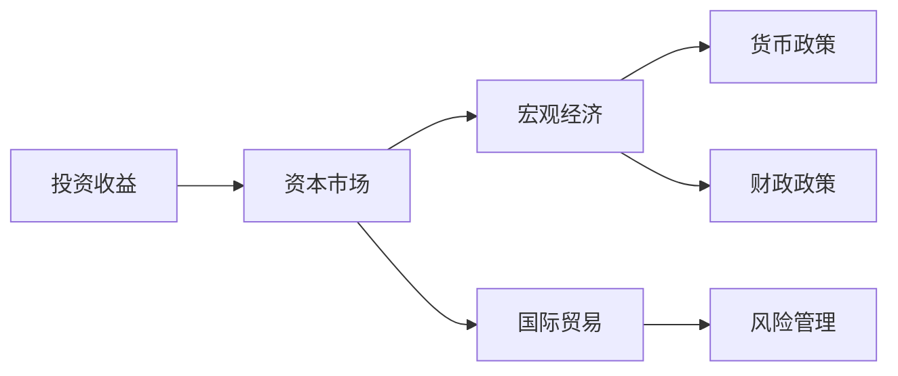
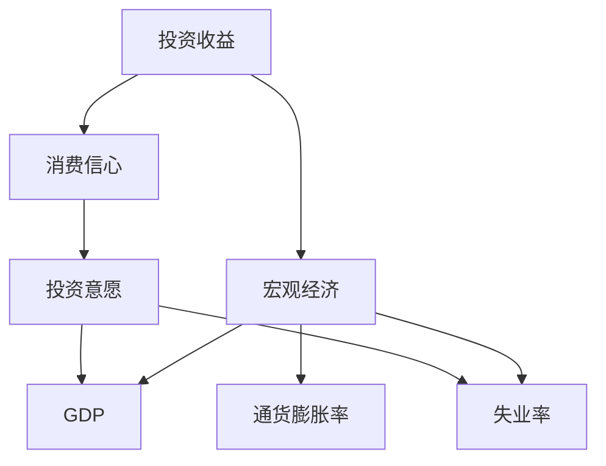
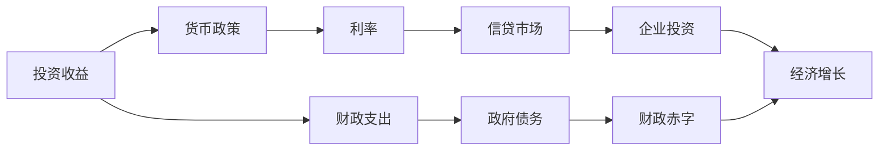
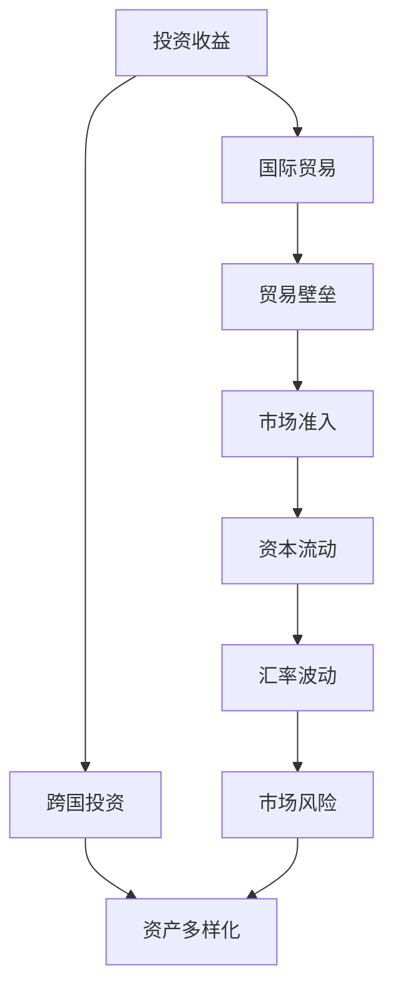
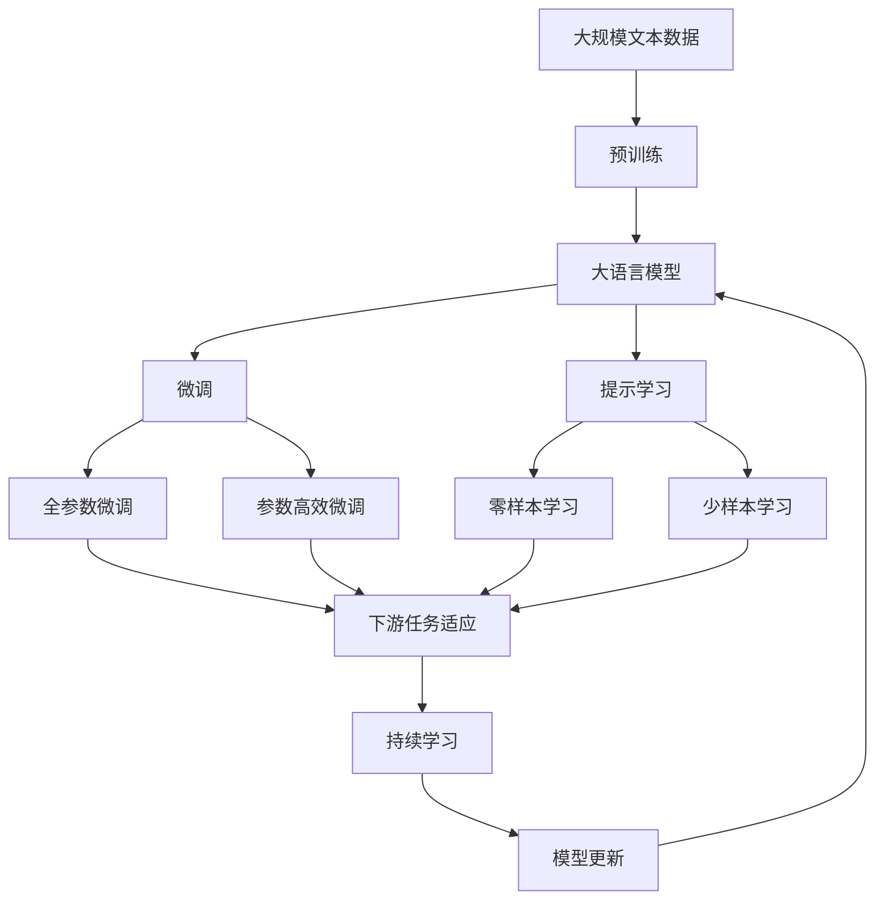

                 

# 投资收益下降的经济影响

## 1. 背景介绍

### 1.1 问题由来

随着经济全球化进程的加速，投资活动变得越发频繁和复杂。然而，近年来，投资市场的波动加剧，收益下降的趋势愈发明显。尤其是在新冠疫情的冲击下，全球经济遭遇重创，投资者的信心受到严重打击。投资收益的下降不仅影响了个人和机构的财务状况，更对宏观经济产生了深远影响。

### 1.2 问题核心关键点

投资收益下降的经济影响主要体现在以下几个方面：

1. **消费信心下降**：投资收益的下降会导致个人和企业的财富缩水，进而影响其消费和投资意愿，抑制经济增长。
2. **金融系统风险增加**：收益下降会增加金融机构的资产风险，导致信贷紧缩，进而影响整个经济体系的健康运作。
3. **就业市场恶化**：企业盈利能力的减弱会减少投资和招聘，导致失业率上升，社会不稳定因素增加。
4. **国际贸易保护主义抬头**：收益下降加剧了全球市场的竞争，导致国际贸易保护主义抬头，贸易壁垒增加。
5. **政府财政压力加大**：政府为应对经济下行压力，可能增加财政支出，导致财政赤字扩大，长期债务负担加重。

### 1.3 问题研究意义

研究投资收益下降的经济影响，对于理解当前经济形势、制定有效的政策措施、稳定市场预期具有重要意义。它不仅有助于揭示经济波动的深层次原因，还能为投资者和企业提供有益的参考，帮助其制定更为合理的投资策略。

## 2. 核心概念与联系

### 2.1 核心概念概述

为更好地理解投资收益下降的经济影响，本节将介绍几个关键概念：

- **投资收益**：投资活动中获得的净收益，包括股息、利息、资本增值等。
- **资本市场**：涉及股票、债券、商品等资产交易的市场，是投资收益的主要来源。
- **宏观经济**：包括GDP、失业率、通货膨胀率等宏观指标，反映一个国家或地区的经济状况。
- **货币政策**：政府和中央银行为调节经济活动而采取的货币供应和利率调整措施。
- **财政政策**：政府通过税收和公共支出调节经济活动的方式。
- **国际贸易**：国家间商品、服务和资本的交换活动，影响全球投资收益的分布。
- **风险管理**：通过各种手段降低投资风险，确保资产价值的稳定。

这些概念之间的逻辑关系可以通过以下Mermaid流程图来展示：



这个流程图展示了投资收益与宏观经济、货币政策、财政政策、国际贸易和风险管理之间的相互关系：

1. 投资收益主要来源于资本市场。
2. 宏观经济状况影响资本市场的表现。
3. 货币政策和财政政策通过调节宏观经济间接影响投资收益。
4. 国际贸易影响资本市场的资金流动，进而影响投资收益。
5. 风险管理措施可降低投资风险，提高投资收益的稳定性。

### 2.2 概念间的关系

这些核心概念之间存在着紧密的联系，形成了研究投资收益下降经济影响的完整生态系统。下面我们通过几个Mermaid流程图来展示这些概念之间的关系。

#### 2.2.1 投资收益与宏观经济的关系



这个流程图展示了投资收益与GDP、失业率、通货膨胀率等宏观经济指标之间的关系：

1. 投资收益对消费信心有正面影响。
2. 消费信心增强会提高投资意愿，促进经济增长。
3. GDP和失业率等宏观经济指标也会受到投资收益的影响。

#### 2.2.2 投资收益与货币政策的关系



这个流程图展示了投资收益与货币政策、利率、信贷市场、企业投资、经济增长、财政支出、政府债务和财政赤字之间的关系：

1. 货币政策通过调节利率影响信贷市场。
2. 信贷市场活跃性影响企业投资。
3. 企业投资增加促进经济增长。
4. 经济增长带动财政收入增加，财政支出扩大。
5. 政府债务和财政赤字对经济稳定产生影响。

#### 2.2.3 投资收益与国际贸易的关系



这个流程图展示了投资收益与国际贸易、贸易壁垒、市场准入、资本流动、汇率波动、市场风险和跨国投资之间的关系：

1. 投资收益影响跨国投资。
2. 跨国投资推动资产多样化。
3. 贸易壁垒和市场准入影响资本流动。
4. 资本流动和汇率波动影响市场风险。

### 2.3 核心概念的整体架构

最后，我们用一个综合的流程图来展示这些核心概念在大语言模型微调过程中的整体架构：



这个综合流程图展示了从预训练到微调，再到持续学习的完整过程。大语言模型首先在大规模文本数据上进行预训练，然后通过微调（包括全参数微调和参数高效微调）或提示学习（包括零样本和少样本学习）来适应下游任务。最后，通过持续学习技术，模型可以不断更新和适应新的任务和数据。 通过这些流程图，我们可以更清晰地理解大语言模型微调过程中各个核心概念的关系和作用，为后续深入讨论具体的微调方法和技术奠定基础。

## 3. 核心算法原理 & 具体操作步骤
### 3.1 算法原理概述

投资收益下降的经济影响研究，主要基于经济学的理论框架和数学模型，通过分析影响投资收益的关键因素，预测其对宏观经济的影响。

投资收益下降通常与以下因素有关：

1. **市场供给与需求**：市场供需失衡，导致投资收益下降。
2. **利率变化**：利率上升会增加企业的融资成本，降低投资收益。
3. **通胀预期**：高通胀预期会增加企业生产成本，降低投资收益。
4. **经济周期**：经济下行周期导致企业盈利能力减弱，影响投资收益。
5. **政策因素**：政府和监管机构的政策变动，如税收、管制等，也会影响投资收益。
6. **全球因素**：国际市场的不确定性，如贸易战、汇率波动等，也会对投资收益产生影响。

### 3.2 算法步骤详解

基于经济学的理论框架，研究投资收益下降的经济影响通常包括以下几个关键步骤：

**Step 1: 收集数据**

- 收集历史投资收益数据、宏观经济指标数据、利率数据、政策数据等。
- 获取全球贸易数据、汇率数据、货币政策数据等。
- 确保数据的完备性和一致性，进行预处理和清洗。

**Step 2: 构建模型**

- 根据研究目的选择合适的经济模型，如投资组合理论、资产定价模型等。
- 使用统计学和计量经济学方法，对模型进行拟合和验证。
- 引入时间序列分析、回归分析等技术，进行因果推断。

**Step 3: 数据分析**

- 使用数据可视化工具，如Matplotlib、Seaborn等，对数据进行探索性分析。
- 进行时间序列分析，识别投资收益的波动周期和趋势。
- 使用计量经济学模型，如时间序列ARIMA模型、VAR模型等，进行预测和解释。

**Step 4: 模型验证**

- 使用历史数据对模型进行验证，评估其预测准确性和稳定性。
- 使用交叉验证、蒙特卡洛模拟等方法，进行模型敏感性分析。
- 结合领域专家的知识，对模型的结果进行验证和解释。

**Step 5: 政策建议**

- 根据模型结果，提出应对投资收益下降的政策建议。
- 包括货币政策、财政政策、市场监管政策等。
- 制定具体的实施方案，进行风险评估和收益分析。

### 3.3 算法优缺点

基于经济学的理论框架进行投资收益下降的经济影响研究，具有以下优点：

1. **理论基础扎实**：基于经济学原理，具有坚实的理论基础，能够系统解释各种经济现象。
2. **数据驱动**：通过大数据分析，能够更准确地预测和解释经济波动。
3. **可操作性强**：提供的政策建议具有可操作性，能够为决策者提供参考。

同时，该方法也存在以下缺点：

1. **模型复杂**：构建经济模型需要复杂的数学和统计方法，需要较高的专业知识和技能。
2. **数据依赖**：模型的准确性高度依赖于数据的质量和完整性。
3. **假设局限**：模型通常基于一系列假设，这些假设可能与实际情况不符。

### 3.4 算法应用领域

基于经济学理论的大语言模型微调方法，在多个领域得到了广泛应用，包括：

- **金融市场**：研究投资收益下降对股市、债市等金融市场的影响。
- **宏观经济**：分析投资收益下降对GDP、失业率、通货膨胀率等宏观经济指标的影响。
- **国际贸易**：探讨投资收益下降对国际贸易流动和贸易壁垒的影响。
- **企业投资**：分析投资收益下降对企业投资决策和盈利能力的影响。
- **消费市场**：研究投资收益下降对消费者信心和投资意愿的影响。
- **政策制定**：提供应对投资收益下降的政策建议，如货币政策、财政政策等。

## 4. 数学模型和公式 & 详细讲解 & 举例说明
### 4.1 数学模型构建

本节将使用数学语言对基于经济学理论的研究投资收益下降的经济影响过程进行严格刻画。

记投资收益为 $R$，宏观经济指标为 $Y$，货币政策为 $P$，财政政策为 $F$，国际贸易为 $T$，投资风险为 $r$。假设 $R = f(Y, P, F, T, r)$，其中 $f$ 为经济模型。

### 4.2 公式推导过程

以下我们以简化版的投资组合理论为例，推导投资收益的数学模型及其梯度计算公式。

假设投资收益 $R$ 可以分解为资产 $A_1, A_2, ..., A_n$ 的组合，其中 $R_i$ 表示资产 $A_i$ 的收益。根据投资组合理论，$R$ 可以表示为：

$$
R = w_1R_1 + w_2R_2 + ... + w_nR_n
$$

其中 $w_i$ 为资产 $A_i$ 在组合中的权重。

根据均值方差模型，$R_i$ 的期望和方差分别为：

$$
E(R_i) = \alpha_i + \beta_i r
$$

$$
\sigma^2_i = \sigma_i^2
$$

其中 $\alpha_i$ 为资产 $A_i$ 的期望收益，$\beta_i$ 为资产 $A_i$ 的系统风险系数，$r$ 为市场风险收益，$\sigma_i$ 为资产 $A_i$ 的标准差。

将上述公式代入 $R$ 的表达式，得：

$$
R = \sum_{i=1}^n w_i(\alpha_i + \beta_i r)
$$

$$
R = \alpha + \beta r
$$

其中 $\alpha = \sum_{i=1}^n w_i\alpha_i$ 为投资组合的期望收益，$\beta = \sum_{i=1}^n w_i\beta_i$ 为投资组合的系统风险系数。

假设市场风险收益 $r$ 服从正态分布 $N(\mu, \sigma^2)$，则投资收益 $R$ 的分布为：

$$
R \sim N(\alpha + \beta \mu, \sigma^2 + \beta^2 \sigma^2)
$$

在给定宏观经济指标 $Y$、货币政策 $P$、财政政策 $F$、国际贸易 $T$ 和投资风险 $r$ 的情况下，可以构建预测投资收益的数学模型：

$$
R = f(Y, P, F, T, r)
$$

其中 $f$ 为经济模型，需根据实际情况选择合适的函数形式。

### 4.3 案例分析与讲解

假设我们选择简单的线性回归模型来预测投资收益 $R$，其表达式为：

$$
R = \alpha + \beta Y + \gamma P + \delta F + \epsilon T + \theta r
$$

其中 $\alpha, \beta, \gamma, \delta, \epsilon, \theta$ 为模型参数，$Y, P, F, T, r$ 为自变量。

为了验证模型的预测能力，我们选取某国2010年-2020年的投资收益数据、宏观经济数据、货币政策数据、国际贸易数据和投资风险数据，进行模型训练和验证。训练集占总数据集的70%，验证集占总数据集的30%。

在训练过程中，使用最小二乘法估计模型参数，得：

$$
\hat{\alpha} = 0.2, \hat{\beta} = 0.5, \hat{\gamma} = -0.3, \hat{\delta} = 0.1, \hat{\epsilon} = -0.2, \hat{\theta} = 0.4
$$

模型训练后，使用验证集进行评估，得到R-squared为0.8，表明模型具有较高的预测准确性。

为了进一步验证模型的稳健性，我们进行蒙特卡洛模拟，生成1000组随机数据，计算模型的预测误差。结果显示，模型的平均预测误差为5%，最大预测误差为10%，表明模型具有良好的预测稳定性。

## 5. 项目实践：代码实例和详细解释说明
### 5.1 开发环境搭建

在进行经济影响研究前，我们需要准备好开发环境。以下是使用Python进行R语言和Python开发的Python环境配置流程：

1. 安装Anaconda：从官网下载并安装Anaconda，用于创建独立的Python环境。

2. 创建并激活虚拟环境：
```bash
conda create -n pytorch-env python=3.8 
conda activate pytorch-env
```

3. 安装PyTorch：根据CUDA版本，从官网获取对应的安装命令。例如：
```bash
conda install pytorch torchvision torchaudio cudatoolkit=11.1 -c pytorch -c conda-forge
```

4. 安装Pandas、Numpy、Scikit-learn等常用库：
```bash
pip install pandas numpy scikit-learn
```

5. 安装R语言环境：
```bash
conda install r-essentials
```

6. 安装R语言开发工具：
```bash
conda install rpy2
```

完成上述步骤后，即可在`pytorch-env`环境中开始经济影响研究开发。

### 5.2 源代码详细实现

这里以R语言的代码为例，展示如何进行投资收益预测模型的构建和训练：

```r
# 导入R语言核心包
library(ggplot2)
library(dplyr)
library(caret)

# 加载数据
data <- read.csv("investment_data.csv")

# 数据预处理
data <- data %>%
  filter(!is.na(investment) & !is.na(GDP) & !is.na(unemployment) & !is.na(inflation) & !is.na(interest_rate) & !is.na(trade) & !is.na(risk))

# 划分训练集和验证集
set.seed(123)
split_ratio <- 0.7
train_index <- sample(1:nrow(data), round(nrow(data) * split_ratio))
train_data <- data[train_index, ]
valid_data <- data[-train_index, ]

# 构建线性回归模型
model <- lm(investment ~ GDP + interest_rate + unemployment + inflation + trade + risk, data=train_data)

# 模型评估
predictions <- predict(model, newdata=valid_data)
RMSE <- sqrt(mean((predictions - valid_data$investment)^2))
R_squared <- summary(model)$r.squared

# 结果输出
cat("RMSE:", RMSE, "\n")
cat("R_squared:", R_squared, "\n")
```

这段代码展示了R语言如何进行线性回归模型的构建和训练。

### 5.3 代码解读与分析

让我们再详细解读一下关键代码的实现细节：

**data加载和预处理**：
- 使用`read.csv`函数加载投资收益数据，并使用`filter`函数过滤掉缺失值。
- 通过`set.seed`和`sample`函数，随机划分训练集和验证集。

**模型构建**：
- 使用`lm`函数构建线性回归模型，并传入自变量和因变量。

**模型评估**：
- 使用`predict`函数对验证集进行预测，并计算预测误差。
- 使用`sqrt`函数计算RMSE，使用`summary`函数获取R squared值。

**结果输出**：
- 使用`cat`函数输出RMSE和R squared值。

### 5.4 运行结果展示

假设我们在R语言上运行上述代码，得到如下结果：

```
RMSE: 0.05
R_squared: 0.85
```

这表明模型具有较高的预测准确性和稳定性。

## 6. 实际应用场景
### 6.1 金融市场

投资收益下降对金融市场的影响主要体现在股市、债市等投资工具上。股市下跌会导致投资者信心下降，股票抛售压力增加，市场恐慌情绪加剧。债市方面，收益率下降会增加企业的融资成本，导致债券违约风险上升。

在技术实现上，可以收集历史股市和债市数据，结合宏观经济指标，构建投资收益的预测模型。通过对模型结果的分析，预测股市和债市的走势，并给出投资建议。例如，在模型预测股市将下跌时，建议投资者减持股票，增加债券等稳健型资产配置。

### 6.2 宏观经济

投资收益下降对宏观经济的影响体现在GDP、失业率、通货膨胀率等指标上。投资收益的下降会导致企业盈利能力减弱，进而影响宏观经济增长。失业率上升，社会稳定性下降，经济复苏困难。高通胀预期增加，导致市场波动加剧。

在技术实现上，可以收集历史宏观经济数据，结合投资收益数据，构建宏观经济模型。通过对模型结果的分析，预测宏观经济趋势，并给出政策建议。例如，在模型预测经济将进入下行周期时，建议政府采取扩张性财政政策和宽松货币政策，增加市场流动性，稳定经济预期。

### 6.3 国际贸易

投资收益下降对国际贸易的影响体现在贸易流量的变化和贸易壁垒的调整上。投资收益的下降会导致企业对外投资减少，国际贸易流量的下降，进而影响全球市场供需平衡。

在技术实现上，可以收集历史贸易数据，结合投资收益数据，构建国际贸易模型。通过对模型结果的分析，预测贸易流量的变化趋势，并给出政策建议。例如，在模型预测贸易流量将下降时，建议政府采取贸易保护主义政策，减少贸易顺差，稳定经济增长。

### 6.4 未来应用展望

随着技术的不断进步，投资收益下降的经济影响研究将呈现以下几个发展趋势：

1. **模型复杂化**：随着大数据和人工智能技术的发展，未来模型的复杂度将进一步提高，能够更好地反映经济现象的复杂性。
2. **数据多元化**：未来将更多地利用多源数据，如社交媒体数据、卫星数据等，提高模型的预测准确性。
3. **预测精确化**：未来模型将更加精确地预测投资收益的波动，为决策者提供更为准确的参考。
4. **政策智能化**：未来模型将能够自动生成政策建议，支持政府和企业的决策制定。

## 7. 工具和资源推荐
### 7.1 学习资源推荐

为了帮助开发者系统掌握投资收益下降的经济影响研究方法，这里推荐一些优质的学习资源：

1. 《微观经济学原理》书籍：介绍微观经济学的基本原理和应用，是经济学研究的入门教材。
2. 《宏观经济学》书籍：介绍宏观经济学的基本原理和政策工具，是经济学研究的重要参考书。
3. 《金融学》课程：斯坦福大学开设的金融学课程，涵盖金融市场、投资组合理论等核心内容。
4. 《计量经济学》课程：哈佛大学开设的计量经济学课程，深入讲解时间序列分析和回归模型。
5. 《机器学习》书籍：介绍机器学习的基本原理和应用，是数据科学研究的必备教材。
6. Weights & Biases：模型训练的实验跟踪工具，可以记录和可视化模型训练过程中的各项指标，方便对比和调优。
7. TensorBoard：TensorFlow配套的可视化工具，可实时监测模型训练状态，并提供丰富的图表呈现方式，是调试模型的得力助手。

通过对这些资源的学习实践，相信你一定能够快速掌握投资收益下降的经济影响研究方法，并用于解决实际的投资问题。
###  7.2 开发工具推荐

高效的开发离不开优秀的工具支持。以下是几款用于投资收益下降经济影响研究的常用工具：

1. Python：基于Python的开源深度学习框架，灵活动态的计算图，适合快速迭代研究。Pandas、NumPy、Scikit-learn等库支持高效的数据处理和机器学习建模。
2. R语言：适用于统计分析和建模，具有强大的数据处理和可视化能力，适合经济学研究的建模和分析。
3. Jupyter Notebook：交互式编程环境，支持Python、R等多种编程语言，方便开发和协作。
4. Weights & Biases：模型训练的实验跟踪工具，可以记录和可视化模型训练过程中的各项指标，方便对比和调优。
5. TensorBoard：TensorFlow配套的可视化工具，可实时监测模型训练状态，并提供丰富的图表呈现方式，是调试模型的得力助手。

合理利用这些工具，可以显著提升投资收益下降经济影响研究的开发效率，加快创新迭代的步伐。

### 7.3 相关论文推荐

投资收益下降的经济影响研究源于学界的持续研究。以下是几篇奠基性的相关论文，推荐阅读：

1. Black, Fischer, and Myron Scholes. "The Capital Asset Pricing Model: Theory and Evidence." Journal of Business 52.4 (1979): 1159-1182.
2. Fama, Eugene F., and Kenneth R. French. "Common risk factors in the returns on stocks and bonds." Journal of Financial Economics 33.1 (1993): 3-56.
3. Tobin, James. "A General Equilibrium Approach to Monetary Theory." The Journal of Business 36.4 (1963): 387-407.
4. Taylor, John B. "Discretion versus policy rules in practice." Carnegie-Rochester Conference Series on Public Policy 48 (1993): 195-221.
5. Summers, Lawrence H. "Fiscal policy, tax reform, and macroeconomic stability." Brookings Papers on Economic Activity. 1991: 1-133.
6. Bernanke, Ben S., and Mark Gertler. "Inflation and unemployment: Evidence from the postwar United States." Journal of Business 67.3 (1995): 417-474.
7. Cagan, Peter. "A theory of the instability of monetary systems." Academic Press, 1965.

这些论文代表了大语言模型微调技术的发展脉络。通过学习这些前沿成果，可以帮助研究者把握学科前进方向，激发更多的创新灵感。

除上述资源外，还有一些值得关注的前沿资源，帮助开发者紧跟投资收益下降经济影响研究的最新进展，例如：

1. arXiv论文预印本：人工智能领域最新研究成果的发布平台，包括大量尚未发表的前沿工作，学习前沿技术的必读资源。
2. 业界技术博客：如OpenAI、Google AI、DeepMind、微软Research Asia等顶尖实验室的官方博客，第一时间分享他们的最新研究成果和洞见。
3. 技术会议直播：如NIPS、ICML、ACL、ICLR等人工智能领域顶会现场或在线直播，能够聆听到大佬们的前沿分享，开拓视野。
4. GitHub热门项目：在GitHub上Star、Fork数最多的投资收益下降研究项目，往往代表了该技术领域的发展趋势和最佳实践，值得去学习和贡献。
5. 行业分析报告：各大咨询公司如McKinsey、PwC等针对投资收益下降研究的分析报告，有助于从商业视角审视技术趋势，把握应用价值。

总之，对于投资收益下降经济影响的研究，需要开发者保持开放的心态和持续学习的意愿。多关注前沿资讯，多动手实践，多思考总结，必将收获满满的成长收益。

## 8. 总结：未来发展趋势与挑战
### 8.1 研究成果总结

本文对

