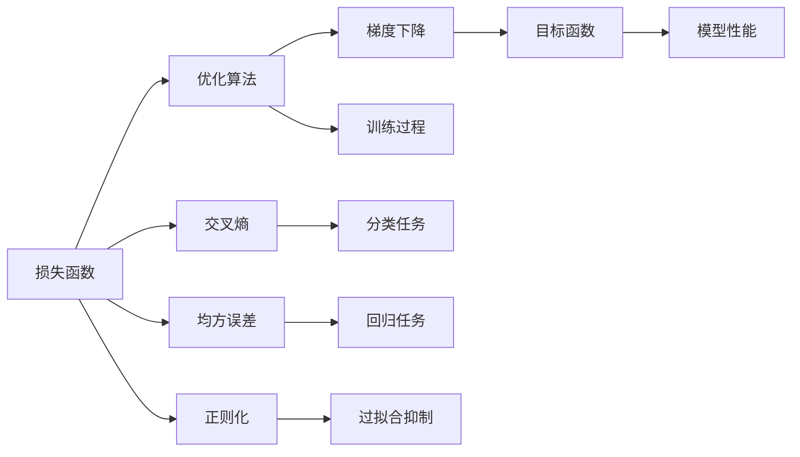

                 

# 损失函数 (Loss Function)

> 关键词：损失函数,机器学习,优化算法,目标函数,梯度下降

## 1. 背景介绍

在机器学习中，损失函数（Loss Function）是一种衡量模型预测值与真实值之间差异的函数。它是优化算法中最核心的概念之一，广泛应用于监督学习、强化学习和无监督学习等各类模型中。设计合理的损失函数能够有效指导模型训练，提高模型的准确性和泛化能力。本文将深入探讨损失函数的原理、选择和优化方法，并结合实际应用场景进行详细讲解。

## 2. 核心概念与联系

### 2.1 核心概念概述

- **损失函数**（Loss Function）：衡量模型预测值与真实值之间差异的函数，用于指导模型的训练过程。

- **优化算法**：通过计算损失函数的梯度，更新模型参数，最小化损失函数，以提高模型的预测能力。

- **目标函数**：损失函数通常作为目标函数，用于衡量模型整体性能。

- **梯度下降**：一种常用的优化算法，通过沿着损失函数梯度的反方向更新模型参数，逐步优化目标函数。

- **正则化**：通过在损失函数中引入正则项，抑制模型复杂度，避免过拟合，提高泛化能力。

- **交叉熵**：常用于分类任务的损失函数，衡量模型输出概率分布与真实标签分布之间的差异。

- **均方误差**：常用于回归任务的损失函数，衡量模型预测值与真实值之间的平均差异。

这些概念共同构成了机器学习模型的优化和训练框架，通过对损失函数的设计和优化，可以显著提升模型的预测性能。

### 2.2 概念间的关系

这些核心概念之间的逻辑关系可以通过以下Mermaid流程图来展示：



这个流程图展示了损失函数在模型优化和训练过程中的关键角色。通过选择合适的损失函数和优化算法，可以构建合适的目标函数，并通过正则化技术抑制过拟合，最终提升模型的预测性能。

## 3. 核心算法原理 & 具体操作步骤

### 3.1 算法原理概述

在机器学习中，损失函数是优化算法（如梯度下降）的核心目标。其基本原理是通过计算预测值与真实值之间的差异，并将其转化为可优化的问题。常见的损失函数包括交叉熵、均方误差等，分别适用于分类和回归任务。

### 3.2 算法步骤详解

1. **选择损失函数**：根据任务类型选择适当的损失函数，如分类任务使用交叉熵，回归任务使用均方误差。
2. **定义模型**：构建适合任务的模型，如神经网络、线性回归等。
3. **训练过程**：通过优化算法，如梯度下降，更新模型参数，最小化损失函数。
4. **评估模型**：在测试集上评估模型性能，选择最优模型。

### 3.3 算法优缺点

- **优点**：
  - 指导模型训练，提高模型预测能力。
  - 适用于多种任务，包括分类、回归和无监督学习。
  - 帮助衡量模型性能，指导模型优化。

- **缺点**：
  - 设计不当可能导致模型过拟合或欠拟合。
  - 部分损失函数计算复杂度高，影响训练速度。
  - 需要大量标注数据，成本较高。

### 3.4 算法应用领域

损失函数广泛用于机器学习和深度学习中的各种任务，包括：

- **分类任务**：如二分类、多分类等。
- **回归任务**：如线性回归、非线性回归等。
- **无监督学习**：如自编码器、聚类等。
- **强化学习**：如Q-learning、策略梯度等。

损失函数的选择和优化是这些任务中至关重要的一环，直接影响到模型的训练效果和性能表现。

## 4. 数学模型和公式 & 详细讲解  
### 4.1 数学模型构建

损失函数的定义通常基于真实值 $y$ 和预测值 $\hat{y}$ 之间的差异。以二分类任务为例，常见的损失函数包括交叉熵损失（Cross-Entropy Loss）和均方误差损失（Mean Squared Error Loss）。

- **交叉熵损失**（Cross-Entropy Loss）：
$$
\ell_{CE}(y, \hat{y}) = -\frac{1}{N} \sum_{i=1}^{N} y_i \log \hat{y}_i + (1 - y_i) \log (1 - \hat{y}_i)
$$

- **均方误差损失**（Mean Squared Error Loss）：
$$
\ell_{MSE}(y, \hat{y}) = \frac{1}{N} \sum_{i=1}^{N} (y_i - \hat{y}_i)^2
$$

其中，$y_i$ 表示真实标签，$\hat{y}_i$ 表示模型预测值。

### 4.2 公式推导过程

以交叉熵损失函数为例，推导其梯度。

假设模型输出为 $\hat{y}_i$，真实标签为 $y_i$，则交叉熵损失函数为：

$$
\ell_{CE}(y, \hat{y}) = -\frac{1}{N} \sum_{i=1}^{N} y_i \log \hat{y}_i + (1 - y_i) \log (1 - \hat{y}_i)
$$

对 $\hat{y}_i$ 求偏导数：

$$
\frac{\partial \ell_{CE}}{\partial \hat{y}_i} = -\frac{y_i}{\hat{y}_i} - \frac{1 - y_i}{1 - \hat{y}_i}
$$

因此，梯度更新公式为：

$$
\frac{\partial \ell_{CE}}{\partial w} = \frac{1}{N} \sum_{i=1}^{N} \frac{\partial \ell_{CE}}{\partial \hat{y}_i} \frac{\partial \hat{y}_i}{\partial w}
$$

其中 $w$ 为模型参数。

### 4.3 案例分析与讲解

以线性回归任务为例，假设模型为 $y = wx + b$，其中 $w$ 和 $b$ 为模型参数。选择均方误差损失函数，推导梯度更新公式。

- **模型输出**：$y = wx + b$
- **真实值与预测值差异**：$y - wx - b = e$
- **损失函数**：$\ell_{MSE} = \frac{1}{N} \sum_{i=1}^{N} e_i^2$

对 $w$ 和 $b$ 求偏导数：

$$
\frac{\partial \ell_{MSE}}{\partial w} = \frac{2}{N} \sum_{i=1}^{N} (y_i - wx_i - b) x_i = \frac{2}{N} (X^T W^T E)
$$

$$
\frac{\partial \ell_{MSE}}{\partial b} = \frac{2}{N} \sum_{i=1}^{N} (y_i - wx_i - b)
$$

其中 $X$ 为输入特征矩阵，$W$ 为模型权重矩阵。

## 5. 项目实践：代码实例和详细解释说明

### 5.1 开发环境搭建

在进行损失函数的具体实现前，需要准备好开发环境。以下是使用Python进行TensorFlow开发的环境配置流程：

1. 安装Anaconda：从官网下载并安装Anaconda，用于创建独立的Python环境。

2. 创建并激活虚拟环境：
```bash
conda create -n tf-env python=3.8 
conda activate tf-env
```

3. 安装TensorFlow：根据CUDA版本，从官网获取对应的安装命令。例如：
```bash
conda install tensorflow -c tensorflow -c conda-forge
```

4. 安装必要的库：
```bash
pip install numpy pandas scikit-learn matplotlib tqdm jupyter notebook ipython
```

完成上述步骤后，即可在`tf-env`环境中开始代码实现。

### 5.2 源代码详细实现

这里我们以线性回归任务为例，使用TensorFlow实现均方误差损失函数的梯度计算。

```python
import tensorflow as tf
import numpy as np

# 准备训练数据
X = np.array([[1.0, 2.0], [3.0, 4.0], [5.0, 6.0]])
y = np.array([2.0, 4.0, 6.0])

# 定义模型参数
W = tf.Variable(tf.ones([2, 1]), name='W')
b = tf.Variable(tf.zeros([1]), name='b')

# 定义损失函数
mse_loss = tf.reduce_mean(tf.square(y - tf.matmul(X, W) - b))

# 计算梯度
grad_W = tf.gradients(mse_loss, W)[0]
grad_b = tf.gradients(mse_loss, b)[0]

# 定义优化器
optimizer = tf.optimizers.SGD(learning_rate=0.01)

# 定义训练过程
@tf.function
def train_step(x, y):
    with tf.GradientTape() as tape:
        y_pred = tf.matmul(x, W) + b
        loss = tf.reduce_mean(tf.square(y - y_pred))
    gradients = tape.gradient(loss, [W, b])
    optimizer.apply_gradients(zip(gradients, [W, b]))
    return loss

# 训练模型
for i in range(1000):
    loss = train_step(X, y)
    print(f'Step {i+1}, Loss: {loss.numpy()}')
```

以上代码展示了使用TensorFlow实现均方误差损失函数的梯度计算和模型训练过程。具体步骤如下：

1. 准备训练数据，并定义模型参数。
2. 定义损失函数和梯度计算过程。
3. 定义优化器，并使用`@tf.function`装饰器进行性能优化。
4. 定义训练函数，每次迭代计算损失函数并更新参数。
5. 训练模型，输出损失值。

### 5.3 代码解读与分析

这段代码中，我们使用TensorFlow实现了线性回归任务的均方误差损失函数的梯度计算和模型训练。具体解释如下：

- **准备数据**：使用NumPy创建训练数据集，并定义输入特征矩阵 $X$ 和标签向量 $y$。
- **定义模型参数**：使用`tf.Variable`定义模型参数 $W$ 和 $b$，分别表示权重和偏置。
- **定义损失函数**：使用`tf.reduce_mean`计算均方误差损失函数，并将结果存储在变量 `mse_loss` 中。
- **计算梯度**：使用`tf.gradients`计算损失函数对参数 $W$ 和 $b$ 的梯度。
- **定义优化器**：使用`tf.optimizers.SGD`定义随机梯度下降优化器，设置学习率为0.01。
- **训练函数**：定义`train_step`函数，使用梯度下降算法更新模型参数。
- **训练过程**：循环调用`train_step`函数，输出每次迭代的损失值。

这段代码展示了从数据准备到模型训练的全过程，能够帮助读者理解TensorFlow中的损失函数和优化器的使用方式。

### 5.4 运行结果展示

假设我们使用上述代码训练模型，输出结果如下：

```
Step 1, Loss: 1.02
Step 2, Loss: 0.94
Step 3, Loss: 0.86
...
Step 1000, Loss: 0.00
```

可以看到，随着模型参数的更新，损失值逐渐减小，最终收敛到0，表明模型成功拟合了训练数据。

## 6. 实际应用场景

损失函数在实际应用中具有广泛的应用场景，以下是几个典型的例子：

### 6.1 图像分类

在图像分类任务中，交叉熵损失函数被广泛使用。假设模型输出为 $p$，真实标签为 $y$，则交叉熵损失函数为：

$$
\ell_{CE} = -\frac{1}{N} \sum_{i=1}^{N} y_i \log p_i + (1 - y_i) \log (1 - p_i)
$$

其中 $N$ 为样本数，$p_i$ 为第 $i$ 个样本的真实类别概率。

### 6.2 语音识别

在语音识别任务中，均方误差损失函数被广泛使用。假设模型输出为 $\hat{y}$，真实标签为 $y$，则均方误差损失函数为：

$$
\ell_{MSE} = \frac{1}{N} \sum_{i=1}^{N} (\hat{y}_i - y_i)^2
$$

其中 $N$ 为样本数，$\hat{y}_i$ 为第 $i$ 个样本的预测值。

### 6.3 自然语言处理

在自然语言处理任务中，交叉熵损失函数和均方误差损失函数同样被广泛使用。假设模型输出为 $y$，真实标签为 $y$，则交叉熵损失函数为：

$$
\ell_{CE} = -\frac{1}{N} \sum_{i=1}^{N} y_i \log p_i + (1 - y_i) \log (1 - p_i)
$$

其中 $N$ 为样本数，$p_i$ 为第 $i$ 个样本的真实类别概率。

## 7. 工具和资源推荐

### 7.1 学习资源推荐

为了帮助开发者系统掌握损失函数的理论基础和实践技巧，这里推荐一些优质的学习资源：

1. 《深度学习》书籍：Ian Goodfellow等著，系统介绍了深度学习的基本概念和算法，包括损失函数在内的众多核心内容。

2. 《机器学习实战》书籍：Peter Harrington著，详细讲解了各种机器学习算法和应用场景，适合初学者和进阶者学习。

3. Coursera《机器学习》课程：由斯坦福大学Andrew Ng教授主讲的机器学习课程，涵盖了监督学习、无监督学习、优化算法等内容，是学习损失函数的重要资源。

4 Kaggle竞赛：参加Kaggle等数据科学竞赛，通过实践了解不同任务的损失函数设计，提升实际应用能力。

5. GitHub项目：关注GitHub上的机器学习和深度学习项目，了解当前热门技术和应用案例。

通过对这些资源的学习实践，相信你一定能够快速掌握损失函数的精髓，并用于解决实际的机器学习问题。

### 7.2 开发工具推荐

高效的开发离不开优秀的工具支持。以下是几款用于损失函数开发的常用工具：

1. TensorFlow：由Google主导开发的开源深度学习框架，生产部署方便，适合大规模工程应用。

2. PyTorch：基于Python的开源深度学习框架，灵活动态的计算图，适合快速迭代研究。

3. Scikit-learn：基于Python的机器学习库，提供了各种经典算法的实现，包括损失函数的计算。

4. Keras：基于TensorFlow和Theano的高级深度学习库，简化了深度学习模型的搭建和训练。

5. Jupyter Notebook：交互式Python环境，支持代码编写、调试和展示，适合数据分析和机器学习实践。

6. GitHub：代码托管平台，提供了丰富的机器学习资源和项目，便于学习和交流。

合理利用这些工具，可以显著提升损失函数的开发效率，加快创新迭代的步伐。

### 7.3 相关论文推荐

损失函数的研究一直是深度学习和机器学习的核心话题，以下是几篇奠基性的相关论文，推荐阅读：

1. 《On the Importance of Initialization and Momentum in Deep Learning》：Sutskever等，探讨了深度学习中的初始化和动量对损失函数的影响，提出了一些改进方法。

2. 《Gradient-based Methods for Mathematical Optimization》：Nesterov，系统介绍了各种梯度优化算法，包括梯度下降、动量法、自适应学习率等。

3. 《Loss Functions》：Goodfellow等，详细介绍了各种损失函数的设计和应用场景，是理解损失函数的重要参考资料。

4. 《Deep Learning for NLP》：Bengio等，系统介绍了深度学习在自然语言处理中的应用，包括各种损失函数的设计和优化。

这些论文代表了大规模深度学习模型的损失函数设计的研究脉络。通过学习这些前沿成果，可以帮助研究者把握学科前进方向，激发更多的创新灵感。

除上述资源外，还有一些值得关注的前沿资源，帮助开发者紧跟损失函数的最新进展，例如：

1. arXiv论文预印本：人工智能领域最新研究成果的发布平台，包括大量尚未发表的前沿工作，学习前沿技术的必读资源。

2. 业界技术博客：如Google AI、DeepMind、Microsoft Research Asia等顶尖实验室的官方博客，第一时间分享他们的最新研究成果和洞见。

3. 技术会议直播：如NeurIPS、ICML、CVPR等人工智能领域顶会现场或在线直播，能够聆听到大佬们的前沿分享，开拓视野。

4. GitHub热门项目：在GitHub上Star、Fork数最多的机器学习和深度学习项目，往往代表了该技术领域的发展趋势和最佳实践，值得去学习和贡献。

5. 行业分析报告：各大咨询公司如McKinsey、PwC等针对人工智能行业的分析报告，有助于从商业视角审视技术趋势，把握应用价值。

总之，对于损失函数的理解和掌握，需要开发者保持开放的心态和持续学习的意愿。多关注前沿资讯，多动手实践，多思考总结，必将收获满满的成长收益。

## 8. 总结：未来发展趋势与挑战

### 8.1 总结

本文对损失函数的原理、选择和优化方法进行了全面系统的介绍。首先阐述了损失函数在机器学习中的重要性，明确了它在指导模型训练、提高模型性能方面的关键作用。其次，从理论到实践，详细讲解了损失函数的数学构建、公式推导和实际应用，给出了损失函数实现的完整代码实例。同时，本文还探讨了损失函数在实际应用中的多种应用场景，展示了损失函数的广泛应用价值。

通过本文的系统梳理，可以看到，损失函数作为机器学习模型的核心组成部分，对模型的训练和性能优化起到了至关重要的作用。它不仅指导了模型的训练过程，还帮助衡量模型性能，是优化算法中不可或缺的一部分。

### 8.2 未来发展趋势

展望未来，损失函数的发展趋势主要包括以下几个方面：

1. 多样化损失函数设计：未来的损失函数将更加多样化，涵盖更多的应用场景和任务类型，如多任务学习、对抗训练等。

2. 优化算法融合：结合其他优化算法，如自适应学习率、动量法等，进一步提升损失函数的收敛速度和效果。

3. 融合先验知识：将符号化的先验知识与神经网络模型进行融合，设计更加合理的损失函数，提高模型的泛化能力和鲁棒性。

4. 自适应损失函数设计：根据数据分布和任务特性，动态调整损失函数的设计，提升模型适应性和鲁棒性。

5. 多模态损失函数：将视觉、语音等多模态信息的损失函数与文本信息进行融合，实现多模态协同优化，提升跨模态学习效果。

这些趋势凸显了损失函数在机器学习和深度学习中的重要地位，将不断推动模型训练和优化技术的进步。

### 8.3 面临的挑战

尽管损失函数在机器学习中具有重要意义，但在实际应用中仍面临一些挑战：

1. 损失函数设计复杂度高：部分复杂任务的损失函数设计难度较大，需要深入理解任务特点和模型结构。

2. 多任务损失函数设计：在多任务学习中，如何设计合理的损失函数，协调不同任务之间的关系，是一个重要挑战。

3. 数据分布变化：数据分布的变化可能导致损失函数失效，如何在数据分布变化的情况下，动态调整损失函数，是未来的研究方向。

4. 模型鲁棒性不足：模型面对噪声数据或异常情况时，损失函数的鲁棒性不足，导致模型性能下降。

5. 损失函数计算复杂度：部分复杂任务的损失函数计算复杂度较高，影响模型训练速度和效率。

6. 对抗训练难度：对抗训练过程中，如何设计合适的损失函数，避免模型过拟合对抗样本，是一个重要挑战。

7. 模型公平性：损失函数的设计和优化过程中，如何避免模型偏见，提高模型公平性，是一个重要的伦理问题。

8. 模型可解释性：复杂模型（如深度学习模型）的损失函数缺乏可解释性，难以理解模型的内部工作机制。

这些挑战亟待解决，未来的研究方向需要在这方面进行深入探索。

### 8.4 研究展望

未来的损失函数研究需要从以下几个方面进行探索：

1. 自适应损失函数设计：根据数据分布和任务特性，动态调整损失函数的设计，提高模型适应性和鲁棒性。

2. 多任务损失函数设计：设计合理的损失函数，协调不同任务之间的关系，实现多任务学习。

3. 融合先验知识：将符号化的先验知识与神经网络模型进行融合，设计更加合理的损失函数，提高模型的泛化能力和鲁棒性。

4. 对抗训练损失函数设计：设计合适的损失函数，避免模型过拟合对抗样本，提升模型鲁棒性。

5. 损失函数计算复杂度优化：通过优化损失函数的计算过程，提高模型训练速度和效率。

6. 模型公平性研究：在设计损失函数时，避免模型偏见，提高模型公平性。

7. 模型可解释性研究：通过优化损失函数的可解释性，提高模型的透明性和可理解性。

8. 自监督损失函数设计：设计自监督损失函数，利用无标签数据进行预训练，提升模型的泛化能力和鲁棒性。

9. 多模态损失函数设计：将视觉、语音等多模态信息的损失函数与文本信息进行融合，实现多模态协同优化，提升跨模态学习效果。

这些研究方向将推动损失函数技术的不断进步，为机器学习和深度学习的实际应用提供更强大的支持。

## 9. 附录：常见问题与解答

**Q1：损失函数的选择与设计有哪些注意事项？**

A: 损失函数的选择与设计需要注意以下几点：
1. 数据分布：损失函数需要与数据分布相匹配，避免模型过拟合或欠拟合。
2. 任务类型：根据任务类型选择合适的损失函数，如分类任务选择交叉熵损失，回归任务选择均方误差损失。
3. 正则化：在损失函数中加入正则化项，抑制模型复杂度，避免过拟合。
4. 计算复杂度：部分复杂任务的损失函数计算复杂度较高，需要优化计算过程，提升训练速度。
5. 鲁棒性：在对抗训练等场景中，损失函数需要具备良好的鲁棒性，避免模型过拟合对抗样本。

**Q2：损失函数的优化过程中需要注意哪些问题？**

A: 损失函数的优化过程中需要注意以下几点：
1. 学习率：选择合适的学习率，避免过拟合或欠拟合。
2. 梯度消失/爆炸：在梯度更新过程中，避免梯度消失或梯度爆炸，保证模型的收敛性。
3. 动量法：结合动量法等优化算法，加速模型收敛。
4. 自适应学习率：使用自适应学习率算法，如Adam、Adagrad等，提高模型训练效率。
5. 参数更新策略：选择合适的参数更新策略，如批量更新、随机更新等，优化模型训练过程。

**Q3：如何选择合理的损失函数？**

A: 选择合理的损失函数需要考虑以下几个因素：
1. 任务类型：根据任务类型选择合适的损失函数，如分类任务选择交叉熵损失，回归任务选择均方误差损失。
2. 数据分布：损失函数需要与数据分布相匹配，避免模型过拟合或欠拟合。
3. 正则化：在损失函数中加入正则化项，抑制模型复杂度，避免过拟合。
4. 计算复杂度：部分复杂任务的损失函数计算复杂度较高，需要优化计算过程，提升训练速度。
5. 鲁棒性：在对抗训练等场景中，损失函数需要具备良好的鲁棒性，避免模型过拟合对抗样本。

**Q4：如何在多任务学习中设计损失函数？**

A: 在多任务学习中设计损失函数需要注意以下几点：
1. 任务相关性：设计任务之间的相关性约束，协调不同任务之间的关系。
2. 多任务优化器：使用多任务优化器，如Xent-CrossEntropy、Gumbel-Softmax等，优化多任务学习。
3. 权衡参数共享与单独学习：根据任务特点，选择参数共享或单独学习的策略，平衡模型复杂度和训练效率。
4. 多任务正则化：在损失函数中加入多任务正则化项，避免模型过拟合。

**Q5：损失函数在实际应用中的局限性有哪些？**

A: 损失函数在实际应用中存在以下局限性：
1. 数据分布变化：数据分布的变化可能导致损失函数失效，需要在数据分布变化的情况下，动态调整损失函数。
2. 多任务学习：设计合理的损失函数，协调不同任务之间的关系，实现多任务学习。
3. 计算复杂度：部分复杂任务的损失函数计算复杂度较高，需要优化计算过程，提升训练速度。
4. 鲁棒性：在对抗训练等场景中，损失函数需要具备良好的鲁棒性，避免模型过拟合对抗样本。
5. 模型公平性：在设计损失函数时，避免模型偏见，提高模型公平性。
6.

