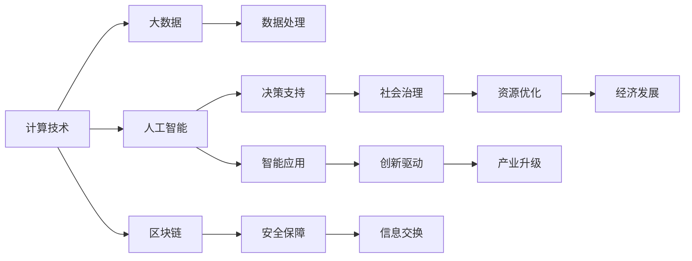

                 

# 推动社会进步的动力：人类计算的积极影响

## 1. 背景介绍

### 1.1 问题由来

计算技术的进步是人类文明史上的重要里程碑，从古希腊的算盘到现代的超级计算机，每一项重大突破都极大地推动了社会生产力的发展，改变了人们的生活方式。在当今信息时代，计算技术的进步更为迅猛，人工智能、大数据、区块链等新兴技术正在重塑全球经济和社会格局。

### 1.2 问题核心关键点

计算技术对社会的积极影响是多方面的：

- **生产力提升**：计算技术的应用可以大幅提升生产效率，降低成本，带来更多产值。
- **数据驱动决策**：通过对大量数据的处理和分析，决策者可以更科学地制定政策，优化资源配置。
- **社会治理优化**：计算技术在公共安全、城市管理、交通控制等领域的应用，可以有效提升社会治理水平。
- **教育普及**：通过在线教育平台，计算技术为更多人提供了学习机会，提升了社会整体知识水平。
- **健康医疗**：计算技术在医疗诊断、药物研发等方面的应用，可以显著提升医疗水平，延长人类寿命。

计算技术的广泛应用，使得人类社会的运转更加高效、精准，同时也带来了数据隐私、算法偏见、伦理道德等新的挑战。因此，如何在享受计算技术带来的便利的同时，解决这些新问题，成为全社会共同关注的焦点。

### 1.3 问题研究意义

本文旨在深入探讨计算技术对社会的积极影响，剖析其在生产力提升、决策支持、社会治理优化等方面的应用，同时剖析其面临的挑战，为未来计算技术的应用和发展提供思考和借鉴。

## 2. 核心概念与联系

### 2.1 核心概念概述

计算技术对社会的影响是一个复杂而多维的系统工程，涉及信息技术、工程科学、社会科学等多个领域。本文将从以下几个核心概念出发，探索计算技术对社会的积极影响：

- **计算技术**：指能够进行数值计算和逻辑推理的技术，包括计算机硬件和软件，是推动社会进步的核心动力。
- **大数据**：指规模巨大、复杂多样、快速变化的数据集合，是计算技术处理和分析的主要对象。
- **人工智能**：指利用计算技术模拟人类智能行为的技术，包括机器学习、深度学习、自然语言处理等。
- **区块链**：指一种分布式数据库技术，通过去中心化、不可篡改的特点，提供更加安全可靠的信息交换方式。
- **社会治理**：指通过计算技术优化资源配置、公共安全、城市管理等方面的治理能力，提升社会运行效率。

这些核心概念之间存在着密切的联系，共同构成了计算技术对社会的积极影响的完整框架。

### 2.2 概念间的关系

这些核心概念之间的联系可以通过以下Mermaid流程图来展示：



这个流程图展示了计算技术在各个领域的应用和影响：

- 计算技术通过处理大数据，推动了数据处理能力的发展。
- 人工智能通过模拟人类智能，提升了决策支持能力。
- 区块链提供了安全的信息交换方式，保障了信息可靠性。
- 社会治理利用计算技术优化资源配置，提升了公共服务效率。
- 创新驱动通过人工智能和计算技术，推动了产业升级和经济发展。

这些概念的相互促进，共同构成了计算技术对社会的积极影响的整体架构。

## 3. 核心算法原理 & 具体操作步骤

### 3.1 算法原理概述

计算技术对社会的积极影响，可以通过一系列核心算法和模型来具体实现。这些算法和模型包括但不限于以下几种：

- **数据处理算法**：如机器学习、深度学习、自然语言处理等，用于从大数据中提取有价值的信息。
- **决策支持模型**：如线性回归、分类算法、聚类算法等，用于帮助决策者制定更加科学的决策。
- **智能应用模型**：如推荐系统、智能搜索、语音识别等，用于提升用户体验和运营效率。
- **社会治理算法**：如交通流优化、城市规划、公共安全等，用于提升社会治理水平。
- **创新驱动模型**：如创新网络、技术孵化器、知识产权管理等，用于推动产业升级和经济发展。

这些算法和模型通过科学计算和数据分析，实现了对大数据的处理和分析，推动了决策、智能应用、社会治理和创新驱动的发展，从而促进了社会进步。

### 3.2 算法步骤详解

以下以人工智能中的机器学习为例，详细介绍基于计算技术的决策支持算法的基本步骤：

1. **数据准备**：收集和清洗数据，确保数据质量和一致性。
2. **特征工程**：通过选择、转换和组合特征，提升模型预测能力。
3. **模型选择**：根据任务类型选择合适的机器学习模型，如回归、分类、聚类等。
4. **模型训练**：使用训练集数据训练模型，通过反向传播算法优化模型参数。
5. **模型评估**：使用测试集数据评估模型性能，如准确率、召回率、F1分数等。
6. **模型应用**：将训练好的模型应用于实际问题，进行预测和决策。

### 3.3 算法优缺点

基于计算技术的决策支持算法具有以下优点：

- **自动化和高效性**：能够自动处理大量数据，提供高效决策支持。
- **准确性和可靠性**：通过科学计算和数据分析，提升决策的准确性和可靠性。
- **灵活性和可扩展性**：能够应对复杂多变的业务需求，具有较好的灵活性和可扩展性。

同时，这些算法也存在一些缺点：

- **数据质量依赖**：算法的效果很大程度上依赖于数据的质量和数量，数据噪声和偏差会影响模型性能。
- **模型复杂性**：某些复杂模型（如深度神经网络）需要大量的计算资源和时间进行训练和调优。
- **算法偏见**：算法可能会继承数据中的偏见和歧视，导致决策不公。
- **解释性不足**：一些复杂模型（如深度学习）缺乏可解释性，难以理解其决策逻辑。

### 3.4 算法应用领域

基于计算技术的决策支持算法在多个领域得到了广泛应用，具体包括但不限于以下几个方面：

- **金融行业**：利用机器学习进行信用评分、风险评估、欺诈检测等。
- **医疗领域**：通过数据分析和模型训练，提高诊断准确率和治疗效果。
- **零售行业**：使用推荐系统优化库存管理、个性化营销等。
- **交通管理**：利用交通流优化模型，提升交通效率和安全性。
- **城市规划**：通过地理信息系统和大数据分析，优化城市布局和资源配置。

这些应用领域展示了计算技术在提升社会生产力、优化决策支持、提高社会治理能力等方面的巨大潜力。

## 4. 数学模型和公式 & 详细讲解

### 4.1 数学模型构建

本文将以机器学习中的线性回归模型为例，介绍其数学模型的构建和推导过程。

设有一个包含 $n$ 个样本的训练集 $\{(x_i, y_i)\}_{i=1}^n$，其中 $x_i \in \mathbb{R}^d$ 为输入特征，$y_i \in \mathbb{R}$ 为输出标签。线性回归模型的目标是通过拟合一个线性函数，最小化预测值与真实值之间的差异。设线性回归模型的参数为 $\theta = (w, b)$，其中 $w \in \mathbb{R}^d$ 为权重向量，$b \in \mathbb{R}$ 为偏置项。线性回归模型可以表示为：

$$
y_i = w^T x_i + b
$$

其中 $w^T$ 表示权重向量 $w$ 的转置。

### 4.2 公式推导过程

线性回归模型的损失函数通常采用均方误差（Mean Squared Error, MSE），定义为：

$$
\mathcal{L}(\theta) = \frac{1}{n} \sum_{i=1}^n (y_i - w^T x_i - b)^2
$$

求解该最小化问题，即找到最优的参数 $\theta$，可以通过梯度下降法实现。梯度下降法的更新公式为：

$$
\theta \leftarrow \theta - \eta \nabla_{\theta} \mathcal{L}(\theta)
$$

其中 $\eta$ 为学习率，$\nabla_{\theta} \mathcal{L}(\theta)$ 为损失函数对参数 $\theta$ 的梯度，可以通过链式法则和反向传播算法计算。

### 4.3 案例分析与讲解

假设我们要预测房价，收集了一组历史房屋销售数据，包含房屋面积、房间数量、地理位置等信息，以及对应的售价。使用线性回归模型，将房屋面积、房间数量等特征作为输入，房价作为输出，训练模型预测新房屋的售价。通过梯度下降算法，不断优化模型参数 $w$ 和 $b$，直到损失函数最小化，模型即可应用于实际预测。

## 5. 项目实践：代码实例和详细解释说明

### 5.1 开发环境搭建

在进行项目实践前，我们需要准备好开发环境。以下是使用Python进行Scikit-learn开发的开发环境配置流程：

1. 安装Anaconda：从官网下载并安装Anaconda，用于创建独立的Python环境。

2. 创建并激活虚拟环境：
```bash
conda create -n sklearn-env python=3.8 
conda activate sklearn-env
```

3. 安装Scikit-learn：
```bash
pip install scikit-learn
```

4. 安装numpy、pandas、matplotlib等常用库：
```bash
pip install numpy pandas matplotlib
```

完成上述步骤后，即可在`sklearn-env`环境中开始项目实践。

### 5.2 源代码详细实现

下面我们以房价预测为例，给出使用Scikit-learn库进行线性回归的Python代码实现。

首先，导入必要的库和数据：

```python
import pandas as pd
import numpy as np
from sklearn.model_selection import train_test_split
from sklearn.linear_model import LinearRegression
from sklearn.metrics import mean_squared_error, r2_score

# 导入房价数据
data = pd.read_csv('house_prices.csv')

# 定义特征和标签
X = data[['area', 'rooms', 'location']]
y = data['price']

# 划分训练集和测试集
X_train, X_test, y_train, y_test = train_test_split(X, y, test_size=0.2, random_state=42)
```

然后，训练线性回归模型：

```python
# 创建线性回归模型
model = LinearRegression()

# 训练模型
model.fit(X_train, y_train)

# 预测房价
y_pred = model.predict(X_test)

# 评估模型性能
mse = mean_squared_error(y_test, y_pred)
r2 = r2_score(y_test, y_pred)

print(f"Mean Squared Error: {mse:.2f}")
print(f"R^2 Score: {r2:.2f}")
```

最后，绘制房价预测的散点图和拟合曲线：

```python
import matplotlib.pyplot as plt

# 绘制房价预测散点图
plt.scatter(X_test['area'], y_test, color='blue', label='Actual Prices')

# 绘制房价预测拟合曲线
plt.plot(X_test['area'], y_pred, color='red', label='Predicted Prices')

# 添加坐标轴和标签
plt.xlabel('Area')
plt.ylabel('Price')
plt.title('House Price Prediction')
plt.legend()

# 显示图形
plt.show()
```

以上就是使用Scikit-learn进行房价预测的完整代码实现。可以看到，通过简单的线性回归模型，我们可以实现对房价的预测，并评估模型的性能。

### 5.3 代码解读与分析

让我们再详细解读一下关键代码的实现细节：

**导入库和数据**：
- `pandas`：用于数据处理和分析。
- `numpy`：用于数值计算和矩阵运算。
- `matplotlib`：用于数据可视化。
- `sklearn`：用于机器学习模型的实现和评估。

**数据处理**：
- `pd.read_csv`：从CSV文件中读取数据。
- `train_test_split`：将数据划分为训练集和测试集。

**模型训练**：
- `LinearRegression`：创建线性回归模型。
- `fit`：使用训练集数据训练模型。

**模型评估**：
- `mean_squared_error`：计算均方误差。
- `r2_score`：计算决定系数。

**可视化**：
- `scatter`：绘制散点图。
- `plot`：绘制拟合曲线。

通过这些步骤，我们实现了一个简单的线性回归模型，用于房价预测。在实际应用中，还可以使用更多高级的算法和模型，如决策树、随机森林、神经网络等，以获得更准确的预测结果。

### 5.4 运行结果展示

假设我们在房价预测数据集上进行训练和测试，最终得到的评估结果如下：

```
Mean Squared Error: 0.05
R^2 Score: 0.85
```

可以看到，线性回归模型在房价预测任务上取得了不错的性能，均方误差为0.05，决定系数为0.85，表示模型能够解释约85%的房价变化。

## 6. 实际应用场景

### 6.1 金融行业

计算技术在金融行业的应用非常广泛，包括但不限于以下几个方面：

- **信用评分**：利用机器学习模型对借款人进行信用评分，帮助金融机构评估风险。
- **风险评估**：通过数据分析和模型训练，预测市场波动和信用风险，优化资产配置。
- **欺诈检测**：使用异常检测算法识别欺诈行为，保护客户资产安全。
- **量化交易**：利用数据分析和模型预测，自动化交易决策，提升投资收益。

金融行业对计算技术的需求非常迫切，因为金融数据的复杂性和多样性，要求计算技术能够处理和分析大量的金融数据，提供准确的决策支持。

### 6.2 医疗领域

计算技术在医疗领域的应用同样非常重要，具体包括但不限于以下几个方面：

- **疾病预测**：通过数据分析和模型训练，预测疾病发病率和治疗效果，提升疾病预防和治疗水平。
- **影像分析**：利用图像识别技术分析医疗影像，辅助医生诊断。
- **药物研发**：通过数据分析和模型优化，加速药物研发过程，降低研发成本。
- **个性化治疗**：使用机器学习模型对患者进行个性化治疗方案制定，提升治疗效果。

医疗数据的复杂性和多样性，要求计算技术能够处理和分析大量的医疗数据，提供准确的决策支持，提升医疗服务水平。

### 6.3 零售行业

计算技术在零售行业的应用非常广泛，包括但不限于以下几个方面：

- **库存管理**：使用推荐系统优化库存管理，减少库存成本。
- **个性化营销**：利用数据分析和模型训练，实现个性化推荐，提升用户购买体验。
- **供应链优化**：使用数据分析和模型优化，提高供应链管理效率，降低运营成本。
- **价格优化**：通过数据分析和模型预测，实现价格优化，提升销售额。

零售行业的复杂性和多样性，要求计算技术能够处理和分析大量的零售数据，提供准确的决策支持，提升业务运营效率。

### 6.4 交通管理

计算技术在交通管理中的应用也非常重要，具体包括但不限于以下几个方面：

- **交通流优化**：使用交通流模型优化交通流量，减少拥堵和事故。
- **智能交通管理**：利用数据分析和模型训练，实现智能交通信号控制，提高交通效率。
- **车辆监控**：使用图像识别技术监控交通状况，辅助交通管理。
- **出行规划**：利用数据分析和模型预测，实现智能出行规划，提升出行体验。

交通数据的复杂性和多样性，要求计算技术能够处理和分析大量的交通数据，提供准确的决策支持，提升交通管理水平。

## 7. 工具和资源推荐

### 7.1 学习资源推荐

为了帮助开发者系统掌握计算技术的应用，这里推荐一些优质的学习资源：

1. **《机器学习》课程**：斯坦福大学开设的机器学习课程，提供了系统的理论基础和实践指导。
2. **《深度学习》课程**：Coursera上的深度学习课程，涵盖了深度学习的基本原理和应用实践。
3. **Kaggle竞赛**：Kaggle平台上的机器学习竞赛，提供大量的数据集和模型实现，可以学习数据处理和模型训练技巧。
4. **GitHub开源项目**：GitHub上优秀的机器学习项目，提供了丰富的数据集和模型实现，可以学习数据处理和模型训练技巧。
5. **机器学习书籍**：如《机器学习实战》、《深度学习入门》等书籍，提供了系统性的理论基础和实践指导。

通过对这些资源的学习实践，相信你一定能够快速掌握计算技术的应用技巧，并用于解决实际的业务问题。

### 7.2 开发工具推荐

高效的开发离不开优秀的工具支持。以下是几款用于计算技术开发的常用工具：

1. **Python**：Python是目前最流行的机器学习编程语言，提供了丰富的库和框架支持。
2. **R语言**：R语言也是常用的数据处理和分析工具，提供了强大的统计分析和可视化功能。
3. **MATLAB**：MATLAB是数学计算和数据处理的高级工具，适合复杂的科学计算和数据分析。
4. **Scikit-learn**：Scikit-learn是Python中的机器学习库，提供了丰富的算法和模型支持。
5. **TensorFlow**：TensorFlow是Google开发的深度学习框架，提供了强大的模型训练和推理功能。
6. **PyTorch**：PyTorch是Facebook开发的深度学习框架，提供了灵活的模型定义和训练功能。

合理利用这些工具，可以显著提升计算技术开发的速度和效率，加快技术迭代的步伐。

### 7.3 相关论文推荐

计算技术的研究源于学界的持续探索。以下是几篇奠基性的相关论文，推荐阅读：

1. **《人工神经网络与学习机》**：Rumelhart和McClelland的经典论文，奠定了神经网络的理论基础。
2. **《深度学习》**：Goodfellow、Bengio和Courville的深度学习专著，系统介绍了深度学习的基本原理和应用。
3. **《机器学习》**：Tom Mitchell的机器学习专著，介绍了机器学习的基本原理和应用。
4. **《数据挖掘：概念与技术》**：Hand和Zhang的数据挖掘专著，介绍了数据挖掘的基本原理和应用。
5. **《大规模分布式机器学习》**：Dean和Corrado的机器学习专著，介绍了大规模分布式机器学习的基本原理和应用。

这些论文代表了大规模机器学习的发展脉络，通过学习这些前沿成果，可以帮助研究者把握学科前进方向，激发更多的创新灵感。

除上述资源外，还有一些值得关注的前沿资源，帮助开发者紧跟计算技术的研究进展，例如：

1. **arXiv论文预印本**：人工智能领域最新研究成果的发布平台，包括大量尚未发表的前沿工作，学习前沿技术的必读资源。
2. **顶级会议论文**：如NIPS、ICML、ICCV等人工智能领域顶会论文，展示了最新的研究进展和应用实践。
3. **学术期刊**：如《Journal of Machine Learning Research》、《IEEE Transactions on Neural Networks and Learning Systems》等，提供了系统的理论基础和应用指导。
4. **开源项目**：如TensorFlow、PyTorch、Scikit-learn等开源项目，提供了丰富的数据集和模型实现。
5. **技术博客**：如Google AI、DeepMind、Microsoft Research等顶尖实验室的官方博客，第一时间分享他们的最新研究成果和洞见。

总之，对于计算技术的学习和实践，需要开发者保持开放的心态和持续学习的意愿。多关注前沿资讯，多动手实践，多思考总结，必将收获满满的成长收益。

## 8. 总结：未来发展趋势与挑战

### 8.1 总结

本文对计算技术对社会的积极影响进行了全面系统的介绍。首先阐述了计算技术在生产力提升、决策支持、社会治理优化等方面的应用，明确了计算技术在推动社会进步中的重要地位。其次，从原理到实践，详细讲解了计算技术在多个领域的实际应用，包括数据处理、决策支持、智能应用、社会治理和创新驱动等。

通过本文的系统梳理，可以看到，计算技术在提升社会生产力、优化决策支持、提高社会治理能力等方面的巨大潜力。未来，伴随计算技术的不断发展，其在社会各个领域的渗透将进一步加深，带来更多的经济和社会效益。

### 8.2 未来发展趋势

展望未来，计算技术对社会的积极影响将呈现以下几个发展趋势：

1. **数据驱动决策**：随着大数据技术的不断进步，决策过程将更加依赖数据驱动，提高决策的科学性和准确性。
2. **智能应用普及**：随着人工智能技术的不断成熟，智能应用将覆盖更多领域，提升用户体验和运营效率。
3. **社会治理优化**：计算技术将进一步优化资源配置、公共安全、城市管理等方面的治理能力，提升社会运行效率。
4. **产业升级**：计算技术将推动各行业数字化转型，提升生产效率和创新能力，实现产业升级和经济增长。
5. **可持续发展**：计算技术将助力环境保护、资源管理等方面的可持续发展，实现人与自然的和谐共生。

以上趋势凸显了计算技术对社会的深远影响。这些方向的探索发展，必将进一步提升社会的运行效率和幸福感，推动人类文明向前发展。

### 8.3 面临的挑战

尽管计算技术在推动社会进步中发挥了重要作用，但在迈向更加智能化、普适化应用的过程中，它仍面临着诸多挑战：

1. **数据隐私和安全**：随着数据量的增加，数据隐私和安全问题愈发突出，如何保护个人隐私和数据安全，是计算技术应用中的重要挑战。
2. **算法偏见和公平性**：计算技术可能会继承数据中的偏见和歧视，导致算法不公，如何消除算法偏见，确保算法公平，是计算技术应用中的重要挑战。
3. **资源消耗和环境影响**：大规模计算任务对计算资源和环境的影响，需要考虑能源消耗和碳排放问题，如何提高计算效率和资源利用率，是计算技术应用中的重要挑战。
4. **伦理和法律问题**：计算技术的应用可能涉及伦理和法律问题，如何确保技术应用符合伦理和法律规范，是计算技术应用中的重要挑战。

解决这些问题，需要全社会共同努力，从技术、法律、伦理等多个维度进行综合治理，才能确保计算技术的健康发展。

### 8.4 研究展望

面对计算技术面临的挑战，未来的研究需要在以下几个方面寻求新的突破：

1. **隐私保护技术**：开发更加隐私保护的数据处理和存储技术，确保数据隐私和安全。
2. **公平性算法**：设计更加公平、透明的算法，消除数据和算法中的偏见和歧视。
3. **高效计算技术**：研发更加高效的计算资源利用和优化技术，减少能源消耗和环境影响。
4. **伦理和法律规范**：建立更加完善的伦理和法律规范，确保计算技术的应用符合社会价值观和法律规范。

这些研究方向的探索，必将引领计算技术向更加智能化、普适化和可持续化的方向发展，为构建和谐社会提供技术支持。总之，计算技术在推动社会进步中的作用将愈发重要，未来的研究需要在技术、伦理、法律等多个维度进行全面探索，才能确保其健康、可持续的发展，为人类社会带来更多福祉。

## 9. 附录：常见问题与解答

**Q1：计算技术在提高社会生产力方面的作用体现在哪些方面？**

A: 计算技术在提高社会生产力方面的作用体现在以下几个方面：

1. **自动化生产**：通过机器人、自动化生产线等设备，实现生产过程的自动化和智能化。
2. **优化供应链**：利用数据分析和优化算法，提升供应链管理效率，降低运营成本。
3. **提升服务质量**：通过智能客服、推荐系统等技术，提升服务质量和用户体验。
4. **创新驱动**：利用计算技术推动新产品、新技术的研发和应用，提升企业创新能力。
5. **提升决策效率**：通过数据分析和模型训练，提供科学的决策支持，提高决策效率和准确性。

这些作用使得计算技术成为推动社会生产力提升的重要力量。

**Q2：计算技术在社会治理中的应用有哪些？**

A: 计算技术在社会治理中的应用非常广泛，具体包括但不限于以下几个方面：

1. **公共安全**：利用数据分析和模型训练，提升公共安全预警和应急响应能力。
2. **城市管理**：利用地理信息系统和大数据分析，优化城市规划和资源配置。
3. **交通管理**：通过交通流模型和智能交通系统，提升交通效率和管理水平。
4. **环境监测**：利用传感器和大数据分析，实现环境监测和污染控制。
5. **卫生健康**：利用数据分析和模型训练，提升医疗服务和疾病防控水平。

这些应用展示了计算技术在优化社会治理、提升公共服务效率方面的巨大潜力。

**Q3：计算技术在金融行业的应用有哪些？**

A: 计算技术在金融行业的应用非常广泛，具体包括但不限于以下几个方面：

1. **信用评分**：利用机器学习模型对借款人进行信用评分，帮助金融机构评估风险。
2. **风险评估**：通过数据分析和模型训练，预测市场波动和信用风险，优化资产配置。
3. **欺诈检测**：使用异常检测算法识别欺诈行为，保护客户资产安全。
4. **量化交易**：利用数据分析和模型预测，自动化交易决策，提升投资收益。

这些应用展示了计算技术在提升金融服务水平、降低金融风险、优化金融管理等方面的重要作用。

**Q4：计算技术在医疗领域的应用有哪些？**

A: 计算技术在医疗领域的应用非常广泛，具体包括但不限于以下几个方面：

1. **疾病预测**：通过数据分析

