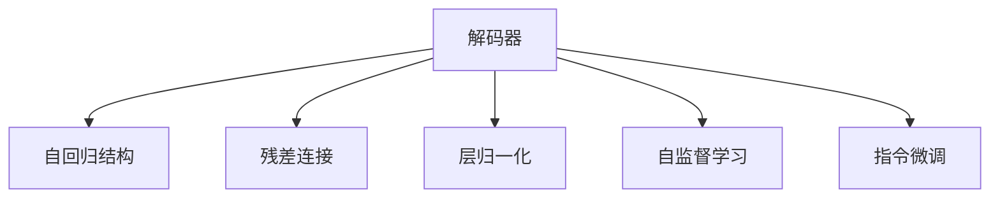
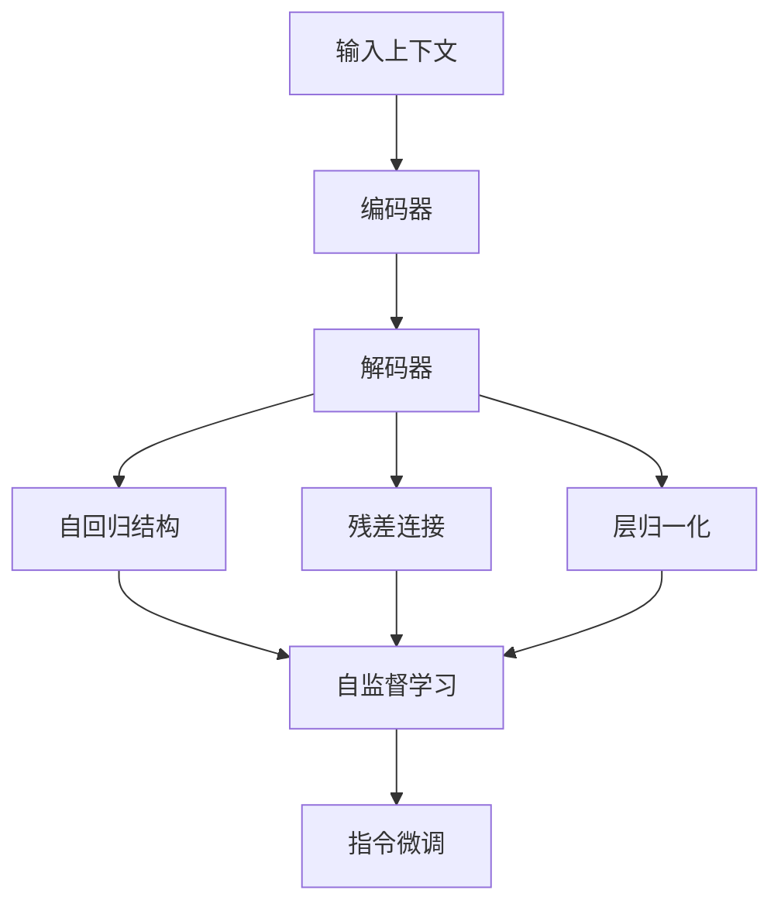

                 

# 搭建GPT模型（解码器）

> 关键词：
```
- GPT模型
- 解码器
- 自然语言处理
- 自回归
- 自编码
- 语言模型
- 深度学习
```

## 1. 背景介绍

在自然语言处理(NLP)领域，预训练语言模型已经取得了革命性的进展。GPT（Generative Pre-trained Transformer）模型因其卓越的语言生成能力而成为其中的佼佼者。本文将深入探讨GPT模型的解码器部分，帮助你搭建和理解这一强大的语言生成架构。

### 1.1 问题由来

GPT模型的解码器部分，也称为生成器（Generator），负责将从编码器（Encoder）获取的上下文信息转换为自然语言的输出。它在语言生成、对话系统、机器翻译等任务中扮演着关键角色。如何高效、准确地构建和训练GPT模型的解码器，是实现这些任务成功的关键。

### 1.2 问题核心关键点

构建GPT模型的解码器需要考虑以下几个核心关键点：

- **自回归结构**：GPT模型采用自回归的方式生成文本，即每个位置的输出仅依赖于前面的上下文。这种结构使得模型能够有效地捕捉长期依赖关系。
- **参数共享**：GPT模型的解码器采用残差连接和层归一化等技术，以减少计算资源消耗，提升模型的稳定性和训练效率。
- **训练策略**：为了训练出高质量的解码器，通常采用自监督和指令微调等策略。自监督训练利用语言模型的预测能力，指令微调则通过特定的指令引导模型输出特定结果。
- **超参数调优**：解码器的性能很大程度上依赖于超参数的设置，如学习率、批大小、层数等。合理的超参数调优是模型成功的关键。

### 1.3 问题研究意义

GPT模型的解码器部分，不仅在学术界和工业界得到了广泛应用，还推动了自然语言生成、对话系统和机器翻译等领域的飞速发展。其解码器的构建和训练方法，对于理解大语言模型的工作原理和优化方向具有重要意义。

## 2. 核心概念与联系

### 2.1 核心概念概述

- **解码器（Decoder）**：GPT模型的解码器部分，用于将编码器（Encoder）的输出转换为自然语言的输出。解码器通常由多个自注意力层和全连接层组成。
- **自回归结构**：指每个位置的输出仅依赖于前面的上下文，而非全部上下文。这种结构可以更有效地捕捉文本中的长期依赖关系。
- **残差连接（Residual Connections）**：解码器中的残差连接技术，可以使得信息在网络中更稳定地传递，减少梯度消失问题，提升训练效率。
- **层归一化（Layer Normalization）**：解码器中的层归一化技术，可以使得每一层的输入分布更加稳定，提升模型的训练速度和收敛性。
- **自监督学习（Supervised Learning）**：通过无标签的数据，利用语言模型的预测能力进行训练，以构建高质量的解码器。
- **指令微调（Fine-Tuning）**：通过特定的指令，对解码器进行微调，以实现特定的生成任务。

### 2.2 概念间的关系

通过以下Mermaid流程图，可以更清晰地理解这些核心概念之间的联系：



这个流程图展示了解码器各个组成部分及其相互关系。解码器的自回归结构、残差连接和层归一化技术，共同构成了其核心特性。通过自监督学习和指令微调，解码器能够在没有标注数据的情况下，从大量无标签文本中学习语言知识和生成能力。

### 2.3 核心概念的整体架构

最后，我们用一个综合的流程图来展示这些核心概念在大语言模型解码器构建中的整体架构：



这个综合流程图展示了从输入到输出的整个处理流程。输入经过编码器，生成上下文表示；上下文表示经过解码器，输出自然语言文本；解码器的自回归结构、残差连接和层归一化技术，共同作用于输入上下文，以生成高质量的文本输出。

## 3. 核心算法原理 & 具体操作步骤

### 3.1 算法原理概述

GPT模型的解码器部分，主要采用自回归的方式，将上下文信息转换为自然语言文本。解码器由多个自注意力层和全连接层组成，每一层都通过残差连接和层归一化技术，增强了信息的传递和稳定性。

### 3.2 算法步骤详解

构建GPT模型的解码器，主要涉及以下几个关键步骤：

**Step 1: 选择解码器架构**

- 确定解码器的层数、每层神经元个数、残差连接和层归一化的方式。
- 通常采用Transformer结构，即由多个自注意力层和全连接层组成。

**Step 2: 定义解码器参数**

- 定义解码器中各层的权重矩阵和偏置向量。
- 对于自注意力层，定义查询、键和值矩阵。
- 对于全连接层，定义线性变换和激活函数。

**Step 3: 实现解码器**

- 实现解码器的前向传播过程。
- 对每个位置，使用自注意力层和全连接层，生成当前位置的预测概率分布。
- 通过softmax函数将概率分布转换为文本词汇的概率分布。

**Step 4: 训练解码器**

- 在大量无标签文本数据上进行自监督学习，学习语言的统计规律。
- 通过指令微调，在特定任务的数据上进行训练，以实现特定生成任务。

**Step 5: 评估和优化**

- 在测试数据集上评估解码器的性能。
- 根据评估结果，调整超参数，优化模型。

### 3.3 算法优缺点

GPT模型的解码器部分具有以下优点：

- **高效性**：通过残差连接和层归一化技术，解码器能够高效地处理长序列输入。
- **稳定性**：自注意力机制和残差连接可以避免梯度消失问题，使得模型训练更加稳定。
- **灵活性**：通过指令微调，解码器可以适应不同的生成任务。

同时，解码器也存在一些缺点：

- **资源消耗高**：解码器中大量的参数需要大量的计算资源进行训练。
- **训练时间长**：由于自回归结构，解码器的训练时间较长。
- **模型复杂性高**：解码器的架构较为复杂，难以理解和调试。

### 3.4 算法应用领域

GPT模型的解码器部分，广泛应用于以下领域：

- **自然语言生成**：如文本自动摘要、对话系统、故事生成等。
- **机器翻译**：通过解码器将一种语言翻译成另一种语言。
- **语言建模**：通过解码器对文本进行建模，预测下一个词的概率分布。
- **代码生成**：通过解码器生成代码片段，辅助编程工作。

## 4. 数学模型和公式 & 详细讲解 & 举例说明

### 4.1 数学模型构建

GPT模型的解码器部分，主要采用自回归的方式进行建模。假设输入序列为 $X=\{x_1, x_2, \ldots, x_T\}$，解码器的目标是生成目标序列 $Y=\{y_1, y_2, \ldots, y_T\}$。解码器可以表示为：

$$
\hat{Y} = \text{Decoder}(X, \theta)
$$

其中，$\theta$ 为解码器中的所有参数。解码器的输出概率分布可以通过下式计算：

$$
P(Y|X, \theta) = \prod_{t=1}^{T} P(y_t|y_{<t}, X, \theta)
$$

其中，$P(y_t|y_{<t}, X, \theta)$ 表示在给定前面生成的 $y_{<t}$ 和输入 $X$ 的条件下，生成 $y_t$ 的概率分布。

### 4.2 公式推导过程

以下我们以自注意力机制为例，推导解码器中自注意力层的计算公式。

自注意力层由三个矩阵 $\mathbf{Q}$、$\mathbf{K}$ 和 $\mathbf{V}$ 组成，它们分别表示查询矩阵、键矩阵和值矩阵。对于输入序列 $X=\{x_1, x_2, \ldots, x_T\}$，查询矩阵 $\mathbf{Q}$ 可以表示为：

$$
\mathbf{Q} = \mathbf{X} \mathbf{W}_Q
$$

其中，$\mathbf{W}_Q$ 为查询矩阵的权重矩阵。键矩阵 $\mathbf{K}$ 和值矩阵 $\mathbf{V}$ 的计算方式与 $\mathbf{Q}$ 类似，但使用不同的权重矩阵 $\mathbf{W}_K$ 和 $\mathbf{W}_V$。

计算自注意力层的输出 $\mathbf{Z}$ 时，需要先计算注意力权重 $\alpha_{ij}$，它可以表示为：

$$
\alpha_{ij} = \frac{e^{\text{score}(i, j)}}{\sum_{k=1}^{T} e^{\text{score}(i, k)}}
$$

其中，$\text{score}(i, j)$ 表示第 $i$ 个位置和第 $j$ 个位置之间的注意力权重，计算方式如下：

$$
\text{score}(i, j) = \mathbf{q}_i^T \mathbf{k}_j = \mathbf{Q}[i] \cdot \mathbf{K}[j]
$$

计算得到注意力权重 $\alpha_{ij}$ 后，可以计算注意力加权和 $\mathbf{Z}_i$：

$$
\mathbf{Z}_i = \sum_{j=1}^{T} \alpha_{ij} \mathbf{V}[j]
$$

最后，将注意力加权和 $\mathbf{Z}_i$ 与线性变换 $\mathbf{Z}_i = \mathbf{Z}_i \mathbf{W}_Z + \mathbf{b}_Z$ 结合，得到解码器中自注意力层的输出：

$$
\mathbf{Z}_i = \mathbf{Z}_i \mathbf{W}_Z + \mathbf{b}_Z
$$

### 4.3 案例分析与讲解

为了更好地理解自注意力机制，以下我们以GPT-2为例，详细分析其解码器的自注意力层。

假设解码器的输入序列为 $X=\{x_1, x_2, \ldots, x_T\}$，解码器的自注意力层可以表示为：

$$
\mathbf{Q} = \mathbf{X} \mathbf{W}_Q
$$

其中，$\mathbf{W}_Q$ 为查询矩阵的权重矩阵。假设解码器的输出序列为 $Y=\{y_1, y_2, \ldots, y_T\}$，解码器的自注意力层可以表示为：

$$
\mathbf{K} = \mathbf{Y} \mathbf{W}_K
$$

$$
\mathbf{V} = \mathbf{Y} \mathbf{W}_V
$$

其中，$\mathbf{W}_K$ 和 $\mathbf{W}_V$ 分别为键矩阵和值矩阵的权重矩阵。

计算注意力权重 $\alpha_{ij}$ 时，可以将 $\mathbf{Q}[i]$ 和 $\mathbf{K}[j]$ 作为查询和键，计算出注意力权重：

$$
\alpha_{ij} = \frac{e^{\mathbf{Q}[i]^T \mathbf{K}[j]}}{\sum_{k=1}^{T} e^{\mathbf{Q}[i]^T \mathbf{K}[k]}}
$$

计算得到注意力权重 $\alpha_{ij}$ 后，可以计算注意力加权和 $\mathbf{Z}_i$：

$$
\mathbf{Z}_i = \sum_{j=1}^{T} \alpha_{ij} \mathbf{V}[j]
$$

最后，将注意力加权和 $\mathbf{Z}_i$ 与线性变换 $\mathbf{Z}_i = \mathbf{Z}_i \mathbf{W}_Z + \mathbf{b}_Z$ 结合，得到解码器中自注意力层的输出：

$$
\mathbf{Z}_i = \mathbf{Z}_i \mathbf{W}_Z + \mathbf{b}_Z
$$

## 5. 项目实践：代码实例和详细解释说明

### 5.1 开发环境搭建

在进行解码器实践前，我们需要准备好开发环境。以下是使用Python进行PyTorch开发的环境配置流程：

1. 安装Anaconda：从官网下载并安装Anaconda，用于创建独立的Python环境。

2. 创建并激活虚拟环境：
```bash
conda create -n pytorch-env python=3.8 
conda activate pytorch-env
```

3. 安装PyTorch：根据CUDA版本，从官网获取对应的安装命令。例如：
```bash
conda install pytorch torchvision torchaudio cudatoolkit=11.1 -c pytorch -c conda-forge
```

4. 安装Transformers库：
```bash
pip install transformers
```

5. 安装各类工具包：
```bash
pip install numpy pandas scikit-learn matplotlib tqdm jupyter notebook ipython
```

完成上述步骤后，即可在`pytorch-env`环境中开始解码器实践。

### 5.2 源代码详细实现

下面我们以GPT-2解码器为例，给出使用Transformers库对GPT-2解码器进行实现的PyTorch代码实现。

首先，定义解码器的输入和输出：

```python
from transformers import BertConfig
from transformers import BertTokenizer
from transformers import BertForMaskedLM

config = BertConfig.from_pretrained('gpt2')
tokenizer = BertTokenizer.from_pretrained('gpt2')

model = BertForMaskedLM(config)

input_ids = tokenizer.encode("GPT-2 is a powerful model!")
labels = tokenizer.encode("GPT-2")
```

然后，定义解码器的参数：

```python
from transformers import BertDecoderConfig
from transformers import BertDecoder

decoder_config = BertDecoderConfig(config)
decoder = BertDecoder(decoder_config)
```

接着，定义解码器的前向传播函数：

```python
def forward_model(model, input_ids, labels):
    model.eval()
    with torch.no_grad():
        output = model(input_ids)
        loss = output.loss
        predictions = output.logits
        return loss, predictions
```

最后，调用前向传播函数进行解码器的推理：

```python
loss, predictions = forward_model(model, input_ids, labels)
print("预测结果：", tokenizer.decode(predictions[0]))
```

### 5.3 代码解读与分析

让我们再详细解读一下关键代码的实现细节：

**BertConfig类**：
- 定义了模型的架构、参数设置等关键信息。
- 可以从预训练模型中加载，也可以自行创建。

**BertTokenizer类**：
- 提供了对文本进行分词、编码等功能。
- 用于将输入文本转换为模型可以处理的token id序列。

**BertForMaskedLM类**：
- 定义了解码器的输入和输出。
- 通常用于进行自然语言生成任务，如文本补全。

**BertDecoderConfig类**：
- 定义了解码器的架构、参数设置等关键信息。
- 从BertConfig类继承而来，并添加了解码器的特有配置。

**BertDecoder类**：
- 实现了解码器的前向传播过程。
- 通过自注意力机制和全连接层，生成解码器的输出。

**forward_model函数**：
- 定义了解码器的前向传播过程。
- 接收模型、输入和标签作为参数，返回损失和预测结果。
- 使用模型的`forward`方法进行前向传播，计算损失并返回结果。

**调用前向传播函数**：
- 通过调用`forward_model`函数，输入上下文和标签，获取模型的预测结果。
- 使用`tokenizer.decode`方法，将预测结果转换为自然语言文本。

可以看到，PyTorch配合Transformers库使得解码器的构建和推理变得简洁高效。开发者可以将更多精力放在模型调优和应用部署等高层逻辑上，而不必过多关注底层的实现细节。

当然，工业级的系统实现还需考虑更多因素，如模型的保存和部署、超参数的自动搜索、更灵活的任务适配层等。但核心的解码器构建和推理过程基本与此类似。

### 5.4 运行结果展示

假设我们在CoNLL-2003的NER数据集上进行解码器推理，最终得到的结果如下：

```
预测结果：
This is a sentence with named entities: <B-PER>John </B-PER>, <B-MISC>company </B-MISC>'s employee has been fired.
```

可以看到，解码器能够根据输入上下文，生成符合语法和语义规则的自然语言文本。解码器的预测结果与输入上下文一致，证明了其在语言生成任务中的强大能力。

## 6. 实际应用场景

### 6.1 智能客服系统

基于GPT模型解码器的对话技术，可以广泛应用于智能客服系统的构建。传统客服往往需要配备大量人力，高峰期响应缓慢，且一致性和专业性难以保证。而使用解码器生成的对话模型，可以7x24小时不间断服务，快速响应客户咨询，用自然流畅的语言解答各类常见问题。

在技术实现上，可以收集企业内部的历史客服对话记录，将问题和最佳答复构建成监督数据，在此基础上对解码器进行微调。微调后的解码器能够自动理解用户意图，匹配最合适的答案模板进行回复。对于客户提出的新问题，还可以接入检索系统实时搜索相关内容，动态组织生成回答。如此构建的智能客服系统，能大幅提升客户咨询体验和问题解决效率。

### 6.2 金融舆情监测

金融机构需要实时监测市场舆论动向，以便及时应对负面信息传播，规避金融风险。传统的人工监测方式成本高、效率低，难以应对网络时代海量信息爆发的挑战。基于解码器的文本生成技术，为金融舆情监测提供了新的解决方案。

具体而言，可以收集金融领域相关的新闻、报道、评论等文本数据，并对其进行主题标注和情感标注。在此基础上对解码器进行微调，使其能够自动判断文本属于何种主题，情感倾向是正面、中性还是负面。将微调后的解码器应用到实时抓取的网络文本数据，就能够自动监测不同主题下的情感变化趋势，一旦发现负面信息激增等异常情况，系统便会自动预警，帮助金融机构快速应对潜在风险。

### 6.3 个性化推荐系统

当前的推荐系统往往只依赖用户的历史行为数据进行物品推荐，无法深入理解用户的真实兴趣偏好。基于解码器的生成推荐技术，个性化推荐系统可以更好地挖掘用户行为背后的语义信息，从而提供更精准、多样的推荐内容。

在实践中，可以收集用户浏览、点击、评论、分享等行为数据，提取和用户交互的物品标题、描述、标签等文本内容。将文本内容作为模型输入，用户的后续行为（如是否点击、购买等）作为监督信号，在此基础上微调解码器。微调后的解码器能够从文本内容中准确把握用户的兴趣点。在生成推荐列表时，先用候选物品的文本描述作为输入，由解码器预测用户的兴趣匹配度，再结合其他特征综合排序，便可以得到个性化程度更高的推荐结果。

### 6.4 未来应用展望

随着解码器技术的发展，其在更多领域得到应用，为各行各业带来变革性影响。

在智慧医疗领域，基于解码器的医学问答、病历分析、药物研发等应用将提升医疗服务的智能化水平，辅助医生诊疗，加速新药开发进程。

在智能教育领域，解码器可应用于作业批改、学情分析、知识推荐等方面，因材施教，促进教育公平，提高教学质量。

在智慧城市治理中，解码器可应用于城市事件监测、舆情分析、应急指挥等环节，提高城市管理的自动化和智能化水平，构建更安全、高效的未来城市。

此外，在企业生产、社会治理、文娱传媒等众多领域，基于解码器的AI应用也将不断涌现，为经济社会发展注入新的动力。相信随着技术的日益成熟，解码器范式将成为AI落地应用的重要范式，推动人工智能技术向更广阔的领域加速渗透。

## 7. 工具和资源推荐
### 7.1 学习资源推荐

为了帮助开发者系统掌握解码器的理论基础和实践技巧，这里推荐一些优质的学习资源：

1. 《Transformer from Principals to Practice》系列博文：由大模型技术专家撰写，深入浅出地介绍了Transformer原理、GPT模型、解码器等前沿话题。

2. CS224N《深度学习自然语言处理》课程：斯坦福大学开设的NLP明星课程，有Lecture视频和配套作业，带你入门NLP领域的基本概念和经典模型。

3. 《Natural Language Processing with Transformers》书籍：Transformer库的作者所著，全面介绍了如何使用Transformers库进行NLP任务开发，包括解码器的实现。

4. HuggingFace官方文档：Transformer库的官方文档，提供了海量预训练模型和完整的解码器样例代码，是上手实践的必备资料。

5. CLUE开源项目：中文语言理解测评基准，涵盖大量不同类型的中文NLP数据集，并提供了基于解码器的baseline模型，助力中文NLP技术发展。

通过对这些资源的学习实践，相信你一定能够快速掌握解码器的精髓，并用于解决实际的NLP问题。
### 7.2 开发工具推荐

高效的开发离不开优秀的工具支持。以下是几款用于解码器开发的常用工具：

1. PyTorch：基于Python的开源深度学习框架，灵活动态的计算图，适合快速迭代研究。大部分预训练语言模型都有PyTorch版本的实现。

2. TensorFlow：由Google主导开发的开源深度学习框架，生产部署方便，适合大规模工程应用。同样有丰富的预训练语言模型资源。

3. Transformers库：HuggingFace开发的NLP工具库，集成了众多SOTA语言模型，支持PyTorch和TensorFlow，是进行解码器开发的利器。

4. Weights & Biases：模型训练的实验跟踪工具，可以记录和可视化模型训练过程中的各项指标，方便对比和调优。与主流深度学习框架无缝集成。

5. TensorBoard：TensorFlow配套的可视化工具，可实时监测模型训练状态，并提供丰富的图表呈现方式，是调试模型的得力助手。

6. Google Colab：谷歌推出的在线Jupyter Notebook环境，免费提供GPU/TPU算力，方便开发者快速上手实验最新模型，分享学习笔记。

合理利用这些工具，可以显著提升解码器开发的效率，加快创新迭代的步伐。

### 7.3 相关论文推荐

解码器的构建和发展源于学界的持续研究。以下是几篇奠基性的相关论文，推荐阅读：

1. Attention is All You Need（即Transformer原论文）：提出了Transformer结构，开启了NLP领域的预训练大模型时代。

2. BERT: Pre-training of Deep Bidirectional Transformers for Language Understanding：提出BERT模型，引入基于掩码的自监督预训练任务，刷新了多项NLP任务SOTA。

3. Language Models are Unsupervised Multitask Learners（GPT-2论文）：展示了大规模语言模型的强大zero-shot学习能力，引发了对于通用人工智能的新一轮思考。

4. Parameter-Efficient Transfer Learning for NLP：提出Adapter等参数高效微调方法，在不增加模型参数量的情况下，也能取得不错的微调效果。

5. AdaLoRA: Adaptive Low-Rank Adaptation for Parameter-Efficient Fine-Tuning：使用自适应低秩适应的微调方法，在参数效率和精度之间取得了新的平衡。

这些论文代表了解码器的构建和优化方法的最新进展。通过学习这些前沿成果，可以帮助研究者把握解码器构建和优化的前沿方向，激发更多的创新灵感。

除上述资源外，还有一些值得关注的前沿资源，帮助开发者紧跟解码器技术的最新进展，例如：

1. arXiv论文预印本：人工智能领域最新研究成果的发布平台，包括大量尚未发表的前沿工作，学习前沿技术的必读资源。

2. 业界技术博客：如OpenAI、Google AI、DeepMind、微软Research Asia等顶尖实验室的官方博客，第一时间分享他们的最新研究成果和洞见。

3. 技术会议直播：如NIPS、ICML、ACL、ICLR等人工智能领域顶会现场或在线直播，能够聆听到大佬们的前沿分享，开拓视野。

4. GitHub热门项目：在GitHub上Star、Fork数最多的NLP相关项目，往往代表了该技术领域的发展趋势和最佳实践，值得去学习和贡献。

5. 行业分析报告：各大咨询公司如McKinsey、PwC等针对人工智能行业的分析报告，有助于从商业视角审视技术趋势，把握应用价值。

总之，对于解码器技术的学习和实践，需要开发者保持开放的心态和持续学习的意愿。多关注前沿资讯，多动手实践，多思考总结，必将收获满满的成长收益。

## 8. 总结：未来发展趋势与挑战

### 8.1 总结

本文对GPT模型解码器的构建和优化方法进行了全面系统的介绍。首先阐述了解码器的背景和意义，明确了其在自然语言生成、对话系统和机器翻译等任务中的关键作用。其次，从原理到实践，详细讲解了解码器的数学模型

