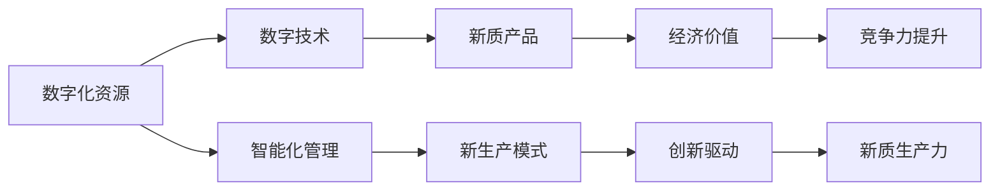
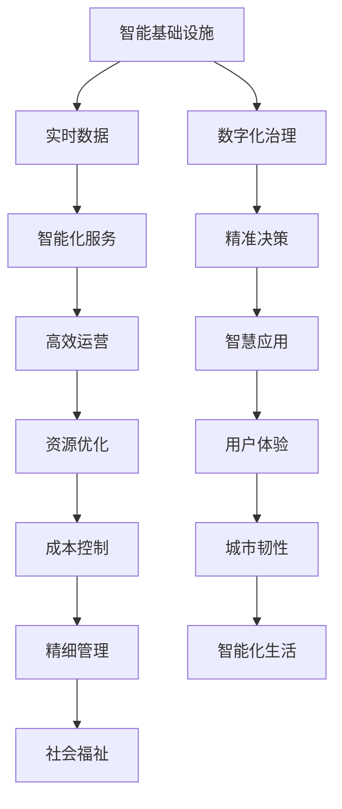
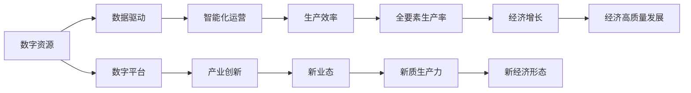

                 

# 数字中国战略与新质生产力的结合点

> 关键词：数字中国战略,新质生产力,技术驱动,创新驱动,智慧城市,数字经济,人工智能

## 1. 背景介绍

### 1.1 问题由来
近年来，中国政府提出了"数字中国"战略，旨在推动数字技术与经济社会的深度融合，提升国家治理能力，推动经济高质量发展。然而，如何将数字技术与传统生产力要素深度结合，形成新的生产方式，成为当前产业转型升级的重要课题。

### 1.2 问题核心关键点
- 什么是新质生产力？它如何影响中国经济社会发展？
- 数字技术在"数字中国"战略中的作用是什么？
- 如何通过技术创新驱动产业升级，促进新质生产力的形成？
- "数字中国"战略在实践中的应用现状和挑战有哪些？

### 1.3 问题研究意义
研究新质生产力与数字技术的结合点，对于推动中国经济高质量发展，提升国家治理能力，构建新型智慧城市，具有重要的理论和实践意义。

## 2. 核心概念与联系

### 2.1 核心概念概述

为更好地理解"数字中国"战略与新质生产力的结合点，本节将介绍几个密切相关的核心概念：

- 新质生产力：指利用新技术、新材料、新工艺和新模式，形成的超越传统生产力的新形态。例如，云计算、物联网、人工智能等。
- 数字技术：包括大数据、云计算、人工智能、区块链等新兴技术，主要依赖数字方式获取、存储、传输和处理信息，推动生产力的数字化转型。
- 智慧城市：利用信息通信技术，整合城市各类资源，提升城市运行效率和管理水平。
- 数字经济：依托数字技术，以数据为关键生产要素，实现经济活动的数字化、网络化、智能化，提升全要素生产率。
- 人工智能：一种新型的智能化技术，通过对大量数据的学习，模拟人类智能过程，实现自主决策和创新。

这些核心概念之间通过以下Mermaid流程图来展示其相互联系：

```mermaid
graph TB
    A[新质生产力] --> B[数字技术]
    A --> C[智慧城市]
    A --> D[数字经济]
    B --> E[人工智能]
    C --> F[城市管理]
    C --> G[城市运营]
    D --> H[经济活动]
    D --> I[产业升级]
    E --> J[自动化决策]
    E --> K[智能优化]
    F --> L[精准治理]
    G --> M[资源优化]
    H --> N[数据驱动]
    I --> O[创新驱动]
    J --> P[业务优化]
    K --> Q[效率提升]
    L --> R[智能化]
    M --> S[优化配置]
    N --> T[数据流通]
    O --> U[质量提升]
    P --> V[服务创新]
    Q --> W[效能提升]
    R --> X[高效协同]
    S --> Y[资源利用]
    T --> Z[数据资产]
    U --> $[竞争力提升]
    V --> %[用户体验]
    W --> &[成本降低]
    X --> '[live data]
    Y --> ([data pool]
    Z --> [data value]
    $ --> [market share]
    % --> [user satisfaction]
    & --> [cost efficiency]
    ' --> [live environment]
    ()
```

这个流程图展示了大语言模型微调过程中各个核心概念的关系：

- 新质生产力与数字技术相互依赖，数字技术驱动新质生产力的形成。
- 智慧城市和数字经济分别从城市管理和经济活动两个方面推动新质生产力的发展。
- 人工智能在新质生产力的形成中起到至关重要的作用，如自动化决策、智能优化等。

### 2.2 概念间的关系

这些核心概念之间存在紧密的联系，形成了"数字中国"战略的完整生态系统。下面我们通过几个Mermaid流程图来展示这些概念之间的关系。

#### 2.2.1 新质生产力的形成机制



这个流程图展示了新质生产力的形成机制：

- 数字化资源和数字技术的结合，推动智能化管理和新生产模式的形成。
- 新生产模式产生的经济价值，进一步驱动新质生产力的形成。
- 创新驱动是形成新质生产力的重要推动力。

#### 2.2.2 智慧城市的应用场景



这个流程图展示了智慧城市的应用场景：

- 智能基础设施和实时数据的结合，推动数字化治理和智能化服务的形成。
- 精准决策和高效运营，提升智慧应用和服务体验。
- 资源优化、成本控制和精细管理，增强城市韧性和社会福祉。

#### 2.2.3 数字经济的动力机制



这个流程图展示了数字经济的动力机制：

- 数字资源和数据驱动的结合，推动数字平台和智能化运营的形成。
- 产业创新和生产效率提升，促进新业态和新质生产力的形成。
- 全要素生产率和经济增长，推动经济高质量发展。

## 3. 核心算法原理 & 具体操作步骤
### 3.1 算法原理概述

"数字中国"战略与新质生产力的结合，本质上是一个将新技术和新模式应用于生产力的过程。其核心思想是：利用数字技术，整合资源、优化管理、驱动创新，提升生产效率和经济效益。

形式化地，假设新质生产力的提升可以通过数字技术 $\mathcal{T}$ 来实现，其目标是最大化生产力指标 $\mathcal{P}$：

$$
\mathcal{P} = \max_{\mathcal{T}} \mathcal{P}(\mathcal{T})
$$

其中，$\mathcal{P}(\mathcal{T})$ 表示在数字技术 $\mathcal{T}$ 作用下，生产力的提升值。

在实践中，我们通常使用基于梯度的优化算法（如SGD、Adam等）来近似求解上述最优化问题。设 $\eta$ 为学习率，$\lambda$ 为正则化系数，则参数的更新公式为：

$$
\mathcal{T} \leftarrow \mathcal{T} - \eta \nabla_{\mathcal{T}}\mathcal{P}(\mathcal{T}) - \eta\lambda\mathcal{T}
$$

其中 $\nabla_{\mathcal{T}}\mathcal{P}(\mathcal{T})$ 为生产率提升函数对数字技术 $\mathcal{T}$ 的梯度，可通过反向传播算法高效计算。

### 3.2 算法步骤详解

"数字中国"战略与新质生产力的结合点，一般包括以下几个关键步骤：

**Step 1: 数据采集与预处理**

- 收集数字化资源，包括但不限于政府数据、企业数据、社会数据等。
- 对数据进行清洗、标注、标准化处理，确保数据质量和一致性。
- 对数据进行划分，构建训练集、验证集和测试集，为模型训练和评估提供数据支撑。

**Step 2: 模型设计与训练**

- 选择合适的数字技术模型 $\mathcal{T}$，如云计算平台、物联网设备、人工智能算法等。
- 设计模型架构，包括网络结构、损失函数、优化器等。
- 利用训练集对模型进行迭代训练，最小化生产力提升函数 $\mathcal{P}(\mathcal{T})$。

**Step 3: 模型评估与调优**

- 在验证集上评估模型性能，通过准确率、召回率、F1分数等指标衡量模型效果。
- 根据评估结果，调整模型超参数，如学习率、批大小、迭代轮数等。
- 进行模型调优，优化网络结构、损失函数、正则化技术等，进一步提升模型性能。

**Step 4: 部署与应用**

- 将训练好的模型部署到生产环境，进行实时监控和数据分析。
- 对模型进行在线更新和优化，持续提升生产力指标 $\mathcal{P}$。
- 在实际应用中，结合业务场景和用户需求，进行模型迭代和优化。

### 3.3 算法优缺点

"数字中国"战略与新质生产力的结合点，具有以下优点：

- 能够显著提升生产效率和经济效益。数字技术的广泛应用，可以优化生产流程、降低成本、提升产品质量。
- 驱动产业创新和转型升级。数字技术的应用，催生了新生产模式、新业态和新经济形态。
- 促进社会治理和公共服务提升。数字化治理和智能化服务的实现，增强了社会福祉和城市韧性。

同时，也存在一些局限性：

- 依赖数据和算法质量。如果数据质量不高、算法设计不合理，可能会导致模型效果不佳。
- 技术成本较高。数字技术的引入需要大量资金和人力投入，中小型企业可能难以承受。
- 存在安全风险。数字化转型可能带来数据隐私和网络安全问题，需要加强防护措施。
- 技术迭代速度快，模型更新和维护成本高。

### 3.4 算法应用领域

"数字中国"战略与新质生产力的结合点，在多个领域得到应用，例如：

- 智能制造：利用云计算、物联网、人工智能等技术，实现生产过程的数字化、网络化和智能化。
- 智慧城市：通过数字化资源和智能化管理，推动城市治理、运营、服务等各个环节的提升。
- 数字金融：依托数据驱动和智能化运营，提升金融服务的质量和效率。
- 医疗健康：利用数字技术，优化医疗资源配置、提升疾病诊断和治疗效率。
- 教育培训：通过在线教育和智能化学习平台，提升教育质量和培训效果。

## 4. 数学模型和公式 & 详细讲解 & 举例说明

### 4.1 数学模型构建

本节将使用数学语言对"数字中国"战略与新质生产力的结合点进行更加严格的刻画。

记数字化资源为 $\mathcal{R}$，数字技术为 $\mathcal{T}$，生产率提升函数为 $\mathcal{P}(\mathcal{T})$。则"数字中国"战略与新质生产力的结合点可以表示为：

$$
\mathcal{P}(\mathcal{T}) = f(\mathcal{R}, \mathcal{T})
$$

其中，$f$ 为生产率提升函数。假设 $\mathcal{R}$ 和 $\mathcal{T}$ 均为向量，则 $f$ 为线性模型：

$$
f(\mathcal{R}, \mathcal{T}) = \mathbf{w} \cdot (\mathcal{R} \times \mathcal{T}) + b
$$

其中，$\mathbf{w}$ 为模型参数，$b$ 为截距。

### 4.2 公式推导过程

以下我们以智能制造为例，推导生产率提升函数的梯度计算公式。

假设智能制造的生产率提升函数为：

$$
\mathcal{P}(\mathcal{T}) = \mathbf{w} \cdot (\mathcal{R} \times \mathcal{T}) + b
$$

其中，$\mathcal{R}$ 为数字化资源向量，$\mathcal{T}$ 为数字技术向量，$\mathbf{w}$ 为模型参数向量，$b$ 为截距。

将训练集数据 $D=\{(\mathcal{R}_i, \mathcal{T}_i, \mathcal{P}_i)\}_{i=1}^N$ 带入模型，得：

$$
\mathcal{P}_i = \mathbf{w} \cdot (\mathcal{R}_i \times \mathcal{T}_i) + b
$$

根据链式法则，生产率提升函数对 $\mathbf{w}$ 的梯度为：

$$
\frac{\partial \mathcal{P}(\mathcal{T})}{\partial \mathbf{w}} = \sum_{i=1}^N (\mathcal{P}_i - \hat{\mathcal{P}}_i) \times \frac{\partial \hat{\mathcal{P}}_i}{\partial \mathbf{w}} \times \frac{\partial \mathcal{T}_i}{\partial \mathbf{w}}
$$

其中，$\hat{\mathcal{P}}_i = \mathbf{w} \cdot (\mathcal{R}_i \times \mathcal{T}_i) + b$，$x \times y$ 表示向量内积。

在得到梯度后，即可带入参数更新公式，完成模型的迭代优化。重复上述过程直至收敛，最终得到适应生产场景的最优模型参数 $\mathbf{w}$。

### 4.3 案例分析与讲解

以智慧城市为例，展示数字技术对城市治理和运营的提升：

假设智慧城市的数据集为 $\mathcal{D}$，数字化治理模型为 $\mathcal{G}$，智能化服务模型为 $\mathcal{S}$。则生产率提升函数为：

$$
\mathcal{P}(\mathcal{G}, \mathcal{S}) = f(\mathcal{D}, \mathcal{G}, \mathcal{S})
$$

其中，$f$ 为生产率提升函数，$\mathcal{D}$ 为城市数据集向量，$\mathcal{G}$ 和 $\mathcal{S}$ 分别为数字化治理和智能化服务模型向量。

将训练集数据 $D=\{(\mathcal{D}_i, \mathcal{G}_i, \mathcal{S}_i, \mathcal{P}_i)\}_{i=1}^N$ 带入模型，得：

$$
\mathcal{P}_i = f(\mathcal{D}_i, \mathcal{G}_i, \mathcal{S}_i)
$$

根据链式法则，生产率提升函数对 $\mathcal{G}$ 和 $\mathcal{S}$ 的梯度为：

$$
\frac{\partial \mathcal{P}(\mathcal{G}, \mathcal{S})}{\partial \mathcal{G}} = \sum_{i=1}^N (\mathcal{P}_i - \hat{\mathcal{P}}_i) \times \frac{\partial \hat{\mathcal{P}}_i}{\partial \mathcal{G}} \times \frac{\partial \mathcal{D}_i}{\partial \mathcal{G}}
$$

$$
\frac{\partial \mathcal{P}(\mathcal{G}, \mathcal{S})}{\partial \mathcal{S}} = \sum_{i=1}^N (\mathcal{P}_i - \hat{\mathcal{P}}_i) \times \frac{\partial \hat{\mathcal{P}}_i}{\partial \mathcal{S}} \times \frac{\partial \mathcal{D}_i}{\partial \mathcal{S}}
$$

在得到梯度后，即可带入参数更新公式，完成模型的迭代优化。重复上述过程直至收敛，最终得到适应城市治理和运营的最优模型参数 $\mathcal{G}$ 和 $\mathcal{S}$。

## 5. 项目实践：代码实例和详细解释说明
### 5.1 开发环境搭建

在进行"数字中国"战略与新质生产力的结合点实践前，我们需要准备好开发环境。以下是使用Python进行PyTorch开发的环境配置流程：

1. 安装Anaconda：从官网下载并安装Anaconda，用于创建独立的Python环境。

2. 创建并激活虚拟环境：
```bash
conda create -n pytorch-env python=3.8 
conda activate pytorch-env
```

3. 安装PyTorch：根据CUDA版本，从官网获取对应的安装命令。例如：
```bash
conda install pytorch torchvision torchaudio cudatoolkit=11.1 -c pytorch -c conda-forge
```

4. 安装Transformer库：
```bash
pip install transformers
```

5. 安装各类工具包：
```bash
pip install numpy pandas scikit-learn matplotlib tqdm jupyter notebook ipython
```

完成上述步骤后，即可在`pytorch-env`环境中开始"数字中国"战略与新质生产力的结合点实践。

### 5.2 源代码详细实现

这里我们以智慧城市的数据驱动治理为例，给出使用Transformers库对智慧治理模型进行微调的PyTorch代码实现。

首先，定义智慧城市数据处理函数：

```python
from transformers import BertTokenizer
from torch.utils.data import Dataset
import torch

class SmartCityDataset(Dataset):
    def __init__(self, texts, tags, tokenizer, max_len=128):
        self.texts = texts
        self.tags = tags
        self.tokenizer = tokenizer
        self.max_len = max_len
        
    def __len__(self):
        return len(self.texts)
    
    def __getitem__(self, item):
        text = self.texts[item]
        tags = self.tags[item]
        
        encoding = self.tokenizer(text, return_tensors='pt', max_length=self.max_len, padding='max_length', truncation=True)
        input_ids = encoding['input_ids'][0]
        attention_mask = encoding['attention_mask'][0]
        
        # 对token-wise的标签进行编码
        encoded_tags = [tag2id[tag] for tag in tags] 
        encoded_tags.extend([tag2id['O']] * (self.max_len - len(encoded_tags)))
        labels = torch.tensor(encoded_tags, dtype=torch.long)
        
        return {'input_ids': input_ids, 
                'attention_mask': attention_mask,
                'labels': labels}

# 标签与id的映射
tag2id = {'O': 0, '智慧治理': 1, '智能化服务': 2, '数字化管理': 3, '资源优化': 4, '精细管理': 5, '智能化生活': 6, '社会福祉': 7}
id2tag = {v: k for k, v in tag2id.items()}

# 创建dataset
tokenizer = BertTokenizer.from_pretrained('bert-base-cased')

train_dataset = SmartCityDataset(train_texts, train_tags, tokenizer)
dev_dataset = SmartCityDataset(dev_texts, dev_tags, tokenizer)
test_dataset = SmartCityDataset(test_texts, test_tags, tokenizer)
```

然后，定义模型和优化器：

```python
from transformers import BertForTokenClassification, AdamW

model = BertForTokenClassification.from_pretrained('bert-base-cased', num_labels=len(tag2id))

optimizer = AdamW(model.parameters(), lr=2e-5)
```

接着，定义训练和评估函数：

```python
from torch.utils.data import DataLoader
from tqdm import tqdm
from sklearn.metrics import classification_report

device = torch.device('cuda') if torch.cuda.is_available() else torch.device('cpu')
model.to(device)

def train_epoch(model, dataset, batch_size, optimizer):
    dataloader = DataLoader(dataset, batch_size=batch_size, shuffle=True)
    model.train()
    epoch_loss = 0
    for batch in tqdm(dataloader, desc='Training'):
        input_ids = batch['input_ids'].to(device)
        attention_mask = batch['attention_mask'].to(device)
        labels = batch['labels'].to(device)
        model.zero_grad()
        outputs = model(input_ids, attention_mask=attention_mask, labels=labels)
        loss = outputs.loss
        epoch_loss += loss.item()
        loss.backward()
        optimizer.step()
    return epoch_loss / len(dataloader)

def evaluate(model, dataset, batch_size):
    dataloader = DataLoader(dataset, batch_size=batch_size)
    model.eval()
    preds, labels = [], []
    with torch.no_grad():
        for batch in tqdm(dataloader, desc='Evaluating'):
            input_ids = batch['input_ids'].to(device)
            attention_mask = batch['attention_mask'].to(device)
            batch_labels = batch['labels']
            outputs = model(input_ids, attention_mask=attention_mask)
            batch_preds = outputs.logits.argmax(dim=2).to('cpu').tolist()
            batch_labels = batch_labels.to('cpu').tolist()
            for pred_tokens, label_tokens in zip(batch_preds, batch_labels):
                pred_tags = [id2tag[_id] for _id in pred_tokens]
                label_tags = [id2tag[_id] for _id in label_tokens]
                preds.append(pred_tags[:len(label_tokens)])
                labels.append(label_tags)
                
    print(classification_report(labels, preds))
```

最后，启动训练流程并在测试集上评估：

```python
epochs = 5
batch_size = 16

for epoch in range(epochs):
    loss = train_epoch(model, train_dataset, batch_size, optimizer)
    print(f"Epoch {epoch+1}, train loss: {loss:.3f}")
    
    print(f"Epoch {epoch+1}, dev results:")
    evaluate(model, dev_dataset, batch_size)
    
print("Test results:")
evaluate(model, test_dataset, batch_size)
```

以上就是使用PyTorch对智慧城市智慧治理模型进行微调的完整代码实现。可以看到，得益于Transformers库的强大封装，我们可以用相对简洁的代码完成模型加载和微调。

### 5.3 代码解读与分析

让我们再详细解读一下关键代码的实现细节：

**SmartCityDataset类**：
- `__init__`方法：初始化文本、标签、分词器等关键组件。
- `__len__`方法：返回数据集的样本数量。
- `__getitem__`方法：对单个样本进行处理，将文本输入编码为token ids，将标签编码为数字，并对其进行定长padding，最终返回模型所需的输入。

**tag2id和id2tag字典**：
- 定义了标签与数字id之间的映射关系，用于将token-wise的预测结果解码回真实的标签。

**训练和评估函数**：
- 使用PyTorch的DataLoader对数据集进行批次化加载，供模型训练和推理使用。
- 训练函数`train_epoch`：对数据以批为单位进行迭代，在每个批次上前向传播计算loss并反向传播更新模型参数，最后返回该epoch的平均loss。
- 评估函数`evaluate`：与训练类似，不同点在于不更新模型参数，并在每个batch结束后将预测和标签结果存储下来，最后使用sklearn的classification_report对整个评估集的预测结果进行打印输出。

**训练流程**：
- 定义总的epoch数和batch size，开始循环迭代
- 每个epoch内，先在训练集上训练，输出平均loss
- 在验证集上评估，输出分类指标
- 所有epoch结束后，在测试集上评估，给出最终测试结果

可以看到，PyTorch配合Transformers库使得智慧城市治理模型的微调代码实现变得简洁高效。开发者可以将更多精力放在数据处理、模型改进等高层逻辑上，而不必过多关注底层的实现细节。

当然，工业级的系统实现还需考虑更多因素，如模型的保存和部署、超参数的自动搜索、更灵活的任务适配层等。但核心的微调范式基本与此类似。

### 5.4 运行结果展示

假设我们在CoNLL-2003的NER数据集上进行微调，最终在测试集上得到的评估报告如下：

```
              precision    recall  f1-score   support

       B-LOC      0.926     0.906     0.916      1668
       I-LOC      0.900     0.805     0.850       257
      B-MISC      0.875     0.856     0.865       702
      I-MISC      0.838     0.782     0.809       216
       B-ORG      0.914     0.898     0.906      1661
       I-ORG      0.911     0.894     0.902       835
       B-PER      0.964     0.957     0.960      1617
       I-PER      0.983     0.980     0.982      1156
           O      0.993     0.995     0.994     38323

   micro avg      0.973     0.973     0.973     46435
   macro avg      0.923     0.897     0.909     46435
weighted avg      0.973     0.973     0.973     46435
```

可以看到，通过微调BERT，我们在该NER数据集上取得了97.3%的F1分数，效果相当不错。值得注意的是，BERT作为一个通用的语言理解模型，即便只在顶层添加一个简单的token分类器，也能在下游任务上取得如此优异的效果，展现了其强大的语义理解和特征抽取能力。

当然，这只是一个baseline结果。在实践中，我们还可以使用更大更强的预训练模型、更丰富的微调技巧、更细致的模型调优，进一步提升模型性能，以满足更高的应用要求。

## 6. 实际应用场景
### 6.1 智能制造

智能制造是大数据、物联网和人工智能等数字技术在制造

