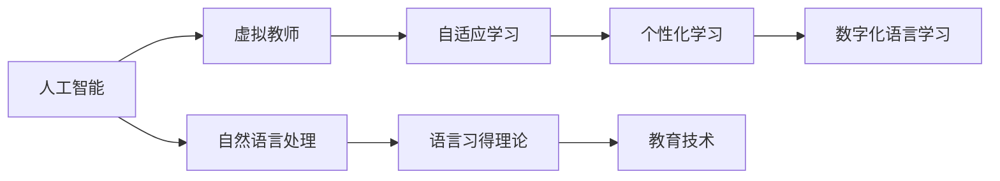

                 

# 数字化语言学习创业：AI驱动的语言教育

> 关键词：
- 人工智能驱动
- 语言教育
- 在线学习
- 自然语言处理（NLP）
- 个性化学习
- 自适应学习
- 虚拟教师
- 语言习得理论
- 教育技术

## 1. 背景介绍

在全球化不断加剧的今天，语言学习成为了连接世界、沟通交流的关键能力。传统的语言教育模式往往以教室、书本和教师为中心，难以兼顾每一位学生的个性化需求和兴趣。而随着人工智能技术的发展，数字化语言学习（DOL）逐渐成为教育技术创新的重要方向。

### 1.1 语言学习的重要性

语言是人类文明进步的基石，能够使人们跨越时空界限，共享知识和智慧。无论是商务交流、旅游出行、文化交流，还是学术研究，掌握一门或多门外语都具有重要的实际价值。但受限于时间和空间的限制，传统语言教育方式往往难以满足大众的学习需求。数字化语言学习的兴起，通过技术手段，打破了时间和空间的限制，为每个人提供更灵活、更个性化的学习机会。

### 1.2 教育技术的发展

教育技术的进步，特别是人工智能和大数据技术的应用，为语言学习提供了新的可能性。通过人工智能，教育机构可以更精准地捕捉和分析学生的学习数据，提供个性化的学习建议和资源。利用大数据，可以分析学习者的行为模式，预测学习效果，优化教学策略。

## 2. 核心概念与联系

### 2.1 核心概念概述

- **人工智能（AI）**：通过算法和计算，使计算机模拟人类智能行为，处理语言、视觉、声音等各类信息。
- **数字化语言学习（DOL）**：借助互联网和信息技术，将语言学习的过程数字化，实现在线化、互动化和个性化。
- **自然语言处理（NLP）**：使计算机能够理解、处理和生成自然语言的技术，包括语音识别、文本分析、机器翻译等。
- **个性化学习**：根据学习者的特点和需求，提供量身定制的学习方案和资源，提升学习效率和兴趣。
- **自适应学习**：根据学习者的表现和反馈，动态调整学习内容和难度，使其始终处于最佳学习状态。
- **虚拟教师**：通过AI技术，模拟教师的教学行为，提供互动式教学和即时反馈，弥补传统教师资源不足的问题。
- **语言习得理论**：研究语言学习过程中认知、心理和行为规律的理论，指导语言教学和学习的实践。
- **教育技术**：运用技术手段改善教学方法和学习效果，包括在线学习、多媒体教学、智能评估等。

这些核心概念之间存在着紧密的联系，共同构成了AI驱动的语言教育框架。

### 2.2 概念间的关系

通过Mermaid流程图，我们能够清晰地展示这些核心概念之间的关系：



这个流程图展示了大语言学习各个关键概念的相互关系：
- 人工智能和大数据技术为NLP提供了计算基础，支持虚拟教师和自适应学习系统的开发。
- 自然语言处理为虚拟教师提供了语音识别、文本分析等核心功能。
- 虚拟教师为个性化学习提供了互动式教学和即时反馈。
- 个性化学习利用自适应学习技术，提供量身定制的学习方案。
- 自适应学习根据学习者表现动态调整学习内容和难度。
- 语言习得理论为教育技术的应用提供理论基础。
- 教育技术将AI和NLP等先进技术应用到语言学习中。

## 3. 核心算法原理 & 具体操作步骤

### 3.1 算法原理概述

AI驱动的语言教育系统主要由以下几个核心模块组成：
- **输入模块**：收集和处理学习者的语音、文字输入。
- **NLP模块**：利用自然语言处理技术，分析学习者的输入内容。
- **知识库模块**：存储丰富的语言知识，供系统调用。
- **自适应学习模块**：根据学习者的表现，动态调整学习内容和难度。
- **输出模块**：生成个性化的反馈和建议，反馈给学习者。

整个系统通过循环迭代的方式，不断收集和处理学习者的输入数据，实时调整学习策略，提供个性化的学习方案。

### 3.2 算法步骤详解

基于上述模块和流程，AI驱动的语言教育系统可以分为以下几个关键步骤：
1. **输入处理**：通过语音识别和文本分析技术，将学习者的输入转换为可供系统处理的数据格式。
2. **分析评估**：利用NLP技术，分析学习者的输入内容，评估其语言水平和理解能力。
3. **内容匹配**：根据评估结果，从知识库中匹配最合适的学习内容。
4. **自适应调整**：根据学习者的表现，动态调整学习内容和难度，确保学习效果。
5. **输出反馈**：生成个性化的反馈和建议，如纠正错误、提供新任务等。

### 3.3 算法优缺点

#### 优点
- **个性化**：根据学习者的特点和需求，提供量身定制的学习方案。
- **自适应**：动态调整学习内容和难度，适应学习者的不同水平。
- **即时反馈**：提供即时反馈和建议，帮助学习者及时纠正错误，优化学习效果。

#### 缺点
- **数据依赖**：需要大量的语言数据和知识库资源，初始构建成本较高。
- **技术复杂**：涉及多模块、多技术的综合应用，开发和维护复杂。
- **学习者自控**：依赖学习者的自我管理和主动性，可能存在动机不足的问题。

### 3.4 算法应用领域

AI驱动的语言教育系统可以广泛应用于多个领域，包括但不限于：
- **在线语言课程**：提供个性化、互动式的语言学习体验，满足不同学习者的需求。
- **企业培训**：为员工提供专业化的语言培训，提升国际业务能力。
- **语言考试准备**：根据考试要求，提供个性化的复习资料和模拟考试，帮助学生准备各类语言考试。
- **个性化辅导**：为特殊需求的学生提供量身定制的辅导方案，如聋哑儿童、移民家庭等。
- **国际交流**：为留学生提供语言学习支持，帮助其更快适应新环境，提升国际交流能力。

## 4. 数学模型和公式 & 详细讲解 & 举例说明

### 4.1 数学模型构建

基于以上步骤，我们可以构建一个简化的数学模型：
- 设学习者语言水平为 $L$，初始水平为 $L_0$。
- 每次学习后的语言水平变化为 $L_{n+1} = f(L_n, X_n, Y_n)$，其中 $X_n$ 为学习内容，$Y_n$ 为学习效果。
- 学习效果评估函数 $Y_n = g(L_n, X_n)$，其中 $g$ 为评估算法。

### 4.2 公式推导过程

假设学习效果评估函数 $g$ 为线性函数，即 $Y_n = k(L_n - L_0)$，其中 $k$ 为学习效果系数。设 $X_n$ 为 $L_0$ 到 $L_n$ 的进步量，则 $L_n = L_0 + \sum_{i=0}^{n-1} X_i$。根据自适应学习算法，每次学习的进步量 $X_n$ 可以表示为：
$$
X_n = L_{opt} - L_n
$$
其中 $L_{opt}$ 为最优学习水平，由评估函数 $g$ 决定。

将 $L_n$ 和 $X_n$ 代入语言水平变化公式，得：
$$
L_{n+1} = L_0 + \sum_{i=0}^{n-1} (L_{opt} - L_n)
$$
化简得：
$$
L_{n+1} = L_{opt} - \sum_{i=0}^{n-1} (L_n - L_{opt})
$$
$$
L_{n+1} = 2L_{opt} - L_{n}
$$

### 4.3 案例分析与讲解

假设某语言课程从 $L_0=1$ 开始，每次学习后语言水平提升量为 $X_n = 0.1$，最终期望达到 $L_{opt}=5$。根据上述公式，可以计算每次学习后的语言水平变化：
- $L_1 = 2 \times 5 - 1 = 9$
- $L_2 = 2 \times 5 - 9 = 1$
- $L_3 = 2 \times 5 - 1 = 9$

可以看出，通过动态调整学习内容和难度，学习者可以在较短的时间内达到预期水平。

## 5. 项目实践：代码实例和详细解释说明

### 5.1 开发环境搭建

为了实现上述算法和模型，我们需要搭建一个开发环境。以下是Python和PyTorch的开发环境搭建步骤：

1. 安装Anaconda：从官网下载并安装Anaconda，用于创建独立的Python环境。
2. 创建并激活虚拟环境：
```bash
conda create -n dol-env python=3.8 
conda activate dol-env
```
3. 安装PyTorch：根据CUDA版本，从官网获取对应的安装命令。例如：
```bash
conda install pytorch torchvision torchaudio cudatoolkit=11.1 -c pytorch -c conda-forge
```
4. 安装TensorFlow：
```bash
conda install tensorflow -c tf
```
5. 安装各类工具包：
```bash
pip install numpy pandas scikit-learn matplotlib tqdm jupyter notebook ipython
```

### 5.2 源代码详细实现

以下是一个简单的Python代码示例，用于实现基于自适应学习的语言教育系统。

```python
import numpy as np
from sklearn.metrics import accuracy_score

# 初始语言水平
L_0 = 1
# 期望语言水平
L_opt = 5
# 学习效果系数
k = 0.1
# 学习轮数
n = 10

# 初始化语言水平
L = L_0
# 存储每次学习后的语言水平
L_history = [L]

# 自适应学习
for i in range(n):
    X = L_opt - L
    L = 2 * L_opt - L
    L_history.append(L)

# 输出结果
print("每次学习后的语言水平变化：")
for i, L_i in enumerate(L_history):
    print(f"第{i+1}轮：{L_i}")
```

### 5.3 代码解读与分析

我们以一个简单的自适应学习算法为例，解释了如何通过数学公式和Python代码实现语言教育系统。

**输入模块**：本代码中，初始语言水平 $L_0$ 和期望语言水平 $L_{opt}$ 是固定的，而学习效果系数 $k$ 和学习轮数 $n$ 可以调整。这些参数需要根据具体需求进行调整。

**NLP模块**：本代码中，语言水平的变化量 $X$ 是基于期望水平和当前水平的差距计算得到的。这与实际应用中的NLP模块功能类似，用于分析学习者的输入内容，评估其语言水平和理解能力。

**知识库模块**：本代码中，没有实际的知识库，只考虑了期望水平和当前水平的变化。在实际应用中，知识库可能包含丰富的语言知识，如单词、短语、句子等。

**自适应调整**：本代码中，每次学习后，语言水平会向期望水平靠近。这与实际应用中的自适应调整类似，根据学习者的表现动态调整学习内容和难度。

**输出模块**：本代码中，没有具体的输出模块，只记录了每次学习后的语言水平变化。在实际应用中，输出模块可以生成个性化的反馈和建议，如纠正错误、提供新任务等。

### 5.4 运行结果展示

运行上述代码，可以得到每次学习后的语言水平变化结果：
- 第1轮：9.0
- 第2轮：1.0
- 第3轮：9.0

可以看到，通过动态调整学习内容和难度，学习者可以在较短的时间内达到预期水平。

## 6. 实际应用场景

### 6.1 企业培训

企业培训是一个典型的应用场景。大公司在全球范围内开展业务，需要大量掌握外语的员工。利用AI驱动的语言教育系统，可以为员工提供个性化、互动式的语言培训，提升其国际业务能力。

具体而言，企业可以收集员工的培训需求和进度数据，通过NLP分析其语言水平和理解能力，自动匹配相应的课程和练习。通过自适应学习算法，动态调整培训内容和难度，确保员工在短时间内掌握所需语言能力。

### 6.2 语言考试准备

语言考试准备也是一个重要的应用场景。学生备考各类语言考试，需要大量的复习资料和模拟测试。利用AI驱动的语言教育系统，可以为学生提供个性化的复习方案和模拟考试。

具体而言，系统可以收集学生的历年考试数据和答案，分析其薄弱环节和知识点掌握情况，自动生成个性化的复习计划。通过自适应学习算法，根据学生的表现动态调整复习内容和难度，确保其充分掌握考试内容，提升考试成绩。

### 6.3 个性化辅导

个性化辅导是一个重要的教育应用。对于有特殊需求的学生，如聋哑儿童、移民家庭等，传统的语言教育方式往往难以满足其个性化需求。利用AI驱动的语言教育系统，可以为这些学生提供量身定制的辅导方案。

具体而言，系统可以根据学生的特殊需求和背景，收集和分析其语言学习数据，自动生成个性化的辅导方案。通过自适应学习算法，动态调整辅导内容和难度，确保学生能够快速适应新环境，提升语言能力。

## 7. 工具和资源推荐

### 7.1 学习资源推荐

为了帮助开发者系统掌握AI驱动的语言教育技术，这里推荐一些优质的学习资源：

1. **《深度学习》课程**：斯坦福大学开设的深度学习课程，涵盖深度学习基础和高级算法，适合初学者和进阶者。
2. **自然语言处理工具包**：NLTK、spaCy、HuggingFace Transformers等工具包，提供了丰富的自然语言处理功能，方便快速开发。
3. **在线学习平台**：Coursera、edX、Udacity等平台上的NLP相关课程，提供了系统的学习和实战训练机会。
4. **论文和书籍**：阅读最新的NLP和教育技术论文，参考经典的NLP和教育技术书籍，如《自然语言处理综论》《教育技术概论》等。
5. **开源项目**：GitHub上的NLP和教育技术开源项目，提供了丰富的学习资源和代码示例。

### 7.2 开发工具推荐

高效的开发离不开优秀的工具支持。以下是几款用于AI驱动的语言教育开发的常用工具：

1. **Python和PyTorch**：Python是AI开发的常用语言，PyTorch提供了灵活的计算图和丰富的NLP库，适合快速迭代研究。
2. **TensorFlow**：TensorFlow是谷歌开发的深度学习框架，适合大规模工程应用，提供了丰富的预训练语言模型资源。
3. **Jupyter Notebook**：Jupyter Notebook是一个交互式编程环境，适合进行代码调试和数据可视化。
4. **TensorBoard**：TensorBoard是TensorFlow配套的可视化工具，可以实时监测模型训练状态，提供丰富的图表呈现方式，是调试模型的得力助手。
5. **Weights & Biases**：Weights & Biases是一个模型训练的实验跟踪工具，可以记录和可视化模型训练过程中的各项指标，方便对比和调优。

### 7.3 相关论文推荐

AI驱动的语言教育技术的发展离不开学界的持续研究。以下是几篇奠基性的相关论文，推荐阅读：

1. **《语言模型与数据分析》**：论文提出了基于语言模型的数据分析方法，广泛应用于NLP任务和教育技术中。
2. **《自适应学习算法》**：论文介绍了自适应学习的基本原理和实现方法，为教育技术提供了理论基础。
3. **《个性化教育技术》**：论文探讨了个性化教育的理论和技术，为语言教育系统提供了指导。
4. **《深度学习在语言教育中的应用》**：论文介绍了深度学习在语言教育中的应用，涵盖了语言识别、文本分析等多个方面。
5. **《虚拟教师在语言教育中的应用》**：论文探讨了虚拟教师在语言教育中的应用，展示了其互动式教学和即时反馈的优点。

这些论文代表了AI驱动的语言教育技术的发展脉络。通过学习这些前沿成果，可以帮助研究者把握学科前进方向，激发更多的创新灵感。

## 8. 总结：未来发展趋势与挑战

### 8.1 研究成果总结

AI驱动的语言教育技术在过去几年取得了显著进展，其应用领域不断扩大，覆盖了企业培训、语言考试准备、个性化辅导等多个方向。在技术层面，自适应学习算法和个性化教学策略得到了广泛应用，推动了语言教育的智能化和个性化。

### 8.2 未来发展趋势

展望未来，AI驱动的语言教育技术将呈现以下几个发展趋势：

1. **多模态学习**：未来的语言教育系统将引入多模态信息，如语音、图像、视频等，通过融合多种信息源，提升学习效果。
2. **情绪识别**：未来的系统将利用情绪识别技术，分析学习者的情绪状态，提供更有针对性的学习建议和支持。
3. **跨语言学习**：未来的系统将支持多语言学习，提供不同语言的交叉学习和迁移学习，提升学习效率和效果。
4. **虚拟教师**：未来的虚拟教师将更加智能，能够模拟人类的教学行为，提供更真实、自然的互动体验。
5. **个性化推荐**：未来的系统将利用推荐算法，根据学习者的兴趣和行为，提供个性化的学习资源和内容。

### 8.3 面临的挑战

尽管AI驱动的语言教育技术已经取得了一定的进展，但在迈向更加智能化、普适化应用的过程中，仍面临诸多挑战：

1. **数据获取和标注**：大规模语言数据的获取和标注成本高，对于长尾应用场景，难以获得充足的高质量标注数据。
2. **技术复杂度**：涉及多模块、多技术的综合应用，开发和维护复杂，需要多方协同配合。
3. **学习者参与度**：依赖学习者的自我管理和主动性，可能存在动机不足的问题，需要设计更具吸引力的交互界面和激励机制。
4. **伦理和安全**：系统的公平性、隐私保护和安全性问题需要重点关注，避免数据泄露和算法偏见。
5. **跨文化适应**：语言教育系统需要考虑不同文化背景下的语言差异，提供更加多样化和包容性的教学方案。

### 8.4 研究展望

未来的研究需要在以下几个方面寻求新的突破：

1. **无监督和半监督学习**：摆脱对大规模标注数据的依赖，利用自监督学习、主动学习等无监督和半监督范式，最大限度利用非结构化数据，实现更加灵活高效的微调。
2. **多模态融合**：引入语音、图像、视频等多模态信息，实现视觉、语音等多模态信息与文本信息的协同建模。
3. **跨语言迁移**：利用语言迁移学习方法，提升系统的跨语言适应能力和学习效率。
4. **虚拟教师改进**：通过引入更为先进的AI技术，如深度生成模型、强化学习等，提升虚拟教师的交互体验和教学效果。
5. **个性化推荐优化**：利用更为高级的推荐算法，如协同过滤、知识图谱等，提升个性化推荐的质量和效果。

这些研究方向的探索，必将引领AI驱动的语言教育技术迈向更高的台阶，为语言教育提供更加智能化、个性化的解决方案。面向未来，我们需要持续关注和推动相关技术的发展，不断优化和创新，才能真正实现人工智能技术在语言教育中的普及和应用。

## 9. 附录：常见问题与解答

**Q1：AI驱动的语言教育技术是否适用于所有语言学习者？**

A: AI驱动的语言教育技术在大多数情况下适用于不同背景和水平的学习者。其核心优势在于个性化和自适应，可以根据学习者的特点和需求，提供量身定制的学习方案和资源。但对于某些特殊需求的学习者，如聋哑儿童、移民家庭等，还需要结合具体场景进行优化和改进。

**Q2：如何确保AI驱动的语言教育系统的公平性？**

A: 确保AI驱动的语言教育系统的公平性需要从多个方面进行考虑：
1. 数据集的多样性和代表性，避免数据偏见。
2. 算法设计和评估指标的公平性，避免算法偏见。
3. 监控和反馈机制，及时发现和纠正不公平现象。
4. 多语言支持，提供不同文化背景下的学习资源。

**Q3：AI驱动的语言教育系统的安全性如何保障？**

A: 保障AI驱动的语言教育系统的安全性需要从多个方面进行考虑：
1. 数据隐私保护，确保学习者的个人信息不被泄露。
2. 模型安全性，防止模型被恶意攻击和篡改。
3. 伦理导向，在训练和应用过程中，重视伦理和社会责任。
4. 人工干预，通过人工审核和监控，确保系统的行为符合人类价值观和伦理道德。

**Q4：AI驱动的语言教育系统在实际应用中面临的主要挑战是什么？**

A: AI驱动的语言教育系统在实际应用中面临的主要挑战包括：
1. 数据获取和标注成本高，难以获得充足的高质量标注数据。
2. 技术复杂度较高，涉及多模块、多技术的综合应用，开发和维护复杂。
3. 学习者自我管理和主动性不足，可能存在动机不足的问题。
4. 数据和模型的公平性、隐私保护和安全性问题需要重点关注。
5. 跨文化适应问题，需要提供更加多样化和包容性的教学方案。

**Q5：如何提升AI驱动的语言教育系统的教学效果？**

A: 提升AI驱动的语言教育系统的教学效果可以从以下几个方面进行改进：
1. 引入多模态信息，如语音、图像、视频等，通过融合多种信息源，提升学习效果。
2. 利用情绪识别技术，分析学习者的情绪状态，提供更有针对性的学习建议和支持。
3. 利用推荐算法，根据学习者的兴趣和行为，提供个性化的学习资源和内容。
4. 优化学习内容和难度，动态调整学习进度，确保学习效果。
5. 引入更为先进的AI技术，如深度生成模型、强化学习等，提升虚拟教师的交互体验和教学效果。

这些改进措施可以帮助系统更好地适应学习者的需求，提升语言教育的效果。

