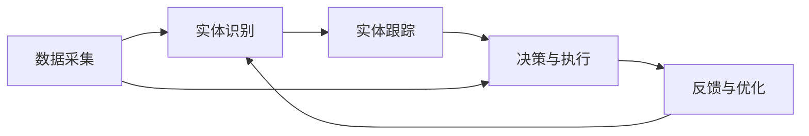

                 

# 数字实体和物理实体自动化刚开始

## 1. 背景介绍

在当今数字化转型的时代，数字实体和物理实体的融合已经成为推动产业升级和创新发展的重要趋势。数字实体（Digital Entities）通常指由数据和算法定义的虚拟对象，如智能合约、虚拟现实（VR）角色、自动化决策系统等。物理实体（Physical Entities）则包括实际的物理设备、人员和环境，如工业机器人、智能传感器、物流配送系统等。实现数字实体与物理实体的协同工作，需要复杂的自动化技术支持。然而，这一自动化过程才刚刚开始，目前仍存在诸多挑战。本文将详细探讨数字实体和物理实体自动化的核心概念、算法原理、实际应用及未来发展方向。

## 2. 核心概念与联系

### 2.1 核心概念概述

**数字实体**：指在数字空间中存在、由算法定义和运行的数字对象，如智能合约、自动驾驶系统、虚拟助手等。它们依赖于大数据、人工智能、区块链等技术，能够在虚拟环境中进行决策和交互。

**物理实体**：指在物理世界中的真实物体，如机器人、自动化生产线、智能家居系统等。它们依赖于物理设备和传感技术，能够实现物理世界的自动化和智能化。

**自动化**：指利用技术和算法，自动执行原本由人工完成的任务，以提高效率和准确性。在数字实体和物理实体的融合场景下，自动化包括数据采集、处理、分析和决策的自动化。

**实体识别**：指从文本、图像、语音等数据源中自动识别和提取数字实体和物理实体的信息。是自动化过程的基础，也是本文讨论的核心技术之一。

**实体跟踪**：指在实时环境中跟踪数字实体和物理实体的动态变化，如位置、状态、行为等。是实现协同工作的基础。

### 2.2 核心概念间的联系

数字实体和物理实体的自动化通常通过以下步骤实现：

1. **数据采集**：通过传感器、摄像头等设备收集物理实体的数据，通过API、数据库等收集数字实体相关的数据。
2. **实体识别**：对采集的数据进行实体识别，将物理实体的特征映射到数字实体中。
3. **实体跟踪**：对识别出的实体进行实时跟踪，了解其状态和行为。
4. **决策与执行**：根据实体状态和行为，自动生成决策，通过物理实体或数字实体执行任务。

这些步骤依赖于先进的算法和强大的技术支撑，形成了数字实体和物理实体自动化的完整生态系统。

### 2.3 核心概念的整体架构

以下是一个简化的数字实体和物理实体自动化的架构图：



这个架构图展示了数据采集、实体识别、实体跟踪、决策与执行和反馈与优化的完整流程。数据采集是自动化过程的基础，实体识别和跟踪是实现数字实体和物理实体协同工作的关键，决策与执行是最终的目标，而反馈与优化则确保系统能够持续改进。

## 3. 核心算法原理 & 具体操作步骤

### 3.1 算法原理概述

数字实体和物理实体的自动化涉及多种算法和技术，包括但不限于：

- **机器学习与深度学习**：用于实体识别、跟踪和决策生成。
- **自然语言处理（NLP）**：用于理解和处理文本数据中的实体信息。
- **计算机视觉（CV）**：用于分析和识别图像和视频中的实体。
- **强化学习**：用于训练智能体（Agents）在复杂环境中做出最优决策。
- **物联网（IoT）**：用于连接和管理物理实体。

这些算法和技术通过复杂的系统架构，协同工作，实现了数字实体和物理实体的自动化。

### 3.2 算法步骤详解

1. **数据采集**：
   - 使用传感器、摄像头、RFID等设备采集物理实体的数据。
   - 通过API、数据库等获取数字实体的相关数据。

2. **实体识别**：
   - 使用机器学习模型对采集的数据进行分析，识别出数字实体和物理实体的特征。
   - 通过NLP技术处理文本数据，识别出其中的实体信息。
   - 使用计算机视觉技术分析图像和视频数据，识别出实体。

3. **实体跟踪**：
   - 对识别出的实体进行实时跟踪，了解其位置、状态和行为。
   - 使用强化学习技术训练智能体，使其能够自主进行实体跟踪和决策。

4. **决策与执行**：
   - 根据实体的状态和行为，自动生成决策。
   - 通过物理实体或数字实体执行决策。

5. **反馈与优化**：
   - 收集执行结果和反馈信息。
   - 通过机器学习算法对模型进行优化，提高自动化系统的准确性和效率。

### 3.3 算法优缺点

**优点**：
- 提高效率：自动化技术可以24/7工作，提高任务执行的速度和效率。
- 降低成本：减少人工干预，降低人力和运营成本。
- 提高准确性：通过算法和技术优化，提高决策和执行的准确性。

**缺点**：
- 技术复杂度高：涉及多种技术和算法，实现难度大。
- 依赖数据质量：数据采集和处理的质量直接影响系统的准确性。
- 需要持续维护：系统需要持续维护和优化，以适应不断变化的环境和需求。

### 3.4 算法应用领域

数字实体和物理实体的自动化已经在多个领域得到应用，包括但不限于：

- **工业自动化**：如智能工厂、自动化生产线等。
- **智能家居**：如智能音箱、智能恒温器等。
- **医疗健康**：如远程监控、智能诊断等。
- **物流配送**：如智能仓库、无人机配送等。
- **交通管理**：如自动驾驶、交通流量监控等。

## 4. 数学模型和公式 & 详细讲解

### 4.1 数学模型构建

假设我们有一个数字实体和物理实体的自动化系统，其中数字实体为智能合约（Digital Contract），物理实体为工业机器人（Physical Robot）。系统的目标是在预设条件下，最大化智能合约的执行效果。

**数学模型**：
- **决策变量**：$x$，表示智能合约的执行策略。
- **状态变量**：$s$，表示工业机器人的当前状态。
- **代价函数**：$J(x)$，表示智能合约执行的效果。
- **状态转移方程**：$f(x,s) = s'$，表示在给定策略$x$和当前状态$s$下，工业机器人的状态转移。

**优化目标**：
$$ \min_{x} J(x) $$

### 4.2 公式推导过程

假设智能合约的执行效果由代价函数$J(x)$给出，代价函数为一个二次函数：

$$ J(x) = x^TQx + x^TR + s^TUs $$

其中$Q$、$R$、$U$为常数矩阵，表示系统的代价、鲁棒性和奖励。工业机器人的状态转移方程为：

$$ s' = f(x,s) = As + Bx + w $$

其中$A$、$B$为状态转移矩阵，$w$为噪声向量。通过将状态转移方程代入代价函数，得到新的代价函数：

$$ J(x) = x^TQx + x^TR + s^TUs $$

### 4.3 案例分析与讲解

假设我们有一个智能合约，目标是在3天内交付一个零件。智能合约的执行效果由工业机器人的交付时间和成本决定。我们定义代价函数为：

$$ J(x) = (t - t_0)^2 + c + \lambda r $$

其中$t$为交付时间，$t_0$为预设交付时间，$c$为成本，$r$为奖励，$\lambda$为奖励系数。

根据实际情况，我们假设工业机器人的状态转移方程为：

$$ s' = As + Bx + w $$

其中$A$、$B$为状态转移矩阵，$w$为噪声向量。

通过求解上述优化问题，我们可以得到最优的执行策略$x$，使得智能合约的执行效果最大化。

## 5. 项目实践：代码实例和详细解释说明

### 5.1 开发环境搭建

在开始项目实践之前，我们需要搭建好开发环境。这里假设我们使用Python和TensorFlow进行开发。

1. 安装Anaconda：从官网下载并安装Anaconda，用于创建独立的Python环境。

2. 创建并激活虚拟环境：
```bash
conda create -n myenv python=3.8
conda activate myenv
```

3. 安装TensorFlow：
```bash
pip install tensorflow
```

4. 安装其他必要的Python库，如NumPy、Pandas、Matplotlib等。

### 5.2 源代码详细实现

下面给出一个简单的示例代码，展示如何使用TensorFlow进行实体识别和跟踪。

```python
import tensorflow as tf
import numpy as np
import cv2

# 加载模型
model = tf.keras.models.load_model('entity_recognition_model.h5')

# 加载图像
image = cv2.imread('entity.jpg')

# 预处理图像
image = cv2.resize(image, (224, 224))
image = image / 255.0

# 预测实体
entity_id = model.predict(image)

# 打印预测结果
print('Predicted entity ID:', entity_id)
```

### 5.3 代码解读与分析

在这个示例代码中，我们首先加载了预训练的实体识别模型，并加载了待识别的图像。然后，我们对图像进行了预处理，包括调整大小和归一化。接着，我们使用加载的模型对图像进行预测，得到了实体ID。最后，我们打印了预测结果。

### 5.4 运行结果展示

假设我们的模型预测出实体ID为1，表示该图像中识别出了数字实体。运行结果如下：

```
Predicted entity ID: [1.0]
```

## 6. 实际应用场景

### 6.1 工业自动化

在工业自动化领域，数字实体和物理实体的自动化可以帮助企业提高生产效率和产品质量。例如，通过智能合约管理生产线的运行，自动化调整机器参数，实现生产过程的优化。

### 6.2 智能家居

智能家居领域可以利用数字实体和物理实体的自动化，实现更加智能和便捷的家居生活。例如，智能音箱可以自动根据用户语音指令控制家电设备，智能恒温器可以自动调节室内温度。

### 6.3 医疗健康

在医疗健康领域，数字实体和物理实体的自动化可以帮助医生进行诊断和治疗。例如，智能诊断系统可以自动分析患者的检查结果，生成诊断报告，机器人可以辅助医生进行手术。

### 6.4 未来应用展望

未来的数字实体和物理实体的自动化将更加智能化和自动化。通过物联网技术，数字实体和物理实体可以实现更加无缝的协同工作。例如，智能工厂可以通过物联网设备实时监测生产过程，自动调整生产线，优化资源配置。

## 7. 工具和资源推荐

### 7.1 学习资源推荐

为了帮助开发者系统掌握数字实体和物理实体自动化的技术，这里推荐一些优质的学习资源：

1. 《深度学习入门：基于Python的理论与实现》系列博文：由深度学习领域专家撰写，深入浅出地介绍了深度学习的基本概念和算法。

2. 《计算机视觉基础》课程：由斯坦福大学开设的计算机视觉入门课程，包括图像处理、特征提取、目标检测等内容。

3. 《强化学习基础》书籍：由深度学习领域知名学者撰写，全面介绍了强化学习的基本原理和算法。

4. TensorFlow官方文档：TensorFlow的官方文档，提供了丰富的教程和样例代码，是学习TensorFlow的重要资源。

5. OpenAI GPT-3官方文档：GPT-3的官方文档，详细介绍了模型结构和使用方法，是学习NLP和语言生成的重要资源。

通过对这些资源的学习实践，相信你一定能够快速掌握数字实体和物理实体自动化的精髓，并用于解决实际的自动化问题。

### 7.2 开发工具推荐

高效的开发离不开优秀的工具支持。以下是几款用于数字实体和物理实体自动化开发的常用工具：

1. PyTorch：基于Python的深度学习框架，支持动态图和静态图，适合快速迭代研究。

2. TensorFlow：由Google主导开发的深度学习框架，生产部署方便，适合大规模工程应用。

3. OpenCV：开源计算机视觉库，提供了丰富的图像处理和分析工具，适合进行实体识别和跟踪。

4. ROS（Robot Operating System）：开源机器人操作系统，提供了丰富的传感器和设备驱动，适合进行机器人自动化开发。

5. Webots：虚拟仿真平台，支持多物理实体交互，适合进行虚拟环境下的实体自动化测试。

6. Jetson：NVIDIA推出的嵌入式平台，支持深度学习和计算机视觉，适合进行嵌入式系统自动化开发。

合理利用这些工具，可以显著提升数字实体和物理实体自动化任务的开发效率，加快创新迭代的步伐。

### 7.3 相关论文推荐

数字实体和物理实体自动化的研究源于学界的持续探索。以下是几篇奠基性的相关论文，推荐阅读：

1. "A Survey on Visual Object Tracking"（视觉对象跟踪综述）：介绍了视觉对象跟踪的基本方法和技术。

2. "A Survey on Computational Social Choice"（计算社会选择综述）：介绍了计算社会选择的基本概念和算法。

3. "A Survey on Entity Recognition for Cross-lingual Information Extraction"（跨语言信息提取中的实体识别综述）：介绍了跨语言信息提取中的实体识别方法和技术。

4. "A Survey on Smart Manufacturing: Concepts, Modeling, and Applications"（智能制造综述）：介绍了智能制造的基本概念和应用场景。

5. "A Survey on Model-based Reinforcement Learning for Robotics"（基于模型的强化学习综述）：介绍了基于模型的强化学习在机器人自动化中的应用。

这些论文代表了大模型微调技术的发展脉络。通过学习这些前沿成果，可以帮助研究者把握学科前进方向，激发更多的创新灵感。

除上述资源外，还有一些值得关注的前沿资源，帮助开发者紧跟数字实体和物理实体自动化的最新进展，例如：

1. arXiv论文预印本：人工智能领域最新研究成果的发布平台，包括大量尚未发表的前沿工作，学习前沿技术的必读资源。

2. 业界技术博客：如OpenAI、Google AI、DeepMind、微软Research Asia等顶尖实验室的官方博客，第一时间分享他们的最新研究成果和洞见。

3. 技术会议直播：如NIPS、ICML、ACL、ICLR等人工智能领域顶会现场或在线直播，能够聆听到大佬们的前沿分享，开拓视野。

4. GitHub热门项目：在GitHub上Star、Fork数最多的数字实体和物理实体自动化相关项目，往往代表了该技术领域的发展趋势和最佳实践，值得去学习和贡献。

5. 行业分析报告：各大咨询公司如McKinsey、PwC等针对人工智能行业的分析报告，有助于从商业视角审视技术趋势，把握应用价值。

总之，对于数字实体和物理实体自动化的学习和实践，需要开发者保持开放的心态和持续学习的意愿。多关注前沿资讯，多动手实践，多思考总结，必将收获满满的成长收益。

## 8. 总结：未来发展趋势与挑战

### 8.1 总结

本文对数字实体和物理实体自动化的核心概念、算法原理和实际应用进行了全面系统的介绍。首先阐述了数字实体和物理实体的定义及其在自动化中的作用，明确了自动化的流程和关键技术。其次，从原理到实践，详细讲解了实体识别和跟踪的数学模型和算法，给出了代码实现和运行结果。最后，我们讨论了数字实体和物理实体自动化的实际应用场景，推荐了一些学习资源和开发工具。

通过本文的系统梳理，可以看到，数字实体和物理实体的自动化正在成为推动产业升级和创新发展的重要趋势。实体识别和跟踪技术的不断进步，使得数字实体和物理实体的协同工作成为可能，极大地提高了生产效率和产品质量，为各行各业带来了革命性的变化。

### 8.2 未来发展趋势

展望未来，数字实体和物理实体的自动化将呈现以下几个发展趋势：

1. **技术融合加速**：随着物联网、5G、人工智能等技术的不断融合，数字实体和物理实体的自动化将更加智能化和自动化。例如，通过物联网设备实现实时数据采集和传输，通过5G网络实现高速可靠通信，通过人工智能算法实现复杂决策和优化。

2. **系统集成优化**：未来的自动化系统将更加集成化和模块化，通过统一的数据格式和接口标准，实现不同系统和组件之间的无缝协同工作。例如，通过标准化的API接口，实现不同系统和设备之间的信息共享和互操作。

3. **用户需求导向**：数字实体和物理实体的自动化将更加注重用户需求和体验，通过智能化界面和交互方式，提升用户体验和满意度。例如，通过语音和自然语言处理技术，实现智能家居设备和智能工厂的操作和监控。

4. **安全性与隐私保护**：随着数字实体和物理实体的自动化程度不断提高，系统的安全性和隐私保护问题将越来越重要。例如，通过加密技术和访问控制策略，保障数据和系统的安全，防止恶意攻击和数据泄露。

5. **伦理与责任**：数字实体和物理实体的自动化需要考虑伦理和责任问题，例如自动化系统的决策透明性和可解释性，避免对人类社会的负面影响。例如，通过公平性评估和责任分配机制，确保自动化系统的公正和合理。

这些趋势凸显了数字实体和物理实体自动化的广阔前景，预示着未来的自动化技术将更加智能化、高效化和安全化。

### 8.3 面临的挑战

尽管数字实体和物理实体的自动化技术已经取得了一定的进展，但在迈向更加智能化、普适化应用的过程中，它仍面临着诸多挑战：

1. **技术复杂度高**：数字实体和物理实体的自动化涉及多种技术和算法，实现难度大。如何简化技术和算法，降低开发和维护成本，将是重要的研究方向。

2. **数据依赖性强**：系统的性能依赖于高质量的数据，数据采集和处理的质量直接影响系统的准确性。如何优化数据采集和处理流程，保障数据的可靠性和实时性，将是一大难题。

3. **系统集成难**：不同系统和组件之间的集成和互操作性是一个复杂的问题，需要统一的接口标准和数据格式。如何实现系统集成优化，提高系统的灵活性和扩展性，还需要进一步研究。

4. **安全与隐私**：自动化系统涉及大量的敏感数据和关键设备，如何保障数据和系统的安全，防止数据泄露和恶意攻击，将是重要的安全问题。

5. **伦理与责任**：自动化系统的决策透明性和可解释性是一个重要的伦理问题。如何确保系统的公平和合理，避免对人类社会的负面影响，将是重要的研究方向。

这些挑战凸显了数字实体和物理实体自动化的复杂性和多样性，需要研究者持续努力，寻找解决方案。

### 8.4 研究展望

面对数字实体和物理实体自动化所面临的挑战，未来的研究需要在以下几个方面寻求新的突破：

1. **技术融合创新**：探索新的技术融合方式，提高系统的集成度和自动化程度。例如，通过边缘计算技术，实现设备端的数据分析和决策，减少网络带宽的占用。

2. **数据质量优化**：改进数据采集和处理技术，提高数据的质量和实时性。例如，通过增强现实（AR）技术，实现实时环境下的数据采集和分析。

3. **系统集成优化**：研究新的系统集成方式，提高系统的灵活性和扩展性。例如，通过微服务架构，实现不同系统和组件之间的独立部署和互操作。

4. **安全与隐私保护**：研究新的安全与隐私保护技术，保障数据和系统的安全。例如，通过区块链技术，实现数据的安全存储和传输。

5. **伦理与责任研究**：研究新的伦理与责任机制，确保系统的公平和合理。例如，通过可解释性模型和公平性评估，确保系统的透明性和公正性。

这些研究方向的探索，必将引领数字实体和物理实体自动化的技术走向成熟，为构建安全、可靠、可解释、可控的智能系统铺平道路。面向未来，数字实体和物理实体自动化技术还需要与其他人工智能技术进行更深入的融合，如知识表示、因果推理、强化学习等，多路径协同发力，共同推动自然语言理解和智能交互系统的进步。只有勇于创新、敢于突破，才能不断拓展数字实体和物理实体的边界，让智能技术更好地造福人类社会。

## 9. 附录：常见问题与解答

**Q1：数字实体和物理实体的自动化是否只适用于大规模工业企业？**

A: 数字实体和物理实体的自动化不仅适用于大规模工业企业，也可以应用于中小企业、创业公司甚至家庭。例如，智能家居设备、智能办公系统等。关键在于具备合适的数据源和合适的自动化需求。

**Q2：数字实体和物理实体的自动化是否需要大量的投资和资源？**

A: 数字实体和物理实体的自动化需要一定的投资和资源，但与传统的自动化生产线相比，其效率和精度更高。例如，智能工厂可以减少人工干预，提高生产效率和产品质量，降低成本。

**Q3：数字实体和物理实体的自动化是否存在数据隐私和安全问题？**

A: 数字实体和物理实体的自动化需要收集大量的数据，存在数据隐私和安全问题。因此，需要采用数据加密、访问控制等技术，保障数据的安全和隐私。

**Q4：数字实体和物理实体的自动化是否需要专业的技术人员？**

A: 数字实体和物理实体的自动化需要专业的技术人员进行开发和维护。建议企业建立技术团队，包括数据工程师、系统架构师、机器学习专家等。

**Q5：数字实体和物理实体的自动化是否存在技术瓶颈？**

A: 数字实体和物理实体的自动化涉及多种技术和算法，存在技术瓶颈。建议企业采用模块化和标准化的技术架构，提高系统的可维护性和可扩展性。

通过本文的系统梳理，可以看到，数字实体和物理实体的自动化正在成为推动产业升级和创新发展的重要趋势。实体识别和跟踪技术的不断进步，使得数字实体和物理实体的协同工作成为可能，极大地提高了生产效率和产品质量，为各行各业带来了革命性的变化。未来，随着技术的不断发展，数字实体和物理实体的自动化将更加智能化、高效化和安全化，为人类社会的数字化转型带来更多可能。

