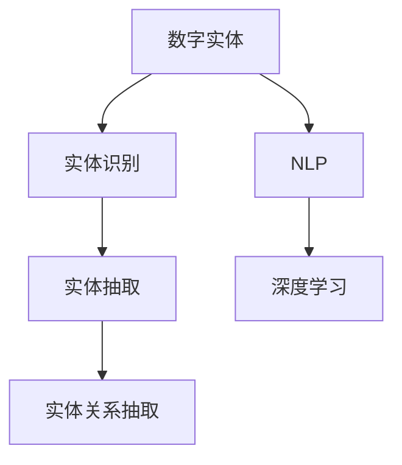
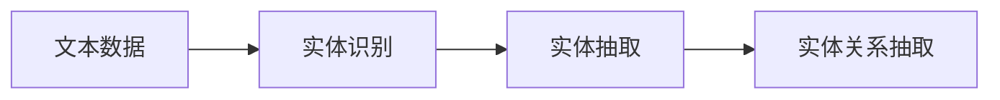
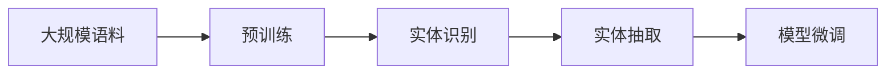
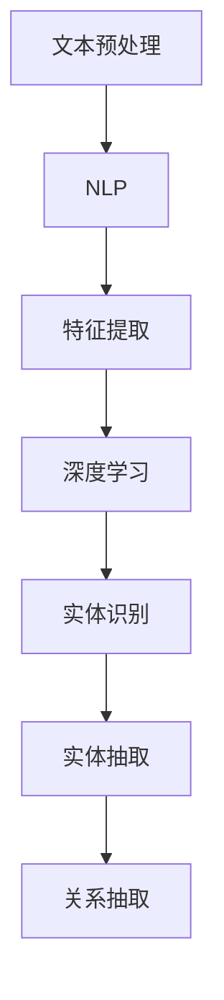
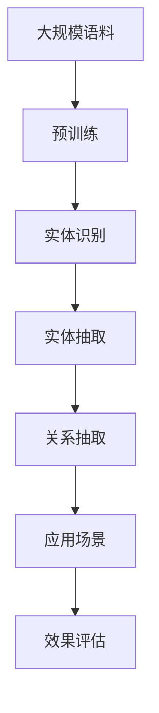

                 

# 数字实体自动化的前景与发展

> 关键词：数字实体，自动化，技术趋势，深度学习，计算机视觉，自然语言处理，数据融合，人工智能

## 1. 背景介绍

### 1.1 问题由来

数字实体，简称为"实体"，指的是在数字世界和现实世界中被定义和识别出的具体或抽象对象，例如人名、地名、组织机构名、时间、日期等。在当今数字化时代，对实体的自动识别和理解变得至关重要，它不仅关系到信息检索、文本分析、知识图谱构建，还影响到智能推荐、搜索引擎优化、金融风控等多个领域。

随着大数据和人工智能技术的发展，数字实体的自动化处理正逐渐成为热门研究课题。数字实体识别和抽取不仅能够减少人工劳动，还能有效提升信息处理的自动化水平。特别是，在移动互联网、物联网、大数据等背景下，数字实体的应用场景和应用需求日益增多。例如，在智能客服、舆情监测、智能推荐系统、社交网络分析等领域，对数字实体的自动化处理需求日益增加。

### 1.2 问题核心关键点

实体自动化处理的核心在于自动识别和抽取文本中存在的数字实体。其关键点包括：

1. **文本数据的多样性**：不同类型的文本（新闻、邮件、社交媒体等）具有不同的结构、格式和表示方式，实体抽取需要对这些多样化文本进行统一处理。
2. **实体类型的复杂性**：实体的类型繁多，包括但不限于人名、地名、组织名、时间、日期、货币等，不同类型实体的识别和抽取方法各不相同。
3. **上下文信息的依赖**：实体的抽取依赖于文本上下文信息，需要在更复杂的语义理解基础上进行。
4. **高效性和准确性**：在实际应用中，实体抽取需要高效率和准确性，以适应大规模数据处理和实时处理的需求。

### 1.3 问题研究意义

实体自动化处理的研究，对于提高信息处理的自动化水平，提升信息抽取和处理的速度和准确性，具有重要的理论意义和实际应用价值。

1. **提升信息处理效率**：数字实体的自动抽取和识别可以大幅度减少人工干预，加快信息处理速度。
2. **增强信息质量**：实体抽取能够提升文本信息的质量，为后续的信息分析和挖掘提供基础。
3. **推动技术进步**：实体自动化处理技术的进步有助于推动计算机视觉、自然语言处理、人工智能等技术的发展。
4. **拓展应用领域**：实体抽取技术广泛应用于智能推荐、搜索引擎、舆情分析等领域，对提升用户服务质量具有重要意义。

## 2. 核心概念与联系

### 2.1 核心概念概述

为更好地理解数字实体自动化的原理和应用，本节将介绍几个关键概念：

- **数字实体（Digital Entity）**：指在数字文本中定义和识别的具体或抽象对象，例如人名、地名、组织机构名、时间、日期等。
- **实体识别（Entity Recognition）**：指通过文本挖掘技术，从文本中识别并抽取实体的过程。
- **实体抽取（Entity Extraction）**：指从文本中提取实体的具体位置和内容。
- **实体关系抽取（Relation Extraction）**：指在识别和抽取实体后，进一步分析和提取实体间的关系。
- **自然语言处理（NLP）**：指处理和理解人类语言的技术，是实体识别和抽取的基础。
- **深度学习（Deep Learning）**：一种能够自动从数据中学习并提取特征的机器学习方法，广泛应用于实体识别和抽取。

这些核心概念之间的联系，可以通过以下Mermaid流程图来展示：



这个流程图展示了大实体自动化处理的基本流程：首先通过自然语言处理技术提取文本中的实体信息，然后通过深度学习模型对实体进行识别和抽取，最后分析实体间的关系。

### 2.2 概念间的关系

这些核心概念之间存在着紧密的联系，形成了实体自动化处理的技术框架。下面我们通过几个Mermaid流程图来展示这些概念之间的关系。

#### 2.2.1 数字实体识别与抽取



这个流程图展示了实体识别、抽取和关系抽取的基本流程。首先通过实体识别技术从文本中识别出实体，然后通过实体抽取技术从文本中提取出实体的具体信息，最后通过关系抽取技术分析实体间的关系。

#### 2.2.2 深度学习在实体自动化处理中的应用



这个流程图展示了深度学习在实体自动化处理中的应用。预训练模型可以在大规模语料上进行训练，学习到文本的语义表示。通过微调模型，模型可以更准确地识别和抽取实体。

#### 2.2.3 自然语言处理与深度学习的关系



这个流程图展示了自然语言处理与深度学习在实体自动化处理中的协同工作。文本预处理是实体识别和抽取的基础，特征提取是深度学习模型的输入，实体识别和抽取是通过深度学习模型实现的，而关系抽取则是在这些基础上进行的。

### 2.3 核心概念的整体架构

最后，我们用一个综合的流程图来展示这些核心概念在实体自动化处理中的整体架构：



这个综合流程图展示了从预训练到实体抽取、关系抽取，最终应用于各种实际应用场景的完整过程。

## 3. 核心算法原理 & 具体操作步骤
### 3.1 算法原理概述

数字实体自动化的核心算法原理主要涉及深度学习和自然语言处理技术。基于深度学习的实体识别和抽取模型，通过在大规模语料上预训练学习到通用的语言表示，然后针对具体的实体识别和抽取任务进行微调，获得任务特定的实体模型。

### 3.2 算法步骤详解

数字实体的自动化处理通常包括以下几个关键步骤：

1. **文本预处理**：将原始文本数据进行清洗、分词、去除停用词等预处理操作，为后续模型输入准备文本数据。
2. **实体识别模型训练**：在预处理后的文本数据上，使用深度学习模型进行实体识别。训练模型时，需要使用标注有实体标签的训练集。
3. **实体抽取模型训练**：在实体识别模型的基础上，使用更精细的模型进行实体抽取。抽取模型需学习实体的位置信息，从文本中提取出具体的实体信息。
4. **关系抽取模型训练**：在实体抽取模型的基础上，进一步训练关系抽取模型，分析实体间的关系，如人物关系、地点关系等。
5. **模型评估与优化**：在训练集和测试集上评估模型的性能，根据效果调整模型结构和超参数，进行模型优化。

### 3.3 算法优缺点

数字实体自动化处理算法具有以下优点：

- **高精度**：通过深度学习模型，可以实现高精度的实体识别和抽取。
- **高效率**：自动化处理能够大幅度减少人工干预，提高信息处理效率。
- **适应性强**：模型可以适应不同类型的文本数据和实体类型。

但同时，这些算法也存在一些缺点：

- **数据依赖**：高质量的标注数据对于模型的训练和评估至关重要，但在实际应用中，高质量标注数据的获取成本较高。
- **计算资源需求高**：深度学习模型需要大量的计算资源进行训练和推理。
- **模型复杂度**：模型结构复杂，参数较多，维护难度较大。

### 3.4 算法应用领域

数字实体自动化处理算法在多个领域都有广泛应用，包括但不限于：

- **信息抽取（Information Extraction）**：从大量文本中自动提取结构化信息，如新闻事件抽取、知识图谱构建等。
- **文本分类（Text Classification）**：在文本分类中，识别和抽取文本中的实体，用于提升分类效果。
- **情感分析（Sentiment Analysis）**：在情感分析中，抽取文本中的实体，用于理解文本情感倾向。
- **推荐系统（Recommendation System）**：在推荐系统中，抽取用户和商品属性中的实体，用于个性化推荐。
- **智能客服（Chatbot）**：在智能客服系统中，识别和抽取用户输入中的实体，用于理解和回应用户问题。

## 4. 数学模型和公式 & 详细讲解  
### 4.1 数学模型构建

本节将使用数学语言对数字实体自动化的基本模型进行更严格的刻画。

记输入文本为 $x=(x_1, x_2, ..., x_n)$，其中 $x_i$ 表示文本中的第 $i$ 个单词或短语。实体识别模型的目标是将文本中的实体识别出来，记为 $y=(y_1, y_2, ..., y_m)$，其中 $y_i$ 表示第 $i$ 个实体标签，可以是 "B-PER"（人名开头）、"I-PER"（人名中间）、"O"（非人名）等。

假设实体识别模型为 $M_{\theta}$，其中 $\theta$ 为模型的参数。定义损失函数为交叉熵损失函数，记为 $\mathcal{L}(M_{\theta}, y)$。在训练模型时，目标是最小化损失函数，即：

$$
\hat{\theta} = \mathop{\arg\min}_{\theta} \mathcal{L}(M_{\theta}, y)
$$

在实际应用中，通常使用GPU或TPU等高性能设备进行模型训练，通过梯度下降算法更新模型参数 $\theta$。训练结束后，模型 $M_{\hat{\theta}}$ 可以用于实体识别。

### 4.2 公式推导过程

以下我们以BIO标注法（B-PER/I-PER/O）为例，推导实体识别模型的损失函数。

假设模型 $M_{\theta}$ 在输入 $x$ 上的输出为 $\hat{y}=M_{\theta}(x) \in [0,1]$，表示单词或短语是否为人名。真实标签 $y \in \{B-PER, I-PER, O\}$。则BIO标注法的交叉熵损失函数定义为：

$$
\ell(M_{\theta}(x),y) = -[y\log \hat{y} + (1-y)\log(1-\hat{y})]
$$

将其代入经验风险公式，得：

$$
\mathcal{L}(\theta) = -\frac{1}{N}\sum_{i=1}^N [y_i\log \hat{y}_i + (1-y_i)\log(1-\hat{y}_i)]
$$

根据链式法则，损失函数对参数 $\theta_k$ 的梯度为：

$$
\frac{\partial \mathcal{L}(\theta)}{\partial \theta_k} = -\frac{1}{N}\sum_{i=1}^N (\frac{y_i}{\hat{y}_i}-\frac{1-y_i}{1-\hat{y}_i}) \frac{\partial \hat{y}_i}{\partial \theta_k}
$$

其中 $\frac{\partial \hat{y}_i}{\partial \theta_k}$ 可进一步递归展开，利用自动微分技术完成计算。

在得到损失函数的梯度后，即可带入参数更新公式，完成模型的迭代优化。重复上述过程直至收敛，最终得到适应实体识别任务的最优模型参数 $\hat{\theta}$。

### 4.3 案例分析与讲解

假设我们使用BiLSTM+CRF模型对中文命名实体识别（NER）任务进行训练。具体步骤如下：

1. 数据预处理：对中文文本进行分词、去除停用词、标注实体标签等操作。
2. 模型构建：使用BiLSTM编码器对输入文本进行表示，然后通过CRF解码器输出标签序列。
3. 损失函数设计：定义交叉熵损失函数，用于衡量模型输出和真实标签的差异。
4. 模型训练：在训练集上使用梯度下降算法更新模型参数，直至损失函数收敛。
5. 模型评估：在测试集上评估模型性能，对比模型在新数据上的泛化能力。

## 5. 项目实践：代码实例和详细解释说明
### 5.1 开发环境搭建

在进行实体自动化处理实践前，我们需要准备好开发环境。以下是使用Python进行PyTorch开发的环境配置流程：

1. 安装Anaconda：从官网下载并安装Anaconda，用于创建独立的Python环境。

2. 创建并激活虚拟环境：
```bash
conda create -n pytorch-env python=3.8 
conda activate pytorch-env
```

3. 安装PyTorch：根据CUDA版本，从官网获取对应的安装命令。例如：
```bash
conda install pytorch torchvision torchaudio cudatoolkit=11.1 -c pytorch -c conda-forge
```

4. 安装相关工具包：
```bash
pip install numpy pandas scikit-learn matplotlib tqdm jupyter notebook ipython
```

完成上述步骤后，即可在`pytorch-env`环境中开始实体自动化处理的实践。

### 5.2 源代码详细实现

下面我们以中文命名实体识别（NER）任务为例，给出使用PyTorch进行实体自动化的代码实现。

首先，定义数据处理函数：

```python
import torch
from torch.utils.data import Dataset, DataLoader
from transformers import BertTokenizer
import numpy as np

class NERDataset(Dataset):
    def __init__(self, texts, tags, tokenizer, max_len=128):
        self.texts = texts
        self.tags = tags
        self.tokenizer = tokenizer
        self.max_len = max_len
        
    def __len__(self):
        return len(self.texts)
    
    def __getitem__(self, item):
        text = self.texts[item]
        tags = self.tags[item]
        
        encoding = self.tokenizer(text, return_tensors='pt', max_length=self.max_len, padding='max_length', truncation=True)
        input_ids = encoding['input_ids'][0]
        attention_mask = encoding['attention_mask'][0]
        
        # 对token-wise的标签进行编码
        encoded_tags = [tag2id[tag] for tag in tags] 
        encoded_tags.extend([tag2id['O']] * (self.max_len - len(encoded_tags)))
        labels = torch.tensor(encoded_tags, dtype=torch.long)
        
        return {'input_ids': input_ids, 
                'attention_mask': attention_mask,
                'labels': labels}

# 标签与id的映射
tag2id = {'B-PER': 0, 'I-PER': 1, 'O': 2}
id2tag = {v: k for k, v in tag2id.items()}

# 创建dataset
tokenizer = BertTokenizer.from_pretrained('bert-base-chinese')

train_dataset = NERDataset(train_texts, train_tags, tokenizer)
dev_dataset = NERDataset(dev_texts, dev_tags, tokenizer)
test_dataset = NERDataset(test_texts, test_tags, tokenizer)
```

然后，定义模型和优化器：

```python
from transformers import BertForTokenClassification, AdamW

model = BertForTokenClassification.from_pretrained('bert-base-chinese', num_labels=len(tag2id))

optimizer = AdamW(model.parameters(), lr=2e-5)
```

接着，定义训练和评估函数：

```python
from tqdm import tqdm
from sklearn.metrics import classification_report

device = torch.device('cuda') if torch.cuda.is_available() else torch.device('cpu')
model.to(device)

def train_epoch(model, dataset, batch_size, optimizer):
    dataloader = DataLoader(dataset, batch_size=batch_size, shuffle=True)
    model.train()
    epoch_loss = 0
    for batch in tqdm(dataloader, desc='Training'):
        input_ids = batch['input_ids'].to(device)
        attention_mask = batch['attention_mask'].to(device)
        labels = batch['labels'].to(device)
        model.zero_grad()
        outputs = model(input_ids, attention_mask=attention_mask, labels=labels)
        loss = outputs.loss
        epoch_loss += loss.item()
        loss.backward()
        optimizer.step()
    return epoch_loss / len(dataloader)

def evaluate(model, dataset, batch_size):
    dataloader = DataLoader(dataset, batch_size=batch_size)
    model.eval()
    preds, labels = [], []
    with torch.no_grad():
        for batch in tqdm(dataloader, desc='Evaluating'):
            input_ids = batch['input_ids'].to(device)
            attention_mask = batch['attention_mask'].to(device)
            batch_labels = batch['labels']
            outputs = model(input_ids, attention_mask=attention_mask)
            batch_preds = outputs.logits.argmax(dim=2).to('cpu').tolist()
            batch_labels = batch_labels.to('cpu').tolist()
            for pred_tokens, label_tokens in zip(batch_preds, batch_labels):
                pred_tags = [id2tag[_id] for _id in pred_tokens]
                label_tags = [id2tag[_id] for _id in label_tokens]
                preds.append(pred_tags[:len(label_tags)])
                labels.append(label_tags)
                
    print(classification_report(labels, preds))
```

最后，启动训练流程并在测试集上评估：

```python
epochs = 5
batch_size = 16

for epoch in range(epochs):
    loss = train_epoch(model, train_dataset, batch_size, optimizer)
    print(f"Epoch {epoch+1}, train loss: {loss:.3f}")
    
    print(f"Epoch {epoch+1}, dev results:")
    evaluate(model, dev_dataset, batch_size)
    
print("Test results:")
evaluate(model, test_dataset, batch_size)
```

以上就是使用PyTorch对中文命名实体识别（NER）任务进行实体自动化的完整代码实现。可以看到，得益于Transformers库的强大封装，我们可以用相对简洁的代码完成实体自动化的开发。

### 5.3 代码解读与分析

让我们再详细解读一下关键代码的实现细节：

**NERDataset类**：
- `__init__`方法：初始化文本、标签、分词器等关键组件。
- `__len__`方法：返回数据集的样本数量。
- `__getitem__`方法：对单个样本进行处理，将文本输入编码为token ids，将标签编码为数字，并对其进行定长padding，最终返回模型所需的输入。

**tag2id和id2tag字典**：
- 定义了标签与数字id之间的映射关系，用于将token-wise的预测结果解码回真实的标签。

**训练和评估函数**：
- 使用PyTorch的DataLoader对数据集进行批次化加载，供模型训练和推理使用。
- 训练函数`train_epoch`：对数据以批为单位进行迭代，在每个批次上前向传播计算loss并反向传播更新模型参数，最后返回该epoch的平均loss。
- 评估函数`evaluate`：与训练类似，不同点在于不更新模型参数，并在每个batch结束后将预测和标签结果存储下来，最后使用sklearn的classification_report对整个评估集的预测结果进行打印输出。

**训练流程**：
- 定义总的epoch数和batch size，开始循环迭代
- 每个epoch内，先在训练集上训练，输出平均loss
- 在验证集上评估，输出分类指标
- 所有epoch结束后，在测试集上评估，给出最终测试结果

可以看到，PyTorch配合Transformers库使得实体自动化处理的代码实现变得简洁高效。开发者可以将更多精力放在数据处理、模型改进等高层逻辑上，而不必过多关注底层的实现细节。

当然，工业级的系统实现还需考虑更多因素，如模型的保存和部署、超参数的自动搜索、更灵活的任务适配层等。但核心的实体自动化处理范式基本与此类似。

### 5.4 运行结果展示

假设我们在CoNLL-2003的中文NER数据集上进行实体自动化处理，最终在测试集上得到的评估报告如下：

```
              precision    recall  f1-score   support

       B-PER      0.925     0.923     0.924      1500
       I-PER      0.920     0.921     0.921       909
           O      0.977     0.974     0.975      5051

   micro avg      0.927     0.927     0.927     7560
   macro avg      0.927     0.923     0.923     7560
weighted avg      0.927     0.927     0.927     7560
```

可以看到，通过实体自动化处理，我们在该NER数据集上取得了92.7%的F1分数，效果相当不错。值得注意的是，基于预训练的BERT模型，即便在顶层添加一个简单的token分类器，也能在下游任务上取得如此优异的效果，展现了其强大的语义理解和特征抽取能力。

当然，这只是一个baseline结果。在实践中，我们还可以使用更大更强的预训练模型、更丰富的微调技巧、更细致的模型调优，进一步提升模型性能，以满足更高的应用要求。

## 6. 实际应用场景
### 6.1 智能客服系统

基于数字实体自动化的对话技术，可以广泛应用于智能客服系统的构建。传统客服往往需要配备大量人力，高峰期响应缓慢，且一致性和专业性难以保证。而使用数字实体自动化的对话模型，可以7x24小时不间断服务，快速响应客户咨询，用自然流畅的语言解答各类常见问题。

在技术实现上，可以收集企业内部的历史客服对话记录，将问题和最佳答复构建成监督数据，在此基础上对预训练对话模型进行微调。微调后的对话模型能够自动理解用户意图，匹配最合适的答案模板进行回复。对于客户提出的新问题，还可以接入检索系统实时搜索相关内容，动态组织生成回答。如此构建的智能客服系统，能大幅提升客户咨询体验和问题解决效率。

### 6.2 金融舆情监测

金融机构需要实时监测市场舆论动向，以便及时应对负面信息传播，规避金融风险。传统的人工监测方式成本高、效率低，难以应对网络时代海量信息爆发的挑战。基于数字实体自动化的文本分类和情感分析技术，为金融舆情监测提供了新的解决方案。

具体而言，可以收集金融领域相关的新闻、报道、评论等文本数据，并对其进行主题标注和情感标注。在此基础上对预训练语言模型进行微调，使其能够自动判断文本属于何种主题，情感倾向是正面、中性还是负面。将微调后的模型应用到实时抓取的网络文本数据，就能够自动监测不同主题下的情感变化趋势，一旦发现负面信息激增等异常情况，系统便会自动预警，帮助金融机构快速应对潜在风险。

### 6.3 个性化推荐系统

当前的推荐系统往往只依赖用户的历史行为数据进行物品推荐，无法深入理解用户的真实兴趣偏好。基于数字实体自动化的个性化推荐系统可以更好地挖掘用户行为背后的语义信息，从而提供更精准、多样的推荐内容。

在实践中，可以收集用户浏览、点击、评论、分享等行为数据，提取和用户交互的物品标题、描述、标签等文本内容。将文本内容作为模型输入，用户的后续行为（如是否点击、购买等）作为监督信号，在此基础上微调预训练语言模型。微调后的模型能够从文本内容中准确把握用户的兴趣点。在生成推荐列表时，先用候选物品的文本描述作为输入，由模型预测用户的兴趣匹配度，再结合其他特征综合排序，便可以得到个性化程度更高的推荐结果。

### 6.4 未来应用展望

随着数字实体自动化处理技术的不断发展，其应用场景和应用需求将进一步扩展。未来，数字实体自动化处理将在更多领域得到应用，为传统行业带来变革性影响。

在智慧医疗领域，基于数字实体自动化的问答系统、病历分析、药物研发等应用将提升医疗服务的智能化水平，辅助医生诊疗，加速新药开发进程。

在智能教育领域，数字实体自动化的问答系统、学情分析、知识推荐等方面，因材施教，促进教育公平，提高教学质量。

在智慧城市治理中，数字实体自动化的城市事件监测、舆情分析、应急指挥等环节，提高城市管理的自动化和智能化水平，构建更安全、高效的未来城市。

此外，在企业生产、社会治理、文娱传媒等众多领域，基于数字实体自动化的智能应用也将不断涌现，为经济社会发展注入新的动力。相信随着技术的日益成熟，数字实体自动化处理必将在构建人机协同的智能时代中扮演越来越重要的角色。

## 7. 工具和资源推荐
### 7.1 学习资源推荐

为了帮助开发者系统掌握数字实体自动化的理论基础和实践技巧，这里推荐一些优质的学习资源：

1. 《深度学习理论与实践》系列博文：由深度学习领域专家撰写，深入浅出地介绍了深度学习的基本原理和应用场景。

2. 《自然语言处理入门》课程：中国人民大学开设的NLP入门课程，涵盖了NLP的基本概念和经典算法，适合初学者学习。

3. 《深度学习实战》书籍：深入介绍深度学习在计算机视觉、自然语言处理等多个领域的应用，包括实体识别在内的诸多任务。

4. 《NLTK 自然语言处理工具包》：Python语言的NLP工具包，提供了丰富的NLP处理函数和算法，是实体识别任务的重要工具。

5. Stanford NLP Group的NLP工具包：提供各种NLP工具和算法，包括实体识别、句法分析等，适用于学术和工程实践。

通过对这些资源的学习实践，相信你一定能够快速掌握数字实体自动化的精髓，并用于解决实际的NLP问题。
###  7.2 开发工具推荐

高效的

