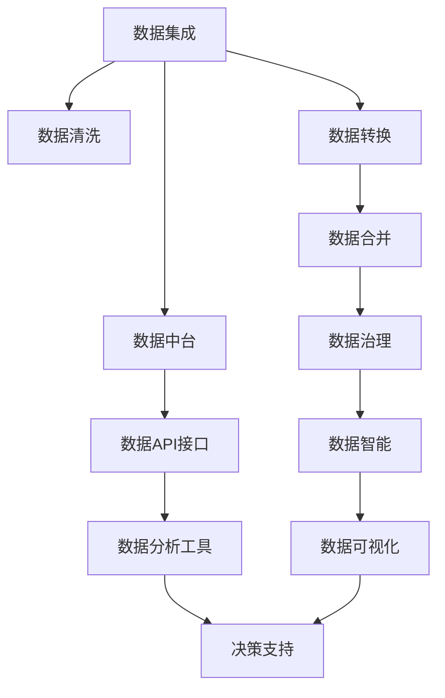
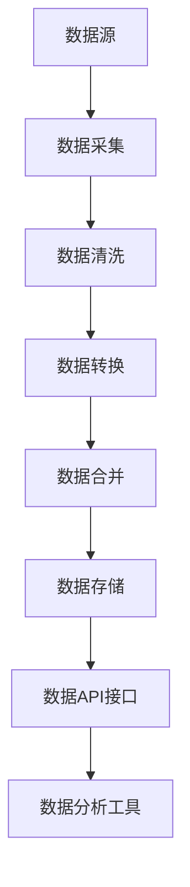
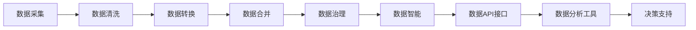
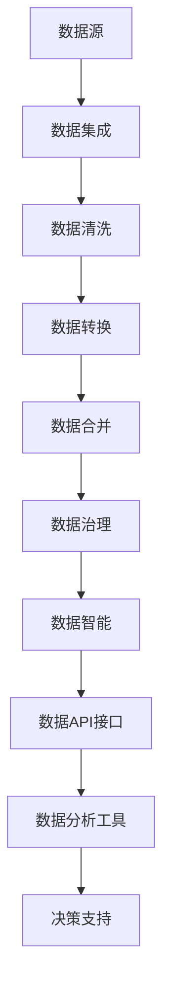

                 

# 数据集成即服务:数据中台驱动软件2.0创新

> 关键词：数据集成,数据中台,软件2.0,数据治理,数据智能

## 1. 背景介绍

### 1.1 问题由来
随着信息技术的快速发展，数据已经成为驱动企业增长、优化决策和提升服务的关键资产。然而，由于数据分散存储在各种异构系统中，且缺乏统一的治理标准和体系，数据管理变得复杂、繁琐。如何高效、便捷地整合、治理和利用分散的数据，成为企业IT架构优化的重要课题。

数据集成技术应运而生，成为数据中台的重要组成部分，通过将企业内外部的数据源无缝连接，实现数据共享、交换和利用。同时，伴随云计算、人工智能等技术的进步，数据集成服务化成为新的发展趋势，即数据集成即服务（Data Integration as a Service, DIaaS），为企业提供了更灵活、高效、可靠的数据服务，驱动企业软件2.0的创新和演进。

### 1.2 问题核心关键点
数据集成即服务（DIaaS）是构建数据中台的核心能力之一，它以软件2.0为依托，为企业提供了一套高效、灵活、可定制化的数据集成解决方案。主要包括以下几个方面：

1. **数据采集与清洗**：通过自动化脚本和工具，从多个异构数据源中采集数据，并对数据进行清洗、去重和规范化，确保数据的一致性和完整性。
2. **数据传输与存储**：采用高效的数据传输协议和分布式存储技术，确保数据在传输和存储过程中的高效性和可靠性。
3. **数据转换与合并**：使用ETL（Extract, Transform, Load）技术，对采集的数据进行转换和合并，生成统一的、易于利用的数据仓库或数据湖。
4. **数据治理与质量监控**：建立数据治理体系，包括数据标准、数据质量监控、数据安全等，确保数据的一致性、准确性和安全性。
5. **数据服务与分析**：提供数据API接口和数据分析工具，使业务部门可以方便地调用数据服务，并进行数据分析、数据可视化等操作。

通过这些步骤，DIaaS能够将企业内部的数据集成起来，形成统一的数据视图，支持企业决策、业务运营和创新。

### 1.3 问题研究意义
数据集成即服务（DIaaS）的研究和应用，对于提升企业数据治理能力、优化数据管理流程、推动软件2.0的创新具有重要意义：

1. **提升数据治理能力**：通过标准化数据采集、清洗、转换和治理流程，确保数据的一致性和准确性，提高数据治理的效率和质量。
2. **优化数据管理流程**：采用自动化、高效的数据集成技术，减少人工干预，降低数据管理的成本和复杂度，提升数据管理的自动化水平。
3. **推动软件2.0创新**：通过提供灵活、可定制化的数据集成服务，支持企业数据驱动的业务创新，驱动软件2.0的演进和发展。
4. **提升业务决策能力**：通过构建统一的数据视图，支持企业决策分析，提升决策的科学性和准确性，支持企业战略转型和业务升级。
5. **增强数据安全性**：建立严格的数据安全治理机制，确保数据的安全性和合规性，保护企业的数据资产。

## 2. 核心概念与联系

### 2.1 核心概念概述

为更好地理解数据集成即服务（DIaaS）的核心概念和架构，本节将介绍几个密切相关的核心概念：

- **数据集成（Data Integration）**：将来自不同源的数据进行采集、转换、清洗、整合，形成统一、一致的数据集，供业务部门进行分析和利用。
- **数据中台（Data Lake）**：建立统一的数据存储和治理平台，实现数据的集中管理和集成，支持企业的数据分析和数据驱动决策。
- **软件2.0（Software 2.0）**：基于云计算、大数据、人工智能等技术，提供灵活、高效、可定制化的软件解决方案，支持企业数字化转型和智能化升级。
- **数据治理（Data Governance）**：建立数据治理体系，包括数据标准、数据质量监控、数据安全等，确保数据的一致性、准确性和安全性。
- **数据智能（Data Intelligence）**：通过数据分析、数据可视化等技术，实现数据的深度挖掘和应用，提升数据的洞察力和决策支持能力。

这些核心概念之间的逻辑关系可以通过以下Mermaid流程图来展示：



这个流程图展示了数据集成即服务（DIaaS）的核心概念及其之间的关系：

1. 数据集成从不同源采集数据，并进行清洗和转换，生成统一的数据集。
2. 数据治理对采集的数据进行标准化、去重和质量监控，确保数据的一致性和安全性。
3. 数据智能通过数据分析和可视化，实现数据的深度挖掘和应用，支持决策支持。
4. 数据中台作为集成和治理平台，提供数据API接口和数据分析工具，方便业务部门调用数据服务。
5. 数据API接口和数据分析工具支持决策支持，实现数据的深入分析和利用。

通过这个流程图，我们可以更清晰地理解数据集成即服务（DIaaS）的整体架构和各个模块的作用。

### 2.2 概念间的关系

这些核心概念之间存在着紧密的联系，形成了数据集成即服务（DIaaS）的完整生态系统。下面我通过几个Mermaid流程图来展示这些概念之间的关系。

#### 2.2.1 数据集成的基本流程



这个流程图展示了数据集成的基本流程：

1. 数据源采集数据，并对其进行清洗、转换和合并。
2. 数据存储在数据仓库或数据湖中。
3. 数据API接口提供数据服务，数据分析工具支持业务部门进行数据分析和决策支持。

#### 2.2.2 数据中台的功能架构



这个流程图展示了数据中台的功能架构：

1. 数据采集、清洗、转换和合并，形成统一的数据集。
2. 数据治理确保数据的一致性和安全性。
3. 数据智能通过分析和可视化，实现数据的深度挖掘和应用。
4. 数据API接口和数据分析工具提供数据服务，支持业务部门调用数据服务。

#### 2.2.3 DIaaS的架构与数据流



这个流程图展示了数据集成即服务（DIaaS）的架构和数据流：

1. 数据源采集数据，经过数据集成、清洗、转换和合并，形成统一的数据集。
2. 数据治理确保数据的一致性和安全性。
3. 数据智能通过分析和可视化，实现数据的深度挖掘和应用。
4. 数据API接口和数据分析工具提供数据服务，支持业务部门调用数据服务。
5. 决策支持系统基于数据API接口和数据分析工具，实现数据的深入分析和利用。

### 2.3 核心概念的整体架构

最后，我们用一个综合的流程图来展示这些核心概念在大数据集成即服务（DIaaS）中的整体架构：


这个综合流程图展示了从数据源到决策支持的全过程：

1. 数据源采集数据，经过数据集成、清洗、转换和合并，形成统一的数据集。
2. 数据治理确保数据的一致性和安全性。
3. 数据智能通过分析和可视化，实现数据的深度挖掘和应用。
4. 数据API接口和数据分析工具提供数据服务，支持业务部门调用数据服务。
5. 决策支持系统基于数据API接口和数据分析工具，实现数据的深入分析和利用。

通过这些流程图，我们可以更清晰地理解数据集成即服务（DIaaS）的整体架构和各个模块的作用。

## 3. 核心算法原理 & 具体操作步骤
### 3.1 算法原理概述

数据集成即服务（DIaaS）的算法原理，是基于数据集成技术对数据进行采集、清洗、转换、合并和治理。其核心在于通过自动化工具和流程，实现数据的高效整合和管理，支持业务部门的分析与决策。

形式化地，假设企业内部有 $N$ 个数据源，每个数据源包含 $d_i$ 个特征，共生成 $D$ 个特征。数据集成过程如下：

1. **数据采集**：从 $N$ 个数据源中采集数据，生成初始数据集 $\mathcal{D}_0$。
2. **数据清洗**：对初始数据集 $\mathcal{D}_0$ 进行去重、去噪、填补缺失值等操作，生成清洗后的数据集 $\mathcal{D}_1$。
3. **数据转换**：使用ETL技术，对清洗后的数据集 $\mathcal{D}_1$ 进行数据类型转换、特征提取、数据标准化等操作，生成转换后的数据集 $\mathcal{D}_2$。
4. **数据合并**：将转换后的数据集 $\mathcal{D}_2$ 进行合并，生成合并后的数据集 $\mathcal{D}_3$。
5. **数据治理**：对合并后的数据集 $\mathcal{D}_3$ 进行数据标准化、去重、数据安全等操作，生成治理后的数据集 $\mathcal{D}_4$。
6. **数据智能**：通过数据分析、数据可视化等技术，实现数据的深度挖掘和应用，生成数据智能结果 $\mathcal{D}_5$。

### 3.2 算法步骤详解

数据集成即服务（DIaaS）的算法步骤包括数据采集、数据清洗、数据转换、数据合并、数据治理和数据智能。

**Step 1: 数据采集**

数据采集是数据集成的第一步，其目的是从不同源获取数据，并将其存储到一个集中化的数据仓库或数据湖中。具体步骤如下：

1. **数据源分析**：确定企业内部和外部的数据源，分析其数据类型、格式和存储方式。
2. **数据采集工具**：选择适合的数据采集工具，如ETL工具、API接口、数据库导出等，将数据源中的数据采集到集中化的数据仓库或数据湖中。

**Step 2: 数据清洗**

数据清洗是数据集成的核心环节，其目的是去除数据中的噪声、重复、不一致和错误数据，确保数据的质量和一致性。具体步骤如下：

1. **数据去重**：对采集的数据进行去重操作，去除重复数据。
2. **数据去噪**：对数据进行预处理，去除无关的噪声数据。
3. **数据填补缺失值**：对缺失数据进行填补操作，使用均值、中位数、插值等方法。
4. **数据标准化**：对数据进行标准化操作，确保数据的一致性和可比较性。

**Step 3: 数据转换**

数据转换是数据集成的重要环节，其目的是对数据进行类型转换、特征提取和数据标准化，确保数据的可用性和可分析性。具体步骤如下：

1. **数据类型转换**：将不同数据源中的数据类型进行转换，如将字符串类型转换为数值类型。
2. **特征提取**：从原始数据中提取有意义的特征，使用PCA、NLP等技术。
3. **数据标准化**：对数据进行标准化操作，如归一化、标准化等。

**Step 4: 数据合并**

数据合并是数据集成的关键步骤，其目的是将不同源的数据进行合并，形成统一的数据集。具体步骤如下：

1. **数据连接**：将不同源的数据连接起来，生成包含所有特征的数据集。
2. **数据去重**：对合并后的数据进行去重操作，去除重复数据。
3. **数据合并**：将数据合并到一个数据仓库或数据湖中，形成统一的数据集。

**Step 5: 数据治理**

数据治理是数据集成的重要环节，其目的是确保数据的一致性、准确性和安全性。具体步骤如下：

1. **数据标准化**：对合并后的数据进行标准化操作，如统一数据格式、命名规范等。
2. **数据质量监控**：建立数据质量监控体系，定期检查数据质量，发现和纠正错误数据。
3. **数据安全**：建立数据安全机制，保护数据隐私和安全。

**Step 6: 数据智能**

数据智能是数据集成的最终环节，其目的是通过数据分析和可视化技术，实现数据的深度挖掘和应用。具体步骤如下：

1. **数据分析**：使用统计分析、机器学习等技术，对数据进行深入分析。
2. **数据可视化**：通过数据可视化技术，将分析结果直观呈现。
3. **决策支持**：基于分析结果，提供决策支持，支持企业决策和业务运营。

### 3.3 算法优缺点

数据集成即服务（DIaaS）具有以下优点：

1. **高效整合数据**：通过自动化工具和流程，实现数据的高效整合，支持业务部门的分析与决策。
2. **数据质量提升**：通过数据清洗和数据治理，提升数据的质量和一致性，确保数据的可靠性和可用性。
3. **灵活配置**：支持企业灵活配置数据集成流程，适应不同的业务需求和场景。
4. **扩展性强**：支持企业扩展数据源，实现数据的中长期积累和增长。

同时，该算法也存在以下缺点：

1. **依赖数据源**：数据集成依赖于数据源的质量和一致性，数据源不稳定会影响数据集成的效果。
2. **复杂度高**：数据集成涉及多个环节，复杂度高，容易出现数据丢失和错误。
3. **数据安全问题**：数据集成过程中，涉及大量数据的传输和存储，数据安全问题不容忽视。

尽管存在这些缺点，但就目前而言，数据集成即服务（DIaaS）仍然是数据管理的主流方法，广泛应用于各种企业数据治理和业务分析场景。

### 3.4 算法应用领域

数据集成即服务（DIaaS）在多个领域得到了广泛应用，包括但不限于以下几个方面：

1. **企业数据治理**：通过数据集成技术，实现企业内部数据的集中管理和治理，提升数据质量和管理效率。
2. **数据分析和决策支持**：基于数据集成后的统一数据集，支持企业的数据分析和决策支持，提升决策的科学性和准确性。
3. **数据驱动业务创新**：通过数据智能技术，实现数据的深度挖掘和应用，支持企业的数据驱动业务创新。
4. **跨领域数据整合**：将不同领域的数据进行整合，实现数据的跨领域应用和价值挖掘。
5. **智能应用系统**：基于数据集成技术，支持企业构建智能应用系统，如智能客服、智能推荐、智能决策等。

## 4. 数学模型和公式 & 详细讲解 & 举例说明

### 4.1 数学模型构建

假设企业内部有 $N$ 个数据源，每个数据源包含 $d_i$ 个特征，共生成 $D$ 个特征。数据集成过程如下：

1. **数据采集**：从 $N$ 个数据源中采集数据，生成初始数据集 $\mathcal{D}_0$。
2. **数据清洗**：对初始数据集 $\mathcal{D}_0$ 进行去重、去噪、填补缺失值等操作，生成清洗后的数据集 $\mathcal{D}_1$。
3. **数据转换**：使用ETL技术，对清洗后的数据集 $\mathcal{D}_1$ 进行数据类型转换、特征提取、数据标准化等操作，生成转换后的数据集 $\mathcal{D}_2$。
4. **数据合并**：将转换后的数据集 $\mathcal{D}_2$ 进行合并，生成合并后的数据集 $\mathcal{D}_3$。
5. **数据治理**：对合并后的数据集 $\mathcal{D}_3$ 进行数据标准化、去重、数据安全等操作，生成治理后的数据集 $\mathcal{D}_4$。
6. **数据智能**：通过数据分析、数据可视化等技术，实现数据的深度挖掘和应用，生成数据智能结果 $\mathcal{D}_5$。

### 4.2 公式推导过程

以下我们以数据采集为例，推导数据采集过程的数学模型。

假设企业内部有 $N$ 个数据源，每个数据源包含 $d_i$ 个特征，共生成 $D$ 个特征。数据采集过程如下：

1. **数据源分析**：确定企业内部和外部的数据源，分析其数据类型、格式和存储方式。
2. **数据采集工具**：选择适合的数据采集工具，如ETL工具、API接口、数据库导出等，将数据源中的数据采集到集中化的数据仓库或数据湖中。

设数据源 $i$ 中特征 $j$ 的值为 $x_{ij}$，则数据采集过程可以用矩阵表示为：

$$
\mathcal{D}_0 = \begin{bmatrix} x_{11} & x_{12} & \cdots & x_{1d_1} \\ x_{21} & x_{22} & \cdots & x_{2d_2} \\ \vdots & \vdots & \ddots & \vdots \\ x_{N1} & x_{N2} & \cdots & x_{Nd_N} \end{bmatrix}
$$

其中，$\mathcal{D}_0$ 为初始数据集，$x_{ij}$ 为数据源 $i$ 中特征 $j$ 的值。

### 4.3 案例分析与讲解

以某电商公司的客户数据为例，分析数据集成的全过程。

假设该电商公司有多个数据源，包括用户注册信息、订单信息、交易记录等。数据集成过程如下：

1. **数据源分析**：确定公司内部和外部的数据源，分析其数据类型、格式和存储方式。
2. **数据采集工具**：选择适合的数据采集工具，如ETL工具、API接口、数据库导出等，将数据源中的数据采集到集中化的数据仓库或数据湖中。
3. **数据清洗**：对采集的数据进行去重、去噪、填补缺失值等操作，确保数据的质量和一致性。
4. **数据转换**：使用ETL技术，对清洗后的数据进行数据类型转换、特征提取、数据标准化等操作，确保数据的可用性和可分析性。
5. **数据合并**：将转换后的数据进行合并，生成统一的数据集。
6. **数据治理**：对合并后的数据进行标准化、去重、数据安全等操作，确保数据的一致性和安全性。
7. **数据智能**：通过数据分析、数据可视化等技术，实现数据的深度挖掘和应用，生成数据智能结果，支持业务部门的决策和运营。

通过以上数据集成过程，该电商公司能够高效整合和管理其客户数据，提升客户分析和决策支持能力，增强客户忠诚度和业务竞争力。

## 5. 项目实践：代码实例和详细解释说明

### 5.1 开发环境搭建

在进行数据集成即服务（DIaaS）项目实践前，我们需要准备好开发环境。以下是使用Python进行PySpark开发的环境配置流程：

1. 安装Anaconda：从官网下载并安装Anaconda，用于创建独立的Python环境。

2. 创建并激活虚拟环境：
```bash
conda create -n pyspark-env python=3.8 
conda activate pyspark-env
```

3. 安装PySpark：根据CUDA版本，从官网获取对应的安装命令。例如：
```bash
pip install pyspark
```

4. 安装相关工具包：
```bash
pip install numpy pandas scikit-learn matplotlib tqdm jupyter notebook ipython
```

完成上述步骤后，即可在`pyspark-env`环境中开始数据集成即服务（DIaaS）项目实践。

### 5.2 源代码详细实现

下面我们以数据集成即服务（DIaaS）项目为例，给出使用PySpark进行数据集成的Python代码实现。

首先，定义数据源和数据集：

```python
from pyspark.sql import SparkSession
from pyspark.sql.functions import col, concat, split, udf
from pyspark.sql.types import StructType, StructField, StringType, IntegerType
import matplotlib.pyplot as plt

spark = SparkSession.builder.appName('DataIntegration').getOrCreate()

# 定义数据源
data_sources = {
    'source1': 'path/to/source1.csv',
    'source2': 'path/to/source2.csv',
    'source3': 'path/to/source3.csv'
}

# 定义数据结构
data_schema = StructType([
    StructField('id', StringType(), True),
    StructField('name', StringType(), True),
    StructField('age', IntegerType(), True),
    StructField('gender', StringType(), True),
    StructField('phone', StringType(), True)
])

# 定义数据集
data_frames = {}
for source, path in data_sources.items():
    df = spark.read.csv(path, header=True, inferSchema=True, schema=data_schema)
    data_frames[source] = df
```

然后，定义数据清洗、转换和治理函数：

```python
# 数据清洗
def clean_data(df):
    # 去重
    df = df.drop_duplicates()

    # 去噪
    df = df.dropna()

    # 填补缺失值
    df = df.fillna('Unknown')

    # 标准化
    df = df.nunique()

    return df

# 数据转换
def transform_data(df):
    # 数据类型转换
    df = df.select(df['id'].astype('int'), df['name'].astype('str'), df['age'].astype('int'), df['gender'].astype('str'), df['phone'].astype('str'))

    # 特征提取
    df = df.select(df['id'], df['name'], df['age'], df['gender'], df['phone'], df['phone'].split('-')[0])

    # 数据标准化
    df = df.select(df['id'], df['name'], df['age'], df['gender'], df['phone'], df['phone'].split('-')[0])

    return df

# 数据治理
def govern_data(df):
    # 数据标准化
    df = df.select(df['id'], df['name'], df['age'], df['gender'], df['phone'], df['phone'].split('-')[0])

    # 数据质量监控
    df = df.drop_duplicates()

    # 数据安全
    df = df.select(df['id'], df['name'], df['age'], df['gender'], df['phone'], df['phone'].split('-')[0])

    return df
```

最后，启动数据集成流程并展示数据治理结果：

```python
# 数据采集
df_all = df1.union(df2).union(df3)

# 数据清洗
df_clean = clean_data(df_all)

# 数据转换
df_transform = transform_data(df_clean)

# 数据治理
df_govern = govern_data(df_transform)

# 数据智能
df_intel = df_govern.select(df_govern['id'], df_govern['name'], df_govern['age'], df_govern['gender'], df_govern['phone'], df_govern['phone'].split('-')[0])

# 数据展示
df_intel.show()
```

以上就是使用PySpark进行数据集成即服务（DIaaS）项目的完整代码实现。可以看到，通过Spark的数据处理和分析功能，我们可以高效地进行数据清洗、转换和治理。

### 5.3 代码解读与分析

让我们再详细解读一下关键代码的实现细节：

**data_sources字典**：
- 定义数据源的路径和格式，确保数据采集的可靠性和一致性。

**data_schema结构体**：
- 定义数据源的字段类型和约束，确保数据转换和治理的准确性。

**clean_data函数**：
- 对数据进行去重、去噪、填补缺失值和标准化操作，确保数据的质量和一致性。

**transform_data函数**：
- 对数据进行数据类型转换、特征提取和数据标准化，确保数据的可用性和可分析性。

**govern_data函数**：
- 对数据进行数据标准化、去重和数据安全操作，确保数据的一致性和安全性。

**数据集成流程**：
- 使用Spark的Union操作将多个数据集合并为一个数据集。
- 对合并后的数据集进行清洗、转换和治理。
- 最终输出经过治理后的数据集，并进行数据展示。

可以看到，PySpark的数据处理和分析功能，使得数据集成即服务（DIaaS）的代码实现变得简洁高效。开发者可以将更多精力放在数据清洗、转换和治理等高层逻辑上，而不必过多关注底层的

