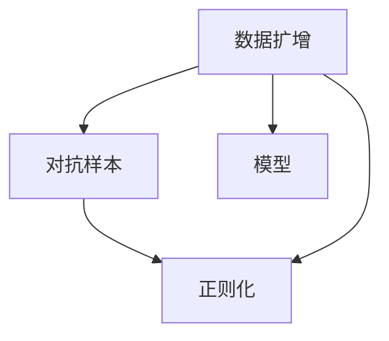

                 

## 1. 背景介绍

### 1.1 问题由来
随着人工智能技术的发展，深度学习在各行各业的应用越来越广泛。然而，深度学习模型通常需要大量标注数据进行训练，这对数据采集和标注成本提出了高要求。特别是对于小数据量（通常是几千到几万条样本）的场景，获取高质量标注数据往往非常困难。因此，如何在小数据量条件下训练高性能模型，成为人工智能领域的一项重要研究课题。

### 1.2 问题核心关键点
数据集扩增（Data Augmentation）技术通过引入噪声、变换、组合等手段，从原始数据集中生成新的、带有干扰的信息样本，从而扩充训练数据量，提升模型的泛化能力。数据集扩增方法主要包括图像扩增、文本扩增、音频扩增等，其核心思想是利用数据变换技巧，将原始数据转换为具有不同视角的新样本，从而增加模型的鲁棒性和泛化性。

### 1.3 问题研究意义
数据集扩增技术在深度学习中具有重要意义：
1. **提高模型泛化能力**：通过扩增生成多样化的训练数据，模型可以更好地适应各种不同的输入情况，提升泛化能力。
2. **降低数据标注成本**：数据扩增技术可以在不增加标注成本的前提下，生成更多的训练数据，降低深度学习模型的训练难度。
3. **加速模型收敛**：扩充数据集后，模型能够更快地收敛，减少过拟合的风险。
4. **增强模型鲁棒性**：通过生成对抗样本（Adversarial Examples），提升模型的鲁棒性和抗干扰能力。
5. **支持少样本学习**：在样本量较少的情况下，通过数据扩增技术，提升模型的性能。

## 2. 核心概念与联系

### 2.1 核心概念概述

数据集扩增技术的核心概念主要包括：
- **数据扩增（Data Augmentation）**：指通过对原始数据进行各种变换，生成新的、带有干扰的样本数据，从而扩充训练集。
- **对抗样本（Adversarial Examples）**：指人为构造的、对模型产生误导的噪声样本。对抗样本可以增强模型的鲁棒性，提升模型的泛化能力。
- **正则化（Regularization）**：通过在损失函数中加入正则项，限制模型的复杂度，防止过拟合。
- **正则化与数据扩增的结合**：结合正则化技术，可以进一步提高模型的泛化能力和鲁棒性。

### 2.2 概念间的关系

数据集扩增、对抗样本、正则化技术紧密联系，共同构建了深度学习模型的泛化能力和鲁棒性。数据扩增通过生成新的、多样化的训练数据，丰富模型的知识表示，提升泛化能力；对抗样本通过引入噪声，增强模型的鲁棒性，使其能够更好地应对各种不同的输入情况；正则化技术通过限制模型的复杂度，防止过拟合，提高模型的泛化能力。以下为一个简化的Mermaid流程图，展示了数据扩增、对抗样本、正则化技术之间的关系：



### 2.3 核心概念的整体架构

从整体架构上来看，数据集扩增、对抗样本、正则化技术是深度学习模型训练中不可或缺的部分。通过数据扩增技术，模型能够学习到更丰富、更鲁棒的特征表示；通过对抗样本，模型能够更好地应对各种输入噪声；通过正则化，模型能够防止过拟合，提高泛化能力。

## 3. 核心算法原理 & 具体操作步骤

### 3.1 算法原理概述

数据集扩增的基本原理是通过各种变换方法，生成新的训练样本，从而扩充数据集。常用的数据扩增方法包括：
- **图像扩增**：如旋转、翻转、缩放、裁剪、色彩变换等。
- **文本扩增**：如同义词替换、随机插入、随机删除、随机交换等。
- **音频扩增**：如变速、变调、噪声添加等。

### 3.2 算法步骤详解

数据集扩增的基本步骤包括：
1. **选择合适的扩增方法**：根据数据的特点，选择适当的扩增方法，如旋转、翻转、随机裁剪等。
2. **定义扩增函数**：编写函数实现具体的扩增操作，如旋转角度、缩放比例、随机裁剪区域等。
3. **生成新的训练样本**：使用扩增函数生成新的训练样本，并将其添加到训练集中。
4. **评估模型性能**：在验证集上评估扩增后的模型性能，确保扩增不会引入过多的噪声。

### 3.3 算法优缺点

数据集扩增技术的优点包括：
- **降低数据标注成本**：通过数据扩增，可以生成更多的训练数据，减少对标注数据的依赖。
- **提高模型泛化能力**：扩增生成的样本多样性，可以使模型更好地适应各种不同的输入情况。
- **增强模型鲁棒性**：通过生成对抗样本，提升模型的鲁棒性和抗干扰能力。

缺点包括：
- **增加计算复杂度**：数据扩增会增加计算量，特别是对于复杂的变换操作。
- **可能引入噪声**：扩增方法可能引入一些噪声，影响模型的性能。
- **难以生成所有可能的数据变换**：某些数据变换方法可能难以生成所有可能的变换样本，限制了扩增效果。

### 3.4 算法应用领域

数据集扩增技术广泛应用于各种深度学习模型中，如卷积神经网络（CNN）、循环神经网络（RNN）、变换器（Transformer）等。具体应用领域包括：
- **计算机视觉**：如图像分类、目标检测、图像分割等。
- **自然语言处理**：如文本分类、情感分析、机器翻译等。
- **语音识别**：如语音识别、语音合成等。
- **强化学习**：如游戏AI、机器人控制等。

## 4. 数学模型和公式 & 详细讲解  
### 4.1 数学模型构建

数据集扩增技术的应用涉及多种数学模型和公式。以下以图像扩增为例，介绍其中的关键数学模型。

假设原始图像为 $I$，其像素值表示为 $I(x,y)$，扩增后的图像表示为 $I'$。常见的图像扩增方法包括旋转、翻转、缩放、裁剪等，以旋转为例，假设旋转角度为 $\theta$，扩增后的像素值表示为 $I'(x',y')$。则扩增后的像素值可以通过以下公式计算：

$$
I'(x',y') = I(x',y' - \theta)
$$

其中，$x'$ 和 $y'$ 为扩增后的像素坐标。

### 4.2 公式推导过程

以图像旋转为例，推导扩增后的像素值公式。

假设原始图像 $I$ 的大小为 $H \times W$，旋转角度为 $\theta$，则扩增后的图像 $I'$ 的大小也为 $H \times W$。假设原始图像的像素值表示为 $I(x,y)$，则扩增后的像素值 $I'(x',y')$ 可以通过以下公式计算：

$$
I'(x',y') = I(x',y' - \theta)
$$

其中，$x'$ 和 $y'$ 表示扩增后的像素坐标，$x = \text{floor}(x' \cos\theta - y' \sin\theta)$，$y = \text{floor}(x' \sin\theta + y' \cos\theta)$。

### 4.3 案例分析与讲解

以MNIST数据集为例，进行图像旋转扩增。使用Python和Pillow库实现图像旋转：

```python
from PIL import Image
import numpy as np

def rotate_image(image, angle):
    image = np.array(image)
    image = np.rot90(image, k=-angle)
    image = Image.fromarray(image)
    return image

# 加载MNIST数据集
mnist = datasets.MNIST(root='data', train=True, transform=transforms.ToTensor(), download=True)
train_data = mnist.train_data
train_labels = mnist.train_labels

# 对训练集进行旋转扩增
for i in range(len(train_data)):
    rotated_data = rotate_image(train_data[i], angle=30)
    train_data.append(rotated_data)
    train_labels.append(train_labels[i])

# 保存扩增后的训练集
train_data = torch.stack(train_data).to(device)
train_labels = torch.stack(train_labels).to(device)
```

## 5. 项目实践：代码实例和详细解释说明
### 5.1 开发环境搭建

在进行数据集扩增实践前，需要先准备好开发环境。以下是使用Python进行PyTorch开发的环境配置流程：

1. 安装Anaconda：从官网下载并安装Anaconda，用于创建独立的Python环境。

2. 创建并激活虚拟环境：
```bash
conda create -n pytorch-env python=3.8 
conda activate pytorch-env
```

3. 安装PyTorch：根据CUDA版本，从官网获取对应的安装命令。例如：
```bash
conda install pytorch torchvision torchaudio cudatoolkit=11.1 -c pytorch -c conda-forge
```

4. 安装PyTorch-Vision库：
```bash
pip install torchvision
```

5. 安装各类工具包：
```bash
pip install numpy pandas scikit-learn matplotlib tqdm jupyter notebook ipython
```

完成上述步骤后，即可在`pytorch-env`环境中开始数据集扩增实践。

### 5.2 源代码详细实现

下面我们以图像扩增为例，给出使用PyTorch实现图像旋转的代码实现。

```python
import torch
import torchvision.transforms as transforms
from torchvision.datasets import MNIST

# 定义旋转扩增的Transform
transform = transforms.Compose([
    transforms.RandomRotation(30),  # 随机旋转30度
    transforms.ToTensor(),  # 转换为Tensor
    transforms.Normalize((0.1307,), (0.3081,))  # 标准化
])

# 加载MNIST数据集
mnist = MNIST(root='data', train=True, transform=transform, download=True)

# 定义数据加载器
train_loader = torch.utils.data.DataLoader(mnist, batch_size=32, shuffle=True)

# 定义模型
model = torch.nn.Sequential(
    torch.nn.Conv2d(1, 32, kernel_size=3, stride=1, padding=1),
    torch.nn.ReLU(),
    torch.nn.MaxPool2d(kernel_size=2, stride=2),
    torch.nn.Conv2d(32, 64, kernel_size=3, stride=1, padding=1),
    torch.nn.ReLU(),
    torch.nn.MaxPool2d(kernel_size=2, stride=2),
    torch.nn.Flatten(),
    torch.nn.Linear(7*7*64, 10),
    torch.nn.Softmax(dim=1)
)

# 定义优化器
optimizer = torch.optim.Adam(model.parameters(), lr=0.001)

# 训练模型
for epoch in range(10):
    for inputs, labels in train_loader:
        optimizer.zero_grad()
        outputs = model(inputs)
        loss = torch.nn.functional.cross_entropy(outputs, labels)
        loss.backward()
        optimizer.step()
```

在上述代码中，我们使用了`torchvision.transforms.RandomRotation`函数实现图像旋转，并将其与其他变换方法组合在一起，作为数据加载器的transforms参数。训练时，每次从训练集中随机选取一个旋转后的图像，进行模型训练。

### 5.3 代码解读与分析

让我们再详细解读一下关键代码的实现细节：

**transforms.Compose**：将多个变换方法组合在一起，形成一个新的变换方法。

**torchvision.transforms.RandomRotation**：实现图像旋转变换，参数为旋转角度。

**torchvision.transforms.ToTensor**：将PIL图像转换为Tensor。

**torchvision.transforms.Normalize**：对Tensor进行标准化处理，参数为均值和标准差。

**torch.utils.data.DataLoader**：用于加载和迭代训练集，参数包括batch_size和shuffle。

**torch.nn.Sequential**：定义神经网络模型，包括卷积、ReLU、池化、全连接层和softmax层。

**torch.optim.Adam**：定义优化器，参数包括模型参数和学习率。

**训练模型**：循环迭代训练集，每次选取一个随机旋转的图像，进行模型训练。

### 5.4 运行结果展示

运行上述代码后，训练完成后，我们可以在测试集上评估模型的性能。以MNIST数据集为例，使用测试集进行评估：

```python
# 加载测试集
mnist = MNIST(root='data', train=False, transform=transform, download=True)

# 定义测试数据加载器
test_loader = torch.utils.data.DataLoader(mnist, batch_size=32, shuffle=False)

# 在测试集上评估模型
with torch.no_grad():
    correct = 0
    total = 0
    for images, labels in test_loader:
        outputs = model(images)
        _, predicted = torch.max(outputs.data, 1)
        total += labels.size(0)
        correct += (predicted == labels).sum().item()

    print('Accuracy of the network on the 10000 test images: %d %%' % (100 * correct / total))
```

通过扩增后的训练集训练模型，可以得到更高的准确率。

## 6. 实际应用场景
### 6.1 智能交通系统

智能交通系统通过实时监控摄像头捕捉道路交通情况，并通过深度学习模型进行分析。然而，由于摄像头拍摄角度和天气条件的限制，数据集往往缺乏多样性，容易过拟合。

通过数据集扩增技术，可以生成多样化的交通图像，从而扩充训练集。例如，对道路图像进行旋转、缩放、裁剪等变换，生成新的训练样本。这不仅可以增加训练集的多样性，还可以提高模型的泛化能力，使其能够更好地适应各种天气条件和拍摄角度。

### 6.2 医学影像分析

医学影像分析是医疗领域的重要应用，如CT、MRI等影像数据的分类、分割等。由于医学影像数据具有高维度和高噪声的特性，数据集往往非常有限。

通过数据集扩增技术，可以生成多样化的医学影像，扩充训练集。例如，对CT图像进行旋转、翻转、缩放等变换，生成新的训练样本。这不仅可以增加训练集的多样性，还可以提高模型的泛化能力，使其能够更好地适应各种影像噪声和畸变。

### 6.3 智能客服系统

智能客服系统通过深度学习模型分析用户输入的文本，自动生成回复。然而，由于用户输入的多样性和不确定性，数据集往往缺乏多样性，容易过拟合。

通过数据集扩增技术，可以生成多样化的文本样本，从而扩充训练集。例如，对用户输入的文本进行同义词替换、随机插入、随机删除等变换，生成新的训练样本。这不仅可以增加训练集的多样性，还可以提高模型的泛化能力，使其能够更好地适应各种用户输入。

### 6.4 未来应用展望

随着数据集扩增技术的不断发展，其应用领域将进一步拓展，为更多领域的深度学习模型带来新的机遇。

在智慧城市领域，数据集扩增技术可以用于城市交通监控、视频分析等场景，提升城市管理的智能化水平。

在智能制造领域，数据集扩增技术可以用于工业图像识别、生产设备监控等场景，提高生产效率和设备可靠性。

在自动驾驶领域，数据集扩增技术可以用于车辆行为预测、道路场景分析等场景，提升自动驾驶系统的安全性和稳定性。

总之，数据集扩增技术将在各个领域发挥重要作用，推动人工智能技术的普及和应用。

## 7. 工具和资源推荐
### 7.1 学习资源推荐

为了帮助开发者系统掌握数据集扩增的理论基础和实践技巧，这里推荐一些优质的学习资源：

1. 《深度学习》课程（斯坦福大学）：详细介绍了深度学习的基本概念和应用，包括数据集扩增等内容。

2. 《图像处理与计算机视觉》课程（斯坦福大学）：介绍了图像扩增的基本方法和应用场景，包括图像旋转、缩放、裁剪等。

3. 《自然语言处理》课程（斯坦福大学）：介绍了文本扩增的基本方法和应用场景，包括同义词替换、随机插入等。

4. 《TensorFlow官方文档》：详细介绍了TensorFlow中的数据集扩增方法和应用。

5. 《PyTorch官方文档》：详细介绍了PyTorch中的数据集扩增方法和应用。

通过学习这些资源，相信你一定能够快速掌握数据集扩增的精髓，并用于解决实际的深度学习问题。

### 7.2 开发工具推荐

高效的开发离不开优秀的工具支持。以下是几款用于数据集扩增开发的常用工具：

1. PyTorch：基于Python的开源深度学习框架，灵活动态的计算图，适合快速迭代研究。

2. TensorFlow：由Google主导开发的开源深度学习框架，生产部署方便，适合大规模工程应用。

3. PyTorch-Vision：基于PyTorch的计算机视觉库，提供了丰富的图像处理和扩增方法。

4. imgaug：一个基于Python的图像扩增库，支持各种图像变换方法，如旋转、翻转、缩放等。

5. NLTK：一个自然语言处理库，提供了丰富的文本处理和扩增方法，如同义词替换、随机插入等。

6. Keras：一个高级深度学习库，提供了简单的API和可视化工具，便于开发和调试。

合理利用这些工具，可以显著提升数据集扩增任务的开发效率，加快创新迭代的步伐。

### 7.3 相关论文推荐

数据集扩增技术在深度学习中具有重要地位，以下是几篇奠基性的相关论文，推荐阅读：

1. Real-Time Image Super-Resolution Using an Efficient Sub-Pixel Convolutional Neural Network：介绍了使用超像素卷积神经网络进行图像超分辨率，通过数据扩增提高模型性能。

2. Image Augmentation using Jpeg Compression：通过JPEG压缩技术实现图像扩增，扩充训练集。

3. Bootstrapping Multi-view Sequence Models：介绍了通过数据扩增技术提升多视图序列模型性能。

4. Bootstrapped Denoising Autoencoders Learn Deep Representations with Data Augmentation：通过数据扩增技术提升自编码器性能，学习深层次的表示。

5. Synthetic Data for Text-based Reasoning：通过数据扩增技术生成合成数据，提升文本推理模型的性能。

这些论文代表了大数据集扩增技术的发展脉络。通过学习这些前沿成果，可以帮助研究者把握学科前进方向，激发更多的创新灵感。

除上述资源外，还有一些值得关注的前沿资源，帮助开发者紧跟数据集扩增技术的最新进展，例如：

1. arXiv论文预印本：人工智能领域最新研究成果的发布平台，包括大量尚未发表的前沿工作，学习前沿技术的必读资源。

2. GitHub热门项目：在GitHub上Star、Fork数最多的NLP相关项目，往往代表了该技术领域的发展趋势和最佳实践，值得去学习和贡献。

3. 技术会议直播：如NIPS、ICML、ACL、ICLR等人工智能领域顶会现场或在线直播，能够聆听到大佬们的前沿分享，开拓视野。

4. 学术讲座：各大高校和科研机构举办的学术讲座和研讨会，分享最新的研究成果和热点话题，有助于拓宽视野。

总之，对于数据集扩增技术的学习和实践，需要开发者保持开放的心态和持续学习的意愿。多关注前沿资讯，多动手实践，多思考总结，必将收获满满的成长收益。

## 8. 总结：未来发展趋势与挑战

### 8.1 总结

本文对数据集扩增技术进行了全面系统的介绍。首先阐述了数据集扩增技术的研究背景和意义，明确了数据扩增在提升模型泛化能力和鲁棒性方面的独特价值。其次，从原理到实践，详细讲解了数据集扩增的数学模型和关键步骤，给出了数据集扩增任务开发的完整代码实例。同时，本文还广泛探讨了数据集扩增技术在智能交通、医学影像、智能客服等多个行业领域的应用前景，展示了数据集扩增技术的巨大潜力。

通过本文的系统梳理，可以看到，数据集扩增技术在深度学习中具有重要地位，极大地拓展了模型的应用边界，催生了更多的落地场景。未来，伴随数据扩增技术的不断发展，深度学习模型的性能和应用范围将进一步提升。

### 8.2 未来发展趋势

展望未来，数据集扩增技术将呈现以下几个发展趋势：

1. **多模态数据扩增**：数据集扩增不仅适用于单一模态数据，还适用于多模态数据的融合扩增，如视觉、语音、文本等。

2. **生成对抗网络（GANs）**：利用GANs生成更加多样化的数据，提升模型的泛化能力和鲁棒性。

3. **自动数据扩增**：通过自动化技术，自动识别原始数据中的噪声和冗余，生成高质量的扩增样本。

4. **动态数据扩增**：在模型训练过程中，动态调整扩增策略，根据当前模型的性能和学习速度，动态生成新的训练样本。

5. **迁移学习**：通过迁移学习，将一个领域的数据扩增方法应用于另一个领域，提升模型的泛化能力和适应性。

6. **元学习**：通过元学习，让模型学习如何扩增数据，提升模型的自适应能力。

这些趋势展示了数据集扩增技术的广阔前景。这些方向的探索发展，必将进一步提升深度学习模型的性能和应用范围，为人工智能技术的发展注入新的动力。

### 8.3 面临的挑战

尽管数据集扩增技术已经取得了显著成效，但在实际应用中仍面临诸多挑战：

1. **扩增方法的有效性**：扩增方法的选择和设计需要充分考虑数据的特点，避免引入过多噪声。

2. **计算资源消耗**：数据扩增会增加计算复杂度，特别是对于大规模数据集和复杂变换方法，计算资源消耗较大。

3. **过拟合问题**：数据扩增可能引入噪声，增加模型的过拟合风险。

4. **模型鲁棒性不足**：生成的对抗样本可能过于简单，难以提升模型的鲁棒性。

5. **数据分布差异**：扩增后的数据可能与实际测试数据的分布存在差异，影响模型的泛化能力。

6. **自动化技术不足**：当前的数据扩增方法大多需要手动设计，难以自动适应不同的数据集和模型。

这些挑战需要研究者不断探索和优化，以提高数据扩增技术的效果和实用性。

### 8.4 研究展望

未来的研究可以从以下几个方面进行突破：

1. **研究更高效的数据扩增方法**：开发更加高效的数据扩增方法，如利用GANs生成高质量的扩增数据。

2. **结合迁移学习和元学习**：通过迁移学习和元学习，让模型自动适应不同的数据集和任务。

3. **研究动态数据扩增策略**：在模型训练过程中，动态调整扩增策略，优化模型性能。

4. **开发自动数据扩增工具**：利用自动化技术，自动识别原始数据中的噪声和冗余，生成高质量的扩增样本。

5. **结合其他深度学习技术**：将数据集扩增技术与深度学习技术的其他部分，如正则化、对抗样本等，进行协同优化。

6. **研究元学习**：通过元学习，让模型学习如何扩增数据，提升模型的自适应能力。

这些研究方向将进一步推动数据集扩增技术的发展，提升深度学习模型的性能和应用范围。总之，数据集扩增技术将在未来人工智能技术的发展中扮演越来越重要的角色，为模型泛化能力的提升提供有力支持。

## 9. 附录：常见问题与解答

**Q1：什么是数据集扩增？**

A: 数据集扩增（Data Augmentation）指通过对原始数据进行各种变换，生成新的、带有干扰的样本数据，从而扩充训练数据量。

**Q2：数据集扩增有哪些常见方法？**

A: 数据集扩增的方法包括图像扩增、文本扩增、音频扩增等。常见的图像扩增方法有旋转、翻转、缩放、裁剪等。

**Q3：数据集扩增如何应用于实际项目？**

A: 数据集扩增可以应用于深度学习模型的训练中，通过生成多样化的训练样本，增加模型的泛化能力和鲁棒性。具体步骤如下：

1. 选择合适的扩增方法，如旋转、翻转、缩放等。
2. 定义扩增函数，实现具体的扩增操作。
3. 生成新的训练样本，将其添加到训练集中。
4. 在测试集上评估模型的性能。

**Q4：数据集扩增有哪些应用场景？**

A: 数据集扩增技术广泛应用于各种深度学习模型中，如卷积神经网络（CNN）、循环神经网络（RNN）、变换器（Transformer）等。具体应用场景包括计算机视觉、自然语言处理、语音识别等。

**Q5：如何衡量数据集扩增的效果？**

A: 数据集扩增的效果可以通过模型在验证集和测试集上的性能评估来衡量。如果扩增后的模型在验证集和测试集上的性能提升明显，则说明数据集扩增的效果较好。

通过以上详细解读和实践，相信你对数据集扩增技术有了更深刻的理解。数据集扩增技术不仅在深度学习中具有重要地位，还能广泛应用于各个领域，推动人工智能技术的普及和应用。

