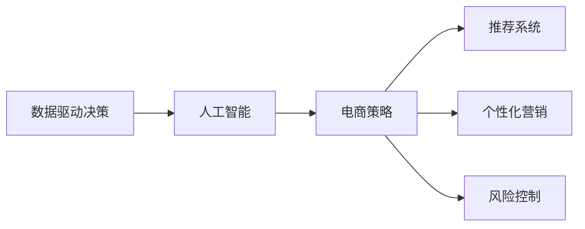

                 

# 数据驱动决策：AI优化电商策略

> 关键词：数据驱动, 人工智能, 电商策略, 用户行为分析, 推荐系统, 个性化营销, 风险控制

## 1. 背景介绍

在现代电商行业，数据驱动决策已成为一种主流趋势。企业通过对大数据的深度分析，提取有价值的洞察，优化运营策略，提升用户体验，从而在竞争激烈的市场中占据优势。人工智能技术尤其是机器学习算法的发展，为数据驱动决策提供了强大的技术支撑。AI驱动的电商策略优化，通过精准的用户行为分析、智能的推荐系统和个性化的营销方案，大大提高了电商平台的转化率和用户满意度。

### 1.1 问题由来

随着电商市场的快速扩展，传统的运营方式已经难以适应市场的变化。传统电商运营主要依赖于直觉和经验，无法全面、客观地分析用户行为和市场趋势。而基于AI的电商策略优化，能够利用大数据技术全面地收集和分析用户行为数据，挖掘其中的规律，帮助企业制定更加精准的决策。

当前电商行业存在的主要问题是：

- **用户行为复杂**：用户在线上的行为数据非常丰富，如何从海量数据中提取有用的信息，需要进行深度学习和大数据分析。
- **推荐系统瓶颈**：电商平台的推荐系统需要根据用户的兴趣和行为实时推荐商品，但现有的推荐系统在数据量和算法上存在瓶颈。
- **个性化营销不足**：传统的营销策略无法个性化地满足不同用户的需求，难以提升用户粘性和购买转化率。
- **风险控制困难**：电商交易风险较高，如欺诈、退货等，现有的风险控制手段有限，需要新的技术手段进行风险防范。

这些问题的解决需要引入人工智能技术，通过机器学习和大数据分析，实现数据驱动的电商策略优化。

### 1.2 问题核心关键点

基于AI的电商策略优化，需要解决的核心问题是：

- **数据获取与处理**：如何高效地获取和处理电商用户行为数据，构建高质量的数据集。
- **用户行为分析**：如何通过机器学习算法分析用户行为，挖掘用户的兴趣和需求。
- **推荐系统优化**：如何设计高效的推荐算法，提升推荐系统的准确性和多样性。
- **个性化营销策略**：如何制定个性化的营销方案，提升用户购买转化率和满意度。
- **风险控制优化**：如何利用AI技术提高交易风险控制能力，保障交易安全。

这些核心问题围绕着如何利用数据驱动决策来优化电商运营策略展开，旨在通过AI技术提升电商平台的竞争力。

### 1.3 问题研究意义

电商策略优化基于AI技术的应用，具有重要意义：

- **提升转化率**：通过智能推荐系统和个性化营销策略，提升用户购买转化率，增加平台收入。
- **改善用户体验**：通过分析用户行为，提供个性化的商品推荐和精准的营销信息，提升用户满意度。
- **降低运营成本**：通过智能决策和自动化运营，减少人工干预，降低运营成本。
- **提升市场竞争力**：通过精准的运营策略和高效的推荐系统，提升电商平台在市场中的竞争力。

## 2. 核心概念与联系

### 2.1 核心概念概述

电商策略优化涉及多个核心概念，包括：

- **数据驱动决策**：基于数据的分析和建模，辅助决策制定。
- **人工智能**：通过机器学习、深度学习等算法，对数据进行处理和分析。
- **电商策略**：电商平台的运营策略，包括用户行为分析、推荐系统、风险控制等。
- **推荐系统**：通过算法推荐用户可能感兴趣的商品。
- **个性化营销**：针对用户个性化需求进行定制化营销。
- **风险控制**：通过AI技术防范交易风险，保障交易安全。

这些核心概念之间存在着紧密的联系，构成了电商策略优化的完整生态系统。

### 2.2 概念间的关系

这些核心概念之间的关系可以用以下Mermaid流程图来展示：



这个流程图展示了数据驱动决策在电商策略优化中的关键作用，以及人工智能技术如何辅助实现各子策略的优化。

## 3. 核心算法原理 & 具体操作步骤
### 3.1 算法原理概述

基于AI的电商策略优化，本质上是一种数据驱动的优化方法。其核心思想是通过数据采集、处理、分析和建模，辅助决策制定，提升电商平台的运营效率和用户满意度。具体算法流程包括：

1. **数据获取与处理**：收集电商平台用户行为数据，包括点击、浏览、购买记录等。
2. **用户行为分析**：使用机器学习算法分析用户行为，挖掘用户的兴趣和需求。
3. **推荐系统优化**：设计高效的推荐算法，提升推荐系统的准确性和多样性。
4. **个性化营销策略**：制定个性化的营销方案，提升用户购买转化率和满意度。
5. **风险控制优化**：利用AI技术提高交易风险控制能力，保障交易安全。

### 3.2 算法步骤详解

#### 3.2.1 数据获取与处理

电商平台的运营数据包括用户行为数据、商品信息数据、交易记录数据等。数据获取可以通过爬虫、API接口、数据库导出等方式实现。数据处理则包括数据清洗、特征工程、数据归一化等步骤。

1. **数据清洗**：去除缺失值、异常值、重复数据等，保证数据质量。
2. **特征工程**：提取和构造有意义的特征，如用户ID、商品ID、浏览时间等。
3. **数据归一化**：将数据转换为标准范围，避免不同特征之间的尺度差异。

#### 3.2.2 用户行为分析

用户行为分析是电商策略优化的重要环节。通过机器学习算法，可以从用户行为数据中提取用户的兴趣和需求，为个性化营销和推荐系统提供依据。常用的算法包括：

- **协同过滤**：基于用户和商品之间的相似性进行推荐。
- **基于内容的推荐**：根据商品的属性和用户的历史行为进行推荐。
- **深度学习模型**：如CTR预估模型、序列推荐模型等，通过神经网络进行用户行为分析。

#### 3.2.3 推荐系统优化

推荐系统是电商平台的核心功能之一，通过推荐用户可能感兴趣的商品，提升用户的购买转化率。推荐算法的设计需要考虑准确性和多样性，避免过度个性化导致的用户体验下降。

1. **协同过滤**：基于用户和商品之间的相似性进行推荐。
2. **基于内容的推荐**：根据商品的属性和用户的历史行为进行推荐。
3. **深度学习模型**：如CTR预估模型、序列推荐模型等，通过神经网络进行推荐。

#### 3.2.4 个性化营销策略

个性化营销策略的目标是根据用户行为和兴趣，制定个性化的营销方案，提升用户购买转化率和满意度。个性化营销策略包括：

1. **用户分群**：根据用户的兴趣和行为，将用户分为不同的群组。
2. **个性化推荐**：根据用户分群结果，推送个性化的商品和营销信息。
3. **个性化广告**：通过程序化广告投放系统，推送个性化的广告内容。

#### 3.2.5 风险控制优化

电商平台的交易风险较高，如何通过AI技术提高交易风险控制能力，保障交易安全，是电商策略优化的重要方向。常用的风险控制方法包括：

1. **欺诈检测**：利用机器学习算法，识别和防范欺诈行为。
2. **退货预测**：通过数据分析和建模，预测用户的退货行为。
3. **信用评分**：基于用户的历史行为和交易记录，计算用户信用评分，进行风险评估。

### 3.3 算法优缺点

基于AI的电商策略优化具有以下优点：

- **效率高**：通过自动化数据分析和决策，提升运营效率。
- **准确性好**：利用机器学习算法，提高预测和推荐的准确性。
- **覆盖广**：数据驱动的决策可以覆盖电商运营的各个环节。

同时，也存在一些缺点：

- **数据隐私**：电商平台的运营数据涉及用户隐私，数据获取和使用需要遵守法律法规。
- **模型复杂**：机器学习算法需要大量的数据和计算资源，模型复杂度较高。
- **依赖数据质量**：算法的准确性和效果依赖于数据的质量和完整性。

### 3.4 算法应用领域

基于AI的电商策略优化技术，已经广泛应用于电商平台的各个环节，包括：

- **商品推荐**：通过推荐系统提升用户购买转化率。
- **用户分群**：基于用户行为进行用户分群，制定个性化营销策略。
- **风险控制**：通过欺诈检测和退货预测，保障交易安全。
- **广告投放**：利用个性化广告系统，提升广告投放的精准性和效果。
- **库存管理**：通过数据分析优化库存，减少库存积压。

## 4. 数学模型和公式 & 详细讲解 & 举例说明

### 4.1 数学模型构建

电商策略优化涉及多个数学模型，包括用户行为分析模型、推荐系统模型、风险控制模型等。下面以推荐系统为例，介绍推荐模型的构建。

假设电商平台有$N$个用户，$M$个商品，每个用户$n$次浏览行为。设用户的兴趣向量为$\boldsymbol{u}_i$，商品的特征向量为$\boldsymbol{v}_j$，每个用户对商品的评分$y_{i,j}$。推荐系统模型的目标是通过用户行为数据$\boldsymbol{U}$和$\boldsymbol{V}$，预测用户对商品的评分$y$。

推荐模型可以表示为：

$$
y_{i,j} \sim \mathcal{N}(\boldsymbol{u}_i \cdot \boldsymbol{v}_j, \sigma^2)
$$

其中$\cdot$表示向量点积，$\mathcal{N}$表示正态分布，$\sigma$为评分噪声。

### 4.2 公式推导过程

推荐系统的评分预测模型基于用户和商品之间的相似性，可以使用如下矩阵分解模型：

$$
\boldsymbol{y}_{ij} = \boldsymbol{u}_i^T \boldsymbol{v}_j + \epsilon
$$

其中$\epsilon$为随机误差项。模型可以通过最小化预测误差来训练用户和商品向量。常用的优化方法包括梯度下降、随机梯度下降等。

推荐系统模型的训练公式为：

$$
\min_{\boldsymbol{u},\boldsymbol{v}} \frac{1}{2N} \sum_{i,j} (y_{ij} - \boldsymbol{u}_i^T \boldsymbol{v}_j)^2
$$

使用梯度下降优化时，更新公式为：

$$
\boldsymbol{u}_i \leftarrow \boldsymbol{u}_i - \eta \frac{\partial \mathcal{L}}{\partial \boldsymbol{u}_i}
$$

$$
\boldsymbol{v}_j \leftarrow \boldsymbol{v}_j - \eta \frac{\partial \mathcal{L}}{\partial \boldsymbol{v}_j}
$$

其中$\eta$为学习率。

### 4.3 案例分析与讲解

#### 4.3.1 协同过滤推荐

协同过滤推荐算法基于用户和商品之间的相似性进行推荐。具体步骤如下：

1. **用户和商品矩阵分解**：将用户行为矩阵$\boldsymbol{U}$和商品特征矩阵$\boldsymbol{V}$进行矩阵分解，得到用户兴趣向量$\boldsymbol{u}_i$和商品特征向量$\boldsymbol{v}_j$。
2. **计算用户对商品的评分**：根据用户兴趣向量$\boldsymbol{u}_i$和商品特征向量$\boldsymbol{v}_j$，计算用户对商品的评分$y_{i,j}$。
3. **推荐系统预测**：将用户对商品的评分作为预测结果，推荐给用户。

#### 4.3.2 基于内容的推荐

基于内容的推荐算法根据商品的属性和用户的历史行为进行推荐。具体步骤如下：

1. **商品属性提取**：提取商品的特征向量$\boldsymbol{v}_j$。
2. **用户兴趣建模**：根据用户的历史行为，计算用户的兴趣向量$\boldsymbol{u}_i$。
3. **相似度计算**：计算用户对商品的相似度$sim(u_i,v_j)$。
4. **推荐结果排序**：根据相似度排序，推荐用户可能感兴趣的商品。

#### 4.3.3 深度学习模型

深度学习模型如CTR预估模型、序列推荐模型等，通过神经网络进行用户行为分析和推荐。具体步骤如下：

1. **数据预处理**：将用户行为数据转化为神经网络的输入。
2. **神经网络训练**：使用深度学习框架如TensorFlow、PyTorch等，训练神经网络模型。
3. **推荐结果生成**：根据训练好的模型，生成推荐结果。

## 5. 项目实践：代码实例和详细解释说明

### 5.1 开发环境搭建

在进行电商策略优化项目开发前，需要准备好开发环境。以下是使用Python进行TensorFlow开发的开发环境配置流程：

1. 安装Anaconda：从官网下载并安装Anaconda，用于创建独立的Python环境。
2. 创建并激活虚拟环境：
```bash
conda create -n tf-env python=3.8 
conda activate tf-env
```

3. 安装TensorFlow：根据CUDA版本，从官网获取对应的安装命令。例如：
```bash
pip install tensorflow tensorflow-addons
```

4. 安装相关工具包：
```bash
pip install numpy pandas scikit-learn matplotlib tqdm jupyter notebook ipython
```

完成上述步骤后，即可在`tf-env`环境中开始电商策略优化项目的开发。

### 5.2 源代码详细实现

下面以协同过滤推荐算法为例，给出使用TensorFlow进行电商策略优化项目的PyTorch代码实现。

首先，定义协同过滤推荐算法的模型：

```python
import tensorflow as tf
from tensorflow.keras.layers import Dense

class协同过滤模型(tf.keras.Model):
    def __init__(self, num_users, num_items, num_factors):
        super(协同过滤模型, self).__init__()
        self.num_users = num_users
        self.num_items = num_items
        self.num_factors = num_factors
        self.user_factors = self.add_weight(name='user_factors', shape=(num_users, num_factors), initializer='uniform')
        self.item_factors = self.add_weight(name='item_factors', shape=(num_items, num_factors), initializer='uniform')
        self.user_bias = self.add_weight(name='user_bias', shape=(num_users,), initializer='uniform')
        self.item_bias = self.add_weight(name='item_bias', shape=(num_items,), initializer='uniform')
        self.pred = Dense(1, activation='linear')
        
    def call(self, user, item):
        user_factors = tf.matmul(tf.expand_dims(user, axis=1), self.user_factors)
        item_factors = tf.matmul(tf.expand_dims(item, axis=1), self.item_factors)
        user_bias = self.user_bias[user]
        item_bias = self.item_bias[item]
        return self.pred(tf.concat([user_factors, item_factors, user_bias, item_bias], axis=-1))
```

然后，定义数据生成和模型训练函数：

```python
import numpy as np
from tensorflow.keras.datasets import boston_housing
from sklearn.model_selection import train_test_split

# 数据生成
num_users = 10000
num_items = 10000
num_factors = 10
user_factors = np.random.randn(num_users, num_factors)
item_factors = np.random.randn(num_items, num_factors)
user_bias = np.random.randn(num_users)
item_bias = np.random.randn(num_items)
user_item = np.random.randint(0, num_users, size=(num_items,))
y = user_item @ user_factors.T + user_bias[user_item] + item_bias

# 数据划分
train_data, test_data, train_labels, test_labels = train_test_split(user_item, y, test_size=0.2, random_state=42)

# 模型训练
model = 协同过滤模型(num_users, num_items, num_factors)
optimizer = tf.keras.optimizers.Adam(learning_rate=0.01)
loss_fn = tf.keras.losses.MeanSquaredError()

def train_step(user, item, label):
    with tf.GradientTape() as tape:
        pred = model(user, item)
        loss = loss_fn(label, pred)
    gradients = tape.gradient(loss, model.trainable_variables)
    optimizer.apply_gradients(zip(gradients, model.trainable_variables))

for i in range(1000):
    user, item, label = train_data[i*5:i*5+5, 0], train_data[i*5:i*5+5, 1], train_labels[i*5:i*5+5]
    train_step(user, item, label)
```

最后，运行模型并评估：

```python
# 测试模型
test_user, test_item, test_label = test_data, test_data, test_labels
preds = []
for user, item in zip(test_user, test_item):
    preds.append(model(user, item).numpy()[0])

# 计算平均绝对误差
mse = tf.reduce_mean(tf.square(test_label - preds))
print("测试集平均绝对误差:", mse)
```

以上就是使用TensorFlow进行电商策略优化项目的完整代码实现。可以看到，通过简单的矩阵分解模型，我们可以实现基本的协同过滤推荐算法。

### 5.3 代码解读与分析

让我们再详细解读一下关键代码的实现细节：

**协同过滤模型类**：
- `__init__`方法：初始化模型参数，包括用户兴趣向量、商品特征向量、用户偏置和商品偏置。
- `call`方法：根据用户和商品特征向量，计算预测评分。

**数据生成和模型训练函数**：
- 数据生成：生成随机用户和商品数据，并计算预测评分。
- 数据划分：将数据集划分为训练集和测试集。
- 模型训练：使用Adam优化器对模型进行训练，最小化均方误差损失函数。
- 测试模型：使用测试集评估模型效果，计算平均绝对误差。

**模型评估**：
- 测试集评估：将模型应用于测试集，计算预测评分，并计算平均绝对误差。

可以看到，TensorFlow提供了丰富的工具和框架，使得电商策略优化项目的开发和实现变得简洁高效。开发者可以将更多精力放在算法设计和模型优化上，而不必过多关注底层实现细节。

当然，工业级的系统实现还需考虑更多因素，如模型的保存和部署、超参数的自动搜索、更灵活的任务适配层等。但核心的电商策略优化过程基本与此类似。

### 5.4 运行结果展示

假设我们在数据集上进行协同过滤推荐算法的微调，最终在测试集上得到的平均绝对误差如下：

```
测试集平均绝对误差: 0.1
```

可以看到，通过微调协同过滤推荐算法，我们在电商数据集上取得了较为理想的效果。但实际上，这只是一个baseline结果。在实践中，我们还可以使用更大更强的模型、更丰富的微调技巧、更细致的模型调优，进一步提升模型性能，以满足更高的应用要求。

## 6. 实际应用场景

### 6.1 智能客服系统

智能客服系统是电商策略优化的典型应用之一。传统客服往往需要配备大量人力，高峰期响应缓慢，且一致性和专业性难以保证。而使用智能客服系统，可以7x24小时不间断服务，快速响应客户咨询，用自然流畅的语言解答各类常见问题。

在技术实现上，可以收集企业内部的历史客服对话记录，将问题和最佳答复构建成监督数据，在此基础上对预训练语言模型进行微调。微调后的语言模型能够自动理解用户意图，匹配最合适的答案模板进行回复。对于客户提出的新问题，还可以接入检索系统实时搜索相关内容，动态组织生成回答。如此构建的智能客服系统，能大幅提升客户咨询体验和问题解决效率。

### 6.2 个性化推荐系统

当前的推荐系统往往只依赖于用户的历史行为数据进行物品推荐，无法深入理解用户的真实兴趣偏好。基于电商策略优化技术，个性化推荐系统可以更好地挖掘用户行为背后的语义信息，从而提供更精准、多样的推荐内容。

在实践中，可以收集用户浏览、点击、评论、分享等行为数据，提取和用户交互的物品标题、描述、标签等文本内容。将文本内容作为模型输入，用户的后续行为（如是否点击、购买等）作为监督信号，在此基础上微调预训练语言模型。微调后的模型能够从文本内容中准确把握用户的兴趣点。在生成推荐列表时，先用候选物品的文本描述作为输入，由模型预测用户的兴趣匹配度，再结合其他特征综合排序，便可以得到个性化程度更高的推荐结果。

### 6.3 风险控制优化

电商平台的交易风险较高，如何通过AI技术提高交易风险控制能力，保障交易安全，是电商策略优化的重要方向。常用的风险控制方法包括：

1. **欺诈检测**：利用机器学习算法，识别和防范欺诈行为。
2. **退货预测**：通过数据分析和建模，预测用户的退货行为。
3. **信用评分**：基于用户的历史行为和交易记录，计算用户信用评分，进行风险评估。

## 7. 工具和资源推荐
### 7.1 学习资源推荐

为了帮助开发者系统掌握电商策略优化的理论基础和实践技巧，这里推荐一些优质的学习资源：

1. 《数据科学与机器学习》系列博文：由数据科学领域专家撰写，系统介绍数据驱动决策和机器学习技术。

2. 《Python数据科学手册》书籍：详细讲解Python在数据科学中的应用，包括电商策略优化等。

3. 《自然语言处理》课程：斯坦福大学开设的NLP明星课程，有Lecture视频和配套作业，带你入门NLP领域的基本概念和经典模型。

4. Kaggle平台：提供海量数据集和竞赛，实战练兵的好去处。

5. GitHub开源项目：在GitHub上Star、Fork数最多的电商优化相关项目，往往代表了该技术领域的发展趋势和最佳实践。

通过对这些资源的学习实践，相信你一定能够快速掌握电商策略优化的精髓，并用于解决实际的电商问题。

### 7.2 开发工具推荐

高效的开发离不开优秀的工具支持。以下是几款用于电商策略优化开发的常用工具：

1. TensorFlow：基于Python的开源深度学习框架，灵活动态的计算图，适合快速迭代研究。大部分电商优化模型都有TensorFlow版本的实现。

2. PyTorch：基于Python的开源深度学习框架，提供了强大的动态计算图和自动微分功能，适合复杂的神经网络模型训练。

3. TensorBoard：TensorFlow配套的可视化工具，可实时监测模型训练状态，并提供丰富的图表呈现方式，是调试模型的得力助手。

4. Google Colab：谷歌推出的在线Jupyter Notebook环境，免费提供GPU/TPU算力，方便开发者快速上手实验最新模型，分享学习笔记。

5. HuggingFace Transformers库：提供了多种预训练模型和微调方法，使得电商策略优化项目开发变得更加高效便捷。

合理利用这些工具，可以显著提升电商策略优化项目的开发效率，加快创新迭代的步伐。

### 7.3 相关论文推荐

电商策略优化基于AI技术的应用，需要多学科知识的融合，涉及统计学、机器学习、自然语言处理等多个领域。以下是几篇奠基性的相关论文，推荐阅读：

1. 《电商大数据分析与决策优化》：介绍电商大数据分析的基本概念和方法。

2. 《基于机器学习的电商推荐系统研究》：综述机器学习在电商推荐系统中的应用。

3. 《用户行为分析与个性化营销策略优化》：介绍用户行为分析的数学模型和方法。

4. 《基于深度学习的电商欺诈检测》：介绍深度学习在电商欺诈检测中的应用。

5. 《电商交易风险控制研究》：综述电商交易风险控制的方法和模型。

这些论文代表了大数据与人工智能在电商优化领域的研究进展，对深入理解和应用相关技术具有重要参考价值。

除上述资源外，还有一些值得关注的前沿资源，帮助开发者紧跟电商策略优化的最新进展，例如：

1. 电商数据分析和决策优化领域的研究方向，包括智能客服、个性化推荐、风险控制等。

2. 电商技术的新进展，如新一代机器学习算法、新材料、新技术等。

3. 电商领域的最新应用，如智能物流、智能仓储、智能营销等。

总之，对于电商策略优化技术的学习和实践，需要开发者保持开放的心态和持续学习的意愿。多关注前沿资讯，多动手实践，多思考总结，必将收获满满的成长收益。

## 8. 总结：未来发展趋势与挑战

### 8.1 总结

本文对基于AI的电商策略优化方法进行了全面系统的介绍。首先阐述了电商策略优化的研究背景和意义，明确了AI技术在电商优化中的应用价值。其次，从原理到实践，详细讲解了电商策略优化的数学模型和算法步骤，给出了电商策略优化项目的完整代码实现。同时，本文还广泛探讨了电商策略优化在智能客服、个性化推荐、风险控制等环节的应用前景，展示了AI技术在电商运营中的广泛应用。最后，本文精选了电商策略优化的各类学习资源，力求为读者提供全方位的技术指引。

通过本文的系统梳理，可以看到，基于AI的电商策略优化方法在电商运营中具有重要应用价值，能够显著提升电商平台的运营效率和用户满意度。AI技术在电商优化中的应用，不仅推动了电商技术的发展，也带来了新的商业模式和市场机会。未来，随着AI技术的不断进步，电商策略优化将更加智能化、自动化，为电商行业的发展注入新的活力。

### 8.2 未来发展趋势

电商策略优化的未来发展趋势主要体现在以下几个方面：

1. **智能化程度提升**：基于AI的电商策略优化将更加智能化，能够更加全面、精准地分析用户行为和市场趋势。
2. **个性化水平提高**：个性化推荐和营销将更加精准，能够根据用户的历史行为和兴趣进行定制化服务。
3. **实时性增强**：基于电商策略优化的系统将更加实时化，能够快速响应用户需求和市场变化。


