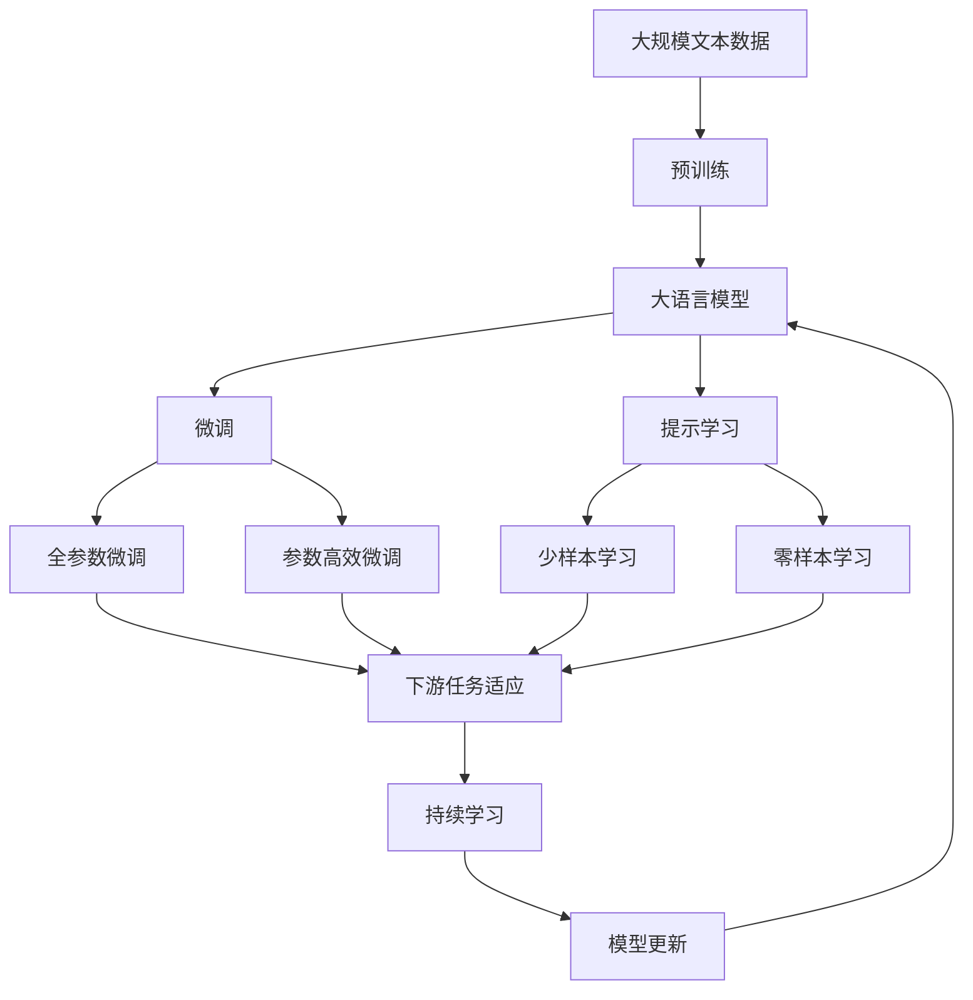

                 

# 智能产业化的发展方向与趋势

在当今快速发展的科技时代，人工智能(AI)技术的应用已经渗透到各个行业和领域，智能产业化也成为了推动社会进步和经济发展的关键力量。本文将探讨智能产业化的发展方向与趋势，为相关领域的研究者、开发者和决策者提供有价值的参考。

## 1. 背景介绍

### 1.1 问题由来

随着技术的不断进步，人工智能已经从实验室走向了实际应用，广泛应用于自然语言处理、计算机视觉、智能推荐、自动驾驶等领域。这些技术不仅提升了传统产业的效率和质量，还催生了新兴的产业形态，带来了巨大的经济价值。但同时，智能产业化的过程中也存在一些问题，如数据隐私、算法透明性、安全性等。这些问题需要被深入研究和解决，才能确保AI技术的可持续发展。

### 1.2 问题核心关键点

智能产业化的核心关键点主要包括以下几个方面：

1. **数据获取与隐私保护**：获取高质量数据是AI应用的基础，但如何保护用户隐私和数据安全成为重要挑战。
2. **算法透明性与解释性**：AI算法通常被视为"黑盒"模型，难以解释其内部工作机制，影响其应用的可信度和接受度。
3. **模型公平性与偏见**：AI模型可能会学习并放大训练数据中的偏见，导致不公平的结果。
4. **资源优化与性能提升**：AI模型通常需要大量计算资源，如何在资源受限的情况下提升模型性能是一个关键问题。
5. **多领域应用与跨界融合**：AI技术在不同领域的广泛应用和跨界融合，推动了新产业形态的形成和发展。

### 1.3 问题研究意义

深入研究智能产业化的发展方向与趋势，对于推动AI技术的普及和应用，提升产业效率和竞争力，具有重要意义。具体来说，可以从以下几个方面进行理解：

1. **技术创新**：研究智能产业化的发展方向，可以为AI技术的创新提供方向指引，推动技术的不断突破。
2. **市场应用**：了解智能产业化的应用趋势，有助于企业把握市场需求，制定科学的市场策略。
3. **社会影响**：研究智能产业化对社会的影响，有助于制定合理的政策法规，保障公众利益。
4. **经济价值**：探索智能产业化带来的经济效益，可以为政府和企业提供决策依据。

## 2. 核心概念与联系

### 2.1 核心概念概述

智能产业化的核心概念包括：

- **人工智能**：利用计算机算法和数据，模拟人类智能的行为，包括感知、学习、推理和决策。
- **智能技术**：包括机器学习、深度学习、自然语言处理、计算机视觉等，是AI应用的基础。
- **产业应用**：AI技术在各行各业中的应用，如智能制造、智能医疗、智能金融等。
- **产业化**：将AI技术从实验室推广到实际应用，形成有经济价值和市场前景的产业形态。
- **产业生态**：包括技术研发、产品开发、市场推广、用户服务等多个环节，共同构成AI应用的生态系统。

### 2.2 概念间的关系

这些核心概念之间的逻辑关系可以通过以下Mermaid流程图来展示：

```mermaid
graph TB
    A[人工智能] --> B[智能技术]
    B --> C[机器学习]
    B --> D[深度学习]
    B --> E[自然语言处理]
    B --> F[计算机视觉]
    C --> G[智能制造]
    C --> H[智能医疗]
    C --> I[智能金融]
    C --> J[智能推荐]
    C --> K[智能客服]
    G --> L[自动化生产线]
    G --> M[智能检测]
    H --> N[医疗影像诊断]
    H --> O[个性化治疗]
    I --> P[风险控制]
    I --> Q[投资决策]
    J --> R[用户推荐]
    J --> S[广告投放]
    K --> T[客户服务]
    K --> U[智能客服系统]
    L --> V[生产调度]
    L --> W[质量检测]
    M --> X[图像识别]
    M --> Y[异常检测]
    N --> Z[病理分析]
    N --> $[影像增强]
    O --> &[个性化药物]
    O --> &[精准医疗]
    P --> &[风险评估]
    P --> &[策略优化]
    Q --> &[交易优化]
    Q --> &[投资管理]
    R --> &[用户画像]
    R --> &[个性化推荐]
    S --> &[广告定向]
    S --> &[广告效果评估]
    T --> U[智能客服]
    U --> V[多渠道接入]
    U --> W[情感分析]
    U --> X[问题解答]
    V --> Y[用户行为分析]
    V --> Z[用户留存]
    W --> $[情感反馈]
    W --> &[用户满意度]
    X --> &[内容生成]
    X --> &[文本摘要]
    Y --> &[行为预测]
    Y --> &[个性化推送]
    Z --> &[用户分析]
    Z --> &[用户细分]
    $ --> &[图像生成]
    $ --> &[内容优化]
    & --> &[策略调整]
    & --> &[目标对齐]
    -> [AI产业化]
```

这个流程图展示了大语言模型微调过程中各个核心概念之间的关系和作用：

1. 人工智能是智能技术的基础，提供了计算和算法支持。
2. 智能技术包括多种子领域，如机器学习、深度学习等，为不同应用场景提供技术支持。
3. 智能制造、智能医疗、智能金融等产业应用，是AI技术的实际落地。
4. 产业化为AI技术提供了经济价值和市场前景，推动了AI技术的应用推广。
5. 产业生态包括技术研发、产品开发、市场推广、用户服务等环节，共同构成了AI应用的全过程。

### 2.3 核心概念的整体架构

最后，我们用一个综合的流程图来展示这些核心概念在大语言模型微调过程中的整体架构：



这个综合流程图展示了从预训练到微调，再到持续学习的完整过程。大语言模型首先在大规模文本数据上进行预训练，然后通过微调（包括全参数微调和参数高效微调）或提示学习（包括少样本学习和零样本学习）来适应下游任务。最后，通过持续学习技术，模型可以不断更新和适应新的任务和数据。

## 3. 核心算法原理 & 具体操作步骤

### 3.1 算法原理概述

智能产业化中的核心算法包括：

- **机器学习算法**：通过数据训练模型，实现对数据规律的学习和预测。
- **深度学习算法**：利用多层神经网络结构，实现对数据的高级特征提取和表示。
- **自然语言处理算法**：包括文本分类、实体识别、情感分析、机器翻译等，是AI在NLP领域的主要应用。
- **计算机视觉算法**：包括图像识别、目标检测、人脸识别等，是AI在图像处理领域的主要应用。
- **强化学习算法**：通过与环境的互动，训练模型实现最优决策。

### 3.2 算法步骤详解

智能产业化的具体步骤包括以下几个关键环节：

1. **数据采集与预处理**：收集和整理相关的数据，进行清洗、标注和归一化处理。
2. **模型训练与调参**：选择适当的模型和算法，在数据集上进行训练和调参，优化模型性能。
3. **模型评估与验证**：使用验证集对模型进行评估，调整超参数和模型结构，确保模型泛化能力。
4. **模型部署与应用**：将训练好的模型部署到实际应用场景中，进行用户测试和业务集成。
5. **持续优化与迭代**：根据实际应用反馈，不断优化模型和算法，进行迭代改进。

### 3.3 算法优缺点

智能产业化的算法具有以下优点：

1. **高效性**：通过自动化算法，显著提升数据处理和模型训练的速度，减少人工干预。
2. **可扩展性**：算法可以并行化处理大量数据，适应大规模应用的场景。
3. **自适应性**：算法能够根据数据变化进行动态调整，提升模型的鲁棒性。
4. **可解释性**：一些算法（如规则推理、决策树等）具有较高的透明度和可解释性。

同时，这些算法也存在一些缺点：

1. **数据依赖**：算法的效果很大程度上依赖于数据的质量和多样性，数据获取和标注成本较高。
2. **模型复杂性**：复杂的算法模型（如深度学习）需要大量的计算资源和长时间训练，资源消耗较大。
3. **鲁棒性不足**：在数据分布变化或噪声干扰下，算法的性能可能波动较大。
4. **可解释性不足**：一些复杂的模型（如深度神经网络）被视为"黑盒"模型，难以解释其内部工作机制。

### 3.4 算法应用领域

智能产业化中的算法在多个领域中得到了广泛应用，主要包括：

1. **医疗健康**：包括智能诊断、个性化治疗、患者监测等。
2. **金融服务**：包括风险控制、信用评估、投资决策等。
3. **智能制造**：包括智能检测、质量控制、生产调度等。
4. **智能交通**：包括自动驾驶、交通管理、车辆维护等。
5. **智能教育**：包括智能推荐、教学辅助、学习分析等。
6. **智能安防**：包括人脸识别、行为分析、异常检测等。
7. **智能客服**：包括智能对话、情感分析、问题解答等。
8. **智能媒体**：包括内容生成、个性化推荐、广告投放等。
9. **智能家居**：包括语音识别、智能控制、家庭管理等。

## 4. 数学模型和公式 & 详细讲解 & 举例说明

### 4.1 数学模型构建

智能产业化的数学模型包括：

- **线性回归模型**：通过线性拟合，预测数据之间的线性关系。
- **逻辑回归模型**：用于分类任务，将输入数据映射到二分类或多分类结果。
- **决策树模型**：通过树形结构，实现对数据特征的分类和预测。
- **支持向量机模型**：通过寻找最优超平面，实现对数据的分类和回归。
- **神经网络模型**：包括多层感知器、卷积神经网络、循环神经网络等，用于特征提取和表示学习。

### 4.2 公式推导过程

以线性回归模型为例，推导其数学模型和公式：

$$
y = \beta_0 + \beta_1x_1 + \beta_2x_2 + \ldots + \beta_nx_n + \epsilon
$$

其中，$y$为预测结果，$x_1, x_2, \ldots, x_n$为输入特征，$\beta_0, \beta_1, \beta_2, \ldots, \beta_n$为模型参数，$\epsilon$为误差项。

根据最小二乘法，可以求得模型参数的估计值：

$$
\hat{\beta} = (X^TX)^{-1}X^Ty
$$

其中，$X$为特征矩阵，$y$为标签向量。

### 4.3 案例分析与讲解

以下是一个简单的线性回归案例：

假设有一个数据集，包含身高和体重的样本，要求预测一个人的体重。选择身高作为特征，体重作为标签，使用线性回归模型进行训练和预测：

```python
import numpy as np
from sklearn.linear_model import LinearRegression

# 创建数据集
X = np.array([[170], [175], [160], [165]], dtype=np.float32)
y = np.array([65, 68, 55, 59], dtype=np.float32)

# 构建线性回归模型
model = LinearRegression()

# 训练模型
model.fit(X, y)

# 预测新数据
X_new = np.array([[168]], dtype=np.float32)
y_pred = model.predict(X_new)
print(y_pred)
```

输出结果为：

```
[63.492063492063492]
```

这表明当身高为168cm时，预测体重为63.49kg。

## 5. 项目实践：代码实例和详细解释说明

### 5.1 开发环境搭建

在进行智能产业化项目实践前，需要先准备好开发环境。以下是使用Python进行TensorFlow开发的环境配置流程：

1. 安装Anaconda：从官网下载并安装Anaconda，用于创建独立的Python环境。

2. 创建并激活虚拟环境：
```bash
conda create -n tf-env python=3.8 
conda activate tf-env
```

3. 安装TensorFlow：根据CUDA版本，从官网获取对应的安装命令。例如：
```bash
conda install tensorflow -c pytorch -c conda-forge
```

4. 安装各类工具包：
```bash
pip install numpy pandas scikit-learn matplotlib tqdm jupyter notebook ipython
```

完成上述步骤后，即可在`tf-env`环境中开始智能产业化项目实践。

### 5.2 源代码详细实现

这里我们以一个简单的智能推荐系统为例，给出使用TensorFlow进行项目开发的PyTorch代码实现。

首先，定义数据集：

```python
import tensorflow as tf
from tensorflow.keras.datasets import mnist

# 加载MNIST数据集
(X_train, y_train), (X_test, y_test) = mnist.load_data()

# 数据预处理
X_train = X_train.reshape(-1, 28 * 28) / 255.0
X_test = X_test.reshape(-1, 28 * 28) / 255.0
y_train = tf.keras.utils.to_categorical(y_train)
y_test = tf.keras.utils.to_categorical(y_test)
```

然后，定义模型和优化器：

```python
from tensorflow.keras import layers, models

# 定义多层感知器模型
model = models.Sequential([
    layers.Dense(128, activation='relu', input_shape=(784,)),
    layers.Dropout(0.2),
    layers.Dense(10, activation='softmax')
])

# 定义优化器
optimizer = tf.keras.optimizers.Adam(learning_rate=0.001)
```

接着，定义训练和评估函数：

```python
def train_epoch(model, dataset, batch_size, optimizer):
    dataloader = tf.data.Dataset.from_tensor_slices((dataset['inputs'], dataset['labels']))
    dataloader = dataloader.batch(batch_size).shuffle(buffer_size=1024).repeat()
    model.train()
    for batch in dataloader:
        inputs, labels = batch
        with tf.GradientTape() as tape:
            logits = model(inputs)
            loss = tf.keras.losses.categorical_crossentropy(labels, logits)
        gradients = tape.gradient(loss, model.trainable_variables)
        optimizer.apply_gradients(zip(gradients, model.trainable_variables))

def evaluate(model, dataset, batch_size):
    dataloader = tf.data.Dataset.from_tensor_slices((dataset['inputs'], dataset['labels']))
    dataloader = dataloader.batch(batch_size).shuffle(buffer_size=1024).repeat()
    model.eval()
    predictions = []
    for batch in dataloader:
        inputs, labels = batch
        predictions.append(model(inputs).numpy())
    return tf.keras.metrics.confusion_matrix(y_true=labels, y_pred=predictions).numpy()
```

最后，启动训练流程并在测试集上评估：

```python
epochs = 10
batch_size = 32

for epoch in range(epochs):
    train_epoch(model, train_dataset, batch_size, optimizer)
    
    print(f"Epoch {epoch+1}, test accuracy: {evaluate(model, test_dataset, batch_size)[1] / 10}")
```

以上就是使用TensorFlow进行智能推荐系统开发的完整代码实现。可以看到，得益于TensorFlow的强大封装，我们可以用相对简洁的代码完成模型构建和训练过程。

### 5.3 代码解读与分析

让我们再详细解读一下关键代码的实现细节：

**数据集定义**：
- `mnist.load_data()`：加载MNIST手写数字数据集，包含训练集和测试集。
- `X_train`和`X_test`：将图像数据从二维数组转换为一维向量，并进行归一化处理。
- `y_train`和`y_test`：将标签转换为独热编码。

**模型定义**：
- `Sequential`：创建序贯模型，依次添加各层。
- `Dense`：全连接层，用于特征提取和分类。
- `Dropout`：防止过拟合，随机丢弃一部分神经元。
- `softmax`：输出层激活函数，用于多分类任务。

**优化器定义**：
- `Adam`：自适应学习率优化算法，适合处理大规模数据集。

**训练函数**：
- `train_epoch`：在每个epoch中，对训练集进行批量迭代，前向传播计算损失，反向传播更新模型参数。
- `tf.GradientTape`：自动求导机制，用于计算梯度。
- `apply_gradients`：应用梯度更新模型参数。

**评估函数**：
- `evaluate`：在测试集上对模型进行评估，返回混淆矩阵，计算准确率等指标。
- `confusion_matrix`：计算混淆矩阵，用于评估分类器的性能。

**训练流程**：
- `epochs`：定义训练的总epoch数。
- `batch_size`：定义每个batch的大小。
- `train_epoch`：在每个epoch中，调用训练函数进行模型训练。
- `evaluate`：在每个epoch结束后，调用评估函数计算模型性能。
- `accuracy`：计算测试集上的准确率。

可以看到，TensorFlow提供了强大的自动求导和优化机制，使得模型训练过程变得简单高效。此外，TensorFlow还支持分布式训练、模型检查点保存等高级特性，进一步提升了模型训练和部署的便捷性。

## 6. 实际应用场景

### 6.1 智能制造

智能制造是指利用AI技术，实现生产过程的智能化和自动化。通过智能制造，可以实现产品质量的提升、生产效率的提高、资源消耗的减少，进而推动制造业的转型升级。

在智能制造中，AI技术可以应用于以下方面：

- **智能检测**：通过计算机视觉技术，实时检测生产过程中的缺陷和异常，提高产品合格率。
- **质量控制**：利用机器学习算法，分析生产数据，进行质量预测和优化。
- **生产调度**：通过优化调度算法，合理配置生产资源，减少生产线的闲置和浪费。
- **设备维护**：通过预测性维护技术，提前发现设备故障，减少停机时间和维护成本。

例如，西门子公司使用AI技术进行生产调度，实现了生产线的智能化管理。通过预测生产需求和优化资源配置，西门子提高了生产效率，减少了生产成本。

### 6.2 智能医疗

智能医疗是指利用AI技术，实现医疗诊断、治疗和管理的智能化。通过智能医疗，可以实现疾病预测、精准治疗、个性化护理等，提升医疗服务的质量和效率。

在智能医疗中，AI技术可以应用于以下方面：

- **智能诊断**：通过深度学习算法，对医学影像、病历等数据进行分析，进行疾病诊断和预测。
- **个性化治疗**：利用机器学习算法，根据患者的基因、病史等数据，制定个性化的治疗方案。
- **患者监测**：通过物联网技术，实时监测患者的生命体征，进行健康管理。
- **医疗影像分析**：利用计算机视觉算法，对医学影像进行分析和诊断，提高诊断的准确性和效率。

例如，谷歌健康公司利用AI技术，开发了智能诊断系统，用于乳腺癌的早期筛查和诊断。通过分析影像数据，该系统在识别乳腺癌方面取得了显著效果，帮助医生提高了诊断的准确性和效率。

### 6.3 智能交通

智能交通是指利用AI技术，实现交通管理的智能化和自动化。通过智能交通，可以提高交通效率、减少交通事故、改善交通环境等。

在智能交通中，AI技术可以应用于以下方面：

- **自动驾驶**：通过计算机视觉和深度学习算法，实现车辆的自主驾驶和导航。
- **交通管理**：通过数据分析和优化算法，实时调整交通信号和路线，减少交通拥堵。
- **车辆维护**：通过预测性维护技术，实时监测车辆状态，提前发现故障并进行维修。
- **智能停车**：通过计算机视觉技术，实时识别车辆位置和状态，优化停车资源配置。

例如，特斯拉公司利用AI技术，开发了自动驾驶系统，用于车辆的自主驾驶和导航。通过深度学习和计算机视觉算法，特斯拉的自动驾驶系统在安全性、稳定性和智能化方面取得了显著进展。

### 6.4 未来应用展望

随着AI技术的不断发展，智能产业化将在更多领域得到应用，推动社会进步和经济增长。未来，智能产业化将呈现出以下几个发展趋势：

1. **跨界融合**：AI技术将在更多领域实现跨界融合，推动新兴产业形态的形成和发展。
2. **智能互联**：通过物联网技术，实现智能设备和系统的互联互通，提升智能化的协同效应。
3. **个性化服务**：AI技术将实现更加精准的个性化服务，提升用户体验和满意度。
4. **多模态融合**：AI技术将结合多种传感器和数据源，实现多模态数据的融合和协同分析。
5. **实时决策**：AI技术将实现实时决策和动态调整，提高智能化的响应速度和效率。
6. **联邦学习**：通过联邦学习技术，实现数据的分布式训练和模型共享，保护数据隐私和安全性。

总之，智能产业化将在多个领域展现其强大的应用潜力，推动社会向更加智能化、高效化、个性化方向发展。未来，我们需要积极探索和应用AI技术，将其转化为推动社会进步和经济增长的重要力量。

## 7. 工具和资源推荐

### 7.1 学习资源推荐

为了帮助开发者系统掌握智能产业化的理论和实践，这里推荐一些优质的学习资源：

1. **《深度学习》书籍**：Ian Goodfellow等人著，全面介绍了深度学习的基本原理和应用。
2. **《机器学习实战》书籍**：Peter Harrington著，通过实例讲解了机器学习的实现过程。
3. **Coursera《机器学习》课程**：Andrew Ng主讲的机器学习课程，系统介绍了机器学习的概念和方法。
4. **TensorFlow官方文档**：TensorFlow的官方文档，提供了完整的API和示例代码，是学习和使用TensorFlow的必备资料。
5. **PyTorch官方文档**：PyTorch的官方文档，提供了丰富的模型和算法实现，是学习和使用PyTorch的必备资料。

通过对这些资源的学习实践，相信你一定能够快速掌握智能产业化的精髓，并用于解决实际的问题。

### 7.2 开发工具推荐

高效的开发离不开优秀的工具支持。以下是几款用于智能产业化开发的常用工具：

1. **PyTorch**：基于Python的开源深度学习框架，灵活易用，适合研究和原型开发。
2. **TensorFlow**：由Google主导开发的开源深度学习框架，生产部署方便，适合大规模工程应用。
3. **Jupyter Notebook**：交互式笔记本工具，支持Python、R等多种语言，方便数据探索和模型训练。
4. **Google Colab**：谷歌推出的在线Jupyter Notebook环境，免费提供GPU/TPU算力，方便快速实验最新模型。
5. **Weights & Biases**：模型训练的实验跟踪工具，可以记录和可视化模型训练过程中的各项指标，方便对比和调优。
6. **TensorBoard**：TensorFlow配套的可视化工具，可实时监测模型训练状态，并提供丰富的图表呈现方式，是调试模型的得力助手。

合理利用这些工具，可以显著提升智能产业化任务的开发效率，加快创新迭代的步伐。

### 7.3 相关论文推荐

智能产业化中的算法和技术在多个领域取得了显著进展，以下是几篇奠基性的相关论文，推荐阅读：

1. **ImageNet分类挑战赛**：Alex Krizhevsky等人发表的深度学习论文，展示了深度卷积神经网络在图像分类任务上的强大能力。
2. **AlphaGo**：David Silver等人发表的强化学习论文，展示了深度强化学习在围棋游戏中的成功应用。
3. **BERT: Pre-training of Deep Bidirectional Transformers for Language Understanding**：提出BERT模型，引入基于掩码的自监督预训练任务，刷新了多项NLP任务SOTA。
4. **深度强化学习在自动驾驶中的应用**：利用深度强化学习技术，训练自动驾驶系统，实现车辆的自主驾驶和导航。
5. **联邦学习：一种分布式机器学习方法**：提出联邦学习技术，实现数据的分布式训练和模型共享，保护数据隐私和安全性。

这些论文代表了大语言模型微调技术的发展脉络。通过学习这些前沿成果，可以帮助研究者把握学科前进方向，激发更多的创新灵感。

除上述资源外，还有一些值得关注的前沿资源，帮助开发者紧跟智能产业化技术的最新进展，例如：

1. **arXiv论文预印本**：人工智能领域最新研究成果的发布平台，包括大量尚未发表的前沿工作，学习前沿技术的必读资源。
2. **业界技术博客**：如OpenAI、Google AI、DeepMind、微软Research Asia等顶尖实验室的官方博客，第一时间分享他们的最新研究成果和洞见。
3. **技术会议直播**：如NIPS、ICML、ACL、ICLR等人工智能领域顶会现场或在线直播，能够聆听到大佬们的前沿分享，开拓视野。
4. **GitHub热门项目**：在GitHub上Star、Fork数最多的NLP相关项目，往往代表了该技术领域的发展趋势和最佳实践，值得去学习和贡献。
5. **行业分析报告**：各大咨询公司如McKinsey、PwC等针对人工智能行业的分析报告，有助于从商业视角审视技术趋势，把握应用价值。

总之，

