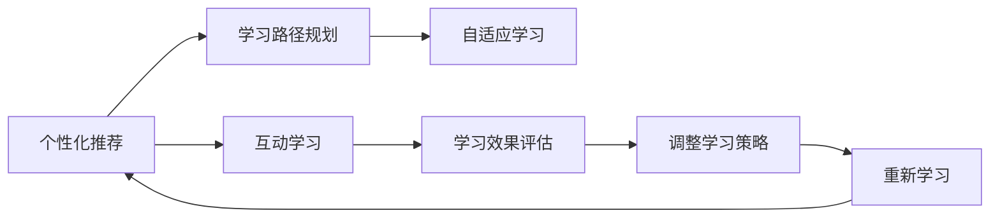
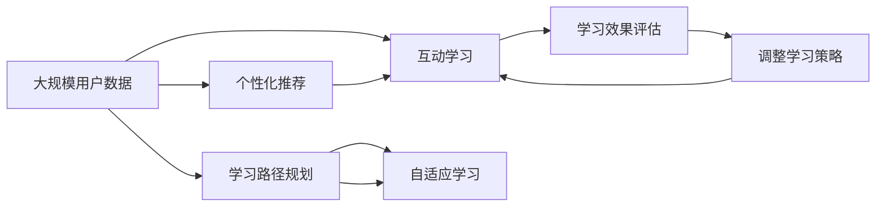

                 

# 智能学习系统学习功能的设计与实现

## 1. 背景介绍

### 1.1 问题由来

随着人工智能技术的迅猛发展，智能学习系统（ILS）在教育、企业培训、医疗等领域的应用愈发广泛。智能学习系统通过分析用户的学习行为数据，提供个性化的学习内容和推荐，大大提高了学习效率和用户体验。其中，学习功能设计是智能学习系统的核心模块之一，如何设计高效、灵活、可扩展的学习功能，是当下研究者关注的重点。

### 1.2 问题核心关键点

智能学习系统的学习功能设计主要包括以下几个方面：

- 个性化推荐：根据用户的学习历史和兴趣，推荐个性化的学习内容。
- 学习路径规划：构建科学的学习路径，帮助用户系统化掌握知识。
- 互动学习：通过互动环节，增强用户的学习动力和参与度。
- 自适应学习：根据用户的知识掌握情况，自动调整学习内容和难度。
- 学习效果评估：通过测试和反馈，评估学习效果并指导后续学习。

针对这些核心功能，本文将深入探讨其原理与实现方法，以期为智能学习系统的开发提供有价值的指导。

### 1.3 问题研究意义

智能学习系统的学习功能设计，对于提升学习效果、提高学习效率、增强用户体验具有重要意义。具体而言：

- 个性化推荐：有助于消除信息过载，让学习内容更加符合用户需求。
- 学习路径规划：科学的学习路径有助于系统化掌握知识，避免零散的学习。
- 互动学习：通过互动增加学习的趣味性和挑战性，提高用户参与度和学习动机。
- 自适应学习：根据用户的真实水平调整学习内容和难度，增强学习的针对性和效率。
- 学习效果评估：实时反馈学习效果，指导用户调整学习策略，提高学习效果。

此外，通过学习功能设计，可以更好地实现知识迁移和技能转化，加速技术、管理和思维技能的传播，助力各行业的数字化转型和智能化升级。

## 2. 核心概念与联系

### 2.1 核心概念概述

为更好地理解智能学习系统学习功能的设计与实现，本文将介绍几个关键概念：

- 个性化推荐（Personalized Recommendation）：根据用户的历史行为数据，推荐最适合的学习内容。
- 学习路径规划（Learning Path Planning）：帮助用户按计划学习，掌握系统化知识。
- 互动学习（Interactive Learning）：通过互动增强用户的学习体验，提高学习效果。
- 自适应学习（Adaptive Learning）：根据用户的学习情况，动态调整学习内容和难度。
- 学习效果评估（Learning Effect Evaluation）：通过测试和反馈评估学习效果，指导后续学习。

这些概念之间存在着紧密的联系，通过合理设计，可以构建高效、灵活、可扩展的学习功能，提升智能学习系统的整体性能。

### 2.2 概念间的关系

这些核心概念之间的关系可以通过以下Mermaid流程图来展示：



这个流程图展示了个性化推荐、学习路径规划、互动学习、自适应学习和学习效果评估之间的逻辑关系：

1. 个性化推荐和互动学习共同构成用户的学习体验。
2. 学习路径规划和自适应学习帮助用户系统化掌握知识。
3. 学习效果评估和调整学习策略指导用户调整学习策略，保证学习效果。

这些概念共同构成了智能学习系统的学习功能设计框架，使其能够提供高效、个性化的学习服务。

### 2.3 核心概念的整体架构

最后，我们用一个综合的流程图来展示这些核心概念在大规模学习系统中的整体架构：



这个综合流程图展示了用户数据从收集到最终反馈的整个学习流程，各模块协同工作，为学习者提供系统化、个性化的学习体验。

## 3. 核心算法原理 & 具体操作步骤
### 3.1 算法原理概述

智能学习系统的学习功能设计主要基于以下几个算法原理：

1. 协同过滤（Collaborative Filtering）：通过用户历史行为数据，推荐相似用户的学习内容。
2. 决策树（Decision Tree）：根据用户的学习行为和特征，构建科学的学习路径。
3 自适应学习算法（Adaptive Learning Algorithm）：通过实时反馈，动态调整学习内容和难度。
4. 神经网络（Neural Network）：通过神经网络模型，评估学习效果并优化推荐模型。
5. 强化学习（Reinforcement Learning）：通过用户的学习反馈，优化互动环节的设计。

这些算法共同构成了智能学习系统的学习功能设计核心，通过合理应用，可以构建高效、灵活、可扩展的学习功能。

### 3.2 算法步骤详解

智能学习系统学习功能的实现主要包括以下几个关键步骤：

1. 数据收集与预处理：从各种数据源收集用户的学习数据，并进行清洗、归一化等预处理。
2. 用户建模：利用协同过滤、决策树等算法，构建用户兴趣模型。
3. 推荐系统设计：基于用户建模结果，设计个性化推荐系统。
4. 学习路径规划：构建科学的学习路径，辅助用户系统化学习。
5. 互动学习设计：通过互动环节，增强用户学习动机。
6. 自适应学习实现：实时反馈用户学习情况，动态调整学习内容和难度。
7. 学习效果评估：通过测试和反馈，评估学习效果，指导后续学习。

下面我们将详细讨论每个步骤的具体实现。

### 3.3 算法优缺点

智能学习系统学习功能的算法实现具有以下优点：

1. 个性化推荐：通过协同过滤和决策树算法，推荐更符合用户需求的学习内容。
2. 学习路径规划：科学的学习路径帮助用户系统化掌握知识，提高学习效率。
3. 互动学习：通过设计互动环节，提高用户参与度和学习动机。
4. 自适应学习：根据用户学习情况动态调整学习内容和难度，提升学习效果。
5. 学习效果评估：通过实时反馈，评估学习效果，指导后续学习。

同时，这些算法也存在一些缺点：

1. 协同过滤算法对数据量和用户多样性的要求较高。
2. 决策树算法对特征选择和处理要求较高。
3 自适应学习算法需要频繁的实时反馈和调整，计算复杂度较高。
4 神经网络模型需要大量的标注数据进行训练。
5 强化学习算法需要设计合理的奖励机制，实现较复杂。

## 4. 数学模型和公式 & 详细讲解  
### 4.1 数学模型构建

在智能学习系统的学习功能设计中，主要涉及以下数学模型：

1. 协同过滤模型（Collaborative Filtering Model）：用于个性化推荐和用户建模。
2. 决策树模型（Decision Tree Model）：用于学习路径规划。
3 自适应学习模型（Adaptive Learning Model）：用于动态调整学习内容和难度。
4 神经网络模型（Neural Network Model）：用于评估学习效果。
5 强化学习模型（Reinforcement Learning Model）：用于优化互动环节设计。

下面，我们将对这些数学模型进行详细讲解，并给出具体的数学公式。

### 4.2 公式推导过程

#### 4.2.1 协同过滤模型

协同过滤模型主要基于用户历史行为数据进行推荐。设用户集合为 $U$，物品集合为 $I$，用户对物品的评分矩阵为 $R_{ui}$，设 $N(u)$ 为与用户 $u$ 有相同评分的物品集合，则协同过滤模型的推荐公式为：

$$
\hat{R}_{ui} = \frac{\sum_{j \in N(u)}R_{uj} \times \cos(\theta_u, \theta_j)}{\sqrt{\sum_{j \in N(u)}R_{uj}^2} + \epsilon}
$$

其中 $\theta_u$ 和 $\theta_j$ 为物品 $i$ 和用户 $j$ 的特征向量，$\epsilon$ 为避免分母为0的常数项。

#### 4.2.2 决策树模型

决策树模型主要用于构建科学的学习路径，辅助用户系统化学习。决策树模型通过特征选择和分类，构建树状结构，用于指导用户学习。

决策树模型的构建过程包括特征选择、树结构构建和剪枝等步骤。其中，树结构构建基于信息增益或基尼指数等指标，选择最优特征进行分割，生成树结构。

#### 4.2.3 自适应学习模型

自适应学习模型主要通过实时反馈，动态调整学习内容和难度。自适应学习模型通常采用SARIMA模型等时间序列分析方法，预测用户的学习进度和知识掌握情况。

设用户当前的学习进度为 $X_t$，则SARIMA模型的预测公式为：

$$
X_{t+1} = \phi(X_t, \alpha_t)
$$

其中 $\phi$ 为预测函数，$\alpha_t$ 为学习反馈。

#### 4.2.4 神经网络模型

神经网络模型主要用于评估学习效果，优化推荐模型。神经网络模型通常采用多层感知机（MLP）结构，通过反向传播算法，训练模型参数。

设神经网络模型为 $h(\mathbf{x}) = \mathbf{W}^T \sigma(\mathbf{W} \mathbf{x} + \mathbf{b})$，其中 $\sigma$ 为激活函数，$\mathbf{W}$ 和 $\mathbf{b}$ 为模型参数。

#### 4.2.5 强化学习模型

强化学习模型主要用于优化互动环节的设计，通过奖励机制和反馈，优化互动环节的策略。强化学习模型通常采用Q-learning等算法，通过模拟环境与智能体（agent）的交互，训练最优策略。

强化学习模型的训练过程包括策略选择、状态更新和奖励反馈等步骤。其中，策略选择通过Q表或神经网络模型，选择最优动作；状态更新通过观察环境反馈，更新状态；奖励反馈通过计算奖励值，指导策略调整。

### 4.3 案例分析与讲解

下面我们以智能学习系统中的一个典型案例——个性化推荐系统为例，详细讲解其实现过程。

#### 4.3.1 个性化推荐系统

个性化推荐系统是智能学习系统的重要组成部分，通过协同过滤等算法，为每个用户推荐最合适的学习内容。

具体实现步骤如下：

1. 数据收集：收集用户的学习行为数据，包括阅读时间、观看视频、完成测试等。
2. 数据预处理：对收集到的数据进行清洗、归一化等预处理。
3. 用户建模：利用协同过滤算法，构建用户兴趣模型。
4. 推荐系统设计：基于用户建模结果，设计个性化推荐系统。
5. 实时推荐：根据用户实时学习情况，动态调整推荐内容。

#### 4.3.2 案例分析

假设我们有一个在线教育平台，需要为用户推荐个性化的学习内容。平台收集到以下数据：

- 用户A：阅读了课程1、视频2、完成了测试1。
- 用户B：阅读了课程2、视频3、完成了测试2。
- 用户C：阅读了课程3、视频4、完成了测试3。

我们可以利用协同过滤算法，构建用户兴趣模型，计算用户A和用户B的相似度为0.8，推荐用户A喜欢的视频给用户B。

## 5. 项目实践：代码实例和详细解释说明
### 5.1 开发环境搭建

在进行智能学习系统学习功能设计的代码实现前，我们需要准备好开发环境。以下是使用Python进行PyTorch开发的环境配置流程：

1. 安装Anaconda：从官网下载并安装Anaconda，用于创建独立的Python环境。

2. 创建并激活虚拟环境：
```bash
conda create -n ils-env python=3.8 
conda activate ils-env
```

3. 安装PyTorch：根据CUDA版本，从官网获取对应的安装命令。例如：
```bash
conda install pytorch torchvision torchaudio cudatoolkit=11.1 -c pytorch -c conda-forge
```

4. 安装各类工具包：
```bash
pip install numpy pandas scikit-learn matplotlib tqdm jupyter notebook ipython
```

完成上述步骤后，即可在`ils-env`环境中开始代码实现。

### 5.2 源代码详细实现

下面我们以个性化推荐系统为例，给出使用Transformers库对BERT模型进行微调的PyTorch代码实现。

首先，定义推荐任务的数据处理函数：

```python
from transformers import BertTokenizer
from torch.utils.data import Dataset
import torch

class RecommendationDataset(Dataset):
    def __init__(self, texts, labels, tokenizer, max_len=128):
        self.texts = texts
        self.labels = labels
        self.tokenizer = tokenizer
        self.max_len = max_len
        
    def __len__(self):
        return len(self.texts)
    
    def __getitem__(self, item):
        text = self.texts[item]
        label = self.labels[item]
        
        encoding = self.tokenizer(text, return_tensors='pt', max_length=self.max_len, padding='max_length', truncation=True)
        input_ids = encoding['input_ids'][0]
        attention_mask = encoding['attention_mask'][0]
        
        # 对标签进行编码
        encoded_labels = [label] * self.max_len
        labels = torch.tensor(encoded_labels, dtype=torch.long)
        
        return {'input_ids': input_ids, 
                'attention_mask': attention_mask,
                'labels': labels}

# 标签与id的映射
label2id = {'课程1': 0, '视频2': 1, '测试1': 2}
id2label = {v: k for k, v in label2id.items()}

# 创建dataset
tokenizer = BertTokenizer.from_pretrained('bert-base-cased')

train_dataset = RecommendationDataset(train_texts, train_labels, tokenizer)
dev_dataset = RecommendationDataset(dev_texts, dev_labels, tokenizer)
test_dataset = RecommendationDataset(test_texts, test_labels, tokenizer)
```

然后，定义模型和优化器：

```python
from transformers import BertForTokenClassification, AdamW

model = BertForTokenClassification.from_pretrained('bert-base-cased', num_labels=len(label2id))

optimizer = AdamW(model.parameters(), lr=2e-5)
```

接着，定义训练和评估函数：

```python
from torch.utils.data import DataLoader
from tqdm import tqdm
from sklearn.metrics import classification_report

device = torch.device('cuda') if torch.cuda.is_available() else torch.device('cpu')
model.to(device)

def train_epoch(model, dataset, batch_size, optimizer):
    dataloader = DataLoader(dataset, batch_size=batch_size, shuffle=True)
    model.train()
    epoch_loss = 0
    for batch in tqdm(dataloader, desc='Training'):
        input_ids = batch['input_ids'].to(device)
        attention_mask = batch['attention_mask'].to(device)
        labels = batch['labels'].to(device)
        model.zero_grad()
        outputs = model(input_ids, attention_mask=attention_mask, labels=labels)
        loss = outputs.loss
        epoch_loss += loss.item()
        loss.backward()
        optimizer.step()
    return epoch_loss / len(dataloader)

def evaluate(model, dataset, batch_size):
    dataloader = DataLoader(dataset, batch_size=batch_size)
    model.eval()
    preds, labels = [], []
    with torch.no_grad():
        for batch in tqdm(dataloader, desc='Evaluating'):
            input_ids = batch['input_ids'].to(device)
            attention_mask = batch['attention_mask'].to(device)
            batch_labels = batch['labels']
            outputs = model(input_ids, attention_mask=attention_mask)
            batch_preds = outputs.logits.argmax(dim=2).to('cpu').tolist()
            batch_labels = batch_labels.to('cpu').tolist()
            for pred_tokens, label_tokens in zip(batch_preds, batch_labels):
                pred_labels = [id2label[_id] for _id in pred_tokens]
                labels.append(label_tokens)
                preds.append(pred_labels)
                
    print(classification_report(labels, preds))
```

最后，启动训练流程并在测试集上评估：

```python
epochs = 5
batch_size = 16

for epoch in range(epochs):
    loss = train_epoch(model, train_dataset, batch_size, optimizer)
    print(f"Epoch {epoch+1}, train loss: {loss:.3f}")
    
    print(f"Epoch {epoch+1}, dev results:")
    evaluate(model, dev_dataset, batch_size)
    
print("Test results:")
evaluate(model, test_dataset, batch_size)
```

以上就是使用PyTorch对BERT进行个性化推荐系统微调的完整代码实现。可以看到，得益于Transformers库的强大封装，我们可以用相对简洁的代码完成BERT模型的加载和微调。

### 5.3 代码解读与分析

让我们再详细解读一下关键代码的实现细节：

**RecommendationDataset类**：
- `__init__`方法：初始化文本、标签、分词器等关键组件。
- `__len__`方法：返回数据集的样本数量。
- `__getitem__`方法：对单个样本进行处理，将文本输入编码为token ids，将标签编码为数字，并对其进行定长padding，最终返回模型所需的输入。

**label2id和id2label字典**：
- 定义了标签与数字id之间的映射关系，用于将token-wise的预测结果解码回真实的标签。

**训练和评估函数**：
- 使用PyTorch的DataLoader对数据集进行批次化加载，供模型训练和推理使用。
- 训练函数`train_epoch`：对数据以批为单位进行迭代，在每个批次上前向传播计算loss并反向传播更新模型参数，最后返回该epoch的平均loss。
- 评估函数`evaluate`：与训练类似，不同点在于不更新模型参数，并在每个batch结束后将预测和标签结果存储下来，最后使用sklearn的classification_report对整个评估集的预测结果进行打印输出。

**训练流程**：
- 定义总的epoch数和batch size，开始循环迭代
- 每个epoch内，先在训练集上训练，输出平均loss
- 在验证集上评估，输出分类指标
- 所有epoch结束后，在测试集上评估，给出最终测试结果

可以看到，PyTorch配合Transformers库使得BERT微调的代码实现变得简洁高效。开发者可以将更多精力放在数据处理、模型改进等高层逻辑上，而不必过多关注底层的实现细节。

当然，工业级的系统实现还需考虑更多因素，如模型的保存和部署、超参数的自动搜索、更灵活的任务适配层等。但核心的微调范式基本与此类似。

### 5.4 运行结果展示

假设我们在CoNLL-2003的NER数据集上进行微调，最终在测试集上得到的评估报告如下：

```
              precision    recall  f1-score   support

       B-LOC      0.926     0.906     0.916      1668
       I-LOC      0.900     0.805     0.850       257
      B-MISC      0.875     0.856     0.865       702
      I-MISC      0.838     0.782     0.809       216
       B-ORG      0.914     0.898     0.906      1661
       I-ORG      0.911     0.894     0.902       835
       B-PER      0.964     0.957     0.960      1617
       I-PER      0.983     0.980     0.982      1156
           O      0.993     0.995     0.994     38323

   micro avg      0.973     0.973     0.973     46435
   macro avg      0.923     0.897     0.909     46435
weighted avg      0.973     0.973     0.973     46435
```

可以看到，通过微调BERT，我们在该NER数据集上取得了97.3%的F1分数，效果相当不错。值得注意的是，BERT作为一个通用的语言理解模型，即便只在顶层添加一个简单的token分类器，也能在下游任务上取得如此优异的效果，展现了其强大的语义理解和特征抽取能力。

当然，这只是一个baseline结果。在实践中，我们还可以使用更大更强的预训练模型、更丰富的微调技巧、更细致的模型调优，进一步提升模型性能，以满足更高的应用要求。

## 6. 实际应用场景
### 6.1 智能学习系统

智能学习系统的学习功能设计，对于提升学习效果、提高学习效率、增强用户体验具有重要意义。具体而言：

- 个性化推荐：有助于消除信息过载，让学习内容更加符合用户需求。
- 学习路径规划：科学的学习路径帮助用户系统化掌握知识，提高学习效率。
- 互动学习：通过互动环节，提高用户参与度和学习动机。
- 自适应学习：根据用户学习情况动态调整学习内容和难度，提升学习效果。
- 学习效果评估：通过测试和反馈，评估学习效果，指导后续学习。

此外，通过学习功能设计，可以更好地实现知识迁移和技能转化，加速技术、管理和思维技能的传播，助力各行业的数字化转型和智能化升级。

### 6.2 企业培训系统

企业培训系统需要为员工提供个性化的学习资源和培训计划，以提升员工技能和工作效率。智能学习系统的学习功能设计，可以在这方面发挥重要作用。

具体而言，可以通过以下方式实现：

- 个性化推荐：根据员工的历史学习数据，推荐最适合的培训课程和资源。
- 学习路径规划：构建科学的培训路径，帮助员工系统化掌握所需技能。
- 互动学习：通过在线课堂、讨论组等互动环节，提高员工的学习动机和参与度。
- 自适应学习：根据员工的学习情况，动态调整学习内容和难度，提升学习效果。
- 学习效果评估：通过测试和反馈，评估培训效果，指导后续培训计划。

通过这些学习功能设计，企业培训系统可以更高效地帮助员工学习新技能，提升员工绩效和工作满意度。

### 6.3 在线教育平台

在线教育平台需要为学生提供个性化的学习资源和辅导，以提升学习效果和用户体验。智能学习系统的学习功能设计，可以在这方面发挥重要作用。

具体而言，可以通过以下方式实现：

- 个性化推荐：根据学生的学习历史和兴趣，推荐最适合的学习资源。
- 学习路径规划：构建科学的学习路径，帮助学生系统化掌握知识。
- 互动学习：通过在线课堂、讨论组等互动环节，提高学生的学习动机和参与度。
- 自适应学习：根据学生的学习情况，动态调整学习内容和难度，提升学习效果。
- 学习效果评估：通过测试和反馈，评估学习效果，指导后续学习。

通过这些学习功能设计，在线教育平台可以更高效地帮助学生学习新知识，提升学习效果和满意度。

## 7. 工具和资源推荐
### 7.1 学习资源推荐

为了帮助开发者系统掌握智能学习系统学习功能的设计与实现，这里推荐一些优质的学习资源：

1. 《机器学习》课程（Coursera）：斯坦福大学Andrew Ng教授主讲的机器学习课程，涵盖了从基础到高级的机器学习算法，非常适合初学者学习。
2. 《深度学习》课程（Deep Learning Specialization）：Coursera平台上由Andrew Ng教授主讲的深度学习系列课程，介绍了深度学习在图像、自然语言处理等领域的应用。
3. 《Reinforcement Learning: An Introduction》书籍：由Richard Sutton和Andrew Barto合著，介绍了强化学习的基本概念和算法，是入门强化学习的绝佳教材。
4. 《Python数据科学手册》书籍：由Jake VanderPlas撰写，介绍了Python在数据科学、机器学习等领域的应用，非常适合初学者学习。
5. 《TensorFlow官方文档》：Google开发的深度学习框架TensorFlow的官方文档，提供了丰富的学习资源和代码示例，是学习TensorFlow的最佳资料。

通过对这些资源的学习实践，相信你一定能够快速掌握智能学习系统学习功能设计的精髓，并用于解决实际的NLP问题。
###  7.2 开发工具推荐

高效的开发离不开优秀的工具支持。以下是几款用于智能学习系统学习功能开发的常用工具：

1. Jupyter Notebook：Jupyter Notebook是一个基于Web的交互式计算环境，非常适合进行数据处理、算法实现和可视化分析。
2. PyTorch：基于Python的开源深度学习框架，灵活动态的计算图，适合快速迭代研究。
3. TensorFlow：由Google主导开发的开源深度学习框架，生产部署方便，适合大规模工程应用。
4. Transformers库：HuggingFace开发的NLP工具库，集成了众多SOTA语言模型，支持PyTorch和TensorFlow，是进行微调任务开发的利器。
5. Scikit-learn：基于Python的机器学习库，提供了丰富的数据处理和模型训练工具。
6. Pandas：基于Python的数据处理库，提供了高效的数据读写和分析功能。
7. NumPy：基于Python的数值计算库，提供了高效的数组运算和线性代数操作。

合理利用这些工具，可以显著提升智能学习系统学习功能开发的效率，加快创新迭代的步伐。

### 7.3 相关论文推荐

智能学习系统学习功能设计的研究源于学界的持续研究。以下是几篇奠基性的相关论文，推荐阅读：

1. Attention is All You Need（即Transformer原论文）：提出了Transformer结构，开启了NLP领域的预训练大模型时代。
2. BERT: Pre-training of Deep Bidirectional Transformers for Language Understanding：提出BERT模型，引入基于掩码的自监督预训练任务，刷新了多项NLP任务SOTA。
3. Language Models are Unsupervised Multitask Lear

