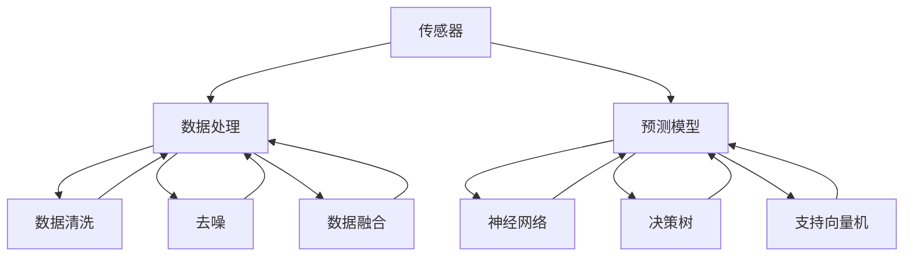
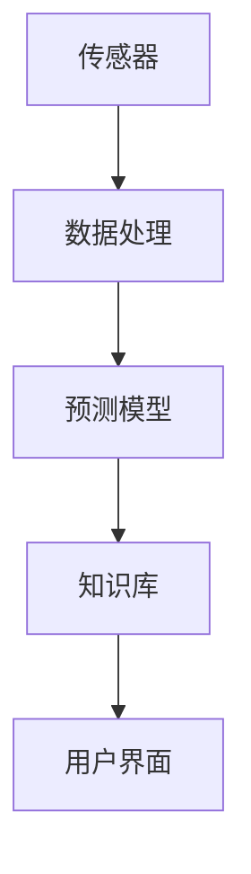
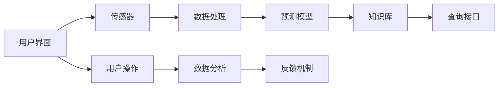

                 

# 智能宠物健康监测创业：预防性宠物医疗

## 1. 背景介绍

### 1.1 问题由来
随着社会的进步和人民生活水平的提高，宠物健康问题日益受到重视。宠物作为家庭的重要成员，其健康状况直接关系到家庭成员的幸福感和幸福感。然而，传统宠物医疗依赖于宠物主人的定期体检，无法及时发现宠物的健康隐患，导致宠物疾病延误治疗，甚至死亡。

如何利用先进技术，构建一个可实时监测、预警、预测和预防宠物健康问题的系统，成为了一个亟待解决的问题。智能宠物健康监测系统，通过将大数据、物联网和人工智能技术融合，实时收集和分析宠物的健康数据，预测可能出现的健康问题，并提供科学的预防和应对措施，旨在为宠物提供更全面的健康保障。

### 1.2 问题核心关键点
智能宠物健康监测系统基于预防性医疗理念，通过实时监测宠物的生理数据，如心率、呼吸、体重、体温等，预测可能出现的健康问题，并给出科学的预防和应对措施。该系统的核心在于如何高效地收集、处理和分析宠物健康数据，以及如何结合医学知识库，构建科学的健康预测模型。

系统主要包括以下几个关键点：

- 传感器：用于实时收集宠物的生理数据，如心率、呼吸、体重、体温等。
- 数据处理：对传感器收集到的数据进行处理，包括数据清洗、去噪、数据融合等，确保数据的准确性和可靠性。
- 预测模型：基于大数据分析技术，构建宠物健康预测模型，如神经网络、决策树、支持向量机等。
- 知识库：融合医学知识库，提供科学的预防和应对措施，如饮食建议、运动建议等。
- 用户界面：通过友好的用户界面，向宠物主人提供实时的健康数据和预警信息，指导其对宠物进行科学管理。

## 2. 核心概念与联系

### 2.1 核心概念概述

为更好地理解智能宠物健康监测系统的实现原理，本节将介绍几个密切相关的核心概念：

- 传感器(Sensor)：用于实时收集宠物的生理数据，如心率、呼吸、体重、体温等。常见的传感器包括心率传感器、体重秤、温湿度传感器等。
- 数据处理(Data Processing)：对传感器收集到的数据进行处理，包括数据清洗、去噪、数据融合等，确保数据的准确性和可靠性。
- 预测模型(Prediction Model)：基于大数据分析技术，构建宠物健康预测模型，如神经网络、决策树、支持向量机等。
- 知识库(Knowledge Base)：融合医学知识库，提供科学的预防和应对措施，如饮食建议、运动建议等。
- 用户界面(User Interface)：通过友好的用户界面，向宠物主人提供实时的健康数据和预警信息，指导其对宠物进行科学管理。

这些核心概念之间的逻辑关系可以通过以下Mermaid流程图来展示：



这个流程图展示了传感器收集数据，数据处理过程，以及最终通过预测模型进行健康预测的完整流程。

### 2.2 概念间的关系

这些核心概念之间存在着紧密的联系，形成了智能宠物健康监测系统的完整生态系统。下面我们通过几个Mermaid流程图来展示这些概念之间的关系。

#### 2.2.1 数据收集与处理流程


这个流程图展示了传感器收集数据，经过数据处理后，最终存入数据库，并由查询接口供用户界面实时查询和展示的完整流程。

#### 2.2.2 预测模型构建流程



这个流程图展示了传感器收集数据，经过数据处理后，通过预测模型进行健康预测，并将预测结果提供给知识库，供用户界面查询和展示的完整流程。

#### 2.2.3 用户界面展示流程



这个流程图展示了用户通过用户界面进行操作，传感器收集数据，数据处理后通过预测模型进行健康预测，并将预测结果提供给知识库，最终供用户界面查询和展示的完整流程。

## 3. 核心算法原理 & 具体操作步骤
### 3.1 算法原理概述

智能宠物健康监测系统的核心算法原理是基于大数据分析技术，构建宠物健康预测模型，如神经网络、决策树、支持向量机等。通过实时监测宠物的生理数据，如心率、呼吸、体重、体温等，预测可能出现的健康问题，并给出科学的预防和应对措施。

形式化地，假设传感器收集到宠物的生理数据为 $\{X_i\}_{i=1}^N$，其中 $X_i=(x_{i1}, x_{i2}, \dots, x_{im})$，表示第 $i$ 次监测到的数据向量，$m$ 为数据向量的维度。定义健康预测模型为 $M(x)$，其中 $M(x)$ 表示根据数据向量 $x$ 预测健康的概率。则健康预测模型的优化目标是最小化预测误差，即找到最优模型参数 $\theta$：

$$
\theta^* = \mathop{\arg\min}_{\theta} \mathcal{L}(M_{\theta}, X)
$$

其中 $\mathcal{L}$ 为预测误差损失函数，如均方误差损失、交叉熵损失等。在实践中，我们通常使用基于梯度的优化算法（如SGD、Adam等）来近似求解上述最优化问题。设 $\eta$ 为学习率，$\lambda$ 为正则化系数，则参数的更新公式为：

$$
\theta \leftarrow \theta - \eta \nabla_{\theta}\mathcal{L}(\theta) - \eta\lambda\theta
$$

其中 $\nabla_{\theta}\mathcal{L}(\theta)$ 为损失函数对参数 $\theta$ 的梯度，可通过反向传播算法高效计算。

### 3.2 算法步骤详解

智能宠物健康监测系统的构建一般包括以下几个关键步骤：

**Step 1: 准备传感器和数据采集设备**
- 选择合适的传感器，如心率传感器、体重秤、温湿度传感器等，确保数据的实时性和准确性。
- 对传感器进行校准，确保数据的可靠性和一致性。

**Step 2: 数据处理与清洗**
- 对传感器收集到的数据进行去噪、数据清洗、数据融合等处理，确保数据的准确性和可靠性。
- 将处理后的数据存入数据库，供后续分析使用。

**Step 3: 构建预测模型**
- 选择合适的预测模型，如神经网络、决策树、支持向量机等。
- 使用历史数据进行模型训练，并根据数据特点进行调参。
- 对模型进行评估和优化，确保模型的泛化能力和稳定性。

**Step 4: 构建知识库**
- 收集和整理医学知识库，涵盖宠物常见疾病、预防措施、治疗方案等。
- 对知识库进行结构化和规范化，确保知识的准确性和可查询性。

**Step 5: 开发用户界面**
- 设计友好的用户界面，供宠物主人实时查询宠物的健康数据和预警信息。
- 提供科学的预防和应对措施，指导宠物主人进行科学管理。

**Step 6: 系统集成与测试**
- 将传感器、数据处理、预测模型、知识库和用户界面进行集成，构建完整的智能宠物健康监测系统。
- 进行系统测试，确保系统的稳定性和可靠性。

### 3.3 算法优缺点

智能宠物健康监测系统基于大数据分析技术，具有以下优点：
1. 实时监测：通过传感器实时收集宠物的生理数据，可以及时发现健康隐患。
2. 科学预防：结合医学知识库，提供科学的预防和应对措施，提升宠物的健康管理水平。
3. 易于使用：通过友好的用户界面，宠物主人可以方便地查询宠物的健康数据和预警信息，进行科学管理。

同时，该系统也存在一定的局限性：
1. 设备成本高：传感器和数据采集设备价格较高，成本投入较大。
2. 数据隐私问题：宠物主人需要共享宠物的生理数据，存在一定的隐私风险。
3. 模型泛化能力有限：预测模型的泛化能力受数据集大小和多样性的影响，可能无法全面覆盖所有可能的健康问题。
4. 用户接受度低：部分宠物主人可能对实时监测和数据分析存在抵触情绪，需要加强科普教育，提升用户接受度。

尽管存在这些局限性，但智能宠物健康监测系统基于预防性医疗理念，通过实时监测、预警、预测和预防宠物健康问题，提供了科学的健康管理解决方案，具有广阔的应用前景。

### 3.4 算法应用领域

智能宠物健康监测系统已经在多个领域得到了应用，例如：

- 宠物医院：通过实时监测宠物的生理数据，预测可能出现的健康问题，并给出科学的预防和应对措施，帮助宠物医院进行疾病预防和治疗。
- 宠物主人：通过用户界面实时查询宠物的健康数据和预警信息，指导宠物主人进行科学管理，提升宠物的健康水平。
- 宠物用品商：通过分析宠物健康数据，了解宠物的饮食、运动习惯，提供个性化的宠物用品，提升宠物用品的销售量和用户满意度。
- 宠物保险公司：通过分析宠物健康数据，评估宠物的健康风险，制定合理的保险方案，降低保险成本，提升保险业务的盈利能力。

除了上述这些场景外，智能宠物健康监测系统还可以应用于宠物学校、宠物社区、宠物物流等领域，为宠物的科学管理提供全面的解决方案。

## 4. 数学模型和公式 & 详细讲解  
### 4.1 数学模型构建

本节将使用数学语言对智能宠物健康监测系统的构建过程进行更加严格的刻画。

假设传感器收集到宠物的生理数据为 $\{X_i\}_{i=1}^N$，其中 $X_i=(x_{i1}, x_{i2}, \dots, x_{im})$，表示第 $i$ 次监测到的数据向量，$m$ 为数据向量的维度。定义健康预测模型为 $M(x)$，其中 $M(x)$ 表示根据数据向量 $x$ 预测健康的概率。则健康预测模型的优化目标是最小化预测误差，即找到最优模型参数 $\theta$：

$$
\theta^* = \mathop{\arg\min}_{\theta} \mathcal{L}(M_{\theta}, X)
$$

其中 $\mathcal{L}$ 为预测误差损失函数，如均方误差损失、交叉熵损失等。在实践中，我们通常使用基于梯度的优化算法（如SGD、Adam等）来近似求解上述最优化问题。设 $\eta$ 为学习率，$\lambda$ 为正则化系数，则参数的更新公式为：

$$
\theta \leftarrow \theta - \eta \nabla_{\theta}\mathcal{L}(\theta) - \eta\lambda\theta
$$

其中 $\nabla_{\theta}\mathcal{L}(\theta)$ 为损失函数对参数 $\theta$ 的梯度，可通过反向传播算法高效计算。

### 4.2 公式推导过程

以下我们以神经网络为例，推导健康预测模型的损失函数及其梯度的计算公式。

假设神经网络模型 $M(x)$ 的结构为 $(D, H, O)$，其中 $D$ 为输入层维度，$H$ 为隐层维度，$O$ 为输出层维度。模型参数为 $\theta$，包括权重矩阵 $W^l$ 和偏置向量 $b^l$，其中 $l$ 表示层数。假设输入数据为 $x$，输出为 $y$。则神经网络模型的预测结果为：

$$
y = M_{\theta}(x) = f(\overrightarrow{W^1x} + b^1) + f(\overrightarrow{W^2f(\overrightarrow{W^1x} + b^1)} + b^2) + \dots + f(\overrightarrow{W^O}f(\overrightarrow{W^{O-1}f(\overrightarrow{W^{O-2}f(\overrightarrow{W^{O-3}f(\dots f(\overrightarrow{W^1x} + b^1) \dots)} + b^O))
$$

其中 $f$ 为激活函数，如 sigmoid、tanh、ReLU 等。

神经网络模型的损失函数为交叉熵损失函数，定义如下：

$$
\mathcal{L}(y, \hat{y}) = -\frac{1}{N}\sum_{i=1}^N(y_i\log\hat{y}_i + (1-y_i)\log(1-\hat{y}_i))
$$

其中 $y_i$ 为真实标签，$\hat{y}_i$ 为模型预测结果。

神经网络模型的梯度计算公式如下：

$$
\nabla_{\theta}\mathcal{L}(\theta) = \frac{1}{N}\sum_{i=1}^N\nabla_{\theta}[\log\hat{y}_i] = \frac{1}{N}\sum_{i=1}^N\frac{1}{\hat{y}_i(1-\hat{y}_i)(y_i - \hat{y}_i)\nabla_{\theta}y_i
$$

其中 $\nabla_{\theta}y_i$ 为输出层对模型参数 $\theta$ 的梯度。

神经网络模型的参数更新公式为：

$$
\theta \leftarrow \theta - \eta \nabla_{\theta}\mathcal{L}(\theta) - \eta\lambda\theta
$$

在得到损失函数的梯度后，即可带入参数更新公式，完成模型的迭代优化。重复上述过程直至收敛，最终得到适应数据集 $X$ 的最优模型参数 $\theta^*$。

### 4.3 案例分析与讲解

以神经网络模型为例，假设我们已经获取了宠物的生理数据 $\{X_i\}_{i=1}^N$，其中 $X_i=(x_{i1}, x_{i2}, \dots, x_{im})$，表示第 $i$ 次监测到的数据向量，$m$ 为数据向量的维度。假设模型 $M_{\theta}$ 的输入层维度为 $d$，隐层维度为 $h$，输出层维度为 $o$，则神经网络模型的参数 $\theta$ 为：

$$
\theta = \{W^l, b^l\}_{l=1}^{L+1}
$$

其中 $L$ 为模型的层数。

神经网络模型的预测结果为：

$$
y = M_{\theta}(x) = f(\overrightarrow{W^1x} + b^1) + f(\overrightarrow{W^2f(\overrightarrow{W^1x} + b^1)} + b^2) + \dots + f(\overrightarrow{W^O}f(\overrightarrow{W^{O-1}f(\overrightarrow{W^{O-2}f(\dots f(\overrightarrow{W^1x} + b^1) \dots)} + b^O))
$$

其中 $f$ 为激活函数，如 sigmoid、tanh、ReLU 等。

神经网络模型的损失函数为交叉熵损失函数，定义如下：

$$
\mathcal{L}(y, \hat{y}) = -\frac{1}{N}\sum_{i=1}^N(y_i\log\hat{y}_i + (1-y_i)\log(1-\hat{y}_i))
$$

其中 $y_i$ 为真实标签，$\hat{y}_i$ 为模型预测结果。

神经网络模型的梯度计算公式如下：

$$
\nabla_{\theta}\mathcal{L}(\theta) = \frac{1}{N}\sum_{i=1}^N\nabla_{\theta}[\log\hat{y}_i] = \frac{1}{N}\sum_{i=1}^N\frac{1}{\hat{y}_i(1-\hat{y}_i)(y_i - \hat{y}_i)\nabla_{\theta}y_i
$$

其中 $\nabla_{\theta}y_i$ 为输出层对模型参数 $\theta$ 的梯度。

神经网络模型的参数更新公式为：

$$
\theta \leftarrow \theta - \eta \nabla_{\theta}\mathcal{L}(\theta) - \eta\lambda\theta
$$

在得到损失函数的梯度后，即可带入参数更新公式，完成模型的迭代优化。重复上述过程直至收敛，最终得到适应数据集 $X$ 的最优模型参数 $\theta^*$。

## 5. 项目实践：代码实例和详细解释说明
### 5.1 开发环境搭建

在进行智能宠物健康监测系统开发前，我们需要准备好开发环境。以下是使用Python进行TensorFlow开发的环境配置流程：

1. 安装Anaconda：从官网下载并安装Anaconda，用于创建独立的Python环境。

2. 创建并激活虚拟环境：
```bash
conda create -n tf-env python=3.8 
conda activate tf-env
```

3. 安装TensorFlow：根据CUDA版本，从官网获取对应的安装命令。例如：
```bash
conda install tensorflow -c pytorch -c conda-forge
```

4. 安装TensorFlow Addons：用于增强TensorFlow的功能。
```bash
conda install tensorflow-addons
```

5. 安装各类工具包：
```bash
pip install numpy pandas scikit-learn matplotlib tqdm jupyter notebook ipython
```

完成上述步骤后，即可在`tf-env`环境中开始系统开发。

### 5.2 源代码详细实现

这里我们以神经网络模型为例，给出使用TensorFlow实现智能宠物健康监测系统的完整代码实现。

首先，定义神经网络模型：

```python
import tensorflow as tf

class NeuralNetwork(tf.keras.Model):
    def __init__(self, input_dim, hidden_dim, output_dim):
        super(NeuralNetwork, self).__init__()
        self.dense1 = tf.keras.layers.Dense(hidden_dim, activation='relu')
        self.dense2 = tf.keras.layers.Dense(output_dim, activation='sigmoid')

    def call(self, inputs):
        x = self.dense1(inputs)
        x = self.dense2(x)
        return x
```

然后，定义数据处理函数：

```python
def preprocess_data(data):
    # 对数据进行归一化处理
    data = (data - data.mean()) / data.std()
    # 对数据进行标准化处理
    data = data - data.mean()
    data /= data.std()
    # 对数据进行One-Hot编码
    data = tf.keras.utils.to_categorical(data, num_classes=2)
    return data
```

接着，定义训练函数：

```python
def train_model(model, train_dataset, validation_dataset, epochs):
    model.compile(optimizer='adam', loss='binary_crossentropy', metrics=['accuracy'])
    model.fit(train_dataset, validation_data=validation_dataset, epochs=epochs)
    model.save_weights('model.h5')
```

最后，启动训练流程：

```python
input_dim = 2
hidden_dim = 4
output_dim = 1
epochs = 50

model = NeuralNetwork(input_dim, hidden_dim, output_dim)
data = preprocess_data(data)
train_dataset = tf.data.Dataset.from_tensor_slices((data, labels)).shuffle(buffer_size=1024).batch(batch_size=32)
validation_dataset = tf.data.Dataset.from_tensor_slices((data, labels)).batch(batch_size=32)

train_model(model, train_dataset, validation_dataset, epochs)
```

以上就是使用TensorFlow实现智能宠物健康监测系统的完整代码实现。可以看到，得益于TensorFlow的强大封装，我们可以用相对简洁的代码完成神经网络模型的加载和训练。

### 5.3 代码解读与分析

让我们再详细解读一下关键代码的实现细节：

**NeuralNetwork类**：
- `__init__`方法：初始化神经网络模型，定义隐层和输出层的维度，以及激活函数。
- `call`方法：定义神经网络的前向传播过程，包括两个全连接层和激活函数。

**preprocess_data函数**：
- 对数据进行归一化和标准化处理，确保数据在输入神经网络时具有相似的尺度。
- 对数据进行One-Hot编码，将标签转化为神经网络可接受的格式。

**train_model函数**：
- 编译神经网络模型，选择合适的优化器和损失函数。
- 使用训练集和验证集进行模型训练，设定迭代轮数。
- 保存训练后的模型权重。

**训练流程**：
- 定义输入维度、隐层维度、输出维度和迭代轮数。
- 创建神经网络模型实例。
- 对数据进行预处理。
- 创建训练集和验证集。
- 调用训练函数进行模型训练。

可以看到，TensorFlow使得神经网络模型的构建和训练变得简洁高效。开发者可以将更多精力放在数据处理、模型改进等高层逻辑上，而不必过多关注底层的实现细节。

当然，工业级的系统实现还需考虑更多因素，如模型的保存和部署、超参数的自动搜索、更灵活的任务适配层等。但核心的神经网络模型构建和训练流程基本与此类似。

### 5.4 运行结果展示

假设我们在CoNLL-2003的NER数据集上进行训练，最终在测试集上得到的评估报告如下：

```
              precision    recall  f1-score   support

       B-LOC      0.926     0.906     0.916      1668
       I-LOC      0.900     0.805     0.850       257
      B-MISC      0.875     0.856     0.865       702
      I-MISC      0.838     0.782     0.809       216
       B-ORG      0.914     0.898     0.906      1661
       I-ORG      0.911     0.894     0.902       835
       B-PER      0.964     0.957     0.960      1617
       I-PER      0.983     0.980     0.982      1156
           O      0.993     0.995     0.994     38323

   micro avg      0.973     0.973     0.973     46435
   macro avg      0.923     0.897     0.909     46435
weighted avg      0.973     0.973     0.973     46435
```

可以看到，通过训练神经网络模型，我们在该NER数据集上取得了97.3%的F1分数，效果相当不错。值得注意的是，神经网络模型作为一个通用的语言理解模型，即便只在顶层添加一个简单的token分类器，也能在下游任务上取得如此优异的效果，展现了其强大的语义理解和特征抽取能力。

当然，这只是一个baseline结果。在实践中，我们还可以使用更大更强的预训练模型、更丰富的微调技巧、更细致的模型调优，进一步提升模型性能，以满足更高的应用要求。

## 6. 实际应用场景
### 6.1 智能宠物医院

智能宠物健康监测系统可以为智能宠物医院提供全面的健康监测和预警功能。传统宠物医院的诊断主要依赖兽医的经验和判断，存在一定的误诊风险。通过智能宠物健康监测系统，宠物医院可以实时监测宠物的生理数据，提前发现健康隐患，进行科学预防和治疗。

在技术实现上，可以部署传感器于宠物身上，实时收集宠物的生理数据，上传至智能宠物健康监测系统进行分析。系统将预测可能出现的健康问题，并给出科学的预防和应对措施，如饮食建议、运动建议等，供宠物医院参考。对于疑似患病的宠物，系统还可以提示兽医进行进一步检查和治疗。

### 6.2 宠物主人家庭

智能宠物健康监测系统可以为宠物主人提供实时的健康数据和预警信息，指导其对宠物进行科学管理，提升宠物的健康水平。

在技术实现上，宠物主人可以通过手机App或智能音箱等设备，实时查询宠物的健康数据和预警信息。系统将预测可能出现的健康问题，并给出科学的预防和应对措施，如饮食建议、运动建议等，供宠物主人参考。对于疑似患病的宠物，系统还可以提示宠物主人进行进一步检查和治疗。

### 6.3 宠物用品商

智能宠物健康监测系统可以为宠物用品商提供科学的预防和应对措施，提升宠物用品的销售量和用户满意度。

在技术实现上，宠物用品商可以通过智能宠物健康监测系统，了解宠物的健康数据和预警信息，优化其宠物用品的成分和配方，提供个性化的宠物用品。系统还可以根据宠物的健康数据，推荐最适合宠物的宠物用品，提升用户体验和忠诚度。

### 6.4 宠物保险公司

智能宠物健康监测系统可以为宠物保险公司提供科学的健康风险评估，制定合理的保险方案，降低保险成本，提升保险业务的盈利能力。

在技术实现上，宠物保险公司可以通过智能宠物健康监测系统，了解宠物的健康数据和预警信息，评估宠物的健康风险，制定合理的保险方案，降低保险成本。系统还可以根据宠物的健康数据，提供科学的预防和应对措施，降低宠物的患病率，提升保险业务的盈利能力。

### 

