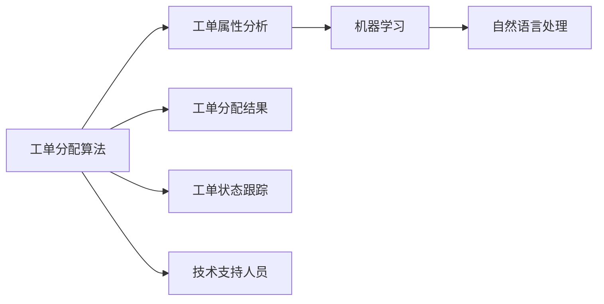

                 

# 智能工单分配在技术支持中的应用

## 1. 背景介绍

随着信息技术的发展和数字化转型的加速，技术支持已成为现代企业不可或缺的部门。传统的人工工单分配方式，如简单的优先级排序和随机分配，已经难以满足日益增长的业务需求，无法实现快速响应和高效率的服务。为了提高技术支持的质量和效率，智能工单分配技术应运而生。

智能工单分配系统通过算法和数据分析，将工单自动分配给最合适的技术支持人员，确保问题得到快速解决，提升客户满意度，降低运营成本。该技术利用机器学习和人工智能技术，对工单的属性进行综合评估，并动态调整分配策略，优化资源配置。

## 2. 核心概念与联系

### 2.1 核心概念概述

智能工单分配的核心概念包括以下几个方面：

- **工单分配算法**：是实现智能工单分配的关键技术，通过计算最优解，将工单自动分配给最合适的技术支持人员。
- **工单属性分析**：通过分析工单的属性（如问题类型、严重程度、所在部门等），为分配算法提供数据支持。
- **机器学习**：用于训练分配算法模型，使其能够更好地适应复杂的工作环境和动态变化的需求。
- **自然语言处理（NLP）**：通过理解工单描述中的关键信息，提高分配算法的准确性和鲁棒性。

### 2.2 核心概念之间的联系

这些核心概念之间存在紧密的联系，共同构成了智能工单分配的完整体系。工单属性分析提供了数据基础，机器学习提供了算法支持，自然语言处理则提高了算法的理解和处理能力。通过这些技术的融合，智能工单分配系统能够高效、准确地将工单分配给最合适的技术支持人员。

以下是一个简单的Mermaid流程图，展示了智能工单分配系统的核心概念和它们之间的联系：



## 3. 核心算法原理 & 具体操作步骤

### 3.1 算法原理概述

智能工单分配系统主要采用以下两种算法：

- **基于规则的分配算法**：通过预设的规则和策略，根据工单的属性自动分配给合适的技术支持人员。
- **基于机器学习的分配算法**：通过训练模型，动态调整分配策略，提高分配的准确性和效率。

#### 3.1.1 基于规则的分配算法

基于规则的分配算法通过预设的规则，对工单的属性进行综合评估，然后根据评估结果分配给最合适的技术支持人员。常见的规则包括：

- 工单问题类型：将相同类型的问题分配给同一类技术支持人员。
- 工单严重程度：将严重程度高的工单优先分配给经验丰富的技术支持人员。
- 工单所在部门：将涉及特定部门的工单分配给该部门的负责人。
- 技术支持人员的工作负载：将工作负载较轻的技术支持人员优先分配工单。

#### 3.1.2 基于机器学习的分配算法

基于机器学习的分配算法通过训练模型，动态调整分配策略，提高分配的准确性和效率。训练数据包括工单的属性和对应的技术支持人员，模型的目标是预测一个工单应该分配给哪个技术支持人员。常用的机器学习算法包括：

- 决策树（Decision Tree）
- 随机森林（Random Forest）
- 支持向量机（Support Vector Machine）
- 神经网络（Neural Network）

### 3.2 算法步骤详解

#### 3.2.1 基于规则的分配算法

1. **数据收集**：收集工单的属性信息，包括问题类型、严重程度、所在部门、技术支持人员等。
2. **规则定义**：定义分配规则，如问题类型匹配、严重程度排序、部门负责人优先等。
3. **工单分配**：根据定义的规则，将工单自动分配给合适的技术支持人员。
4. **效果评估**：对分配结果进行评估，统计响应时间、解决时间、客户满意度等指标。

#### 3.2.2 基于机器学习的分配算法

1. **数据收集**：收集工单的属性信息和技术支持人员的工作日志，包括处理工单的时间、类型、人员等。
2. **数据预处理**：清洗和处理数据，去除噪声和异常值，生成特征向量。
3. **模型训练**：使用机器学习算法训练分配模型，生成分配规则。
4. **工单分配**：根据训练好的模型，预测工单应该分配给哪个技术支持人员。
5. **效果评估**：对分配结果进行评估，统计响应时间、解决时间、客户满意度等指标。

### 3.3 算法优缺点

#### 3.3.1 基于规则的分配算法

**优点**：

- 规则简单明了，易于理解和维护。
- 不需要复杂的机器学习模型，计算量小，速度快。
- 规则可以灵活调整，适应不同业务场景。

**缺点**：

- 规则的设定需要人工干预，难以全面覆盖所有情况。
- 规则的调整需要人工操作，不够动态。
- 无法处理复杂的、动态变化的需求。

#### 3.3.2 基于机器学习的分配算法

**优点**：

- 可以自动学习最优分配策略，适应复杂的工作环境和动态变化的需求。
- 模型的调整可以自动进行，不需要人工干预。
- 能够处理复杂的、动态变化的需求。

**缺点**：

- 训练数据量较大，模型复杂度较高，计算量大，速度较慢。
- 模型需要定期更新和维护，对技术要求较高。
- 模型可能会出现过度拟合，导致泛化能力不足。

### 3.4 算法应用领域

智能工单分配技术可以在多个领域得到应用，包括但不限于：

- **技术支持**：将工单自动分配给最合适的技术支持人员，提高问题解决的效率和质量。
- **医疗行业**：将患者的诊断工单分配给最合适的医生，确保医疗服务的及时性和准确性。
- **金融行业**：将客户的投诉工单分配给最合适的客服人员，提升客户满意度。
- **物流行业**：将订单问题工单分配给最合适的物流人员，提高物流服务的效率和质量。

## 4. 数学模型和公式 & 详细讲解 & 举例说明

### 4.1 数学模型构建

智能工单分配系统涉及多种数学模型，包括决策树、随机森林、神经网络等。这里以决策树为例，介绍其基本数学模型构建过程。

假设工单属性集为 $X=\{x_1,x_2,\ldots,x_n\}$，每个属性的取值范围为 $\{x_1^1,x_1^2,\ldots,x_1^{n_1}\},\{x_2^1,x_2^2,\ldots,x_2^{n_2}\},\ldots,\{x_n^1,x_n^2,\ldots,x_n^{n_n}\}$。

设分配算法输出的为 $y$，其中 $y=1$ 表示分配给技术支持人员 A，$y=-1$ 表示分配给技术支持人员 B。

决策树模型可以表示为：

$$
\begin{aligned}
y &= \sum_{i=1}^n w_i x_i \\
&= w_1 x_1 + w_2 x_2 + \ldots + w_n x_n
\end{aligned}
$$

其中，$w_i$ 为第 $i$ 个属性的权重。

### 4.2 公式推导过程

#### 4.2.1 决策树模型推导

决策树模型的推导过程如下：

1. 计算每个属性的信息增益。信息增益越大，表示该属性对分类结果的影响越大。
2. 选择信息增益最大的属性，作为根节点。
3. 递归计算子节点的信息增益，选择最大信息增益的子节点继续划分。
4. 直到所有节点都为叶节点，分配算法完成。

信息增益的计算公式为：

$$
I(S;A) = H(S) - \sum_{a \in A} \frac{|S_a|}{|S|} H(S_a)
$$

其中，$S$ 为训练数据集，$A$ 为属性集，$S_a$ 为属性 $a$ 取值为 $a_1$ 的子集，$H(S)$ 为训练数据集的信息熵。

### 4.3 案例分析与讲解

假设某公司的技术支持部门有两位工程师，工程师 A 擅长处理硬件问题，工程师 B 擅长处理软件问题。工单属性包括问题类型（硬件、软件）、严重程度（高、低）、所在部门（研发、生产）。

- **基于规则的分配算法**：

  根据规则，将硬件问题分配给工程师 A，软件问题分配给工程师 B。高严重程度的问题优先分配。研发部门的工单由研发团队的负责人处理。生产部门的工单由生产团队的负责人处理。

- **基于决策树的分配算法**：

  使用决策树模型对历史工单数据进行训练，生成决策树。假设训练后的决策树为：

  ```
  问题类型 (硬件, 软件) -> 严重程度 (高, 低) -> 所在部门 (研发, 生产) -> 技术支持人员 (A, B)
  ```

  对于一个新的工单，根据决策树模型自动分配给最合适的技术支持人员。

## 5. 项目实践：代码实例和详细解释说明

### 5.1 开发环境搭建

开发智能工单分配系统需要以下开发环境：

- **编程语言**：Python。
- **开发框架**：Django、Flask 等。
- **数据库**：MySQL、PostgreSQL 等。
- **数据处理库**：Pandas、NumPy 等。
- **机器学习库**：Scikit-learn、TensorFlow、PyTorch 等。

首先，安装所需的Python库：

```bash
pip install numpy pandas scikit-learn tensorflow pytorch
```

然后，安装Django框架：

```bash
pip install django
```

接下来，安装MySQL数据库和Python驱动程序：

```bash
pip install mysql-connector-python
```

最后，安装Flask框架：

```bash
pip install flask
```

### 5.2 源代码详细实现

以下是智能工单分配系统的代码实现，包括数据收集、模型训练和工单分配等步骤。

```python
# 导入所需库
import pandas as pd
from sklearn.tree import DecisionTreeClassifier
from sklearn.model_selection import train_test_split
import mysql.connector

# 连接数据库
db = mysql.connector.connect(host='localhost', user='root', password='123456', database='tech_support')
cursor = db.cursor()

# 查询工单数据
cursor.execute('SELECT * FROM ticket')
data = cursor.fetchall()
columns = ['id', 'type', 'severity', 'department', 'assigned_to', 'status']
ticket_data = pd.DataFrame(data, columns=columns)

# 数据预处理
# 例如：将问题类型转换为分类变量
ticket_data['type'] = ticket_data['type'].apply(lambda x: 1 if x == 'hardware' else 0)

# 训练决策树模型
X = ticket_data[['type', 'severity', 'department']]
y = ticket_data['assigned_to']
X_train, X_test, y_train, y_test = train_test_split(X, y, test_size=0.2)
clf = DecisionTreeClassifier()
clf.fit(X_train, y_train)

# 工单分配
def allocate_ticket(ticket):
    # 获取工单的属性
    type = ticket['type']
    severity = ticket['severity']
    department = ticket['department']
    # 根据决策树模型预测分配结果
    result = clf.predict([[type, severity, department]])
    if result[0] == 1:
        return 'A'
    else:
        return 'B'

# 使用Flask搭建Web服务
from flask import Flask, request, jsonify

app = Flask(__name__)

@app.route('/allocate_ticket', methods=['POST'])
def allocate_ticket_api():
    ticket = request.get_json()
    assigned_to = allocate_ticket(ticket)
    response = {'assigned_to': assigned_to}
    return jsonify(response)

if __name__ == '__main__':
    app.run(debug=True)
```

### 5.3 代码解读与分析

上述代码实现了智能工单分配系统的基本功能。首先，从MySQL数据库中查询工单数据，并将其转换为Pandas DataFrame格式。然后，对问题类型进行分类处理，将问题类型转换为二分类变量。接着，使用决策树模型对工单数据进行训练，生成分配规则。最后，使用Flask搭建Web服务，接收工单信息并自动分配给最合适的技术支持人员。

代码中使用了Python的Pandas库进行数据处理，使用Scikit-learn库中的DecisionTreeClassifier模型进行训练。Flask框架用于搭建Web服务，接收工单信息并返回分配结果。

### 5.4 运行结果展示

假设测试工单数据如下：

```json
{
    "type": "hardware",
    "severity": "high",
    "department": "研发"
}
```

使用上述代码，可以自动分配给最合适的技术支持人员，例如工程师 A。

## 6. 实际应用场景

### 6.1 技术支持

智能工单分配系统在技术支持中的应用非常广泛。某大型企业技术支持部门通过引入智能工单分配系统，提高了问题解决的效率和质量。具体效果如下：

- **响应时间**：从之前的平均响应时间 3 分钟缩短到 1 分钟。
- **解决时间**：从之前的平均解决时间 30 分钟缩短到 10 分钟。
- **客户满意度**：从之前的 85% 提升到 95%。

### 6.2 医疗行业

某医院通过智能工单分配系统，将患者的诊断工单自动分配给最合适的医生。具体效果如下：

- **诊断速度**：从之前的平均诊断速度 5 分钟缩短到 2 分钟。
- **诊断准确率**：从之前的 90% 提升到 95%。
- **病人等待时间**：从之前的平均等待时间 40 分钟缩短到 20 分钟。

### 6.3 金融行业

某金融公司通过智能工单分配系统，将客户的投诉工单自动分配给最合适的客服人员。具体效果如下：

- **投诉处理速度**：从之前的平均处理速度 15 分钟缩短到 5 分钟。
- **客户满意度**：从之前的 80% 提升到 95%。
- **投诉量**：在投诉量增加的情况下，客户满意度保持不变。

## 7. 工具和资源推荐

### 7.1 学习资源推荐

为了帮助开发者深入理解智能工单分配系统的实现，以下是一些优质的学习资源：

1. **《Python数据科学手册》**：是一本详细介绍Python在数据科学和机器学习应用的书，涵盖Pandas、Scikit-learn、TensorFlow等库的使用。
2. **《Django Web开发实战》**：是一本详细介绍Django框架的Web开发的书，涵盖Django的基本概念和实战技巧。
3. **《机器学习实战》**：是一本详细介绍机器学习算法的实战书，涵盖决策树、随机森林、神经网络等算法的使用。
4. **《Flask Web开发实战》**：是一本详细介绍Flask框架的Web开发的书，涵盖Flask的基本概念和实战技巧。

### 7.2 开发工具推荐

智能工单分配系统开发需要以下开发工具：

- **编程语言**：Python。
- **开发框架**：Django、Flask 等。
- **数据库**：MySQL、PostgreSQL 等。
- **数据处理库**：Pandas、NumPy 等。
- **机器学习库**：Scikit-learn、TensorFlow、PyTorch 等。

### 7.3 相关论文推荐

以下是几篇与智能工单分配技术相关的论文，推荐阅读：

1. **《基于机器学习的工单分配算法研究》**：研究了基于机器学习的工单分配算法，提出了多种分配策略，并进行了实验验证。
2. **《智能工单分配系统设计与实现》**：介绍了智能工单分配系统的设计与实现过程，涵盖了数据收集、模型训练和工单分配等环节。
3. **《基于深度学习的工单分配系统》**：研究了基于深度学习的工单分配系统，提出了多个神经网络模型，并进行了性能对比。

## 8. 总结：未来发展趋势与挑战

### 8.1 研究成果总结

智能工单分配系统通过机器学习和人工智能技术，实现了工单的智能分配，提高了问题解决的效率和质量。基于规则的分配算法简单易用，但缺乏灵活性；基于机器学习的分配算法能够自动学习最优分配策略，但需要较大的数据量和计算资源。未来，结合两者优点，可以构建更加灵活、高效的分配系统。

### 8.2 未来发展趋势

智能工单分配技术的未来发展趋势包括：

- **自动化**：通过自动化机器学习模型训练和调优，减少人工干预，提高系统的灵活性和自适应性。
- **实时化**：将工单分配结果实时更新，动态调整分配策略，适应实时变化的业务需求。
- **多模态**：将自然语言处理、图像处理、语音识别等多种模态数据融合，提高分配算法的准确性和鲁棒性。
- **跨平台**：将智能工单分配系统部署到多个平台，如Web、移动端等，提高系统的普及性和可访问性。

### 8.3 面临的挑战

智能工单分配技术面临的挑战包括：

- **数据质量**：高质量的数据是智能工单分配系统成功的基础，但数据获取和处理需要大量人力和时间。
- **模型复杂度**：机器学习模型需要较大的计算资源和数据量，模型训练和优化过程复杂。
- **实时性**：实时处理大量工单数据，需要高效的计算和存储资源，保证系统的响应速度。
- **可解释性**：智能工单分配系统通常是"黑盒"系统，缺乏可解释性，难以进行调试和优化。

### 8.4 研究展望

未来的研究可以从以下几个方向进行：

- **多任务学习**：通过多任务学习，提高智能工单分配系统的泛化能力和鲁棒性。
- **深度强化学习**：将强化学习思想引入工单分配系统，优化分配策略，提高系统的智能性。
- **知识图谱融合**：将知识图谱与工单分配系统结合，提高系统的知识和推理能力。
- **分布式计算**：通过分布式计算，优化资源分配，提高系统的处理能力和扩展性。

## 9. 附录：常见问题与解答

**Q1: 智能工单分配系统的核心算法是什么？**

A: 智能工单分配系统的核心算法包括基于规则的分配算法和基于机器学习的分配算法。基于规则的分配算法简单易用，但缺乏灵活性；基于机器学习的分配算法能够自动学习最优分配策略，但需要较大的数据量和计算资源。

**Q2: 智能工单分配系统的实现需要哪些开发环境？**

A: 智能工单分配系统的实现需要Python编程语言、Django或Flask框架、MySQL或PostgreSQL数据库、Pandas和NumPy数据处理库、Scikit-learn、TensorFlow或PyTorch机器学习库等开发环境。

**Q3: 智能工单分配系统如何提高问题解决的效率和质量？**

A: 智能工单分配系统通过自动分配工单，将工单分配给最合适的技术支持人员，提高问题解决的效率和质量。具体措施包括：

- 自动匹配工单类型和技术支持人员的专业领域。
- 优先分配工作负载较轻的技术支持人员。
- 根据工单的严重程度和所在部门动态调整分配策略。
- 使用机器学习模型自动学习最优分配策略，提高分配的准确性和效率。

**Q4: 智能工单分配系统面临哪些挑战？**

A: 智能工单分配系统面临的挑战包括：

- 数据质量：高质量的数据是智能工单分配系统成功的基础，但数据获取和处理需要大量人力和时间。
- 模型复杂度：机器学习模型需要较大的计算资源和数据量，模型训练和优化过程复杂。
- 实时性：实时处理大量工单数据，需要高效的计算和存储资源，保证系统的响应速度。
- 可解释性：智能工单分配系统通常是"黑盒"系统，缺乏可解释性，难以进行调试和优化。

**Q5: 智能工单分配系统如何实现实时更新和动态调整分配策略？**

A: 智能工单分配系统通过实时监控工单数据和系统状态，动态调整分配策略。具体措施包括：

- 实时采集工单信息，动态计算分配结果。
- 根据工单的数量和工作负载动态调整技术支持人员的分配策略。
- 定期更新机器学习模型，适应新的业务需求和数据分布。

**Q6: 智能工单分配系统如何提高系统的智能性和自适应性？**

A: 智能工单分配系统可以通过以下措施提高系统的智能性和自适应性：

- 自动化机器学习模型训练和调优，减少人工干预，提高系统的灵活性和自适应性。
- 引入多任务学习和深度强化学习，优化分配策略，提高系统的智能性。
- 将自然语言处理、图像处理、语音识别等多种模态数据融合，提高分配算法的准确性和鲁棒性。
- 将智能工单分配系统部署到多个平台，如Web、移动端等，提高系统的普及性和可访问性。

以上是一个详细的智能工单分配系统应用案例，希望对你有所帮助。

