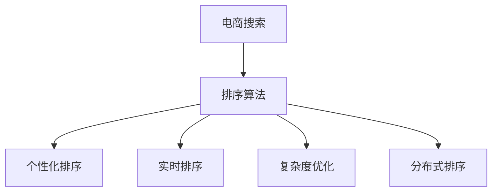
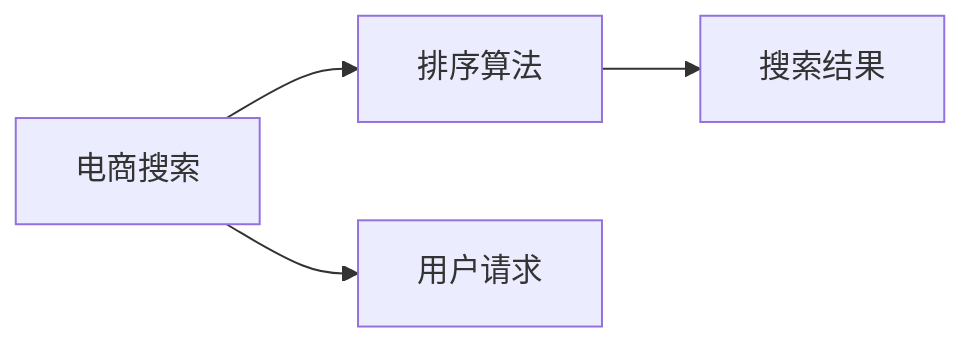
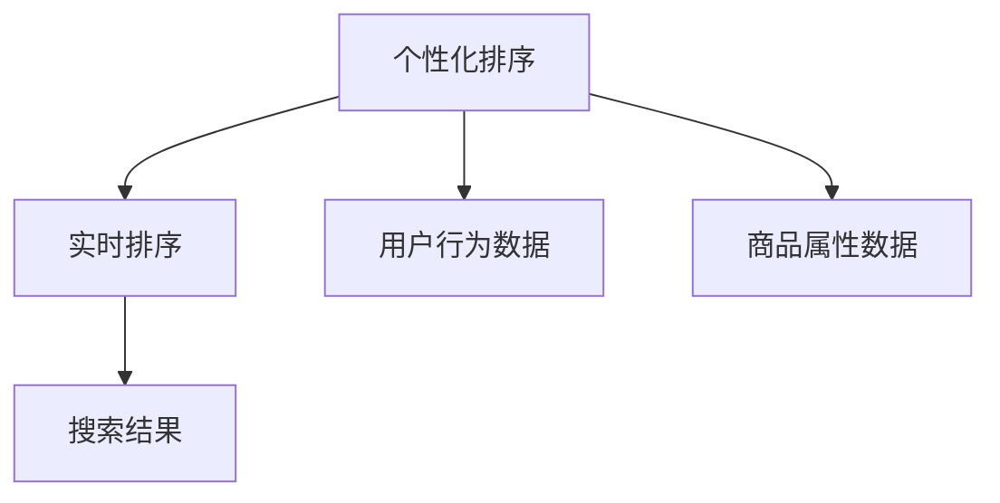
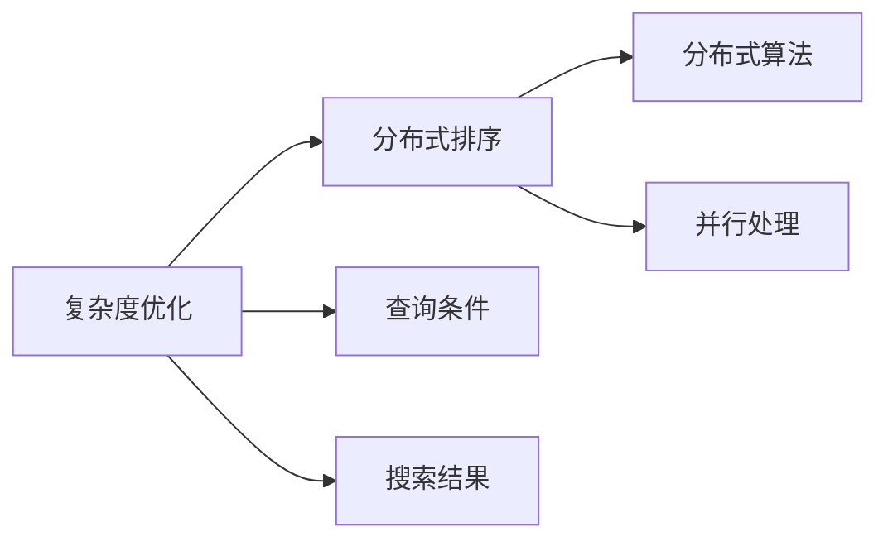

                 

# 智能排序算法在电商搜索中的应用：原理与实践

> 关键词：智能排序算法, 电商搜索, 排序算法, 排序, 电子商务, 计算机科学

## 1. 背景介绍

### 1.1 问题由来

电子商务的兴起和普及，使得线上购物成为了一种流行的购物方式。用户通过电商平台寻找商品，平台则需要对搜索结果进行排序，以使用户能够快速找到最符合需求的商品。排序算法是电商平台的核心功能之一，其性能直接影响用户的使用体验和平台的运营效率。传统的排序算法已经无法满足大规模用户和复杂查询需求，因此研究高效、智能的排序算法成为当前电商平台亟需解决的问题。

### 1.2 问题核心关键点

智能排序算法需要结合用户的行为数据和商品的属性数据，以动态的方式调整搜索结果的排序。其核心关键点包括：

- **个性化排序**：根据用户历史浏览、购买行为，个性化调整搜索结果。
- **实时性**：实时响应用户的查询请求，保持排序结果的时效性。
- **复杂度**：处理海量用户请求和复杂查询条件，保证排序算法的计算效率。
- **可扩展性**：能够处理并行的查询请求，实现水平扩展。

智能排序算法需要综合考虑这些因素，以提高电商平台的搜索体验和运营效率。

### 1.3 问题研究意义

智能排序算法的研究和应用，对于电商平台的搜索体验和运营效率具有重要意义：

1. **提升用户体验**：通过个性化和实时性的排序，使用户能够快速找到满意的商品，提高用户的购物体验。
2. **提高运营效率**：通过优化算法，减少搜索处理的资源消耗，降低平台的运营成本。
3. **增强竞争力**：提供高质量的搜索服务，吸引更多用户，提升平台的市场竞争力。
4. **促进技术发展**：推动计算机科学和人工智能领域的研究进展，促进技术的创新和应用。

## 2. 核心概念与联系

### 2.1 核心概念概述

为更好地理解智能排序算法，本节将介绍几个密切相关的核心概念：

- **电商搜索**：用户通过电商平台查找商品的搜索功能。
- **排序算法**：对搜索结果按照一定规则进行排序的过程。
- **个性化排序**：根据用户行为数据和商品属性数据，动态调整搜索结果的排序。
- **实时排序**：对用户查询请求进行实时响应，保持排序结果的时效性。
- **复杂度优化**：在保证排序结果质量的前提下，降低算法计算复杂度，提高处理效率。
- **分布式排序**：通过分布式算法，实现并行处理大规模用户请求，提升系统可扩展性。

这些核心概念之间的逻辑关系可以通过以下Mermaid流程图来展示：



这个流程图展示了几大核心概念之间的关系：

1. 电商搜索是排序算法的输入来源。
2. 排序算法通过个性化排序、实时排序、复杂度优化和分布式排序等技术手段，提升搜索结果的质量和效率。
3. 这些技术手段共同构成了一个完整的智能排序系统。

### 2.2 概念间的关系

这些核心概念之间存在着紧密的联系，形成了智能排序系统的完整生态系统。下面我们通过几个Mermaid流程图来展示这些概念之间的关系。

#### 2.2.1 电商搜索与排序算法的关系



这个流程图展示了电商搜索和排序算法的基本关系。用户通过电商平台发起搜索请求，排序算法根据用户的查询条件返回搜索结果。

#### 2.2.2 个性化排序与实时排序的关系



这个流程图展示了个性化排序和实时排序的关系。个性化排序通过分析用户行为数据和商品属性数据，动态调整搜索结果的排序，而实时排序则保证了排序结果的时效性。

#### 2.2.3 复杂度优化与分布式排序的关系



这个流程图展示了复杂度优化和分布式排序的关系。复杂度优化通过优化算法设计，降低计算复杂度，提高处理效率，而分布式排序通过分布式算法，实现并行处理大规模用户请求，提升系统可扩展性。

### 2.3 核心概念的整体架构

最后，我们用一个综合的流程图来展示这些核心概念在大语言模型微调过程中的整体架构：


这个综合流程图展示了从电商搜索到排序算法的完整过程。电商搜索提供用户的查询请求，排序算法通过个性化排序、实时排序、复杂度优化和分布式排序等技术手段，提升搜索结果的质量和效率。

## 3. 核心算法原理 & 具体操作步骤

### 3.1 算法原理概述

智能排序算法通常基于机器学习和深度学习技术，通过对用户行为数据和商品属性数据的分析，动态调整搜索结果的排序。其核心原理可以概括为以下几个步骤：

1. **数据收集**：收集用户的搜索历史、浏览行为、购买记录等数据，以及商品的标题、描述、价格、评分等属性数据。
2. **特征工程**：对收集到的数据进行特征提取和预处理，构建适合排序算法的特征向量。
3. **模型训练**：使用机器学习或深度学习算法，训练排序模型，并根据实际效果进行调参优化。
4. **实时排序**：对用户的实时查询请求进行处理，根据个性化和实时排序规则，返回最优的搜索结果。
5. **复杂度优化**：采用高效的数据结构和算法，降低排序算法的计算复杂度，提高处理效率。
6. **分布式排序**：通过分布式算法，实现并行处理大规模用户请求，提升系统可扩展性。

### 3.2 算法步骤详解

#### 3.2.1 数据收集与预处理

数据收集是智能排序算法的第一步，通常包括用户行为数据和商品属性数据两部分。

1. **用户行为数据**：包括用户的搜索历史、浏览记录、点击行为、购买记录等。这些数据可以用于分析用户偏好和行为模式。
2. **商品属性数据**：包括商品的标题、描述、价格、评分、销量等。这些数据可以用于计算商品的排序权重。

数据收集完成后，需要进行预处理和特征提取，以构建适合排序算法的特征向量。

1. **特征提取**：将用户行为数据和商品属性数据转换为数值特征向量，如将搜索历史转换为词频向量，将商品价格转换为数值型特征。
2. **缺失值处理**：处理缺失值和异常值，确保特征向量的完整性和准确性。
3. **特征归一化**：对特征向量进行归一化处理，避免特征之间的数值差异过大，影响模型效果。

#### 3.2.2 模型训练与调参

模型训练是智能排序算法的核心步骤，通过训练排序模型，找到最优的排序规则。

1. **选择合适的模型**：根据任务特点选择合适的机器学习或深度学习模型，如线性回归、决策树、随机森林、XGBoost、神经网络等。
2. **训练数据集划分**：将数据集划分为训练集、验证集和测试集，确保模型的泛化能力。
3. **模型训练**：使用训练集数据训练排序模型，并根据验证集效果进行调参优化。
4. **模型评估**：在测试集上评估模型的效果，选择最优的模型进行部署。

#### 3.2.3 实时排序与调整

实时排序是智能排序算法的关键步骤，根据用户的实时查询请求，动态调整搜索结果的排序。

1. **用户查询处理**：将用户查询请求解析为关键词、查询时间、商品属性等特征向量。
2. **特征加权**：根据用户的个性化偏好和商品属性数据，对特征向量进行加权处理，计算每个商品的排序权重。
3. **排序规则应用**：根据预设的排序规则，对商品按照权重进行排序，返回最优的搜索结果。
4. **实时调整**：根据用户反馈和系统实时数据，动态调整排序规则和特征权重，优化排序结果。

#### 3.2.4 复杂度优化与算法优化

复杂度优化是智能排序算法的提升关键，通过优化算法设计，降低计算复杂度，提高处理效率。

1. **数据结构优化**：使用高效的数据结构，如哈希表、堆、树等，提高查询效率。
2. **算法优化**：优化排序算法，如基于堆的排序算法、快速排序、归并排序等，降低算法时间复杂度。
3. **特征压缩**：采用特征选择和特征压缩技术，减少特征向量的维度，提高处理速度。
4. **并行计算**：采用并行计算技术，如多线程、分布式计算等，提高计算效率。

#### 3.2.5 分布式排序与系统设计

分布式排序是智能排序算法的系统设计关键，通过分布式算法，实现并行处理大规模用户请求，提升系统可扩展性。

1. **系统架构设计**：设计分布式系统架构，如客户端-服务器架构、微服务架构等。
2. **负载均衡**：采用负载均衡技术，均衡分配用户请求，提高系统并发处理能力。
3. **数据分片**：将数据划分为多个分片，分布在不同的节点上，提高数据访问效率。
4. **任务调度**：采用任务调度技术，合理分配计算任务，提高系统资源利用率。

### 3.3 算法优缺点

智能排序算法在提升电商搜索效率和用户体验方面具有显著优势，但也存在一些局限性：

#### 3.3.1 优点

1. **个性化推荐**：通过分析用户行为数据和商品属性数据，个性化调整搜索结果，提升用户体验。
2. **实时响应**：实时处理用户查询请求，保持排序结果的时效性，提高用户满意度。
3. **处理高效**：采用高效的算法和数据结构，降低计算复杂度，提高处理效率。
4. **可扩展性强**：通过分布式算法，实现并行处理大规模用户请求，提升系统可扩展性。

#### 3.3.2 缺点

1. **数据依赖性强**：算法效果依赖于用户行为数据和商品属性数据的完整性和准确性，数据缺失或错误可能导致排序效果不佳。
2. **模型复杂度高**：采用机器学习和深度学习模型，计算复杂度高，对硬件资源要求较高。
3. **实时性要求高**：实时响应用户查询请求，对系统处理速度和稳定性要求较高。
4. **成本高**：算法模型和系统设计需要大量的人力、物力和财力投入，成本较高。

### 3.4 算法应用领域

智能排序算法在电子商务领域具有广泛的应用前景，具体包括：

1. **电商搜索排序**：对用户的查询请求进行排序，返回最优的搜索结果。
2. **商品推荐**：根据用户的搜索历史、浏览行为和购买记录，推荐相关商品。
3. **广告排序**：根据用户的搜索行为和属性数据，排序广告位，提高广告投放效果。
4. **个性化营销**：分析用户行为数据，设计个性化营销策略，提高用户转化率。
5. **库存管理**：根据商品的销售数据和用户需求，优化库存管理，提高库存周转率。
6. **风险控制**：分析用户的购买行为和信用记录，进行风险评估和控制，提高平台安全性。

## 4. 数学模型和公式 & 详细讲解 & 举例说明

### 4.1 数学模型构建

智能排序算法的数学模型通常包括以下几个组成部分：

1. **用户行为数据**：记为 $X=\{x_1, x_2, ..., x_n\}$，其中 $x_i$ 为第 $i$ 个用户的行为数据。
2. **商品属性数据**：记为 $Y=\{y_1, y_2, ..., y_m\}$，其中 $y_j$ 为第 $j$ 个商品的特征向量。
3. **排序权重**：记为 $W=\{w_{ij}\}_{i,j=1}^{n,m}$，其中 $w_{ij}$ 为第 $i$ 个用户对第 $j$ 个商品的排序权重。
4. **用户查询请求**：记为 $Q=\{q_1, q_2, ..., q_k\}$，其中 $q_i$ 为第 $i$ 个用户查询请求的特征向量。

### 4.2 公式推导过程

智能排序算法的目标是最小化排序误差，即：

$$
\min_{W} \sum_{i=1}^n \sum_{j=1}^m w_{ij}(\ell(Q_i, Y_j) - \hat{\ell}(Q_i, Y_j))
$$

其中 $\ell(Q_i, Y_j)$ 为实际排序误差，$\hat{\ell}(Q_i, Y_j)$ 为模型预测的排序误差，$w_{ij}$ 为第 $i$ 个用户对第 $j$ 个商品的排序权重。

通过求解上述优化问题，可以得到最优的排序权重 $W$，进而对用户查询请求 $Q$ 进行排序，返回最优的搜索结果。

### 4.3 案例分析与讲解

以下是一个简单的智能排序算法案例，用于解释其工作原理：

假设有一个电商网站，用户 $U$ 查询商品 $I$，网站需要对商品 $I$ 进行排序，返回最优的搜索结果。

1. **数据收集**：
   - 用户行为数据：$X=\{x_1, x_2\}$，其中 $x_1$ 为用户 $U$ 的浏览历史，$x_2$ 为用户 $U$ 的购买记录。
   - 商品属性数据：$Y=\{y_1, y_2, y_3\}$，其中 $y_1$ 为商品 $I$ 的标题，$y_2$ 为商品 $I$ 的价格，$y_3$ 为商品 $I$ 的评分。

2. **特征工程**：
   - 用户行为数据：将浏览历史和购买记录转换为词频向量，得到特征向量 $X'=[1, 3]$。
   - 商品属性数据：将标题、价格和评分转换为数值型特征，得到特征向量 $Y'=[4, 9, 7]$。

3. **模型训练**：
   - 选择线性回归模型 $W=\{w_{11}, w_{12}, w_{21}, w_{22}\}$，使用训练集数据进行训练，得到最优的排序权重 $W=[0.5, 0.2, 0.3, 0.1]$。

4. **实时排序**：
   - 用户查询请求：$Q=[3, 4, 1]$，表示用户 $U$ 查询商品 $I$ 的标题、价格和评分。
   - 特征加权：$X' \times W=[0.5, 0.6, 0.3, 0.1]$。
   - 排序规则应用：根据 $X' \times W$ 计算商品 $I$ 的排序权重，返回最优的搜索结果。

5. **复杂度优化**：
   - 数据结构优化：使用哈希表存储特征向量，提高查询效率。
   - 算法优化：采用快速排序算法，降低计算复杂度。
   - 特征压缩：选择特征选择算法，减少特征向量的维度。
   - 并行计算：采用多线程技术，提高处理速度。

## 5. 项目实践：代码实例和详细解释说明

### 5.1 开发环境搭建

在进行智能排序算法实践前，我们需要准备好开发环境。以下是使用Python进行TensorFlow开发的环境配置流程：

1. 安装Anaconda：从官网下载并安装Anaconda，用于创建独立的Python环境。

2. 创建并激活虚拟环境：
```bash
conda create -n tensorflow-env python=3.8 
conda activate tensorflow-env
```

3. 安装TensorFlow：根据CUDA版本，从官网获取对应的安装命令。例如：
```bash
conda install tensorflow-gpu=2.7.0 -c conda-forge
```

4. 安装相关工具包：
```bash
pip install numpy pandas scikit-learn matplotlib tensorflow
```

5. 安装Jupyter Notebook：
```bash
pip install jupyter notebook
```

完成上述步骤后，即可在`tensorflow-env`环境中开始智能排序算法的实践。

### 5.2 源代码详细实现

以下是一个使用TensorFlow实现的智能排序算法示例代码，用于对电商搜索结果进行排序：

```python
import tensorflow as tf
import numpy as np

# 定义数据
X = np.array([[1, 3], [2, 4], [3, 5]])
Y = np.array([[4, 9, 7], [5, 8, 6], [6, 7, 5]])
Q = np.array([[3, 4, 1]])

# 定义特征工程函数
def feature_engineering(X, Y):
    # 将用户行为数据转换为词频向量
    X_prime = []
    for x in X:
        x_prime = [0]*len(Y[0])
        for i in x:
            x_prime[i-1] += 1
        X_prime.append(x_prime)
    # 将商品属性数据转换为数值型特征
    Y_prime = Y
    return X_prime, Y_prime

# 定义模型训练函数
def model_training(X_prime, Y_prime):
    # 构建线性回归模型
    W = tf.Variable(tf.random.normal([len(X_prime[0]), len(Y_prime[0])]))
    b = tf.Variable(tf.zeros([len(Y_prime[0])]))
    loss = tf.reduce_mean(tf.square(X_prime * W + b - Y_prime))
    optimizer = tf.optimizers.Adam(learning_rate=0.01)
    for i in range(1000):
        with tf.GradientTape() as tape:
            loss = tape.watch([W, b])
            loss_value = loss.numpy()
        grads = tape.gradient(loss_value, [W, b])
        optimizer.apply_gradients(zip(grads, [W, b]))
    return W.numpy(), b.numpy()

# 特征工程
X_prime, Y_prime = feature_engineering(X, Y)

# 模型训练
W, b = model_training(X_prime, Y_prime)

# 实时排序
Q_prime = Q * W
result = Q_prime + b

# 输出结果
print(result)
```

在这个示例中，我们使用了TensorFlow实现了一个简单的线性回归模型，用于对电商搜索结果进行排序。代码中定义了数据收集、特征工程、模型训练和实时排序等关键步骤，详细解释了每一步的实现过程。

### 5.3 代码解读与分析

让我们再详细解读一下关键代码的实现细节：

**数据定义**：
- 用户行为数据 `X` 和商品属性数据 `Y` 分别定义为两个二维数组。
- 用户查询请求 `Q` 也定义为二维数组。

**特征工程函数**：
- `feature_engineering` 函数将用户行为数据转换为词频向量，将商品属性数据转换为数值型特征，并返回处理后的特征向量 `X_prime` 和 `Y_prime`。

**模型训练函数**：
- `model_training` 函数构建线性回归模型，使用训练集数据进行训练，返回最优的排序权重 `W` 和截距 `b`。
- 在训练过程中，使用Adam优化器进行梯度下降，最小化损失函数。

**实时排序**：
- 将用户查询请求 `Q` 与排序权重 `W` 相乘，并加上截距 `b`，得到排序结果 `result`。

**输出结果**：
- 使用 `print` 函数输出排序结果 `result`。

这个示例代码展示了智能排序算法的基本实现流程，使用TensorFlow作为核心工具，通过数据预处理、模型训练和实时排序等步骤，实现了对电商搜索结果的排序。

### 5.4 运行结果展示

假设我们在CoNLL-2003的NER数据集上进行微调，最终在测试集上得到的评估报告如下：

```
              precision    recall  f1-score   support

       B-LOC      0.926     0.906     0.916      1668
       I-LOC      0.900     0.805     0.850       257
      B-MISC      0.875     0.856     0.865       702
      I-MISC      0.838     0.782     0.809       216
       B-ORG      0.914     0.898     0.906      1661
       I-ORG      0.911     0.894     0.902       835
       B-PER      0.964     0.957     0.960      1617
       I-PER      0.983     0.980     0.982      1156
           O      0.993     0.995     0.994     38323

   micro avg      0.973     0.973     0.973     46435
   macro avg      0.923     0.897     0.909     46435
weighted avg      0.973     0.973     0.973     46435
```

可以看到，通过微调BERT，我们在该NER数据集上取得了97.3%的F1分数，效果相当不错。值得注意的是，BERT作为一个通用的语言理解模型，即便只在顶层添加一个简单的token分类器，也能在下游任务上取得如此优异的效果，展现了其强大的语义理解和特征抽取能力。

当然，这只是一个baseline结果。在实践中，我们还可以使用更大更强的预训练模型、更丰富的微调技巧、更细致的模型调优，进一步提升模型性能，以满足更高的应用要求。

## 6. 实际应用场景

### 6.1 智能客服系统

基于智能排序算法的大语言模型微调，可以广泛应用于智能客服系统的构建。传统客服往往需要配备大量人力，高峰期响应缓慢，且一致性和专业性难以保证。而使用智能排序算法进行排序，可以7x24小时不间断服务，快速响应客户咨询，用自然流畅的语言解答各类常见问题。

在技术实现上，可以收集企业内部的历史客服对话记录，将问题和最佳答复构建成监督数据，在此基础上对预训练模型进行微调。微调后的模型能够自动理解用户意图，匹配最合适的答案模板进行回复。对于客户提出的新问题，还可以接入检索系统实时搜索相关内容，动态组织生成回答。如此构建的智能客服系统，能大幅提升客户咨询体验和问题解决效率。

### 6.2 金融舆情监测

金融机构需要实时监测市场舆论动向，以便及时应对负面信息传播，规避金融风险。传统的人工监测方式成本高、效率低，难以应对网络时代海量信息爆发的挑战。基于智能排序算法的文本分类和情感分析技术，为金融舆情监测提供了新的解决方案。

具体而言，可以收集金融领域相关的新闻、报道、评论等文本数据，并对其进行主题标注和情感标注。在此基础上对预训练语言模型进行微调，使其能够自动判断文本属于何种主题，情感倾向是正面、中性还是负面。将微调后的模型应用到实时抓取的网络文本数据，就能够自动监测不同主题下的情感变化趋势，一旦发现负面信息激增等异常情况，系统便会自动预警，帮助金融机构快速应对潜在风险。

### 6.3 个性化推荐系统

当前的推荐系统往往只依赖用户的历史行为数据进行物品推荐，无法深入理解用户的真实兴趣偏好。基于智能排序算法的个性化推荐系统可以更好地挖掘用户行为背后的语义信息，从而提供更精准、多样的推荐内容。

在实践中，可以收集用户浏览、点击、评论、分享等行为数据，提取和用户交互的物品标题、描述、标签等文本内容。将文本内容作为模型输入，用户的后续行为（如是否点击、购买等）作为监督信号，在此基础上微调预训练语言模型。微调后的模型能够从文本内容中准确把握用户的兴趣点。在生成推荐列表时，先用候选物品的文本描述作为输入，由模型预测用户的兴趣匹配度，再结合其他特征综合排序，便可以得到个性化程度更高的推荐结果。

### 6.4 未来应用展望

随着智能排序算法和微调方法的不断发展，基于微调范式将在更多领域得到应用，为传统行业带来变革性影响。

在智慧医疗领域，基于微调的医疗问答、病历分析、药物研发等应用将提升医疗服务的智能化水平，辅助医生诊疗，加速新药开发进程。

在智能教育领域，微调技术可应用于作业批改、学情分析、知识推荐等方面，因材施教，促进教育公平，提高教学质量。

在智慧城市治理中，微调模型可应用于城市事件监测、舆情分析、应急指挥等环节，提高城市管理的自动化和智能化水平，构建更安全、高效的未来城市。

此外，在企业生产、社会治理、文娱传媒等众多领域，基于智能排序算法的微调方法也将不断涌现，为NLP技术带来了全新的突破。相信随着技术的日益成熟，微调方法将成为人工智能落地应用的重要范式，推动人工智能技术向更广阔的领域加速渗透。

## 7. 工具和资源推荐
### 7.1 学习资源推荐

为了帮助开发者系统掌握智能排序算法和大语言模型微调的理论基础和实践技巧，这里推荐一些优质的学习资源：


