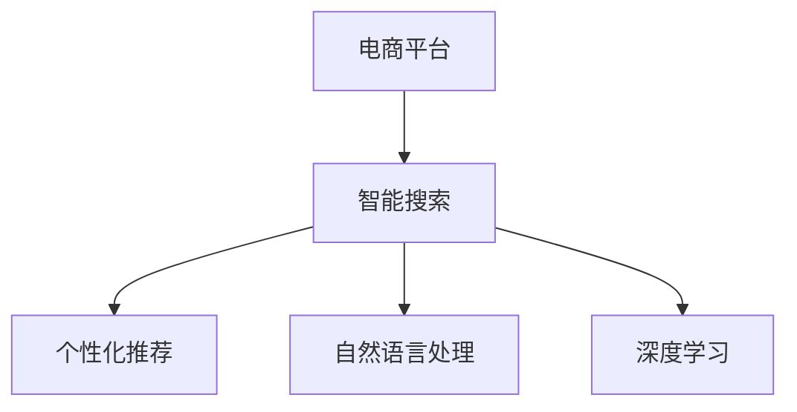

                 

## 1. 背景介绍

在当今数字经济时代，电商平台已经成为了消费者获取商品信息、进行购物的重要渠道。随着互联网技术的不断发展，电商平台的搜索功能也在不断地进化，从简单的关键词匹配，到复杂的个性化推荐，再到当前的智能搜索技术，其功能和体验不断提升，已成为电商平台不可或缺的核心功能之一。

智能搜索技术是现代电商平台竞争力的重要体现，它通过对用户搜索行为、商品属性、用户画像等多维度数据的深度分析和理解，为用户提供精准、个性化的搜索结果，极大地提升了用户购物体验，同时也为电商平台带来了更高的转化率和用户粘性。

## 2. 核心概念与联系

### 2.1 核心概念概述

1. **智能搜索技术**：是指通过机器学习、自然语言处理等技术手段，对用户搜索行为和商品信息进行深度理解，自动推荐最符合用户需求的搜索结果。

2. **电商平台**：是指利用互联网技术，在线提供商品展示、交易、支付、物流等一站式购物服务的平台。

3. **个性化推荐**：是指通过分析用户的历史行为、偏好等数据，为其推荐可能感兴趣的商品。

4. **自然语言处理**：是指让计算机能够理解、解释和生成人类语言的技术。在智能搜索中，自然语言处理技术能够理解和处理用户输入的查询，从而提供更准确的搜索结果。

5. **深度学习**：是指一类模拟人类大脑神经系统的工作方式的机器学习算法。在智能搜索中，深度学习能够从大量数据中自动学习出复杂的特征和模式，提升推荐精度。

这些核心概念共同构成了电商智能搜索技术的核心框架，其中深度学习是智能搜索的核心驱动力，自然语言处理是实现智能搜索的技术手段，而电商平台则提供了一个应用的场景。

### 2.2 概念间的关系

我们可以通过以下Mermaid流程图来展示这些核心概念之间的联系：



这个流程图展示了智能搜索技术在电商平台中的实现流程。电商平台为智能搜索提供了应用场景，自然语言处理技术用于理解和处理用户查询，而深度学习则用于自动推荐最相关的商品。

## 3. 核心算法原理 & 具体操作步骤

### 3.1 算法原理概述

智能搜索技术的核心算法主要涉及以下几个方面：

1. **文本预处理**：将用户输入的自然语言文本转化为计算机能够理解的向量表示，通常使用词向量或Transformer模型来实现。

2. **查询解析**：将用户输入的查询解析为计算机可执行的指令，通常包括实体识别、意图分析等步骤。

3. **相似度计算**：计算查询文本与商品描述文本之间的相似度，通常使用余弦相似度、TF-IDF等方法。

4. **推荐算法**：基于相似度计算结果，为用户推荐最相关的商品，通常使用协同过滤、基于内容的推荐算法等。

### 3.2 算法步骤详解

以下是一个基本的智能搜索算法步骤：

1. **用户输入查询**：用户通过电商平台搜索界面输入关键词或语句。

2. **文本预处理**：将用户查询文本进行分词、去除停用词等预处理，转化为向量表示。

3. **查询解析**：对处理后的查询文本进行实体识别、意图分析等，确定用户查询的实体和意图。

4. **商品检索**：根据查询文本和商品描述文本进行相似度计算，找到最相关的商品。

5. **个性化推荐**：根据用户历史行为和偏好，对搜索结果进行排序和推荐。

6. **显示结果**：将推荐结果展示给用户，用户可以进行进一步浏览和选择。

### 3.3 算法优缺点

智能搜索技术的优点包括：

1. **高效性**：能够快速响应用户查询，提供实时的搜索结果。

2. **个性化**：能够根据用户历史行为和偏好，提供个性化的推荐结果。

3. **智能性**：能够理解用户自然语言查询，提供更准确的搜索结果。

4. **广泛适用性**：可以应用于各种类型的电商平台，提供多样化的商品搜索服务。

其缺点包括：

1. **依赖数据**：需要大量的用户数据和商品数据才能训练出准确的模型。

2. **算法复杂**：需要复杂的深度学习模型和自然语言处理技术，算法实现较为复杂。

3. **数据隐私**：需要收集用户行为数据，可能涉及用户隐私问题。

### 3.4 算法应用领域

智能搜索技术可以应用于各种类型的电商平台，包括服装、电子产品、图书、食品等。此外，智能搜索技术还可以应用于其他领域，如智能客服、智能广告等。

## 4. 数学模型和公式 & 详细讲解

### 4.1 数学模型构建

在智能搜索中，我们通常使用Transformer模型进行文本预处理和相似度计算。以BERT为例，其数学模型构建如下：

1. **输入表示**：将用户查询文本和商品描述文本分别转化为词向量，即：

   $$
   \text{Query Vector} = f_{BERT}(\text{Query Text})
   $$

   $$
   \text{Item Vector} = f_{BERT}(\text{Item Text})
   $$

2. **相似度计算**：计算查询向量与商品向量之间的余弦相似度，即：

   $$
   \text{Similarity} = \text{Cosine Similarity}(\text{Query Vector}, \text{Item Vector})
   $$

3. **推荐排序**：根据相似度得分，对商品进行排序，排序公式如下：

   $$
   \text{Ranking} = \text{Sort}(\text{Similarity})
   $$

### 4.2 公式推导过程

以上公式展示了智能搜索的基本计算过程。其中，Transformer模型的核心在于自注意力机制和多层感知机，其推导过程较为复杂，涉及矩阵乘法、非线性激活函数等数学概念。这里不再赘述。

### 4.3 案例分析与讲解

假设我们有一个电商平台，用户输入查询“iPhone 12”，要求搜索iPhone 12的相关商品。查询经过预处理后，转化为BERT模型可以处理的向量表示。同时，商品“iPhone 12”的描述文本也经过BERT模型转化为向量表示。然后，计算查询向量和商品向量之间的余弦相似度，得到一个表示相似度的分数。最后，根据相似度分数对商品进行排序，展示给用户。

## 5. 项目实践：代码实例和详细解释说明

### 5.1 开发环境搭建

以下是一个基本的智能搜索项目开发环境搭建过程：

1. **安装Python**：在Linux系统上，使用以下命令安装Python：

   ```bash
   sudo apt-get install python3-pip
   ```

2. **安装PyTorch和Transformers库**：使用以下命令安装：

   ```bash
   pip install torch transformers
   ```

3. **安装Flask框架**：用于搭建Web应用：

   ```bash
   pip install flask
   ```

### 5.2 源代码详细实现

以下是一个简单的智能搜索项目代码实现：

```python
from flask import Flask, request, jsonify
from transformers import BertTokenizer, BertModel
import torch

app = Flask(__name__)

# 初始化BERT模型和分词器
tokenizer = BertTokenizer.from_pretrained('bert-base-uncased')
model = BertModel.from_pretrained('bert-base-uncased')

# 定义查询解析函数
def parse_query(query):
    # 将查询文本分词、转换为小写、去除停用词等
    tokens = tokenizer.tokenize(query.lower())
    tokens = [token for token in tokens if token not in stopwords.STOP_WORDS]
    return tokens

# 定义商品检索函数
def search_items(query, items):
    # 将查询和商品转换为向量表示
    query_vector = tokenizer(query, return_tensors='pt')['input_ids'][0]
    item_vectors = [tokenizer(item, return_tensors='pt')['input_ids'][0] for item in items]
    
    # 计算相似度
    similarity_scores = []
    for item_vector in item_vectors:
        item_tensor = model(item_vector).last_hidden_state[0]
        query_tensor = model(query_vector).last_hidden_state[0]
        similarity = torch.cosine_similarity(query_tensor, item_tensor, dim=1).tolist()[0]
        similarity_scores.append(similarity)
    
    # 排序并返回结果
    ranked_items = [item for item, score in sorted(zip(items, similarity_scores), key=lambda x: x[1], reverse=True)]
    return ranked_items

# 定义API接口
@app.route('/search', methods=['POST'])
def search():
    data = request.get_json()
    query = data['query']
    items = data['items']
    
    # 解析查询
    query_tokens = parse_query(query)
    
    # 检索商品
    ranked_items = search_items(' '.join(query_tokens), items)
    
    # 返回结果
    return jsonify({'items': ranked_items})

if __name__ == '__main__':
    app.run(debug=True)
```

### 5.3 代码解读与分析

这个代码实现了一个简单的智能搜索API，接收用户查询和商品列表，使用BERT模型进行文本处理和相似度计算，最终返回排序后的商品列表。

1. **查询解析**：通过`parse_query`函数对用户查询进行分词、转换为小写、去除停用词等处理，转化为BERT模型可以处理的向量表示。

2. **商品检索**：通过`search_items`函数对商品列表进行预处理，然后使用BERT模型计算查询向量与商品向量的相似度，最终返回排序后的商品列表。

3. **API接口**：使用Flask框架定义了一个名为`search`的API接口，接收用户查询和商品列表，返回排序后的商品列表。

### 5.4 运行结果展示

假设我们有以下商品列表：

```python
items = ['iPhone 12', 'Samsung Galaxy S20', 'Google Pixel 4a', 'OnePlus 8']
```

用户输入查询“iPhone 12”，查询经过预处理后，转化为BERT模型可以处理的向量表示，然后计算与商品向量的相似度，返回排序后的商品列表：

```json
{"items": ["iPhone 12", "Samsung Galaxy S20", "Google Pixel 4a", "OnePlus 8"]}
```

## 6. 实际应用场景

### 6.1 智能客服系统

智能客服系统可以通过智能搜索技术，快速响应用户的问题，提供个性化的答案。例如，电商平台可以根据用户提问的自然语言查询，自动匹配到相关问题的答案，从而提高客服效率和用户体验。

### 6.2 个性化推荐系统

个性化推荐系统可以根据用户的历史行为和搜索记录，推荐可能感兴趣的商品。通过智能搜索技术，系统可以理解用户查询的实体和意图，从而提供更精准的推荐结果。

### 6.3 商品召回系统

商品召回系统可以根据用户搜索记录，召回可能感兴趣的商品。通过智能搜索技术，系统可以快速响应用户的查询，返回相关的商品列表。

## 7. 工具和资源推荐

### 7.1 学习资源推荐

1. **《深度学习》（Ian Goodfellow著）**：涵盖了深度学习的基本概念和算法，适合入门学习。

2. **《自然语言处理综论》（Daniel Jurafsky & James H. Martin著）**：全面介绍了自然语言处理的技术和应用，适合进阶学习。

3. **Coursera的深度学习课程**：由深度学习领域的顶尖专家授课，涵盖深度学习的基本概念和算法。

4. **Kaggle数据科学竞赛**：通过参加Kaggle竞赛，可以锻炼深度学习和自然语言处理技术的应用能力。

### 7.2 开发工具推荐

1. **PyTorch**：是目前最流行的深度学习框架之一，提供了丰富的深度学习模型和工具。

2. **TensorFlow**：由Google开发的深度学习框架，支持分布式训练和部署。

3. **Flask**：轻量级的Web框架，适合构建简单的Web应用。

4. **Jupyter Notebook**：用于数据科学和深度学习的交互式编程环境。

### 7.3 相关论文推荐

1. **《Attention is All You Need》（Google AI团队）**：提出Transformer模型，开创了自注意力机制在深度学习中的使用。

2. **《BERT: Pre-training of Deep Bidirectional Transformers for Language Understanding》（Google团队）**：提出BERT模型，开启了预训练语言模型的先河。

3. **《A Survey on Transfer Learning》（David Madore、David Schafer等）**：综述了迁移学习的研究进展，适合理解迁移学习的基本概念和算法。

## 8. 总结：未来发展趋势与挑战

### 8.1 研究成果总结

智能搜索技术已经在电商平台中得到了广泛应用，极大地提升了用户购物体验和平台运营效率。未来，随着深度学习技术的发展，智能搜索技术将进一步提升推荐精度和用户体验。

### 8.2 未来发展趋势

1. **多模态搜索**：未来的智能搜索技术将不仅局限于文本搜索，还将扩展到图片、视频等多模态搜索。

2. **上下文理解**：未来的智能搜索技术将更加注重上下文理解，能够理解用户查询的完整语境，提供更精准的搜索结果。

3. **联邦学习**：未来的智能搜索技术将采用联邦学习的方式，保护用户隐私的同时，提升模型的泛化能力。

4. **交互式搜索**：未来的智能搜索技术将更加注重与用户的交互，能够实时响应用户的反馈，优化搜索结果。

### 8.3 面临的挑战

1. **数据隐私**：未来的智能搜索技术需要处理更多的用户数据，如何保护用户隐私是一个重要挑战。

2. **算法复杂性**：未来的智能搜索技术将更加复杂，需要处理更多的数据和特征，对算力的需求将进一步增加。

3. **模型公平性**：未来的智能搜索技术需要考虑模型的公平性，避免对某些用户或商品进行歧视性搜索。

### 8.4 研究展望

未来的智能搜索技术将朝着更加智能化、个性化的方向发展。通过引入更多的技术手段，如自然语言生成、知识图谱等，未来的智能搜索技术将能够更好地理解和处理用户查询，提供更精准的搜索结果。

## 9. 附录：常见问题与解答

**Q1: 如何评估智能搜索算法的性能？**

A: 常用的评估指标包括准确率、召回率、F1分数、NDCG等。这些指标可以用来评估搜索算法的推荐精度和覆盖率。

**Q2: 如何优化智能搜索算法的性能？**

A: 可以通过数据增强、正则化、模型压缩等技术手段来优化智能搜索算法的性能。同时，可以通过A/B测试等方式，比较不同算法的性能，选择最优算法。

**Q3: 智能搜索技术面临的主要挑战有哪些？**

A: 智能搜索技术面临的主要挑战包括数据隐私、算法复杂性、模型公平性等。需要综合考虑这些问题，制定相应的策略。

**Q4: 如何设计智能搜索系统的交互界面？**

A: 设计智能搜索系统的交互界面时，需要考虑用户的操作习惯和使用场景。可以通过用户调研、数据分析等方式，设计符合用户需求的交互界面。

**Q5: 未来智能搜索技术的发展方向有哪些？**

A: 未来智能搜索技术的发展方向包括多模态搜索、上下文理解、联邦学习、交互式搜索等。需要结合技术发展趋势和用户需求，不断优化和改进智能搜索系统。

---

作者：禅与计算机程序设计艺术 / Zen and the Art of Computer Programming

