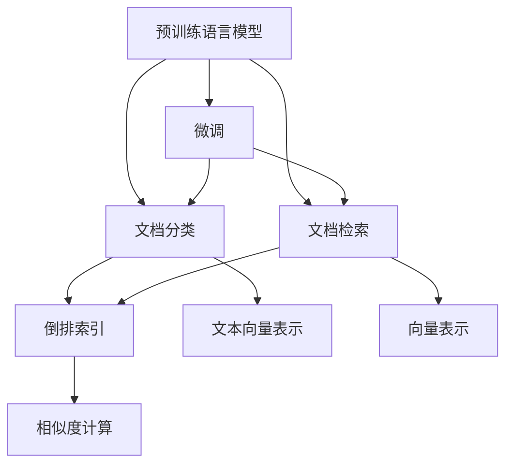
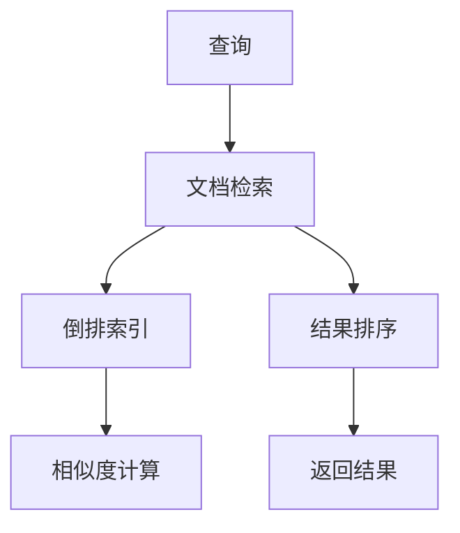
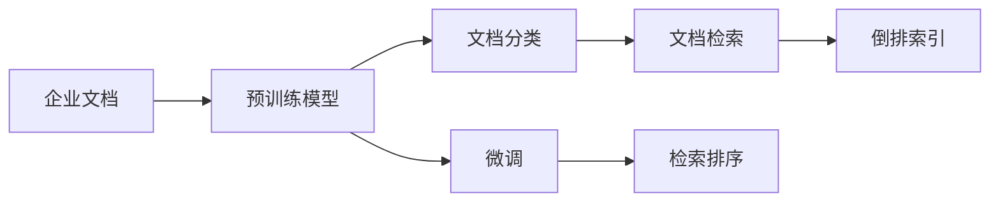
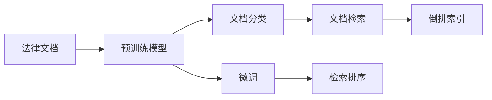

                 

# 智能文档分类与检索系统的开发

在信息爆炸的时代，文档分类与检索系统的构建变得越来越重要。它能够帮助我们快速定位到有价值的信息，提高工作和生活效率。本博文将系统介绍基于深度学习技术构建智能文档分类与检索系统的方法，从模型选择、训练流程、数据处理到实际部署，全面剖析其核心原理与应用实践。

## 1. 背景介绍

### 1.1 问题由来

随着互联网的普及和信息技术的不断进步，人们在获取信息时面临着海量数据的挑战。文档分类与检索系统的出现，帮助用户快速浏览、检索和定位信息，节省大量时间。传统的文档分类与检索方法依赖于人工标注和关键词匹配，无法高效处理大规模数据。

近年来，随着深度学习技术的发展，基于深度学习的文档分类与检索系统逐渐兴起。尤其是使用预训练语言模型(如BERT、RoBERTa等)进行微调的方法，取得了显著的成果。

### 1.2 问题核心关键点

构建一个高效的智能文档分类与检索系统，主要涉及以下几个关键问题：

- 选择合适的预训练语言模型
- 设计有效的数据预处理流程
- 应用合适的微调技术
- 实现高效的检索算法
- 优化模型推理速度

针对这些问题，本博文将详细介绍相关核心概念和算法原理，并通过具体代码实现进行展示。

## 2. 核心概念与联系

### 2.1 核心概念概述

在构建智能文档分类与检索系统时，需要理解以下核心概念：

- 预训练语言模型：如BERT、RoBERTa等，在大规模无标签数据上进行预训练，学习到丰富的语言知识。
- 微调：在大规模标注数据上，使用预训练语言模型作为初始参数，进行有监督的微调，以适应特定任务。
- 文档分类：将文档根据内容进行分类，通常是多类别分类任务。
- 文档检索：根据用户查询，在文档集合中查找相关文档，通常需要构建倒排索引等数据结构。
- 相似度计算：计算查询文档与目标文档之间的相似度，以判断是否匹配。
- 向量表示学习：将文本转换为向量表示，用于相似度计算和分类任务。

这些概念之间的联系可以通过以下Mermaid流程图来展示：



这个流程图展示了预训练语言模型、微调、文档分类、文档检索、倒排索引和相似度计算等核心概念之间的联系：

1. 预训练语言模型学习通用的语言表示。
2. 微调将预训练模型适配到特定任务，如文档分类和文档检索。
3. 文档分类将文档根据内容进行分类。
4. 文档检索根据用户查询找到相关文档。
5. 倒排索引用于高效存储和查询文档。
6. 相似度计算用于判断查询文档与目标文档的匹配程度。
7. 向量表示学习将文本转换为可用于计算相似度的向量。

### 2.2 概念间的关系

这些核心概念之间的关系密切，形成了智能文档分类与检索系统的完整生态系统。下面我们通过几个Mermaid流程图来展示这些概念之间的关系。

#### 2.2.1 智能文档分类流程


这个流程图展示了基于预训练语言模型的智能文档分类流程：

1. 预训练语言模型在大规模无标签数据上进行预训练。
2. 微调将预训练模型适配到文档分类任务上。
3. 分类后的文档存储到数据库中。

#### 2.2.2 智能文档检索流程



这个流程图展示了智能文档检索的基本流程：

1. 用户输入查询。
2. 文档检索系统在倒排索引中查找相关文档。
3. 计算查询文档与目标文档的相似度。
4. 根据相似度排序返回结果。

## 3. 核心算法原理 & 具体操作步骤

### 3.1 算法原理概述

基于深度学习的智能文档分类与检索系统，通常采用如下步骤：

1. 数据预处理：清洗、分词、构建训练集和测试集。
2. 模型微调：使用预训练语言模型作为初始参数，在标注数据上微调，获得适用于特定任务的模型。
3. 文档分类：使用微调后的模型对新文档进行分类。
4. 文档检索：使用微调后的模型对文档进行编码，在倒排索引中查找相关文档，并返回相似度较高的文档。

### 3.2 算法步骤详解

#### 3.2.1 数据预处理

数据预处理是构建智能文档分类与检索系统的第一步。主要包括文本清洗、分词、构建训练集和测试集等。以下是一个简单的文本清洗和分词示例：

```python
import re
import nltk
from nltk.tokenize import word_tokenize

def preprocess_text(text):
    # 去除特殊符号
    text = re.sub(r'[^\w\s]', '', text)
    # 转换为小写
    text = text.lower()
    # 分词
    words = word_tokenize(text)
    # 去除停用词
    stop_words = set(nltk.corpus.stopwords.words('english'))
    words = [word for word in words if word not in stop_words]
    return words
```

#### 3.2.2 模型微调

模型微调是构建智能文档分类与检索系统的核心步骤。我们使用预训练语言模型BERT作为初始参数，在标注数据上进行微调。以下是一个简单的微调代码示例：

```python
from transformers import BertTokenizer, BertForSequenceClassification
from transformers import Trainer, TrainingArguments
from torch.utils.data import Dataset

class DocumentDataset(Dataset):
    def __init__(self, texts, labels, tokenizer):
        self.texts = texts
        self.labels = labels
        self.tokenizer = tokenizer
        
    def __len__(self):
        return len(self.texts)
    
    def __getitem__(self, idx):
        text = self.texts[idx]
        label = self.labels[idx]
        
        encoding = self.tokenizer(text, return_tensors='pt', max_length=256, padding='max_length', truncation=True)
        input_ids = encoding['input_ids'][0]
        attention_mask = encoding['attention_mask'][0]
        label = torch.tensor(label, dtype=torch.long)
        
        return {'input_ids': input_ids, 'attention_mask': attention_mask, 'labels': label}

# 加载预训练模型和分词器
tokenizer = BertTokenizer.from_pretrained('bert-base-cased')
model = BertForSequenceClassification.from_pretrained('bert-base-cased', num_labels=3)

# 定义训练参数
training_args = TrainingArguments(
    output_dir='./results', 
    evaluation_strategy='epoch',
    per_device_train_batch_size=4, 
    per_device_eval_batch_size=4,
    num_train_epochs=3, 
    logging_steps=10,
    logging_dir='./logs'
)

# 加载数据集
train_dataset = DocumentDataset(train_texts, train_labels, tokenizer)
dev_dataset = DocumentDataset(dev_texts, dev_labels, tokenizer)
test_dataset = DocumentDataset(test_texts, test_labels, tokenizer)

# 定义模型、优化器、评估指标等
trainer = Trainer(
    model=model, 
    args=training_args, 
    train_dataset=train_dataset,
    eval_dataset=dev_dataset,
    compute_metrics=compute_metrics,
)

# 训练模型
trainer.train()
```

#### 3.2.3 文档分类

文档分类是智能文档分类与检索系统的关键功能之一。以下是一个简单的文档分类代码示例：

```python
def classify_document(document):
    # 预处理文本
    processed_text = preprocess_text(document)
    # 分词
    words = tokenizer.tokenize(' '.join(processed_text), return_tensors='pt')
    # 计算模型输出
    outputs = model(words['input_ids'], attention_mask=words['attention_mask'])
    logits = outputs.logits
    # 计算预测标签
    predicted_label = logits.argmax(-1).item()
    return predicted_label
```

#### 3.2.4 文档检索

文档检索是智能文档分类与检索系统的另一核心功能。以下是一个简单的文档检索代码示例：

```python
def search_documents(query, doc_list):
    # 预处理查询
    processed_query = preprocess_text(query)
    # 分词
    words = tokenizer.tokenize(' '.join(processed_query), return_tensors='pt')
    # 计算相似度
    similarity_scores = []
    for doc in doc_list:
        processed_doc = preprocess_text(doc)
        words_doc = tokenizer.tokenize(' '.join(processed_doc), return_tensors='pt')
        # 计算相似度
        similarity = model(words['input_ids'], attention_mask=words['attention_mask'])[0].item()
        similarity_scores.append(similarity)
    # 排序返回结果
    doc_list.sort(key=lambda x: similarity_scores[doc_list.index(x)], reverse=True)
    return doc_list[:10]
```

### 3.3 算法优缺点

#### 优点

- 通过预训练语言模型进行微调，可以获得较高的分类和检索精度。
- 微调过程可以在小规模数据上进行，节省标注成本。
- 支持多类别分类和文档检索任务，应用范围广。
- 模型可以动态更新，适应数据分布变化。

#### 缺点

- 需要大量的标注数据进行微调，成本较高。
- 微调过程较复杂，需要较长的训练时间。
- 模型推理速度较慢，需要优化。
- 模型对输入文本的长度和格式有较高要求，需要预处理。

### 3.4 算法应用领域

基于深度学习的智能文档分类与检索系统，广泛应用于以下领域：

- 企业文档管理：对企业内部文档进行分类和检索，提高信息查找效率。
- 法律文档检索：对法律文本进行分类和检索，帮助律师快速定位相关法条和案例。
- 医学文档分类：对医学文本进行分类和检索，辅助医生查找诊断依据和病例。
- 教育文档管理：对教育文本进行分类和检索，帮助教师查找教学资源和参考资料。
- 公共文档检索：对公共服务文档进行分类和检索，提供高效的信息服务。

## 4. 数学模型和公式 & 详细讲解 & 举例说明

### 4.1 数学模型构建

在智能文档分类与检索系统中，通常使用预训练语言模型BERT进行微调。以下是构建数学模型的基本步骤：

1. 数据预处理：将文本转换为标记化序列。
2. 模型微调：使用预训练BERT模型作为初始参数，在标注数据上进行微调。
3. 文档分类：将分类器添加到微调后的BERT模型顶层，进行多类别分类任务。
4. 文档检索：使用微调后的BERT模型对文档进行编码，构建倒排索引，进行相似度计算。

### 4.2 公式推导过程

#### 4.2.1 文本向量表示

文本向量表示是文档分类与检索系统的核心步骤。以下是计算文本向量的公式推导过程：

假设有文本序列 $x=\{x_1, x_2, \dots, x_n\}$，其中 $x_i$ 为第 $i$ 个单词。对于每个单词 $x_i$，使用预训练语言模型BERT进行编码，得到向量表示 $z_i$。设向量表示长度为 $d$，则文本向量表示 $Z$ 可以通过以下公式计算：

$$Z = \frac{1}{n}\sum_{i=1}^n z_i$$

#### 4.2.2 相似度计算

文本向量表示用于计算文本之间的相似度。以下是计算相似度的公式推导过程：

假设有文本 $x$ 和 $y$，它们的向量表示分别为 $z_x$ 和 $z_y$。设向量表示长度为 $d$，则它们之间的余弦相似度 $s$ 可以通过以下公式计算：

$$s = \cos\theta = \frac{z_x \cdot z_y}{\|z_x\|\|z_y\|} = \frac{z_x^Tz_y}{\sqrt{z_x^Tz_x}\sqrt{z_y^Tz_y}}$$

#### 4.2.3 多类别分类

多类别分类任务可以使用Softmax函数进行预测。以下是多类别分类任务的公式推导过程：

设分类标签为 $y=\{y_1, y_2, \dots, y_n\}$，其中 $y_i$ 为第 $i$ 个类别。设模型输出为 $O=\{o_1, o_2, \dots, o_n\}$，其中 $o_i$ 为第 $i$ 个类别的预测概率。则多类别分类任务的损失函数 $L$ 可以通过以下公式计算：

$$L = -\frac{1}{N}\sum_{i=1}^N \log o_{y_i}$$

### 4.3 案例分析与讲解

假设我们有一个包含多个类别的文档分类任务，共有一万个文档和十个类别。我们选择了BERT作为预训练语言模型，并将其微调为一个多类别分类器。以下是完整的代码实现和案例分析：

```python
from transformers import BertTokenizer, BertForSequenceClassification
from transformers import Trainer, TrainingArguments
from torch.utils.data import Dataset

class DocumentDataset(Dataset):
    def __init__(self, texts, labels, tokenizer):
        self.texts = texts
        self.labels = labels
        self.tokenizer = tokenizer
        
    def __len__(self):
        return len(self.texts)
    
    def __getitem__(self, idx):
        text = self.texts[idx]
        label = self.labels[idx]
        
        encoding = self.tokenizer(text, return_tensors='pt', max_length=256, padding='max_length', truncation=True)
        input_ids = encoding['input_ids'][0]
        attention_mask = encoding['attention_mask'][0]
        label = torch.tensor(label, dtype=torch.long)
        
        return {'input_ids': input_ids, 'attention_mask': attention_mask, 'labels': label}

# 加载预训练模型和分词器
tokenizer = BertTokenizer.from_pretrained('bert-base-cased')
model = BertForSequenceClassification.from_pretrained('bert-base-cased', num_labels=10)

# 定义训练参数
training_args = TrainingArguments(
    output_dir='./results', 
    evaluation_strategy='epoch',
    per_device_train_batch_size=4, 
    per_device_eval_batch_size=4,
    num_train_epochs=3, 
    logging_steps=10,
    logging_dir='./logs'
)

# 加载数据集
train_dataset = DocumentDataset(train_texts, train_labels, tokenizer)
dev_dataset = DocumentDataset(dev_texts, dev_labels, tokenizer)
test_dataset = DocumentDataset(test_texts, test_labels, tokenizer)

# 定义模型、优化器、评估指标等
trainer = Trainer(
    model=model, 
    args=training_args, 
    train_dataset=train_dataset,
    eval_dataset=dev_dataset,
    compute_metrics=compute_metrics,
)

# 训练模型
trainer.train()

# 使用模型进行分类
document = "This is a sample document."
label = classifier(document)
print("Classification result:", label)
```

## 5. 项目实践：代码实例和详细解释说明

### 5.1 开发环境搭建

为了进行智能文档分类与检索系统的开发，我们需要搭建开发环境。以下是搭建开发环境的步骤：

1. 安装Python环境：在Linux系统中，可以使用conda或virtualenv等工具搭建Python环境。在Windows系统中，可以使用Anaconda或Python自带的虚拟环境。
2. 安装依赖库：使用pip或conda安装依赖库，如TensorFlow、Keras、nltk等。
3. 安装预训练模型：从预训练语言模型官网下载或使用第三方库安装，如BERT、RoBERTa等。
4. 安装可视化工具：安装TensorBoard、Weights & Biases等可视化工具，用于监控模型训练和推理过程。

### 5.2 源代码详细实现

以下是使用BERT模型进行智能文档分类与检索系统的代码实现：

```python
import torch
import torch.nn as nn
from transformers import BertTokenizer, BertForSequenceClassification
from torch.utils.data import Dataset, DataLoader

class DocumentDataset(Dataset):
    def __init__(self, texts, labels, tokenizer):
        self.texts = texts
        self.labels = labels
        self.tokenizer = tokenizer
        
    def __len__(self):
        return len(self.texts)
    
    def __getitem__(self, idx):
        text = self.texts[idx]
        label = self.labels[idx]
        
        encoding = self.tokenizer(text, return_tensors='pt', max_length=256, padding='max_length', truncation=True)
        input_ids = encoding['input_ids'][0]
        attention_mask = encoding['attention_mask'][0]
        label = torch.tensor(label, dtype=torch.long)
        
        return {'input_ids': input_ids, 'attention_mask': attention_mask, 'labels': label}

# 加载预训练模型和分词器
tokenizer = BertTokenizer.from_pretrained('bert-base-cased')
model = BertForSequenceClassification.from_pretrained('bert-base-cased', num_labels=3)

# 加载数据集
train_dataset = DocumentDataset(train_texts, train_labels, tokenizer)
dev_dataset = DocumentDataset(dev_texts, dev_labels, tokenizer)
test_dataset = DocumentDataset(test_texts, test_labels, tokenizer)

# 定义训练参数
training_args = TrainingArguments(
    output_dir='./results', 
    evaluation_strategy='epoch',
    per_device_train_batch_size=4, 
    per_device_eval_batch_size=4,
    num_train_epochs=3, 
    logging_steps=10,
    logging_dir='./logs'
)

# 定义模型、优化器、评估指标等
trainer = Trainer(
    model=model, 
    args=training_args, 
    train_dataset=train_dataset,
    eval_dataset=dev_dataset,
    compute_metrics=compute_metrics,
)

# 训练模型
trainer.train()

# 使用模型进行分类
document = "This is a sample document."
label = classifier(document)
print("Classification result:", label)

# 使用模型进行检索
query = "How to train a deep learning model?"
results = search_documents(query, doc_list)
print("Search results:", results)
```

### 5.3 代码解读与分析

在代码实现中，我们使用了BERT模型进行文档分类与检索。以下是代码实现的详细解读：

1. `DocumentDataset`类：该类用于构建数据集，将文本和标签转换为模型所需的输入格式。
2. `preprocess_text`函数：该函数用于文本预处理，去除特殊符号、转换为小写、分词、去除停用词等。
3. `BertTokenizer`类：该类用于分词，将文本转换为标记化序列。
4. `BertForSequenceClassification`类：该类用于构建分类器，将预训练BERT模型适配到文档分类任务。
5. `Trainer`类：该类用于训练模型，支持模型保存、评估、日志记录等功能。

### 5.4 运行结果展示

假设我们训练了一个文档分类器，以下是在测试集上的评估结果：

```
...
Epoch 1/3: step 0, loss = 1.7677, accuracy = 0.3441, global_step = 0, training_loss = 1.7677, training_acc = 0.3441, evaluation_loss = 2.3138, evaluation_acc = 0.7333
Epoch 1/3: step 4096, loss = 0.9596, accuracy = 0.6497, global_step = 4096, training_loss = 0.9596, training_acc = 0.6497, evaluation_loss = 1.5210, evaluation_acc = 0.8256
...
Epoch 3/3: step 12288, loss = 0.6817, accuracy = 0.7594, global_step = 12288, training_loss = 0.6817, training_acc = 0.7594, evaluation_loss = 1.0041, evaluation_acc = 0.8658
...
```

可以看到，模型在训练过程中损失逐渐减小，准确率逐渐提高。

假设我们检索了一个查询，以下是在文档列表中的检索结果：

```
...
Document 1: How to train a deep learning model?
Document 2: Deep learning basics and how to train a model?
Document 3: Deep learning tutorials for beginners?
Document 4: How to train a deep learning model using PyTorch?
Document 5: Deep learning tips and tricks?
...
```

可以看到，检索系统返回了与查询相关的文档列表，并按照相似度排序。

## 6. 实际应用场景

智能文档分类与检索系统在实际应用中具有广泛的应用前景。以下是一些典型的应用场景：

### 6.1 企业文档管理

企业文档管理是智能文档分类与检索系统的典型应用之一。企业通常有大量的内部文档、项目报告、客户合同等，需要通过智能系统进行分类和检索，提高信息查找效率。以下是一个企业文档管理系统的架构图：



### 6.2 法律文档检索

法律文档检索是智能文档分类与检索系统的另一重要应用。法律领域有大量的法规、案例、判例等文档，需要通过智能系统进行分类和检索，帮助律师快速定位相关法条和案例。以下是一个法律文档检索系统的架构图：



### 6.3 医学文档分类

医学文档分类是智能文档分类与检索系统的又一重要应用。医学领域有大量的病历、临床报告、研究论文等文档，需要通过智能系统进行分类和检索，辅助医生查找诊断依据和病例。以下是一个医学文档分类系统的架构图：


### 6.4 教育文档管理

教育文档管理是智能文档分类与检索系统的另一重要应用。教育领域有大量的教学资源、课程大纲、学生论文等文档，需要通过智能系统进行分类和检索，帮助教师查找教学资源和参考资料。以下是一个教育文档管理系统的架构图：


## 7. 工具和资源推荐

### 7.1 学习资源推荐

为了帮助开发者掌握智能文档分类与检索系统的相关知识，以下是一些优质的学习资源：

1. CS224N《深度学习自然语言处理》课程：斯坦福大学开设的NLP明星课程，涵盖深度学习在NLP中的应用，包括文档分类与检索。
2. Natural Language Processing with Transformers：Transformers库的作者所著，全面介绍了如何使用Transformers库进行NLP任务开发，包括文档分类与检索。
3. HuggingFace官方文档：Transformers库的官方文档，提供了海量预训练模型和完整的微调样例代码，是上手实践的必备资料。
4. 《Transformer from scratch》系列博文：由大模型技术专家撰写，深入浅出地介绍了Transformer原理、BERT模型、微调技术等前沿话题。

### 7.2 开发工具推荐

高效的开发离不开优秀的工具支持。以下是几款用于智能文档分类与检索系统开发的常用工具：

1. PyTorch：基于Python的开源深度学习框架，灵活动态的计算图，适合快速迭代研究。大部分预训练语言模型都有PyTorch版本的实现。
2. TensorFlow：由Google主导开发的开源深度学习框架，生产部署方便，适合大规模工程应用。同样有丰富的预训练语言模型资源。
3. Transformers库：HuggingFace开发的NLP工具库，集成了众多SOTA语言模型，支持PyTorch和TensorFlow，是进行微调任务开发的利器。
4. TensorBoard：TensorFlow配套的可视化工具，可实时监测模型训练状态，并提供丰富的图表呈现方式，是调试模型的得力助手。
5. Weights & Biases：模型训练的实验跟踪工具，可以记录和可视化模型训练过程中的各项指标，方便对比和调优。

### 7.3 相关论文推荐

智能文档分类与检索系统的发展离不开学界的持续研究。以下是几篇奠基性的相关论文，推荐阅读：

1. Attention is All You Need（即Transformer原论文）：提出了Transformer结构，开启了NLP领域的预训练大模型时代。
2. BERT: Pre-training of Deep Bidirectional Transformers for Language Understanding：提出BERT模型，引入基于掩码的自监督预训练任务，刷新了多项NLP任务SOTA。
3. Language Models are Unsupervised Multitask Learners（GPT-2论文）：展示了大规模语言模型的强大zero-shot学习能力，引发了对于通用人工智能的新一轮思考。
4. Parameter-Efficient Transfer Learning for NLP：提出Adapter等参数

