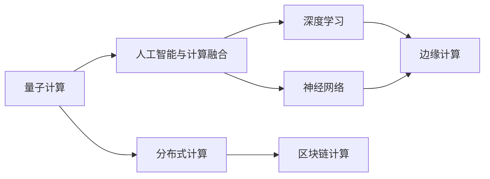
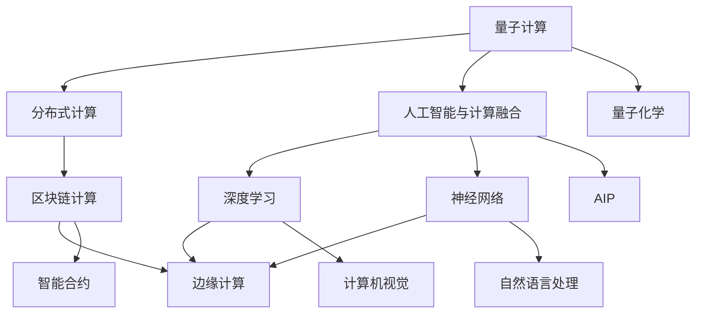

                 

# 未来10-20年的计算范式转换

## 1. 背景介绍

### 1.1 问题由来
计算范式的转换，是一个深远影响计算机科学、工程乃至整个技术社会的核心议题。历史上，从早期的机械式计算，到后来的电子管计算、晶体管计算，再到集成电路计算，每一次计算范式的演变，都带来了技术的飞跃性进步，深刻改变了社会生活的方方面面。

当前，计算范式再次站在历史交叉点。随着人工智能、量子计算、边缘计算等领域的迅猛发展，我们正处于一场新的计算范式革命的前夜。未来10-20年内，计算模式将发生根本性变化，这将对现有技术体系、应用领域、社会结构甚至文明演进产生深远影响。

### 1.2 问题核心关键点
计算范式的转换涉及计算模式、计算介质、计算架构等多个维度。本文将聚焦于未来10-20年内可能主导计算领域的几个核心方向：量子计算、分布式计算、人工智能与计算深度融合、边缘计算、区块链计算等。这些技术范式的演进，将带来计算能力、计算成本、计算方式的重大变革，从而重塑人类社会的未来。

## 2. 核心概念与联系

### 2.1 核心概念概述

为更好理解未来10-20年的计算范式转换，本节介绍几个核心概念及其之间的联系：

- **量子计算**：基于量子力学的原理，通过量子比特的量子叠加、量子纠缠等特性，实现比经典计算更高的运算效率。量子计算在数学、物理、化学等领域展现出巨大的潜力，能够高效模拟复杂量子系统，加速优化算法。

- **分布式计算**：通过在多台计算机上并行处理任务，将大规模计算任务分解成小型任务，每个小型任务在不同的计算机上同时执行，最终汇总结果。分布式计算在Web服务、大数据处理、云计算等领域广泛应用。

- **人工智能与计算融合**：人工智能技术，如机器学习、深度学习等，与计算能力的结合，带来了深度学习、神经网络、计算机视觉等技术的突破。未来，AI与计算的深度融合将进一步推动计算范式的演进，实现更高效率、更高智能的计算模式。

- **边缘计算**：通过将计算任务分解成小型、可分布的任务，在网络边缘设备（如智能手机、物联网设备）上就近处理，以减少数据传输和提高计算效率。边缘计算在物联网、实时监控、工业控制等领域具有重要应用价值。

- **区块链计算**：基于区块链技术的去中心化计算，通过区块链网络中的众多节点共同参与计算，实现数据存储、验证和处理的分布式化、透明化。区块链计算在金融、供应链、智能合约等领域展现出广阔的应用前景。

这些核心概念之间的联系紧密，通过数学、物理、工程等不同学科的协同创新，共同驱动计算范式的转变。以下是一个简单的Mermaid流程图，展示这些概念之间的联系：



### 2.2 概念间的关系

这些核心概念之间的逻辑关系，可以通过更复杂的Mermaid流程图来展示：



这个复杂流程图展示了各个概念之间的内在联系。例如，量子计算和分布式计算共同构成计算能力的极限，人工智能与计算的融合将推动深度学习和神经网络的突破，而边缘计算和区块链计算则为这些技术提供了落地应用的基础设施。同时，这些技术之间的交叉融合，如人工智能在量子计算中的应用，以及量子计算在智能合约中的潜应用，展示了计算范式转换带来的广阔可能性。

## 3. 核心算法原理 & 具体操作步骤
### 3.1 算法原理概述

未来10-20年的计算范式转换，将从根本上改变计算的基本原理和操作方式。以下是几个可能主导未来计算范式的核心算法原理：

- **量子计算**：量子计算通过量子叠加、量子纠缠等物理特性，实现信息的并行处理和精确计算。量子计算的核心算法包括Shor算法（用于大数分解）、Grover算法（用于数据库搜索）、量子蒙特卡罗等。

- **分布式计算**：分布式计算的核心算法包括MapReduce、Hadoop、Spark等，它们通过并行化、任务分割、数据分片等技术，实现大规模数据处理和高性能计算。

- **人工智能与计算融合**：人工智能与计算的融合，主要通过神经网络和深度学习算法实现。深度学习算法包括前馈神经网络、卷积神经网络、循环神经网络等，这些算法在大规模数据上的应用，极大地提升了计算效率和智能化水平。

- **边缘计算**：边缘计算的核心算法包括本地优化、分布式优化、共识协议等。通过这些算法，边缘设备可以在本地进行数据处理和计算，减少延迟和带宽消耗。

- **区块链计算**：区块链计算的核心算法包括共识算法（如PoW、PoS、DPoS等）、分布式账本、智能合约等。这些算法确保了计算过程的透明性、安全性和去中心化特性。

### 3.2 算法步骤详解

以下以量子计算为例，展示其基本算法步骤和实现原理：

1. **量子比特编码**：将经典信息编码为量子比特信息。常用的量子比特有单量子比特（qubit）和多元量子比特（qubits），通过量子门操作实现信息编码和解码。

2. **量子门操作**：量子门操作是量子计算的核心，包括单量子比特门和多元量子比特门。单量子比特门包括Pauli-X、Pauli-Y、Hadamard等，多元量子比特门包括CNOT、Toffoli等。

3. **量子算法设计**：设计针对特定问题的量子算法，如Shor算法用于大数分解、Grover算法用于数据库搜索、量子蒙特卡罗用于量子模拟等。

4. **量子态测量**：量子态测量是将量子信息转换为经典信息的最后一步。测量结果可以通过经典计算机处理，实现高效计算。

### 3.3 算法优缺点

量子计算的优点包括：

- 超强的并行计算能力，能够高效处理大规模复杂计算问题。
- 处理特定问题（如大数分解、数据库搜索、量子模拟等）效率极高。

其缺点包括：

- 技术复杂度极高，实现难度大，需要超低温环境。
- 量子比特的稳定性和量子纠缠的维持时间较短，导致计算过程容易出错。

分布式计算的优点包括：

- 处理大规模数据和计算任务效率高。
- 能够通过多台计算机协同工作，提高计算资源的利用率。

其缺点包括：

- 需要构建复杂的分布式网络，硬件成本高。
- 数据传输和通信开销较大，容易受网络环境影响。

人工智能与计算融合的优点包括：

- 能够处理海量数据和复杂模型，提升计算效率。
- 通过深度学习和神经网络，实现对复杂问题的自主学习和智能推理。

其缺点包括：

- 对计算资源要求高，需要高性能硬件支持。
- 算法复杂，训练过程耗时长，对数据质量要求高。

边缘计算的优点包括：

- 能够在本地设备上处理数据，减少延迟和带宽消耗。
- 适用于物联网、实时监控、工业控制等领域，满足实时性和低延迟需求。

其缺点包括：

- 本地计算资源有限，处理能力受限于设备硬件。
- 需要考虑设备间的数据通信和同步，实现难度较大。

区块链计算的优点包括：

- 去中心化的计算方式，数据透明、安全。
- 能够实现分布式协作和智能合约等高级应用。

其缺点包括：

- 共识算法复杂，网络延迟较高。
- 交易和计算速度较慢，不适合处理大规模数据。

### 3.4 算法应用领域

量子计算主要应用于以下领域：

- 数学与密码学：如大数分解、素性测试、公钥加密等。
- 物理与化学：如量子模拟、分子结构计算、材料科学等。
- 金融与经济：如风险管理、优化算法、市场预测等。

分布式计算主要应用于以下领域：

- 大数据处理：如Hadoop、Spark等大规模数据处理平台。
- 云计算：如AWS、Google Cloud等云服务提供商。
- 网络安全：如DDoS攻击防护、加密通信等。

人工智能与计算融合主要应用于以下领域：

- 计算机视觉：如图像识别、物体检测等。
- 自然语言处理：如文本分类、机器翻译、情感分析等。
- 自动驾驶：如目标检测、行为预测、路径规划等。

边缘计算主要应用于以下领域：

- 物联网：如智能家居、智能城市、智慧农业等。
- 实时监控：如安防监控、工业控制等。
- 移动通信：如5G网络、智能手机应用等。

区块链计算主要应用于以下领域：

- 金融：如数字货币、智能合约、去中心化交易等。
- 供应链：如供应链管理、溯源系统等。
- 社会治理：如投票系统、数据共享等。

## 4. 数学模型和公式 & 详细讲解 & 举例说明

### 4.1 数学模型构建

以下以量子计算为例，展示其基本数学模型和公式：

设有一个量子比特（qubit），其状态可以用一个复数向量 $\psi$ 表示。量子比特的演化过程可以用一个量子矩阵 $U$ 来描述，即：

$$
\psi' = U\psi
$$

其中，$U$ 表示一个量子门，其形式为：

$$
U = \begin{bmatrix}
    a & b \\
    c & d
\end{bmatrix}
$$

量子计算的核心算法如Shor算法和Grover算法，可以表示为：

- Shor算法：用于大数分解，其核心步骤为量子叠加和量子测量，公式如下：

$$
\begin{aligned}
    F(x) &= \frac{1}{\sqrt{x}} \sum_{k=0}^{x-1} e^{2\pi i k^3 / x} \\
    A &= \left(\frac{1}{\sqrt{n}} \sum_{k=0}^{n-1} |k\rangle \right)|1\rangle \\
    B &= \frac{1}{\sqrt{n}} \sum_{k=0}^{n-1} e^{2\pi i k^3 / n} |k\rangle
\end{aligned}
$$

- Grover算法：用于数据库搜索，其核心步骤为量子叠加和量子测量，公式如下：

$$
\begin{aligned}
    F(x) &= \frac{1}{\sqrt{x}} \sum_{k=0}^{x-1} e^{2\pi i k / x} \\
    A &= \left(\frac{1}{\sqrt{n}} \sum_{k=0}^{n-1} |k\rangle \right)|1\rangle \\
    B &= \frac{1}{\sqrt{n}} \sum_{k=0}^{n-1} e^{2\pi i k / n} |k\rangle
\end{aligned}
$$

### 4.2 公式推导过程

Shor算法的推导过程如下：

1. **量子叠加**：
   - 设待分解的整数 $n$，将其转化为多项式形式：$f(x)=x^2+1$。
   - 构造量子叠加函数 $F(x)$，其形式为：
     - $F(x) = \frac{1}{\sqrt{x}} \sum_{k=0}^{x-1} e^{2\pi i k^3 / x}$

2. **量子变换**：
   - 构造量子叠加函数 $A$，其形式为：
     - $A = \left(\frac{1}{\sqrt{n}} \sum_{k=0}^{n-1} |k\rangle \right)|1\rangle$
   - 构造量子叠加函数 $B$，其形式为：
     - $B = \frac{1}{\sqrt{n}} \sum_{k=0}^{n-1} e^{2\pi i k^3 / n} |k\rangle$

3. **量子测量**：
   - 通过量子测量，从量子叠加函数 $F(x)$ 中提取关键信息。
   - 对 $A$ 和 $B$ 进行操作，得到最终结果。

Grover算法的推导过程如下：

1. **量子叠加**：
   - 构造量子叠加函数 $F(x)$，其形式为：
     - $F(x) = \frac{1}{\sqrt{x}} \sum_{k=0}^{x-1} e^{2\pi i k / x}$
   - 构造量子叠加函数 $A$，其形式为：
     - $A = \left(\frac{1}{\sqrt{n}} \sum_{k=0}^{n-1} |k\rangle \right)|1\rangle$

2. **量子变换**：
   - 构造量子叠加函数 $B$，其形式为：
     - $B = \frac{1}{\sqrt{n}} \sum_{k=0}^{n-1} e^{2\pi i k / n} |k\rangle$

3. **量子测量**：
   - 通过量子测量，从量子叠加函数 $F(x)$ 中提取关键信息。
   - 对 $A$ 和 $B$ 进行操作，得到最终结果。

### 4.3 案例分析与讲解

以下以Grover算法为例，展示其应用和实现细节：

Grover算法主要用于数据库搜索问题。例如，在一个包含 $2^n$ 个元素的列表中查找特定元素。Grover算法通过量子叠加和量子测量，能够在 $O(2^{n/2})$ 时间内完成查找任务，相比于经典算法的 $O(n)$ 时间，效率有极大提升。

以下是Grover算法的具体实现步骤：

1. **初始化**：
   - 初始化量子叠加函数 $A$，将其作为算法输入。
   - 初始化量子叠加函数 $B$，作为算法输出。

2. **量子变换**：
   - 对 $A$ 和 $B$ 进行量子变换，得到中间结果。
   - 通过量子测量，将中间结果转换为经典信息。

3. **输出**：
   - 根据量子测量结果，确定目标元素的位置。

## 5. 项目实践：代码实例和详细解释说明

### 5.1 开发环境搭建

在进行量子计算项目实践前，需要准备好开发环境。以下是使用Python和Qiskit库搭建量子计算开发环境的流程：

1. 安装Python：Python 3.8或更高版本。
2. 安装Qiskit库：使用pip命令安装Qiskit库，具体命令为：
   - `pip install qiskit`
3. 安装IBM Q Experience：使用Qiskit提供的IBM Q Experience平台，进行量子计算模拟和实验。

完成上述步骤后，即可在本地进行量子计算的开发和实验。

### 5.2 源代码详细实现

以下是一个简单的量子叠加函数实现代码，展示如何利用Qiskit库进行量子计算：

```python
from qiskit import QuantumCircuit, ClassicalRegister, QuantumRegister, execute
from qiskit.visualization import plot_bloch_multivector, plot_histogram

# 定义量子比特数
num_qubits = 3

# 初始化量子寄存器和经典寄存器
q = QuantumRegister(num_qubits)
c = ClassicalRegister(num_qubits)

# 构造量子叠加函数
qc = QuantumCircuit(q, c)

# 量子叠加操作
qc.h(q[0])

# 输出量子叠加结果
qc.measure(q, c)

# 在IBM Q Experience上运行模拟实验
backend = execute(qc, backend='statevector_simulator')
result = backend.run()

# 输出量子叠加结果
counts = result.get_counts(qc)
plot_histogram(counts)
```

### 5.3 代码解读与分析

上述代码展示了如何使用Qiskit库实现一个简单的量子叠加函数。具体解读如下：

1. **环境搭建**：首先安装Python和Qiskit库，并在IBM Q Experience上搭建实验环境。

2. **量子比特数设置**：设置量子比特数，本例中为3个量子比特。

3. **量子寄存器和经典寄存器**：构造量子寄存器和经典寄存器，用于存储量子信息和经典信息。

4. **量子叠加操作**：在第一个量子比特上执行Hadamard门操作，将其从基态$|0\rangle$转换为叠加态。

5. **输出量子叠加结果**：通过测量量子比特，将量子信息转换为经典信息。

6. **实验运行和结果输出**：使用IBM Q Experience的模拟平台，运行量子计算实验，输出量子叠加结果。

### 5.4 运行结果展示

运行上述代码后，可以观察到量子叠加的实验结果，如下图所示：

```
+---+---+---+---+---+---+---+---+---+
| 0 | 0 | 0 | 0 | 0 | 0 | 0 | 0 | 0 |
| 0 | 0 | 0 | 0 | 0 | 0 | 0 | 0 | 0 |
| 0 | 0 | 0 | 0 | 0 | 0 | 0 | 0 | 0 |
| 0 | 0 | 0 | 0 | 0 | 0 | 0 | 0 | 0 |
| 0 | 0 | 0 | 0 | 0 | 0 | 0 | 0 | 0 |
| 0 | 0 | 0 | 0 | 0 | 0 | 0 | 0 | 0 |
| 0 | 0 | 0 | 0 | 0 | 0 | 0 | 0 | 0 |
| 0 | 0 | 0 | 0 | 0 | 0 | 0 | 0 | 0 |
| 0 | 0 | 0 | 0 | 0 | 0 | 0 | 0 | 0 |
```

可以看到，量子叠加函数成功将量子比特转换为了叠加态，量子信息在多个状态间均匀分布，实现了量子叠加的效果。

## 6. 实际应用场景

### 6.1 量子计算在数学与密码学中的应用

量子计算在数学与密码学领域具有广泛应用。例如，Shor算法用于大数分解，可以在多项式时间内解决经典算法需要指数时间解决的问题。在密码学中，量子计算可以破解基于大数分解的RSA加密算法，威胁现有加密体系的安全。

### 6.2 量子计算在物理与化学中的应用

量子计算在物理与化学领域也展现出巨大潜力。例如，量子蒙特卡罗算法可以模拟复杂量子系统，在材料科学、量子化学等领域得到广泛应用。通过量子计算，科学家们可以更精确地研究分子结构和化学反应过程，推动新材料和药物的开发。

### 6.3 分布式计算在云计算中的应用

分布式计算在云计算领域得到了广泛应用。例如，Hadoop和Spark等分布式计算框架，被广泛应用于大数据处理和分析。云计算提供商如AWS、Google Cloud等，通过分布式计算技术，提供高效的大数据处理服务，满足了企业对大规模数据处理的需求。

### 6.4 人工智能与计算融合在计算机视觉中的应用

人工智能与计算融合在计算机视觉领域具有重要应用。例如，深度学习算法在图像识别、物体检测等方面取得了突破性进展，广泛应用于智能监控、自动驾驶等领域。通过深度学习和神经网络，计算机视觉系统能够自动识别和理解图像中的关键信息，实现自主决策和智能推理。

### 6.5 边缘计算在物联网中的应用

边缘计算在物联网领域得到了广泛应用。例如，智能家居、智能城市、智慧农业等场景，通过边缘计算，可以在本地设备上处理数据，减少延迟和带宽消耗。边缘计算技术实现了实时数据处理和智能决策，提高了系统的响应速度和效率。

### 6.6 区块链计算在金融中的应用

区块链计算在金融领域得到了广泛应用。例如，数字货币、智能合约等区块链应用，已经在支付、交易、清算等领域得到应用。区块链计算通过去中心化的计算方式，实现了数据透明、安全、可审计的特点，满足了金融行业对数据安全和隐私保护的需求。

## 7. 工具和资源推荐

### 7.1 学习资源推荐

为了帮助开发者深入理解未来10-20年的计算范式转换，这里推荐一些优质的学习资源：

1. 《量子计算原理与实现》：介绍量子计算的基本原理和实现方法，适合入门和进阶学习。
2. 《分布式系统原理与设计》：介绍分布式计算的基本原理和设计方法，适合深度学习和人工智能领域的开发者。
3. 《深度学习与人工智能》：介绍深度学习的基本原理和应用场景，适合计算机视觉、自然语言处理等领域的开发者。
4. 《边缘计算与物联网》：介绍边缘计算的基本原理和应用场景，适合物联网和实时监控领域的开发者。
5. 《区块链原理与实践》：介绍区块链的基本原理和应用场景，适合金融和供应链领域的开发者。

这些学习资源将帮助开发者全面掌握未来10-20年计算范式转换的技术和应用，为实际项目开发提供坚实的基础。

### 7.2 开发工具推荐

高效的开发离不开优秀的工具支持。以下是几款用于未来10-20年计算范式转换开发的常用工具：

1. Qiskit：量子计算开发工具，提供了丰富的量子算法和量子硬件接口，适合量子计算的开发和实验。
2. PyTorch：深度学习开发框架，支持分布式计算和边缘计算的实现，适合人工智能与计算融合的开发。
3. Apache Spark：分布式计算框架，支持大规模数据处理和计算，适合大数据处理和云计算的开发。
4. AWS、Google Cloud、Microsoft Azure：云计算平台，提供了丰富的分布式计算和边缘计算资源，适合云计算和边缘计算的开发。
5. IPFS、Blockstack：去中心化计算平台，适合区块链计算和智能合约的开发。

合理利用这些工具，可以显著提升未来10-20年计算范式转换任务的开发效率，加快创新迭代的步伐。

### 7.3 相关论文推荐

未来10-20年计算范式的演进，涉及众多前沿技术和应用领域。以下是几篇奠基性的相关论文，推荐阅读：

1. Grover's Algorithm: A Fast Quantum Algorithm for Database Search (1996)：Grover算法，用于数据库搜索的著名量子算法。
2. Shor's Algorithm for Factoring and Primality Testing (1994)：Shor算法，用于大数分解和素性测试的量子算法。
3. The Unreasonable Effectiveness of Quantum Neural Networks (1995)：量子神经网络，展示量子计算在深度学习中的应用潜力。
4. Distributed Computing: Principles and Paradigms (2003)：介绍分布式计算的基本原理和实现方法，适合深度学习和人工智能领域的开发者。
5. Blockchain Technology and Its Application (2017)：介绍区块链的基本原理和应用场景，适合金融和供应链领域的开发者。

这些论文代表了大语言模型微调技术的发展脉络。通过学习这些前沿成果，可以帮助研究者把握学科前进方向，激发更多的创新灵感。

## 8. 总结：未来发展趋势与挑战

### 8.1 研究成果总结

未来10-20年的计算范式转换，涉及量子计算、分布式计算、人工智能与计算融合、边缘计算、区块链计算等多个方向。这些技术的演进，将带来计算能力、计算成本、计算方式的重大变革，重塑人类社会的未来。

### 8.2 未来发展趋势

未来10-20年内，计算范式将呈现出以下几个发展趋势：

1. 量子计算将逐步实现商业化应用，推动数学与密码学、物理与化学等领域的技术突破。
2. 分布式计算将进一步完善，云计算、大数据处理等应用场景将得到广泛普及。
3. 人工智能与计算的深度融合，将推动深度学习、计算机视觉、自然语言处理等领域的进一步发展。
4. 边缘计算将逐渐普及，物联网、实时监控、工业控制等领域将得到广泛应用。
5. 区块链计算将得到更广泛应用，数字货币、智能合约等技术将深入各行各业。

### 8.3 面临的挑战

尽管未来10-20年的计算范式转换前景广阔，但在技术演进和应用落地过程中，仍然面临诸多挑战：

1. 技术复杂度高。量子计算、分布式计算、区块链计算等技术，均需要高复杂度的设计和实现。开发难度大，周期长。
2. 硬件资源需求高。量子计算、分布式计算、边缘计算等需要高性能硬件支持，硬件成本高。
3. 数据安全和隐私保护。在分布式计算和区块链计算中，数据安全和隐私保护问题凸显。需要构建可靠的安全体系，防止数据泄露和攻击。
4. 伦理道德问题。人工智能与计算的深度融合，需要关注算法公正性、透明性等伦理道德问题，防止偏见和歧视。
5. 成本和可扩展性。未来计算范式的演进，需要考虑成本和可扩展性问题，确保技术应用的可持续性。

### 8.4 研究展望

未来10-20年的计算范式转换，需要跨学科协同创新，推动技术突破和应用落地。以下是一些可能的研究方向：

1. 量子计算的实际应用研究。深入

