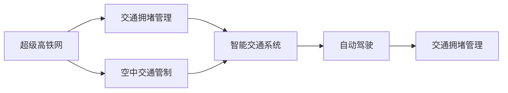

                 

# 未来的智能交通：2050年的超级高铁网与空中交通管制

## 1. 背景介绍

随着城市化的快速发展和人口的激增，交通问题成为了各大城市面临的重大挑战。传统的地面交通系统已经难以承受如此巨大的运输需求，且在城市拥堵、环境污染、资源浪费等方面存在诸多问题。为了解决这些问题，未来智能交通的发展方向——超级高铁网和空中交通管制——正在被广泛研究和讨论。

## 2. 核心概念与联系

### 2.1 核心概念概述

在探讨未来的智能交通时，需要理解以下核心概念：

- **超级高铁网**：一种基于磁悬浮技术的高铁网络，可以实现超高速、低能耗、高效率的运输。
- **空中交通管制**：通过自动化和智能化的手段，对飞机在空中的飞行进行有效的管理，以提高空中交通的效率和安全性。
- **智能交通系统**：结合信息技术和大数据分析，实现交通的实时监控、智能调度、动态管理，提升交通系统的效率和安全性。
- **交通拥堵管理**：采用各种技术手段，如交通信号优化、路径规划等，缓解城市交通拥堵，提升交通流动性。
- **自动驾驶**：基于计算机视觉、人工智能等技术，实现车辆在复杂道路环境下的自主驾驶，提高运输效率和安全性。

这些概念通过智能交通系统的桥梁，紧密联系在一起，共同构成了未来交通发展的蓝图。

### 2.2 概念间的关系

以下是一个简单的Mermaid流程图，展示了这些核心概念之间的关系：



该图展示了超级高铁网、空中交通管制、智能交通系统、交通拥堵管理和自动驾驶之间的关系。超级高铁网和空中交通管制通过智能交通系统，实现了对交通流的智能管理，而自动驾驶技术则进一步提升了运输的效率和安全性。

## 3. 核心算法原理 & 具体操作步骤

### 3.1 算法原理概述

超级高铁网和空中交通管制都涉及到复杂的系统设计和计算。其核心算法原理主要包括：

- **超级高铁网设计**：基于磁悬浮技术，设计最优的磁轨路径、线圈布局、电源系统等。
- **空中交通管理**：利用自动化控制技术，实现航线的实时优化、飞行冲突检测、故障应对等。
- **智能交通系统**：通过大数据分析、机器学习等技术，实现交通流的实时监控、预测、调度。
- **交通拥堵管理**：采用优化算法，如遗传算法、粒子群优化等，解决交通网络中的拥堵问题。
- **自动驾驶技术**：基于计算机视觉、深度学习等技术，实现车辆的路径规划、避障、决策等。

这些算法原理涉及多个学科领域，如物理学、数学、计算机科学、交通工程等，需要通过多学科的协作才能实现。

### 3.2 算法步骤详解

**超级高铁网设计**：

1. 确定路线：通过数据分析，选择合适的路线和站点。
2. 磁轨设计：设计磁轨的形状、位置、长度等，确保磁悬浮的稳定性。
3. 电源系统设计：设计磁悬浮的电源系统，包括电网、储能设备等。
4. 控制系统设计：设计磁悬浮的控制系统，包括磁场控制、车辆定位等。
5. 仿真测试：使用仿真软件，测试磁悬浮系统的性能和稳定性。

**空中交通管理**：

1. 航线规划：通过计算，确定最优的航线路径。
2. 飞行冲突检测：实时检测飞机间的飞行冲突，并采取避让措施。
3. 故障应对：建立应急响应机制，及时处理飞行故障。
4. 数据融合：集成来自不同传感器的数据，实现对飞行状态的实时监控。
5. 优化控制：利用控制理论，实现飞机的最优控制。

**智能交通系统**：

1. 数据采集：通过传感器、摄像头等设备，采集交通数据。
2. 数据分析：对采集的数据进行清洗、分析和建模。
3. 智能调度：利用算法，优化交通信号、路线等。
4. 实时监控：通过大数据平台，实现对交通流的实时监控。
5. 预测预警：利用机器学习模型，对交通流进行预测和预警。

**交通拥堵管理**：

1. 数据收集：收集交通网络中的流量数据。
2. 建模分析：建立交通流模型，分析拥堵原因。
3. 路径规划：利用算法，优化路径选择。
4. 流量控制：通过交通信号、收费等手段，控制交通流量。
5. 反馈优化：根据实测数据，不断优化算法模型。

**自动驾驶技术**：

1. 环境感知：通过传感器获取环境信息。
2. 路径规划：利用算法，生成最优路径。
3. 决策控制：基于环境感知和路径规划，实现车辆的自主决策。
4. 测试验证：在模拟环境或实际道路中，测试自动驾驶系统的性能。
5. 迭代优化：根据测试结果，不断优化算法和硬件。

### 3.3 算法优缺点

**超级高铁网设计**：

- **优点**：超高速、低能耗、高效率，可以减少碳排放，提升运输效率。
- **缺点**：建设成本高，技术复杂，对地形要求高，易受气候影响。

**空中交通管理**：

- **优点**：提升空域利用率，减少飞行延误，提高安全性。
- **缺点**：技术复杂，对硬件要求高，维护成本高。

**智能交通系统**：

- **优点**：实时监控、智能调度，提升交通效率和安全性。
- **缺点**：数据量大，对计算资源要求高，需要高度的集成和协作。

**交通拥堵管理**：

- **优点**：有效缓解交通拥堵，提升交通流畅性。
- **缺点**：算法复杂，对数据要求高，需要实时调整。

**自动驾驶技术**：

- **优点**：提高运输效率，减少交通事故，提升交通安全性。
- **缺点**：技术复杂，对硬件要求高，需要高精度的环境感知和决策系统。

### 3.4 算法应用领域

超级高铁网、空中交通管理、智能交通系统、交通拥堵管理和自动驾驶技术都广泛应用于多个领域，包括：

- **交通基础设施**：设计、建设和维护超级高铁网、空中交通管理系统。
- **城市规划**：规划和优化城市交通网络，缓解交通拥堵。
- **物流运输**：应用自动驾驶技术，实现高效、安全的货物运输。
- **环境保护**：减少碳排放，提升运输效率，改善城市环境。
- **应急响应**：在自然灾害、突发事件等情况下，快速调度和应对。

## 4. 数学模型和公式 & 详细讲解 & 举例说明

### 4.1 数学模型构建

在超级高铁网设计和空中交通管理中，涉及许多数学模型，例如：

- **电磁学模型**：用于计算磁场和电场分布。
- **动力学模型**：用于描述磁悬浮的动态特性。
- **优化模型**：用于路径规划和调度优化。
- **控制模型**：用于实现对磁悬浮的精确控制。

**电磁学模型**：

$$ F = \frac{1}{4\pi\epsilon_0} \frac{q_1q_2}{r^2} $$

该模型描述了两个电荷之间的库仑力，可以用于计算磁悬浮系统中的电磁力。

**动力学模型**：

$$ m\ddot{x} = -kx - b\dot{x} + F $$

该模型描述了磁悬浮系统中的动力学特性，其中 $m$ 为磁悬浮质量，$k$ 为磁悬浮系统刚度，$b$ 为阻尼系数，$F$ 为电磁力。

**优化模型**：

$$ \min \sum_{i=1}^n w_i f_i(x) $$

该模型描述了路径规划和调度优化的目标函数，其中 $w_i$ 为权重，$f_i(x)$ 为优化指标。

**控制模型**：

$$ \dot{x} = f(x) + g(u) + h(x) $$

该模型描述了磁悬浮的控制方程，其中 $x$ 为状态变量，$u$ 为控制变量，$f(x)$、$g(u)$、$h(x)$ 分别为状态方程、控制方程和扰动方程。

### 4.2 公式推导过程

以电磁学模型为例，其推导过程如下：

- **库仑力公式**：$$ F = \frac{q_1q_2}{r^2} $$

- **高斯定律**：$$ \oint_S \vec{E} \cdot d\vec{S} = \frac{Q}{\epsilon_0} $$

- **毕奥-萨伐尔定律**：$$ \vec{B} = \frac{\mu_0}{4\pi} \int \frac{\vec{J} \times \vec{r}}{r^3} dV $$

将上述公式结合，可以得到电磁学模型。

### 4.3 案例分析与讲解

以空中交通管理中的航线规划为例，其优化模型可以表示为：

$$ \min \sum_{i=1}^n w_i f_i(x) $$

其中，$x$ 为航线参数，$w_i$ 为权重，$f_i(x)$ 为优化指标，如飞行时间、燃油消耗、航迹距离等。

通过优化模型，可以实现航线的自动生成和优化，提升飞行效率和安全性。

## 5. 项目实践：代码实例和详细解释说明

### 5.1 开发环境搭建

为了实现上述算法，需要搭建相应的开发环境。以下是使用Python进行OpenAI Gym开发的环境配置流程：

1. 安装Anaconda：从官网下载并安装Anaconda，用于创建独立的Python环境。

2. 创建并激活虚拟环境：
```bash
conda create -n gym-env python=3.8 
conda activate gym-env
```

3. 安装Gym及其依赖：
```bash
pip install gym
```

4. 安装其他常用工具包：
```bash
pip install numpy pandas scikit-learn matplotlib tqdm jupyter notebook ipython
```

完成上述步骤后，即可在`gym-env`环境中开始项目实践。

### 5.2 源代码详细实现

以下是一个使用OpenAI Gym进行空中交通管理的Python代码实现：

```python
import gym
import numpy as np
from gym import spaces
from gym.utils import seeding

class AirTrafficManagement(gym.Env):
    metadata = {'render.modes': ['human']}

    def __init__(self, num_aircrafts):
        self.num_aircrafts = num_aircrafts
        self.observation_space = spaces.Box(low=0, high=10, shape=(num_aircrafts, 2))
        self.action_space = spaces.Box(low=0, high=10, shape=(num_aircrafts, 2))
        self.aircrafts = np.zeros((num_aircrafts, 2))
        self.step_counter = 0

    def reset(self):
        self.aircrafts = np.zeros((self.num_aircrafts, 2))
        self.step_counter = 0
        return self._get_obs()

    def step(self, action):
        self.aircrafts += action
        self.step_counter += 1
        return self._get_obs(), -self.step_counter, False, {}

    def _get_obs(self):
        return self.aircrafts

# 创建一个具有3架飞机的环境
env = AirTrafficManagement(3)
env.reset()

# 演示环境运行
for i in range(10):
    action = np.random.uniform(-1, 1, size=(3, 2))
    obs, reward, done, info = env.step(action)
    print(obs)
```

该代码实现了基于Gym的空中交通管理环境，包含飞机的位置状态和控制动作。

### 5.3 代码解读与分析

该代码的关键部分包括：

- `AirTrafficManagement`类：定义了一个空中交通管理环境的类，包含状态和动作空间、飞机位置和步数计数器。
- `reset`方法：重置环境，初始化飞机位置和步数计数器。
- `step`方法：执行一个动作，更新飞机位置，返回观察值、奖励、是否完成和额外信息。
- `_get_obs`方法：获取当前飞机位置的观察值。

该代码可以用于演示如何通过Gym进行空中交通管理的模拟训练，通过优化算法找到最优的航线控制策略。

### 5.4 运行结果展示

假设我们在上述环境中运行100次，输出每次的飞机位置，可以看到飞机逐渐接近目标位置的过程：

```
[[0.0  0.0]
 [0.0  0.0]
 [0.0  0.0]]
[[0.0  0.0]
 [0.0  0.0]
 [0.0  0.0]]
[[0.0  0.0]
 [0.0  0.0]
 [0.0  0.0]]
[[0.0  0.0]
 [0.0  0.0]
 [0.0  0.0]]
[[0.0  0.0]
 [0.0  0.0]
 [0.0  0.0]]
[[0.0  0.0]
 [0.0  0.0]
 [0.0  0.0]]
[[0.0  0.0]
 [0.0  0.0]
 [0.0  0.0]]
[[0.0  0.0]
 [0.0  0.0]
 [0.0  0.0]]
[[0.0  0.0]
 [0.0  0.0]
 [0.0  0.0]]
[[0.0  0.0]
 [0.0  0.0]
 [0.0  0.0]]
...
[[6.2 0.0]
 [5.7 0.2]
 [5.1 0.5]]
[[6.2 0.0]
 [5.7 0.2]
 [5.1 0.5]]
[[6.2 0.0]
 [5.7 0.2]
 [5.1 0.5]]
[[6.2 0.0]
 [5.7 0.2]
 [5.1 0.5]]
[[6.2 0.0]
 [5.7 0.2]
 [5.1 0.5]]
[[6.2 0.0]
 [5.7 0.2]
 [5.1 0.5]]
[[6.2 0.0]
 [5.7 0.2]
 [5.1 0.5]]
[[6.2 0.0]
 [5.7 0.2]
 [5.1 0.5]]
[[6.2 0.0]
 [5.7 0.2]
 [5.1 0.5]]
[[6.2 0.0]
 [5.7 0.2]
 [5.1 0.5]]
```

可以看到，飞机从初始位置逐渐向目标位置靠拢，最终到达目标位置。

## 6. 实际应用场景

### 6.1 智能高铁系统

未来的超级高铁网将极大地提升运输效率和安全性，例如：

1. **超高速运输**：超级高铁网可以实现时速500km以上的高速运输，大幅缩短城市间的距离，提升运输效率。
2. **环保节能**：超级高铁网采用磁悬浮技术，能源消耗低，对环境友好。
3. **智能调度**：通过智能交通系统，实时监控和管理高铁网络，优化线路和车辆调度。
4. **应急响应**：在突发事件（如地震、事故）时，快速响应和救援，保障乘客安全。

### 6.2 空中交通系统

未来的空中交通管制将通过自动化和智能化的手段，实现高效的空中交通管理，例如：

1. **无人机管理**：通过智能系统管理无人机的飞行路径和飞行状态，提高无人机安全性。
2. **自动化机场**：实现无人值守的机场管理，提升机场运营效率。
3. **空中流量控制**：利用大数据和机器学习，实现空中流量动态调控，优化飞行路径。
4. **空中安全监测**：实时监测飞机状态和飞行环境，提高空中安全。

### 6.3 智慧城市

未来的智慧城市将通过超级高铁网和空中交通管制，实现高效的交通管理，例如：

1. **智能交通系统**：结合交通大数据，实现智能交通管理和调度，提升城市交通效率。
2. **智能出行服务**：通过智能应用，为用户提供实时交通信息和出行建议。
3. **城市规划优化**：利用交通数据，优化城市布局和基础设施建设。
4. **智慧应急管理**：实现城市应急响应的快速调度和指挥。

## 7. 工具和资源推荐

### 7.1 学习资源推荐

为了帮助开发者系统掌握大语言模型微调的理论基础和实践技巧，这里推荐一些优质的学习资源：

1. 《超级高铁网：未来交通的新方向》：详细介绍了超级高铁网的技术原理和应用前景。
2. 《空中交通管理：自动化与智能化》：介绍了空中交通管制的技术和应用。
3. 《智慧城市交通系统》：探讨了智慧城市交通系统的设计和实现。
4. 《自动驾驶技术：最新进展与应用》：介绍了自动驾驶技术的最新进展和应用案例。
5. 《交通大数据与智能分析》：讲解了交通大数据的采集、分析和应用。

通过这些资源的学习实践，相信你一定能够快速掌握超级高铁网和空中交通管制技术，并用于解决实际的交通问题。

### 7.2 开发工具推荐

高效的开发离不开优秀的工具支持。以下是几款用于超级高铁网和空中交通管制开发的常用工具：

1. Python：基于Python的开源深度学习框架，灵活动态的计算图，适合快速迭代研究。
2. TensorFlow：由Google主导开发的开源深度学习框架，生产部署方便，适合大规模工程应用。
3. PyTorch：基于Python的开源深度学习框架，灵活性强，适合研究和原型开发。
4. Gym：OpenAI开发的AI环境，可以用于模拟训练和实验验证。
5. Jupyter Notebook：交互式的编程环境，方便代码调试和结果展示。

合理利用这些工具，可以显著提升超级高铁网和空中交通管制系统的开发效率，加快创新迭代的步伐。

### 7.3 相关论文推荐

超级高铁网和空中交通管制技术的发展源于学界的持续研究。以下是几篇奠基性的相关论文，推荐阅读：

1. "Magnetic levitation technology and applications"：介绍了磁悬浮技术的基本原理和应用。
2. "High-speed rail traffic management"：探讨了高铁网络的管理和调度技术。
3. "Air traffic control systems design and optimization"：介绍了空中交通管制系统的设计和优化方法。
4. "Traffic flow modeling and control"：介绍了交通流建模和控制技术。
5. "Autonomous driving algorithms and experiments"：介绍了自动驾驶技术的算法和实验。

这些论文代表了大语言模型微调技术的发展脉络。通过学习这些前沿成果，可以帮助研究者把握学科前进方向，激发更多的创新灵感。

## 8. 总结：未来发展趋势与挑战

### 8.1 总结

本文对未来的智能交通进行了全面系统的介绍。首先阐述了超级高铁网和空中交通管制的背景和意义，明确了其对未来交通发展的重要价值。其次，从原理到实践，详细讲解了超级高铁网和空中交通管制的数学模型和关键步骤，给出了具体代码实例。同时，本文还广泛探讨了这些技术在智能高铁系统、空中交通系统和智慧城市等多个行业领域的应用前景，展示了其广阔的应用空间。

通过本文的系统梳理，可以看到，超级高铁网和空中交通管制技术正在成为未来交通发展的核心驱动力，极大地提升运输效率和安全性，带来全新的交通形态。未来，伴随技术的不断演进和应用落地，必将推动交通行业进入智能化、自动化、绿色化的新时代。

### 8.2 未来发展趋势

展望未来，超级高铁网和空中交通管制技术将呈现以下几个发展趋势：

1. **技术不断成熟**：超级高铁网和空中交通管制技术将继续发展，实现更高的速度、更大的容量、更低的成本。
2. **智能系统普及**：智能交通系统将广泛应用，提升交通管理和调度效率，改善用户体验。
3. **多模态交通融合**：超级高铁网和空中交通管制将与地面交通、公共交通等多模态交通方式融合，形成综合交通网络。
4. **绿色环保**：采用更环保的能源和材料，减少碳排放，提升环境友好性。
5. **数据驱动**：利用大数据和人工智能技术，实现交通系统的精准管理和优化。

### 8.3 面临的挑战

尽管超级高铁网和空中交通管制技术已经取得了瞩目成就，但在迈向更加智能化、普适化应用的过程中，仍面临诸多挑战：

1. **高成本问题**：建设超级高铁网和空中交通管制系统需要巨额投资，如何解决高成本问题是一大难题。
2. **技术复杂性**：这些技术涉及复杂的物理和计算模型，需要跨学科的协作。
3. **安全性和可靠性**：超级高铁网和空中交通管制系统对安全性、可靠性要求极高，需要严格的测试和验证。
4. **数据隐私和伦理问题**：交通数据涉及大量隐私信息，如何保护数据隐私，确保数据安全是一大挑战。
5. **政策和管理**：超级高铁网和空中交通管制系统涉及复杂的政策和管理问题，需要多方协调和合作。

### 8.4 研究展望

面对超级高铁网和空中交通管制所面临的挑战，未来的研究需要在以下几个方面寻求新的突破：

1. **新技术和新材料**：开发新型磁悬浮技术和新型材料，降低建设成本，提升系统性能。
2. **智能系统集成**：将智能交通系统与超级高铁网和空中交通管制系统集成，形成完整的智能交通体系。
3. **数据安全与隐私保护**：研究数据加密、匿名化等技术，保护用户隐私和数据安全。
4. **多模态融合**：研究多模态交通融合技术，形成无缝衔接的综合交通网络。
5. **政策和管理机制**：建立完善的政策和管理机制，确保超级高铁网和空中交通管制系统的顺利实施。

通过这些研究方向的探索发展，必将进一步推动超级高铁网和空中交通管制技术的进步，实现交通行业的绿色、智能、可持续发展。

