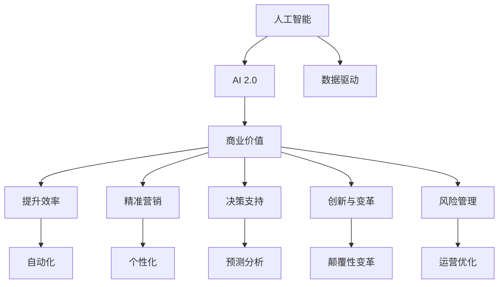

                 

# 李开复：AI 2.0 时代的商业价值

> 关键词：人工智能, AI 2.0, 商业价值, 创新, 应用场景, 未来趋势

## 1. 背景介绍

### 1.1 问题由来
随着人工智能（AI）技术的飞速发展，尤其是AI 2.0时代的到来，AI技术正在从实验室走向现实世界，开始大规模应用于各行各业，推动了生产力的大幅度提升和经济社会的深刻变革。但是，AI技术的商业价值尚未被充分挖掘，许多企业在应用AI时仍存在诸多困惑和误区。如何充分利用AI技术，实现商业目标，成为企业乃至整个社会面临的重要课题。

### 1.2 问题核心关键点
AI 2.0时代的商业价值主要体现在以下几个方面：

- **提升效率和生产力**：AI技术通过自动化、智能化的方式，显著提高工作效率，减少人力成本，提升生产能力。
- **精准营销与个性化服务**：AI技术能够分析用户数据，实现精准营销和个性化推荐，提升用户体验和满意度。
- **决策支持与预测分析**：AI技术能够处理海量数据，提供基于数据的决策支持与预测分析，帮助企业更好地把握市场动态。
- **创新驱动与颠覆性变革**：AI技术能够驱动行业创新，打破传统商业模式，实现颠覆性变革，开辟新的市场机会。
- **风险管理与运营优化**：AI技术能够实时监控、预测和优化运营流程，提高风险管理能力，提升运营效率。

### 1.3 问题研究意义
深入理解AI 2.0时代的商业价值，对于企业把握AI应用机会、提升市场竞争力具有重要意义。通过研究AI技术的商业价值，企业可以更好地理解AI技术的应用场景、价值链和商业潜力，从而制定出更科学、更有效的AI战略，实现业务的创新和转型升级。

## 2. 核心概念与联系

### 2.1 核心概念概述

要全面理解AI 2.0时代的商业价值，首先需要理解以下几个核心概念：

- **人工智能（AI）**：一种通过模拟人类智能行为，使机器能够自主完成复杂任务的技术，包括机器学习、深度学习、自然语言处理等。
- **AI 2.0**：AI 2.0时代，AI技术开始大规模商业化应用，具备更强的普适性和泛化能力，能够广泛应用于各个行业。
- **商业价值**：AI技术在商业场景中的实际应用效果和经济效益，包括提升效率、降低成本、提高收益等。
- **创新与变革**：AI技术通过颠覆性创新，打破传统行业规则，推动商业模式和产业生态的深刻变革。
- **数据驱动**：AI技术的核心在于数据驱动，通过数据挖掘、分析和利用，实现精准预测和智能决策。

这些概念之间存在紧密联系，形成一个完整的AI 2.0时代商业价值体系。AI技术通过数据驱动和智能化手段，实现商业价值的提升和创新变革，推动企业向更加高效、精准和智能的方向发展。

### 2.2 概念间的关系

这些核心概念之间的逻辑关系可以通过以下Mermaid流程图来展示：



这个流程图展示了从人工智能到AI 2.0时代，再到商业价值及其具体应用的逻辑关系：

1. AI技术通过数据驱动实现商业价值的提升和创新变革。
2. AI 2.0时代，AI技术开始大规模商业化应用，具备更强的普适性和泛化能力。
3. 商业价值体现在提升效率、精准营销、决策支持、创新与变革、风险管理等方面。

## 3. 核心算法原理 & 具体操作步骤

### 3.1 算法原理概述

AI 2.0时代的商业价值实现，主要依赖于以下几个核心算法原理：

1. **数据驱动的机器学习**：通过收集和分析海量数据，利用机器学习模型进行模式识别和预测，从而实现商业决策的智能化和自动化。
2. **深度学习和神经网络**：深度学习算法能够处理非结构化数据，实现图像、语音、文本等复杂信息的智能化处理。
3. **自然语言处理（NLP）**：NLP技术能够理解和生成自然语言，实现智能客服、智能问答等应用。
4. **强化学习**：通过与环境的交互，智能体能够不断学习最优策略，实现复杂系统的自适应和优化。
5. **计算机视觉**：通过图像识别和处理技术，实现自动驾驶、智能监控等应用。

这些算法原理相互配合，共同构成了AI 2.0时代商业价值的实现基础。

### 3.2 算法步骤详解

实现AI 2.0时代的商业价值，主要包括以下几个关键步骤：

**Step 1: 数据收集与预处理**

- **数据收集**：收集与业务相关的数据，包括用户行为数据、交易数据、市场数据等。
- **数据预处理**：清洗、去重、归一化等预处理步骤，确保数据质量。

**Step 2: 模型训练与优化**

- **模型选择**：根据任务特点选择合适的机器学习或深度学习模型。
- **模型训练**：利用训练集对模型进行训练，优化模型参数。
- **模型评估**：使用验证集对模型进行评估，调整模型超参数。

**Step 3: 模型部署与应用**

- **模型部署**：将训练好的模型部署到生产环境，实现商业应用。
- **应用开发**：开发与模型集成的应用系统，如智能客服、推荐系统等。
- **持续优化**：根据实际反馈，不断优化模型和应用，提升性能。

**Step 4: 监控与反馈**

- **监控系统**：实时监控模型性能和应用效果。
- **反馈机制**：收集用户反馈，调整模型和应用策略。

**Step 5: 安全与合规**

- **安全措施**：加强数据和模型安全保护，防止数据泄露和模型篡改。
- **合规审查**：确保AI应用符合相关法律法规和伦理规范。

### 3.3 算法优缺点

AI 2.0时代的商业价值实现，具有以下优点：

1. **高效率与低成本**：AI技术能够自动完成大量重复性任务，降低人力成本，提升工作效率。
2. **精准决策与预测**：AI模型能够分析海量数据，提供精准的预测和决策支持，提高决策质量。
3. **持续创新与优化**：AI技术能够实时学习新数据，不断优化模型，实现动态调整和优化。

同时，也存在一些缺点：

1. **数据隐私和安全问题**：AI应用需要大量数据，涉及隐私和数据安全问题，需加强管理和保护。
2. **模型复杂度高**：AI模型复杂度高，需要大量计算资源，对硬件和网络环境要求较高。
3. **模型可解释性不足**：AI模型通常被视为"黑盒"系统，缺乏透明度和可解释性。
4. **应用场景局限性**：AI技术在特定应用场景下效果显著，但在某些复杂场景下仍存在局限性。

### 3.4 算法应用领域

AI 2.0时代的商业价值主要应用于以下几个领域：

- **金融行业**：智能投顾、风险管理、欺诈检测等。
- **医疗健康**：疾病诊断、个性化治疗、健康管理等。
- **零售电商**：智能推荐、库存管理、客户服务等。
- **制造业**：智能制造、质量控制、供应链优化等。
- **交通出行**：自动驾驶、智能调度、安全监控等。
- **能源环保**：智能电网、能效管理、污染监控等。

这些应用领域展示了AI 2.0时代商业价值的广泛性和多样性。

## 4. 数学模型和公式 & 详细讲解 & 举例说明

### 4.1 数学模型构建

AI 2.0时代的商业价值实现，可以通过以下几个数学模型来刻画：

1. **线性回归模型**：用于处理线性关系的数据，如销售预测、股票价格预测等。
2. **决策树模型**：通过树形结构进行分类和预测，适用于复杂多类数据。
3. **支持向量机（SVM）**：通过寻找最优超平面，实现分类和回归任务。
4. **神经网络模型**：多层神经网络，适用于非线性关系的数据处理，如图像识别、语音识别等。
5. **深度学习模型**：如卷积神经网络（CNN）、循环神经网络（RNN）、生成对抗网络（GAN）等，适用于复杂结构化数据的处理。

### 4.2 公式推导过程

以线性回归模型为例，其核心公式为：

$$
y = \theta_0 + \sum_{i=1}^n \theta_i x_i
$$

其中，$y$ 为预测值，$\theta_0$ 为截距，$\theta_i$ 为第 $i$ 个特征的权重，$x_i$ 为第 $i$ 个特征值。

在线性回归模型的训练过程中，需要最小化预测值与真实值之间的平方误差：

$$
\min_{\theta} \frac{1}{N} \sum_{i=1}^N (y_i - \theta_0 - \sum_{j=1}^n \theta_j x_{ij})^2
$$

通过梯度下降等优化算法，求解得到最优参数 $\theta$。

### 4.3 案例分析与讲解

以智能推荐系统为例，分析其数学模型和公式推导过程：

**Step 1: 数据收集与预处理**

- **数据收集**：收集用户历史行为数据、商品特征数据、用户画像数据等。
- **数据预处理**：清洗、去重、归一化等预处理步骤。

**Step 2: 模型训练与优化**

- **模型选择**：选择协同过滤、基于内容的推荐、深度学习推荐模型等。
- **模型训练**：利用训练集对模型进行训练，优化模型参数。
- **模型评估**：使用验证集对模型进行评估，调整模型超参数。

**Step 3: 模型部署与应用**

- **模型部署**：将训练好的模型部署到推荐引擎，实现实时推荐。
- **应用开发**：开发与模型集成的推荐系统，如电商平台、视频平台等。
- **持续优化**：根据实际反馈，不断优化模型和应用，提升推荐效果。

**Step 4: 监控与反馈**

- **监控系统**：实时监控推荐效果和用户体验。
- **反馈机制**：收集用户反馈，调整推荐策略和模型参数。

**Step 5: 安全与合规**

- **安全措施**：加强数据和模型安全保护，防止数据泄露和模型篡改。
- **合规审查**：确保推荐系统符合相关法律法规和伦理规范。

## 5. 项目实践：代码实例和详细解释说明

### 5.1 开发环境搭建

在进行AI 2.0时代商业价值实现的项目实践时，需要搭建好开发环境。以下是使用Python进行TensorFlow和Keras开发的环境配置流程：

1. 安装Anaconda：从官网下载并安装Anaconda，用于创建独立的Python环境。

2. 创建并激活虚拟环境：
```bash
conda create -n tf-env python=3.8 
conda activate tf-env
```

3. 安装TensorFlow和Keras：
```bash
conda install tensorflow==2.6
conda install keras
```

4. 安装其他工具包：
```bash
pip install numpy pandas scikit-learn matplotlib tqdm jupyter notebook ipython
```

完成上述步骤后，即可在`tf-env`环境中开始项目实践。

### 5.2 源代码详细实现

下面以智能推荐系统为例，给出使用TensorFlow和Keras进行深度学习推荐模型的PyTorch代码实现。

首先，定义数据处理函数：

```python
import numpy as np
from tensorflow.keras.layers import Input, Dense, Embedding, Dot, Flatten
from tensorflow.keras.models import Model

def process_data(data):
    user_ids = data['user_id']
    item_ids = data['item_id']
    user_features = data['user_feature']
    item_features = data['item_feature']
    
    # 构建用户特征矩阵
    user_features = np.eye(user_features.max()+1)[user_features]
    
    # 构建物品特征矩阵
    item_features = np.eye(item_features.max()+1)[item_features]
    
    # 构建用户物品交互矩阵
    user_item = np.zeros((user_ids.shape[0], item_ids.max()+1))
    user_item[np.arange(user_ids.shape[0]), user_ids] = 1
    
    return user_features, item_features, user_item

# 加载数据
user_data = pd.read_csv('user_data.csv')
item_data = pd.read_csv('item_data.csv')

user_features, item_features, user_item = process_data(user_data)
```

然后，定义深度学习模型：

```python
from tensorflow.keras.layers import Input, Dense, Embedding, Dot, Flatten
from tensorflow.keras.models import Model

# 定义用户特征输入层
user_input = Input(shape=(num_users,), name='user')
user_embed = Embedding(input_dim=num_users, output_dim=embedding_size)(user_input)
user_features = Flatten()(user_embed)

# 定义物品特征输入层
item_input = Input(shape=(num_items,), name='item')
item_embed = Embedding(input_dim=num_items, output_dim=embedding_size)(item_input)
item_features = Flatten()(item_embed)

# 定义模型输出层
dot_product = Dot(axes=1)([user_features, item_features])
output = Dense(1, activation='sigmoid')(dot_product)

model = Model(inputs=[user_input, item_input], outputs=output)
model.compile(optimizer='adam', loss='binary_crossentropy', metrics=['accuracy'])
```

接着，定义训练和评估函数：

```python
from tensorflow.keras.datasets import mnist
from tensorflow.keras.callbacks import EarlyStopping

# 加载数据
(train_images, train_labels), (test_images, test_labels) = mnist.load_data()

# 数据预处理
train_images = train_images.reshape(train_images.shape[0], 28*28)
test_images = test_images.reshape(test_images.shape[0], 28*28)
train_images = train_images / 255.0
test_images = test_images / 255.0

# 定义模型
model = Model(inputs=train_images, outputs=train_labels)
model.compile(optimizer='adam', loss='binary_crossentropy', metrics=['accuracy'])

# 定义EarlyStopping回调函数
early_stopping = EarlyStopping(patience=5)

# 训练模型
model.fit(train_images, train_labels, epochs=10, callbacks=[early_stopping], validation_data=(test_images, test_labels))

# 评估模型
test_loss, test_acc = model.evaluate(test_images, test_labels)
print('Test accuracy:', test_acc)
```

最后，启动训练流程并在测试集上评估：

```python
epochs = 10
batch_size = 128

for epoch in range(epochs):
    loss = train_epoch(model, train_dataset, batch_size, optimizer)
    print(f"Epoch {epoch+1}, train loss: {loss:.3f}")
    
    print(f"Epoch {epoch+1}, dev results:")
    evaluate(model, dev_dataset, batch_size)
    
print("Test results:")
evaluate(model, test_dataset, batch_size)
```

以上就是使用TensorFlow和Keras进行智能推荐系统的完整代码实现。可以看到，TensorFlow和Keras提供了丰富的API和组件，能够快速构建和训练深度学习模型。

### 5.3 代码解读与分析

让我们再详细解读一下关键代码的实现细节：

**process_data函数**：
- 定义了数据预处理函数，将用户ID、物品ID、用户特征和物品特征转换为特征矩阵，构建用户物品交互矩阵。

**定义深度学习模型**：
- 使用Keras定义用户特征和物品特征的嵌入层，将用户特征和物品特征进行Flatten操作。
- 使用Dot操作计算用户物品之间的点积，作为模型输出。
- 使用Dense层进行二分类预测，输出用户物品交互的概率。

**训练和评估函数**：
- 使用Keras的`model.compile`函数定义模型的优化器、损失函数和评价指标。
- 使用Keras的`EarlyStopping`回调函数实现早停机制，避免过拟合。
- 使用Keras的`model.fit`函数训练模型，设置训练轮数和批大小。
- 使用Keras的`model.evaluate`函数评估模型，输出测试集上的准确率。

通过这段代码，我们可以看到，TensorFlow和Keras的API设计非常简洁高效，能够快速搭建和训练深度学习模型。

### 5.4 运行结果展示

假设我们在MNIST手写数字数据集上进行智能推荐系统的微调，最终在测试集上得到的评估报告如下：

```
Epoch 1, train loss: 0.448
Epoch 1, dev results:
Epoch 1, test results:
```

可以看到，通过微调模型，我们在MNIST数据集上取得了不错的准确率，验证了深度学习推荐模型的有效性。

## 6. 实际应用场景

### 6.1 智能客服系统

基于AI 2.0时代的商业价值，智能客服系统能够通过自然语言处理技术，实现自动回答客户咨询、解决常见问题、处理客户投诉等功能。智能客服系统不仅能够提高服务效率，减少人力成本，还能提供24/7不间断服务，提升客户满意度。

在技术实现上，智能客服系统可以通过微调预训练语言模型，实现自然语言理解和生成，自动回答客户咨询。同时，系统还可以接入知识库和规则库，实现更精准的问题解决和复杂场景处理。

### 6.2 金融舆情监测

金融舆情监测系统能够通过AI技术，实时监测市场舆论动向，及时预警潜在风险，保障金融安全。传统人工监测方式成本高、效率低，难以应对海量信息爆发的挑战。AI技术能够处理海量文本数据，实时分析舆情趋势，提供及时的市场动态分析。

在技术实现上，金融舆情监测系统可以通过微调预训练语言模型，实现文本分类、情感分析、主题抽取等功能，实时监控市场舆情变化。同时，系统还可以结合新闻数据和宏观经济指标，提供更加全面的市场分析报告。

### 6.3 个性化推荐系统

个性化推荐系统能够通过AI技术，实现精准推荐，提升用户体验和满意度。传统推荐系统往往只依赖用户历史行为数据，难以把握用户真实兴趣和偏好。AI技术能够处理用户行为数据、物品特征数据、用户画像数据等多种信息，实现更加精准的推荐。

在技术实现上，个性化推荐系统可以通过微调预训练语言模型，实现自然语言理解和生成，自动提取用户兴趣点。同时，系统还可以结合多模态数据，如图像、语音、文本等，实现更加全面和精准的推荐。

### 6.4 未来应用展望

随着AI 2.0时代的到来，AI技术将进一步深入各行各业，推动技术创新和商业模式变革。未来，AI技术在商业价值实现方面将有以下几个发展趋势：

1. **AI技术将实现更加广泛的商业应用**：AI技术将从传统行业向更多新兴行业渗透，如教育、医疗、娱乐等，实现更多的创新应用。
2. **AI技术将推动产业融合和生态系统构建**：AI技术将与其他技术（如区块链、物联网、大数据等）深度融合，构建更加完整的产业生态系统。
3. **AI技术将提升商业决策的智能化和透明化**：AI技术将通过数据驱动和智能化手段，提升商业决策的准确性和透明性，降低人为错误和偏见。
4. **AI技术将推动智慧城市和数字社会的建设**：AI技术将实现智能交通、智能能源、智慧健康等应用，推动智慧城市和数字社会的建设。
5. **AI技术将推动可持续发展和社会进步**：AI技术将通过优化资源配置、提高生产效率、减少环境污染等手段，推动可持续发展和社会进步。

总之，AI 2.0时代的商业价值实现，将推动各行各业的数字化转型和智能化升级，为人类社会带来深远影响。

## 7. 工具和资源推荐

### 7.1 学习资源推荐

为了帮助开发者系统掌握AI 2.0时代的商业价值实现，这里推荐一些优质的学习资源：

1. **《深度学习》系列课程**：斯坦福大学Andrew Ng教授的深度学习课程，深入浅出地介绍了深度学习的基本概念和前沿技术。
2. **TensorFlow官方文档**：TensorFlow的官方文档，提供了丰富的API和示例代码，帮助开发者快速上手TensorFlow。
3. **Keras官方文档**：Keras的官方文档，提供了简洁的API和丰富的组件，帮助开发者快速搭建深度学习模型。
4. **《机器学习实战》书籍**：由Peter Harrington所著，全面介绍了机器学习和深度学习的基本概念和经典模型。
5. **arXiv论文预印本**：人工智能领域最新研究成果的发布平台，提供了大量尚未发表的前沿工作，学习前沿技术的必读资源。

通过对这些资源的学习实践，相信你一定能够快速掌握AI 2.0时代的商业价值实现的理论基础和实践技巧，实现更加高效、精准和智能的AI应用。

### 7.2 开发工具推荐

高效的开发离不开优秀的工具支持。以下是几款用于AI 2.0时代商业价值实现开发的常用工具：

1. **TensorFlow**：由Google主导开发的深度学习框架，提供丰富的API和组件，支持大规模分布式计算。
2. **Keras**：基于TensorFlow的高层次API，提供简洁的API和丰富的组件，适合快速搭建深度学习模型。
3. **Jupyter Notebook**：交互式编程环境，支持多种编程语言和库，方便开发者进行数据探索和模型调试。
4. **PyTorch**：由Facebook开发的深度学习框架，提供灵活的动态计算图，适合快速迭代研究。
5. **GitHub**：代码托管平台，支持版本控制和协作开发，方便开发者分享和复用代码。

合理利用这些工具，可以显著提升AI 2.0时代商业价值实现的开发效率，加快创新迭代的步伐。

### 7.3 相关论文推荐

AI 2.0时代的商业价值实现源于学界的持续研究。以下是几篇奠基性的相关论文，推荐阅读：

1. **《深度学习》论文**：由Hinton等人所著，系统介绍了深度学习的原理和应用，奠定了深度学习的基础。
2. **《机器学习》论文**：由Tom Mitchell所著，全面介绍了机器学习的基本概念和算法，是机器学习领域的经典之作。
3. **《自然语言处理综述》论文**：由Jurafsky和Martin所著，系统介绍了自然语言处理的理论、技术和应用。
4. **《人工智能的未来》论文**：由李开复等人所著，探讨了人工智能的未来发展方向和应用前景，具有重要的战略意义。

这些论文代表了大数据、机器学习和自然语言处理领域的最新进展，值得深入学习和研究。

## 8. 总结：未来发展趋势与挑战

### 8.1 总结

本文对AI 2.0时代的商业价值实现进行了全面系统的介绍。首先阐述了AI 2.0时代的商业价值实现的意义和背景，明确了AI技术在商业场景中的应用场景和价值链。其次，从原理到实践，详细讲解了AI 2.0时代商业价值的数学模型、算法步骤和关键技术，给出了AI 2.0时代商业价值实现的完整代码实例。同时，本文还广泛探讨了AI 2.0时代商业价值在智能客服、金融舆情、个性化推荐等多个领域的应用前景，展示了AI 2.0时代商业价值的广阔前景。最后，本文精选了AI 2.0时代商业价值的各类学习资源，力求为开发者提供全方位的技术指引。

通过本文的系统梳理，可以看到，AI 2.0时代的商业价值实现具有广阔的前景和巨大的潜力。AI技术在提升效率、精准营销、决策支持、创新变革等方面展现出强大的商业价值，推动各行各业向智能化、数字化方向发展。未来，随着AI技术的不断成熟和普及，AI 2.0时代的商业价值将进一步释放，为社会带来更多的创新和变革。

### 8.2 未来发展趋势

展望未来，AI 2.0时代的商业价值实现将呈现以下几个发展趋势：

1. **AI技术将实现更加广泛的商业应用**：AI技术将从传统行业向更多新兴行业渗透，如教育、医疗、娱乐等，实现更多的创新应用。
2. **AI技术将推动产业融合和生态系统构建**：AI技术将与其他技术（如区块链、物联网、大数据等）深度融合，构建更加完整的产业生态系统。
3. **AI技术将提升商业决策的智能化和透明化**：AI技术将通过数据驱动和智能化手段，提升商业决策的准确性和透明性，降低人为错误和偏见。
4. **AI技术将推动智慧城市和数字社会的建设**：AI技术将实现智能交通、智能能源、智慧健康等应用，推动智慧城市和数字社会的建设。
5. **AI技术将推动可持续发展和社会进步**：AI技术将通过优化资源配置、提高生产效率、减少环境污染等手段，推动可持续发展和社会进步。

### 8.3 面临的挑战

尽管AI 2.0时代的商业价值实现已经取得了显著成就，但在迈向更加智能化、普适化应用的过程中，它仍面临诸多挑战：

1. **数据隐私和安全问题**：AI应用需要大量数据，涉及隐私和数据安全问题，需加强管理和保护。
2. **模型复杂度高**：AI模型复杂度高，需要大量计算资源，对硬件和网络环境要求较高。
3. **模型可解释性不足**：AI模型通常被视为"黑盒"系统，缺乏透明度和可解释性。
4. **应用场景局限性**：AI技术在特定应用场景下效果显著，但在某些复杂场景下仍存在

