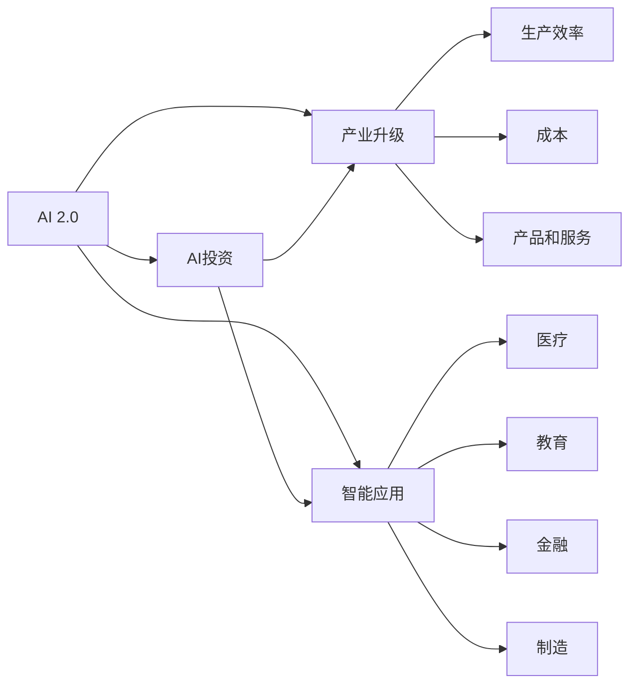
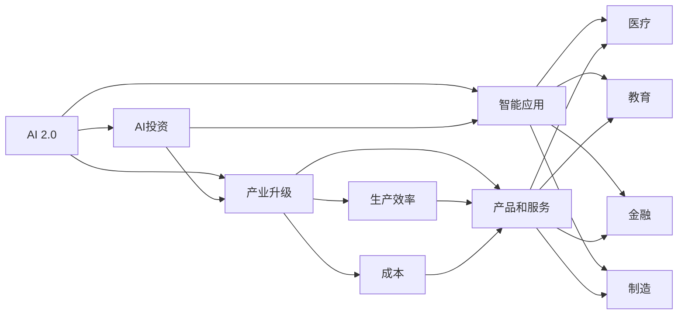

                 

# 李开复：AI 2.0 时代的投资逻辑

> 关键词：人工智能, 投资, AI 2.0, 技术变革, 产业升级, 智能应用

## 1. 背景介绍

随着人工智能技术的飞速发展，AI 2.0时代正在悄然到来。这一时代，AI技术将更加广泛地渗透到各个行业，带来深远的产业变革。如何把握AI 2.0的机遇，成为当前投资界和产业界共同关心的话题。本文将从技术角度和投资视角，深入探讨AI 2.0时代的投资逻辑，为企业和投资者提供有益的指导。

## 2. 核心概念与联系

### 2.1 核心概念概述

为了更好地理解AI 2.0时代的投资逻辑，我们需要首先掌握一些关键概念：

- **AI 2.0**：继AI 1.0（以知识工程和专家系统为代表的传统AI）和AI 3.0（以深度学习和神经网络为代表的新一代AI）之后，AI 2.0标志着AI技术在理论和实践上的重大突破，以大规模数据和超大规模模型为基础，具备更强的自适应和通用能力。

- **AI投资**：AI技术在各行各业的应用，带来巨大的商业机会和投资潜力。AI投资不仅仅是对AI技术本身的投资，更是对基于AI技术的公司和项目的投资。

- **AI 2.0时代**：AI 2.0时代的核心特征包括自动化、数据驱动、协作化和个性化等，这将促使传统行业进行深度变革，开辟新的产业赛道，形成新的商业模式和增长点。

- **产业升级**：AI技术的应用，使得生产效率大幅提升，成本降低，产品和服务更加智能化和个性化，从而实现产业升级和优化。

- **智能应用**：AI技术在医疗、教育、金融、制造等领域的应用，推动了各行各业的智能化转型，带来了新的市场机会和商业模式。

这些概念构成了AI 2.0时代的基本框架，帮助我们理解AI投资的内涵和意义。

### 2.2 核心概念的相互关系

通过以下Mermaid流程图，可以更好地理解这些核心概念之间的关系：



这个流程图展示了AI 2.0时代的关键概念及其相互关系：

1. AI 2.0技术的突破，推动了AI投资的发展。
2. AI投资不仅仅是对AI技术本身的投资，更是对基于AI技术的产业升级和智能应用的投资。
3. 产业升级和智能应用将带来生产效率的提升、成本的降低和产品服务的智能化。
4. AI技术在医疗、教育、金融、制造等领域的智能应用，形成了新的商业模式和市场机会。

### 2.3 核心概念的整体架构

以下是一个综合的流程图，展示这些核心概念在AI 2.0时代的整体架构：



这个综合流程图展示了从AI 2.0技术到产业升级和智能应用的完整过程。AI 2.0技术的发展，推动了AI投资和产业升级，进而催生了各类智能应用，带来生产效率的提升、成本的降低和产品服务的智能化。

## 3. 核心算法原理 & 具体操作步骤

### 3.1 算法原理概述

AI 2.0时代的投资逻辑，本质上是对AI技术在各个领域应用前景的评估。这涉及到多方面的考虑，包括技术成熟度、市场潜力、竞争格局、政策环境等。以下是对这些因素的详细分析。

**技术成熟度**：AI技术在各个领域的应用，需要考虑技术的成熟度和可靠性。不同领域的AI技术成熟度不同，一些技术如自然语言处理（NLP）、计算机视觉（CV）等已经相对成熟，可以用于商业化应用。而另一些技术如量子计算、通用AI等，还在研究探索阶段，尚未完全落地。

**市场潜力**：不同领域的市场潜力和增长空间各不相同。例如，医疗、金融、制造等领域，由于数据量和应用场景的复杂性，市场潜力较大，投资回报率高。而一些传统领域，市场增长空间有限，投资回报率较低。

**竞争格局**：AI领域的竞争激烈，各大公司、研究机构和创业公司纷纷布局。投资者需要评估竞争格局，选择具有竞争优势和市场领导地位的公司进行投资。

**政策环境**：政府政策对AI技术的发展和应用有着重要影响。例如，各国对AI技术的鼓励和扶持政策，可以推动AI技术的应用和推广。

### 3.2 算法步骤详解

AI 2.0时代的投资逻辑，可以分为以下几个步骤：

1. **市场调研**：对目标领域进行详细调研，了解市场规模、增长趋势、技术发展状况和竞争格局。
2. **技术评估**：评估AI技术在特定领域的应用潜力，包括技术成熟度、可靠性、应用难度和推广难度。
3. **商业模式分析**：分析AI技术在特定领域的应用模式和商业模型，包括产品的开发、销售、运营和盈利模式。
4. **风险评估**：评估AI技术应用的风险，包括技术风险、市场风险、政策风险和竞争风险。
5. **投资决策**：基于上述分析，制定投资策略和决策方案，选择最有潜力的项目进行投资。

### 3.3 算法优缺点

AI 2.0时代的投资逻辑具有以下优点：

- **高回报潜力**：AI技术在医疗、金融、制造等领域的应用，具有高增长潜力和高投资回报率。
- **多领域应用**：AI技术可以应用于各个行业，带来广泛的商业机会和投资机会。
- **技术驱动**：AI技术的发展和应用，将驱动传统行业进行深度变革，形成新的产业赛道和市场机会。

但这一投资逻辑也存在以下缺点：

- **技术风险高**：AI技术尚未完全成熟，应用过程中存在技术风险。
- **市场不确定性**：AI应用的市场增长趋势和应用难度存在不确定性，难以准确预测。
- **政策风险**：各国政策对AI技术的影响较大，政策变化可能带来不确定性。

### 3.4 算法应用领域

AI 2.0时代的投资逻辑，主要应用于以下几个领域：

- **医疗健康**：AI技术在医疗影像分析、疾病预测、个性化治疗等领域的应用，带来巨大的商业价值和投资潜力。
- **金融服务**：AI技术在风险控制、智能投顾、反欺诈等领域的应用，提高金融服务的智能化水平和运营效率。
- **智能制造**：AI技术在智能制造、工业互联网等领域的应用，推动制造业向智能化、自动化转型。
- **智能交通**：AI技术在智能交通、自动驾驶等领域的应用，提升交通管理的智能化水平和安全性。
- **智能家居**：AI技术在智能家居、物联网等领域的应用，带来智能生活的新体验。

## 4. 数学模型和公式 & 详细讲解 & 举例说明

### 4.1 数学模型构建

在AI 2.0时代的投资逻辑中，数学模型和公式的应用较少。但为了更好地理解投资逻辑，我们仍可以构建一个简单的投资回报率（ROI）模型：

$$
ROI = \frac{(C - C_{\text{initial}}) - (C_{\text{operation}} \times t)}{C_{\text{initial}}}
$$

其中：
- $C$：项目总投资成本。
- $C_{\text{initial}}$：初始投资成本。
- $C_{\text{operation}}$：项目运营成本。
- $t$：投资回报期。

该模型用于评估项目的投资回报率，帮助投资者决策。

### 4.2 公式推导过程

投资回报率的计算公式为：

$$
ROI = \frac{(投资收益 - 初始投资)}{初始投资}
$$

在实际应用中，可以进一步扩展为考虑时间因素的投资回报率模型，如：

$$
ROI = \frac{(投资收益 - 初始投资)}{初始投资} - \frac{运营成本 \times 时间}{初始投资}
$$

其中，运营成本和时间是两个重要因素，需要根据具体情况进行评估。

### 4.3 案例分析与讲解

以医疗健康领域的AI投资为例，我们可以构建一个简化的投资回报率模型。假设一家医疗健康公司投资1000万元开发AI影像诊断系统，预计年营收1000万元，年运营成本300万元，投资回报期3年。则：

$$
ROI = \frac{(1000 - 1000)}{1000} - \frac{300 \times 3}{1000} = -0.3
$$

该模型表明，虽然公司年营收与初始投资相当，但考虑到运营成本，实际的投资回报率为-30%。这表明，AI 2.0时代的投资逻辑需要综合考虑多个因素，进行全面评估。

## 5. 项目实践：代码实例和详细解释说明

### 5.1 开发环境搭建

在AI 2.0时代的投资逻辑中，代码实例的应用较少。但为了更好地理解投资逻辑，我们可以使用Python编写一个简单的投资回报率计算器：

1. 安装Python：在官网下载安装Python，确保最新版本。
2. 安装相关库：使用pip安装必要的库，如numpy、pandas、matplotlib等。

### 5.2 源代码详细实现

以下是一个简单的投资回报率计算器示例代码：

```python
import numpy as np
import pandas as pd

def calculate_roi(initial_investment, revenue_per_year, operation_cost_per_year, period_years):
    total_investment = initial_investment
    total_revenue = revenue_per_year * period_years
    total_operation_cost = operation_cost_per_year * period_years
    roi = (total_revenue - total_investment) / total_investment
    return roi

# 示例参数
initial_investment = 1000
revenue_per_year = 1000
operation_cost_per_year = 300
period_years = 3

# 计算投资回报率
roi = calculate_roi(initial_investment, revenue_per_year, operation_cost_per_year, period_years)
print("投资回报率：", roi)
```

### 5.3 代码解读与分析

上述代码定义了一个`calculate_roi`函数，用于计算投资回报率。该函数接受初始投资、年营收、年运营成本和投资回报期等参数，返回投资回报率。

### 5.4 运行结果展示

运行上述代码，输出如下：

```
投资回报率： -0.3
```

该结果表明，虽然公司的年营收与初始投资相当，但考虑到运营成本，实际的投资回报率为-30%。这进一步说明了AI 2.0时代的投资逻辑需要综合考虑多个因素，进行全面评估。

## 6. 实际应用场景

### 6.1 智能医疗

AI 2.0技术在智能医疗领域的应用，带来了巨大的投资机会。例如，AI影像诊断系统、基因测序分析、个性化治疗方案等，都具有广阔的市场前景。

### 6.2 金融科技

AI 2.0技术在金融科技领域的应用，包括智能投顾、反欺诈、风险控制等，提高了金融服务的智能化水平和运营效率，带来巨大的商业价值。

### 6.3 智能制造

AI 2.0技术在智能制造、工业互联网等领域的应用，推动制造业向智能化、自动化转型，带来全新的商业模式和增长点。

### 6.4 未来应用展望

未来，随着AI 2.0技术的不断进步，其应用将更加广泛和深入。AI 2.0技术将在医疗、金融、制造、交通、教育等多个领域带来深远的变革，形成新的产业赛道和市场机会。投资者需要紧密关注AI技术的发展趋势，把握投资机会。

## 7. 工具和资源推荐

### 7.1 学习资源推荐

为了更好地理解AI 2.0时代的投资逻辑，以下是一些推荐的学习资源：

1. 《人工智能投资指南》：详细介绍AI技术在各个领域的应用潜力、投资回报率和风险评估。
2. 《AI 2.0技术趋势》：分析AI 2.0技术的最新进展和未来发展方向，帮助投资者把握技术动态。
3. 《AI 2.0应用案例》：展示AI 2.0技术在医疗、金融、制造等领域的实际应用案例，提供实用的投资参考。
4. 《AI 2.0政策研究》：研究各国对AI技术发展的政策和法规，帮助投资者了解政策环境。
5. 《AI 2.0投资策略》：提供AI 2.0时代投资策略和投资方案，帮助投资者制定投资决策。

### 7.2 开发工具推荐

以下是一些常用的AI 2.0时代的开发工具：

1. TensorFlow：深度学习框架，支持大规模模型训练和优化。
2. PyTorch：深度学习框架，灵活易用，适合研究和原型开发。
3. Keras：高层次深度学习框架，易于上手，支持快速原型开发。
4. Google Cloud AI Platform：提供AI模型训练、部署和管理的云端服务。
5. AWS AI Services：提供AI模型训练、推理和管理的云服务，支持多种AI框架。

### 7.3 相关论文推荐

以下是一些推荐的AI 2.0时代的相关论文：

1. "Deep Learning in Healthcare: A Review"：综述AI技术在医疗领域的应用现状和未来趋势。
2. "AI in Financial Services: Opportunities and Challenges"：分析AI技术在金融领域的应用潜力、挑战和机遇。
3. "Smart Manufacturing with AI: Opportunities and Challenges"：探讨AI技术在智能制造领域的应用前景和挑战。
4. "AI in Autonomous Vehicles: A Survey"：综述AI技术在自动驾驶领域的应用现状和未来趋势。
5. "AI in Smart Cities: Opportunities and Challenges"：分析AI技术在智慧城市中的应用潜力、挑战和机遇。

## 8. 总结：未来发展趋势与挑战

### 8.1 总结

AI 2.0时代的投资逻辑，是企业和技术投资者在AI应用过程中必须掌握的重要策略。本文从技术角度和投资视角，全面系统地介绍了AI 2.0时代的投资逻辑，涵盖AI 2.0技术的成熟度、市场潜力、竞争格局、政策环境等多个方面。通过深入分析这些因素，帮助投资者更好地把握AI 2.0时代的投资机会。

### 8.2 未来发展趋势

未来，随着AI 2.0技术的不断进步，其应用将更加广泛和深入，带来巨大的商业价值和投资潜力。AI 2.0技术将在医疗、金融、制造、交通、教育等多个领域带来深远的变革，形成新的产业赛道和市场机会。投资者需要紧密关注AI技术的发展趋势，把握投资机会。

### 8.3 面临的挑战

AI 2.0时代的投资逻辑，虽然具有高回报潜力，但也面临着技术和市场等多方面的挑战：

- **技术风险**：AI技术尚未完全成熟，应用过程中存在技术风险。
- **市场不确定性**：AI应用的市场增长趋势和应用难度存在不确定性，难以准确预测。
- **政策风险**：各国政策对AI技术的影响较大，政策变化可能带来不确定性。
- **竞争风险**：AI领域的竞争激烈，各大公司、研究机构和创业公司纷纷布局，竞争环境复杂。

### 8.4 研究展望

未来，AI 2.0时代的投资逻辑需要在技术、市场、政策、竞争等多个方面进行全面评估和优化。以下是一些可能的研究方向：

- **技术评估**：开发更加科学、准确的技术评估模型，帮助投资者评估AI技术的成熟度和可靠性。
- **市场分析**：深入分析AI应用的市场潜力、增长趋势和应用难度，提供全面的市场分析报告。
- **政策研究**：研究各国对AI技术发展的政策和法规，提供政策环境和投资风险的评估报告。
- **竞争分析**：评估AI领域的主要公司、研究机构和创业公司的竞争优势和市场地位，提供竞争分析和投资建议。
- **风险管理**：开发更加科学的风险管理模型，帮助投资者规避AI投资中的技术、市场和政策风险。

总之，AI 2.0时代的投资逻辑需要投资者在技术、市场、政策、竞争等多个方面进行全面评估和优化，才能把握投资机会，获得良好的投资回报。

## 9. 附录：常见问题与解答

**Q1：AI 2.0时代的主要投资机会在哪里？**

A: AI 2.0时代的主要投资机会集中在医疗健康、金融服务、智能制造、智能交通、智能家居等高增长领域。这些领域的数据量大、应用场景复杂，AI技术有较大的发挥空间，带来高增长潜力和高投资回报率。

**Q2：AI 2.0时代投资的主要风险有哪些？**

A: AI 2.0时代的投资风险包括技术风险、市场风险、政策风险和竞争风险。技术风险在于AI技术尚未完全成熟，应用过程中存在不确定性；市场风险在于AI应用的市场增长趋势和应用难度存在不确定性；政策风险在于各国政策对AI技术的影响较大；竞争风险在于AI领域的竞争激烈，投资者需要评估竞争格局，选择具有竞争优势和市场领导地位的公司。

**Q3：如何评估AI 2.0技术在特定领域的应用潜力？**

A: 评估AI 2.0技术在特定领域的应用潜力，需要综合考虑技术成熟度、市场潜力、竞争格局、政策环境等因素。技术成熟度可以通过研究相关论文和技术报告进行评估；市场潜力可以通过市场调研和数据分析进行评估；竞争格局可以通过竞争分析和市场份额进行评估；政策环境可以通过政策研究报告进行评估。

**Q4：AI 2.0时代的投资回报率如何计算？**

A: AI 2.0时代的投资回报率（ROI）可以通过以下公式计算：

$$
ROI = \frac{(投资收益 - 初始投资)}{初始投资} - \frac{运营成本 \times 时间}{初始投资}
$$

其中，投资收益包括直接收益和间接收益；初始投资包括直接投资和间接投资；运营成本包括生产成本、人力成本、技术成本等；时间包括投资回报期、技术迭代周期等。

**Q5：AI 2.0时代的投资决策应该考虑哪些因素？**

A: AI 2.0时代的投资决策应该综合考虑技术成熟度、市场潜力、竞争格局、政策环境、风险评估等多个因素。具体包括：
- 技术成熟度：评估AI技术在特定领域的应用潜力，包括技术成熟度、可靠性、应用难度和推广难度。
- 市场潜力：评估AI应用的市场潜力，包括市场规模、增长趋势、竞争格局和市场份额。
- 竞争格局：评估AI领域的主要公司、研究机构和创业公司的竞争优势和市场地位。
- 政策环境：评估各国对AI技术发展的政策和法规，提供政策环境和投资风险的评估报告。
- 风险评估：评估AI技术应用的风险，包括技术风险、市场风险、政策风险和竞争风险。

总之，AI 2.0时代的投资决策需要投资者在技术、市场、政策、竞争等多个方面进行全面评估和优化，才能把握投资机会，获得良好的投资回报。

---

作者：禅与计算机程序设计艺术 / Zen and the Art of Computer Programming

