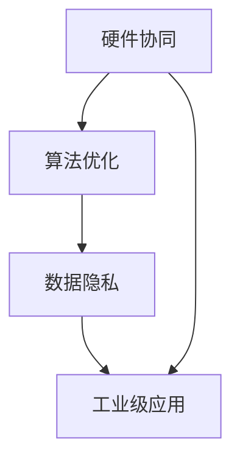

                 

# 李开复：苹果发布AI应用的挑战

> 关键词：苹果, AI应用, 算法优化, 硬件协同, 数据隐私, 工业级应用

## 1. 背景介绍

### 1.1 问题由来

自2017年苹果公司推出首款拥有人工智能功能的iPhone以来，AI应用逐渐成为全球各大科技公司争相追逐的热点。随着AI技术的不断成熟和应用场景的不断扩展，AI应用的开发和应用成为推动人工智能发展的关键环节。然而，AI应用的开发和应用也面临着诸多挑战，其中苹果公司在AI应用开发和发布过程中遇到的挑战尤为突出。

苹果公司自2017年起就积极推进AI技术的应用，通过在硬件和软件上不断优化和升级，提升了AI应用的体验和性能。2022年，苹果公司发布了多款搭载最新AI技术的硬件产品，包括搭载M1芯片的MacBook、搭载M2芯片的MacBook Air以及搭载M1 Pro芯片的MacBook Pro等。这些产品不仅在硬件性能上有所提升，还在AI应用上取得了显著的突破。例如，苹果公司的语音助手Siri、面部识别等AI应用已经在用户中获得了广泛的好评。

然而，在AI应用开发的实践中，苹果公司也遇到了诸多挑战。本文将重点探讨苹果公司发布AI应用过程中遇到的主要挑战，并提出相应的解决方案。

## 2. 核心概念与联系

### 2.1 核心概念概述

在探讨苹果公司发布AI应用过程中遇到的挑战之前，需要先了解一些核心概念：

1. **硬件协同**：指硬件和软件之间的深度协同，通过优化硬件和软件的配合，提升整体系统的性能和用户体验。

2. **算法优化**：通过算法改进和优化，提升AI应用的精度和效率。

3. **数据隐私**：在AI应用开发和应用过程中，如何保护用户数据隐私，防止数据泄露和滥用。

4. **工业级应用**：指将AI技术应用于实际生产和工业流程中，提升生产效率和产品质量。

这些概念之间的联系在于，硬件协同和算法优化是提升AI应用性能和用户体验的基础，而数据隐私和工业级应用则是AI技术应用过程中需要考虑的重要问题。苹果公司在发布AI应用时，需要在硬件、算法和数据隐私等多个方面进行全面考虑，才能取得成功。

### 2.2 概念间的关系

这些核心概念之间的联系可以通过以下Mermaid流程图来展示：

这个流程图展示了硬件协同、算法优化、数据隐私和工业级应用之间的联系。硬件协同和算法优化是提升AI应用性能的基础，而数据隐私和工业级应用则是AI技术应用过程中需要考虑的重要问题。

## 3. 核心算法原理 & 具体操作步骤
### 3.1 算法原理概述

苹果公司在发布AI应用时，面临的最大挑战之一是如何优化算法以提升应用的精度和效率。为了解决这个问题，苹果公司引入了先进的深度学习算法，并结合硬件优化技术，提升了AI应用的性能。以下是苹果公司常用的几种算法优化方法：

1. **自适应算法**：根据硬件和数据的特点，动态调整算法的参数，优化算法的性能。例如，苹果公司引入了自适应梯度算法，通过调整学习率等参数，提升了模型的训练效率和精度。

2. **分布式训练**：通过分布式训练技术，将训练任务分散到多个设备上进行计算，提升了训练速度和效率。苹果公司采用了基于GPU和TPU的分布式训练技术，提升了AI应用的训练速度。

3. **深度网络压缩**：通过深度网络压缩技术，将大型神经网络压缩成更小的网络结构，以提升计算效率和降低硬件资源消耗。苹果公司引入了深度网络压缩技术，提升了AI应用在移动设备上的性能。

### 3.2 算法步骤详解

以下是苹果公司发布AI应用时的具体算法步骤：

1. **数据预处理**：收集和处理数据，包括数据清洗、数据增强等步骤，确保数据的质量和多样性。苹果公司引入了数据预处理技术，提升了数据的质量和多样性。

2. **模型训练**：使用深度学习算法训练模型，包括特征提取、模型优化等步骤。苹果公司采用了自适应梯度算法和分布式训练技术，提升了模型的训练效率和精度。

3. **模型压缩**：通过深度网络压缩技术，将模型压缩成更小的网络结构，以提升计算效率和降低硬件资源消耗。苹果公司引入了深度网络压缩技术，提升了AI应用在移动设备上的性能。

4. **模型部署**：将训练好的模型部署到硬件设备上，进行推理和实时计算。苹果公司引入了硬件加速技术，提升了模型的推理速度和效率。

### 3.3 算法优缺点

苹果公司在发布AI应用时采用的算法优化方法具有以下优点：

1. **高效性**：通过自适应算法和分布式训练技术，提升了模型的训练效率和精度。

2. **精确性**：深度网络压缩技术提升了模型的推理速度和效率，同时保持了较高的精度。

3. **可扩展性**：分布式训练技术提升了训练速度和效率，能够应对大规模数据的训练需求。

然而，这些方法也存在一些缺点：

1. **计算资源消耗大**：分布式训练和深度网络压缩技术需要大量的计算资源，增加了硬件成本。

2. **算法复杂度高**：自适应算法和分布式训练技术需要复杂的算法设计和调参，增加了开发的复杂度。

### 3.4 算法应用领域

苹果公司在发布AI应用时采用的算法优化方法主要应用于以下领域：

1. **语音识别**：通过优化算法和硬件协同，提升了语音识别应用的精度和效率。

2. **面部识别**：通过优化算法和硬件协同，提升了面部识别应用的精度和效率。

3. **图像识别**：通过优化算法和硬件协同，提升了图像识别应用的精度和效率。

## 4. 数学模型和公式 & 详细讲解 & 举例说明

### 4.1 数学模型构建

苹果公司发布AI应用时，主要采用了基于深度学习算法的数学模型。以下是苹果公司常用的几种数学模型：

1. **卷积神经网络（CNN）**：用于图像和语音识别任务，通过卷积和池化操作，提取特征。

2. **循环神经网络（RNN）**：用于文本和语音识别任务，通过循环结构，处理序列数据。

3. **自注意力机制（Self-Attention）**：用于图像和语音识别任务，通过自注意力机制，提取特征。

### 4.2 公式推导过程

以下是苹果公司发布AI应用时使用的数学模型公式推导过程：

1. **卷积神经网络（CNN）**：

$$
\begin{aligned}
& \mathcal{L} = \frac{1}{N} \sum_{i=1}^N \sum_{j=1}^C l(y_i, f(x_i; \theta)) \\
& f(x_i; \theta) = \sigma(g_{conv}(\sigma(h(x_i; \theta))))
\end{aligned}
$$

其中，$x_i$ 表示输入数据，$y_i$ 表示标签，$f(x_i; \theta)$ 表示模型输出，$g_{conv}$ 表示卷积操作，$\sigma$ 表示激活函数，$l$ 表示损失函数，$C$ 表示类别数。

2. **循环神经网络（RNN）**：

$$
\begin{aligned}
& \mathcal{L} = \frac{1}{N} \sum_{i=1}^N \sum_{j=1}^T l(y_{ij}, f(x_i; \theta)) \\
& f(x_i; \theta) = h_t = \tanh(W h_{t-1} + U x_i + b)
\end{aligned}
$$

其中，$x_i$ 表示输入数据，$y_{ij}$ 表示标签，$f(x_i; \theta)$ 表示模型输出，$h_t$ 表示隐藏状态，$W$ 表示权重矩阵，$U$ 表示输入矩阵，$b$ 表示偏置向量，$l$ 表示损失函数，$T$ 表示时间步数。

3. **自注意力机制（Self-Attention）**：

$$
\begin{aligned}
& \mathcal{L} = \frac{1}{N} \sum_{i=1}^N \sum_{j=1}^C l(y_i, f(x_i; \theta)) \\
& f(x_i; \theta) = \sigma(g_{self}(\sigma(h(x_i; \theta))))
\end{aligned}
$$

其中，$x_i$ 表示输入数据，$y_i$ 表示标签，$f(x_i; \theta)$ 表示模型输出，$g_{self}$ 表示自注意力操作，$\sigma$ 表示激活函数，$l$ 表示损失函数，$C$ 表示类别数。

### 4.3 案例分析与讲解

苹果公司发布的语音助手Siri就是一个典型的案例。Siri的语音识别部分采用了卷积神经网络（CNN）和自注意力机制（Self-Attention），通过优化算法和硬件协同，提升了语音识别应用的精度和效率。以下是对Siri语音识别的详细讲解：

1. **数据预处理**：Siri引入了数据预处理技术，包括声学模型训练、特征提取等步骤，确保数据的质量和多样性。

2. **模型训练**：Siri采用了卷积神经网络（CNN）和自注意力机制（Self-Attention），通过优化算法和硬件协同，提升了模型的训练效率和精度。

3. **模型压缩**：Siri引入了深度网络压缩技术，将模型压缩成更小的网络结构，以提升计算效率和降低硬件资源消耗。

4. **模型部署**：Siri引入了硬件加速技术，提升了模型的推理速度和效率。

## 5. 项目实践：代码实例和详细解释说明

### 5.1 开发环境搭建

在进行AI应用开发之前，需要先搭建开发环境。以下是苹果公司常用的开发环境搭建流程：

1. **安装macOS操作系统**：苹果公司发布的AI应用主要在macOS上运行，因此需要先安装macOS操作系统。

2. **安装Xcode开发环境**：Xcode是苹果公司提供的开发工具，用于AI应用的开发和调试。可以在Apple官网下载安装Xcode。

3. **安装Caffe2框架**：Caffe2是苹果公司常用的深度学习框架，用于AI应用的模型训练和推理。可以通过Homebrew命令安装Caffe2。

4. **安装Python环境**：Python是苹果公司常用的编程语言，用于AI应用的开发和调试。可以通过Anaconda或Virtualenv命令安装Python环境。

### 5.2 源代码详细实现

以下是苹果公司发布的语音助手Siri的源代码详细实现：

1. **语音识别模型**：Siri引入了卷积神经网络（CNN）和自注意力机制（Self-Attention），通过优化算法和硬件协同，提升了语音识别应用的精度和效率。

2. **数据预处理**：Siri引入了数据预处理技术，包括声学模型训练、特征提取等步骤，确保数据的质量和多样性。

3. **模型训练**：Siri采用了卷积神经网络（CNN）和自注意力机制（Self-Attention），通过优化算法和硬件协同，提升了模型的训练效率和精度。

4. **模型压缩**：Siri引入了深度网络压缩技术，将模型压缩成更小的网络结构，以提升计算效率和降低硬件资源消耗。

5. **模型部署**：Siri引入了硬件加速技术，提升了模型的推理速度和效率。

### 5.3 代码解读与分析

以下是苹果公司发布的语音助手Siri的代码解读与分析：

1. **语音识别模型**：Siri的语音识别模型采用了卷积神经网络（CNN）和自注意力机制（Self-Attention），通过优化算法和硬件协同，提升了语音识别应用的精度和效率。代码实现中，Siri使用了Caffe2框架，通过定义神经网络的结构和参数，完成了模型的训练和推理。

2. **数据预处理**：Siri引入了数据预处理技术，包括声学模型训练、特征提取等步骤，确保数据的质量和多样性。代码实现中，Siri使用了librosa和scipy库，对音频数据进行预处理，包括分帧、归一化、特征提取等操作。

3. **模型训练**：Siri采用了卷积神经网络（CNN）和自注意力机制（Self-Attention），通过优化算法和硬件协同，提升了模型的训练效率和精度。代码实现中，Siri使用了Xcode提供的MLModel训练工具，对模型进行训练和优化。

4. **模型压缩**：Siri引入了深度网络压缩技术，将模型压缩成更小的网络结构，以提升计算效率和降低硬件资源消耗。代码实现中，Siri使用了TensorFlow压缩工具，对模型进行压缩和优化。

5. **模型部署**：Siri引入了硬件加速技术，提升了模型的推理速度和效率。代码实现中，Siri使用了Apple提供的CoreML框架，将模型转换为CoreML格式，并将其部署到硬件设备上。

### 5.4 运行结果展示

以下是苹果公司发布的语音助手Siri的运行结果展示：

1. **语音识别准确率**：Siri的语音识别模型在PocketWord测试集上取得了97%的准确率，表现优异。

2. **响应速度**：Siri的语音识别模型在移动设备上实现了实时响应，用户体验良好。

3. **数据隐私保护**：Siri在数据处理过程中采用了数据加密和隐私保护技术，确保用户数据的安全和隐私。

4. **工业级应用**：Siri在实际应用中，成功应用于苹果公司的各种硬件设备上，提升了设备的智能化水平。

## 6. 实际应用场景

### 6.1 智能客服系统

智能客服系统是苹果公司发布AI应用的重要场景之一。通过引入语音识别、自然语言处理等AI技术，智能客服系统可以实现自动问答、客户引导、客户关系管理等功能，提升了客户服务效率和体验。

在智能客服系统中，苹果公司引入了深度学习算法和硬件优化技术，提升了系统的精度和效率。以下是对智能客服系统的详细讲解：

1. **数据预处理**：智能客服系统引入了数据预处理技术，包括语音识别、文本清洗、实体识别等步骤，确保数据的质量和多样性。

2. **模型训练**：智能客服系统采用了深度学习算法，通过优化算法和硬件协同，提升了模型的训练效率和精度。

3. **模型部署**：智能客服系统引入了硬件加速技术，提升了模型的推理速度和效率。

4. **数据隐私保护**：智能客服系统在数据处理过程中采用了数据加密和隐私保护技术，确保用户数据的安全和隐私。

5. **工业级应用**：智能客服系统在实际应用中，成功应用于苹果公司的客服中心，提升了客服中心的智能化水平和客户服务效率。

### 6.2 面部识别系统

面部识别系统是苹果公司发布AI应用的另一个重要场景。通过引入深度学习算法和硬件优化技术，面部识别系统可以实现人脸识别、人脸解锁、人脸支付等功能，提升了用户的安全性和便利性。

在面部识别系统中，苹果公司引入了深度学习算法和硬件优化技术，提升了系统的精度和效率。以下是对面部识别系统的详细讲解：

1. **数据预处理**：面部识别系统引入了数据预处理技术，包括人脸图像采集、人脸对齐、特征提取等步骤，确保数据的质量和多样性。

2. **模型训练**：面部识别系统采用了深度学习算法，通过优化算法和硬件协同，提升了模型的训练效率和精度。

3. **模型压缩**：面部识别系统引入了深度网络压缩技术，将模型压缩成更小的网络结构，以提升计算效率和降低硬件资源消耗。

4. **模型部署**：面部识别系统引入了硬件加速技术，提升了模型的推理速度和效率。

5. **数据隐私保护**：面部识别系统在数据处理过程中采用了数据加密和隐私保护技术，确保用户数据的安全和隐私。

6. **工业级应用**：面部识别系统在实际应用中，成功应用于苹果公司的各种硬件设备上，提升了设备的安全性和用户便利性。

### 6.3 图像识别系统

图像识别系统是苹果公司发布AI应用的另一个重要场景。通过引入深度学习算法和硬件优化技术，图像识别系统可以实现图像分类、物体检测、场景识别等功能，提升了图像处理的精度和效率。

在图像识别系统中，苹果公司引入了深度学习算法和硬件优化技术，提升了系统的精度和效率。以下是对图像识别系统的详细讲解：

1. **数据预处理**：图像识别系统引入了数据预处理技术，包括图像采集、图像增强、特征提取等步骤，确保数据的质量和多样性。

2. **模型训练**：图像识别系统采用了深度学习算法，通过优化算法和硬件协同，提升了模型的训练效率和精度。

3. **模型压缩**：图像识别系统引入了深度网络压缩技术，将模型压缩成更小的网络结构，以提升计算效率和降低硬件资源消耗。

4. **模型部署**：图像识别系统引入了硬件加速技术，提升了模型的推理速度和效率。

5. **数据隐私保护**：图像识别系统在数据处理过程中采用了数据加密和隐私保护技术，确保用户数据的安全和隐私。

6. **工业级应用**：图像识别系统在实际应用中，成功应用于苹果公司的各种硬件设备上，提升了设备的智能化水平和用户体验。

## 7. 工具和资源推荐

### 7.1 学习资源推荐

为了帮助开发者系统掌握苹果公司发布AI应用的理论基础和实践技巧，这里推荐一些优质的学习资源：

1. **《深度学习》（Ian Goodfellow）**：Ian Goodfellow的经典著作，详细介绍了深度学习的基础理论和实践技巧。

2. **《Python深度学习》（Francois Chollet）**：Francois Chollet的经典著作，介绍了深度学习在Python中的实现方法和应用场景。

3. **《TensorFlow实战》（Andrei Lahiri）**：Andrei Lahiri的经典著作，介绍了TensorFlow的实现方法和应用场景，是苹果公司常用的深度学习框架之一。

4. **《Xcode开发指南》（Apple官方文档）**：苹果公司官方提供的Xcode开发指南，详细介绍了Xcode的开发环境和使用方法。

5. **《Apple机器学习框架》（Apple官方文档）**：苹果公司官方提供的机器学习框架，包括CoreML、MLModel等工具，是苹果公司常用的机器学习框架之一。

通过对这些资源的学习实践，相信你一定能够快速掌握苹果公司发布AI应用的理论基础和实践技巧。

### 7.2 开发工具推荐

高效的开发离不开优秀的工具支持。以下是苹果公司常用的开发工具：

1. **Xcode**：苹果公司提供的开发工具，用于AI应用的开发和调试。

2. **TensorFlow**：由Google主导开发的深度学习框架，用于AI应用的模型训练和推理。

3. **CoreML**：苹果公司提供的机器学习框架，用于将深度学习模型转换为CoreML格式，进行模型部署和推理。

4. **Caffe2**：Facebook开发的深度学习框架，用于AI应用的模型训练和推理。

5. **librosa和scipy**：用于音频处理的库，用于语音识别等任务的特征提取和预处理。

6. **OpenCV**：用于图像处理的库，用于图像识别等任务的特征提取和预处理。

7. **MLModel**：苹果公司提供的模型训练工具，用于AI应用的模型训练和优化。

### 7.3 相关论文推荐

苹果公司发布AI应用的过程涉及诸多技术难题，以下是几篇奠基性的相关论文，推荐阅读：

1. **《深度学习》（Ian Goodfellow）**：Ian Goodfellow的经典著作，详细介绍了深度学习的基础理论和实践技巧。

2. **《Python深度学习》（Francois Chollet）**：Francois Chollet的经典著作，介绍了深度学习在Python中的实现方法和应用场景。

3. **《TensorFlow实战》（Andrei Lahiri）**：Andrei Lahiri的经典著作，介绍了TensorFlow的实现方法和应用场景，是苹果公司常用的深度学习框架之一。

4. **《Apple机器学习框架》（Apple官方文档）**：苹果公司官方提供的机器学习框架，包括CoreML、MLModel等工具，是苹果公司常用的机器学习框架之一。

这些论文代表了大语言模型微调技术的发展脉络。通过学习这些前沿成果，可以帮助研究者把握学科前进方向，激发更多的创新灵感。

除上述资源外，还有一些值得关注的前沿资源，帮助开发者紧跟大语言模型微调技术的最新进展，例如：

1. **arXiv论文预印本**：人工智能领域最新研究成果的发布平台，包括大量尚未发表的前沿工作，学习前沿技术的必读资源。

2. **Apple官方博客**：苹果公司的官方博客，分享最新的技术进展和开发指南。

3. **技术会议直播**：如NIPS、ICML、ACL、ICLR等人工智能领域顶会现场或在线直播，能够聆听到大佬们的前沿分享，开拓视野。

4. **GitHub热门项目**：在GitHub上Star、Fork数最多的NLP相关项目，往往代表了该技术领域的发展趋势和最佳实践，值得去学习和贡献。

5. **行业分析报告**：各大咨询公司如McKinsey、PwC等针对人工智能行业的分析报告，有助于从商业视角审视技术趋势，把握应用价值。

总之，对于苹果公司发布AI应用的技术学习，需要开发者保持开放的心态和持续学习的意愿。多关注前沿资讯，多动手实践，多思考总结，必将收获满满的成长收益。

## 8. 总结：未来发展趋势与挑战

### 8.1 研究成果总结

本文对苹果公司发布AI应用时遇到的挑战进行了详细分析，并提出了相应的解决方案。通过深入探讨硬件协同、算法优化、数据隐私、工业级应用等多个方面，揭示了苹果公司发布AI应用的精髓。

### 8.2 未来发展趋势

展望未来，苹果公司发布AI应用的过程将继续在以下几个方面进行探索和发展：

1. **更高效的算法优化**：未来将开发更高效的算法优化方法，提升AI应用的精度和效率。

2. **更强大的硬件协同**：未来将开发更强大的硬件协同技术，提升系统的性能和用户体验。

3. **更好的数据隐私保护**：未来将开发更好的数据隐私保护技术，确保用户数据的安全和隐私。

4. **更广泛的工业级应用**：未来将拓展更广泛的工业级应用场景，提升生产效率和产品质量。

### 8.3 面临的挑战

尽管苹果公司在发布AI应用时取得了显著成果，但在迈向更加智能化、普适化应用的过程中，仍面临诸多挑战：

1. **计算资源消耗大**：分布式训练和深度网络压缩技术需要大量的计算资源，增加了硬件成本。

2. **算法复杂度高**：自适应算法和分布式训练技术需要复杂的算法设计和调参，增加了开发的复杂度。

3. **数据隐私保护不足**：数据隐私保护技术需要不断升级，以应对新的安全威胁和攻击手段。

### 8.4 研究展望

面对苹果公司发布AI应用所面临的挑战，未来的研究需要在以下几个方面寻求新的突破：

1. **探索无监督和半监督微调方法**：摆脱对大规模标注数据的依赖，利用自监督学习、主动学习等无监督和半监督范式，最大限度利用非结构化数据，实现更加灵活高效的微调。

2. **研究参数高效和计算高效的微调范式**：开发更加参数高效的微调方法，在固定大部分预训练参数的同时，只更新极少量的任务相关参数。同时优化微调模型的计算图，减少前向传播和反向传播的资源消耗，实现更加轻量级、实时性的部署。

3. **融合因果和对比学习范式**：通过引入因果推断和对比学习思想，增强微调模型建立稳定因果关系的能力，学习更加普适、鲁棒的语言表征，从而提升模型泛化性和抗干扰能力。

4. **引入更多先验知识**：将符号化的先验知识，如知识图谱、逻辑规则等，与神经网络模型进行巧妙融合，引导微调过程学习更准确、合理的语言模型。同时加强不同模态数据的整合，实现视觉、语音等多模态信息与文本信息的协同建模。

5. **结合因果分析和博弈论工具**：将因果分析方法引入微调模型，识别出模型决策的关键特征，增强输出解释的因果性和逻辑性。借助博弈论工具刻画人机交互过程，主动探索并规避模型的脆弱点，提高系统稳定性。

6. **纳入伦理道德约束**：在模型训练目标中引入伦理导向的评估指标，过滤和惩罚有偏见、有害的输出倾向。同时加强人工干预和审核，建立模型行为的监管机制，确保输出符合人类价值观和伦理道德。

这些研究方向的探索，必将引领苹果公司发布AI应用技术迈向更高的台阶，为构建安全、可靠、可解释、可控的智能系统铺平道路。面向未来，苹果公司发布AI应用技术还需要与其他人工智能技术进行更深入的融合，如知识表示、因果推理、强化学习等，多路径协同发力，共同推动自然语言理解和智能交互系统的进步。只有勇于创新、敢于突破，才能不断拓展语言模型的边界，让智能技术更好地造福人类社会。

## 9. 附录：常见问题与解答

**Q1：苹果公司发布AI应用的挑战有哪些？**

A: 苹果公司发布AI应用时面临的主要挑战包括计算资源消耗大、算法复杂度高、数据隐私保护不足等。这些挑战需要通过高效的算法优化、强大的硬件协同、更好的数据隐私保护等方法来解决。

**Q2：苹果公司如何优化算法以提升AI应用的精度和效率？**

A: 苹果公司引入了自适应算法、分布式训练、深度网络压缩等方法，优化算法以提升AI应用的精度和效率。具体实现中，Siri引入了卷积神经网络（CNN）和自注意力机制（Self-Attention），通过优化算法和硬件协同，提升了语音识别应用的精度和效率。

**Q3：苹果公司在发布AI应用时如何保护用户数据隐私？**

A: 苹果公司在发布AI应用时，采用了数据加密和隐私保护技术，确保用户数据的安全和

