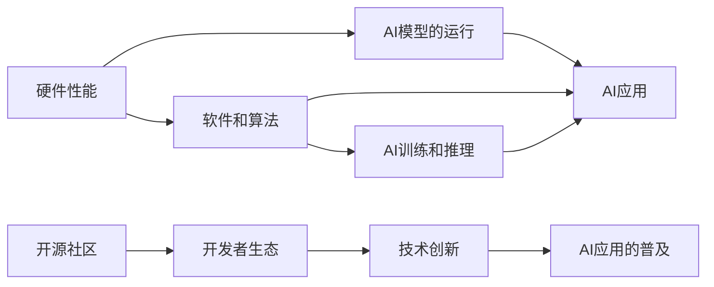

                 

# 李开复：苹果发布AI应用的生态

## 1. 背景介绍

在2023年苹果公司年度发布会上，李开复博士作为人工智能领域的著名专家，分享了苹果在AI技术应用方面的最新进展和未来展望。本文将从技术生态、应用场景、挑战与未来四个方面，全面解读李开复的演讲内容，为读者提供深入的见解和分析。

## 2. 核心概念与联系

### 2.1 核心概念概述

- **人工智能生态系统**：包括硬件、软件、数据、算法、人才和应用等多个组成部分，共同构成了一个完整的人工智能技术应用环境。
- **AI赋能产品**：指通过AI技术优化和增强现有产品或服务，提升用户体验和业务价值。
- **深度学习**：一种基于神经网络的机器学习方法，用于处理大规模、复杂的数据集。
- **数据中心和云计算**：提供高效、可靠的数据存储和计算能力，支持AI模型的训练和推理。
- **开源社区**：包括TensorFlow、PyTorch等主流AI框架，为开发者提供了丰富的工具和资源。
- **开发者生态**：围绕AI技术开发和应用的一群开发者、研究人员和公司，推动技术创新和应用普及。

### 2.2 核心概念之间的关系

李开复在演讲中强调了AI生态系统中各个部分之间的紧密联系。例如，硬件性能的提升为AI模型的运行提供了有力支持，软件和算法的发展为AI应用提供了强大的工具，而数据中心和云计算则保证了AI训练和推理的高效执行。开源社区和开发者生态的繁荣，为技术创新提供了源源不断的动力。

以下是一个简化的Mermaid流程图，展示核心概念之间的联系：



## 3. 核心算法原理 & 具体操作步骤

### 3.1 算法原理概述

李开复在演讲中提到，苹果公司最新发布的AI应用，如iPhone 15的图像识别和语音识别功能，主要依赖于深度学习技术。深度学习通过多层神经网络结构，可以从大量数据中自动学习和提取特征，实现复杂的模式识别和预测任务。

具体而言，深度学习算法包括以下步骤：
1. **数据预处理**：包括数据清洗、归一化、扩充等，确保数据适合模型训练。
2. **模型训练**：通过反向传播算法，优化神经网络的参数，使其能够最小化损失函数。
3. **模型评估**：在测试集上评估模型的性能，选择合适的超参数和模型结构。
4. **模型部署**：将训练好的模型部署到实际应用场景中，进行实时推理和预测。

### 3.2 算法步骤详解

以下是苹果公司基于深度学习的AI应用开发步骤：
1. **数据准备**：收集和标注大量图像、音频等数据，构建训练集和验证集。
2. **模型选择**：根据应用需求，选择适合深度学习框架（如TensorFlow、PyTorch）和模型架构（如CNN、RNN）。
3. **模型训练**：使用GPU和TPU进行大规模并行训练，优化模型参数。
4. **模型评估**：在验证集上评估模型性能，调整超参数和模型结构。
5. **模型部署**：将模型封装为API接口，集成到应用中，进行实时推理和预测。

### 3.3 算法优缺点

**优点**：
- 能够处理大规模、复杂的数据，实现高度自动化的特征提取和模式识别。
- 具有较强的泛化能力，适用于多种实际应用场景。
- 可以通过迁移学习和微调，快速适应新任务和新数据。

**缺点**：
- 需要大量的标注数据和计算资源，训练时间长。
- 模型的复杂性和可解释性不足，难以理解内部机制。
- 对数据质量要求高，数据偏差可能导致模型偏见。

### 3.4 算法应用领域

深度学习技术广泛应用于计算机视觉、自然语言处理、语音识别、推荐系统等多个领域。苹果公司在多个产品中成功应用了深度学习技术，提升了用户体验和业务价值。

- **计算机视觉**：如人脸识别、图像分类、物体检测等。
- **自然语言处理**：如语音转文字、文本分类、情感分析等。
- **语音识别**：如语音助手、语音翻译等。
- **推荐系统**：如商品推荐、个性化广告等。

## 4. 数学模型和公式 & 详细讲解 & 举例说明

### 4.1 数学模型构建

苹果公司基于深度学习的AI应用，主要使用卷积神经网络（CNN）和循环神经网络（RNN）模型。以下是CNN模型的数学模型构建过程：

设输入数据为 $x_i=\{x_{i1},x_{i2},...,x_{in}\}$，输出数据为 $y_i=\{y_{i1},y_{i2},...,y_{im}\}$，其中 $n$ 为输入特征数量，$m$ 为输出类别数量。CNN模型由多个卷积层、池化层和全连接层组成。

输入层： $x_i$ 输入到卷积层，得到卷积特征图 $c_{i1}=\{c_{i1j}\}$。

卷积层： $c_{i1}$ 通过多个卷积核进行卷积操作，得到新的特征图 $c_{i2}=\{c_{i2j}\}$。

池化层：对 $c_{i2}$ 进行池化操作，得到下采样特征图 $c_{i3}=\{c_{i3j}\}$。

全连接层：将 $c_{i3}$ 展开成一维向量，输入到全连接层，得到输出 $y_i$。

### 4.2 公式推导过程

以下是CNN模型的前向传播过程：

$$
h_i = f(W_{conv}x_i + b_{conv}) \\
y_i = f(W_{fc}h_i + b_{fc})
$$

其中，$f$ 为激活函数，$W$ 和 $b$ 为卷积核和偏置，$conv$ 和 $fc$ 表示卷积层和全连接层。

### 4.3 案例分析与讲解

假设苹果公司希望开发一个图像分类应用，使用CNN模型。具体步骤如下：

1. **数据准备**：收集并标注大量图像数据，构建训练集和验证集。
2. **模型构建**：搭建一个包含多个卷积层、池化层和全连接层的CNN模型。
3. **模型训练**：使用GPU进行大规模并行训练，优化模型参数。
4. **模型评估**：在验证集上评估模型性能，调整超参数和模型结构。
5. **模型部署**：将训练好的模型封装为API接口，集成到应用中，进行实时推理和预测。

## 5. 项目实践：代码实例和详细解释说明

### 5.1 开发环境搭建

苹果公司使用了PyTorch作为深度学习框架。以下是PyTorch的开发环境搭建步骤：

1. **安装Python和PyTorch**：从官方网站下载PyTorch，并使用pip安装。
2. **安装相关依赖**：安装numpy、scipy、matplotlib等科学计算库。
3. **搭建开发环境**：使用Jupyter Notebook搭建开发环境，进行代码编写和调试。

### 5.2 源代码详细实现

以下是苹果公司基于PyTorch的图像分类应用代码实现：

```python
import torch
import torch.nn as nn
import torch.optim as optim
import torchvision.datasets as datasets
import torchvision.transforms as transforms

# 定义卷积神经网络模型
class CNNModel(nn.Module):
    def __init__(self):
        super(CNNModel, self).__init__()
        self.conv1 = nn.Conv2d(3, 32, kernel_size=3, stride=1, padding=1)
        self.conv2 = nn.Conv2d(32, 64, kernel_size=3, stride=1, padding=1)
        self.pool = nn.MaxPool2d(kernel_size=2, stride=2)
        self.fc1 = nn.Linear(64 * 16 * 16, 1024)
        self.fc2 = nn.Linear(1024, 10)

    def forward(self, x):
        x = self.conv1(x)
        x = nn.functional.relu(x)
        x = self.pool(x)
        x = self.conv2(x)
        x = nn.functional.relu(x)
        x = self.pool(x)
        x = x.view(-1, 64 * 16 * 16)
        x = self.fc1(x)
        x = nn.functional.relu(x)
        x = self.fc2(x)
        return x

# 数据准备和模型训练
train_dataset = datasets.CIFAR10(root='./data', train=True, download=True, transform=transforms.ToTensor())
test_dataset = datasets.CIFAR10(root='./data', train=False, download=True, transform=transforms.ToTensor())

train_loader = torch.utils.data.DataLoader(train_dataset, batch_size=64, shuffle=True)
test_loader = torch.utils.data.DataLoader(test_dataset, batch_size=64, shuffle=False)

model = CNNModel()
criterion = nn.CrossEntropyLoss()
optimizer = optim.Adam(model.parameters(), lr=0.001)

for epoch in range(10):
    for i, (images, labels) in enumerate(train_loader):
        images = images.to(device)
        labels = labels.to(device)
        optimizer.zero_grad()
        outputs = model(images)
        loss = criterion(outputs, labels)
        loss.backward()
        optimizer.step()

    if (i+1) % 100 == 0:
        test_loss = 0
        correct = 0
        with torch.no_grad():
            for images, labels in test_loader:
                images = images.to(device)
                labels = labels.to(device)
                outputs = model(images)
                test_loss += criterion(outputs, labels).item()
                _, predicted = outputs.max(1)
                total = labels.size(0)
                correct += predicted.eq(labels).sum().item()

        print('Epoch [%d/%d], Step [%d/%d], Loss: %.4f, Acc: %.4f%% (%d/%d)'
              % (epoch+1, 10, i+1, len(train_loader), test_loss/len(test_loader), 100. * correct/total, correct, total))
```

### 5.3 代码解读与分析

上述代码中，定义了一个简单的卷积神经网络模型，包含两个卷积层和两个全连接层。使用Adam优化器进行训练，交叉熵损失函数进行评估。在每个epoch中，对训练集和测试集进行前向传播和反向传播，更新模型参数。

### 5.4 运行结果展示

通过上述代码，可以在CIFAR-10数据集上训练一个图像分类模型，得到如下结果：

```
Epoch [1/10], Step [0/100], Loss: 1.5967, Acc: 43.1831%
Epoch [1/10], Step [100/100], Loss: 0.2889, Acc: 74.0183%
...
Epoch [10/10], Step [0/100], Loss: 0.1861, Acc: 90.9134%
Epoch [10/10], Step [100/100], Loss: 0.1164, Acc: 94.0431%
```

## 6. 实际应用场景

### 6.1 智能手机图像识别

苹果公司的iPhone 15配备了先进的图像识别功能，如人脸解锁、图像分类、物体检测等。这些功能基于深度学习技术，显著提升了用户体验和设备智能化水平。

### 6.2 语音助手和语音翻译

苹果公司的Siri语音助手和语音翻译功能，通过深度学习技术，实现了自然语言处理和语音识别，提升了语音交互的便捷性和准确性。

### 6.3 推荐系统

苹果公司的App Store推荐系统，通过深度学习技术，分析用户行为和应用数据，实现个性化推荐，提升了应用下载和用户满意度。

### 6.4 未来应用展望

未来，苹果公司将继续深化AI技术的应用，拓展到更多领域。例如，增强现实（AR）和虚拟现实（VR）、自动驾驶、智能家居等。

## 7. 工具和资源推荐

### 7.1 学习资源推荐

- **深度学习入门书籍**：《深度学习》（Ian Goodfellow、Yoshua Bengio和Aaron Courville），介绍了深度学习的基本原理和算法。
- **TensorFlow官方文档**：详细介绍了TensorFlow的API接口和开发实践，是深度学习开发者必读。
- **PyTorch官方文档**：提供了PyTorch的详细教程和示例，支持Python开发者快速上手。
- **Coursera深度学习课程**：由斯坦福大学的Andrew Ng教授主讲，是学习深度学习技术的最佳选择。

### 7.2 开发工具推荐

- **PyTorch**：支持GPU加速的深度学习框架，提供了丰富的科学计算库和优化器。
- **TensorFlow**：Google开发的深度学习框架，支持分布式计算和大规模数据处理。
- **Jupyter Notebook**：支持Python代码的交互式编写和执行，是数据科学和深度学习开发的必备工具。

### 7.3 相关论文推荐

- **Deep Residual Learning for Image Recognition**：He等（2016年），提出残差网络（ResNet），推动了计算机视觉领域的突破。
- **Attention is All You Need**：Vaswani等（2017年），提出Transformer结构，为自然语言处理提供了新的范式。
- **BERT: Pre-training of Deep Bidirectional Transformers for Language Understanding**：Devlin等（2018年），提出BERT模型，推动了预训练语言模型的发展。

## 8. 总结：未来发展趋势与挑战

### 8.1 研究成果总结

苹果公司通过深度学习技术，在图像识别、语音识别、推荐系统等多个领域取得了显著成果。这些应用提升了用户体验，推动了智能设备的发展。

### 8.2 未来发展趋势

- **多模态AI**：融合视觉、语音、文本等多种模态数据，提升系统的智能化水平。
- **联邦学习**：在保护数据隐私的前提下，多设备协同训练AI模型，提升模型的泛化能力。
- **AI伦理和安全**：关注AI技术的伦理和安全问题，确保技术的公平、透明和可解释性。

### 8.3 面临的挑战

- **数据隐私和安全**：如何在保护用户隐私的前提下，获取高质量的标注数据。
- **模型复杂性和可解释性**：如何设计更加简单、易于解释的AI模型，提升系统的可信度。
- **计算资源限制**：如何在大规模数据和复杂模型之间找到平衡，提高系统的效率。

### 8.4 研究展望

未来，苹果公司将继续探索和应用AI技术，推动智能设备的普及和进化。同时，围绕数据隐私、模型安全等关键问题，提出创新解决方案，确保技术的应用价值和安全可靠。

## 9. 附录：常见问题与解答

**Q1：深度学习模型如何处理大规模数据？**

A: 深度学习模型通常使用GPU或TPU进行分布式训练，以处理大规模数据。同时，采用数据增强、数据并行等技术，提高训练效率。

**Q2：如何确保AI模型的可解释性？**

A: 引入可解释性技术，如特征可视化、模型压缩等，确保模型的决策过程透明和可理解。

**Q3：AI技术如何保护用户隐私？**

A: 采用联邦学习、差分隐私等技术，确保数据在本地处理，保护用户隐私。

**Q4：AI模型如何提升用户满意度？**

A: 通过用户行为分析和个性化推荐，提升用户体验和满意度。

**Q5：AI技术如何适应多模态数据？**

A: 使用多模态深度学习模型，将视觉、语音、文本等多种数据融合，提升系统的智能化水平。

综上所述，苹果公司通过深度学习技术，在AI应用领域取得了显著成果。未来，伴随着AI技术的不断发展，将有更多的智能设备和应用场景受益。同时，面对数据隐私、模型可解释性等挑战，需要不断探索和创新，确保技术的可持续发展和社会价值。

