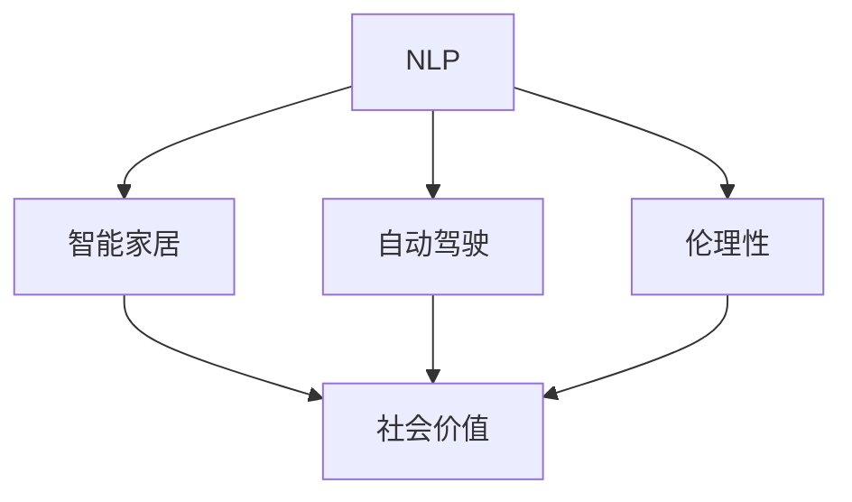

                 

## 1. 背景介绍

苹果公司近年来持续在人工智能（AI）领域进行战略布局，并推出了一系列AI应用。李开复博士作为一名在AI领域有着深厚积累的科技领袖，他在多个场合表达了对苹果AI应用社会价值的看法。本文将基于李开复的见解，探讨苹果AI应用如何影响社会各个方面，并分析其潜在的社会价值。

### 1.1 苹果AI应用的发展历程

苹果公司自2019年起，就逐步向公众展示其AI应用潜力，特别是通过其Siri语音助手和Apple Maps等服务。其中，Siri在语音识别和自然语言处理（NLP）方面的进展尤为显著，并且这些应用已在iPhone、iPad、Mac等苹果设备上得到广泛应用。此外，苹果还在不断扩展AI应用场景，包括图像识别、智能家居、自动驾驶等。

### 1.2 李开复对苹果AI应用的评价

李开复在多个公开场合表示，苹果公司通过AI技术，尤其是基于自然语言处理的AI技术，已经提升了其产品和服务的功能性和用户体验。他认为，苹果的AI应用不仅在技术上有所突破，而且在社会价值方面也有着重要贡献。

## 2. 核心概念与联系

### 2.1 核心概念概述

1. **自然语言处理（NLP）**：是人工智能的一个分支，研究如何使计算机理解和处理人类语言。Siri、Apple Maps等应用都依赖于NLP技术。

2. **智能家居**：利用AI技术实现家居自动化，提高生活便利性。

3. **自动驾驶**：利用AI技术实现汽车自动驾驶，提高交通安全性。

4. **社会价值**：指技术应用对社会带来的正面影响，如提升生活品质、改善社会治理等。

5. **伦理性**：指技术应用中应考虑的伦理问题，如隐私保护、算法偏见等。

这些核心概念之间通过技术实现和社会影响的方式相互联系，形成了苹果AI应用的全景图。

### 2.2 概念间的关系

- **NLP与智能家居**：NLP技术通过语音识别、自然语言理解等功能，使得智能家居设备能够更好地与用户互动。
- **智能家居与自动驾驶**：智能家居中的一些技术，如环境感知、语音识别，对自动驾驶同样有帮助。
- **自动驾驶与社会价值**：自动驾驶技术有望减少交通事故、改善交通拥堵，从而提升社会效率。
- **伦理性与NLP**：NLP技术中如何处理用户隐私、避免偏见问题，直接关系到其社会价值的实现。

这些概念的互动关系，可以借助于以下Mermaid流程图来展示：



## 3. 核心算法原理 & 具体操作步骤

### 3.1 算法原理概述

苹果公司在其AI应用中，主要采用了以下算法原理：

- **深度学习模型**：利用神经网络对大规模数据进行训练，实现精确的语言理解和图像识别。
- **强化学习**：通过与环境的交互，优化智能家居、自动驾驶等系统的行为决策。
- **迁移学习**：使用在特定场景下训练的模型，在其他相关场景中进行微调，提高应用效率。

这些算法原理共同构成了苹果AI应用的核心技术架构。

### 3.2 算法步骤详解

苹果AI应用的开发流程一般包括以下几个关键步骤：

1. **数据收集与处理**：收集相关数据，并对数据进行清洗、标注，准备用于模型训练。
2. **模型训练**：使用深度学习框架（如TensorFlow、PyTorch）进行模型训练，并根据需要进行超参数调优。
3. **模型部署**：将训练好的模型部署到具体的设备或服务中，进行实时推理。
4. **评估与优化**：对部署后的模型进行评估，根据反馈数据进行调整和优化。

### 3.3 算法优缺点

**优点**：

- **跨领域应用**：AI应用可以跨多个领域（如语音、视觉、文本）协同工作，提升用户体验。
- **高效性**：深度学习模型在大规模数据训练下，可以获得较高精度。
- **实时性**：强化学习可以实时优化系统行为，提升响应速度。

**缺点**：

- **数据依赖**：高质量的数据集是模型训练的基础，数据不足可能导致性能下降。
- **隐私问题**：大规模数据收集和处理过程中，如何保护用户隐私是重大挑战。
- **复杂性**：深度学习模型的训练和优化复杂度高，开发成本较高。

### 3.4 算法应用领域

苹果AI应用主要应用于以下几个领域：

- **个人助理**：如Siri、Apple Maps，提供语音搜索、路线导航等功能。
- **智能家居**：利用NLP技术实现语音控制，智能设备联动。
- **自动驾驶**：通过图像识别和传感器数据，实现车辆自主驾驶。
- **医疗健康**：利用图像识别技术进行疾病诊断。

## 4. 数学模型和公式 & 详细讲解

### 4.1 数学模型构建

苹果AI应用中的数学模型通常包括深度神经网络、卷积神经网络（CNN）、循环神经网络（RNN）等。以NLP任务为例，假设使用一个包含多个LSTM层的RNN模型进行文本分类：

$$
M_{\theta}(x) = \text{LSTM}_{\theta_1}(\text{LSTM}_{\theta_2}(\ldots(\text{LSTM}_{\theta_k}(x))\ldots))
$$

其中，$M_{\theta}$为模型，$\theta_k$为第$k$层LSTM的参数集合。

### 4.2 公式推导过程

对于文本分类任务，可以采用交叉熵损失函数（Cross-Entropy Loss）来训练模型：

$$
\mathcal{L} = -\frac{1}{N}\sum_{i=1}^{N} \sum_{j=1}^{C} y_{ij}\log p_{ij}
$$

其中，$N$为样本数，$C$为分类数，$y_{ij}$为第$i$个样本的第$j$个类别的真实标签，$p_{ij}$为模型预测的第$j$个类别的概率。

### 4.3 案例分析与讲解

以Apple Maps为例，其利用深度学习模型进行路线规划和导航。模型输入包括地理位置数据和历史出行数据，通过空间关系和时间序列分析，输出最优路线和实时导航建议。其核心算法包括：

- **CNN**：用于图像识别，确定道路状况和交通流量。
- **LSTM**：用于时间序列分析，预测交通状况的变化趋势。
- **强化学习**：用于动态优化路线规划算法，根据实时反馈调整导航策略。

## 5. 项目实践：代码实例和详细解释说明

### 5.1 开发环境搭建

- **环境配置**：搭建Python 3.7环境，安装TensorFlow 2.0、Keras等深度学习库。
- **数据集准备**：获取Apple Maps数据集，进行数据清洗和预处理。
- **模型搭建**：使用Keras构建深度学习模型，包含多个LSTM层和CNN层。
- **模型训练**：使用Google Colab进行模型训练，设置适当的学习率和迭代次数。

### 5.2 源代码详细实现

```python
import tensorflow as tf
from tensorflow.keras import layers, models

# 构建LSTM-CNN模型
model = models.Sequential([
    layers.Embedding(input_dim=vocab_size, output_dim=embedding_dim),
    layers.Conv1D(filters=32, kernel_size=3, activation='relu'),
    layers.LSTM(units=64),
    layers.Dense(units=5, activation='softmax')
])

# 编译模型
model.compile(loss='categorical_crossentropy', optimizer='adam', metrics=['accuracy'])

# 训练模型
model.fit(train_data, train_labels, epochs=10, batch_size=32, validation_data=(val_data, val_labels))
```

### 5.3 代码解读与分析

上述代码构建了一个简单的LSTM-CNN模型，用于文本分类任务。关键步骤包括：

- **嵌入层（Embedding Layer）**：将输入的文本转换为向量表示。
- **卷积层（Conv1D）**：提取文本特征。
- **LSTM层**：处理序列数据，提取长期依赖关系。
- **全连接层（Dense）**：输出预测结果。

### 5.4 运行结果展示

训练模型后，使用测试集进行评估，输出准确率和损失值：

```python
test_loss, test_acc = model.evaluate(test_data, test_labels)
print('Test accuracy:', test_acc)
```

## 6. 实际应用场景

### 6.1 个人助理

苹果的Siri语音助手应用了NLP和语音识别技术，可以识别用户的语音指令，并执行相应的任务。这些任务包括日历提醒、信息查询、电子邮件管理等。通过Siri，用户可以以自然语言与设备进行互动，提升了日常生活的便利性。

### 6.2 智能家居

Apple HomeKit利用NLP技术实现了智能家居的语音控制，用户可以通过语音命令控制家中的各种智能设备。这不仅提升了家居生活的智能化水平，还增加了用户的舒适度。

### 6.3 自动驾驶

苹果的自动驾驶项目通过深度学习模型和传感器数据，实现车辆自主导航。虽然目前还处于测试阶段，但未来有望减少交通事故，提高道路安全。

### 6.4 未来应用展望

未来，苹果AI应用有望在更多领域得到应用，如医疗健康、教育、金融等。通过NLP技术，AI系统可以提供更加精准和个性化的服务，提升人类生活质量。

## 7. 工具和资源推荐

### 7.1 学习资源推荐

1. **TensorFlow官方文档**：包含深度学习模型的详细介绍和代码示例，适合初学者学习。
2. **Keras官方文档**：提供快速搭建深度学习模型的工具，适合快速迭代原型。
3. **Apple Developer文档**：提供苹果设备的AI应用开发指导，涵盖NLP、智能家居等领域。

### 7.2 开发工具推荐

- **Google Colab**：免费提供GPU资源，支持Python代码快速迭代和测试。
- **Jupyter Notebook**：用于编写和分享深度学习模型代码。
- **TensorBoard**：用于可视化模型训练过程，帮助调试和优化。

### 7.3 相关论文推荐

1. **Attention is All You Need**：提出Transformer模型，成为深度学习领域的重要里程碑。
2. **Deep Residual Learning for Image Recognition**：提出残差网络（ResNet），提升了图像识别模型的深度。
3. **Natural Language Processing (almost) for Free**：介绍使用预训练模型进行NLP任务的快速部署。

## 8. 总结：未来发展趋势与挑战

### 8.1 研究成果总结

李开复表示，苹果AI应用在社会价值方面具有重要意义，通过提升用户体验，改善社会效率，推动技术发展。这些应用不仅在技术上有所突破，还在社会影响上有所贡献。

### 8.2 未来发展趋势

未来，AI技术将在更多领域得到应用，包括医疗、教育、金融等。苹果公司有望通过其AI应用，引领技术创新和产业变革。

### 8.3 面临的挑战

尽管AI技术在提升社会价值方面有着巨大潜力，但也面临诸多挑战：

1. **数据隐私**：大规模数据收集和处理过程中，如何保护用户隐私。
2. **算法偏见**：AI模型可能存在偏见，如何避免对特定群体的歧视。
3. **计算资源**：深度学习模型的训练和推理需要大量计算资源，如何优化模型效率。

### 8.4 研究展望

未来的研究应集中在以下几个方向：

1. **隐私保护**：研究隐私保护技术，确保数据在处理和使用过程中的安全性。
2. **公平性**：开发公平性评估指标，确保AI模型不带有偏见。
3. **模型压缩**：研究模型压缩技术，减少计算资源消耗。

总之，苹果公司通过AI应用在社会价值方面取得了显著成效，但也面临着诸多挑战。未来的研究应围绕隐私、公平和效率等方面进行，确保AI技术的应用能够真正造福人类社会。

## 9. 附录：常见问题与解答

**Q1：苹果公司为什么选择AI作为技术重点？**

A: 苹果公司选择AI作为技术重点，主要是为了提升用户体验和产品竞争力。AI技术可以显著增强产品的智能化水平，提高用户满意度和市场占有率。

**Q2：AI应用在隐私保护方面有哪些挑战？**

A: AI应用在隐私保护方面主要面临以下挑战：

1. **数据收集**：大规模数据收集可能涉及用户隐私，如何保护数据不被滥用。
2. **数据处理**：处理数据时可能需要进行去匿名化，如何避免数据泄露。
3. **数据存储**：存储数据时需要考虑数据安全，如何防止数据被未经授权的访问。

**Q3：如何确保AI模型的公平性？**

A: 确保AI模型公平性需要从以下几个方面进行：

1. **数据多样性**：使用多样化的数据集进行模型训练，避免数据偏见。
2. **算法透明性**：使用可解释性强的模型，便于对模型进行监督和调整。
3. **公平性评估**：开发公平性评估指标，定期检测模型性能。

**Q4：AI技术在智能家居中的应用有哪些？**

A: AI技术在智能家居中的应用主要包括以下几个方面：

1. **语音识别**：实现语音控制家居设备。
2. **环境感知**：通过传感器数据监测环境变化，自动调节家居设备。
3. **个性化推荐**：根据用户习惯和行为，推荐个性化服务。

**Q5：如何优化AI模型的计算效率？**

A: 优化AI模型计算效率的方法包括：

1. **模型压缩**：使用量化、剪枝等技术减少模型参数量。
2. **模型并行**：使用模型并行技术，将计算任务分布到多个设备上。
3. **数据加速**：使用数据预处理技术，减少模型计算量。

以上问题的回答，将帮助读者更好地理解苹果AI应用的社会价值及其面临的挑战和未来趋势。

