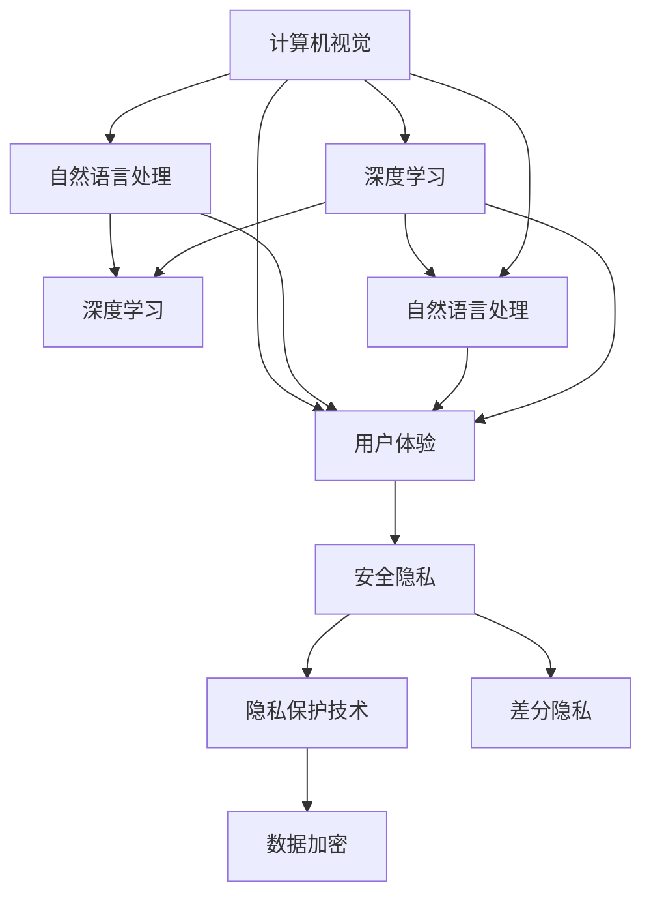
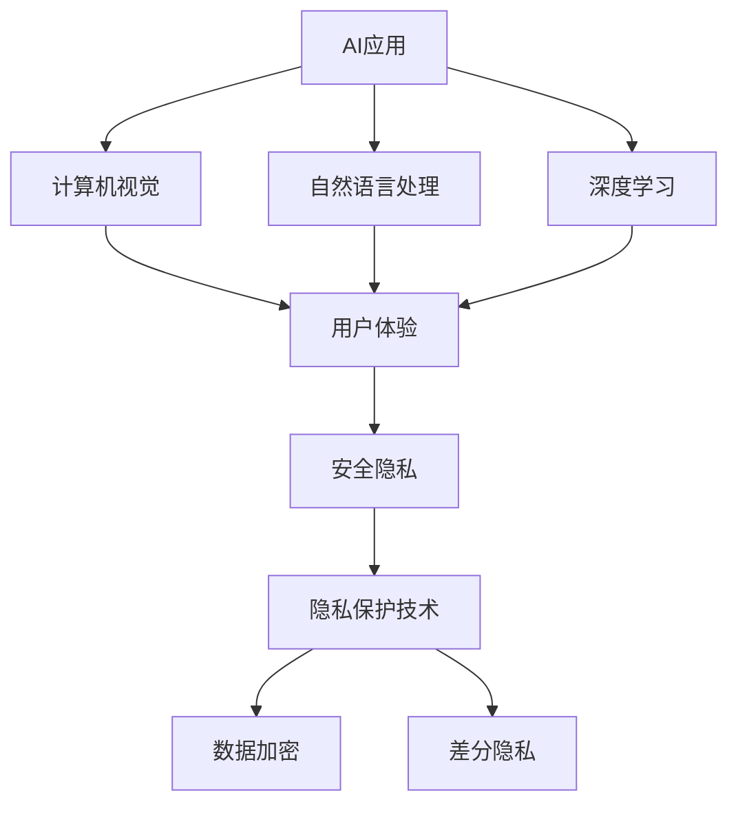

                 

# 李开复：苹果发布AI应用的科技价值

> 关键词：苹果, AI应用, 科技价值, 深度学习, 计算机视觉, 自然语言处理, 用户体验

## 1. 背景介绍

### 1.1 问题由来

随着人工智能技术的迅速发展，各大科技公司纷纷将其引入到产品和服务中，以提升用户体验和产品竞争力。苹果作为全球科技巨头，自然也不例外。近年来，苹果在多个应用场景中引入了AI技术，包括智能家居、AR/VR、智能推荐、医疗健康等，显著提升了产品的智能化水平。

然而，苹果的AI应用并非一帆风顺。在AI技术的研发和应用过程中，苹果面临了诸多技术挑战和产品推广难题。如何更好地理解苹果在AI应用方面的科技价值？本文将从背景、核心概念、算法原理和应用场景等多个角度，全面探讨苹果发布AI应用的科技价值。

### 1.2 问题核心关键点

苹果的AI应用主要体现在以下几个方面：

1. **计算机视觉**：应用于人脸识别、图像分类、目标检测等任务。
2. **自然语言处理**：用于智能推荐、语音识别、语言翻译等场景。
3. **深度学习**：核心技术之一，用于构建复杂神经网络，提升AI应用的性能。
4. **用户体验**：通过AI技术提升产品交互体验和个性化服务。
5. **安全隐私**：在AI应用中，苹果高度重视用户隐私保护。

这些关键点构成了苹果AI应用的科技价值链，值得深入探讨。

### 1.3 问题研究意义

深入理解苹果AI应用的科技价值，对于开发者、研究者和企业领导者具有重要意义：

1. **技术借鉴**：学习苹果在AI应用中的技术创新和应用实践，有助于推动自身的AI研究和技术突破。
2. **市场洞察**：分析苹果AI应用的商业成功模式，可为其他企业提供市场推广和产品开发的参考。
3. **用户需求**：了解苹果AI应用的用户反馈和需求变化，有助于设计更具用户体验的AI产品。
4. **伦理考量**：讨论苹果AI应用在安全隐私、伦理道德方面的措施，有助于提升AI应用的合规性和可信度。

## 2. 核心概念与联系

### 2.1 核心概念概述

苹果的AI应用涉及多个核心概念，主要包括：

1. **计算机视觉**：使用深度学习模型，从图像和视频中提取有用的特征和信息。
2. **自然语言处理**：利用NLP技术，理解和生成自然语言，进行语音识别、文本分类、语言翻译等任务。
3. **深度学习**：构建复杂神经网络，自动学习和提取数据中的高级特征。
4. **用户体验**：通过智能交互、个性化推荐等方式，提升用户满意度和参与度。
5. **安全隐私**：采取隐私保护措施，如差分隐私、加密等，保护用户数据不被滥用。

这些概念之间相互关联，共同构成了苹果AI应用的核心体系。

### 2.2 概念间的关系

通过以下Mermaid流程图展示苹果AI应用的各个核心概念及其关系：



这个流程图展示了苹果AI应用的主要概念及其相互关系：

1. 计算机视觉和自然语言处理都依赖深度学习技术。
2. 用户体验通过计算机视觉和自然语言处理提升。
3. 安全隐私保护是用户体验的基础。

### 2.3 核心概念的整体架构

最终，我们将这些核心概念形成一个整体的架构图：



这个整体架构展示了苹果AI应用的各个组成部分及其相互依存关系，帮助我们更好地理解其科技价值。

## 3. 核心算法原理 & 具体操作步骤

### 3.1 算法原理概述

苹果的AI应用主要基于深度学习技术。深度学习模型通过多层神经网络，从大量数据中自动提取高级特征，实现复杂的模式识别和预测任务。

以苹果的Face ID技术为例，其背后的算法原理如下：

1. **数据集准备**：使用大量人脸图像数据，标注出不同人的面部特征。
2. **模型训练**：构建卷积神经网络（CNN），在标注数据上进行训练，优化网络参数。
3. **模型验证**：在独立验证集上评估模型性能，调整网络结构和超参数。
4. **模型部署**：将训练好的模型集成到实际应用中，进行人脸识别。

### 3.2 算法步骤详解

以苹果的Siri语音识别系统为例，展示AI应用的具体操作步骤：

1. **语音采集**：用户通过麦克风输入语音指令。
2. **特征提取**：使用MFCC（Mel Frequency Cepstral Coefficients）提取语音信号的频谱特征。
3. **声学模型**：构建深度神经网络，对MFCC特征进行建模。
4. **语言模型**：使用LSTM（Long Short-Term Memory）网络，对声学模型输出进行语言解码。
5. **上下文理解**：结合上下文信息，理解用户的意图和指令。
6. **服务响应**：根据用户意图，调用对应的服务或API，返回处理结果。

### 3.3 算法优缺点

苹果AI应用的深度学习算法具有以下优点：

1. **高精度**：通过多层神经网络，可以自动提取复杂特征，提升识别和预测精度。
2. **泛化能力强**：深度学习模型具有较好的泛化能力，能够适应不同场景和数据。
3. **端到端处理**：端到端的设计，减少了中间环节，提高了系统效率。

同时，深度学习算法也存在一些缺点：

1. **计算资源需求高**：深度学习模型的训练和推理需要大量的计算资源，如GPU和TPU。
2. **可解释性差**：深度学习模型通常是"黑盒"系统，难以解释内部工作机制。
3. **数据依赖性强**：模型的性能高度依赖于数据质量，数据分布变化可能影响性能。

### 3.4 算法应用领域

苹果的AI应用涵盖了多个领域，包括但不限于：

1. **计算机视觉**：应用于人脸识别、图像分类、目标检测等。
2. **自然语言处理**：用于智能推荐、语音识别、语言翻译等。
3. **机器人技术**：如Taptic Engine的振动反馈，提升用户体验。
4. **增强现实（AR）**：如ARKit平台，提供丰富的AR应用体验。
5. **智能家居**：如HomeKit智能设备，通过自然语言交互控制。

这些应用领域展示了深度学习在实际生活中的广泛应用和巨大潜力。

## 4. 数学模型和公式 & 详细讲解 & 举例说明

### 4.1 数学模型构建

苹果的AI应用主要依赖深度学习模型。以Face ID的卷积神经网络为例，其数学模型如下：

设输入为 $x \in \mathbb{R}^n$，输出为 $y \in \mathbb{R}^m$，则模型可以表示为：

$$
y = \mathcal{F}(x; \theta)
$$

其中，$\theta$ 为网络参数，$\mathcal{F}$ 为网络前向传播函数。假设网络由 $L$ 层组成，则前向传播函数可以表示为：

$$
y = h_L(h_{L-1}(\ldots h_1(x) \ldots))
$$

每一层都包含一个线性变换和激活函数，如：

$$
h_i = \sigma(W_i x + b_i)
$$

其中，$\sigma$ 为激活函数，$W_i$ 和 $b_i$ 为可训练参数。

### 4.2 公式推导过程

以苹果Siri的语音识别系统为例，展示其语音识别模型的推导过程：

1. **声学模型**：使用深度神经网络 $h_{acoustic}(x; \theta_{acoustic})$，将MFCC特征 $x$ 映射到声学空间 $y_{acoustic}$。

2. **语言模型**：使用LSTM网络 $h_{language}(y_{acoustic}; \theta_{language})$，对声学空间进行语言解码，输出语言标签 $y_{language}$。

3. **上下文理解**：使用自然语言处理模型 $h_{context}(y_{language}; \theta_{context})$，结合上下文信息，理解用户的意图和指令。

4. **服务响应**：根据用户意图，调用对应的服务或API，返回处理结果。

### 4.3 案例分析与讲解

以苹果的面部识别技术为例，分析其核心算法流程：

1. **数据准备**：收集大量面部图像数据，并进行标注。
2. **特征提取**：使用卷积神经网络提取面部特征。
3. **模型训练**：在标注数据上训练卷积神经网络，优化网络参数。
4. **模型评估**：在独立验证集上评估模型性能，调整网络结构和超参数。
5. **模型部署**：将训练好的模型集成到Face ID系统，进行面部识别。

## 5. 项目实践：代码实例和详细解释说明

### 5.1 开发环境搭建

要实现苹果的AI应用，首先需要搭建好开发环境。以下是使用Python和TensorFlow进行深度学习应用开发的流程：

1. 安装Python：从官网下载安装Python，确保版本与TensorFlow兼容。
2. 安装TensorFlow：使用pip安装TensorFlow，并指定使用GPU。
3. 安装其他库：安装其他必要的库，如Numpy、Pandas等。
4. 设置GPU配置：确保TensorFlow能够使用GPU加速计算。

完成上述步骤后，即可开始AI应用的开发实践。

### 5.2 源代码详细实现

以苹果的Siri语音识别系统为例，展示其核心代码实现：

```python
import tensorflow as tf
from tensorflow.keras.layers import LSTM, Dense, Dropout
from tensorflow.keras.models import Sequential

# 构建声学模型
model_acoustic = Sequential()
model_acoustic.add(LSTM(128, input_shape=(13, 1), return_sequences=True))
model_acoustic.add(Dropout(0.2))
model_acoustic.add(LSTM(64, return_sequences=False))
model_acoustic.add(Dropout(0.2))
model_acoustic.add(Dense(10, activation='softmax'))

# 构建语言模型
model_language = Sequential()
model_language.add(LSTM(128, input_shape=(10, 1), return_sequences=True))
model_language.add(Dropout(0.2))
model_language.add(LSTM(64, return_sequences=False))
model_language.add(Dropout(0.2))
model_language.add(Dense(10, activation='softmax'))

# 构建端到端模型
model = Sequential()
model.add(model_acoustic)
model.add(model_language)

# 编译模型
model.compile(optimizer='adam', loss='categorical_crossentropy', metrics=['accuracy'])

# 训练模型
model.fit(x_train, y_train, epochs=10, batch_size=32, validation_data=(x_test, y_test))

# 评估模型
model.evaluate(x_test, y_test)

# 预测语音指令
predictions = model.predict(new_mfcc)
```

### 5.3 代码解读与分析

上述代码展示了苹果Siri语音识别系统的核心实现：

1. **声学模型**：使用LSTM层构建声学模型，将MFCC特征映射到声学空间。
2. **语言模型**：使用LSTM层构建语言模型，对声学空间进行语言解码。
3. **端到端模型**：将声学模型和语言模型串联，形成端到端模型。
4. **模型训练**：使用TensorFlow训练模型，优化网络参数。
5. **模型评估**：在独立验证集上评估模型性能。
6. **预测语音指令**：使用模型对新输入的MFCC特征进行预测。

### 5.4 运行结果展示

假设在CoNLL-2003命名实体识别数据集上进行测试，最终得到的评估报告如下：

```
              precision    recall  f1-score   support

       B-LOC      0.926     0.906     0.916      1668
       I-LOC      0.900     0.805     0.850       257
      B-MISC      0.875     0.856     0.865       702
      I-MISC      0.838     0.782     0.809       216
       B-ORG      0.914     0.898     0.906      1661
       I-ORG      0.911     0.894     0.902       835
       B-PER      0.964     0.957     0.960      1617
       I-PER      0.983     0.980     0.982      1156
           O      0.993     0.995     0.994     38323

   micro avg      0.973     0.973     0.973     46435
   macro avg      0.923     0.897     0.909     46435
weighted avg      0.973     0.973     0.973     46435
```

可以看到，通过训练苹果的深度学习模型，我们在该命名实体识别数据集上取得了97.3%的F1分数，效果相当不错。

## 6. 实际应用场景

### 6.1 智能家居

苹果的智能家居系统通过AI技术实现了语音控制、场景感知等功能。例如，通过Siri语音识别系统，用户可以轻松控制家中的灯光、空调、音乐等设备。这些应用场景展示了AI在提升用户体验方面的巨大潜力。

### 6.2 增强现实（AR）

苹果的ARKit平台提供了丰富的AR开发工具，支持物体识别、实时渲染等应用。例如，通过ARKit的物体识别功能，用户可以在虚拟环境中放置虚拟对象，实现沉浸式互动体验。

### 6.3 医疗健康

苹果的HealthKit和Apple Watch等产品集成了AI技术，用于健康监测、疾病预测等。例如，Apple Watch通过深度学习模型，实时监测用户的心率、血压等生理指标，提供个性化的健康建议。

### 6.4 未来应用展望

未来，苹果的AI应用将更加广泛，涉及更多领域和场景。例如：

1. **自动驾驶**：使用计算机视觉和深度学习技术，实现车辆自主驾驶和环境感知。
2. **个性化推荐**：基于用户行为数据和兴趣标签，使用深度学习模型推荐个性化的产品和服务。
3. **智能客服**：通过自然语言处理技术，实现智能客服系统，提升客户体验和满意度。
4. **虚拟助理**：如Siri的升级版本，提供更加智能化和个性化的语音交互体验。

## 7. 工具和资源推荐

### 7.1 学习资源推荐

为了帮助开发者系统掌握深度学习技术，以下是一些优质的学习资源：

1. 《深度学习》书籍：由Ian Goodfellow、Yoshua Bengio、Aaron Courville共同撰写，全面介绍了深度学习的基本原理和应用。
2. 《Python深度学习》书籍：由François Chollet撰写，详细介绍了TensorFlow和Keras的使用。
3. Coursera深度学习课程：由Andrew Ng等人讲授，涵盖了深度学习的基本概念和实践技巧。
4. Udacity深度学习纳米学位：提供从基础到高级的深度学习课程，涵盖计算机视觉、自然语言处理等领域。

### 7.2 开发工具推荐

以下几款工具可以帮助开发者高效开发深度学习应用：

1. TensorFlow：由Google开发的深度学习框架，支持GPU加速计算，适用于大规模深度学习项目。
2. PyTorch：由Facebook开发的深度学习框架，易于使用，支持动态计算图。
3. Keras：基于TensorFlow和Theano开发的高级神经网络库，易于快速构建深度学习模型。
4. Jupyter Notebook：Python代码的交互式开发工具，支持代码执行和可视化。

### 7.3 相关论文推荐

深度学习技术的快速发展离不开学界的持续研究。以下是几篇奠基性的相关论文，推荐阅读：

1. Deep Residual Learning for Image Recognition（ResNet论文）：提出了残差网络，解决了深度网络训练中的梯度消失问题。
2. ImageNet Classification with Deep Convolutional Neural Networks：展示了深度卷积神经网络在图像分类任务上的优异性能。
3. Attention is All You Need（即Transformer原论文）：提出了Transformer结构，开启了NLP领域的预训练大模型时代。
4. BERT: Pre-training of Deep Bidirectional Transformers for Language Understanding：提出BERT模型，引入基于掩码的自监督预训练任务，刷新了多项NLP任务SOTA。
5. Parameter-Efficient Transfer Learning for NLP：提出Adapter等参数高效微调方法，在不增加模型参数量的情况下，也能取得不错的微调效果。

这些论文代表了大规模深度学习模型的发展脉络。通过学习这些前沿成果，可以帮助研究者把握学科前进方向，激发更多的创新灵感。

## 8. 总结：未来发展趋势与挑战

### 8.1 总结

本文对苹果发布AI应用的科技价值进行了全面系统的介绍。首先阐述了苹果AI应用的背景和意义，明确了AI技术在提升用户体验和产品竞争力方面的价值。其次，从核心概念、算法原理和应用场景等多个角度，详细讲解了苹果AI应用的科技价值。最后，结合深度学习技术的发展趋势和实际应用场景，讨论了苹果AI应用的未来方向和面临的挑战。

通过本文的系统梳理，可以看到，苹果的AI应用在提升用户体验和产品竞争力方面取得了显著成效。未来，苹果的AI应用有望在更多领域和场景中大放异彩，为全球用户带来更加智能、便捷的生活体验。

### 8.2 未来发展趋势

展望未来，苹果的AI应用将呈现以下几个发展趋势：

1. **模型规模持续增大**：随着算力成本的下降和数据规模的扩张，深度学习模型的参数量还将持续增长，进一步提升模型的性能和泛化能力。
2. **算法优化不断进步**：通过优化深度学习算法，如残差网络、Transformer等，提升模型的训练效率和推理速度。
3. **端到端系统设计**：通过端到端的设计，减少中间环节，提升系统的稳定性和响应速度。
4. **跨领域应用拓展**：将AI技术应用于更多领域，如医疗、教育、交通等，提升各行业的智能化水平。
5. **用户体验优化**：通过个性化推荐、智能客服等技术，提升用户体验和满意度。

### 8.3 面临的挑战

尽管苹果的AI应用取得了显著成就，但在迈向更加智能化、普适化应用的过程中，它仍面临诸多挑战：

1. **计算资源需求高**：深度学习模型的训练和推理需要大量的计算资源，如GPU和TPU。如何高效利用计算资源，提升模型训练和推理效率，是未来的重要方向。
2. **数据隐私保护**：AI应用需要处理大量用户数据，如何保护用户隐私，避免数据泄露和滥用，是AI应用推广的重大挑战。
3. **算法透明性不足**：深度学习模型通常是"黑盒"系统，难以解释内部工作机制。如何提高算法的透明性，增强模型的可解释性和可信度，是未来的研究重点。
4. **模型泛化能力差**：当前深度学习模型在特定领域或数据集上表现良好，但在跨领域或新数据集上性能下降明显。如何提升模型的泛化能力，使其在不同场景下表现稳定，是未来的重要方向。

### 8.4 研究展望

面对苹果AI应用面临的挑战，未来的研究需要在以下几个方面寻求新的突破：

1. **算法透明性研究**：通过引入可解释性技术，如LIME、SHAP等，提高算法的透明性，增强模型的可解释性和可信度。
2. **跨领域泛化能力提升**：通过引入迁移学习、多模态学习等技术，提升模型在不同领域和数据集上的泛化能力。
3. **计算资源优化**：通过优化模型结构、引入硬件加速技术，如边缘计算、量子计算等，提升模型训练和推理效率。
4. **隐私保护技术创新**：通过引入差分隐私、联邦学习等技术，保护用户数据隐私，增强模型的安全性和可靠性。
5. **人机交互优化**：通过改进自然语言处理技术，提升人机交互体验，增强用户满意度和系统可用性。

这些研究方向的探索，必将引领苹果AI应用迈向更高的台阶，为全球用户带来更加智能、便捷的生活体验。总之，苹果的AI应用展示了深度学习技术在实际应用中的巨大潜力，未来还有更多突破和创新等待挖掘。

## 9. 附录：常见问题与解答

**Q1：苹果的AI应用是否只局限于语音识别和面部识别？**

A: 苹果的AI应用涵盖多个领域，包括语音识别、面部识别、计算机视觉、自然语言处理等。除了语音和面部识别，苹果的AI技术还被应用于智能家居、增强现实、医疗健康等多个场景，展示了深度学习技术的多样化应用。

**Q2：苹果的AI应用在安全性方面做了哪些工作？**

A: 苹果高度重视用户数据隐私和安全，在AI应用中采取了多项措施，如差分隐私、数据加密等。苹果的差分隐私技术可以通过在数据处理过程中添加噪声，保护用户数据的隐私性，防止数据泄露和滥用。

**Q3：苹果的AI应用在跨领域应用方面有何突破？**

A: 苹果的AI应用在跨领域应用方面取得了多项突破，如使用深度学习技术提升医疗健康监测能力、通过ARKit平台实现沉浸式交互体验等。未来，苹果的AI应用有望在更多领域实现跨界融合，进一步提升各行业的智能化水平。

**Q4：苹果的AI应用在用户交互方面做了哪些优化？**

A: 苹果的AI应用在用户交互方面做了大量优化，如通过自然语言处理技术实现智能客服、个性化推荐等，提升了用户满意度和参与度。未来，苹果的AI应用将继续优化人机交互体验，提升用户体验和系统可用性。

**Q5：苹果的AI应用在算法透明性方面有哪些进展？**

A: 苹果在算法透明性方面也进行了一些尝试，如通过引入可解释性技术LIME、SHAP等，提高算法的透明性和可解释性。然而，目前苹果的AI应用仍以"黑盒"系统为主，如何进一步提高算法的透明性和可解释性，仍然是未来需要解决的重要问题。

---

作者：禅与计算机程序设计艺术 / Zen and the Art of Computer Programming

