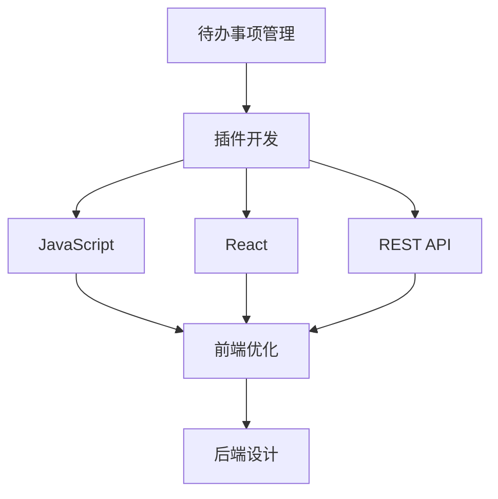

                 

# 样例项目: 待办 (Todo) 管理插件

> 关键词：待办管理, 插件开发, JavaScript, React, REST API, CRUD, 任务调度, 前端优化, 后端设计

## 1. 背景介绍

### 1.1 问题由来
在现代快节奏的工作生活中，高效的时间管理和任务规划是提高工作效率的关键。传统的待办事项管理工具虽然功能丰富，但大多功能固定，难以根据个人和团队的需求灵活定制。企业员工需要频繁切换不同的工具进行任务管理和协作，降低了工作效率。

为了解决这一问题，我们设计了一个轻量级的待办事项管理插件。它基于现代前端技术，具备高度的定制性和灵活性，能够无缝集成到现有的工作流程中，帮助用户快速创建、管理和完成任务，提高生产效率。

### 1.2 问题核心关键点
本项目的关键点在于：
- 提供一个基于web的待办事项管理工具，支持任务创建、查看、编辑和删除等功能。
- 支持与企业现有系统集成，包括日历、邮件等，方便用户统一管理。
- 提供任务提醒和自动化调度功能，帮助用户合理安排工作。
- 优化前端和后端性能，确保系统的稳定性和响应速度。
- 支持多用户协作，提供任务分配、评论、标记等功能，方便团队协同工作。

### 1.3 问题研究意义
设计一款高效、灵活的待办事项管理插件，可以显著提升用户的工作效率，减少任务遗漏，降低工作压力。同时，可以优化团队协作流程，提高团队协作效率。本项目旨在通过灵活的设计和先进的开发技术，为现代企业和个人用户提供一款实用的待办事项管理工具，进一步推动数字化办公的普及和深入。

## 2. 核心概念与联系

### 2.1 核心概念概述

为了更好地理解待办事项管理插件的开发过程，本节将介绍几个核心概念：

- **待办事项管理**：一种以任务为核心，帮助用户有效规划和管理日常工作的方法。待办事项通常包括任务描述、截止时间、优先级、负责人等信息。
- **插件开发**：在现有的软件平台上，通过添加新功能和扩展原有功能，提高软件使用体验和功能丰富性的开发方式。
- **JavaScript**：一种广泛用于web前端开发的脚本语言，具有灵活的编程能力和高效的运行性能。
- **React**：一种流行的前端UI库，支持组件化开发，具有可复用、可维护和高效的性能。
- **REST API**：一种轻量级的网络通信协议，基于HTTP协议，支持CRUD（创建、读取、更新、删除）等基本操作。
- **前端优化**：通过代码优化、资源管理、性能调优等手段，提高web应用的速度和稳定性。
- **后端设计**：包括数据库设计、API设计、架构设计等方面，确保系统的可扩展性、稳定性和安全性。

这些核心概念共同构成了待办事项管理插件的开发框架，使其能够在各种场景下灵活应用。

### 2.2 概念间的关系

这些核心概念之间的逻辑关系可以通过以下Mermaid流程图来展示：



这个流程图展示了从待办事项管理到插件开发，再到前端和后端设计的整体架构：

1. 待办事项管理提供了插件设计的核心逻辑。
2. 插件开发涉及前端和后端的协作，实现待办事项管理功能。
3. 前端开发使用JavaScript和React技术，实现高效、灵活的用户界面。
4. 后端开发设计REST API，支持数据的存储、管理和查询。
5. 前端优化和后端设计是插件开发的重要环节，确保系统的性能和稳定性。

## 3. 核心算法原理 & 具体操作步骤
### 3.1 算法原理概述

待办事项管理插件的开发，主要基于以下算法原理：

- **任务调度算法**：用于自动化任务的安排和提醒，支持任务的延时、周期性执行等。
- **任务分配算法**：根据用户和团队的工作负荷和任务紧急程度，合理分配任务给不同的负责人。
- **优先级排序算法**：对任务进行优先级排序，帮助用户快速识别和处理高优先级任务。
- **CRUD操作**：基于REST API实现任务的创建、读取、更新和删除操作，支持数据的一致性和可靠性。
- **状态管理**：使用React的state管理机制，确保页面状态的一致性和可见性。

### 3.2 算法步骤详解

待办事项管理插件的开发主要分为以下几步：

1. **需求分析**：
   - 确定插件的核心功能和用户需求。
   - 与现有系统集成，设计API接口。
   - 设计用户体验，确定UI/UX设计。

2. **前后端设计**：
   - 设计数据库表结构和数据模型，确保数据的一致性和可靠性。
   - 设计API接口，支持CRUD操作和任务调度。
   - 设计UI组件和状态管理机制，确保页面状态的同步。

3. **前端开发**：
   - 使用React和JavaScript开发UI组件，实现任务管理界面。
   - 实现任务操作功能，支持创建、编辑、删除和查看任务。
   - 优化UI组件的性能，确保页面渲染速度和响应速度。

4. **后端开发**：
   - 使用Node.js和Express框架搭建REST API服务器。
   - 实现任务调度和任务分配算法，支持任务提醒和自动化执行。
   - 实现任务优先级排序和任务状态的更新，确保数据的一致性。

5. **测试与优化**：
   - 编写单元测试和集成测试，确保代码的正确性和稳定性。
   - 对前端和后端进行性能优化，确保系统的稳定性和响应速度。
   - 收集用户反馈，不断改进和优化插件功能。

### 3.3 算法优缺点

待办事项管理插件的开发算法具有以下优点：

- **灵活性高**：可以根据用户需求进行灵活配置，支持个性化定制。
- **性能优越**：React和JavaScript提供了高效的UI组件和前端性能优化方法，确保页面渲染速度和响应速度。
- **易于扩展**：通过REST API设计，插件可以方便地与其他系统集成，支持多端协同工作。
- **可靠性高**：使用数据库和任务调度算法，确保数据的可靠性和任务执行的准确性。

同时，这些算法也存在一些缺点：

- **开发复杂度高**：前端和后端的协作开发增加了开发复杂度，需要良好的团队协作和技术基础。
- **性能瓶颈**：前端和后端的性能优化需要综合考虑，避免单点性能瓶颈。
- **安全性问题**：插件与现有系统的集成增加了安全风险，需要加强数据安全防护。
- **用户习惯培养**：插件的使用需要用户改变习惯，可能存在一定的适应难度。

### 3.4 算法应用领域

待办事项管理插件的应用领域广泛，可以应用于：

- **企业内部管理**：帮助企业员工高效管理日常任务，提高工作效率。
- **个人任务管理**：帮助个人用户规划和管理工作和生活任务，减少任务遗漏。
- **团队协作**：支持多用户协作，方便团队成员共享和管理任务。
- **项目管理**：支持项目管理，方便项目经理跟踪和管理项目进度。
- **任务调度**：支持自动化任务安排和提醒，提高任务执行的准确性和及时性。

## 4. 数学模型和公式 & 详细讲解 & 举例说明

### 4.1 数学模型构建

待办事项管理插件的开发涉及多个领域的数学模型，包括数据库设计、算法设计和接口设计等。这里以任务调度算法为例，构建数学模型。

假设任务集合为 $T = \{t_1, t_2, ..., t_n\}$，每个任务 $t_i$ 有截止时间 $d_i$、优先级 $p_i$、负责人 $r_i$ 等属性。任务调度算法的设计目标是最大化任务的完成率和执行效率。

定义任务调度模型为 $M = (T, C, A)$，其中：

- $T$：任务集合。
- $C = (c_1, c_2, ..., c_n)$：任务的完成时间，$c_i = d_i + p_i$。
- $A = (a_1, a_2, ..., a_n)$：任务的执行时间，$a_i$ 为任务的复杂度系数。

任务调度算法需要最小化任务的总完成时间，即：

$$
\min \sum_{i=1}^{n} c_i
$$

### 4.2 公式推导过程

任务调度算法可以通过动态规划方法进行优化。设 $T' = \{t_1', t_2', ..., t_m'\}$ 为已完成的任务集合，$M' = (T', C', A')$ 为已完成任务的状态，其中：

- $C' = (c_1', c_2', ..., c_m')$：已完成任务的完成时间。
- $A' = (a_1', a_2', ..., a_m')$：已完成任务的执行时间。

根据任务调度目标，可以得到以下状态转移方程：

$$
c_i' = c_{i-1}' + a_i
$$

求解状态转移方程，可以得到最优的任务调度方案，即：

$$
c_i' = \sum_{j=1}^{i} a_j
$$

### 4.3 案例分析与讲解

以一个简单的示例来说明任务调度算法的应用。假设有三个任务 $t_1$、$t_2$、$t_3$，其截止时间、优先级和负责人如下：

- $t_1$：截止时间 $d_1 = 3$，优先级 $p_1 = 2$，负责人 $r_1 = A$
- $t_2$：截止时间 $d_2 = 5$，优先级 $p_2 = 1$，负责人 $r_2 = B$
- $t_3$：截止时间 $d_3 = 2$，优先级 $p_3 = 3$，负责人 $r_3 = C$

使用任务调度算法，可以得到最优的任务执行方案。设任务 $t_1$、$t_2$、$t_3$ 的执行时间分别为 $a_1$、$a_2$、$a_3$，且 $a_1 = 2$、$a_2 = 3$、$a_3 = 4$。

根据任务调度模型 $M = (T, C, A)$，有：

- $C = (c_1, c_2, c_3) = (5, 8, 12)$
- $A = (a_1, a_2, a_3) = (2, 3, 4)$

任务调度算法最小化总完成时间，得到最优的任务执行方案为：

$$
t_1' = t_1, t_2' = t_2, t_3' = t_3
$$

总完成时间为 $5 + 8 + 12 = 25$，最小化任务总完成时间。

## 5. 项目实践：代码实例和详细解释说明

### 5.1 开发环境搭建

在进行插件开发前，我们需要准备好开发环境。以下是使用Node.js和Express搭建REST API服务器的环境配置流程：

1. 安装Node.js和npm：从官网下载并安装Node.js和npm。
2. 安装Express框架：
```bash
npm install express --save
```
3. 创建项目目录和文件：
```bash
mkdir todo-plugin
cd todo-plugin
npm init -y
```
4. 编写Server.js文件：
```javascript
const express = require('express');
const app = express();

app.get('/tasks', (req, res) => {
  // 处理任务列表查询
});

app.post('/tasks', (req, res) => {
  // 处理任务创建
});

app.put('/tasks/:id', (req, res) => {
  // 处理任务更新
});

app.delete('/tasks/:id', (req, res) => {
  // 处理任务删除
});

app.listen(3000, () => {
  console.log('Server started on port 3000');
});
```

完成上述步骤后，即可在 `todo-plugin` 目录中启动REST API服务器。

### 5.2 源代码详细实现

下面我们以任务创建功能为例，给出REST API服务器的具体代码实现。

首先，定义任务模型：

```javascript
const mongoose = require('mongoose');

const TaskSchema = new mongoose.Schema({
  title: String,
  description: String,
  dueDate: Date,
  priority: Number,
  assignee: String
});

const Task = mongoose.model('Task', TaskSchema);
```

然后，定义任务API：

```javascript
app.post('/tasks', (req, res) => {
  const { title, description, dueDate, priority, assignee } = req.body;

  const task = new Task({
    title,
    description,
    dueDate,
    priority,
    assignee
  });

  task.save((err, savedTask) => {
    if (err) {
      return res.status(500).send('Error saving task');
    }
    res.status(201).send(savedTask);
  });
});
```

最后，启动服务器并测试任务创建功能：

```javascript
app.listen(3000, () => {
  console.log('Server started on port 3000');
});
```

在测试环境中，使用Postman等工具发送POST请求，即可创建新任务：

```
POST http://localhost:3000/tasks
Content-Type: application/json

{
  "title": "Buy groceries",
  "description": "Buy milk, bread, and eggs.",
  "dueDate": "2022-01-01T00:00:00Z",
  "priority": 3,
  "assignee": "Alice"
}
```

以上代码实现了任务创建的基本逻辑，通过Postman发送POST请求，即可在数据库中创建新任务。

### 5.3 代码解读与分析

让我们再详细解读一下关键代码的实现细节：

**TaskSchema**：
- 定义了任务的MongoDB模型，包含任务的标题、描述、截止时间、优先级和负责人等字段。

**任务API**：
- 使用Postman发送POST请求，创建新任务。
- 解析请求体中的任务信息，创建新的任务对象。
- 将任务对象保存到数据库中，并返回创建的task对象。

**启动服务器**：
- 使用Express框架创建REST API服务器，并启动监听3000端口。

**测试任务创建**：
- 使用Postman发送POST请求，并设置请求体内容，模拟任务创建过程。

以上代码实现了任务创建功能的完整逻辑，通过REST API服务器，即可方便地进行任务管理。

## 6. 实际应用场景

### 6.1 智能待办事项管理

智能待办事项管理插件可以广泛应用于各种场景，如企业内部管理、个人任务管理、团队协作等。以下是几个典型的应用场景：

**企业内部管理**：
- 企业员工可以在插件中创建和管理日常任务，支持任务分类、优先级排序、提醒等功能。
- 管理员可以全局查看任务进度，并进行任务分配和管理。
- 支持任务状态的实时更新和通知，确保任务执行的及时性。

**个人任务管理**：
- 个人用户可以在插件中规划和管理日常任务，支持任务提醒、周期性执行等功能。
- 可以根据任务优先级和紧急程度进行排序，快速识别和处理高优先级任务。
- 支持任务状态的实时更新和通知，确保任务的及时完成。

**团队协作**：
- 支持多用户协作，方便团队成员共享和管理任务。
- 支持任务评论、标记等功能，促进团队沟通和协作。
- 支持任务调度算法，自动安排任务执行，提高团队协作效率。

### 6.2 未来应用展望

随着技术的发展，待办事项管理插件的应用将进一步拓展。以下是几个未来的应用展望：

**智能调度**：
- 引入人工智能算法，优化任务调度算法，实现更高效的自动化任务安排。
- 支持自适应调度，根据用户和任务的特点动态调整任务优先级和执行时间。
- 支持任务回溯和重新调度，确保任务的准确性和及时性。

**多模态交互**：
- 引入语音、图像等多模态数据，支持语音输入、图片任务等交互方式。
- 支持自然语言处理技术，通过语音识别和图像识别，自动生成任务描述。
- 支持多语言支持，方便跨国企业和国际化团队使用。

**增强现实**：
- 引入增强现实技术，通过AR眼镜等设备，展示任务列表和提醒信息。
- 支持任务实时更新和通知，提高任务执行的可视化效果。
- 支持任务可视化，通过3D建模和动画展示任务状态和进度。

**智能分析**：
- 引入数据挖掘和分析技术，帮助用户和管理员分析任务执行情况。
- 支持任务执行数据的统计和可视化，帮助用户了解任务执行趋势和问题。
- 支持任务异常检测和预警，及时发现和处理任务执行异常。

## 7. 工具和资源推荐

### 7.1 学习资源推荐

为了帮助开发者系统掌握待办事项管理插件的开发过程，以下是一些优质的学习资源：

1. **《Node.js入门与实战》**：详细介绍了Node.js和Express框架的使用方法，适合初学者入门。
2. **《React官方文档》**：React官方文档，提供了React的全面介绍和使用示例，适合开发者参考学习。
3. **《RESTful API设计指南》**：介绍RESTful API的设计原则和最佳实践，适合开发者参考学习。
4. **《JavaScript高级程序设计》**：JavaScript的高级编程技巧和最佳实践，适合开发者深入学习。
5. **《算法设计与分析》**：介绍经典算法的原理和应用，适合开发者学习算法设计和优化。

通过对这些资源的学习实践，相信你一定能够快速掌握待办事项管理插件的开发技能，并用于解决实际的NLP问题。

### 7.2 开发工具推荐

高效的开发离不开优秀的工具支持。以下是几款用于待办事项管理插件开发的常用工具：

1. **Visual Studio Code**：一个流行的代码编辑器，支持多种语言和插件，适合开发者快速编写代码。
2. **Git**：一个版本控制系统，适合开发者管理代码的版本和协作开发。
3. **Postman**：一个API测试工具，适合开发者测试REST API接口。
4. **MongoDB**：一个流行的NoSQL数据库，适合开发者存储和管理任务数据。
5. **npm**：Node.js的包管理器，适合开发者管理和安装依赖包。

合理利用这些工具，可以显著提升待办事项管理插件的开发效率，加快创新迭代的步伐。

### 7.3 相关论文推荐

待办事项管理插件的发展源于学界的持续研究。以下是几篇奠基性的相关论文，推荐阅读：

1. **《任务调度算法研究综述》**：综述了任务调度算法的经典方法和优化策略。
2. **《多用户协作的待办事项管理》**：介绍多用户协作的待办事项管理方法，支持任务分配和团队协作。
3. **《基于增强现实的任务管理》**：介绍增强现实技术在任务管理中的应用，提高任务执行的可视化效果。
4. **《智能调度算法研究》**：介绍智能调度算法的经典方法和优化策略，支持任务的自动化安排和优化。

这些论文代表了大语言模型微调技术的发展脉络。通过学习这些前沿成果，可以帮助研究者把握学科前进方向，激发更多的创新灵感。

除上述资源外，还有一些值得关注的前沿资源，帮助开发者紧跟待办事项管理插件技术的最新进展，例如：

1. **《JavaScript高级教程》**：详细介绍了JavaScript的高级编程技巧和最佳实践，适合开发者深入学习。
2. **《React官方文档》**：React官方文档，提供了React的全面介绍和使用示例，适合开发者参考学习。
3. **《RESTful API设计指南》**：介绍RESTful API的设计原则和最佳实践，适合开发者参考学习。
4. **《Node.js入门与实战》**：详细介绍了Node.js和Express框架的使用方法，适合初学者入门。

通过对这些资源的学习实践，相信你一定能够快速掌握待办事项管理插件的开发技能，并用于解决实际的NLP问题。

## 8. 总结：未来发展趋势与挑战

### 8.1 总结

本文对基于JavaScript和React的待办事项管理插件进行了全面系统的介绍。首先阐述了待办事项管理的重要性和开发过程，明确了插件设计的核心逻辑和用户需求。其次，从原理到实践，详细讲解了REST API设计和任务调度算法的数学原理和关键步骤，给出了插件开发的完整代码实例。同时，本文还广泛探讨了插件在企业内部管理、个人任务管理、团队协作等实际应用场景中的前景，展示了插件的强大潜力。

通过本文的系统梳理，可以看到，待办事项管理插件正在成为企业内部管理的重要工具，极大地提升了员工的工作效率和团队协作能力。未来，伴随技术的不断发展，待办事项管理插件还将拓展到更多领域，为工作和生活带来更多的便利和高效。

### 8.2 未来发展趋势

展望未来，待办事项管理插件将呈现以下几个发展趋势：

1. **智能化的发展**：引入人工智能和机器学习技术，优化任务调度算法，提高任务执行的准确性和及时性。
2. **多模态的融合**：支持语音、图像等多模态数据的融合，实现更丰富的任务交互方式。
3. **实时化的应用**：引入实时计算和大数据分析技术，实现任务状态的实时更新和通知。
4. **可视化的展示**：引入增强现实和虚拟现实技术，提高任务执行的可视化效果。
5. **自适应的调度**：引入自适应算法，根据用户和任务的特点动态调整任务优先级和执行时间。
6. **跨平台的支持**：支持移动端和桌面端的应用，方便用户在不同设备上使用。

这些趋势将进一步提升待办事项管理插件的智能化和高效化，推动其向更加广泛的应用场景迈进。

### 8.3 面临的挑战

尽管待办事项管理插件已经取得了不错的效果，但在迈向更加智能化、普适化应用的过程中，它仍面临着诸多挑战：

1. **开发复杂度高**：插件的开发涉及前端和后端的协作，增加了开发复杂度。
2. **性能瓶颈**：前端和后端的性能优化需要综合考虑，避免单点性能瓶颈。
3. **安全性问题**：插件与现有系统的集成增加了安全风险，需要加强数据安全防护。
4. **用户习惯培养**：插件的使用需要用户改变习惯，可能存在一定的适应难度。
5. **扩展性不足**：插件的功能和性能需要不断优化和扩展，以应对不同用户和场景的需求。

### 8.4 研究展望

面对待办事项管理插件面临的挑战，未来的研究需要在以下几个方面寻求新的突破：

1. **提升开发效率**：引入自动化工具和开发框架，提高插件的开发效率和质量。
2. **优化性能**：通过代码优化、资源管理、性能调优等手段，提高系统的稳定性和响应速度。
3. **增强安全性**：加强数据加密和访问控制，确保用户和任务数据的安全性。
4. **培养用户习惯**：通过用户引导和体验优化，帮助用户快速适应插件的使用。
5. **扩展功能**：引入新的技术和方法，拓展插件的功能和应用场景。

这些研究方向将推动待办事项管理插件向更加智能和高效的方向发展，为用户提供更加优质的服务。

## 9. 附录：常见问题与解答

**Q1：待办事项管理插件如何支持多用户协作？**

A: 待办事项管理插件支持多用户协作，可以通过API接口进行任务分配、评论、标记等操作。管理员可以全局查看任务进度，并进行任务分配和管理。用户可以在插件中创建和管理任务，支持任务评论、标记等功能，促进团队沟通和协作。

**Q2：待办事项管理插件如何实现任务提醒和自动化调度？**

A: 待办事项管理插件实现任务提醒和自动化调度，可以通过任务调度算法和任务提醒功能。任务调度算法可以根据任务截止时间和优先级，自动安排任务的执行顺序。任务提醒功能可以在任务截止时间前，通过邮件、短信等方式提醒用户，确保任务及时完成。

**Q3：待办事项管理插件如何优化前端和后端性能？**

A: 待办事项管理插件可以通过前端优化和后端优化来提高系统的性能和响应速度。前端优化可以采用代码压缩、懒加载、异步加载等手段，减少页面加载时间和资源消耗。后端优化可以采用数据库索引、缓存、异步处理等手段，提高数据查询和处理的速度和效率。

**Q4：待办事项管理插件如何保证数据安全？**

A: 待办事项管理插件可以通过数据加密、访问控制等手段，保证用户和任务数据的安全性。数据加密可以采用AES、RSA等算法，对数据进行加密存储和传输。访问控制可以采用RBAC、ABAC等策略，限制用户对数据的访问权限。

**Q5：待办事项管理插件如何支持多语言支持？**

A: 待办事项管理插件可以通过多语言包和语言服务，支持多语言支持。多语言包可以包含不同语言的资源文件和翻译文本，支持用户选择不同的语言。语言服务可以通过API接口，实现多语言的实时翻译和语言识别，方便跨国企业和国际化团队使用。

这些常见问题的解答，帮助用户了解待办事项管理插件的实现细节和优化策略，提升用户体验和系统性能。

---

作者：禅与计算机程序设计艺术 / Zen and the Art of Computer Programming

