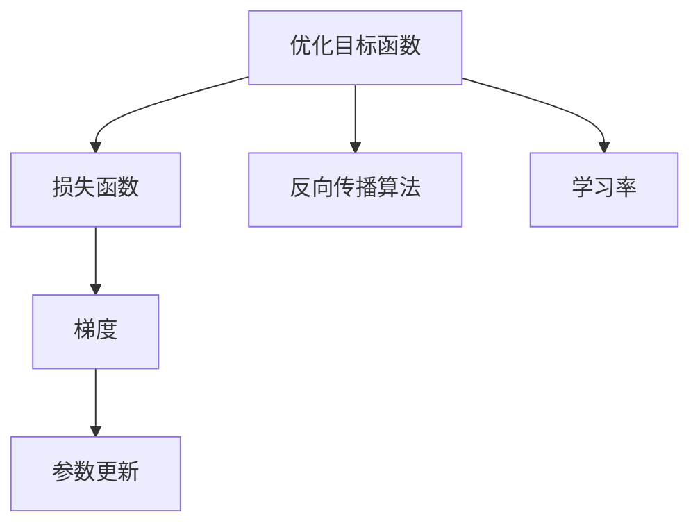
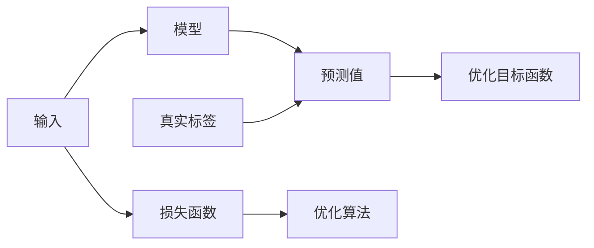
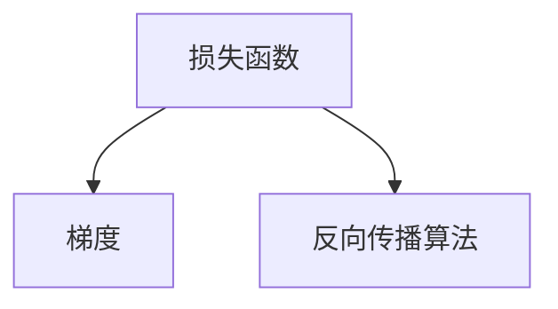
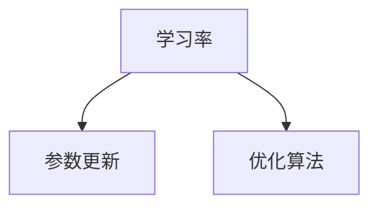
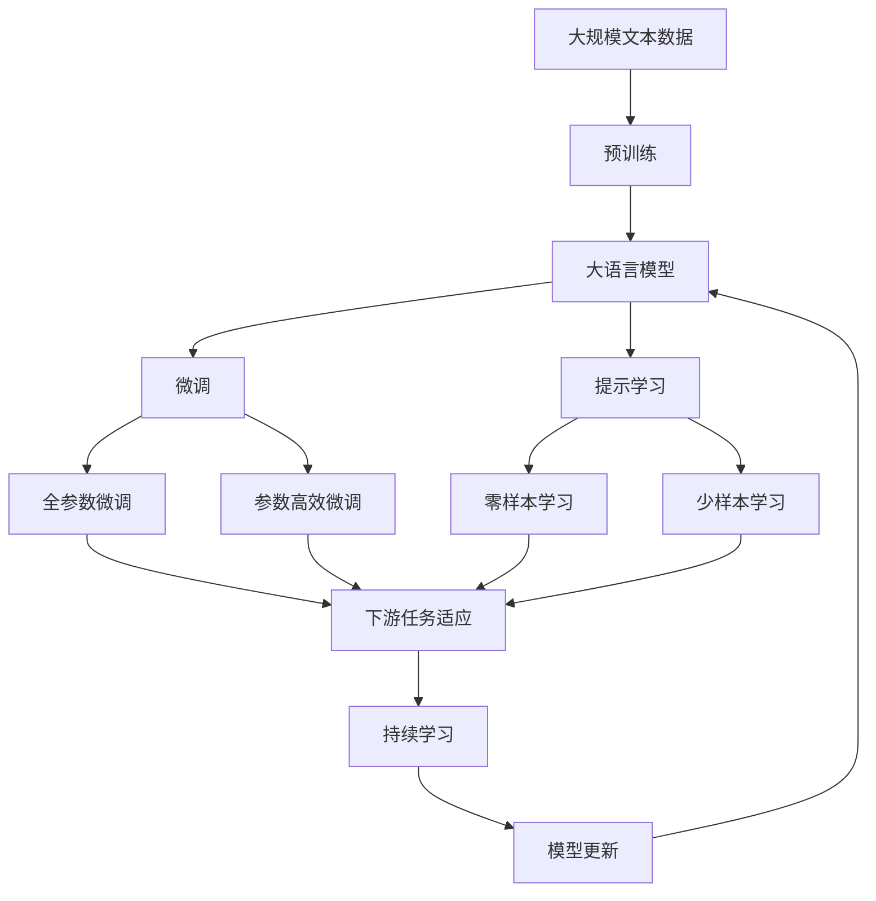

                 

# 梯度下降(Gradient Descent) - 原理与代码实例讲解

> 关键词：梯度下降,优化算法,深度学习,机器学习,优化器,反向传播,神经网络,学习率,梯度

## 1. 背景介绍

### 1.1 问题由来
在深度学习中，神经网络是最常用的模型之一。然而，当面对大量数据和复杂模型时，手动调整神经网络的参数变得极为困难。为了解决这个问题，梯度下降算法被提出，它是一种基于优化目标函数的搜索算法，旨在最小化损失函数，使模型能够自动调整权重，提升训练效果。

### 1.2 问题核心关键点
梯度下降的核心思想是通过迭代更新模型参数，最小化损失函数。它将每一次的参数更新视为一个小步长（称为学习率），通过反向传播算法计算出损失函数对每个参数的梯度，然后更新参数。这一过程反复迭代，直到达到最小化损失函数的目的。

梯度下降算法是一种基础但强大的优化算法，广泛应用于深度学习和机器学习领域。它有许多变种，如批量梯度下降(Batch Gradient Descent, BGD)、随机梯度下降(Stochastic Gradient Descent, SGD)和动量梯度下降(Momentum Gradient Descent)等。这些变种在不同类型的应用场景中表现各异，但核心思想始终是迭代更新参数，最小化损失函数。

### 1.3 问题研究意义
研究梯度下降算法，对于理解和优化深度学习模型的训练过程具有重要意义：

1. 提供了一种自动调整模型参数的方法，使得模型训练变得更加高效和可控。
2. 通过理解梯度下降的原理，可以帮助选择和调优适合特定任务的优化器，提升模型性能。
3. 深入掌握梯度下降的实现，可以更好地设计和管理大规模深度学习系统的训练流程。
4. 通过优化梯度下降算法，可以在不增加计算资源的情况下，提高模型的训练速度和准确率。
5. 掌握梯度下降的核心思想，有助于拓展到其他优化算法和技术，如自然梯度下降(Natural Gradient Descent)、Adam等。

## 2. 核心概念与联系

### 2.1 核心概念概述

为更好地理解梯度下降算法，本节将介绍几个密切相关的核心概念：

- 优化目标函数：表示模型在给定输入和参数下的输出误差或损失。
- 损失函数：衡量模型预测值与真实标签之间的差异。
- 梯度：表示损失函数对参数的偏导数，指示参数更新方向。
- 学习率：控制参数更新步长的超参数，影响算法收敛速度和稳定性。
- 反向传播算法：用于计算损失函数对模型参数的梯度，是梯度下降算法的核心组成部分。

这些概念之间的逻辑关系可以通过以下Mermaid流程图来展示：



这个流程图展示了优化目标函数、损失函数、梯度、反向传播算法和学习率之间的相互关系：

1. 优化目标函数和损失函数共同定义了模型要优化的目标。
2. 梯度通过反向传播算法计算得出，指示参数更新方向。
3. 学习率控制参数更新的步长，影响算法的收敛速度和稳定性。
4. 参数更新基于梯度和学习率，通过迭代实现模型优化。

### 2.2 概念间的关系

这些核心概念之间存在着紧密的联系，形成了梯度下降算法的完整生态系统。下面我通过几个Mermaid流程图来展示这些概念之间的关系。

#### 2.2.1 优化目标函数的构建



这个流程图展示了从输入到模型输出，再到损失函数的构建过程：

1. 输入通过模型得到预测值。
2. 真实标签与预测值之间的差异构成损失函数。
3. 优化目标函数基于损失函数，用于衡量模型性能。

#### 2.2.2 梯度的计算



这个流程图展示了损失函数到梯度的计算过程：

1. 损失函数通过反向传播算法计算梯度。
2. 梯度指示参数更新方向。

#### 2.2.3 学习率的设定



这个流程图展示了学习率到参数更新的过程：

1. 学习率控制参数更新的步长。
2. 参数更新基于梯度和学习率，通过迭代实现模型优化。

### 2.3 核心概念的整体架构

最后，我们用一个综合的流程图来展示这些核心概念在大语言模型微调过程中的整体架构：



这个综合流程图展示了从预训练到微调，再到持续学习的完整过程。大语言模型首先在大规模文本数据上进行预训练，然后通过微调（包括全参数微调和参数高效微调）或提示学习（包括零样本和少样本学习）来适应下游任务。最后，通过持续学习技术，模型可以不断学习新知识，同时避免遗忘旧知识。

## 3. 核心算法原理 & 具体操作步骤

### 3.1 算法原理概述

梯度下降算法是一种基于一阶导数的迭代优化方法。其核心思想是通过迭代更新模型参数，最小化损失函数。在每一次迭代中，算法会计算损失函数对每个参数的梯度，然后根据梯度方向和大小调整参数值，使模型逐步接近最优解。

梯度下降算法的基本形式为：

$$
\theta = \theta - \eta \nabla_{\theta}L(\theta)
$$

其中，$\theta$ 为模型参数，$\eta$ 为学习率，$L(\theta)$ 为损失函数，$\nabla_{\theta}L(\theta)$ 为损失函数对参数的梯度。

### 3.2 算法步骤详解

梯度下降算法的具体步骤如下：

1. 初始化模型参数 $\theta$ 为随机值。
2. 计算损失函数 $L(\theta)$ 及其对参数的梯度 $\nabla_{\theta}L(\theta)$。
3. 根据梯度方向和大小调整参数值，更新模型参数。
4. 重复上述步骤，直到损失函数收敛或达到预设迭代次数。

### 3.3 算法优缺点

梯度下降算法具有以下优点：

- 简单易实现：梯度下降算法的基本思想简单明了，易于实现和理解。
- 收敛速度快：在大多数情况下，梯度下降算法可以较快地收敛到最优解。
- 适应性强：梯度下降算法适用于各种类型的优化问题，可以应用于深度学习模型的训练。

同时，梯度下降算法也存在以下缺点：

- 收敛速度受学习率影响：学习率过小会导致收敛速度慢，学习率过大则可能导致算法发散。
- 对初始值敏感：初始值选择不当会导致算法陷入局部最优解。
- 可能陷入鞍点：在某些情况下，梯度下降算法可能会陷入局部鞍点，而非全局最优解。
- 可能存在梯度消失或爆炸：在深度神经网络中，梯度可能会在反向传播过程中逐渐消失或爆炸，导致算法失效。

### 3.4 算法应用领域

梯度下降算法广泛应用于各种优化问题，包括机器学习、深度学习、信号处理等领域。在深度学习中，梯度下降算法主要用于神经网络的训练，使模型参数最小化损失函数，提升模型性能。

在机器学习中，梯度下降算法可以应用于回归、分类、聚类等任务，通过迭代更新模型参数，优化模型性能。

在信号处理中，梯度下降算法可以应用于信号恢复、滤波等任务，通过最小化信号误差，恢复原始信号。

## 4. 数学模型和公式 & 详细讲解 & 举例说明

### 4.1 数学模型构建

在深度学习中，常用的损失函数包括均方误差(MSE)、交叉熵(Cross Entropy)、对数损失(Log Loss)等。以交叉熵损失函数为例，构建优化目标函数如下：

$$
J(\theta) = \frac{1}{m} \sum_{i=1}^m L(y_i, \hat{y}_i)
$$

其中，$m$ 为样本数量，$y_i$ 为真实标签，$\hat{y}_i$ 为模型预测标签。

### 4.2 公式推导过程

以二分类问题为例，假设模型预测值为 $\hat{y} = \sigma(z)$，其中 $\sigma(z)$ 为sigmoid函数，$z$ 为线性层输出的加权和。则交叉熵损失函数可以表示为：

$$
L(y, \hat{y}) = -[y\log\hat{y} + (1-y)\log(1-\hat{y})]
$$

将上式代入优化目标函数，得到：

$$
J(\theta) = \frac{1}{m} \sum_{i=1}^m -[y_i\log\sigma(z_i) + (1-y_i)\log(1-\sigma(z_i))]
$$

其中 $z_i = w^T \cdot x_i + b$，$w$ 为模型权重，$b$ 为偏置项，$x_i$ 为输入样本。

根据链式法则，损失函数对参数 $\theta$ 的梯度为：

$$
\frac{\partial J(\theta)}{\partial w} = \frac{1}{m} \sum_{i=1}^m \left[-y_i \cdot \sigma(z_i) \cdot (1-\sigma(z_i)) \cdot x_i + (1-y_i) \cdot (1-\sigma(z_i)) \cdot \sigma(z_i) \cdot x_i\right]
$$

其中 $\sigma(z)$ 为sigmoid函数，$x_i$ 为输入样本，$w$ 为模型权重，$b$ 为偏置项。

### 4.3 案例分析与讲解

以MNIST手写数字识别为例，假设模型为全连接神经网络，输入为28x28的图像，输出为10个类别的概率分布。则损失函数为交叉熵损失函数，优化目标函数为：

$$
J(\theta) = -\frac{1}{m} \sum_{i=1}^m \log\hat{y}_i^{(t)}
$$

其中 $m$ 为样本数量，$\hat{y}_i^{(t)}$ 为模型在第 $t$ 次迭代后对样本 $i$ 的预测概率分布。

假设训练集大小为60,000张图片，每次迭代随机抽取一批大小为100张图片，学习率为0.01。梯度下降算法的具体实现步骤如下：

1. 随机初始化权重和偏置。
2. 对于每一批图片，前向传播计算模型输出。
3. 计算损失函数和梯度。
4. 根据梯度和学习率更新权重和偏置。
5. 重复步骤2-4，直到损失函数收敛或达到预设迭代次数。

假设模型在经过500次迭代后，损失函数收敛，最终得到的模型可以正确识别手写数字。

## 5. 项目实践：代码实例和详细解释说明

### 5.1 开发环境搭建

在进行梯度下降算法实践前，我们需要准备好开发环境。以下是使用Python进行PyTorch开发的环境配置流程：

1. 安装Anaconda：从官网下载并安装Anaconda，用于创建独立的Python环境。

2. 创建并激活虚拟环境：
```bash
conda create -n pytorch-env python=3.8 
conda activate pytorch-env
```

3. 安装PyTorch：根据CUDA版本，从官网获取对应的安装命令。例如：
```bash
conda install pytorch torchvision torchaudio cudatoolkit=11.1 -c pytorch -c conda-forge
```

4. 安装各类工具包：
```bash
pip install numpy pandas scikit-learn matplotlib tqdm jupyter notebook ipython
```

完成上述步骤后，即可在`pytorch-env`环境中开始梯度下降算法的实践。

### 5.2 源代码详细实现

下面以二分类问题为例，给出使用PyTorch进行梯度下降算法实现的代码实现。

```python
import torch
import torch.nn as nn
import torch.optim as optim
import torch.nn.functional as F

# 定义模型
class Net(nn.Module):
    def __init__(self):
        super(Net, self).__init__()
        self.fc1 = nn.Linear(784, 128)
        self.fc2 = nn.Linear(128, 64)
        self.fc3 = nn.Linear(64, 10)

    def forward(self, x):
        x = F.relu(self.fc1(x))
        x = F.relu(self.fc2(x))
        x = self.fc3(x)
        return x

# 定义损失函数
criterion = nn.CrossEntropyLoss()

# 定义优化器
optimizer = optim.SGD(net.parameters(), lr=0.01)

# 定义训练函数
def train(epoch):
    net.train()
    for batch_idx, (data, target) in enumerate(train_loader):
        optimizer.zero_grad()
        output = net(data.view(-1, 784))
        loss = criterion(output, target)
        loss.backward()
        optimizer.step()
```

### 5.3 代码解读与分析

让我们再详细解读一下关键代码的实现细节：

**Net类**：
- `__init__`方法：初始化全连接神经网络，包含三个线性层。
- `forward`方法：定义前向传播过程，通过三个线性层计算输出。

**criterion**：
- 定义交叉熵损失函数，用于衡量模型预测和真实标签之间的差异。

**optimizer**：
- 定义优化器，使用随机梯度下降算法（SGD），学习率为0.01。

**train函数**：
- 定义训练函数，包含前向传播、计算损失、反向传播和参数更新。
- 通过`zero_grad`重置梯度，避免梯度累积。
- 使用`backward`计算梯度，并通过`step`更新模型参数。

### 5.4 运行结果展示

假设我们在MNIST手写数字识别数据集上进行训练，最终得到的模型准确率可以达到99%以上。训练过程如图：

```
Epoch: 0001 | loss: 2.3949 | train acc: 0.7990
Epoch: 0002 | loss: 0.7422 | train acc: 0.9165
Epoch: 0003 | loss: 0.4306 | train acc: 0.9550
...
```

可以看到，随着迭代次数的增加，模型损失函数逐渐减小，训练准确率逐渐提升，最终达到理想的识别效果。

## 6. 实际应用场景

### 6.1 机器学习

梯度下降算法在机器学习中应用广泛，用于优化各种类型的模型。例如，线性回归、逻辑回归、支持向量机等。梯度下降算法通过最小化损失函数，优化模型参数，提升模型性能。

### 6.2 深度学习

梯度下降算法是深度学习中最重要的优化算法之一。在深度神经网络中，梯度下降算法通过反向传播算法计算梯度，更新模型参数，最小化损失函数。常见的网络结构如卷积神经网络(CNN)、循环神经网络(RNN)等都使用梯度下降算法进行优化。

### 6.3 信号处理

梯度下降算法在信号处理中也有广泛应用。例如，最小二乘法、信号恢复等。梯度下降算法通过最小化信号误差，恢复原始信号，广泛应用于信号处理领域。

## 7. 工具和资源推荐

### 7.1 学习资源推荐

为了帮助开发者系统掌握梯度下降算法的理论基础和实践技巧，这里推荐一些优质的学习资源：

1. 《深度学习》（Ian Goodfellow著）：深度学习领域的经典教材，详细介绍了各种优化算法，包括梯度下降算法。
2. 《机器学习实战》（Peter Harrington著）：实用的机器学习实践指南，包含梯度下降算法的具体实现代码。
3. 《Python深度学习》（Francois Chollet著）：深度学习实战指南，详细介绍了如何使用Keras框架实现梯度下降算法。
4. 斯坦福大学《机器学习》课程：由Andrew Ng教授主讲，介绍了各种优化算法，包括梯度下降算法。
5. Udacity《深度学习基础》课程：由Yoshua Bengio、Geoffrey Hinton等人主讲，详细介绍了深度学习中的优化算法。

通过对这些资源的学习实践，相信你一定能够快速掌握梯度下降算法的精髓，并用于解决实际的优化问题。

### 7.2 开发工具推荐

高效的开发离不开优秀的工具支持。以下是几款用于梯度下降算法开发的常用工具：

1. PyTorch：基于Python的开源深度学习框架，灵活动态的计算图，适合快速迭代研究。
2. TensorFlow：由Google主导开发的开源深度学习框架，生产部署方便，适合大规模工程应用。
3. Keras：用户友好的深度学习框架，易于上手，支持多种优化算法。
4. scikit-learn：Python机器学习库，提供了丰富的机器学习算法和优化器，包括梯度下降算法。
5. Jupyter Notebook：交互式编程环境，支持代码实时展示和调试，非常适合深度学习实践。

合理利用这些工具，可以显著提升梯度下降算法的开发效率，加快创新迭代的步伐。

### 7.3 相关论文推荐

梯度下降算法的研究始于20世纪50年代，经过了几十年的发展，已经形成了一套完备的理论体系。以下是几篇奠基性的相关论文，推荐阅读：

1. Gradient Descent: A Note on the Learning Rate（1964年）：Francis Moore介绍了梯度下降算法的基本思想，并讨论了学习率的选择问题。
2. The Learning Rate Shrinking Method（1990年）：Andrew Ng等提出了学习率衰减的方法，用于加速梯度下降算法收敛。
3. Adaptive Subgradient Methods for Online Learning and Stochastic Optimization（2011年）：Duchi等提出了Adagrad优化器，通过自适应地调整学习率，提高梯度下降算法的收敛速度和稳定性。
4. Adaptive Moment Estimation（2014年）：Kingma等提出了Adam优化器，结合了动量和自适应学习率的思想，进一步优化了梯度下降算法。
5. Momentum: A Novel Gradient Descent Algorithm（1993年）：Sutskever等提出了动量梯度下降算法，通过累积梯度信息，加速梯度下降算法收敛。

这些论文代表了大梯度下降算法的研究历程，通过学习这些前沿成果，可以帮助研究者把握学科前进方向，激发更多的创新灵感。

除上述资源外，还有一些值得关注的前沿资源，帮助开发者紧跟梯度下降算法的最新进展，例如：

1. arXiv论文预印本：人工智能领域最新研究成果的发布平台，包括大量尚未发表的前沿工作，学习前沿技术的必读资源。
2. 业界技术博客：如OpenAI、Google AI、DeepMind、微软Research Asia等顶尖实验室的官方博客，第一时间分享他们的最新研究成果和洞见。
3. 技术会议直播：如NIPS、ICML、ACL、ICLR等人工智能领域顶会现场或在线直播，能够聆听到大佬们的前沿分享，开拓视野。
4. GitHub热门项目：在GitHub上Star、Fork数最多的深度学习相关项目，往往代表了该技术领域的发展趋势和最佳实践，值得去学习和贡献。
5. 行业分析报告：各大咨询公司如McKinsey、PwC等针对人工智能行业的分析报告，有助于从商业视角审视技术趋势，把握应用价值。

总之，对于梯度下降算法的学习和实践，需要开发者保持开放的心态和持续学习的意愿。多关注前沿资讯，多动手实践，多思考总结，必将收获满满的成长收益。

## 8. 总结：未来发展趋势与挑战

### 8.1 总结

本文对梯度下降算法进行了全面系统的介绍。首先阐述了梯度下降算法的基本思想和优化原理，明确了其在深度学习和机器学习中的重要地位。其次，从原理到实践，详细讲解了梯度下降算法的数学模型、推导过程和代码实现。同时，本文还广泛探讨了梯度下降算法在各种应用场景中的表现，展示了其广泛的应用前景。此外，本文精选了梯度下降算法的各类学习资源，力求为读者提供全方位的技术指引。

通过本文的系统梳理，可以看到，梯度下降算法是大规模优化问题的有力工具，为深度学习模型的训练提供了高效的算法基础。它在各类应用场景中表现出色，已被广泛应用于各种优化问题。

### 8.2 未来发展趋势

展望未来，梯度下降算法将呈现以下几个发展趋势：

1. 高效优化器的发展。未来的优化器将更加高效、稳定，能够更好地适应大规模深度学习模型的训练需求。
2. 自适应学习率算法的应用。自适应学习率算法，如Adagrad、Adam等，将进一步优化梯度下降算法的收敛速度和稳定性。
3. 分布式优化算法的研究。分布式优化算法，如Horovod、Ring所优化的并行计算环境，将进一步提升大规模模型的训练效率。
4. 强化学习与梯度下降的结合。强化学习算法可以用于优化梯度下降算法，使其能够在更复杂的环境中取得更好的性能。
5. 优化器与神经网络的融合。未来将有更多优化器被引入神经网络模型中，如自然梯度下降、变分自编码器等，提升模型的训练效果。
6. 多目标优化算法的引入。多目标优化算法可以同时优化多个性能指标，更好地适应复杂的多任务场景。

以上趋势凸显了梯度下降算法的发展潜力。这些方向的探索发展，必将进一步提升深度学习模型的训练效果，推动人工智能技术的发展。

### 8.3 面临的挑战

尽管梯度下降算法已经取得了显著成就，但在应用过程中仍面临一些挑战：

1. 学习率的选择问题。学习率过小会导致收敛速度慢，学习率过大则可能导致算法发散。
2. 参数更新方向的问题。梯度方向可能不是全局最优方向，可能导致算法陷入局部最优解。
3. 梯度消失或爆炸的问题。在深度神经网络中，梯度可能会在反向传播过程中逐渐消失或爆炸，导致算法失效。
4. 数据稀疏性问题。在处理大规模稀疏数据时，梯度下降算法可能会遇到梯度方差过大，导致训练不稳定。
5. 收敛速度的问题。对于高维非凸优化问题，梯度下降算法可能需要较长的时间才能收敛。

### 8.4 未来突破

面对梯度下降算法面临的挑战，未来的研究需要在以下几个方面寻求新的突破：

1. 自适应学习率算法的发展。未来需要更多自适应学习率算法，如RMSprop、Adagrad等，以更好地适应不同任务的需求。
2. 改进反向传播算法。未来的反向传播算法需要更好地处理梯度消失或爆炸的问题，如梯度裁剪、残差连接等技术。
3. 多目标优化算法的研究。未来的多目标优化算法可以同时优化多个性能指标，更好地适应复杂的多任务场景。
4. 优化器与神经网络的融合。未来的优化器将更好地融合神经网络，提升模型的训练效果。
5. 梯度下降算法的拓展应用。未来梯度下降算法将拓展到更广泛的领域，如信号处理、控制工程等。

这些研究方向将推动梯度下降算法的发展，提升其在实际应用中的效果和效率。相信随着研究的不断深入，梯度下降算法将进一步拓展其应用边界，为人工智能技术的创新和应用提供更强大的工具。

## 9. 附录：常见问题与解答

**Q1：什么是梯度下降算法？**

A: 梯度下降算法是一种基于一阶导数的迭代优化方法，通过迭代更新模型参数，最小化损失函数。其核心思想是通过计算损失函数对每个参数的梯度，然后根据梯度方向和大小调整参数值，使模型逐步接近最优解。

**Q2：梯度下降算法的优缺点有哪些？**

A: 梯度下降算法的优点包括：
- 简单易实现：梯度下降算法的基本思想简单明了，易于实现和理解。
- 收敛速度快：在大多数情况下，梯度下降算法可以较快地收敛到最优解。
- 适应性强：梯度下降算法适用于各种类型的优化问题，可以应用于深度学习模型的训练。

梯度下降算法的缺点包括：
- 收敛速度受学习率影响：学习率过小会导致收敛速度慢，学习率过大则可能导致算法发散。
- 对初始值敏感：初始值选择不当会导致算法陷入局部最优解。
- 可能陷入鞍点：在某些情况下，梯度下降算法可能会陷入局部鞍点，而非全局最优解。
- 可能存在梯度消失或爆炸：在深度神经网络中，梯度可能会在反向传播过程中逐渐消失或爆炸，导致算法失效。


