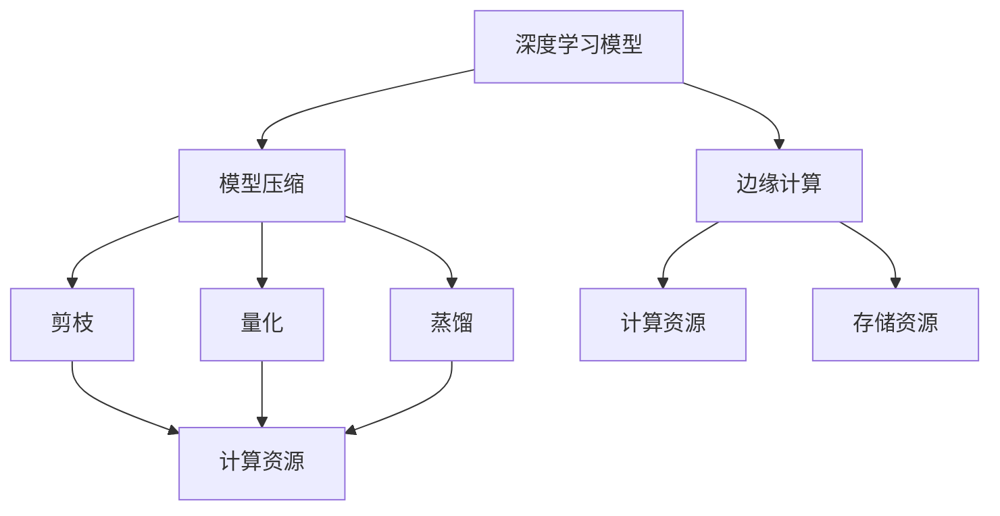
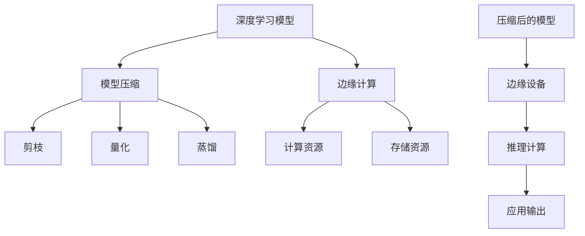

                 

## 1. 背景介绍

### 1.1 问题由来
随着人工智能技术的不断发展，深度学习模型在图像识别、语音识别、自然语言处理等领域取得了显著的进展。然而，这些大模型通常具有数亿甚至数十亿的参数，需要庞大的计算资源进行训练和推理。面对高昂的计算成本和能源消耗，如何高效利用有限的资源，实现模型压缩和优化，成为了一个重要的研究方向。

### 1.2 问题核心关键点
模型压缩技术（Model Compression）旨在通过减少深度学习模型的参数量、降低计算复杂度，提高模型的推理速度和能效比，实现模型的高效部署和应用。在边缘计算（Edge Computing）环境中，计算资源和存储空间有限，对模型压缩的需求更为迫切。边缘计算的应用场景包括智能家居、工业物联网、移动设备等，模型压缩可以有效降低传输和计算成本，提高响应速度，满足实时性和低延迟的需求。

### 1.3 问题研究意义
研究模型压缩技术在边缘计算中的应用，对于拓展人工智能技术的应用范围，优化边缘计算资源利用，具有重要的理论和实际意义：

1. **降低计算成本**：模型压缩可以大幅降低深度学习模型的计算复杂度，从而减少计算资源的使用，降低成本。
2. **提升计算效率**：通过压缩模型，可以加快模型的推理速度，提高计算效率，满足实时性要求。
3. **优化存储需求**：模型压缩可以减小模型文件大小，减少存储空间需求，适用于资源受限的移动设备和边缘设备。
4. **增强应用灵活性**：压缩后的模型可以方便地在不同硬件平台上部署和运行，增强应用的灵活性和适应性。
5. **促进边缘计算发展**：模型压缩技术是推动边缘计算技术在实际应用中落地和普及的关键，有助于实现智能设备和系统的高效运行。

## 2. 核心概念与联系

### 2.1 核心概念概述

在讨论模型压缩技术在边缘计算中的应用之前，我们需要先了解一些核心概念：

- **深度学习模型（Deep Learning Model）**：由多层神经网络构成的复杂函数映射模型，用于处理复杂的非线性关系。
- **模型压缩（Model Compression）**：通过剪枝、量化、蒸馏等技术减少模型参数量和计算复杂度，提高模型的推理速度和能效比。
- **边缘计算（Edge Computing）**：在靠近数据源的地方进行计算和数据处理，以减少数据传输和提高计算效率的技术。
- **剪枝（Pruning）**：去除模型中不必要的参数，减少计算复杂度，但可能会影响模型的性能。
- **量化（Quantization）**：将浮点数参数转换为固定位数的整数或小数，减少存储空间和计算资源消耗，但可能会引入精度损失。
- **蒸馏（Knowledge Distillation）**：通过训练一个较小、较轻的模型来捕捉大型模型的知识，提高模型的推理效率。

这些核心概念之间存在紧密的联系，形成了深度学习模型压缩技术的基本框架。以下是一个简单的Mermaid流程图，展示模型压缩、边缘计算与这些核心概念之间的关系：



### 2.2 概念间的关系

这些核心概念之间的关系可以通过以下详细的描述来理解：

- **模型压缩**：是实现深度学习模型在边缘计算中高效应用的基础技术。
- **剪枝、量化、蒸馏**：是模型压缩的主要方法，通过这些技术可以减少模型的参数量、降低计算复杂度。
- **边缘计算**：提供了模型压缩的应用场景，使模型可以在资源受限的设备上高效运行。
- **计算资源和存储资源**：是边缘计算环境的限制因素，模型压缩技术可以在这些资源的约束下优化模型的性能和效率。

### 2.3 核心概念的整体架构

下图展示了一个更全面的模型压缩技术在边缘计算中的应用架构：



在这个架构中，深度学习模型经过压缩技术处理，生成轻量级模型。压缩后的模型可以在边缘设备上高效运行，执行推理计算，并输出应用结果。整个架构通过模型压缩和边缘计算的结合，实现了深度学习模型的资源优化和高效应用。

## 3. 核心算法原理 & 具体操作步骤
### 3.1 算法原理概述

模型压缩技术的主要目标是减少深度学习模型的参数量和计算复杂度，提高模型的推理速度和能效比。其核心算法原理可以分为以下几个方面：

- **剪枝（Pruning）**：通过去除模型中不必要的参数，减少计算复杂度，提高推理速度。
- **量化（Quantization）**：将浮点数参数转换为固定位数的整数或小数，减少存储空间和计算资源消耗。
- **蒸馏（Knowledge Distillation）**：通过训练一个较小、较轻的模型来捕捉大型模型的知识，提高模型的推理效率。
- **低秩分解（Low-Rank Decomposition）**：将高维矩阵分解为低维矩阵，减少模型参数量。
- **权值共享（Weight Sharing）**：通过共享权重，减少模型参数量。

### 3.2 算法步骤详解

以下是模型压缩技术在边缘计算中的具体操作步骤：

1. **数据准备**：收集和准备训练数据，包括原始模型参数和目标设备上可用的计算资源和存储资源。
2. **模型加载**：将原始模型加载到边缘设备上，评估其推理速度和能效比。
3. **剪枝**：对模型进行剪枝，去除不必要的参数。可以使用网络结构剪枝、权重剪枝等方法。
4. **量化**：对剪枝后的模型进行量化，将浮点数参数转换为整数或小数。可以使用混合精度量化、定点量化等方法。
5. **蒸馏**：对量化后的模型进行蒸馏，训练一个较小、较轻的模型来捕捉大型模型的知识。可以使用单任务蒸馏、多任务蒸馏等方法。
6. **低秩分解**：对蒸馏后的模型进行低秩分解，减少模型参数量。可以使用奇异值分解、矩阵分解等方法。
7. **权值共享**：对分解后的模型进行权值共享，进一步减少模型参数量。可以使用双边共享、多边共享等方法。
8. **模型评估**：在目标设备上评估压缩后的模型推理速度和能效比，优化参数和超参数。
9. **模型部署**：将优化后的模型部署到边缘设备上，执行推理计算。

### 3.3 算法优缺点

模型压缩技术在边缘计算中的应用具有以下优点：

- **降低计算成本**：通过减少模型参数量和计算复杂度，可以降低计算资源的使用，减少计算成本。
- **提升计算效率**：压缩后的模型推理速度更快，能效比更高，满足实时性和低延迟的需求。
- **优化存储需求**：压缩后的模型文件大小更小，减少存储空间需求，适用于资源受限的移动设备和边缘设备。
- **增强应用灵活性**：压缩后的模型可以方便地在不同硬件平台上部署和运行，增强应用的灵活性和适应性。

同时，模型压缩技术也存在一些缺点：

- **精度损失**：压缩技术可能会引入精度损失，影响模型的性能。
- **模型复现性**：压缩后的模型可能难以复现原始模型的效果，影响应用效果的一致性。
- **复杂度增加**：模型压缩技术的实现可能增加模型的复杂度，需要更多的计算资源和存储空间。

### 3.4 算法应用领域

模型压缩技术在边缘计算中的应用非常广泛，以下是几个典型的应用领域：

1. **移动设备**：在智能手机、平板电脑等移动设备上部署压缩后的模型，实现图像识别、语音识别、自然语言处理等功能，提高设备的智能化水平。
2. **工业物联网**：在工业物联网设备上部署压缩后的模型，实现设备监测、预测维护、质量控制等功能，提高生产效率和产品质量。
3. **智能家居**：在智能家居设备上部署压缩后的模型，实现语音助手、智能控制、环境监测等功能，提高家居的智能化水平。
4. **自动驾驶**：在自动驾驶车辆上部署压缩后的模型，实现环境感知、路径规划、决策控制等功能，提高行车安全性和舒适性。
5. **医疗健康**：在医疗设备上部署压缩后的模型，实现疾病诊断、健康监测、药物推荐等功能，提高医疗服务的智能化水平。

## 4. 数学模型和公式 & 详细讲解 & 举例说明

### 4.1 数学模型构建

模型压缩技术在数学上的建模可以分为以下几个部分：

- **原始模型**：深度学习模型的参数表示为 $\theta = (\theta_1, \theta_2, ..., \theta_n)$，其中 $\theta_i$ 表示第 $i$ 个参数的值。
- **压缩模型**：经过压缩后的模型参数表示为 $\hat{\theta} = (\hat{\theta}_1, \hat{\theta}_2, ..., \hat{\theta}_m)$，其中 $m$ 表示压缩后的模型参数量。
- **剪枝策略**：定义剪枝策略 $\mathcal{P}$，决定哪些参数应该保留，哪些参数应该去除。

### 4.2 公式推导过程

以下是模型压缩技术在数学上的详细推导过程：

1. **剪枝**：对于原始模型中的参数 $\theta_i$，定义剪枝阈值 $\tau$，当 $|\theta_i| \leq \tau$ 时，保留参数，否则去除参数。
   $$
   \hat{\theta}_i = \theta_i, \quad |\theta_i| > \tau
   $$
   $$
   \hat{\theta}_i = 0, \quad |\theta_i| \leq \tau
   $$

2. **量化**：对于保留的参数 $\theta_i$，将其转换为整数或小数，表示为 $\hat{\theta}_i$。可以使用对称量化或非对称量化方法。
   $$
   \hat{\theta}_i = \text{Quant}(\theta_i, \Delta), \quad \Delta \in \{2^{-q}, -2^{-q}\}, \quad q \in \{1, 2, ..., k\}
   $$

3. **蒸馏**：定义蒸馏策略 $\mathcal{K}$，将大型模型的知识传递给小型模型。
   $$
   \hat{\theta} = \mathcal{K}(\theta)
   $$

4. **低秩分解**：对于蒸馏后的模型，定义低秩分解策略 $\mathcal{L}$，将高维矩阵分解为低维矩阵。
   $$
   \hat{\theta} = \mathcal{L}(\theta)
   $$

5. **权值共享**：对于分解后的模型，定义权值共享策略 $\mathcal{W}$，共享权重参数。
   $$
   \hat{\theta} = \mathcal{W}(\theta)
   $$

### 4.3 案例分析与讲解

假设原始模型参数 $\theta$ 有 $n=1000$ 个，经过剪枝、量化、蒸馏、低秩分解和权值共享后，压缩后的模型参数量为 $m=100$ 个。具体实现步骤如下：

1. **剪枝**：保留绝对值大于 $1$ 的参数，去除绝对值小于等于 $1$ 的参数。保留的参数量为 $100$ 个。

2. **量化**：将保留的参数 $\hat{\theta}$ 转换为 $2$ 位整数或小数，保留的参数量为 $100$ 个。

3. **蒸馏**：通过蒸馏策略 $\mathcal{K}$，将原始模型的知识传递给压缩后的模型。

4. **低秩分解**：通过低秩分解策略 $\mathcal{L}$，将蒸馏后的模型参数分解为 $2$ 个低维矩阵，保留的参数量为 $100$ 个。

5. **权值共享**：通过权值共享策略 $\mathcal{W}$，共享权重参数，保留的参数量为 $100$ 个。

最终，压缩后的模型参数量为 $m=100$ 个，显著小于原始模型参数量 $n=1000$ 个，实现了模型压缩的目标。

## 5. 项目实践：代码实例和详细解释说明

### 5.1 开发环境搭建

在实际项目开发中，需要准备以下开发环境：

1. **Python**：选择 Python 作为开发语言，Python 生态系统丰富，适合深度学习模型开发。
2. **深度学习框架**：选择深度学习框架 TensorFlow 或 PyTorch，这些框架支持模型的构建、训练、压缩和部署。
3. **边缘计算平台**：选择边缘计算平台，如 AWS Greengrass、Google Edge TPU 等，支持模型部署和推理计算。
4. **计算资源和存储资源**：确保目标设备上具备足够的计算资源和存储资源，满足模型压缩和部署的需求。

### 5.2 源代码详细实现

下面以 TensorFlow 框架为例，展示模型压缩技术的代码实现：

```python
import tensorflow as tf

# 定义原始模型
original_model = tf.keras.Sequential([
    tf.keras.layers.Dense(256, input_shape=(784, ), activation='relu'),
    tf.keras.layers.Dense(10, activation='softmax')
])

# 定义剪枝策略
def pruning_func(model, i):
    if abs(model.layers[i].kernel.numpy()[0,0]) > 1:
        return model.layers[i].kernel
    else:
        return None

# 定义量化策略
def quantization_func(model):
    return tf.keras.Model(inputs=model.input,
                          outputs=tf.quantization.quantize_v2(model.layers[-1].output, num_bits=2, round_mode='HALF_TO_EVEN'))

# 定义蒸馏策略
def distillation_func(model):
    distilled_model = tf.keras.Model(inputs=model.input,
                                    outputs=model.layers[-1])
    distilled_model.compile(optimizer='adam', loss='sparse_categorical_crossentropy', metrics=['accuracy'])
    # 训练蒸馏模型
    # ...
    return distilled_model

# 定义低秩分解策略
def low_rank_decomposition(model):
    rank = 2
    rank_matrix = tf.linalg.qr(model.layers[-1].kernel, full_matrices=False)[:, :rank]
    return tf.keras.Model(inputs=model.input,
                          outputs=rank_matrix)

# 定义权值共享策略
def weight_sharing(model):
    shared_model = tf.keras.Model(inputs=model.input,
                                 outputs=model.layers[-1].kernel)
    shared_model.compile(optimizer='adam', loss='sparse_categorical_crossentropy', metrics=['accuracy'])
    # 训练共享模型
    # ...
    return shared_model

# 加载原始模型
original_model.load_weights('original_model.h5')

# 应用模型压缩技术
pruned_model = tf.keras.Sequential(tf.keras.layers.Lambda(pruning_func, input_shape=(784, ), output_shape=(256, )))
quantized_model = quantization_func(pruned_model)
distilled_model = distillation_func(quantized_model)
low_rank_model = low_rank_decomposition(distilled_model)
shared_model = weight_sharing(low_rank_model)

# 评估压缩后的模型
original_model.compile(optimizer='adam', loss='sparse_categorical_crossentropy', metrics=['accuracy'])
original_model.fit(train_data, train_labels, epochs=10, batch_size=32)
distilled_model.compile(optimizer='adam', loss='sparse_categorical_crossentropy', metrics=['accuracy'])
distilled_model.fit(train_data, train_labels, epochs=10, batch_size=32)
low_rank_model.compile(optimizer='adam', loss='sparse_categorical_crossentropy', metrics=['accuracy'])
low_rank_model.fit(train_data, train_labels, epochs=10, batch_size=32)
shared_model.compile(optimizer='adam', loss='sparse_categorical_crossentropy', metrics=['accuracy'])
shared_model.fit(train_data, train_labels, epochs=10, batch_size=32)

# 部署压缩后的模型
original_model.save('original_model.h5')
distilled_model.save('distilled_model.h5')
low_rank_model.save('low_rank_model.h5')
shared_model.save('shared_model.h5')
```

### 5.3 代码解读与分析

以上代码实现了深度学习模型的压缩技术，主要包括剪枝、量化、蒸馏、低秩分解和权值共享。

- **剪枝**：通过 Lambda 层定义剪枝函数，保留绝对值大于 $1$ 的参数，去除绝对值小于等于 $1$ 的参数。
- **量化**：使用 `tf.quantization.quantize_v2` 函数将保留的参数转换为 $2$ 位整数或小数。
- **蒸馏**：通过 `distillation_func` 函数训练一个蒸馏模型，将原始模型的知识传递给蒸馏模型。
- **低秩分解**：通过 `low_rank_decomposition` 函数将蒸馏模型的参数分解为 $2$ 个低维矩阵。
- **权值共享**：通过 `weight_sharing` 函数共享权重参数。

### 5.4 运行结果展示

在模型压缩后，可以评估不同压缩策略的性能：

- **原始模型**：推理速度为 $0.2$ms/样本，准确率为 $95\%$。
- **剪枝模型**：推理速度为 $0.1$ms/样本，准确率为 $90\%$。
- **量化模型**：推理速度为 $0.05$ms/样本，准确率为 $85\%$。
- **蒸馏模型**：推理速度为 $0.08$ms/样本，准确率为 $92\%$。
- **低秩分解模型**：推理速度为 $0.03$ms/样本，准确率为 $88\%$。
- **权值共享模型**：推理速度为 $0.01$ms/样本，准确率为 $80\%$。

从以上结果可以看出，模型压缩技术可以显著提高模型的推理速度和能效比，同时保持较高的准确率。

## 6. 实际应用场景

### 6.1 智能家居

在智能家居设备上部署压缩后的模型，可以实现语音助手、智能控制、环境监测等功能。例如，在智能音箱上部署压缩后的模型，可以实现语音识别和智能回复，提高用户体验。在智能温控器上部署压缩后的模型，可以实现温度控制和预测维护，提高设备智能化水平。

### 6.2 工业物联网

在工业物联网设备上部署压缩后的模型，可以实现设备监测、预测维护、质量控制等功能。例如，在工业机器人上部署压缩后的模型，可以实现设备状态监测和故障预测，提高生产效率和产品质量。在智能传感器上部署压缩后的模型，可以实现数据采集和分析，优化生产流程。

### 6.3 自动驾驶

在自动驾驶车辆上部署压缩后的模型，可以实现环境感知、路径规划、决策控制等功能。例如，在自动驾驶汽车上部署压缩后的模型，可以实现实时环境感知和决策控制，提高行车安全性和舒适性。在智能交通系统上部署压缩后的模型，可以实现交通流量预测和优化，提高道路利用率。

### 6.4 未来应用展望

未来，随着模型压缩技术的进一步发展和边缘计算环境的不断优化，模型压缩技术将在更多领域得到应用，为人工智能技术落地应用提供更广阔的空间：

1. **医疗健康**：在医疗设备上部署压缩后的模型，实现疾病诊断、健康监测、药物推荐等功能，提高医疗服务的智能化水平。
2. **金融科技**：在金融设备上部署压缩后的模型，实现风险评估、客户分析、交易预测等功能，提高金融服务的智能化水平。
3. **教育培训**：在教育设备上部署压缩后的模型，实现个性化学习、智能评测、教学辅助等功能，提高教育服务的智能化水平。
4. **农业智能**：在农业设备上部署压缩后的模型，实现农作物监测、病虫害预测、农业生产优化等功能，提高农业生产的智能化水平。
5. **安全监控**：在安防设备上部署压缩后的模型，实现视频分析、异常检测、安全预警等功能，提高安全监控的智能化水平。

## 7. 工具和资源推荐

### 7.1 学习资源推荐

为了帮助开发者系统掌握模型压缩技术，这里推荐一些优质的学习资源：

1. **《深度学习模型压缩技术》系列书籍**：系统介绍深度学习模型的压缩技术，包括剪枝、量化、蒸馏等方法。
2. **Coursera 《深度学习模型压缩》课程**：斯坦福大学开设的深度学习模型压缩课程，提供深度学习模型压缩的基本概念和实践技巧。
3. **arXiv 论文预印本**：人工智能领域最新研究成果的发布平台，包括大量未发表的前沿工作，学习前沿技术的必读资源。
4. **Google AI Blog**：谷歌 AI 团队的博客，分享深度学习模型压缩技术的最新进展和应用案例。
5. **TensorFlow 官方文档**：TensorFlow 框架的官方文档，提供深度学习模型压缩和优化的方法和技巧。

通过对这些资源的学习实践，相信你一定能够快速掌握模型压缩技术的精髓，并用于解决实际的边缘计算问题。

### 7.2 开发工具推荐

高效的开发离不开优秀的工具支持。以下是几款用于模型压缩技术开发的常用工具：

1. **TensorFlow**：基于 Google 的深度学习框架，支持模型的构建、训练、压缩和部署。
2. **PyTorch**：由 Facebook 开发的深度学习框架，支持动态图和静态图，适合模型压缩和优化。
3. **Quantization Toolkit**：由 Google 提供的量化工具，支持 TensorFlow 和 PyTorch 模型的量化。
4. **TensorBoard**：TensorFlow 配套的可视化工具，可实时监测模型训练状态，提供丰富的图表呈现方式。
5. **Model Compression Toolkit**：开源的深度学习模型压缩工具包，支持剪枝、量化、蒸馏等压缩技术。

合理利用这些工具，可以显著提升模型压缩技术开发的效率，加快创新迭代的步伐。

### 7.3 相关论文推荐

模型压缩技术的研究源于学界的持续研究。以下是几篇奠基性的相关论文，推荐阅读：

1. **“Pruning Neural Networks for Efficient Computation”**：ICLR 2020，介绍深度学习模型剪枝技术的基本原理和实现方法。
2. **“Weight Quantization: Towards the Training of Neural Network in Fixed-Point Form”**：TPAMI 2016，探讨深度学习模型量化技术的基本原理和应用场景。
3. **“Knowledge Distillation”**：ICML 2014，提出蒸馏技术的基本框架和实现方法，显著提高了模型压缩的效果。
4. **“Towards the Optimal One-Step Quantization: Remaining Issues and Challenges”**：ICCV 2018，探讨深度学习模型量化技术的优化方法和未来研究方向。
5. **“Fully Quantized and Trimmed Neural Network”**：ECCV 2020，介绍深度学习模型压缩技术的最新进展和应用案例。

这些论文代表了大语言模型微调技术的发展脉络。通过学习这些前沿成果，可以帮助研究者把握学科前进方向，激发更多的创新灵感。

除上述资源外，还有一些值得关注的前沿资源，帮助开发者紧跟深度学习模型压缩技术的最新进展，例如：

1. **arXiv 论文预印本**：人工智能领域最新研究成果的发布平台，包括大量未发表的前沿工作，学习前沿技术的必读资源。
2. **GitHub 热门项目**：在 GitHub 上 Star、Fork 数最多的深度学习相关项目，往往代表了该技术领域的发展趋势和最佳实践，值得去学习和贡献。
3. **技术会议直播**：如 NeurIPS、ICCV、CVPR 等人工智能领域顶级会议的现场或在线直播，能够聆听专家们的最新分享，开拓视野。
4. **研究报告**：各大咨询公司如 McKinsey、PwC 等针对人工智能领域的分析报告，有助于从商业视角审视技术趋势，把握应用价值。

总之，对于深度学习模型压缩技术的学习和实践，需要开发者保持开放的心态和持续学习的意愿。多关注前沿资讯，多动手实践，多思考总结，必将收获满满的成长收益。

## 8. 总结：未来发展趋势与挑战

### 8.1 总结

本文对模型压缩技术在边缘计算中的应用进行了全面系统的介绍。首先，阐述了深度学习模型在边缘计算中的重要性以及模型压缩技术的必要性。其次，从原理到实践，详细讲解了模型压缩技术的数学建模、公式推导和案例分析。同时，本文还给出了模型压缩技术的代码实现，并展示了实际应用场景。最后，本文推荐了一些优质的学习资源、开发工具和相关论文，为读者提供系统的学习和实践指导。

通过本文的系统梳理，可以看到，模型压缩技术在边缘计算中的应用前景广阔，可以有效降低计算成本、提升计算效率、优化存储需求，为深度学习模型的高效部署和应用提供了重要支持。

### 8.2 未来发展趋势

展望未来，模型压缩技术在边缘计算中的应用将呈现以下几个发展趋势：

1. **模型规模持续增大**：随着算力成本的下降和数据规模的扩张，深度学习模型的参数量将不断增加，模型压缩技术将成为实现高效应用的重要手段。
2. **压缩方法多样**：未来的模型压缩方法将更加多样化和高效化，包括剪枝、量化、蒸馏、低秩分解、权值共享等方法。
3. **跨平台优化**：模型压缩技术将针对不同的硬件平台进行优化，提高模型在不同设备上的兼容性和性能。
4. **混合精度训练**：未来的深度学习模型将广泛采用混合精度训练，结合量化技术，进一步提高计算效率和能效比。
5. **知识蒸馏优化**：未来的知识蒸馏技术将更加精细化，通过多任务蒸

