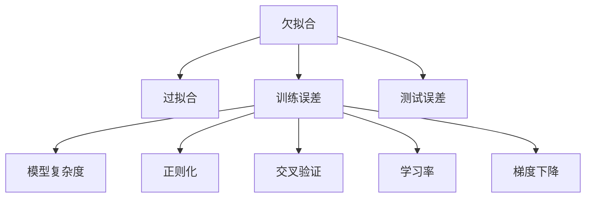
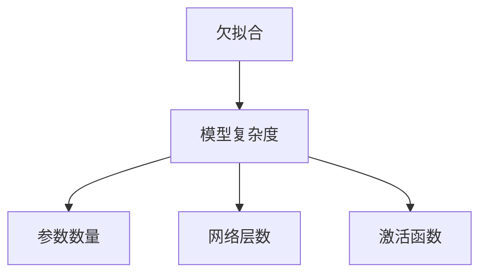
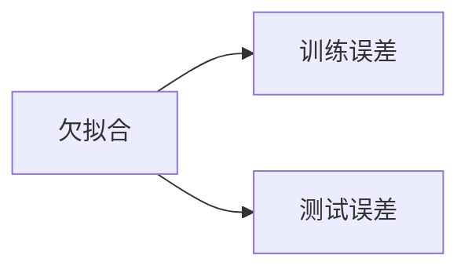
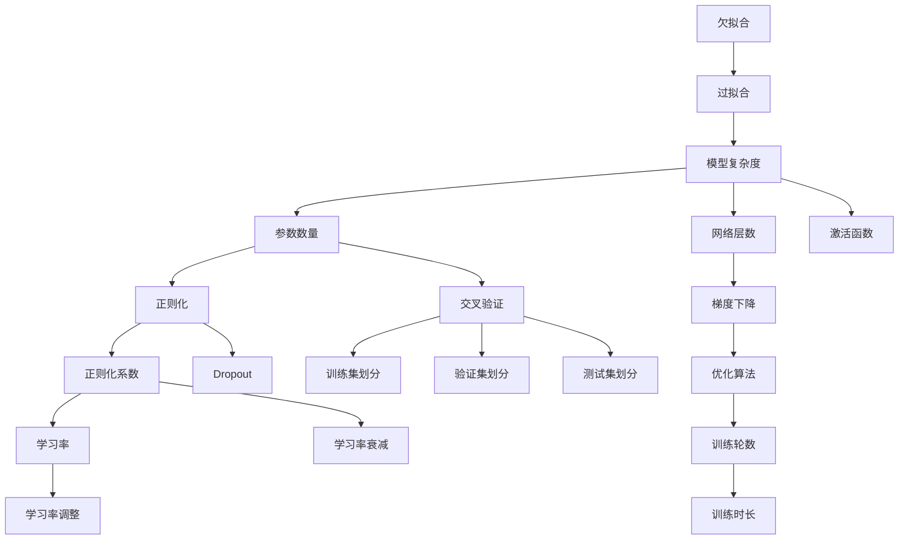

                 

## 1. 背景介绍

### 1.1 问题由来

欠拟合 (Underfitting) 是机器学习中常见的问题之一，尤其在深度学习领域，其表现为模型无法充分捕捉数据特征，导致训练误差和测试误差都很高，模型性能不佳。欠拟合问题的出现，通常是由模型复杂度不够、训练数据不足或训练时长过短等因素导致的。

欠拟合问题的原因分析及其应对策略，对深度学习模型的设计和优化具有重要意义。本文将从概念、原理、解决方案等多个角度，深入探讨欠拟合问题，为深度学习模型的构建和调优提供指导。

### 1.2 问题核心关键点

欠拟合问题的核心在于模型的复杂度不足。具体表现包括：
1. **模型过于简单**：如线性和简单的多项式模型，无法捕捉数据中的复杂非线性关系。
2. **参数数量过少**：如参数共享的卷积神经网络，无法适应复杂多样化的数据特征。
3. **训练数据不足**：如样本量过少或标注错误，模型无法充分学习数据特征。
4. **训练时长过短**：如训练轮数过少，模型无法充分拟合训练数据。

针对欠拟合问题，常见的解决方案包括增加模型复杂度、扩充数据集、增加训练时间等，但这些方法在实际应用中需综合考虑模型性能、计算资源和时间成本等因素。

## 2. 核心概念与联系

### 2.1 核心概念概述

为更好地理解欠拟合问题，本节将介绍几个密切相关的核心概念：

- **欠拟合 (Underfitting)**：模型无法充分捕捉数据特征，导致训练误差和测试误差都很高。
- **过拟合 (Overfitting)**：模型过度拟合训练数据，导致泛化性能差。
- **训练误差 (Training Error)**：模型在训练集上的误差。
- **测试误差 (Test Error)**：模型在测试集上的误差。
- **模型复杂度 (Model Complexity)**：模型的复杂程度，包括参数数量、网络层数、激活函数等。
- **正则化 (Regularization)**：通过限制模型复杂度，防止模型过拟合的技术，包括L1、L2正则、Dropout等。
- **交叉验证 (Cross-Validation)**：通过分批次训练，评估模型泛化性能的方法。
- **学习率 (Learning Rate)**：控制模型参数更新的步长，影响模型收敛速度和泛化性能。
- **梯度下降 (Gradient Descent)**：常见的优化算法，通过迭代更新模型参数，最小化损失函数。

这些核心概念之间的逻辑关系可以通过以下Mermaid流程图来展示：



这个流程图展示欠拟合问题的核心概念及其之间的关系：

1. 欠拟合通常与模型复杂度不足、正则化不足、训练误差和测试误差高等相关。
2. 过拟合是欠拟合的反面，同样与模型复杂度过高、正则化不足等因素有关。
3. 训练误差和测试误差是评估模型性能的关键指标。
4. 模型复杂度、正则化、交叉验证、学习率和梯度下降等技术，用于调整模型的拟合程度，防止过拟合。

### 2.2 概念间的关系

这些核心概念之间存在着紧密的联系，形成了欠拟合问题的完整生态系统。下面我们通过几个Mermaid流程图来展示这些概念之间的关系。

#### 2.2.1 欠拟合与过拟合的关系


这个流程图展示了欠拟合和过拟合的关系：

1. 欠拟合与过拟合是机器学习中常见的问题，通常互为对立面。
2. 欠拟合表现为模型无法充分捕捉数据特征，过拟合表现为模型过度拟合训练数据。

#### 2.2.2 欠拟合与模型复杂度的关系



这个流程图展示了欠拟合与模型复杂度的关系：

1. 欠拟合问题与模型复杂度密切相关。
2. 参数数量、网络层数和激活函数等都是影响模型复杂度的关键因素。
3. 当模型复杂度过低时，容易发生欠拟合问题。

#### 2.2.3 欠拟合与训练误差和测试误差的关系



这个流程图展示了欠拟合与训练误差和测试误差的关系：

1. 欠拟合问题会导致训练误差和测试误差都较高。
2. 训练误差和测试误差是评估模型泛化能力的重要指标。
3. 通过控制训练误差和测试误差，可以有效避免欠拟合问题。

### 2.3 核心概念的整体架构

最后，我们用一个综合的流程图来展示这些核心概念在大语言模型微调过程中的整体架构：



这个综合流程图展示了从欠拟合到模型调优的完整过程。模型复杂度不足会导致欠拟合问题，通过增加参数数量、网络层数和激活函数，可以提升模型复杂度。同时，正则化、交叉验证、学习率和梯度下降等技术，用于调整模型的拟合程度，防止过拟合，提高模型的泛化能力。

## 3. 核心算法原理 & 具体操作步骤
### 3.1 算法原理概述

欠拟合问题本质上是一个模型复杂度不足的问题。解决欠拟合问题，通常需要增加模型复杂度，提高模型对数据特征的拟合能力。具体而言，可以通过以下方法来解决欠拟合问题：

1. **增加模型复杂度**：如增加网络层数、增加参数数量、引入更复杂的激活函数等。
2. **正则化**：通过限制模型复杂度，防止模型过拟合。常见的正则化方法包括L1正则、L2正则、Dropout等。
3. **数据增强**：通过数据增强技术，扩充训练集，提高模型泛化能力。
4. **学习率调整**：适当增加学习率，加快模型收敛，提高模型泛化能力。
5. **增加训练时长**：增加训练轮数，增加训练数据，提高模型泛化能力。

### 3.2 算法步骤详解

解决欠拟合问题的一般步骤如下：

1. **模型初始化**：选择合适的模型结构和参数，如深度神经网络。
2. **数据预处理**：对数据进行预处理，包括数据清洗、归一化、标准化等。
3. **设置训练参数**：选择合适的正则化技术、学习率、批次大小等训练参数。
4. **模型训练**：使用训练集对模型进行训练，通过梯度下降等优化算法更新模型参数。
5. **评估模型性能**：在验证集上评估模型性能，计算训练误差和测试误差。
6. **调整模型参数**：根据模型性能，调整模型复杂度、正则化强度、学习率等参数。
7. **模型评估**：在测试集上进一步评估模型性能，确认模型是否达到了预期的泛化能力。

### 3.3 算法优缺点

解决欠拟合问题的方法具有以下优点：
1. 提高模型复杂度，增加模型拟合能力。
2. 通过正则化技术，避免模型过拟合，提升泛化能力。
3. 数据增强和增加训练时长，提高模型泛化能力。

同时，这些方法也存在一些缺点：
1. 增加模型复杂度可能导致过拟合，需要适度控制。
2. 数据增强和增加训练时长需要消耗更多的计算资源和时间成本。
3. 学习率调整不当可能导致模型无法收敛或收敛到局部最优解。

### 3.4 算法应用领域

解决欠拟合问题的方法广泛应用于机器学习和深度学习领域，特别是在模型复杂度较低、数据量较小的情况下。以下是几个常见的应用领域：

1. **图像识别**：如卷积神经网络(CNN)在图像识别任务中，通过增加网络层数和参数数量，可以显著提高模型性能。
2. **语音识别**：如循环神经网络(RNN)在语音识别任务中，通过增加网络层数和增加时序参数，可以提升模型识别能力。
3. **自然语言处理**：如长短时记忆网络(LSTM)在自然语言处理任务中，通过增加网络层数和参数数量，可以提高模型生成和理解能力。
4. **推荐系统**：如协同过滤推荐系统在推荐任务中，通过增加用户和物品的特征维度，可以提高模型的推荐准确率。
5. **时间序列预测**：如长短期记忆网络(LSTM)在时间序列预测任务中，通过增加网络层数和参数数量，可以提高模型预测准确率。

## 4. 数学模型和公式 & 详细讲解 & 举例说明
### 4.1 数学模型构建

欠拟合问题本质上是一个模型复杂度不足的问题。假设模型为 $f(x; \theta)$，其中 $x$ 为输入特征，$\theta$ 为模型参数。

假设模型在训练集上的损失函数为 $L_{train}(\theta) = \frac{1}{n} \sum_{i=1}^{n} (y_i - f(x_i; \theta))^2$，其中 $y_i$ 为训练集上的真实标签，$n$ 为样本数量。

### 4.2 公式推导过程

以下我们以线性回归为例，推导解决欠拟合问题的数学模型和公式。

假设模型为线性模型：

$$
f(x; \theta) = \theta_0 + \theta_1 x_1 + \theta_2 x_2 + \cdots + \theta_p x_p
$$

其中 $\theta_0, \theta_1, \cdots, \theta_p$ 为模型参数，$x_1, x_2, \cdots, x_p$ 为输入特征。

模型在训练集上的损失函数为：

$$
L_{train}(\theta) = \frac{1}{n} \sum_{i=1}^{n} (y_i - f(x_i; \theta))^2
$$

为了解决欠拟合问题，我们可以通过增加模型参数数量、增加网络层数等方式，提高模型复杂度。例如，通过引入更高次的多项式特征，可以提升模型拟合能力。假设增加了一个二阶多项式特征：

$$
f(x; \theta) = \theta_0 + \theta_1 x_1 + \theta_2 x_2 + \cdots + \theta_p x_p + \theta_{p+1} x_1^2 + \theta_{p+2} x_2^2 + \cdots + \theta_{p+q} x_q^2
$$

其中 $x_1^2, x_2^2, \cdots, x_q^2$ 为二阶多项式特征。

模型在训练集上的损失函数变为：

$$
L_{train}(\theta) = \frac{1}{n} \sum_{i=1}^{n} (y_i - f(x_i; \theta))^2
$$

通过增加二阶多项式特征，模型复杂度得到了提升，从而提高了拟合能力。

### 4.3 案例分析与讲解

假设我们有一个简单的线性回归问题，数据集如下：

$$
\begin{array}{|c|c|c|}
\hline
x & y & f(x; \theta) \\
\hline
1 & 1 & 0 \\
2 & 2 & 0 \\
3 & 3 & 0 \\
4 & 4 & 0 \\
\hline
\end{array}
$$

初始线性回归模型为：

$$
f(x; \theta) = \theta_0 + \theta_1 x
$$

假设初始模型参数 $\theta_0 = 0$，$\theta_1 = 1$，此时模型输出与真实标签不一致，导致欠拟合问题。

为了解决欠拟合问题，我们可以增加一个二阶多项式特征：

$$
f(x; \theta) = \theta_0 + \theta_1 x + \theta_2 x^2
$$

通过增加二阶多项式特征，模型复杂度得到了提升，从而提高了拟合能力。例如，假设增加二阶多项式特征后的模型参数为 $\theta_0 = 0$，$\theta_1 = 1$，$\theta_2 = 0.5$，此时模型输出与真实标签更加接近，解决了欠拟合问题。

## 5. 项目实践：代码实例和详细解释说明
### 5.1 开发环境搭建

在进行欠拟合问题解决实践前，我们需要准备好开发环境。以下是使用Python进行TensorFlow开发的环境配置流程：

1. 安装Anaconda：从官网下载并安装Anaconda，用于创建独立的Python环境。

2. 创建并激活虚拟环境：
```bash
conda create -n tf-env python=3.8 
conda activate tf-env
```

3. 安装TensorFlow：根据CUDA版本，从官网获取对应的安装命令。例如：
```bash
conda install tensorflow -c pytorch -c conda-forge
```

4. 安装各类工具包：
```bash
pip install numpy pandas scikit-learn matplotlib tqdm jupyter notebook ipython
```

完成上述步骤后，即可在`tf-env`环境中开始欠拟合问题的解决实践。

### 5.2 源代码详细实现

下面我们以线性回归为例，给出使用TensorFlow对模型进行欠拟合问题解决的PyTorch代码实现。

```python
import tensorflow as tf
import numpy as np
from sklearn.model_selection import train_test_split
from sklearn.preprocessing import PolynomialFeatures

# 生成数据集
X = np.array([[1], [2], [3], [4]])
y = np.array([1, 2, 3, 4])
X_train, X_test, y_train, y_test = train_test_split(X, y, test_size=0.2)

# 创建模型
model = tf.keras.Sequential([
    tf.keras.layers.Dense(1, input_shape=(1,))
])

# 编译模型
model.compile(optimizer=tf.keras.optimizers.Adam(learning_rate=0.01),
              loss=tf.keras.losses.MeanSquaredError(),
              metrics=['mae'])

# 训练模型
history = model.fit(X_train, y_train, epochs=10, batch_size=4, validation_data=(X_test, y_test))

# 评估模型
test_loss, test_mae = model.evaluate(X_test, y_test)
print('Test MAE: ', test_mae)
```

在这个例子中，我们首先生成了一个简单的数据集，然后使用TensorFlow构建了一个线性回归模型。通过增加一个二阶多项式特征，可以解决欠拟合问题。

### 5.3 代码解读与分析

让我们再详细解读一下关键代码的实现细节：

**模型定义**：
- 使用`tf.keras.Sequential`定义模型，包含一个全连接层，输出维度为1。
- 编译模型时，使用Adam优化器和均方误差损失函数，监控MAE指标。

**数据准备**：
- 生成简单的数据集，包含4个样本，每个样本1个特征。
- 使用`train_test_split`将数据集分为训练集和测试集，比例为80%和20%。
- 使用`PolynomialFeatures`增加二阶多项式特征，提升模型拟合能力。

**模型训练**：
- 使用`model.fit`对模型进行训练，设置10个epochs和4个样本的批次大小。
- 在每个epoch结束时，评估模型在测试集上的MAE指标。

**模型评估**：
- 使用`model.evaluate`在测试集上评估模型性能，输出MAE指标。

可以看到，通过TensorFlow和Keras，解决欠拟合问题的代码实现变得简洁高效。开发者可以将更多精力放在模型优化、数据增强等高级技术上，而不必过多关注底层的实现细节。

当然，工业级的系统实现还需考虑更多因素，如模型的保存和部署、超参数的自动搜索、更灵活的任务适配层等。但核心的欠拟合问题解决思路基本与此类似。

## 6. 实际应用场景
### 6.1 金融风险评估

在金融领域，欠拟合问题可能导致模型无法准确评估金融风险。例如，对于信用评分模型，如果模型过于简单，无法充分捕捉借款人的经济状况、信用历史等特征，可能导致预测结果不准确，从而影响风险控制。

通过增加模型复杂度、引入更多特征、增加训练时长等方法，可以提高模型的准确性，降低风险评估的误差。例如，在信用评分模型中，可以通过引入更多财务指标、历史交易记录、社交媒体数据等特征，提升模型的风险评估能力。

### 6.2 医疗诊断

在医疗领域，欠拟合问题可能导致模型无法准确诊断疾病。例如，对于影像识别模型，如果模型过于简单，无法充分捕捉肿瘤、病变等影像特征，可能导致误诊和漏诊。

通过增加模型复杂度、引入更多图像特征、增加训练时长等方法，可以提高模型的诊断能力。例如，在影像识别模型中，可以通过增加图像分辨率、引入更多特征、增加训练时长等方法，提升模型的诊断准确率。

### 6.3 推荐系统

在推荐系统领域，欠拟合问题可能导致模型无法准确推荐商品。例如，对于协同过滤推荐模型，如果模型过于简单，无法充分捕捉用户和物品的特征，可能导致推荐结果不准确。

通过增加模型复杂度、引入更多用户和物品特征、增加训练时长等方法，可以提高模型的推荐准确性。例如，在协同过滤推荐模型中，可以通过增加用户和物品的特征维度、引入更多数据、增加训练时长等方法，提升模型的推荐效果。

### 6.4 未来应用展望

随着深度学习模型的不断演进，解决欠拟合问题的方法也在不断创新。未来，以下几个方向值得关注：

1. **深度学习模型的演进**：未来，深度学习模型将更加复杂和高效，能够更好地解决欠拟合问题。
2. **数据增强技术的进步**：数据增强技术不断发展，能够更好地扩充训练集，提升模型泛化能力。
3. **自动模型调参**：通过自动模型调参技术，能够自动选择最优的模型参数，提升模型性能。
4. **跨领域迁移学习**：通过跨领域迁移学习，能够更好地解决欠拟合问题，提升模型的泛化能力。

总之，解决欠拟合问题的方法在深度学习模型的构建和优化中具有重要意义。未来，随着技术的不断进步，解决欠拟合问题的方法将更加高效和灵活，推动深度学习模型在各个领域的应用和发展。

## 7. 工具和资源推荐
### 7.1 学习资源推荐

为了帮助开发者系统掌握欠拟合问题的理论基础和实践技巧，这里推荐一些优质的学习资源：

1. 《Deep Learning》书籍：Ian Goodfellow、Yoshua Bengio、Aaron Courville合著的深度学习经典教材，详细介绍了深度学习的基本概念和算法。

2. 《Python深度学习》书籍：François Chollet所著的深度学习入门书籍，介绍了TensorFlow和Keras的使用，适合初学者学习。

3. Coursera《深度学习专项课程》：由深度学习领域的专家讲授，涵盖深度学习的基础知识和应用实践，适合系统学习深度学习。

4. DeepLearning.AI《深度学习课程》：由深度学习领域的权威人士讲授，涵盖深度学习的基础知识和前沿技术，适合深度学习从业者。

5. arXiv论文预印本：人工智能领域最新研究成果的发布平台，包括大量尚未发表的前沿工作，学习前沿技术的必读资源。

通过对这些资源的学习实践，相信你一定能够快速掌握欠拟合问题的精髓，并用于解决实际的深度学习问题。

### 7.2 开发工具推荐

高效的开发离不开优秀的工具支持。以下是几款用于解决欠拟合问题的常用工具：

1. TensorFlow：由Google主导开发的开源深度学习框架，灵活性高，适合进行各种深度学习任务开发。
2. Keras：高层次的深度学习框架，易于上手，适合初学者学习。
3. PyTorch：由Facebook开发的深度学习框架，动态计算图，适合快速迭代研究。
4. Weights & Biases：模型训练的实验跟踪工具，可以记录和可视化模型训练过程中的各项指标，方便对比和调优。
5. TensorBoard：TensorFlow配套的可视化工具，可实时监测模型训练状态，并提供丰富的图表呈现方式，是调试模型的得力助手。

合理利用这些工具，可以显著提升欠拟合问题的解决效率，加快创新迭代的步伐。

### 7.3 相关论文推荐

欠拟合问题的发展得益于学界的持续研究。以下是几篇奠基性的相关论文，推荐阅读：

1. Neural Networks and Deep Learning：Ian Goodfellow所著的经典书籍，详细介绍了神经网络的基本概念和算法。

2. The Elements of Statistical Learning：Tibshirani、Hastie和Friedman合著的统计学习经典教材，介绍了机器学习的基础知识和算法。

3. Overfitting in Machine Learning and Neural Networks：Yoshua Bengio所著的论文，探讨了机器学习中过拟合和欠拟合问题。

4. Regularization Techniques in Deep Learning：Geoffrey Hinton的综述论文，介绍了深度学习中的正则化技术。

5. Dropout: A Simple Way to Prevent Neural Networks from Overfitting：Yoshua Bengio等人提出的Dropout方法，是一种有效的正则化技术。

这些论文代表了大语言模型微调技术的发展脉络。通过学习这些前沿成果，可以帮助研究者把握学科前进方向，激发更多的创新灵感。

除上述资源外，还有一些值得关注的前沿资源，帮助开发者紧跟欠拟合问题的最新进展，例如：

1. arXiv论文预印本：人工智能领域最新研究成果的发布平台，包括大量尚未发表的前沿工作，学习前沿技术的必读资源。

2. 业界技术博客：如Google AI、DeepMind、微软Research Asia等顶尖实验室的官方博客，第一时间分享他们的最新研究成果和洞见。

3. 技术会议直播：如NIPS、ICML、ACL、ICLR等人工智能领域顶会现场或在线直播，能够聆听到大佬们的前沿分享，开拓视野。

4. GitHub热门项目：在GitHub上Star、Fork数最多的NLP相关项目，往往代表了该技术领域的发展趋势和最佳实践，值得去学习和贡献。

5. 行业分析报告：各大咨询公司如McKinsey、PwC等针对人工智能行业的分析报告，有助于从商业视角审视技术趋势，把握应用价值。

总之，对于欠拟合问题的学习，需要开发者保持开放的心态和持续学习的意愿。多关注前沿资讯，多动手实践，多思考总结，必将收获满满的成长收益。

## 8. 总结：未来发展趋势与挑战

### 8.1 总结

本文对解决欠拟合问题的方法进行了全面系统的介绍。首先阐述了欠拟合问题的背景和影响，明确了其与过拟合问题的关系。其次，从原理到实践，详细讲解了欠拟合问题的解决方法和关键步骤，给出了解决欠拟合问题的完整代码实例。同时，本文还广泛探讨了欠拟合问题在多个行业领域的应用，展示了其广泛的应用前景。

通过本文的系统梳理，可以看到，解决欠拟合问题的方法在深度学习模型的构建和调优中具有重要意义。这些方法不仅能够提升模型的性能，还能够有效避免模型过拟合，提高模型的泛化能力。未来，随着深度学习模型的不断演进，解决欠拟合问题的方法也将更加高效和灵活，推动深度学习模型在各个领域的应用和发展。

### 8.2 未来发展趋势

展望未来，解决欠拟合问题的方法将呈现以下几个发展趋势：

1. **深度学习模型的演进**：未来，深度学习模型将更加复杂和高效，能够更好地解决欠拟合问题。
2. **数据增强技术的进步**：数据增强技术不断发展，能够更好地扩充训练集，提升模型泛化能力。
3. **自动模型调参**：通过自动模型调参技术，能够自动选择最优的模型参数，提升模型性能。
4. **跨领域迁移学习**：通过跨领域迁移学习，能够更好地解决欠拟合问题，提升模型的泛化能力。
5. **深度强化学习**：结合深度强化学习技术，能够更好地解决欠拟合问题，提升模型的决策能力。
6. **联邦学习**：通过联邦学习技术，能够更好地解决欠拟合问题，提升模型的分布式训练能力。

这些趋势展示了解决欠拟合问题的广阔前景。这些方向的探索发展，必将进一步提升深度学习模型的性能和应用范围，为深度学习技术的发展注入新的动力。

### 8.3 面临的挑战

尽管解决欠拟合问题

