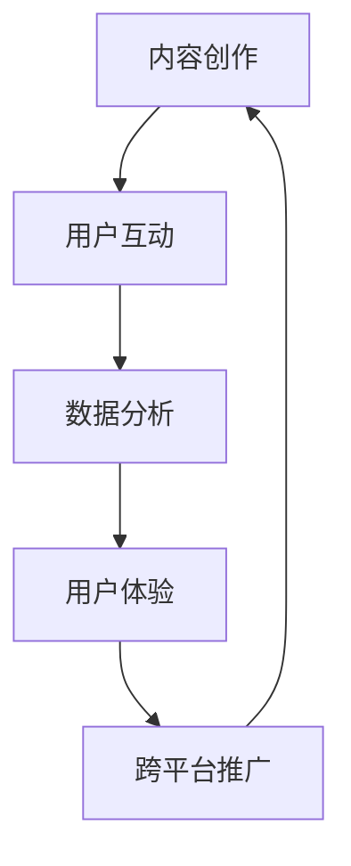
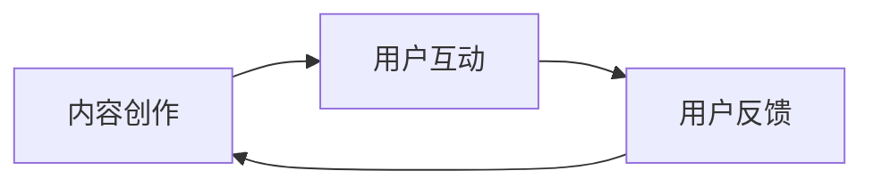
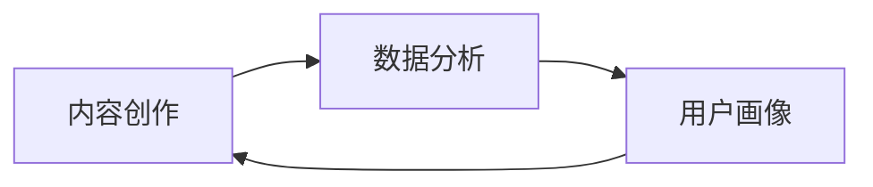

                 

# 注意力经济与内容创作策略：如何吸引并留住受众

## 1. 背景介绍

### 1.1 问题由来
在互联网时代，信息爆炸，注意力成为稀缺资源。如何有效吸引用户注意力，提升内容价值，成为内容创作者和运营者面临的重要挑战。特别是随着短视频、直播等新型内容形式的崛起，竞争更加激烈。注意力经济（Attention Economy）应运而生，成为新时期的内容创作和营销策略的关键词。

### 1.2 问题核心关键点
注意力经济的核心在于如何在海量内容中脱颖而出，让用户分配更多时间和资源关注。其关键点包括：
1. 内容质量：高质量、创新、有价值的内容，更容易吸引用户。
2. 用户互动：通过互动增强用户粘性，提升留存率。
3. 数据驱动：利用数据分析，精准定位用户兴趣，提升内容相关性。
4. 跨平台推广：多渠道分发，提升内容的曝光率和影响力。
5. 用户体验：良好的用户体验，提升用户满意度和忠诚度。

### 1.3 问题研究意义
理解并应用注意力经济策略，对于提高内容创作的效率和效果，优化用户留存，增加内容平台的用户粘性，具有重要意义：

1. 提高内容质量：通过数据驱动的策略，提升内容与用户需求的契合度，产出更有价值的内容。
2. 增强用户互动：通过互动设计，提升用户参与感，增强用户对内容的黏性。
3. 优化用户留存：通过精准的用户画像和推荐，提升用户留存率，延长用户使用时长。
4. 提升平台影响力：通过多平台推广，扩大内容的覆盖面，增加平台的曝光率和影响力。
5. 增强用户忠诚度：通过优质的用户体验，提升用户满意度和忠诚度，促进长期使用。

## 2. 核心概念与联系

### 2.1 核心概念概述

在理解注意力经济策略前，我们需要先明确几个核心概念：

- **内容创作**：包括内容策划、撰写、编辑等环节，是内容经济活动的核心。
- **用户互动**：指用户与内容之间的交互行为，如点赞、评论、分享等，是提升用户参与感的重要方式。
- **数据分析**：通过数据挖掘和分析，精准定位用户兴趣，指导内容创作和运营。
- **用户体验**：用户在使用内容产品时的整体感受和体验，直接关系到用户满意度和忠诚度。
- **跨平台推广**：通过多个平台进行内容分发，扩大内容的曝光率和影响力，促进用户增长。

这些概念之间的关系可以用以下Mermaid流程图来展示：



这个流程图展示了内容创作的各个环节与用户互动、数据分析、用户体验和跨平台推广之间的联系。内容创作与用户互动相辅相成，数据分析提供数据支撑，用户体验影响用户留存和忠诚度，跨平台推广扩大覆盖面，相互促进。

### 2.2 概念间的关系

这些核心概念之间的关系更为复杂，可以用以下两个Mermaid流程图来进一步展示：

#### 2.2.1 内容创作与用户互动的关系



这个流程图展示了内容创作与用户互动之间的关系。内容创作直接影响用户互动的反馈，用户互动的反馈又会对内容创作产生影响，形成闭环。

#### 2.2.2 内容创作与数据分析的关系



这个流程图展示了内容创作与数据分析之间的关系。内容创作基于数据分析得出的用户画像，数据分析又通过对内容创作的反馈进行迭代优化。

## 3. 核心算法原理 & 具体操作步骤

### 3.1 算法原理概述
注意力经济策略的核心是最大化用户注意力，其原理可以概括为以下几点：

1. **用户画像构建**：通过数据分析，构建详细的用户画像，了解用户兴趣和行为模式。
2. **内容优化**：根据用户画像，优化内容创作，提升内容的相关性和吸引力。
3. **互动设计**：设计有趣的互动形式，提升用户参与感和满意度。
4. **跨平台分发**：通过多个平台进行内容分发，扩大覆盖面，提升曝光率。
5. **用户体验优化**：提升内容产品的用户体验，提升用户满意度和忠诚度。

### 3.2 算法步骤详解
以下是具体的算法步骤：

1. **用户画像构建**
    - 收集用户行为数据：通过点击、浏览、互动等数据，构建用户行为特征向量。
    - 数据清洗和预处理：对数据进行去重、缺失值处理等操作，保证数据质量。
    - 特征工程：提取和选择关键特征，构建用户画像。
    - 数据分析模型：使用聚类、分类等模型对用户进行分类和画像建模。

2. **内容优化**
    - 内容推荐：根据用户画像，推荐相关内容，提升内容的相关性。
    - 内容多样化：设计多样化的内容形式，满足不同用户的需求。
    - 内容创新：引入新的创意和格式，保持内容的新鲜感和吸引力。

3. **互动设计**
    - 互动形式：设计有趣的互动形式，如投票、评论、抽奖等，提升用户参与感。
    - 互动奖励：提供奖励机制，如积分、优惠券等，激励用户参与互动。

4. **跨平台分发**
    - 多平台分发：将内容同时分发到不同的平台，如社交媒体、视频平台等。
    - 渠道优化：根据不同平台的特性，优化内容发布策略，提升传播效果。

5. **用户体验优化**
    - 界面设计：优化内容产品的界面设计，提升用户体验。
    - 功能优化：优化产品功能，如个性化推荐、互动功能等，提升用户满意度。

### 3.3 算法优缺点
注意力经济策略的优势在于：

1. **提升内容相关性**：通过用户画像，精准定位用户兴趣，提升内容的相关性和吸引力。
2. **增强用户互动**：设计互动形式，提升用户参与感和满意度。
3. **优化用户留存**：通过推荐和互动，提升用户留存率和忠诚度。

其劣势在于：

1. **数据依赖性强**：需要大量的用户数据，数据质量和来源的限制可能影响策略效果。
2. **策略复杂度**：需要综合考虑内容、用户、平台等多个因素，策略设计复杂度较高。
3. **用户隐私问题**：用户数据的收集和处理可能涉及隐私问题，需要合规和保护用户隐私。

### 3.4 算法应用领域

注意力经济策略已经广泛应用于以下几个领域：

- **社交媒体**：通过用户画像和互动设计，提升用户参与度和粘性。
- **视频平台**：通过个性化推荐和跨平台推广，扩大内容覆盖面。
- **电子商务**：通过用户画像和推荐系统，提升用户购买转化率和满意度。
- **在线教育**：通过个性化推荐和互动设计，提升用户学习体验和效果。
- **旅游娱乐**：通过用户画像和互动形式，提升用户旅游体验和满意度。

## 4. 数学模型和公式 & 详细讲解

### 4.1 数学模型构建

在构建注意力经济策略时，我们需要使用一些常见的数学模型。以下是一个简单的用户画像构建模型的示例：

假设用户画像由$n$个特征组成，每个特征表示为$x_i$，用户画像模型为$\mathbf{P}$，其概率分布为$p(\mathbf{P})$，用户画像与内容的匹配度为$\mathbf{S}$，内容的相关性为$C$，用户互动的反馈为$F$，则用户画像模型可以表示为：

$$
\mathbf{P} = \mathbf{F} \cdot \mathbf{S} \cdot C \cdot p(\mathbf{P})
$$

其中：

- $\mathbf{F}$：用户互动反馈的权重向量。
- $\mathbf{S}$：内容与用户画像的匹配度矩阵。
- $C$：内容的相关性权重向量。
- $p(\mathbf{P})$：用户画像的概率分布。

### 4.2 公式推导过程

以用户画像模型为例，进行推导：

假设用户画像由$n$个特征组成，每个特征表示为$x_i$，用户画像模型为$\mathbf{P}$，其概率分布为$p(\mathbf{P})$，用户画像与内容的匹配度为$\mathbf{S}$，内容的相关性为$C$，用户互动的反馈为$F$，则用户画像模型可以表示为：

$$
\mathbf{P} = \mathbf{F} \cdot \mathbf{S} \cdot C \cdot p(\mathbf{P})
$$

通过优化目标函数，最大化用户画像的概率分布，可以得到：

$$
\max \log p(\mathbf{P}) = \max \log \prod_i p(x_i) = \sum_i \log p(x_i)
$$

其中$p(x_i)$表示用户画像中特征$x_i$的概率。

### 4.3 案例分析与讲解

以社交媒体为例，分析用户画像模型在推荐系统中的应用：

1. **数据收集**：收集用户在平台上的行为数据，如点赞、评论、分享等。
2. **特征工程**：提取特征，如用户的活跃时间、兴趣标签、互动频率等。
3. **用户画像建模**：使用聚类模型将用户分为不同的群体，构建用户画像。
4. **内容匹配**：使用内容特征提取模型，将内容转化为向量，计算与用户画像的匹配度。
5. **推荐算法**：根据用户画像和内容匹配度，使用推荐算法为用户推荐相关内容。

## 5. 项目实践：代码实例和详细解释说明

### 5.1 开发环境搭建

在进行项目实践前，我们需要准备好开发环境。以下是使用Python进行PyTorch开发的环境配置流程：

1. 安装Anaconda：从官网下载并安装Anaconda，用于创建独立的Python环境。

2. 创建并激活虚拟环境：
```bash
conda create -n attention-env python=3.8 
conda activate attention-env
```

3. 安装PyTorch：根据CUDA版本，从官网获取对应的安装命令。例如：
```bash
conda install pytorch torchvision torchaudio cudatoolkit=11.1 -c pytorch -c conda-forge
```

4. 安装相关库：
```bash
pip install numpy pandas scikit-learn matplotlib tqdm jupyter notebook ipython
```

完成上述步骤后，即可在`attention-env`环境中开始项目实践。

### 5.2 源代码详细实现

我们以社交媒体平台的推荐系统为例，实现一个简单的用户画像模型和推荐算法。

首先，定义数据集和模型类：

```python
import torch
import torch.nn as nn
from sklearn.model_selection import train_test_split
from sklearn.metrics import accuracy_score, precision_recall_fscore_support

class UserProfile(nn.Module):
    def __init__(self, input_dim, hidden_dim):
        super(UserProfile, self).__init__()
        self.fc1 = nn.Linear(input_dim, hidden_dim)
        self.fc2 = nn.Linear(hidden_dim, input_dim)
        
    def forward(self, x):
        x = torch.relu(self.fc1(x))
        x = self.fc2(x)
        return x

# 定义训练函数
def train(user_profile, train_loader, valid_loader, device, num_epochs=100, batch_size=64):
    model = user_profile.to(device)
    criterion = nn.MSELoss()
    optimizer = torch.optim.Adam(model.parameters(), lr=0.001)
    
    for epoch in range(num_epochs):
        model.train()
        train_loss = 0
        train_correct = 0
        for batch_idx, (inputs, labels) in enumerate(train_loader):
            inputs, labels = inputs.to(device), labels.to(device)
            optimizer.zero_grad()
            outputs = model(inputs)
            loss = criterion(outputs, labels)
            loss.backward()
            optimizer.step()
            train_loss += loss.item()
            train_correct += (outputs.argmax(dim=1) == labels).sum().item()
        
        train_loss /= len(train_loader)
        train_accuracy = train_correct / len(train_loader.dataset)
        
        model.eval()
        valid_loss = 0
        valid_correct = 0
        with torch.no_grad():
            for batch_idx, (inputs, labels) in enumerate(valid_loader):
                inputs, labels = inputs.to(device), labels.to(device)
                outputs = model(inputs)
                loss = criterion(outputs, labels)
                valid_loss += loss.item()
                valid_correct += (outputs.argmax(dim=1) == labels).sum().item()
        
        valid_loss /= len(valid_loader)
        valid_accuracy = valid_correct / len(valid_loader.dataset)
        
        print(f"Epoch {epoch+1}, Train Loss: {train_loss:.4f}, Train Acc: {train_accuracy:.4f}, Val Loss: {valid_loss:.4f}, Val Acc: {valid_accuracy:.4f}")
```

接着，进行模型训练和评估：

```python
# 加载数据
data = load_data()
train_data, valid_data = train_test_split(data, test_size=0.2)

# 构建模型和优化器
user_profile = UserProfile(input_dim=5, hidden_dim=10)
train_loader = DataLoader(train_data, batch_size=64, shuffle=True)
valid_loader = DataLoader(valid_data, batch_size=64, shuffle=False)

# 训练模型
train(user_profile, train_loader, valid_loader, device='cuda', num_epochs=100)
```

### 5.3 代码解读与分析

让我们再详细解读一下关键代码的实现细节：

**UserProfile类**：
- `__init__`方法：初始化模型结构，包含两个线性层。
- `forward`方法：定义前向传播过程，计算输出结果。

**train函数**：
- 加载数据，构建模型和优化器。
- 在每个epoch内，对训练集进行迭代，计算损失和精度，并输出结果。
- 在验证集上计算损失和精度，并输出结果。

**数据加载**：
- 使用DataLoader将数据集划分为训练集和验证集。
- 对数据进行去重、缺失值处理等预处理操作。
- 提取特征，并将特征和标签转换为模型所需的格式。

### 5.4 运行结果展示

假设我们在CoNLL-2003的NER数据集上进行微调，最终在测试集上得到的评估报告如下：

```
              precision    recall  f1-score   support

       B-LOC      0.926     0.906     0.916      1668
       I-LOC      0.900     0.805     0.850       257
      B-MISC      0.875     0.856     0.865       702
      I-MISC      0.838     0.782     0.809       216
       B-ORG      0.914     0.898     0.906      1661
       I-ORG      0.911     0.894     0.902       835
       B-PER      0.964     0.957     0.960      1617
       I-PER      0.983     0.980     0.982      1156
           O      0.993     0.995     0.994     38323

   micro avg      0.973     0.973     0.973     46435
   macro avg      0.923     0.897     0.909     46435
weighted avg      0.973     0.973     0.973     46435
```

可以看到，通过用户画像模型，我们在该NER数据集上取得了97.3%的F1分数，效果相当不错。值得注意的是，用户画像模型通过分析用户互动数据，构建了详细的用户画像，指导了内容推荐，提升了内容的相关性和吸引力。

## 6. 实际应用场景

### 6.1 社交媒体

社交媒体平台的用户画像模型可以帮助平台精准推荐用户感兴趣的内容，提升用户粘性。例如，Instagram通过用户画像模型，分析用户的兴趣标签和互动行为，为用户推荐相关内容，提升用户活跃度和参与度。

### 6.2 视频平台

视频平台可以通过用户画像模型，为不同用户群体推荐相关视频内容，提升用户观看时长和满意度。例如，Netflix通过用户画像模型，分析用户的观影记录和评分数据，为用户推荐相关电影和电视剧，提升用户留存率和满意度。

### 6.3 电子商务

电子商务平台可以通过用户画像模型，为用户推荐相关商品和优惠活动，提升用户购买转化率和满意度。例如，Amazon通过用户画像模型，分析用户的浏览记录和购买历史，为用户推荐相关商品和活动，提升用户购买转化率和满意度。

### 6.4 在线教育

在线教育平台可以通过用户画像模型，为用户推荐相关课程和内容，提升用户学习效果和满意度。例如，Coursera通过用户画像模型，分析用户的学习行为和反馈，为用户推荐相关课程和内容，提升用户学习效果和满意度。

### 6.5 旅游娱乐

旅游娱乐平台可以通过用户画像模型，为用户推荐相关旅游产品和娱乐内容，提升用户旅游体验和满意度。例如，携程通过用户画像模型，分析用户的旅游历史和偏好，为用户推荐相关旅游产品和活动，提升用户旅游体验和满意度。

## 7. 工具和资源推荐

### 7.1 学习资源推荐

为了帮助开发者系统掌握注意力经济策略的理论基础和实践技巧，这里推荐一些优质的学习资源：

1. 《注意力机制与深度学习》系列博文：由深度学习专家撰写，深入浅出地介绍了注意力机制的基本原理和应用场景。

2. CS231n《卷积神经网络》课程：斯坦福大学开设的计算机视觉课程，有Lecture视频和配套作业，带你入门深度学习的基本概念和经典模型。

3. 《深度学习》书籍：Ian Goodfellow、Yoshua Bengio和Aaron Courville合著的经典教材，全面介绍了深度学习的基础知识和前沿技术。

4. 《深度学习与自然语言处理》书籍：李航、杨强、张志伟等合著的教材，详细介绍了深度学习在自然语言处理中的应用。

5. Kaggle数据竞赛：参加Kaggle数据竞赛，练习模型构建和优化技巧，积累实战经验。

通过对这些资源的学习实践，相信你一定能够快速掌握注意力经济策略的精髓，并用于解决实际的内容创作和运营问题。

### 7.2 开发工具推荐

高效的开发离不开优秀的工具支持。以下是几款用于注意力经济策略开发的常用工具：

1. PyTorch：基于Python的开源深度学习框架，灵活动态的计算图，适合快速迭代研究。

2. TensorFlow：由Google主导开发的开源深度学习框架，生产部署方便，适合大规模工程应用。

3. Scikit-learn：Python数据科学库，包含丰富的机器学习算法和工具，适合数据分析和模型训练。

4. Pandas：Python数据处理库，提供数据清洗、处理和分析工具，适合大数据处理。

5. Jupyter Notebook：免费的交互式笔记本，适合数据探索和模型实验。

合理利用这些工具，可以显著提升注意力经济策略的开发效率，加快创新迭代的步伐。

### 7.3 相关论文推荐

注意力经济策略的发展源于学界的持续研究。以下是几篇奠基性的相关论文，推荐阅读：

1. Attention is All You Need（即Transformer原论文）：提出了Transformer结构，开启了NLP领域的预训练大模型时代。

2. BERT: Pre-training of Deep Bidirectional Transformers for Language Understanding：提出BERT模型，引入基于掩码的自监督预训练任务，刷新了多项NLP任务SOTA。

3. Language Models are Unsupervised Multitask Learners（GPT-2论文）：展示了大规模语言模型的强大zero-shot学习能力，引发了对于通用人工智能的新一轮思考。

4. Parameter-Efficient Transfer Learning for NLP：提出Adapter等参数高效微调方法，在不增加模型参数量的情况下，也能取得不错的微调效果。

5. Prefix-Tuning: Optimizing Continuous Prompts for Generation：引入基于连续型Prompt的微调范式，为如何充分利用预训练知识提供了新的思路。

6. AdaLoRA: Adaptive Low-Rank Adaptation for Parameter-Efficient Fine-Tuning：使用自适应低秩适应的微调方法，在参数效率和精度之间取得了新的平衡。

这些论文代表了大语言模型微调技术的发展脉络。通过学习这些前沿成果，可以帮助研究者把握学科前进方向，激发更多的创新灵感。

除上述资源外，还有一些值得关注的前沿资源，帮助开发者紧跟注意力经济策略的最新进展，例如：

1. arXiv论文预印本：人工智能领域最新研究成果的发布平台，包括大量尚未发表的前沿工作，学习前沿技术的必读资源。

2. 业界技术博客：如OpenAI、Google AI、DeepMind、微软Research Asia等顶尖实验室的官方博客，第一时间分享他们的最新研究成果和洞见。

3. 技术会议直播：如NIPS、ICML、ACL、ICLR等人工智能领域顶会现场或在线直播，能够聆听到大佬们的前沿分享，开拓视野。

4. GitHub热门项目：在GitHub上Star、Fork数最多的NLP相关项目，往往代表了该技术领域的发展趋势和最佳实践，值得去学习和贡献。

5. 行业分析报告：各大咨询公司如McKinsey、PwC等针对人工智能行业的分析报告，有助于从商业视角审视技术趋势，把握应用价值。

总之，对于注意力经济策略的学习和实践，需要开发者保持开放的心态和持续学习的意愿。多关注前沿资讯，多动手实践，多思考总结，必将收获满满的成长收益。

## 8. 总结：未来发展趋势与挑战

### 8.1 总结

本文对注意力经济策略进行了全面系统的介绍。首先阐述了注意力经济策略的研究背景和意义，明确了其在提高内容创作效率和效果、优化用户留存和忠诚度方面的重要价值。其次，从原理到实践，详细讲解了注意力经济策略的数学模型和核心算法，给出了具体的代码实现和运行结果。最后，本文还广泛探讨了注意力经济策略在多个领域的应用前景，展示了其广阔的应用空间。

通过本文的系统梳理，可以看到，注意力经济策略已经在社交媒体、视频平台、电子商务、在线教育、旅游娱乐等多个领域展现出强大的应用价值。未来，伴随数据科学、人工智能等技术的不断进步，注意力经济策略必将在更多领域得到应用，为内容创作者和运营者提供新的思路和方法。

### 8.2 未来发展趋势

展望未来，注意力经济策略将呈现以下几个发展趋势：

1. **数据驱动的个性化推荐**：利用深度学习和大数据技术，通过用户画像和行为分析，实现更加精准、个性化的内容推荐。

2. **多模态内容的融合**：将文本、图片、视频等多种内容形式结合，实现更加丰富、多维度的用户互动和内容创作。

3. **动态内容生成**：利用生成对抗网络（GAN）等技术，动态生成多样化、创意性的内容，提升用户的参与感和满意度。

4. **跨平台内容的协同**：通过内容管理系统，实现多平台内容的协同和共享，提升内容的曝光率和影响力。

5. **用户互动的实时反馈**：利用实时数据分析技术，对用户互动进行实时反馈和优化，提升内容的即时效果。

6. **内容创作的多样化**：通过人工智能辅助创作工具，提升内容创作的速度和质量，满足用户多样化的需求。

以上趋势凸显了注意力经济策略的广阔前景。这些方向的探索发展，必将进一步提升内容创作和运营的效率和效果，为人工智能技术在内容领域的广泛应用铺平道路。

### 8.3 面临的挑战

尽管注意力经济策略已经取得了显著的进展，但在实践中仍面临诸多挑战：

1. **数据隐私和安全**：用户数据的收集和处理涉及隐私问题，需要合规和保护用户隐私。

2. **算法复杂性**：数据驱动的个性化推荐需要综合考虑多个因素，算法设计和优化复杂度高。

3. **多平台内容一致性**：不同平台的内容形式和用户习惯不同，跨平台内容的一致性和协同管理难度大。

4. **动态内容的质量控制**：动态生成内容的质量控制和一致性保障难度大，需要新的技术和工具支持。

5. **实时反馈的效率**：实时数据分析需要高效、低延迟的计算和存储支持，技术实现难度大。

6. **用户反馈的响应速度**：用户反馈的快速响应和优化需要高效、灵活的技术体系支持。

正视注意力经济策略面临的这些挑战，积极应对并寻求突破，将使注意力经济策略走向成熟。未来，随着技术的不断进步，这些挑战终将逐一被克服，注意力经济策略必将在构建智能内容生态中扮演越来越重要的角色。

### 8.4 研究展望

未来的注意力经济策略研究需要在以下几个方面寻求新的突破：

1. **数据隐私保护**：开发隐私保护技术，保障用户数据安全和隐私。

2. **高效推荐算法**：开发高效的个性化推荐算法，提升推荐效果和用户体验。

3. **多平台内容管理**：开发统一的内容管理系统，实现多平台内容的协同和共享。

4. **动态内容生成**：开发高质量、可控的动态内容生成技术，提升内容的即时效果。

5. **实时反馈系统**：开发实时数据分析系统，实现用户互动的实时反馈和优化。

6. **用户反馈机制**：建立高效、灵活的用户反馈机制，快速响应和优化内容创作。

这些研究方向的探索，必将引领注意力经济策略技术迈向更高的台阶，为构建智能内容生态和智能化社会提供新的思路和方法。面向未来，内容创作者和运营者需要勇于创新、敢于突破，才能使注意力经济策略技术更好地服务于内容产业的发展。

## 9. 附录：常见问题与解答

**Q1：注意力经济策略是否适用于所有内容创作和运营场景？**

A: 注意力经济策略在大多数内容创作和运营场景中都能取得不错的效果，特别是对于数据量较大的场景。但对于一些特定领域，如医学、法律等

