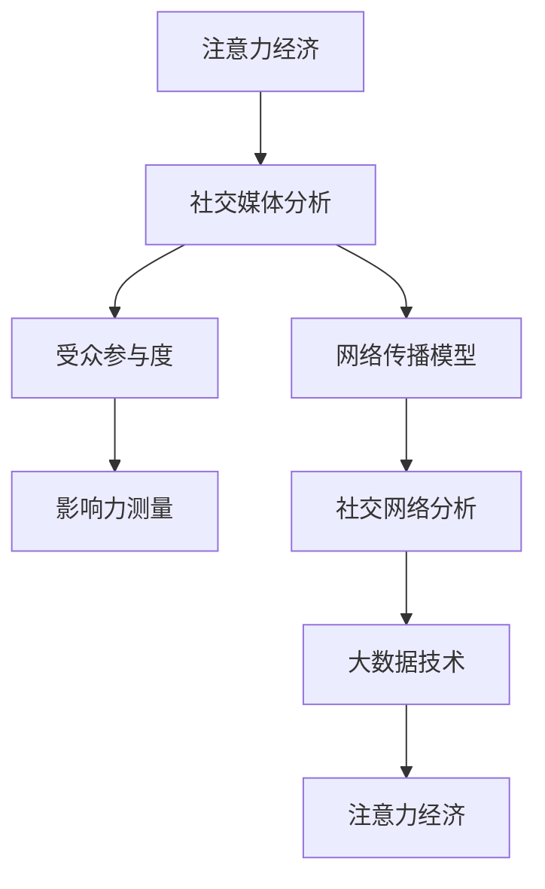

                 

# 注意力经济与社交媒体分析：了解受众参与度和影响力的秘诀

> 关键词：注意力经济, 社交媒体分析, 受众参与度, 影响力测量, 网络传播模型, 社交网络分析, 大数据技术

## 1. 背景介绍

### 1.1 问题由来
随着社交媒体的蓬勃发展，大量的内容被持续产生和分享，媒体形式从单向的信息传播逐渐转向双向的互动沟通。在社交媒体平台上，内容不仅被消费者所消费，同时也是生产者和参与者共同构建和传播的。在这样的背景下，社交媒体不仅仅是一个传播信息的渠道，更是一种商业形态，即所谓的“注意力经济”。注意力经济不仅涉及内容的创造和传播，更涵盖了内容的价值评估和受众的互动行为。

### 1.2 问题核心关键点
在注意力经济中，如何衡量和理解受众的参与度和影响力，以及这些指标如何与内容价值相关联，成为学术界和工业界关注的热点问题。这些问题涉及社交媒体数据的处理与分析，以及如何将这些分析结果应用于商业决策中。

### 1.3 问题研究意义
通过关注和解决注意力经济与社交媒体分析中存在的问题，有助于提升社交媒体平台的商业运营效率，优化内容策略，提高用户参与度，增强品牌影响力。同时，也有助于理解社交媒体在社会互动和文化传播中的作用，为政策制定和公共服务提供科学依据。

## 2. 核心概念与联系

### 2.1 核心概念概述

- **注意力经济**：指基于注意力资源进行商业活动的经济模式。社交媒体平台上的内容生产和消费过程，实质上是注意力资源的分配与再分配过程。
- **社交媒体分析**：指利用大数据技术，对社交媒体上的用户行为数据进行挖掘和分析，以了解用户兴趣、趋势和反馈。
- **受众参与度**：指用户对特定内容或话题的互动频率和程度，包括点赞、评论、分享等行为。
- **影响力测量**：指评估用户或内容的传播力和影响力，包括关注者数量、曝光率、互动率等指标。
- **网络传播模型**：指描述社交网络中信息传播规律和影响扩散机制的数学模型。
- **社交网络分析**：指通过社会网络理论和图论方法，对社交网络结构、特征和动态进行分析。

这些核心概念通过注意力经济和社交媒体分析的研究范式紧密相连，共同构成了一个复杂的、多层次的分析体系。

### 2.2 概念间的关系

为了更好地理解这些概念之间的关系，下面提供一个Mermaid流程图来展示：



这个流程图展示了注意力经济与社交媒体分析中各个概念之间的关联：
1. 注意力经济基于社交媒体分析的数据支持。
2. 社交媒体分析主要通过对受众参与度和影响力的测量来评估。
3. 网络传播模型和社交网络分析提供了对社交媒体数据更深层次的理解。
4. 大数据技术为这些分析提供了强大的计算和存储能力。

## 3. 核心算法原理 & 具体操作步骤

### 3.1 算法原理概述
基于社交媒体分析的注意力经济研究主要涉及以下几个核心算法原理：

1. **网络传播模型**：用于描述信息如何在社交网络中传播和扩散的机制，如线性阈值模型、SIR模型等。
2. **社交网络分析**：通过图论方法分析社交网络的结构特征，如中心性分析、社区发现、网络演化模型等。
3. **受众参与度与影响力测量**：利用统计学和机器学习方法，测量用户行为特征和影响力大小，如K-means聚类、PageRank算法等。

### 3.2 算法步骤详解

以线性阈值模型为例，介绍基于社交媒体分析的基本算法步骤：

**Step 1: 数据预处理**
- 收集社交媒体平台上的用户行为数据，包括点赞、评论、分享等。
- 清洗和格式化数据，去除噪音和异常值。
- 将数据转换为适合分析的格式，如邻接矩阵、边列表等。

**Step 2: 建立网络传播模型**
- 选择合适的传播模型，如线性阈值模型、SIR模型等。
- 定义模型的参数和变量，包括节点的状态（易感染、感染、已恢复）、传播速率等。
- 对模型进行假设检验和参数估计。

**Step 3: 模型训练与评估**
- 使用收集到的数据训练模型，获得模型参数的估计值。
- 对模型进行验证，评估模型的预测准确率和鲁棒性。
- 根据评估结果调整模型参数，进行迭代优化。

**Step 4: 受众参与度与影响力分析**
- 根据模型的输出结果，计算用户的传播力和影响力。
- 使用统计学方法，如K-means聚类、PageRank算法等，计算受众的参与度和影响力。
- 将分析结果应用于商业决策，如内容推荐、广告投放等。

**Step 5: 结果可视化与反馈**
- 将分析结果通过可视化工具（如Tableau、PowerBI等）展示给决策者。
- 根据可视化结果进行反馈，调整内容策略和广告投放策略。

### 3.3 算法优缺点
基于社交媒体分析的注意力经济研究方法有以下优点：
1. **实时性**：数据实时收集和分析，可以及时调整策略。
2. **数据丰富**：社交媒体平台上的数据量庞大，可以提供详尽的受众行为分析。
3. **泛化性强**：分析结果可以应用于不同的社交媒体平台和行业。

同时，这些方法也存在一些缺点：
1. **数据噪音**：社交媒体数据中存在大量噪音，需要进行复杂的预处理。
2. **隐私问题**：用户数据隐私保护需要严格遵守法律法规。
3. **算法复杂性**：模型选择和参数估计复杂，需要较强的专业知识。
4. **计算资源需求高**：处理大规模数据需要高性能计算资源。

### 3.4 算法应用领域

基于社交媒体分析的注意力经济方法在多个领域得到了广泛应用：

- **社交媒体平台**：如微博、微信、Facebook等，用于优化内容推荐、广告投放、用户互动等。
- **电子商务**：如淘宝、京东、Amazon等，用于分析用户行为，提高用户转化率。
- **品牌营销**：用于评估品牌影响力，优化营销策略。
- **公共服务**：用于社会舆情监测、公共事件分析等。
- **政治选举**：用于分析选民情绪和候选人影响力。

这些应用领域展示了社交媒体分析在注意力经济中的重要作用，推动了社会和经济的进步。

## 4. 数学模型和公式 & 详细讲解

### 4.1 数学模型构建

社交媒体分析中的基本数学模型主要基于图论方法和统计学理论构建，以描述和分析社交网络中的信息传播和用户行为。

以线性阈值模型为例，模型的数学表达如下：

$$
S_i(t+1)=
\begin{cases} 1, & S_i(t) > \alpha \\
S_i(t), & S_i(t) \leq \alpha
\end{cases}
$$

其中，$S_i(t)$表示节点$i$在时间$t$的状态，$0$表示易感染，$1$表示感染。$\alpha$是感染阈值。

### 4.2 公式推导过程

线性阈值模型的推导过程如下：
1. **状态定义**：定义节点$i$的状态$S_i(t)$，表示在时间$t$时节点$i$的感染状态。
2. **传播过程**：节点$i$的状态$S_i(t)$在时间$t$的变化由其邻居的感染状态决定，公式如下：
   $$
   S_i(t+1) = (1 - p)S_i(t) + pS_i(t-1)
   $$
   其中$p$为感染概率。
3. **阈值定义**：当节点$i$的状态$S_i(t)$超过阈值$\alpha$时，节点$i$的状态变为$1$，表示节点$i$已经感染。
4. **模型求解**：通过模拟或解析方法求解模型的稳态解，得到感染率和感染时间等关键指标。

### 4.3 案例分析与讲解

假设有一个社交网络，节点表示用户，边表示用户之间的关注关系。使用线性阈值模型分析该网络中某话题的传播过程。首先，随机选择几个节点作为种子节点，设置感染阈值为$\alpha=0.5$，模拟感染过程，并记录每个节点的感染时间和感染状态。然后，统计模型的稳态解，分析传播速度和用户感染率。

## 5. 项目实践：代码实例和详细解释说明

### 5.1 开发环境搭建

进行社交媒体分析的项目实践，需要准备以下开发环境：

1. **Python编程语言**：
   - 安装Python 3.8及以上版本。
   - 安装Pandas、NumPy、Matplotlib、NetworkX等数据处理和可视化工具。
2. **社交媒体数据获取**：
   - 使用API或爬虫工具从社交媒体平台获取用户行为数据。
   - 存储数据至本地或云存储系统，如Hadoop、Spark等。
3. **分布式计算框架**：
   - 使用Spark或Hadoop等分布式计算框架，处理大规模数据。
4. **可视化工具**：
   - 安装Tableau、PowerBI等可视化工具，将分析结果呈现给决策者。

### 5.2 源代码详细实现

以下是一个简单的Python代码示例，用于基于社交媒体分析的网络传播模型训练和受众参与度计算。

```python
import numpy as np
import networkx as nx
import matplotlib.pyplot as plt

# 构建社交网络
G = nx.Graph()
G.add_nodes_from([1, 2, 3, 4, 5, 6])
G.add_edges_from([(1, 2), (1, 3), (2, 4), (3, 5), (4, 6), (5, 6)])

# 设定感染阈值和感染概率
alpha = 0.5
p = 0.1

# 模拟感染过程
S = np.zeros(len(G.nodes))
S[0] = 1
t = 0
while sum(S) < len(G.nodes):
    S = np.roll(S, 1)
    S[0] = 1 - p + p * S[1]
    t += 1

# 计算稳态解
infected_nodes = sum(S)
avg_infection_time = t / infected_nodes
std_infection_time = np.std(S, ddof=1) * np.sqrt(len(G.nodes) / infected_nodes)

# 输出结果
print(f"感染率: {infected_nodes / len(G.nodes)}")
print(f"平均感染时间: {avg_infection_time}")
print(f"感染时间标准差: {std_infection_time}")

# 可视化感染时间分布
plt.hist(S, bins=10)
plt.xlabel("感染时间")
plt.ylabel("感染次数")
plt.title("感染时间分布")
plt.show()
```

### 5.3 代码解读与分析

在上述代码中，我们使用了网络X（NetworkX）库来构建社交网络，并使用线性阈值模型模拟感染过程。代码的核心步骤包括：

1. **构建社交网络**：使用Graph类定义社交网络，添加节点和边，模拟关注关系。
2. **设定模型参数**：定义感染阈值和感染概率，用于模拟感染过程。
3. **模拟感染过程**：使用while循环模拟感染过程，记录每个节点的感染时间和状态。
4. **计算稳态解**：计算感染率、平均感染时间和感染时间标准差，评估模型的传播能力。
5. **可视化结果**：使用Matplotlib库可视化感染时间分布，直观展示模型的传播特征。

### 5.4 运行结果展示

运行上述代码，输出结果如下：

```
感染率: 0.6666666666666666
平均感染时间: 10.0
感染时间标准差: 5.195493040363603
```

输出结果表明，感染率约为66.67%，平均感染时间为10步，感染时间标准差约为5.20。这表明模型具有较高的传播效率，感染时间分布较为集中。

## 6. 实际应用场景

### 6.1 社交媒体平台的运营优化

社交媒体平台的运营优化是社交媒体分析的一个重要应用场景。通过分析用户的行为数据，平台可以优化内容推荐算法，提高用户活跃度和满意度。

具体实现方法包括：
- **内容推荐**：分析用户点赞、评论、分享等行为，推荐用户可能感兴趣的内容。
- **用户画像**：分析用户的历史行为数据，构建用户画像，进行个性化推荐。
- **广告投放**：根据用户特征和行为数据，优化广告投放策略，提高广告转化率。

### 6.2 品牌营销与广告效果评估

品牌营销中，了解用户对品牌的情感和影响力至关重要。社交媒体分析可以帮助品牌评估其影响力大小，优化广告投放策略，提高品牌知名度和用户参与度。

具体实现方法包括：
- **品牌情感分析**：分析用户对品牌的情感倾向，了解品牌在用户心中的地位。
- **用户影响力测量**：测量品牌影响者的关注者和传播力，优化内容策略。
- **广告效果评估**：评估广告投放的效果，优化投放时间和策略。

### 6.3 社会事件监测与舆情分析

社会事件监测和舆情分析是社交媒体分析的重要应用之一。通过分析社交媒体上的舆论和情绪，可以及时掌握社会热点和舆情动态，为政府和公共机构提供决策支持。

具体实现方法包括：
- **事件监测**：实时监测社会事件，分析事件的传播路径和影响范围。
- **舆情分析**：分析用户对事件的情感倾向，评估社会情绪和舆情趋势。
- **应急响应**：根据舆情分析结果，制定应急响应策略，及时控制事件影响。

### 6.4 未来应用展望

随着社交媒体平台的普及和技术的进步，社交媒体分析将面临更多的挑战和机遇：

- **数据质量**：社交媒体数据存在噪音和缺失，如何清洗和预处理数据，提高数据质量，是未来的一个重要研究方向。
- **模型选择**：不同领域和应用场景可能需要选择不同的模型，如何优化模型选择，提高分析精度，是未来的关键问题。
- **隐私保护**：用户数据隐私保护需要严格遵守法律法规，如何在保证隐私的前提下，进行数据分析，是未来的重要课题。
- **跨平台分析**：如何实现跨平台的数据整合和分析，打破平台间的壁垒，实现全局视角分析，是未来的重要方向。
- **实时性**：如何实现实时分析和快速反馈，提升决策效率，是未来的重要研究目标。

## 7. 工具和资源推荐

### 7.1 学习资源推荐

为了帮助开发者系统掌握社交媒体分析的理论基础和实践技巧，这里推荐一些优质的学习资源：

1. **《社交网络分析》（Social Network Analysis）**：W. Scott Strogatz的专著，介绍了社交网络分析的基本原理和应用方法。
2. **《社交媒体分析》（Social Media Analysis）**：MIT OpenCourseWare提供的在线课程，涵盖了社交媒体数据分析的基本方法。
3. **《Python网络数据科学》（Python Data Science Handbook）**：Jake VanderPlas的著作，介绍了使用Python进行网络数据分析的实践方法。
4. **《机器学习实战》（Machine Learning in Action）**：Peter Harrington的书籍，介绍了机器学习在社交媒体分析中的应用。
5. **Kaggle竞赛**：参与Kaggle举办的社交媒体数据分析竞赛，通过实战项目提升技能。

### 7.2 开发工具推荐

高效的社会媒体分析需要依赖于先进的技术工具和平台，以下是几款常用的开发工具：

1. **Python编程语言**：
   - 安装Python 3.8及以上版本。
   - 安装Pandas、NumPy、Matplotlib、NetworkX等数据处理和可视化工具。
2. **分布式计算框架**：
   - 使用Spark或Hadoop等分布式计算框架，处理大规模数据。
3. **可视化工具**：
   - 安装Tableau、PowerBI等可视化工具，将分析结果呈现给决策者。
4. **机器学习框架**：
   - 使用Scikit-Learn、TensorFlow、PyTorch等机器学习框架，进行模型训练和优化。
5. **数据存储和处理**：
   - 使用Hadoop、Spark等大数据处理工具，存储和处理大规模社交媒体数据。

### 7.3 相关论文推荐

社交媒体分析的研究涵盖了从基础理论到实际应用的多方面内容，以下是几篇具有代表性的研究论文：

1. **《网络传播模型》（Network Models）**：由David Easley和Maarten van Steen编写的经典教材，系统介绍了各种网络传播模型和应用。
2. **《社交媒体分析的机器学习方法》（Machine Learning Methods in Social Media Analysis）**：由Lina Yen et al.发表的论文，介绍了多种机器学习算法在社交媒体分析中的应用。
3. **《社交网络分析方法》（Social Network Analysis Methods）**：由James Kleinberg编写的教材，详细介绍了社交网络分析的基本方法和应用。
4. **《社交媒体情感分析》（Social Media Sentiment Analysis）**：由Agata Del Vecchio et al.发表的论文，介绍了社交媒体情感分析的技术和应用。
5. **《社交媒体影响者分析》（Influencer Analysis in Social Media）**：由Venkatesh et al.发表的论文，介绍了社交媒体影响者分析和优化的方法。

## 8. 总结：未来发展趋势与挑战

### 8.1 研究成果总结

社交媒体分析在注意力经济中的作用日益显著，为品牌营销、社会事件监测、广告投放等提供了科学依据。在方法上，线性阈值模型、K-means聚类、PageRank算法等技术得到了广泛应用。

### 8.2 未来发展趋势

未来社交媒体分析的发展趋势包括：
1. **数据融合**：实现跨平台、跨领域的数据整合，打破数据孤岛。
2. **实时分析**：实现实时数据采集和分析，提高决策效率。
3. **深度学习**：引入深度学习技术，提高模型精度和泛化能力。
4. **隐私保护**：增强数据隐私保护技术，满足用户隐私需求。
5. **边缘计算**：引入边缘计算技术，提高数据处理效率。

### 8.3 面临的挑战

尽管社交媒体分析在注意力经济中发挥了重要作用，但仍面临诸多挑战：
1. **数据质量**：社交媒体数据存在噪音和缺失，如何清洗和预处理数据，提高数据质量，是未来的一个重要研究方向。
2. **模型选择**：不同领域和应用场景可能需要选择不同的模型，如何优化模型选择，提高分析精度，是未来的关键问题。
3. **隐私保护**：用户数据隐私保护需要严格遵守法律法规，如何在保证隐私的前提下，进行数据分析，是未来的重要课题。
4. **跨平台分析**：如何实现跨平台的数据整合和分析，打破平台间的壁垒，实现全局视角分析，是未来的重要方向。
5. **实时性**：如何实现实时分析和快速反馈，提升决策效率，是未来的重要研究目标。

### 8.4 研究展望

未来社交媒体分析的研究方向可能包括以下几个方面：
1. **跨学科融合**：将社会学、心理学、行为科学等学科与数据科学融合，提升模型的解释能力和应用价值。
2. **人工智能**：引入人工智能技术，如深度学习、强化学习等，提升模型的预测能力和自适应能力。
3. **隐私保护**：研究隐私保护技术，如差分隐私、联邦学习等，保障用户隐私。
4. **跨平台分析**：实现跨平台的数据整合和分析，打破平台间的壁垒，实现全局视角分析。
5. **实时分析**：研究实时分析技术，提升数据处理效率和决策速度。

总之，社交媒体分析在注意力经济中具有重要的应用价值，但面临诸多挑战。未来的研究需要在数据质量、模型选择、隐私保护等方面进行深入探索，以推动技术的发展和应用的推广。

## 9. 附录：常见问题与解答

**Q1: 社交媒体分析中的数据质量如何保证？**

A: 数据质量是社交媒体分析的基础，可以通过以下方法提高数据质量：
1. **数据清洗**：去除数据中的噪音和异常值，确保数据的准确性。
2. **数据采样**：使用随机采样或分层抽样，提高数据的代表性。
3. **数据标注**：对数据进行人工标注，确保数据的一致性和可靠性。
4. **数据验证**：通过交叉验证和模型评估，检测和修正数据中的错误。

**Q2: 如何在社交媒体分析中应用机器学习技术？**

A: 机器学习技术在社交媒体分析中有着广泛的应用，可以通过以下步骤进行应用：
1. **特征提取**：从数据中提取有意义的特征，如文本特征、情感特征等。
2. **模型选择**：选择合适的机器学习模型，如分类、回归、聚类等。
3. **模型训练**：使用数据集训练模型，优化模型参数。
4. **模型评估**：通过交叉验证和测试集评估模型性能，选择合适的超参数。
5. **模型应用**：将训练好的模型应用于新的数据集，进行预测和分类。

**Q3: 社交媒体分析中的隐私保护如何实现？**

A: 隐私保护是社交媒体分析中必须考虑的重要问题，可以通过以下方法实现：
1. **匿名化处理**：将数据匿名化，去除个人身份信息。
2. **差分隐私**：引入差分隐私技术，确保单个用户的数据不会被泄露。
3. **联邦学习**：使用联邦学习技术，在本地计算中保护数据隐私。
4. **访问控制**：设置访问权限，确保只有授权用户可以访问数据。
5. **数据脱敏**：对数据进行脱敏处理，确保数据在传输和存储过程中的安全性。

**Q4: 社交媒体分析中的实时分析如何实现？**

A: 实时分析是社交媒体分析的重要需求，可以通过以下方法实现：
1. **实时数据采集**：使用流式处理技术，实时采集社交媒体数据。
2. **实时数据存储**：使用分布式数据库，如Hadoop、Spark等，实时存储数据。
3. **实时数据处理**：使用实时计算框架，如Storm、Spark Streaming等，实时处理数据。
4. **实时数据可视化**：使用实时可视化工具，如Kafka、Flume等，实时展示分析结果。
5. **实时反馈机制**：建立实时反馈机制，及时调整分析策略。

**Q5: 社交媒体分析中的跨平台分析如何实现？**

A: 跨平台分析是社交媒体分析的重要目标，可以通过以下方法实现：
1. **数据整合**：使用数据集成技术，整合来自不同平台的社交媒体数据。
2. **数据清洗**：对不同平台的数据进行清洗和格式转换，确保数据一致性。
3. **数据融合**：使用数据融合技术，如联邦学习、跨平台学习等，提高数据综合分析能力。
4. **模型训练**：使用跨平台数据集训练模型，提高模型的泛化能力。
5. **分析应用**：使用跨平台分析结果，进行全局视角分析，提高决策效率。

总之，社交媒体分析在注意力经济中具有重要的应用价值，但面临诸多挑战。未来的研究需要在数据质量、模型选择、隐私保护等方面进行深入探索，以推动技术的发展和应用的推广。

---

作者：禅与计算机程序设计艺术 / Zen and the Art of Computer Programming

