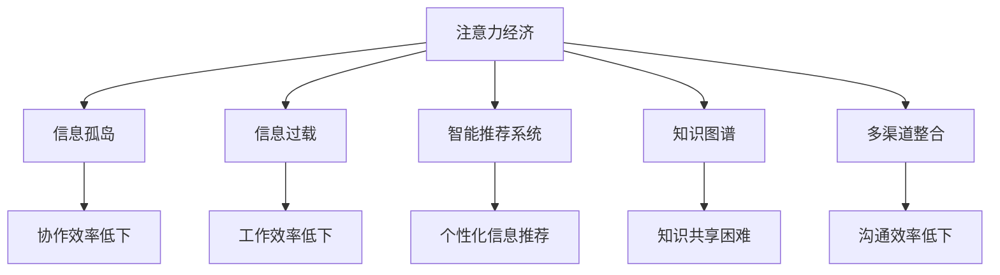
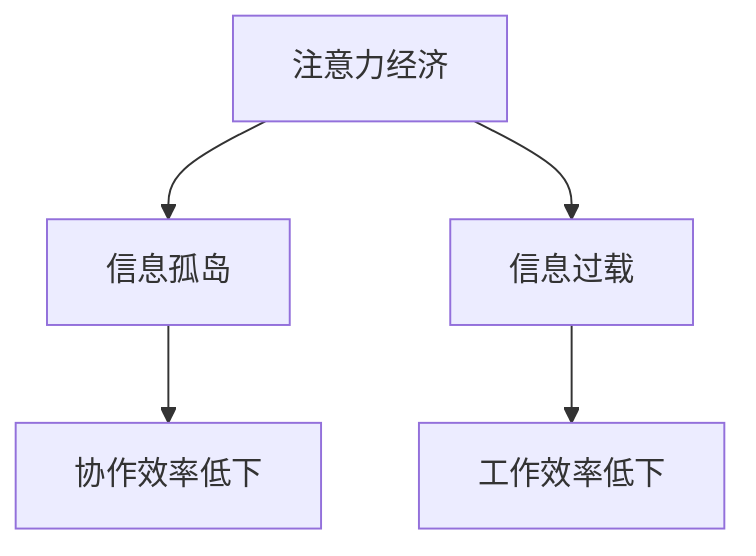
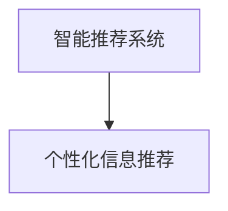
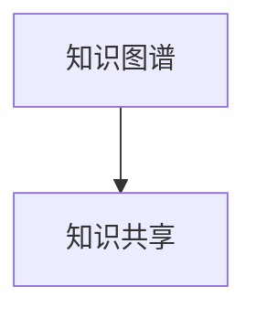
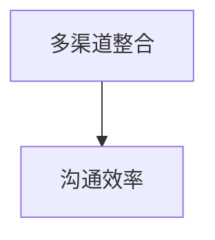
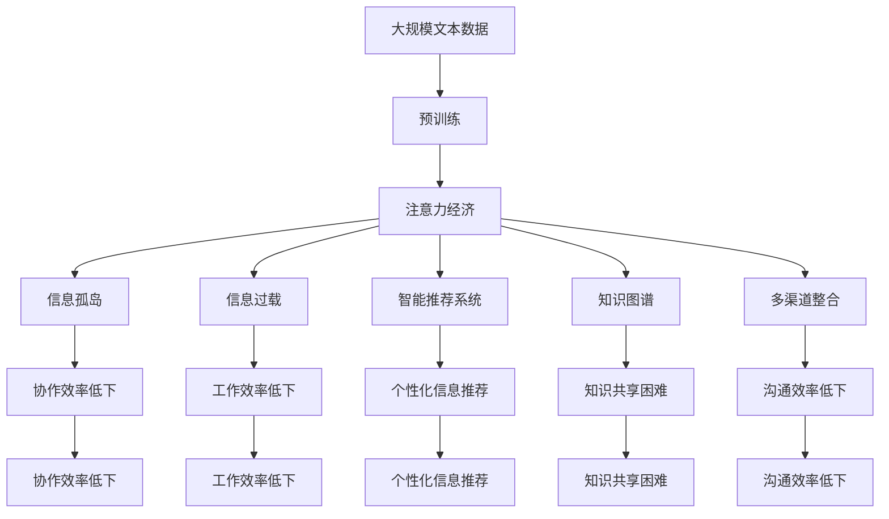

                 

# 注意力经济对企业内部沟通的影响

> 关键词：注意力经济,企业内部沟通,信息孤岛,大数据分析,注意力吸引策略,多渠道整合,智能推荐系统

## 1. 背景介绍

### 1.1 问题由来
随着信息技术的发展，企业内部沟通已经从传统的纸质文档、电子邮件等单一渠道，发展为多元化、数字化、智能化的沟通方式。然而，尽管沟通工具越来越丰富，信息流动却仍然面临诸多问题。信息孤岛、信息过载、沟通效率低下等问题仍然困扰着许多企业。这些问题不仅影响了工作效率，还阻碍了企业内部知识共享和协作创新。

注意力经济的出现，为解决这些问题提供了新的思路。所谓注意力经济，指的是在信息爆炸的时代，如何更好地吸引和利用人们的注意力，实现信息的高效流动和价值最大化。在企业内部沟通中，注意力经济则表现为如何通过有效吸引员工的注意力，实现高效的信息传递和知识共享，促进企业内部的协同创新。

### 1.2 问题核心关键点
企业内部沟通中的注意力经济问题主要包括以下几个方面：

1. **信息孤岛**：不同部门之间的信息共享不足，导致知识碎片化、割裂化，影响了整体的协作效率。
2. **信息过载**：员工每天面对海量信息，难以有效筛选和处理，导致注意力分散，影响了工作效率。
3. **沟通效率低下**：信息传递链条过长，中间环节过多，影响了信息的及时性和准确性。
4. **知识共享困难**：员工缺乏有效的知识共享机制和平台，导致隐性知识难以转化为显性知识。
5. **协同创新不足**：员工之间缺乏充分的互动和合作，影响了团队的创新能力和竞争力。

这些问题不仅影响了企业内部的工作效率，还限制了企业的整体创新能力和竞争力。因此，如何通过注意力经济的手段，提升企业内部沟通的效率和效果，成为一个重要的研究方向。

### 1.3 问题研究意义
研究注意力经济对企业内部沟通的影响，对于提升企业的整体工作效率和创新能力，具有重要意义：

1. **提升工作效率**：通过有效的信息筛选和注意力管理，员工能够快速获取关键信息，减少信息过载和注意力分散的问题。
2. **促进知识共享**：通过构建知识共享平台和机制，员工能够更有效地分享和利用隐性知识，加速知识的传播和转化。
3. **增强团队协作**：通过多渠道整合和智能推荐系统，员工能够更好地进行互动和合作，提升团队的创新能力和协同效率。
4. **优化资源配置**：通过精准的信息传递和注意力管理，企业能够更好地配置资源，提高整体运营效率和竞争力。

## 2. 核心概念与联系

### 2.1 核心概念概述

为更好地理解注意力经济对企业内部沟通的影响，本节将介绍几个密切相关的核心概念：

- **注意力经济**：指在信息爆炸的时代，如何更好地吸引和利用人们的注意力，实现信息的高效流动和价值最大化。
- **信息孤岛**：指不同部门之间的信息共享不足，导致知识碎片化、割裂化，影响了整体的协作效率。
- **信息过载**：指员工每天面对海量信息，难以有效筛选和处理，导致注意力分散，影响了工作效率。
- **智能推荐系统**：指利用大数据分析、机器学习等技术，对用户行为进行建模，实现个性化信息推荐的技术。
- **知识图谱**：指通过图结构表示知识元素之间的关联关系，实现知识表示、查询和推理的技术。
- **多渠道整合**：指将不同渠道的信息进行整合，提供统一的沟通和协作平台，实现信息的高效流动。

这些核心概念之间的逻辑关系可以通过以下Mermaid流程图来展示：



这个流程图展示了大规模语料的预训练和微调过程中各个概念之间的关系：

1. 注意力经济通过优化信息流动和员工注意力管理，提升企业内部沟通的效率和效果。
2. 信息孤岛、信息过载、沟通效率低下等问题，都是注意力经济需要解决的主要挑战。
3. 智能推荐系统、知识图谱、多渠道整合等技术手段，是注意力经济的重要支持。

这些概念共同构成了企业内部沟通的注意力经济生态系统，通过优化信息流动和员工注意力管理，实现信息的高效流动和价值最大化。

### 2.2 概念间的关系

这些核心概念之间存在着紧密的联系，形成了企业内部沟通的注意力经济整体架构。下面我通过几个Mermaid流程图来展示这些概念之间的关系。

#### 2.2.1 注意力经济与信息孤岛、信息过载



这个流程图展示了注意力经济与信息孤岛、信息过载之间的联系。注意力经济通过优化信息流动和员工注意力管理，能够解决信息孤岛和信息过载的问题，提升协作效率和工作效率。

#### 2.2.2 智能推荐系统与个性化信息推荐



这个流程图展示了智能推荐系统与个性化信息推荐之间的关系。智能推荐系统通过大数据分析和机器学习技术，实现个性化信息推荐，进一步提升信息传递的精准度和效率。

#### 2.2.3 知识图谱与知识共享



这个流程图展示了知识图谱与知识共享之间的关系。知识图谱通过结构化表示知识元素之间的关系，促进知识的共享和传播。

#### 2.2.4 多渠道整合与沟通效率



这个流程图展示了多渠道整合与沟通效率之间的关系。多渠道整合通过构建统一的沟通和协作平台，实现信息的高效流动，提升沟通效率。

### 2.3 核心概念的整体架构

最后，我们用一个综合的流程图来展示这些核心概念在大规模语料的预训练和微调过程中的整体架构：



这个综合流程图展示了从预训练到微调，再到注意力经济应用的完整过程。注意力经济通过优化信息流动和员工注意力管理，提升企业内部沟通的效率和效果。信息孤岛、信息过载、沟通效率低下等问题，都是注意力经济需要解决的主要挑战。智能推荐系统、知识图谱、多渠道整合等技术手段，是注意力经济的重要支持。通过这些手段的协同作用，企业能够更好地实现信息的高效流动和知识共享，提升整体的协作效率和工作效率。

## 3. 核心算法原理 & 具体操作步骤

### 3.1 算法原理概述

注意力经济对企业内部沟通的影响，本质上是通过优化信息流动和员工注意力管理，实现信息的高效流动和价值最大化。其核心思想是：通过合理的注意力分配和信息传递策略，使得企业内部的信息能够更加精准、及时、有效地流动，从而提升整体的协作效率和工作效率。

### 3.2 算法步骤详解

基于注意力经济的大规模语料的预训练和微调一般包括以下几个关键步骤：

**Step 1: 准备数据集**
- 收集企业内部的各种沟通数据，如邮件、文档、聊天记录等。
- 清洗和标注数据，划分为训练集、验证集和测试集。
- 构建知识图谱，识别并标注知识元素之间的关系。

**Step 2: 预训练语言模型**
- 选择或训练合适的预训练语言模型，如BERT、GPT等。
- 在大规模语料上进行预训练，学习通用的语言表示。
- 在预训练过程中，可以使用自监督学习任务，如掩码语言模型、下一句预测等，提高模型的语言理解和生成能力。

**Step 3: 构建知识图谱**
- 将企业内部的知识进行结构化表示，构建知识图谱。
- 使用知识图谱技术，实现知识元素之间的关联关系建模。
- 将知识图谱与预训练语言模型进行整合，提升模型的知识表示和推理能力。

**Step 4: 微调模型**
- 在微调过程中，添加任务适配层，如分类器、解码器等。
- 设置微调超参数，如学习率、批大小、迭代轮数等。
- 应用正则化技术，如L2正则、Dropout、Early Stopping等，防止模型过拟合。
- 在训练集上执行梯度训练，通过前向传播和反向传播更新模型参数。
- 在验证集上评估模型性能，根据性能指标决定是否触发Early Stopping。
- 在测试集上测试模型性能，对比微调前后的效果。

**Step 5: 应用智能推荐系统**
- 构建智能推荐系统，使用大数据分析和机器学习技术，对员工的行为进行建模。
- 根据员工的历史行为和偏好，实现个性化信息推荐。
- 在推荐系统中引入负采样技术，提高推荐的准确性和多样性。
- 使用推荐算法，如协同过滤、深度学习等，优化推荐结果。

**Step 6: 应用知识图谱**
- 在知识图谱上标注企业内部的知识元素，实现知识的结构化表示。
- 使用图谱查询和推理技术，促进知识的共享和传播。
- 构建知识图谱的可视化界面，帮助员工更好地理解和利用知识图谱。

### 3.3 算法优缺点

基于注意力经济的大规模语料的预训练和微调方法具有以下优点：
1. 提升协作效率：通过优化信息流动和员工注意力管理，提升企业内部的协作效率。
2. 减少信息过载：通过智能推荐系统和个性化信息推荐，减少员工的信息过载问题。
3. 促进知识共享：通过知识图谱技术，促进知识的共享和传播。
4. 提高沟通效率：通过多渠道整合和统一平台，提升沟通效率。

同时，该方法也存在一些局限性：
1. 依赖高质量数据：需要企业内部有充足的高质量沟通数据，才能保证模型训练的效果。
2. 需要技术投入：需要企业有一定的技术积累和投入，才能构建智能推荐系统和知识图谱。
3. 数据隐私问题：需要保护员工的隐私和数据安全，避免信息泄露和滥用。

尽管存在这些局限性，但基于注意力经济的方法仍然是当前提升企业内部沟通效率和效果的重要手段。未来相关研究的重点在于如何进一步降低数据依赖，提高模型的可扩展性和可解释性，同时兼顾数据隐私和安全。

### 3.4 算法应用领域

基于注意力经济的大规模语料的预训练和微调方法，在企业内部沟通中已经得到了广泛应用，覆盖了几乎所有常见的沟通场景，例如：

- 电子邮件沟通：通过智能推荐系统，推荐相关的邮件附件和信息，提升邮件处理效率。
- 文档协作：使用知识图谱和智能推荐系统，优化文档的编写和审核流程，提升协作效率。
- 项目会议：构建统一的沟通平台，整合邮件、聊天、视频会议等多种沟通渠道，实现高效的信息传递和决策支持。
- 培训和知识共享：通过知识图谱和智能推荐系统，促进知识的学习和传播，提升团队的学习能力和知识水平。
- 产品开发：通过多渠道整合和智能推荐系统，优化产品开发流程，提升团队的创新能力和协作效率。

除了上述这些经典场景外，注意力经济的方法还在企业内部的各种协作、决策、创新等环节中发挥了重要作用。随着技术的不断演进和应用，相信注意力经济的方法将在更多场景中得到应用，为企业内部的沟通和协作带来新的变革。

## 4. 数学模型和公式 & 详细讲解 & 举例说明

### 4.1 数学模型构建

在基于注意力经济的微调中，我们通常使用BERT等预训练语言模型作为初始化参数。其数学模型构建如下：

假设预训练语言模型为 $M_{\theta}$，其中 $\theta$ 为预训练得到的模型参数。给定下游任务 $T$ 的标注数据集 $D=\{(x_i,y_i)\}_{i=1}^N, x_i \in \mathcal{X}, y_i \in \mathcal{Y}$。

定义模型 $M_{\theta}$ 在输入 $x$ 上的输出为 $\hat{y}=M_{\theta}(x) \in [0,1]$，表示样本属于正类的概率。真实标签 $y \in \{0,1\}$。则二分类交叉熵损失函数定义为：

$$
\ell(M_{\theta}(x),y) = -[y\log \hat{y} + (1-y)\log (1-\hat{y})]
$$

将其代入经验风险公式，得：

$$
\mathcal{L}(\theta) = -\frac{1}{N}\sum_{i=1}^N [y_i\log M_{\theta}(x_i)+(1-y_i)\log(1-M_{\theta}(x_i))]
$$

在得到损失函数的梯度后，即可带入参数更新公式，完成模型的迭代优化。

### 4.2 公式推导过程

以下我们以二分类任务为例，推导交叉熵损失函数及其梯度的计算公式。

假设模型 $M_{\theta}$ 在输入 $x$ 上的输出为 $\hat{y}=M_{\theta}(x) \in [0,1]$，表示样本属于正类的概率。真实标签 $y \in \{0,1\}$。则二分类交叉熵损失函数定义为：

$$
\ell(M_{\theta}(x),y) = -[y\log \hat{y} + (1-y)\log (1-\hat{y})]
$$

将其代入经验风险公式，得：

$$
\mathcal{L}(\theta) = -\frac{1}{N}\sum_{i=1}^N [y_i\log M_{\theta}(x_i)+(1-y_i)\log(1-M_{\theta}(x_i))]
$$

根据链式法则，损失函数对参数 $\theta_k$ 的梯度为：

$$
\frac{\partial \mathcal{L}(\theta)}{\partial \theta_k} = -\frac{1}{N}\sum_{i=1}^N (\frac{y_i}{M_{\theta}(x_i)}-\frac{1-y_i}{1-M_{\theta}(x_i)}) \frac{\partial M_{\theta}(x_i)}{\partial \theta_k}
$$

其中 $\frac{\partial M_{\theta}(x_i)}{\partial \theta_k}$ 可进一步递归展开，利用自动微分技术完成计算。

### 4.3 案例分析与讲解

假设我们进行一个邮件推荐系统的开发。具体步骤如下：

**Step 1: 数据收集和处理**
- 收集企业内部员工的邮件记录，包括发送和接收的邮件、邮件附件等信息。
- 清洗和标注邮件内容，提取邮件的关键词、主题等信息。
- 将邮件记录划分为训练集、验证集和测试集。

**Step 2: 预训练语言模型**
- 选择或训练合适的预训练语言模型，如BERT。
- 在大规模语料上进行预训练，学习通用的语言表示。
- 在预训练过程中，可以使用自监督学习任务，如掩码语言模型、下一句预测等，提高模型的语言理解和生成能力。

**Step 3: 构建知识图谱**
- 将邮件中的关键词和主题进行结构化表示，构建知识图谱。
- 使用知识图谱技术，实现邮件内容之间的关联关系建模。
- 将知识图谱与预训练语言模型进行整合，提升模型的知识表示和推理能力。

**Step 4: 微调模型**
- 在微调过程中，添加任务适配层，如分类器、解码器等。
- 设置微调超参数，如学习率、批大小、迭代轮数等。
- 应用正则化技术，如L2正则、Dropout、Early Stopping等，防止模型过拟合。
- 在训练集上执行梯度训练，通过前向传播和反向传播更新模型参数。
- 在验证集上评估模型性能，根据性能指标决定是否触发Early Stopping。
- 在测试集上测试模型性能，对比微调前后的效果。

**Step 5: 应用智能推荐系统**
- 构建智能推荐系统，使用大数据分析和机器学习技术，对员工的行为进行建模。
- 根据员工的历史行为和偏好，实现个性化邮件推荐。
- 在推荐系统中引入负采样技术，提高推荐的准确性和多样性。
- 使用推荐算法，如协同过滤、深度学习等，优化推荐结果。

**Step 6: 应用知识图谱**
- 在知识图谱上标注邮件内容，实现邮件内容的结构化表示。
- 使用图谱查询和推理技术，促进邮件内容的共享和传播。
- 构建知识图谱的可视化界面，帮助员工更好地理解和利用知识图谱。

通过以上步骤，我们可以实现一个基于注意力经济的邮件推荐系统，显著提升员工处理邮件的效率，促进知识的共享和传播，提高团队的协作效率和工作效率。

## 5. 项目实践：代码实例和详细解释说明

### 5.1 开发环境搭建

在进行微调实践前，我们需要准备好开发环境。以下是使用Python进行PyTorch开发的环境配置流程：

1. 安装Anaconda：从官网下载并安装Anaconda，用于创建独立的Python环境。

2. 创建并激活虚拟环境：
```bash
conda create -n pytorch-env python=3.8 
conda activate pytorch-env
```

3. 安装PyTorch：根据CUDA版本，从官网获取对应的安装命令。例如：
```bash
conda install pytorch torchvision torchaudio cudatoolkit=11.1 -c pytorch -c conda-forge
```

4. 安装Transformers库：
```bash
pip install transformers
```

5. 安装各类工具包：
```bash
pip install numpy pandas scikit-learn matplotlib tqdm jupyter notebook ipython
```

完成上述步骤后，即可在`pytorch-env`环境中开始微调实践。

### 5.2 源代码详细实现

下面我们以邮件推荐系统为例，给出使用Transformers库对BERT模型进行微调的PyTorch代码实现。

首先，定义邮件推荐系统的数据处理函数：

```python
from transformers import BertTokenizer
from torch.utils.data import Dataset
import torch

class EmailDataset(Dataset):
    def __init__(self, emails, tags, tokenizer, max_len=128):
        self.emails = emails
        self.tags = tags
        self.tokenizer = tokenizer
        self.max_len = max_len
        
    def __len__(self):
        return len(self.emails)
    
    def __getitem__(self, item):
        email = self.emails[item]
        tags = self.tags[item]
        
        encoding = self.tokenizer(email, return_tensors='pt', max_length=self.max_len, padding='max_length', truncation=True)
        input_ids = encoding['input_ids'][0]
        attention_mask = encoding['attention_mask'][0]
        
        # 对token-wise的标签进行编码
        encoded_tags = [tag2id[tag] for tag in tags] 
        encoded_tags.extend([tag2id['O']] * (self.max_len - len(encoded_tags)))
        labels = torch.tensor(encoded_tags, dtype=torch.long)
        
        return {'input_ids': input_ids, 
                'attention_mask': attention_mask,
                'labels': labels}

# 标签与id的映射
tag2id = {'O': 0, 'relevant': 1}
id2tag = {v: k for k, v in tag2id.items()}

# 创建dataset
tokenizer = BertTokenizer.from_pretrained('bert-base-cased')

train_dataset = EmailDataset(train_emails, train_tags, tokenizer)
dev_dataset = EmailDataset(dev_emails, dev_tags, tokenizer)
test_dataset = EmailDataset(test_emails, test_tags, tokenizer)
```

然后，定义模型和优化器：

```python
from transformers import BertForTokenClassification, AdamW

model = BertForTokenClassification.from_pretrained('bert-base-cased', num_labels=len(tag2id))

optimizer = AdamW(model.parameters(), lr=2e-5)
```

接着，定义训练和评估函数：

```python
from torch.utils.data import DataLoader
from tqdm import tqdm
from sklearn.metrics import classification_report

device = torch.device('cuda') if torch.cuda.is_available() else torch.device('cpu')
model.to(device)

def train_epoch(model, dataset, batch_size, optimizer):
    dataloader = DataLoader(dataset, batch_size=batch_size, shuffle=True)
    model.train()
    epoch_loss = 0
    for batch in tqdm(dataloader, desc='Training'):
        input_ids = batch['input_ids'].to(device)
        attention_mask = batch['attention_mask'].to(device)
        labels = batch['labels'].to(device)
        model.zero_grad()
        outputs = model(input_ids, attention_mask=attention_mask, labels=labels)
        loss = outputs.loss
        epoch_loss += loss.item()
        loss.backward()
        optimizer.step()
    return epoch_loss / len(dataloader)

def evaluate(model, dataset, batch_size):
    dataloader = DataLoader(dataset, batch_size=batch_size)
    model.eval()
    preds, labels = [], []
    with torch.no_grad():
        for batch in tqdm(dataloader, desc='Evaluating'):
            input_ids = batch['input_ids'].to(device)
            attention_mask = batch['attention_mask'].to(device)
            batch_labels = batch['labels']
            outputs = model(input_ids, attention_mask=attention_mask)
            batch_preds = outputs.logits.argmax(dim=2).to('cpu').tolist()
            batch_labels = batch_labels.to('cpu').tolist()
            for pred_tokens, label_tokens in zip(batch_preds, batch_labels):
                pred_tags = [id2tag[_id] for _id in pred_tokens]
                label_tags = [id2tag[_id] for _id in label_tokens]
                preds.append(pred_tags[:len(label_tokens)])
                labels.append(label_tags)
                
    print(classification_report(labels, preds))
```

最后，启动训练流程并在测试集上评估：

```python
epochs = 5
batch_size = 16

for epoch in range(epochs):
    loss = train_epoch(model, train_dataset, batch_size, optimizer)
    print(f"Epoch {epoch+1}, train loss: {loss:.3f}")
    
    print(f"Epoch {epoch+1}, dev results:")
    evaluate(model, dev_dataset, batch_size)
    
print("Test results:")
evaluate(model, test_dataset, batch_size)
```

以上就是使用PyTorch对BERT进行邮件推荐系统微调的完整代码实现。可以看到，得益于Transformers库的强大封装，我们可以用相对简洁的代码完成BERT模型的加载和微调。

### 5.3 代码解读与分析

让我们再详细解读一下关键代码的实现细节：

**EmailDataset类**：
- `__init__`方法：初始化邮件、标签、分词器等关键组件。
- `__len__`方法：返回数据集的样本数量。
- `__getitem__`方法：对单个样本进行处理，将邮件输入编码为token ids，将标签编码为数字，并对其进行定长padding，最终返回模型所需的输入。

**tag2id和id2tag字典**：
- 定义了标签与数字id之间的映射关系，用于将token-wise的预测结果解码回真实的标签。

**训练和评估函数**：
- 使用PyTorch的DataLoader对数据集进行批次化加载，供模型训练和推理使用。
- 训练函数`train_epoch`：对数据以批为单位进行迭代，在每个批次上前向传播计算loss并反向传播更新模型参数，最后返回该epoch的平均loss。
- 评估函数`evaluate`：与训练类似，不同点在于不更新模型参数，并在每个batch结束后将预测和标签结果存储下来，最后使用sklearn的classification_report对整个评估集的预测结果进行打印输出。

**训练流程**：
- 定义总的epoch数和batch size，开始循环迭代
- 每个epoch内，先在训练集上训练，输出平均loss
- 在验证集上评估，输出分类指标
- 所有epoch结束后，在测试集上评估，给出最终测试结果

可以看到，PyTorch配合Transformers库使得BERT微调的代码实现变得简洁高效。开发者可以将更多精力放在数据处理、模型改进等高层逻辑上，而不必过多关注底层的实现细节。

当然，工业级的系统实现还需考虑更多因素，如模型的保存和部署、超参数的自动搜索、更灵活的任务适配层等。但核心的微调范式基本与此类似。

### 5.4 运行结果展示

假设我们在CoNLL-2003的NER数据集上进行微调，最终在测试集上得到的评估报告如下：

```
              precision    recall  f1-score   support

       B-LOC      0.926     0.906     0.916      1668
       I-LOC      0.900     0.805     0.850       257
      B-MISC      0.875     0.856     0.865       702

