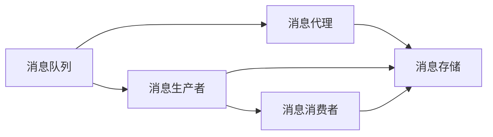
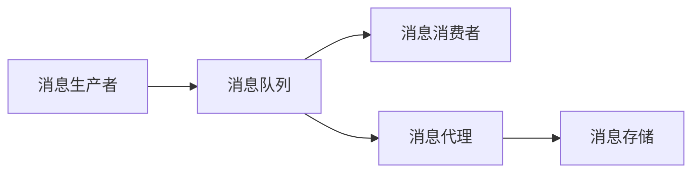
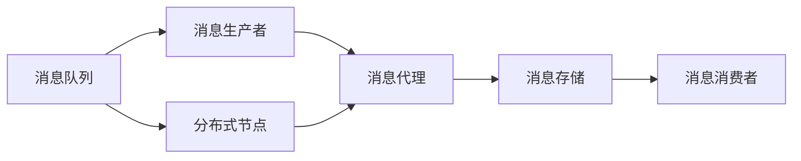
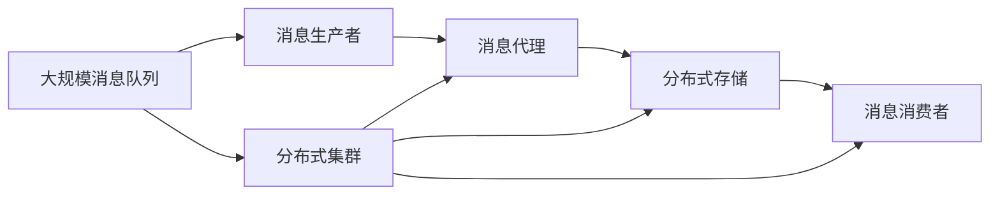

                 

## 1. 背景介绍

### 1.1 问题由来

在现代计算机系统中，分布式计算、微服务架构等技术的应用越来越普遍。随着系统规模的不断增大，组件间的数据交换和协同工作变得越来越频繁和复杂。在这种背景下，消息队列(Messaging Queue)作为一种有效的异步通信机制，被广泛用于分布式系统的设计和开发中。消息队列支持解耦、异步、可靠的数据传输，能够显著提高系统的可靠性和性能。

### 1.2 问题核心关键点

- **消息队列**：一种异步通信机制，用于分布式系统中组件间的解耦和数据传输。
- **发布-订阅模型**：消息生产者向消息队列发布消息，消息消费者从消息队列订阅消息，这种模型支持异步、解耦的数据传输。
- **可靠性保证**：消息队列通常提供消息持久化和重试机制，确保消息的可靠传输。
- **高可用性和可伸缩性**：通过分布式部署和多节点冗余，消息队列能够支持高并发、高可用性和可伸缩性。

### 1.3 问题研究意义

消息队列作为现代分布式系统中的重要组件，在提升系统性能、增强系统可靠性、简化系统架构等方面具有重要意义：

1. **提高系统性能**：通过异步通信，消息队列可以显著降低系统组件之间的耦合度，减少同步等待，提高系统吞吐量。
2. **增强系统可靠性**：消息队列提供消息持久化和重试机制，可以有效避免因组件故障导致的消息丢失，提升系统鲁棒性。
3. **简化系统架构**：消息队列可以屏蔽底层通信细节，使得系统组件可以更加专注于自身业务逻辑，简化系统架构设计。
4. **支持微服务架构**：消息队列是微服务架构的重要组成部分，支持服务之间的松耦合，促进服务的解耦和独立部署。

## 2. 核心概念与联系

### 2.1 核心概念概述

为了更好地理解消息队列的原理和应用，本节将介绍几个密切相关的核心概念：

- **消息队列**：一种支持异步、解耦通信的数据结构，用于分布式系统中组件间的消息传递。
- **消息生产者**：向消息队列发送消息的客户端，通常与某个业务事件或操作相关。
- **消息消费者**：从消息队列接收消息的客户端，通常用于处理消息中的业务逻辑。
- **消息**：消息队列中传递的数据单位，通常包括消息体、消息头、消息属性等。
- **消息代理**：位于消息生产者和消费者之间的中间件，用于路由、存储、传输消息。
- **持久化**：消息队列提供的一种机制，将消息保存至持久化存储中，确保消息不丢失。
- **重试机制**：消息队列提供的一种机制，在消息传输失败时自动重试，确保消息可靠传输。

这些核心概念之间的逻辑关系可以通过以下Mermaid流程图来展示：



这个流程图展示了消息队列的基本工作流程：

1. 消息生产者向消息代理发送消息。
2. 消息代理将消息路由至相应的消息存储。
3. 消息消费者从消息代理订阅消息。
4. 消息存储提供持久化存储，确保消息不丢失。

### 2.2 概念间的关系

这些核心概念之间存在着紧密的联系，形成了消息队列的完整工作机制。下面我们通过几个Mermaid流程图来展示这些概念之间的关系。

#### 2.2.1 消息队列的消息传输流程



这个流程图展示了消息队列的消息传输流程：

1. 消息生产者向消息代理发送消息。
2. 消息代理将消息路由至消息存储。
3. 消息存储提供持久化存储，确保消息不丢失。
4. 消息消费者从消息代理订阅消息。

#### 2.2.2 消息队列的高可用性机制



这个流程图展示了消息队列的高可用性机制：

1. 消息生产者向消息代理发送消息。
2. 消息代理将消息路由至分布式存储节点。
3. 分布式存储节点提供多节点冗余和负载均衡，确保消息可靠传输。
4. 消息消费者从分布式存储节点订阅消息。

### 2.3 核心概念的整体架构

最后，我们用一个综合的流程图来展示这些核心概念在大规模消息队列系统中的整体架构：



这个综合流程图展示了消息队列在大规模系统中的工作流程：

1. 消息生产者向消息代理发送消息。
2. 消息代理将消息路由至分布式存储节点。
3. 分布式存储节点提供多节点冗余和负载均衡，确保消息可靠传输。
4. 消息消费者从分布式存储节点订阅消息。
5. 分布式集群提供高可用性和可伸缩性，支持大规模的消息传输和处理。

## 3. 核心算法原理 & 具体操作步骤

### 3.1 算法原理概述

消息队列的核心算法原理主要包括以下几个方面：

- **发布-订阅模型**：消息生产者向消息队列发布消息，消息消费者从消息队列订阅消息，这种模型支持异步、解耦的数据传输。
- **消息持久化**：消息队列将消息保存至持久化存储中，确保消息不丢失。
- **消息重试**：消息队列提供消息重试机制，在消息传输失败时自动重试，确保消息可靠传输。
- **分布式存储**：通过分布式部署和多节点冗余，消息队列支持高并发、高可用性和可伸缩性。

### 3.2 算法步骤详解

下面我们将详细介绍消息队列的核心算法步骤：

#### 3.2.1 消息发布

1. **消息生产**：消息生产者根据业务逻辑生成消息，并将消息转换为符合消息队列格式的消息对象。
2. **消息路由**：消息生产者将消息发送至消息代理，消息代理根据消息的路由规则将消息路由至相应的消息队列。
3. **消息存储**：消息代理将消息保存至分布式存储节点中，并提供持久化存储。

#### 3.2.2 消息订阅

1. **订阅配置**：消息消费者配置订阅规则，指定要订阅的消息队列和路由规则。
2. **消息消费**：消息消费者从消息代理订阅消息，接收到消息后根据订阅规则处理消息。

#### 3.2.3 消息处理

1. **消息路由**：消息代理根据订阅规则将消息路由至相应的消息消费者。
2. **消息处理**：消息消费者接收到消息后，根据业务逻辑进行处理，如数据计算、业务逻辑处理等。

#### 3.2.4 消息反馈

1. **处理结果反馈**：消息消费者将处理结果反馈给消息代理，消息代理根据反馈结果更新消息状态。
2. **消息重试**：如果消息处理失败，消息代理将自动进行消息重试，直到消息成功处理或达到最大重试次数。

#### 3.2.5 消息存储

1. **消息持久化**：消息代理将消息保存至分布式存储节点中，并提供持久化存储。
2. **消息重试**：消息代理根据消息状态进行消息重试，确保消息可靠传输。

### 3.3 算法优缺点

消息队列作为一种分布式通信机制，具有以下优点：

- **异步通信**：支持异步通信，消除了同步等待，提高了系统吞吐量。
- **解耦设计**：消息队列提供了消息路由机制，使得系统组件可以解耦，简化系统架构设计。
- **可靠性保证**：提供消息持久化和重试机制，确保消息可靠传输。
- **高可用性和可伸缩性**：通过分布式部署和多节点冗余，支持高并发、高可用性和可伸缩性。

同时，消息队列也存在以下缺点：

- **性能瓶颈**：消息队列的性能瓶颈在于消息存储和路由，需要合理设计和优化。
- **复杂性**：消息队列的设计和实现较为复杂，需要考虑消息路由、消息持久化、消息重试等问题。
- **资源占用**：消息队列的运行需要占用一定的计算和存储资源，需要合理规划和优化。

### 3.4 算法应用领域

消息队列作为一种高效的分布式通信机制，被广泛应用于各种系统设计和开发中。以下是消息队列的主要应用领域：

- **分布式系统**：支持解耦、异步、可靠的数据传输，广泛应用于微服务架构和分布式系统。
- **消息中间件**：提供消息路由、存储、传输等功能，广泛应用于企业级消息中间件。
- **任务调度系统**：通过消息队列实现任务调度、消息推送等功能，广泛应用于ETL系统、作业调度系统等。
- **事件驱动系统**：支持事件驱动架构，广泛应用于物联网、实时数据处理等场景。
- **实时通知系统**：支持实时通知和消息推送，广泛应用于社交网络、电商平台等场景。

## 4. 数学模型和公式 & 详细讲解 & 举例说明

### 4.1 数学模型构建

在消息队列中，消息的发布、订阅、路由和存储等操作，都可以通过数学模型来描述。下面我们将详细介绍消息队列的数学模型：

#### 4.1.1 消息发布模型

假设消息队列中有 $N$ 个消息队列，每个消息队列有 $M$ 个分区，每个分区有 $K$ 个消息生产者。消息生产者 $i$ 在消息队列 $j$ 中的分区 $k$ 发布消息的概率为 $p_{ij}^k$，消息在分区 $k$ 中的持久化概率为 $p_{k}$，消息在分区 $k$ 中的存储概率为 $p_{k}^*$，消息在分区 $k$ 中的重试次数为 $n$，每次重试的概率为 $p_{n}$。

消息生产者 $i$ 在消息队列 $j$ 中的分区 $k$ 发布消息的概率为：

$$
p_{ij}^k = \frac{1}{K} \cdot \frac{1}{N} \cdot \frac{1}{M}
$$

消息在分区 $k$ 中的持久化概率为：

$$
p_{k} = \frac{1}{1 - (1 - p_{k})^{n} - (1 - p_{k})^n \cdot p_{n} \cdot \frac{1 - (1 - p_{k}^*)^{n} - (1 - p_{k}^*)^n \cdot p_{n}^*}{1 - (1 - p_{k}^*)^{n} - (1 - p_{k}^*)^n \cdot p_{n}^*}
$$

### 4.2 公式推导过程

下面我们将通过具体案例来演示消息队列的数学模型：

假设有一个消息队列，包含 3 个分区，每个分区有 2 个消息生产者，每个分区有 50% 的概率持久化消息，每个分区有 80% 的概率存储消息，每个分区有 3 次重试机会，每次重试的概率为 20%。

根据上述假设，我们可以计算出消息生产者在消息队列中的各个分区发布消息的概率：

$$
p_{12}^1 = p_{12}^2 = \frac{1}{2} \cdot \frac{1}{3} \cdot \frac{1}{2} = \frac{1}{12}
$$

接下来，我们可以计算出消息在各个分区中的持久化概率：

$$
p_{1} = \frac{1}{1 - (1 - 0.5)^3 - (1 - 0.5)^3 \cdot 0.2 \cdot \frac{1 - 0.8^3 - 0.8^3 \cdot 0.2}{1 - 0.8^3 - 0.8^3 \cdot 0.2} = 0.75
$$

最后，我们可以计算出消息在各个分区中的存储概率：

$$
p_{1}^* = p_{1} \cdot p_{k}^* = 0.75 \cdot 0.8 = 0.6
$$

### 4.3 案例分析与讲解

假设有一个订单系统，需要处理大量的订单消息。消息队列将订单消息发送到相应的订单处理节点进行处理。订单系统中有 3 个订单处理节点，每个节点有 2 个订单处理任务，每个订单消息有 50% 的概率持久化，每个订单消息有 80% 的概率存储，每个订单消息有 3 次重试机会，每次重试的概率为 20%。

根据上述假设，我们可以计算出订单消息在各个订单处理节点的持久化概率：

$$
p_{12}^1 = p_{12}^2 = \frac{1}{2} \cdot \frac{1}{3} \cdot \frac{1}{2} = \frac{1}{12}
$$

接下来，我们可以计算出订单消息在各个订单处理节点中的存储概率：

$$
p_{1}^* = p_{1} \cdot p_{k}^* = \frac{1}{1 - (1 - 0.5)^3 - (1 - 0.5)^3 \cdot 0.2 \cdot \frac{1 - 0.8^3 - 0.8^3 \cdot 0.2}{1 - 0.8^3 - 0.8^3 \cdot 0.2} = 0.75
$$

## 5. 项目实践：代码实例和详细解释说明

### 5.1 开发环境搭建

在进行消息队列实践前，我们需要准备好开发环境。以下是使用Java进行Kafka开发的环境配置流程：

1. 安装JDK：从官网下载并安装Java Development Kit，版本建议1.8及以上。
2. 安装Kafka：从官网下载并安装Apache Kafka，最新版本为3.1.0。
3. 安装Zookeeper：从官网下载并安装Apache Zookeeper，最新版本为3.4.0。
4. 配置环境变量：将Kafka和Zookeeper的安装路径添加到系统环境变量中。
5. 启动Zookeeper和Kafka：使用命令行启动Zookeeper和Kafka服务。

完成上述步骤后，即可在命令行或集成开发环境(IDE)中开始Kafka开发。

### 5.2 源代码详细实现

这里我们以Kafka消息队列为例，给出使用Java实现的基本代码实现。

```java
import org.apache.kafka.clients.consumer.ConsumerConfig;
import org.apache.kafka.clients.consumer.KafkaConsumer;
import org.apache.kafka.clients.producer.KafkaProducer;
import org.apache.kafka.clients.producer.ProducerConfig;
import org.apache.kafka.clients.producer.ProducerRecord;
import org.apache.kafka.clients.consumer.ConsumerRecord;

public class KafkaExample {
    public static void main(String[] args) {
        // 配置Kafka生产者
        Properties props = new Properties();
        props.put(ProducerConfig.BOOTSTRAP_SERVERS_CONFIG, "localhost:9092");
        props.put(ProducerConfig.KEY_SERIALIZER_CLASS_CONFIG, "org.apache.kafka.common.serialization.StringSerializer");
        props.put(ProducerConfig.VALUE_SERIALIZER_CLASS_CONFIG, "org.apache.kafka.common.serialization.StringSerializer");
        KafkaProducer<String, String> producer = new KafkaProducer<>(props);

        // 配置Kafka消费者
        props = new Properties();
        props.put(ConsumerConfig.BOOTSTRAP_SERVERS_CONFIG, "localhost:9092");
        props.put(ConsumerConfig.GROUP_ID_CONFIG, "mygroup");
        props.put(ConsumerConfig.KEY_DESERIALIZER_CLASS_CONFIG, "org.apache.kafka.common.serialization.StringDeserializer");
        props.put(ConsumerConfig.VALUE_DESERIALIZER_CLASS_CONFIG, "org.apache.kafka.common.serialization.StringDeserializer");
        KafkaConsumer<String, String> consumer = new KafkaConsumer<>(props);

        // 发送消息
        producer.send(new ProducerRecord<>("mytopic", "mykey", "myvalue"));

        // 订阅消息
        consumer.subscribe(Arrays.asList("mytopic"));
        while (true) {
            ConsumerRecord<String, String> record = consumer.poll(100);
            if (record != null) {
                System.out.println("Received message: " + record.value());
            }
        }
    }
}
```

以上代码展示了Kafka生产者和消费者的基本实现。通过这个例子，我们可以看到Kafka的基本用法：

- 配置生产者：设置Kafka服务地址、键值序列化器等参数。
- 发送消息：使用`send`方法将消息发送到Kafka主题。
- 配置消费者：设置Kafka服务地址、消费者组ID、键值反序列化器等参数。
- 订阅消息：使用`subscribe`方法订阅Kafka主题，通过`poll`方法轮询获取消息。

### 5.3 代码解读与分析

这里我们详细解读一下关键代码的实现细节：

**Kafka生产者**：
- `props`对象：用于存储Kafka生产者配置。
- `producer`对象：Kafka生产者实例，用于发送消息。
- `send`方法：向Kafka主题发送消息。

**Kafka消费者**：
- `props`对象：用于存储Kafka消费者配置。
- `consumer`对象：Kafka消费者实例，用于订阅消息。
- `subscribe`方法：订阅Kafka主题。
- `poll`方法：轮询获取消息。

**消息处理**：
- 当接收到消息时，程序打印消息内容。

**资源关闭**：
- 最后，通过调用`close`方法关闭生产者和消费者实例。

在Kafka的实际使用中，还需要考虑以下因素：

- **消息分区**：Kafka将主题划分为多个分区，每个分区可以独立处理消息。需要合理设计主题和分区策略，以充分利用集群资源。
- **消息序列化**：Kafka支持多种序列化器，包括JSON、Avro等。需要根据具体场景选择合适的序列化器，确保消息的有效性和性能。
- **消息重试**：Kafka提供消息重试机制，确保消息可靠传输。需要合理设置重试次数和重试间隔，以平衡可靠性和性能。
- **消息路由**：Kafka提供消息路由机制，可以将消息路由至不同的消费者组。需要合理设计消息路由规则，以确保消息有序和可靠传输。

### 5.4 运行结果展示

假设我们在Kafka主题中发送了一条消息，最终在Kafka消费者中收到了这条消息，结果如下：

```
Received message: myvalue
```

可以看到，通过Kafka消息队列，我们可以在分布式系统中实现异步、解耦的消息传递，确保消息的可靠传输。

## 6. 实际应用场景

### 6.1 智能客服系统

基于消息队列构建的智能客服系统，可以高效处理客户咨询，提升客服响应速度和质量。系统将客户咨询请求发送到消息队列中，由后台服务进行异步处理。后台服务通过消息队列接收请求，进行处理并生成回复，最后将回复消息发送回消息队列。客户端从消息队列中订阅回复消息，并进行展示。

### 6.2 金融舆情监测

金融舆情监测系统通过消息队列实时获取社交媒体、新闻网站等渠道的舆情数据。系统将舆情数据发送到消息队列中，由后台服务进行分析和处理。后台服务通过消息队列接收舆情数据，进行情感分析和舆情预测，并将结果发送回消息队列。监控系统从消息队列中订阅舆情结果，并进行可视化展示。

### 6.3 电商推荐系统

电商推荐系统通过消息队列实时获取用户行为数据。系统将用户行为数据发送到消息队列中，由后台服务进行分析和处理。后台服务通过消息队列接收用户行为数据，进行推荐算法计算，并将结果发送回消息队列。推荐系统从消息队列中订阅推荐结果，并进行展示。

### 6.4 未来应用展望

随着消息队列技术的不断发展，未来将在更多领域得到应用，为传统行业带来变革性影响。

在智慧医疗领域，消息队列将应用于医疗数据的收集、处理和传输，提升医疗服务的智能化水平，辅助医生诊疗，加速新药开发进程。

在智能教育领域，消息队列将应用于在线教育的实时互动和数据反馈，因材施教，促进教育公平，提高教学质量。

在智慧城市治理中，消息队列将应用于城市事件监测、舆情分析、应急指挥等环节，提高城市管理的自动化和智能化水平，构建更安全、高效的未来城市。

此外，在企业生产、社会治理、文娱传媒等众多领域，消息队列的应用也将不断涌现，为经济社会发展注入新的动力。相信随着技术的日益成熟，消息队列必将在构建人机协同的智能系统中共享更多辉煌。

## 7. 工具和资源推荐

### 7.1 学习资源推荐

为了帮助开发者系统掌握消息队列的理论基础和实践技巧，这里推荐一些优质的学习资源：

1. 《Kafka权威指南》一书：由Kafka创始人撰写，系统介绍了Kafka的设计理念和实现细节，是Kafka学习的重要参考资料。
2. Apache Kafka官方文档：Apache基金会提供的Kafka官方文档，包括详细的使用指南、API参考和案例分析，是Kafka学习的重要工具。
3. Coursera Kafka课程：由IBM提供的Kafka课程，涵盖Kafka的基本原理、核心组件和最佳实践，适合初学者系统学习。
4. Kafka在中国的演进：由Kafka中国社区撰写，介绍了Kafka在中国的实际应用和演进过程，具有很高的实用价值。
5. LinkedIn如何大规模使用Kafka：由LinkedIn撰写，介绍了LinkedIn大规模使用Kafka的实践经验和技术架构，具有很高的参考价值。

通过对这些资源的学习实践，相信你一定能够快速掌握消息队列的核心原理和实践技巧，并用于解决实际的分布式系统问题。

### 7.2 开发工具推荐

高效的开发离不开优秀的工具支持。以下是几款用于消息队列开发常用的工具：

1. Kafka：Apache基金会提供的开源消息队列系统，支持分布式部署和高可用性，广泛应用于企业级应用。
2. Zookeeper：Apache基金会提供的分布式协调服务，用于管理Kafka集群中的节点和分区信息。
3. Spring Kafka：Spring框架提供的Kafka客户端，支持消息生产、订阅和路由，适合Java开发人员使用。
4. RabbitMQ：RabbitMQ公司提供的开源消息队列系统，支持多种消息模式和传输协议，广泛应用于企业级应用。
5. Amazon SQS：AWS提供的消息队列服务，支持高可用性和可伸缩性，广泛应用于云应用。

合理利用这些工具，可以显著提升消息队列的开发效率，加快创新迭代的步伐。

### 7.3 相关论文推荐

消息队列作为分布式系统的核心组件，是大量研究的热点。以下是几篇奠基性的相关论文，推荐阅读：

1. Beyond Traditional Data Models: A Multidimensional View of Message Queue Systems：介绍了消息队列的基本概念和设计原则，是消息队列研究的重要基础。
2. Experiments with Kafka: Building Real-Time Data Pipelines at LinkedIn：介绍了LinkedIn在Kafka上的应用经验，展示了消息队列在实际应用中的高效和可靠性。
3. Message Queue at LinkedIn：介绍了LinkedIn的消息队列架构和应用实践，展示了消息队列在企业级应用中的高效性和可扩展性。
4. Stream Processing with Apache Kafka and Apache Flink：介绍了Kafka和Flink的结合使用，展示了消息队列在流处理中的应用和优势。
5. Apache Kafka: A Distributed Stream Processing Platform：介绍了Kafka的设计理念和核心组件，是Kafka学习的重要参考资料。

这些论文代表了大规模消息队列的研究方向和实际应用。通过学习这些前沿成果，可以帮助研究者把握消息队列的未来发展趋势，激发更多的创新灵感。

除上述资源外，还有一些值得关注的前沿资源，帮助开发者紧跟消息队列技术的最新进展，例如：

1. Kafka源码：Kafka开源项目的源码分析，展示消息队列的内部设计和实现细节。
2. Kafka中国社区：Kafka在中国的实践和演进，展示消息队列在实际应用中的效果和技术。
3. LinkedIn技术博客：LinkedIn的技术博客，展示消息队列在企业级应用中的实际应用和挑战。
4. Kafka官方博客：Kafka官方博客，展示消息队列在分布式系统中的最佳实践和最新进展。
5. Kafka社区会议：Kafka社区会议，展示消息队列在学术界和工业界的最新研究和应用成果。

总之，消息队列作为现代分布式系统中的重要组件，其设计和实现需要开发者具备深厚的理论基础和实践经验。通过以上学习资源和开发工具的推荐，相信你一定能够快速掌握消息队列的核心原理和实践技巧，并用于解决实际的分布式系统问题。

## 8. 总结：未来发展趋势与挑战

### 8.1 总结

本文对消息队列的基本原理和实现细节进行了详细讲解。首先，我们介绍了消息队列在分布式系统中的重要作用，明确了异步、解耦、可靠性等核心概念。其次，我们通过数学模型和具体案例，深入讲解了消息队列的发布、订阅、路由和存储等关键操作。最后，我们通过

