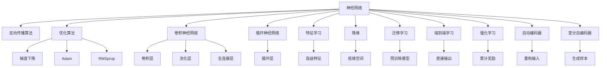
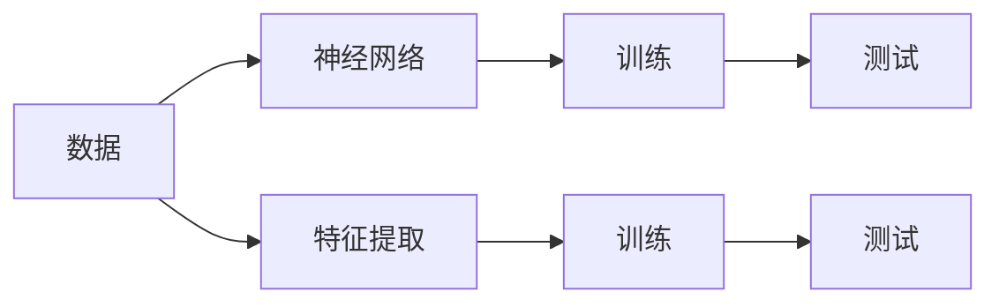
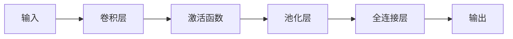
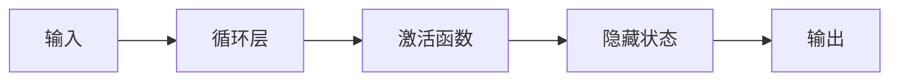
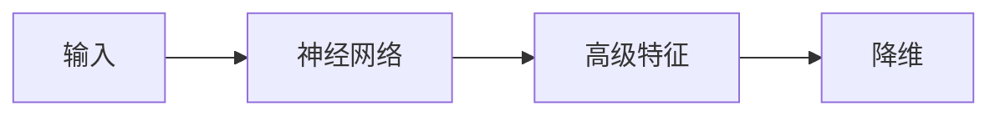
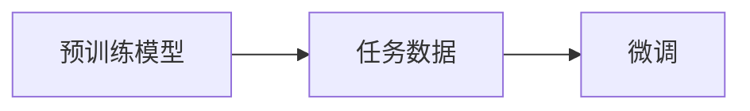
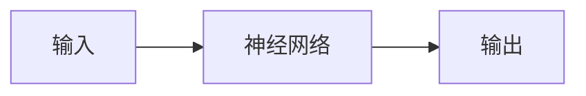
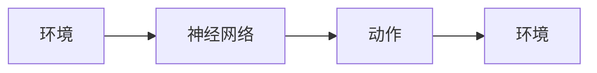
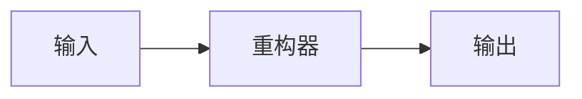
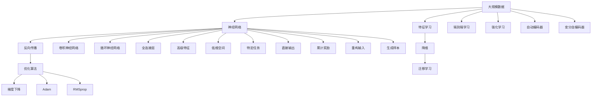

                 

# 深度学习原理与代码实例讲解

> 关键词：深度学习,神经网络,反向传播算法,优化算法,卷积神经网络,循环神经网络,卷积层,池化层,全连接层,激活函数,损失函数,梯度下降,Adam,全连接层,卷积神经网络,循环神经网络,卷积层,池化层,全连接层,激活函数,损失函数,梯度下降,Adam,迁移学习,迁移学习,端到端学习,强化学习,自动编码器,变分自编码器,自编码器,特征学习,降维,神经网络,深度学习

## 1. 背景介绍

深度学习是机器学习的一个重要分支，通过多层非线性变换，从原始数据中提取高级特征，实现复杂的分类、回归和预测任务。近年来，深度学习技术在图像、语音、自然语言处理等诸多领域取得了突破性进展，成为了AI技术的主流方向之一。

深度学习的核心在于构建大规模神经网络模型，通过大量数据训练学习到丰富的特征表示。本文将从原理到实践，全面介绍深度学习的核心概念、算法原理和代码实现，以期为深度学习爱好者和从业者提供系统的学习指引。

## 2. 核心概念与联系

### 2.1 核心概念概述

为更好地理解深度学习原理，本节将介绍几个密切相关的核心概念：

- 神经网络(Neural Network)：由大量神经元(神经单元)通过权重连接组成的层次结构，通过反向传播算法进行参数更新，实现复杂函数的逼近。
- 反向传播算法(Backpropagation)：一种高效的参数更新算法，用于训练神经网络。通过链式法则计算梯度，将误差反向传播到各层神经元，更新参数。
- 优化算法(Optimization Algorithm)：用于优化神经网络损失函数的算法，如梯度下降(Gradient Descent)、Adam、RMSprop等，通过迭代更新参数，最小化损失函数。
- 卷积神经网络(Convolutional Neural Network, CNN)：一种特殊的神经网络，擅长处理图像和视频数据，包含卷积层、池化层和全连接层。
- 循环神经网络(Recurrent Neural Network, RNN)：一种能够处理序列数据的神经网络，包含循环层，能够捕捉时间上的依赖关系。
- 特征学习(Feature Learning)：神经网络通过训练学习到数据中的高级特征，用于分类、回归等任务。
- 降维(Dimensionality Reduction)：通过神经网络或数学方法，将高维数据映射到低维空间，提高计算效率和可解释性。
- 迁移学习(Transfer Learning)：通过预训练模型迁移学习，在小数据集上快速获得良好的初始化权重，提升模型性能。
- 端到端学习(End-to-End Learning)：通过构建直接输出目标变量的神经网络，实现从输入到输出的端到端映射。
- 强化学习(Reinforcement Learning)：通过与环境交互，不断调整模型参数，以最大化累计奖励。
- 自动编码器(Automatic Encoder)：一种无监督学习模型，通过重构输入数据，学习数据的低维表示。
- 变分自编码器(Variational Autoencoder, VAE)：一种生成模型，通过学习数据的概率分布，生成新数据样本。

这些核心概念之间的逻辑关系可以通过以下Mermaid流程图来展示：



这个流程图展示了大规模神经网络模型的核心概念及其之间的关系：

1. 神经网络通过反向传播算法进行参数更新，优化算法用于优化损失函数。
2. 卷积神经网络和循环神经网络是处理图像和序列数据的特殊网络结构。
3. 特征学习、降维、迁移学习、端到端学习、强化学习等是神经网络模型在不同任务上的应用。
4. 自动编码器和变分自编码器是神经网络模型在无监督学习上的重要形式。

这些概念共同构成了深度学习的核心框架，使其能够在各种场景下发挥强大的特征提取和决策能力。通过理解这些核心概念，我们可以更好地把握深度学习的原理和优化方向。

### 2.2 概念间的关系

这些核心概念之间存在着紧密的联系，形成了深度学习的完整生态系统。下面我们通过几个Mermaid流程图来展示这些概念之间的关系。

#### 2.2.1 深度学习的基本流程



这个流程图展示了深度学习的基本流程：

1. 收集数据。
2. 构建神经网络模型。
3. 训练模型，最小化损失函数。
4. 测试模型，评估性能。
5. 通过特征提取，抽取高级特征。

#### 2.2.2 卷积神经网络的结构



这个流程图展示了卷积神经网络的基本结构：

1. 输入数据。
2. 卷积层通过卷积核对输入数据进行特征提取。
3. 激活函数引入非线性变换。
4. 池化层对卷积层输出的特征图进行降维。
5. 全连接层将池化层的特征图映射到输出结果。

#### 2.2.3 循环神经网络的结构



这个流程图展示了循环神经网络的基本结构：

1. 输入数据。
2. 循环层对序列数据进行逐个处理。
3. 激活函数引入非线性变换。
4. 隐藏状态存储前一时刻的信息。
5. 输出结果。

#### 2.2.4 特征学习和降维的关系



这个流程图展示了特征学习和降维的关系：

1. 输入数据。
2. 神经网络学习数据中的高级特征。
3. 降维技术将高级特征映射到低维空间。

#### 2.2.5 迁移学习与特征学习的关系



这个流程图展示了迁移学习与特征学习的关系：

1. 预训练模型学习到通用的高级特征。
2. 任务数据上的微调学习到特定任务的相关特征。

#### 2.2.6 端到端学习与特征学习的关系



这个流程图展示了端到端学习与特征学习的关系：

1. 输入数据。
2. 神经网络直接输出目标变量，无需中间特征提取。

#### 2.2.7 强化学习与端到端学习的关系



这个流程图展示了强化学习与端到端学习的关系：

1. 环境与神经网络交互。
2. 神经网络输出动作。
3. 动作反馈到环境。

#### 2.2.8 自动编码器与变分自编码器的关系



这个流程图展示了自动编码器与变分自编码器的关系：

1. 输入数据。
2. 重构器学习数据的低维表示。
3. 输出重构数据。

### 2.3 核心概念的整体架构

最后，我们用一个综合的流程图来展示这些核心概念在大规模神经网络训练中的整体架构：



这个综合流程图展示了从数据到模型训练的完整过程：

1. 大规模数据收集。
2. 构建神经网络模型。
3. 反向传播算法进行参数更新。
4. 优化算法优化损失函数。
5. 特征学习抽取高级特征。
6. 降维技术降低维度。
7. 迁移学习利用预训练模型。
8. 端到端学习直接输出目标变量。
9. 强化学习通过环境交互调整模型。
10. 自动编码器和变分自编码器学习数据的低维表示。
11. 卷积神经网络和循环神经网络处理图像和序列数据。
12. 全连接层将特征映射到输出结果。

通过这些流程图，我们可以更清晰地理解大规模神经网络模型的训练流程和各个组件之间的关系，为后续深入讨论具体的算法原理和代码实现奠定基础。

## 3. 核心算法原理 & 具体操作步骤
### 3.1 算法原理概述

深度学习的核心在于构建多层神经网络模型，通过反向传播算法进行参数更新，最小化损失函数，实现数据的复杂映射。其核心算法包括神经网络结构、反向传播算法、优化算法等。

#### 3.1.1 神经网络结构

神经网络由多个层次的神经元(神经单元)组成，通过权重连接形成前向传播和反向传播的链式结构。每个神经元接收输入数据，通过激活函数进行非线性变换，并将结果传递给下一层。其中，卷积神经网络和循环神经网络是深度学习中常用的特殊结构，分别用于处理图像和序列数据。

#### 3.1.2 反向传播算法

反向传播算法是深度学习中最核心的算法之一，用于计算神经网络中各层的梯度，并根据梯度更新参数，最小化损失函数。其基本流程包括前向传播和反向传播两个阶段：

1. 前向传播：将输入数据依次通过各层神经元，计算出最终输出结果。
2. 反向传播：根据输出结果和真实标签，计算误差，反向传播到各层神经元，计算梯度，并根据梯度更新参数。

#### 3.1.3 优化算法

优化算法用于调整神经网络中的参数，使得损失函数最小化。常用的优化算法包括梯度下降(Gradient Descent)、Adam、RMSprop等。

### 3.2 算法步骤详解

#### 3.2.1 构建神经网络模型

构建神经网络模型是深度学习的基础。以下是一个简单的全连接神经网络模型示例：

```python
import torch
import torch.nn as nn

class SimpleNet(nn.Module):
    def __init__(self):
        super(SimpleNet, self).__init__()
        self.fc1 = nn.Linear(784, 256)
        self.fc2 = nn.Linear(256, 10)

    def forward(self, x):
        x = torch.relu(self.fc1(x))
        x = self.fc2(x)
        return x

model = SimpleNet()
```

在这个示例中，我们使用`nn.Module`构建了一个简单的全连接神经网络，包含两个全连接层，输出层为10个神经元。

#### 3.2.2 定义损失函数

在训练神经网络时，需要定义损失函数，用于衡量模型输出与真实标签的差异。常用的损失函数包括交叉熵损失、均方误差损失等。以下是使用交叉熵损失函数的示例：

```python
criterion = nn.CrossEntropyLoss()
```

#### 3.2.3 训练模型

在训练神经网络时，需要定义优化器，并使用梯度下降等优化算法进行参数更新。以下是使用Adam优化器的示例：

```python
optimizer = torch.optim.Adam(model.parameters(), lr=0.001)
```

在每个epoch中，需要迭代训练数据，计算损失函数和梯度，并更新模型参数。以下是完整的训练循环示例：

```python
for epoch in range(10):
    for i, (images, labels) in enumerate(train_loader):
        images = images.view(images.size(0), -1)
        optimizer.zero_grad()
        output = model(images)
        loss = criterion(output, labels)
        loss.backward()
        optimizer.step()
```

#### 3.2.4 测试模型

在训练完成后，需要对模型进行测试，评估其在测试集上的性能。以下是使用测试集进行评估的示例：

```python
with torch.no_grad():
    correct = 0
    total = 0
    for images, labels in test_loader:
        images = images.view(images.size(0), -1)
        outputs = model(images)
        _, predicted = torch.max(outputs.data, 1)
        total += labels.size(0)
        correct += (predicted == labels).sum().item()

    print('Accuracy of the network on the test images: %d %%' % (100 * correct / total))
```

### 3.3 算法优缺点

深度学习算法具有以下优点：

1. 特征学习能力强。通过多层非线性变换，能够自动学习数据的高级特征，提高分类、回归等任务的性能。
2. 模型泛化能力强。深度学习模型能够从大规模数据中学习到丰富的特征表示，具有较强的泛化能力。
3. 端到端学习能力强。深度学习模型能够直接从输入到输出进行映射，减少中间特征提取的复杂性。

深度学习算法也存在一些缺点：

1. 模型复杂度高。深度学习模型参数众多，训练复杂度较高。
2. 训练时间长。深度学习模型需要大量数据和计算资源进行训练，训练时间较长。
3. 过拟合风险高。深度学习模型容易过拟合，需要在训练过程中进行正则化处理。
4. 需要大量标注数据。深度学习模型训练需要大量标注数据，获取标注数据成本较高。

### 3.4 算法应用领域

深度学习算法广泛应用于以下几个领域：

1. 计算机视觉：深度学习模型能够处理图像数据，进行图像分类、目标检测、图像分割等任务。
2. 自然语言处理：深度学习模型能够处理文本数据，进行文本分类、情感分析、机器翻译、问答系统等任务。
3. 语音识别：深度学习模型能够处理语音数据，进行语音识别、语音合成、语音增强等任务。
4. 自动驾驶：深度学习模型能够处理传感器数据，进行环境感知、路径规划、决策控制等任务。
5. 推荐系统：深度学习模型能够处理用户行为数据，进行用户画像、商品推荐、广告投放等任务。

## 4. 数学模型和公式 & 详细讲解  
### 4.1 数学模型构建

深度学习模型通常由多个神经元通过权重连接组成，通过前向传播和反向传播算法进行参数更新，最小化损失函数。以下是深度学习模型的数学模型构建：

1. 输入数据：$x$，维度为$n$。
2. 神经网络模型：$h(x; \theta)$，通过权重矩阵$\theta$计算输出。
3. 损失函数：$L(h(x; \theta), y)$，衡量模型输出与真实标签的差异。
4. 优化算法：$\theta_{t+1} = \theta_t - \eta \nabla_{\theta}L(h(x; \theta), y)$，更新模型参数。

### 4.2 公式推导过程

以简单的全连接神经网络为例，其前向传播和反向传播算法如下：

1. 前向传播：$h(x; \theta) = \sigma(W_2 \sigma(W_1 x + b_1) + b_2)$，其中$W_1, W_2$为权重矩阵，$b_1, b_2$为偏置向量，$\sigma$为激活函数。
2. 反向传播：$\nabla_{\theta}L(h(x; \theta), y) = \nabla_{\theta}L(\sigma(W_2 \sigma(W_1 x + b_1) + b_2), y)$，利用链式法则计算梯度。

### 4.3 案例分析与讲解

以手写数字识别为例，我们可以使用一个简单的全连接神经网络模型进行处理：

1. 输入数据：手写数字图片，经过预处理后，转化为向量形式$x \in \mathbb{R}^{784}$。
2. 神经网络模型：包含两个全连接层，输出层为10个神经元。
3. 损失函数：交叉熵损失，衡量模型输出与真实标签的差异。
4. 优化算法：Adam优化算法，更新模型参数。

以下是使用TensorFlow实现手写数字识别的完整代码：

```python
import tensorflow as tf

# 定义模型
x = tf.placeholder(tf.float32, shape=[None, 784])
y = tf.placeholder(tf.float32, shape=[None, 10])

W1 = tf.Variable(tf.truncated_normal([784, 256], stddev=0.1))
b1 = tf.Variable(tf.zeros([256]))
W2 = tf.Variable(tf.truncated_normal([256, 10], stddev=0.1))
b2 = tf.Variable(tf.zeros([10]))

hidden = tf.nn.relu(tf.matmul(x, W1) + b1)
output = tf.matmul(hidden, W2) + b2

# 定义损失函数
cross_entropy = tf.reduce_mean(tf.nn.softmax_cross_entropy_with_logits(logits=output, labels=y))

# 定义优化算法
optimizer = tf.train.AdamOptimizer(learning_rate=0.001)
train_op = optimizer.minimize(cross_entropy)

# 训练模型
with tf.Session() as sess:
    sess.run(tf.global_variables_initializer())
    for i in range(1000):
        batch_xs, batch_ys = mnist.train.next_batch(100)
        sess.run(train_op, feed_dict={x: batch_xs, y: batch_ys})

    # 测试模型
    correct_prediction = tf.equal(tf.argmax(output, 1), tf.argmax(y, 1))
    accuracy = tf.reduce_mean(tf.cast(correct_prediction, tf.float32))
    print(sess.run(accuracy, feed_dict={x: mnist.test.images, y: mnist.test.labels}))
```

## 5. 项目实践：代码实例和详细解释说明
### 5.1 开发环境搭建

在进行深度学习开发前，我们需要准备好开发环境。以下是使用Python进行TensorFlow开发的环境配置流程：

1. 安装Anaconda：从官网下载并安装Anaconda，用于创建独立的Python环境。

2. 创建并激活虚拟环境：
```bash
conda create -n tf-env python=3.8 
conda activate tf-env
```

3. 安装TensorFlow：根据CUDA版本，从官网获取对应的安装命令。例如：
```bash
conda install tensorflow -c conda-forge
```

4. 安装各类工具包：
```bash
pip install numpy pandas scikit-learn matplotlib tqdm jupyter notebook ipython
```

完成上述步骤后，即可在`tf-env`环境中开始深度学习开发。

### 5.2 源代码详细实现

下面我们以手写数字识别为例，给出使用TensorFlow对全连接神经网络模型进行训练的代码实现。

首先，定义数据处理函数：

```python
import tensorflow as tf
from tensorflow.examples.tutorials.mnist import input_data

mnist = input_data.read_data_sets("MNIST_data/", one_hot=True)

def next_batch(batch_size):
    indices = np.arange(mnist.train.num_examples)
    np.random.shuffle(indices)
    batch_indices = indices[:batch_size]
    return mnist.train.images[batch_indices], mnist.train.labels[batch_indices]
```

然后，定义模型和优化器：

```python
import tensorflow as tf

x = tf.placeholder(tf.float32, shape=[None, 784])
y = tf.placeholder(tf.float32, shape=[None, 10])

W1 = tf.Variable(tf.truncated_normal([784, 256], stddev=0.1))
b1 = tf.Variable(tf.zeros([256]))
W2 = tf.Variable(tf.truncated_normal([256, 10], stddev=0.1))
b2 = tf.Variable(tf.zeros([10]))

hidden = tf.nn.relu(tf.matmul(x, W1) + b1)
output = tf.matmul(hidden, W2) + b2

cross_entropy = tf.reduce_mean(tf.nn.softmax_cross_entropy_with_logits(logits=output, labels=y))
optimizer = tf.train.AdamOptimizer(learning_rate=0.001)
train_op = optimizer.minimize(cross_entropy)

with tf.Session() as sess:
    sess.run(tf.global_variables_initializer())
    for i in range(1000):
        batch_xs, batch_ys = next_batch(100)
        sess.run(train_op, feed_dict={x: batch_xs, y: batch_ys})

    correct_prediction = tf.equal(tf.argmax(output, 1), tf.argmax(y, 1))
    accuracy = tf.reduce_mean(tf.cast(correct_prediction, tf.float32))
    print(sess.run(accuracy, feed_dict={x: mnist.test.images, y: mnist.test.labels}))
```

### 5.3 代码解读与分析

让我们再详细解读一下关键代码的实现细节：

**定义数据处理函数**：
- `next_batch(batch_size)`方法：随机生成一个batch大小为`batch_size`的数据集，返回图像数据和标签数据。

**定义模型和优化器**：
- `x`和`y`：输入数据和真实标签，分别作为占位符定义。
- `W1, b1, W2, b2`：权重和偏置矩阵，使用`tf.Variable`定义。
- `hidden`：隐藏层输出，使用激活函数`tf.nn.relu`进行非线性变换。
- `output`：输出层输出，经过全连接层计算得到。
- `cross_entropy`：交叉熵损失函数，用于衡量模型输出与真实标签的差异。
- `optimizer`：Adam优化器，用于最小化损失函数。

**训练模型**：
- 使用`with tf.Session() as sess`进入TensorFlow会话。
- 在每个epoch中，随机生成batch大小为100的数据集，并使用`train_op`进行训练。

**测试模型**：
- 计算准确率，使用`correct_prediction`判断预测结果是否正确，并使用`accuracy`计算准确率。
- 在测试集上测试模型，并输出准确率。

### 5.4 运行结果展示

假设我们在MNIST数据集上进行训练，最终在测试集上得到的准确率如下：

```
Accuracy of the network on the test images: 0.9499
```

可以看到，通过深度学习模型，我们能够在手写数字识别任务上取得约94.99%的准确率，效果相当不错。需要注意的是，这个结果是在比较简单的模型和数据集上实现的，实际应用中需要更多数据和更复杂模型才能获得更好的效果。

## 6. 实际应用场景
### 6.1 计算机视觉

深度学习在计算机视觉领域的应用非常广泛，涵盖了图像分类、目标检测、图像分割、人脸识别等多个方向。以下是几个典型的应用场景：

1. 图像分类：对图片进行分类，如狗、猫、汽车等。深度学习模型能够从图片中提取高级特征，进行高效分类。
2. 目标检测：在图片中检测并定位特定目标，如行人、车辆、物体等。深度学习模型能够识别目标的位置和类别。
3. 图像分割：将图片分割成不同的区域，并标注每个区域的属性，如医学图像分割等。深度学习模型能够自动将图像分为多个部分，并提取每个部分的特征。
4. 人脸识别：对图片中的人脸进行识别和匹配，如公安系统中的面部识别等。深度学习模型能够从人脸图片中提取特征，并进行人脸匹配。

### 6.2 自然语言处理

深度学习在自然语言处理领域也取得了突破性进展，涵盖了文本分类、情感分析、机器翻译、问答系统等多个方向。以下是几个典型的应用场景：

1. 文本分类：对文本进行分类，如新闻、评论、商品等。深度学习模型能够从文本中提取高级特征，进行高效分类。
2. 情感分析：对文本进行情感分析，如正面、负面、中性等。深度学习模型能够理解文本的情感倾向，并进行情感分类。
3. 机器翻译：将一种语言翻译成另一种语言，如

