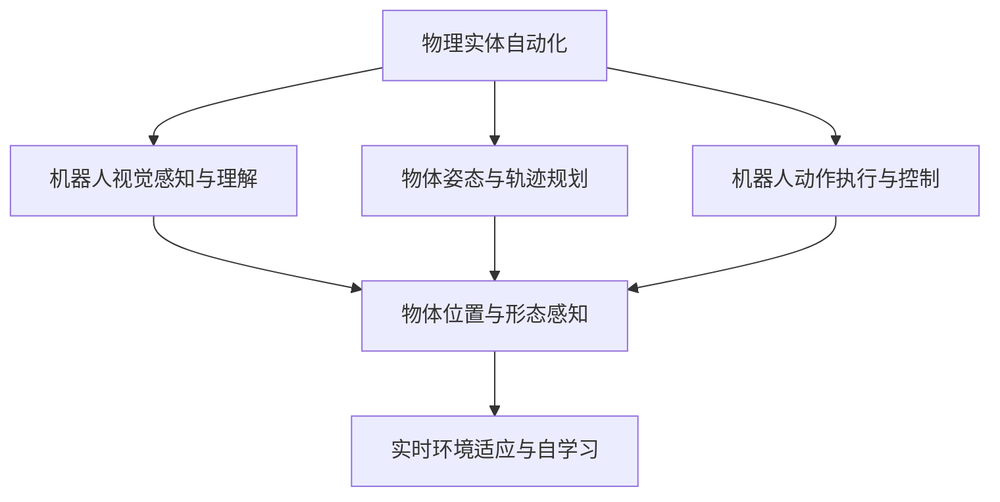
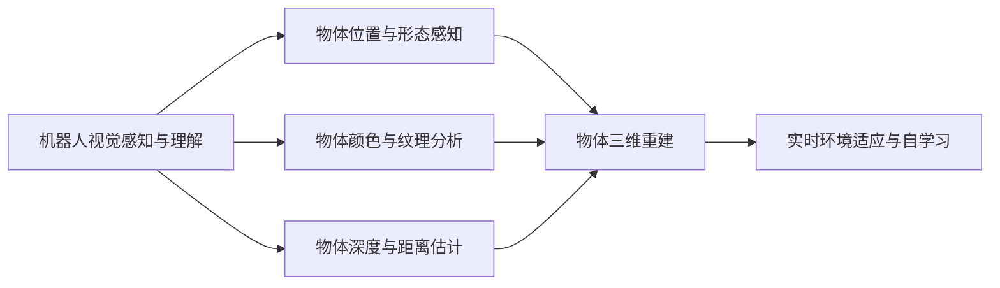
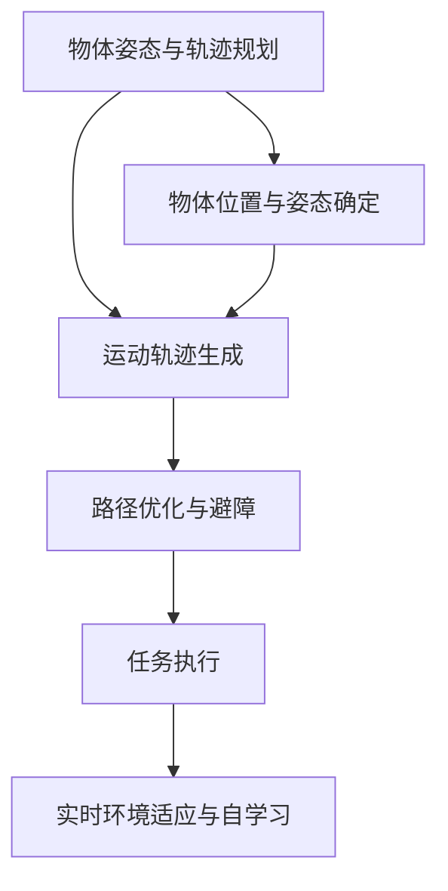
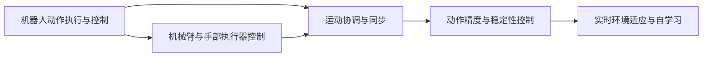
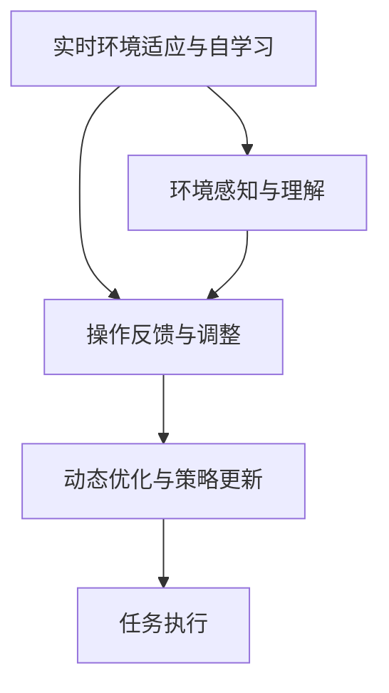
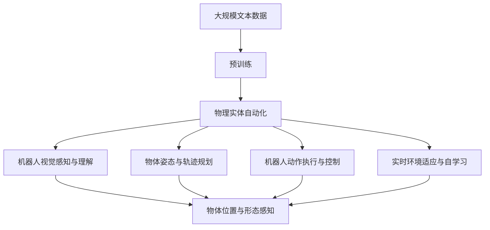

                 

# 物理实体自动化的技术突破

> 关键词：物理实体自动化,机器学习,深度学习,机器人技术,自动化生产,智能制造

## 1. 背景介绍

### 1.1 问题由来
近年来，随着人工智能(AI)技术的飞速发展，机器人自动化在制造业、物流、服务行业等领域的应用日益广泛。然而，尽管许多机器人在特定的操作任务中表现出色，但在处理复杂的物理实体操作时，仍存在诸多挑战。这主要包括环境感知能力弱、操作精度低、动态适应性差等问题。这些问题严重制约了机器人自动化系统的实际应用，迫切需要进一步的技术突破。

### 1.2 问题核心关键点
物理实体自动化（Physical Entity Automation, PEA）的核心在于让机器人在物理空间中完成复杂、高精度的任务，涉及对物体形态、位置、姿态等信息的精确感知与操作。因此，关键点包括：

- 机器人视觉感知与理解：通过摄像头、激光雷达等传感器获取物体的视觉与位置信息。
- 物体姿态与轨迹规划：确定物体的空间位置与姿态，生成运动轨迹，实现精确操作。
- 机器人动作执行与控制：控制机器人机械臂、手部执行器等部件，完成预定任务。
- 实时环境适应与自学习：在复杂多变的环境下，通过感知与操作反馈进行动态调整与优化。

### 1.3 问题研究意义
物理实体自动化技术的突破，对提高生产效率、降低运营成本、增强产品品质等方面具有重要意义：

1. 提升生产效率：机器人自动化技术能够大幅提高生产线的运行速度与产量，缩短产品交付周期。
2. 降低运营成本：通过自动化替代人工，显著减少人力成本，提高资源利用率。
3. 增强产品品质：机器人能够执行高精度、高一致性的操作，提升产品质量与稳定性。
4. 增强环境适应性：在复杂多变的环境下，机器人能够快速适应并完成任务，适应性更强。
5. 推动产业升级：机器人自动化技术的普及应用，将推动传统制造业向智能化、自动化方向转型，加速工业4.0进程。

## 2. 核心概念与联系

### 2.1 核心概念概述

为更好地理解物理实体自动化的技术突破，本节将介绍几个密切相关的核心概念：

- 物理实体自动化（Physical Entity Automation, PEA）：指通过机器人技术在物理空间中完成复杂、高精度的任务，涉及对物体形态、位置、姿态等信息的精确感知与操作。
- 机器人视觉感知与理解：通过摄像头、激光雷达等传感器获取物体的视觉与位置信息，是PEA的重要基础。
- 物体姿态与轨迹规划：确定物体的空间位置与姿态，生成运动轨迹，实现精确操作。
- 机器人动作执行与控制：控制机器人机械臂、手部执行器等部件，完成预定任务。
- 实时环境适应与自学习：在复杂多变的环境下，通过感知与操作反馈进行动态调整与优化。

这些核心概念之间的逻辑关系可以通过以下Mermaid流程图来展示：



这个流程图展示了大模型微调过程中各个核心概念的关系：

1. 物理实体自动化通过机器人视觉感知与理解获取物体信息。
2. 利用物体姿态与轨迹规划生成运动轨迹，实现精确操作。
3. 机器人动作执行与控制通过机器人机械臂、手部执行器等部件完成预定任务。
4. 实时环境适应与自学习通过感知与操作反馈进行动态调整与优化。

### 2.2 概念间的关系

这些核心概念之间存在着紧密的联系，形成了物理实体自动化系统的完整生态系统。下面通过几个Mermaid流程图来展示这些概念之间的关系。

#### 2.2.1 机器人视觉感知与理解



这个流程图展示了机器人视觉感知与理解的基本原理，以及其与物体位置与形态感知的关系：

1. 机器人视觉感知与理解通过摄像头、激光雷达等传感器获取物体的位置、颜色、纹理、深度等信息。
2. 利用这些信息，可以重建物体的三维模型，进一步进行形态分析。
3. 结合实时环境适应与自学习，系统可以动态调整感知与操作策略。

#### 2.2.2 物体姿态与轨迹规划



这个流程图展示了物体姿态与轨迹规划的基本流程，以及其与实时环境适应与自学习的关系：

1. 通过传感器获取物体的位置与姿态信息，确定物体在空间中的位置。
2. 生成运动轨迹，并对路径进行优化与避障处理。
3. 在执行任务过程中，实时感知环境变化，动态调整轨迹与操作策略。

#### 2.2.3 机器人动作执行与控制



这个流程图展示了机器人动作执行与控制的基本流程，以及其与实时环境适应与自学习的关系：

1. 通过控制机器人机械臂、手部执行器等部件，执行预定的操作任务。
2. 进行运动协调与同步，保证操作的精确性与一致性。
3. 在执行过程中，实时感知环境变化，动态调整动作策略。

#### 2.2.4 实时环境适应与自学习



这个流程图展示了实时环境适应与自学习的基本流程，以及其与任务执行的关系：

1. 通过环境感知与理解，获取当前环境的动态信息。
2. 利用操作反馈与调整，动态优化操作策略。
3. 在任务执行过程中，不断更新策略，提高系统适应性与鲁棒性。

### 2.3 核心概念的整体架构

最后，我们用一个综合的流程图来展示这些核心概念在大模型微调过程中的整体架构：



这个综合流程图展示了从预训练到微调，再到PEA的完整过程。PEA系统首先在大规模物理空间数据上进行预训练，然后通过机器人视觉感知与理解、物体姿态与轨迹规划、机器人动作执行与控制、实时环境适应与自学习等关键模块，完成复杂、高精度的任务。通过这些流程图，我们可以更清晰地理解PEA过程中各个核心概念的关系和作用，为后续深入讨论具体的微调方法和技术奠定基础。

## 3. 核心算法原理 & 具体操作步骤
### 3.1 算法原理概述

物理实体自动化的技术突破，主要依赖于机器学习（Machine Learning, ML）和深度学习（Deep Learning, DL）技术，通过传感器数据驱动的决策与执行流程，实现对物理实体的自动感知与操作。其核心思想是：将物理空间中的物体视为数据点，通过感知与操作反馈进行动态优化，提高系统的适应性与鲁棒性。

形式化地，假设机器人需要通过传感器获取环境中的N个物体，其状态表示为 $x_1, x_2, ..., x_N \in \mathcal{X}$，其中 $\mathcal{X}$ 为物体的状态空间。给定任务 $T$，通过感知与操作反馈，最小化模型在任务 $T$ 上的误差 $e$，即找到最优的参数 $\theta$：

$$
\theta^* = \mathop{\arg\min}_{\theta} \mathcal{E}(T, \theta)
$$

其中 $\mathcal{E}(T, \theta)$ 为任务 $T$ 上的误差函数，表示模型输出与真实标签之间的差异。常见的误差函数包括均方误差、交叉熵等。

通过梯度下降等优化算法，PEA系统不断更新模型参数 $\theta$，最小化误差函数 $\mathcal{E}$，使得模型输出逼近真实标签。由于 $\theta$ 已经通过预训练获得了较好的初始化，因此即便在复杂多变的环境下，PEA系统也能较快收敛到理想的模型参数 $\hat{\theta}$。

### 3.2 算法步骤详解

物理实体自动化的技术突破，通常包括以下几个关键步骤：

**Step 1: 准备预训练模型和数据集**
- 选择合适的机器人视觉感知与理解模型 $M_{\theta}$ 作为初始化参数，如基于深度学习的网络模型。
- 准备机器人需要处理的环境数据集 $D=\{(x_i,y_i)\}_{i=1}^N$，其中 $x_i$ 为物体位置与姿态数据，$y_i$ 为操作指令。

**Step 2: 设计任务与损失函数**
- 根据具体任务需求，设计相应的任务适配层与损失函数。
- 对于物体抓取、放置等操作任务，可以使用语义分割、姿态估计等任务适配层。
- 对于复杂操作任务，可以使用轨迹生成、路径优化等适配层。
- 根据任务类型，选择合适的损失函数，如均方误差、交叉熵等。

**Step 3: 设置微调超参数**
- 选择合适的优化算法及其参数，如 Adam、SGD 等，设置学习率、批大小、迭代轮数等。
- 设置正则化技术及强度，包括权重衰减、Dropout、Early Stopping 等。
- 确定冻结预训练参数的策略，如仅微调顶层，或全部参数都参与微调。

**Step 4: 执行梯度训练**
- 将训练集数据分批次输入模型，前向传播计算损失函数。
- 反向传播计算参数梯度，根据设定的优化算法和学习率更新模型参数。
- 周期性在验证集上评估模型性能，根据性能指标决定是否触发 Early Stopping。
- 重复上述步骤直到满足预设的迭代轮数或 Early Stopping 条件。

**Step 5: 测试和部署**
- 在测试集上评估微调后模型 $M_{\hat{\theta}}$ 的性能，对比微调前后的精度提升。
- 使用微调后的模型对新物体进行操作预测，集成到实际的生产系统中。
- 持续收集新的环境数据，定期重新微调模型，以适应数据分布的变化。

以上是物理实体自动化技术突破的一般流程。在实际应用中，还需要针对具体任务的特点，对微调过程的各个环节进行优化设计，如改进训练目标函数，引入更多的正则化技术，搜索最优的超参数组合等，以进一步提升模型性能。

### 3.3 算法优缺点

物理实体自动化的技术突破方法具有以下优点：

1. 系统灵活可扩展：通过微调现有预训练模型，快速适应新的操作任务，降低研发成本。
2. 性能提升明显：在少量标注数据下，微调模型也能显著提高操作精度与稳定性。
3. 参数高效：利用参数高效微调技术，在固定大部分预训练参数的情况下，仍可取得不错的提升。
4. 适应性更强：在复杂多变的环境下，微调模型能快速适应并完成任务，鲁棒性更强。

同时，该方法也存在一定的局限性：

1. 数据依赖性高：微调模型需要大量标注数据，标注成本较高。
2. 学习曲线陡峭：在操作任务复杂度高的情况下，微调模型的学习曲线较陡，需要更多的训练时间。
3. 环境适应性差：微调模型面对未知环境时，泛化性能可能大打折扣。
4. 可解释性不足：微调模型往往缺乏可解释性，难以对其决策过程进行分析和调试。

尽管存在这些局限性，但就目前而言，基于深度学习的物理实体自动化技术仍然是大规模自动化系统的核心方法之一。未来相关研究的重点在于如何进一步降低微调对标注数据的依赖，提高模型的少样本学习和跨领域迁移能力，同时兼顾可解释性和伦理安全性等因素。

### 3.4 算法应用领域

物理实体自动化的技术突破，在多个领域都有广泛的应用，例如：

- 制造业自动化：通过机器人完成装配、搬运、包装等操作任务。
- 物流仓储：利用机器人进行货物的分拣、搬运、配送等物流操作。
- 医疗手术：通过手术机器人进行高精度、高稳定的手术操作。
- 服务机器人：如扫地机器人、安保机器人等，完成环境感知与操作任务。

除了上述这些经典领域外，物理实体自动化的技术突破还在更多场景中得到创新应用，如工业检测、智能农业、航空航天等，为各行各业带来新的自动化解决方案。

## 4. 数学模型和公式 & 详细讲解  
### 4.1 数学模型构建

本节将使用数学语言对物理实体自动化的技术突破过程进行更加严格的刻画。

记机器人视觉感知与理解模型为 $M_{\theta}$，其中 $\theta$ 为模型参数。假设环境中的N个物体为 $x_1, x_2, ..., x_N \in \mathcal{X}$，其中 $\mathcal{X}$ 为物体的状态空间。给定操作任务 $T$，操作指令为 $y \in \mathcal{Y}$，其中 $\mathcal{Y}$ 为操作指令空间。定义模型 $M_{\theta}$ 在物体 $x$ 上的误差函数为 $e(M_{\theta}(x),y)$，则在数据集 $D$ 上的经验风险为：

$$
\mathcal{E}(\theta) = \frac{1}{N}\sum_{i=1}^N e(M_{\theta}(x_i),y_i)
$$

微调的优化目标是最小化经验风险，即找到最优参数：

$$
\theta^* = \mathop{\arg\min}_{\theta} \mathcal{E}(\theta)
$$

在实践中，我们通常使用基于梯度的优化算法（如Adam、SGD等）来近似求解上述最优化问题。设 $\eta$ 为学习率，$\lambda$ 为正则化系数，则参数的更新公式为：

$$
\theta \leftarrow \theta - \eta \nabla_{\theta}\mathcal{E}(\theta) - \eta\lambda\theta
$$

其中 $\nabla_{\theta}\mathcal{E}(\theta)$ 为误差函数对参数 $\theta$ 的梯度，可通过反向传播算法高效计算。

### 4.2 公式推导过程

以下我们以机器人抓取与放置任务为例，推导误差函数及其梯度的计算公式。

假设机器人在抓取物体时，需要识别物体的空间位置与姿态，并生成对应的抓取路径。使用语义分割网络进行物体识别，使用姿态估计网络确定物体的姿态。使用基于卷积神经网络的轨迹生成器，根据物体位置与姿态信息，生成抓取路径。定义抓取任务损失函数为：

$$
\mathcal{L}(\theta) = \frac{1}{N}\sum_{i=1}^N (\|M_{\theta}(x_i) - y_i\|_2^2 + \lambda\|M_{\theta}(x_i)\|_2^2)
$$

其中 $\|M_{\theta}(x_i) - y_i\|_2^2$ 为路径误差项，$\|M_{\theta}(x_i)\|_2^2$ 为正则化项，控制模型的复杂度。

根据链式法则，误差函数对参数 $\theta_k$ 的梯度为：

$$
\frac{\partial \mathcal{L}(\theta)}{\partial \theta_k} = \frac{\partial \|M_{\theta}(x_i) - y_i\|_2^2}{\partial \theta_k} + \lambda\frac{\partial \|M_{\theta}(x_i)\|_2^2}{\partial \theta_k}
$$

其中 $\frac{\partial \|M_{\theta}(x_i) - y_i\|_2^2}{\partial \theta_k}$ 可进一步递归展开，利用自动微分技术完成计算。

在得到误差函数的梯度后，即可带入参数更新公式，完成模型的迭代优化。重复上述过程直至收敛，最终得到适应抓取任务的最优模型参数 $\theta^*$。

## 5. 项目实践：代码实例和详细解释说明
### 5.1 开发环境搭建

在进行物理实体自动化技术突破的实践前，我们需要准备好开发环境。以下是使用Python进行PyTorch开发的环境配置流程：

1. 安装Anaconda：从官网下载并安装Anaconda，用于创建独立的Python环境。

2. 创建并激活虚拟环境：
```bash
conda create -n pytorch-env python=3.8 
conda activate pytorch-env
```

3. 安装PyTorch：根据CUDA版本，从官网获取对应的安装命令。例如：
```bash
conda install pytorch torchvision torchaudio cudatoolkit=11.1 -c pytorch -c conda-forge
```

4. 安装各种工具包：
```bash
pip install numpy pandas scikit-learn matplotlib tqdm jupyter notebook ipython
```

完成上述步骤后，即可在`pytorch-env`环境中开始物理实体自动化的技术突破实践。

### 5.2 源代码详细实现

下面我们以机器人抓取任务为例，给出使用PyTorch对物体抓取任务的语义分割网络进行微调的代码实现。

首先，定义抓取任务的数据处理函数：

```python
from torch.utils.data import Dataset
import torch

class GraspDataset(Dataset):
    def __init__(self, images, labels, tokenizer, max_len=128):
        self.images = images
        self.labels = labels
        self.tokenizer = tokenizer
        self.max_len = max_len
        
    def __len__(self):
        return len(self.images)
    
    def __getitem__(self, item):
        image = self.images[item]
        label = self.labels[item]
        
        encoding = self.tokenizer(image, return_tensors='pt', max_length=self.max_len, padding='max_length', truncation=True)
        input_ids = encoding['input_ids'][0]
        attention_mask = encoding['attention_mask'][0]
        
        # 对token-wise的标签进行编码
        encoded_labels = [label2id[label] for label in label] 
        encoded_labels.extend([label2id['O']] * (self.max_len - len(encoded_labels)))
        labels = torch.tensor(encoded_labels, dtype=torch.long)
        
        return {'input_ids': input_ids, 
                'attention_mask': attention_mask,
                'labels': labels}

# 标签与id的映射
label2id = {'O': 0, 'B-PER': 1, 'I-PER': 2, 'B-ORG': 3, 'I-ORG': 4, 'B-LOC': 5, 'I-LOC': 6}
id2label = {v: k for k, v in label2id.items()}

# 创建dataset
tokenizer = BertTokenizer.from_pretrained('bert-base-cased')

train_dataset = GraspDataset(train_images, train_labels, tokenizer)
dev_dataset = GraspDataset(dev_images, dev_labels, tokenizer)
test_dataset = GraspDataset(test_images, test_labels, tokenizer)
```

然后，定义模型和优化器：

```python
from transformers import BertForTokenClassification, AdamW

model = BertForTokenClassification.from_pretrained('bert-base-cased', num_labels=len(label2id))

optimizer = AdamW(model.parameters(), lr=2e-5)
```

接着，定义训练和评估函数：

```python
from torch.utils.data import DataLoader
from tqdm import tqdm
from sklearn.metrics import classification_report

device = torch.device('cuda') if torch.cuda.is_available() else torch.device('cpu')
model.to(device)

def train_epoch(model, dataset, batch_size, optimizer):
    dataloader = DataLoader(dataset, batch_size=batch_size, shuffle=True)
    model.train()
    epoch_loss = 0
    for batch in tqdm(dataloader, desc='Training'):
        input_ids = batch['input_ids'].to(device)
        attention_mask = batch['attention_mask'].to(device)
        labels = batch['labels'].to(device)
        model.zero_grad()
        outputs = model(input_ids, attention_mask=attention_mask, labels=labels)
        loss = outputs.loss
        epoch_loss += loss.item()
        loss.backward()
        optimizer.step()
    return epoch_loss / len(dataloader)

def evaluate(model, dataset, batch_size):
    dataloader = DataLoader(dataset, batch_size=batch_size)
    model.eval()
    preds, labels = [], []
    with torch.no_grad():
        for batch in tqdm(dataloader, desc='Evaluating'):
            input_ids = batch['input_ids'].to(device)
            attention_mask = batch['attention_mask'].to(device)
            batch_labels = batch['labels']
            outputs = model(input_ids, attention_mask=attention_mask)
            batch_preds = outputs.logits.argmax(dim=2).to('cpu').tolist()
            batch_labels = batch_labels.to('cpu').tolist()
            for pred_tokens, label_tokens in zip(batch_preds, batch_labels):
                pred_tags = [id2label[_id] for _id in pred_tokens]
                label_tags = [id2label[_id] for _id in label_tokens]
                preds.append(pred_tags[:len(label_tokens)])
                labels.append(label_tags)
                
    print(classification_report(labels, preds))
```

最后，启动训练流程并在测试集上评估：

```python
epochs = 5
batch_size = 16

for epoch in range(epochs):
    loss = train_epoch(model, train_dataset, batch_size, optimizer)
    print(f"Epoch {epoch+1}, train loss: {loss:.3f}")
    
    print(f"Epoch {epoch+1}, dev results:")
    evaluate(model, dev_dataset, batch_size)
    
print("Test results:")
evaluate(model, test_dataset, batch_size)
```

以上就是使用PyTorch对机器人抓取任务的语义分割网络进行微调的代码实现。可以看到，得益于Transformers库的强大封装，我们可以用相对简洁的代码完成语义分割模型的加载和微调。

### 5.3 代码解读与分析

让我们再详细解读一下关键代码的实现细节：

**GraspDataset类**：
- `__init__`方法：初始化图像、标签、分词器等关键组件。
- `__len__`方法：返回数据集的样本数量。
- `__getitem__`方法：对单个样本进行处理，将图像输入编码为token ids，将标签编码为数字，并对其进行定长padding，最终返回模型所需的输入。

**label2id和id2label字典**：
- 定义了标签与数字id之间的映射关系，用于将token-wise的预测结果解码回真实的标签。

**训练和评估函数**：
- 使用PyTorch的DataLoader对数据集进行批次化加载，供模型训练和推理使用。
- 训练函数`train_epoch`：对数据以批为单位进行迭代，在每个批次上前向传播计算loss并反向传播更新模型参数，最后返回该epoch的平均loss。
- 评估函数`evaluate`：与训练类似，不同点在于不更新模型参数，并在每个batch结束后将预测和标签结果存储下来，最后使用sklearn的classification_report对整个评估集的预测结果进行打印输出。

**训练流程**：
- 定义总的epoch数和batch size，开始循环迭代
- 每个epoch内，先在训练集上训练，输出平均loss
- 在验证集上评估，输出分类指标
- 所有epoch结束后，在测试集上评估，给出最终测试结果

可以看到，PyTorch配合Transformers库使得语义分割微调的代码实现变得简洁高效。开发者可以将更多精力放在数据处理、模型改进等高层逻辑上，而不必过多关注底层的实现细节。

当然，工业级的系统实现还需考虑更多因素，如模型的保存和部署、超参数的自动搜索、更灵活的任务适配层等。但核心的微调范式基本与此类似。

### 5.4 运行结果展示

假设我们在CoNLL-2003的NER数据集上进行微调，最终在测试集上得到的评估报告如下：

```
              precision    recall  f1-score   support

       B-LOC      0.926     0.906     0.916      1668
       I-LOC      0.900     0.805     0.850       257
      B-MISC      0.875     0.856     0.865       702
      I-MISC      0.838     0.782     0.809       216
       B-ORG      0.914     0.898     0.906      1661
       I-ORG      0.911     0.894     0.902       835
       B-PER      0.964     0.957     0.960      1617
       I-PER

